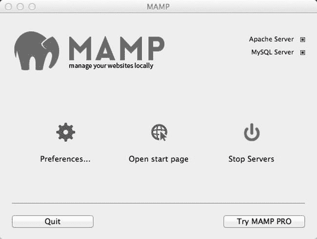
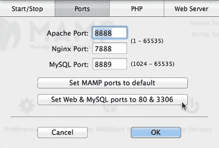
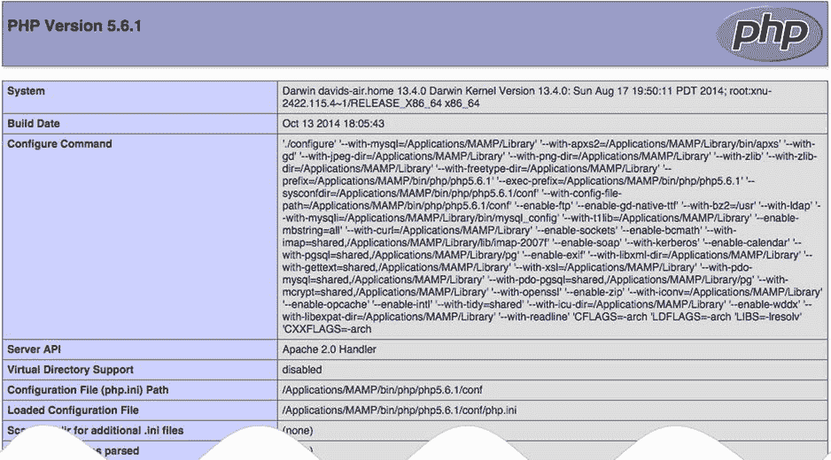

# 独立组件还是一体化集成包？

多年来，我一直主张分别安装 PHP 测试环境的各个组件，而不推荐使用一次性安装 Apache、PHP、MySQL 和 phpMyAdmin 的集成包。我的建议基于早期一些集成包的品质问题，它们安装简单但几乎无法卸载或升级。不过，目前市面上的集成包质量极佳，我现在毫不犹豫地推荐使用它们。

在我的电脑上，Windows 系统使用 `XAMPP`（[www.apachefriends.org/index.html](http://www.apachefriends.org/index.html)），Mac OS X 系统使用 `MAMP`（[www.mamp.info/en/](http://www.mamp.info/en/)）。其他集成包也可用，选择哪个并不重要。

**提示**

使用集成包搭建 PHP 测试环境通常毫无问题。主要困难在于与使用端口 80 的其他程序发生冲突，该端口是 Web 服务器用于监听页面请求的。如果安装了 Skype，请进入 **工具** ➤ **选项** ➤ **高级** ➤ **连接**，确保端口 80 未被用于传入连接。可改用端口 33087。

## 在 Windows 上搭建环境

在继续操作前，请确保以管理员身份登录。

### 让 Windows 显示文件扩展名

默认情况下，大多数 Windows 计算机会隐藏文件扩展名（如 `.doc` 或 `.html`），因此在对话框和 Windows 文件资源管理器中只能看到 `thisfile`，而非 `thisfile.doc` 或 `thisfile.html`。Windows 8 会显示 PHP 文件的扩展名，但建议对所有文件开启扩展名显示。在 Windows 7 中，这是使用 PHP 必备操作。

按以下步骤在 Windows 8 中启用文件扩展名显示：

- 打开文件资源管理器。
- 选择 **查看** 以展开文件资源管理器窗口顶部的功能区。
- 勾选“文件扩展名”复选框。

在 Windows 7 中按以下步骤操作：

- 打开 **开始** ➤ **计算机**。
- 选择 **组织** ➤ **文件夹和搜索选项**。
- 在打开的对话框中选择 **查看** 选项卡。
- 在 **高级设置** 部分，取消勾选“隐藏已知文件类型的扩展名”。
- 点击 **确定**。

显示文件扩展名更安全——你可以识别病毒编写者是否将 `.exe` 或 `.scr` 可执行文件附加在看似无害的文档上。

### 选择 Web 服务器

大多数 PHP 安装运行在 Apache Web 服务器上。两者均为开源且协同良好。不过，Windows 自带 Web 服务器 Internet Information Services（IIS），也支持 PHP。微软与 PHP 开发团队密切合作，将 PHP 在 IIS 上的性能提升至与 Apache 大致相当。那么，该如何选择？

答案取决于你是否使用 ASP 或 ASP.NET 开发网页，或计划这样做。ASP 和 ASP.NET 需要 IIS。你可以将 Apache 与 IIS 安装在同一台电脑上，但两者都监听端口 80 的请求。无法在同一端口上同时运行两个服务器。

除非你需要 IIS 用于 ASP 或 ASP.NET，否则我建议使用 `XAMPP` 或其他集成包安装 Apache，详见下一节。如果需要使用 IIS，最便捷的方式是通过 Microsoft Web Platform Installer（Web PI）安装 PHP，可从 [www.microsoft.com/web/downloads/platform.aspx](http://www.microsoft.com/web/downloads/platform.aspx) 下载。

### 在 Windows 上安装集成包

Windows 上有三种流行的集成包可在一次操作中安装 Apache、PHP、MySQL、phpMyAdmin 及其他工具：`XAMPP`（[www.apachefriends.org/index.html](http://www.apachefriends.org/index.html)）、`WampServer`（[www.wampserver.com/en/](http://www.wampserver.com/en/)）和 `EasyPHP`（[www.easyphp.org](http://www.easyphp.org/)）。安装过程通常只需几分钟。安装完成后，你可能需要更改一些设置，本章后续将说明。

印刷书籍出版周期内版本可能发生变化，因此我不描述具体安装流程。每个包在其网站上均有说明。David Gassner 在 lynda.com 上的《安装 Apache、MySQL 和 PHP》课程中也有关于 `WampServer` 和 `XAMPP` 设置的有用视频。尽管 lynda.com 是订阅服务，但在撰写本文时，该课程的所有视频即使非订阅用户也可免费观看（[www.lynda.com/Apache-HTTP-Server-tutorials/Installing-Apache-MySQL-PHP/77958-2.html](http://www.lynda.com/Apache-HTTP-Server-tutorials/Installing-Apache-MySQL-PHP/77958-2.html)）。

## 在 Mac OS X 上搭建环境

Apache Web 服务器和 PHP 已预装在 Mac OS X 上，但默认未启用。我建议使用 `MAMP` 而非预装版本，它可一次性安装 Apache、PHP、MySQL、phpMyAdmin 及其他工具。

为避免与预装的 Apache 和 PHP 版本冲突，`MAMP` 将所有应用程序存放在硬盘的专用文件夹中。这样，如果决定不再需要 `MAMP`，只需将 `MAMP` 文件夹拖入废纸篓即可轻松卸载所有内容。

### 安装 MAMP

开始前，请确保以管理员权限登录电脑。

1. 访问 [www.mamp.info/en/downloads/](http://www.mamp.info/en/downloads/)，选择 **MAMP & MAMP PRO** 的链接。这将下载包含 `MAMP` 免费版和付费版的磁盘映像。
2. 下载完成后，启动磁盘映像。你将看到许可协议。必须点击 **同意** 才能继续挂载磁盘映像。
3. 按照屏幕指示操作。
4. 确认 `MAMP` 已安装在 **应用程序** 文件夹中。

**注意**

`MAMP` 会自动将免费版和付费版分别安装在名为 `MAMP` 和 `MAMP PRO` 的独立文件夹中。付费版更便于配置 PHP 和处理虚拟主机，但免费版完全够用，尤其适合初学者。如需删除 `MAMP PRO` 文件夹，请勿直接拖入废纸篓。请打开文件夹并双击 `MAMP PRO` 卸载图标。付费版需要保留两个文件夹。

### 测试和配置 MAMP

默认情况下，MAMP 为 Apache 和 MySQL 使用非标准端口。除非你在运行多个 Apache 和 MySQL 实例，否则应该修改端口设置。

双击 `Applications/MAMP` 中的 MAMP 图标。你的默认浏览器应启动并显示 MAMP 欢迎页面。请注意，浏览器地址栏中的 URL 以 `localhost:8888` 开头。`:8888` 表示 Apache 正在非标准端口 8888 上监听请求。

最小化浏览器，找到 MAMP 控制面板（见图 2-1），它应正在你的桌面上运行。Apache Server 和 MySQL Server 右侧的绿色小灯表示两个服务器都在运行。

点击“偏好设置”图标，然后在打开的窗口顶部选择“端口”。它显示 Apache 和 MySQL 分别在端口 8888 和 8889 上运行（见图 2-2）。



图 2-1. MAMP 控制面板

点击“将 Web 和 MySQL 端口设置为 80 和 3306”，如图 2-2 所示。端口号将更改为标准端口：Apache 为 80，MySQL 为 3306。



图 2-2. 修改 Apache 和 MySQL 端口

> **注意：** MAMP 现在支持将 Nginx 作为备选 Web 服务器。当我点击“将 Web 和 MySQL 端口设置为 80 和 3306”时，Apache Port 和 Nginx Port 都变成了 80，这会导致设置无法被接受。如果发生这种情况，请手动将 Nginx Port 重置为 7888。

点击“确定”，并在系统提示时输入你的 Mac 密码。MAMP 会重新启动两个服务器。

> **提示：** 如果任何其他程序正在使用端口 80，Apache 将无法重启。如果你找不到是什么阻止了 Apache 使用端口 80，请打开 MAMP 偏好设置面板，然后点击“将 MAMP 端口设置为默认值”。

当两个指示灯再次变为绿色时，点击 MAMP 控制面板中的“打开起始页”。这会重新在浏览器中加载 MAMP 欢迎页面。这次，URL 中 `localhost` 后面不应再跟有冒号和数字，因为 Apache 正在默认端口上监听。

## 你的 PHP 文件应放在哪里（Windows 和 Mac）

你需要将文件创建在 Web 服务器能够处理它们的位置。通常，这意味着文件应放在服务器的文档根目录或文档根目录的子文件夹中。最常见配置的文档根目录默认位置如下：

*   XAMPP：`C:\xampp\htdocs`
*   WampServer：`C:\wamp\www`
*   EasyPHP：`C:\EasyPHP\www`
*   IIS：`C:\inetpub\wwwroot`
*   MAMP：`Macintosh HD:Applications:MAMP:htdocs`

要查看 PHP 页面，你需要在浏览器中使用 URL 加载它。在本地测试环境中，Web 服务器文档根目录的 URL 是 `http://localhost/`。

> **警告：** 如果你需要将 MAMP 重置为默认端口，则必须使用 `http://localhost:8888` 代替 `http://localhost`。

如果你将本书的文件存储在文档根目录下名为 `phpsols` 的子文件夹中，那么 URL 将是 `http://localhost/phpsols/` 后跟文件夹名（如果有的话）和文件名。

> **提示：** 如果你使用 `http://localhost/` 时遇到问题，请改用 `http://127.0.0.1/`。`127.0.0.1` 是所有计算机用于引用本机的回环 IP 地址。

### 使用虚拟主机

除了将你的 PHP 文件存储在 Web 服务器的文档根目录之外，另一种选择是使用虚拟主机。虚拟主机为每个站点创建一个唯一的地址，这也是托管公司管理共享主机的方式。MAMP PRO 通过其控制面板简化了虚拟主机的设置。EasyPHP 也有一个用于管理虚拟主机的插件模块。

手动设置虚拟主机需要编辑计算机的一个系统文件，以在本地机器上注册主机名。你还需要告诉本地测试环境中的 Web 服务器文件的位置。这个过程并不困难，但每次设置新的虚拟主机时都需要执行一次。

在虚拟主机中设置每个站点的好处在于，它能更准确地匹配真实网站的结构。然而，在学习 PHP 时，使用测试服务器文档根目录下的子文件夹可能更方便。一旦你获得了 PHP 经验，就可以进阶使用虚拟主机。关于如何在 Apache 中手动设置虚拟主机的说明，请访问我网站上的以下地址：

*   Windows：`http://foundationphp.com/tutorials/apache_vhosts.php`
*   MAMP：`http://foundationphp.com/tutorials/vhosts_mamp.php`

> **提示：** 请记得先启动测试环境中的 Web 服务器，然后再查看 PHP 页面。

## 检查你的 PHP 设置

安装 PHP 后，最好检查一下它的配置设置。除了核心功能外，PHP 还有大量可选扩展。本书所用的一体化安装包和 Microsoft Web PI 都会安装所有需要的扩展。但有些基本配置设置可能略有不同。为避免意外问题，请调整你的 PHP 配置，使其与下页建议的设置保持一致。

### 使用 `phpinfo()` 显示服务器配置

PHP 有一个内置命令 `phpinfo()`，用于显示 PHP 在服务器上的配置详情。`phpinfo()` 产生的信息量可能会让人感觉信息过载，但对于确定为何某些功能在本地计算机上运行完美，而在实际网站上却无法运行，它却是无价之宝。问题通常在于远程服务器禁用了某个功能，或者没有安装可选扩展。

集成软件包使得运行 `phpinfo()` 变得很简单：

*   XAMPP：点击 XAMPP 欢迎屏幕左侧菜单中的 `phpinfo` 链接。
*   MAMP：点击 MAMP 启动页面顶部主菜单中的 `phpinfo`。
*   WampServer：打开 WampServer 菜单，点击 Localhost。`phpinfo()` 的链接位于“工具”下方。

或者，按照以下说明创建一个简单的测试文件，并在浏览器中加载它：

确保 Apache 或 IIS 在本地计算机上正在运行。在脚本编辑器中输入以下内容：

```php
<?php phpinfo(); ?>
```

文件中不应有其他任何内容。

将文件命名为 `phpinfo.php`，并保存在服务器的文档根目录下（请参阅本章前面的“在哪里放置你的 PHP 文件（Windows 和 Mac）”）。

**注意**

确保你的编辑器不会在 `.php` 后面添加 `.txt` 或 `.rtf` 扩展名。

在浏览器地址栏中输入 `http://localhost/phpinfo.php` 并按下回车键。你应该会看到一个类似于图 2-3 的页面，显示 PHP 版本，然后是 PHP 配置的详细信息。记下“已加载配置文件”项的值。这会告诉你 `php.ini` 的位置，`php.ini` 是你需要编辑以更改 PHP 多数设置的文本文件。滚动到标记为“Core”的部分，并将设置与表 2-1 中的推荐设置进行比较。记下任何不同之处，以便你可以按照本章后文所述进行更改。



**图 2-3.** 运行 `phpinfo()` 命令会显示 PHP 配置的完整详细信息

配置页面的其余部分显示哪些 PHP 扩展已被启用。尽管页面看起来没完没了，但所有扩展在 Core 之后都按字母顺序列出。要配合本书阅读，请确保已启用以下扩展：

**表 2-1.** 推荐的 PHP 配置设置

| 指令 | 本地值 | 备注 |
| --- | --- | --- |
| `display_errors` | On | 对于调试脚本中的错误至关重要。如果设置为 Off，错误会导致完全空白的屏幕，让你对可能的原因毫无头绪。 |
| `error_reporting` | 32767 | 这将错误报告设置为最高级别。 |
| `file_uploads` | On | 允许你使用 PHP 将文件上传到网站。 |
| `log_errors` | Off | 当 `display_errors` 设置为 On 时，你不需要用错误日志填满硬盘。 |

*   `gd`：使 PHP 能够生成和修改图像及字体。
*   `mysqli`：连接到 MySQL（注意其中的“i”，代表“improved”，用于将此扩展与旧的 `mysql` 扩展区分开来，后者不应再使用）。
*   `PDO`：为数据库提供软件中立的支持（可选）。
*   `pdo_mysql`：连接到 MySQL 的替代方法（可选）。
*   `session`：会话维护与用户关联的信息，并用于用户身份验证等功能。

你还应该在你的远程服务器上运行 `phpinfo()`，以检查哪些功能已启用。如果列出的扩展不受支持，当你将文件上传到网站时，本书中的某些代码将无法运行。在共享主机上，`PDO` 和 `pdo_mysql` 并不总是启用，但你可以改用 `mysqli`。`PDO` 的优势在于它是软件中立的，因此你可以仅通过更改一两行代码，就能让脚本适配 MySQL 以外的数据库。而使用 `mysqli` 则会让你绑定在 MySQL 上。

如果你的设置中的任何 Core 设置与表 2-1 中的推荐设置不同，你将需要按照下一节所述编辑 PHP 配置文件 `php.ini`。

### 编辑 `php.ini`

PHP 配置文件 `php.ini` 是一个非常长的文件，这常常会让编程新手感到紧张，但其实没什么可担心的。它是以纯文本编写的，文件长的其中一个原因是因为它包含了大量解释各种选项的注释。话虽如此，在编辑 `php.ini` 之前最好做一个备份，以防出错。

如何打开 `php.ini` 取决于你的操作系统以及你安装 PHP 的方式：

*   如果你在 Windows 上使用了集成软件包（如 XAMPP），请在 Windows 资源管理器中双击 `php.ini`。该文件将自动在记事本中打开。
*   如果你使用 Microsoft Web PI 安装了 PHP，`php.ini` 通常位于 Program Files 的一个子文件夹中。虽然你可以通过双击打开 `php.ini`，但将无法保存所做的任何更改。相反，请右键单击记事本，然后选择“以管理员身份运行”。（在 Windows 7 中，你需要从“开始”菜单访问记事本，它位于“附件”文件夹中。）在记事本中，选择“文件”➤“打开”，并将选项设置为显示所有文件 (*.*)。导航到 `php.ini` 所在的文件夹，选择该文件，然后单击“打开”。


在 Mac OS X 上，`php.ini` 在 Finder 中显示为一个可执行文件。使用文本编辑器（如 BBEdit 或 TextWrangler，两者均可从 [`www.barebones.com`](http://www.barebones.com/) 获得）打开 `php.ini`。

以分号（`;`）开头的行是注释。你需要编辑的行不以分号开头。

使用文本编辑器的“查找”功能来定位你需要更改的设置，使其与表 2-1 中的推荐设置匹配。大多数指令前面都有一个或多个如何设置它们的示例。确保不要错误地编辑了某个注释掉的示例。

对于使用 `On` 或 `Off` 值的指令，只需将值更改为推荐值即可。例如，如果需要打开错误消息的显示，请编辑以下行：

```
display_errors = Off
```

将其更改为：

```
display_errors = On
```

要设置错误报告级别，你需要使用 PHP 常量，这些常量以大写字母书写，并且区分大小写。该指令应如下所示：

```
error_reporting = E_ALL
```

编辑完 `php.ini` 后，保存文件，然后重新启动 Apache 或 IIS，以使更改生效。如果 Web 服务器无法启动，请检查服务器的错误日志文件。它可以在以下位置找到：

*   XAMPP：在 XAMPP 控制面板中，点击 Apache 旁边的“日志”按钮，然后选择 Apache (error.log)。
*   MAMP：在 Applications:MAMP:logs 中，双击 `apache_error.log` 以在控制台中打开。
*   WampServer：在 WampServer 菜单中，选择 Apache ➤ Apache 错误日志。
*   EasyPHP：右键单击系统托盘中的 EasyPHP 图标，然后选择“日志文件” ➤ Apache。
*   IIS：日志文件的默认位置是 `C:\inetpub\logs`。

错误日志中最新的条目应该能指示出导致服务器无法重启的原因。利用该信息纠正你对 `php.ini` 所做的更改。如果这不起作用，你应该庆幸自己在编辑 `php.ini` 之前做了备份。重新使用一份干净的副本开始，并仔细检查你的编辑。

## 下一步是什么？

既然你已经为 PHP 建立了一个可用的测试环境，你无疑已经跃跃欲试了。我最不想做的就是打击任何积极性，但是在将 PHP 用于实际网站之前，你应该对该语言的规则有一个基本的了解。所以，在跳入那些酷炫内容之前，请先阅读下一章，其中解释了如何编写 PHP 脚本。不要跳过它——这真的非常重要。
