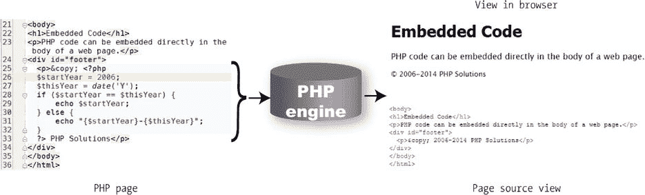

# 3. 如何编写 PHP 脚本

如果你一看到代码就想逃跑，那么这一章可能是你最不喜欢的内容，但它却非常重要，我尽力使其尽可能对用户友好。本章分为两部分：第一部分快速概述 PHP 的工作原理并给出基本规则；第二部分则更详细地展开。

你可以只阅读第一部分，稍后再回来查看更详细的内容，也可以一次性通读本章。不过，不要试图一次性记住所有内容。最好的学习方式是通过实践。每次只回来查看本章第二部分的一点信息，可能会更有效。

如果你已经熟悉 PHP，可以快速浏览主要标题，了解本章内容，并对自己有些模糊的知识点进行复习。

本章涵盖：

*   理解 PHP 的结构

*   在网页中嵌入 PHP

*   在变量和数组中存储数据

*   让 PHP 做出决策

*   循环执行重复任务

*   使用函数执行预设任务

*   理解 PHP 对象和类

*   显示 PHP 输出

*   理解 PHP 错误信息

## PHP：宏观概览

乍一看，PHP 代码可能看起来令人生畏，但一旦你理解了基础知识，就会发现其结构非常简单。如果你曾经使用过其他计算机语言（例如 JavaScript 或 jQuery），你会发现它们有很多共同点。

每个 PHP 页面都必须包含以下内容：

*   正确的文件扩展名，通常是 `.php`

*   包围每个 PHP 代码块的开始和结束 PHP 标签（不过，如果文件只包含 PHP 代码，则可以省略结束 PHP 标签）

一个典型的 PHP 页面会使用以下部分或全部元素：

*   变量，用作未知值或变化值的占位符

*   数组，用于保存多个值

*   条件语句，用于做出决策

*   循环，用于执行重复任务

*   函数或对象，用于执行预设任务

让我们依次快速了解这些内容，先从文件名以及开始和结束标签入手。

### 告诉服务器处理 PHP

PHP 是一种服务器端语言。这意味着 Web 服务器会处理你的 PHP 代码，并仅将结果（通常为 HTML）发送给浏览器。由于所有操作都在服务器上进行，你需要告诉服务器你的页面包含 PHP 代码。这涉及两个简单的步骤，即：

*   为每个页面指定 PHP 文件扩展名；默认扩展名是 `.php`。除非你的托管服务商特别要求，否则不要使用 `.php` 以外的任何扩展名。

*   将所有 PHP 代码括在 PHP 标签内。

开始标签是 `<?php`，结束标签是 `?>`。如果你将标签放在与周围代码同一行，开始标签之前和结束标签之后不需要有空格，但开始标签中的 `php` 之后必须有一个空格，如下所示：

`<p>这是嵌入了 PHP 的 HTML<?php // PHP 代码 ?>.</p>`

当插入多行 PHP 代码时，为清晰起见，最好将开始和结束标签放在单独的行上。

```php
<?php
// PHP 代码
// 更多 PHP 代码
?>
```

你可能会遇到 `<?` 这种开始标签的简写形式。然而，`<?` 并非在所有服务器上都适用。请坚持使用 `<?php`，它保证有效。

注意

为节省篇幅，本书中的大多数示例都省略了 PHP 标签。在编写自己的脚本或将 PHP 嵌入网页时，你必须始终使用它们。

### 在网页中嵌入 PHP

PHP 是一种嵌入式语言。这意味着你可以将 PHP 代码块插入到普通网页中。当有人访问你的网站并请求一个 PHP 页面时，服务器会将其发送给 PHP 引擎，PHP 引擎会从上到下读取页面，寻找 PHP 标签。HTML 会原封不动地通过，但每当 PHP 引擎遇到 `<?php` 标签时，它就会开始处理你的代码，并一直持续到遇到结束的 `?>` 标签。如果 PHP 代码产生了任何输出，它就会在那个位置被插入。

提示

一个页面可以有多个 PHP 代码块，但它们不能彼此嵌套。

图 3-1 显示了一个嵌入在普通网页中的 PHP 代码块，以及它在浏览器中的显示效果和经过 PHP 引擎处理后的页面源代码视图。该代码计算当前年份，检查它是否与一个固定年份（图中左侧代码第 26 行的 `$startYear` 表示）不同，并在版权声明中显示适当的年份范围。从图右下角的页面源代码视图中可以看到，发送给浏览器的内容中没有 PHP 的痕迹。



图 3-1.

PHP 代码保留在服务器上；只有输出被发送到浏览器

提示

PHP 并不总是为浏览器生成直接的输出。例如，它可能先检查表单输入的内容，然后再发送电子邮件或向数据库插入信息。因此，有些代码块被放在主 HTML 代码的上方或下方，或者放在外部文件中。然而，产生直接输出的代码，总是放在你希望显示输出的位置。

### 将 PHP 存储在外部文件中

除了将 PHP 嵌入 HTML 之外，常见的做法是将经常使用的代码存储在单独的文件中。当一个文件只包含 PHP 代码时，开头的 `<?php` 标签是必须的，但结尾的 `?>` 标签是可选的。事实上，推荐的做法是省略结束的 PHP 标签。但是，如果外部文件在 PHP 代码之后包含 HTML，则必须使用结束的 `?>` 标签。