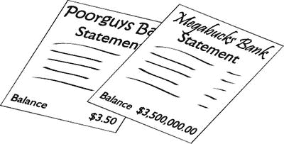
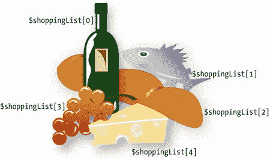
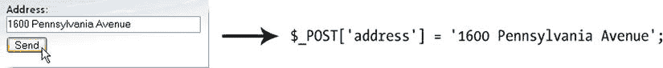
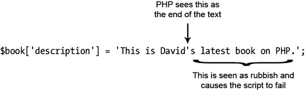

# 使用变量表示变化的值

图 3-1 中的代码看起来像是显示年份范围的一种非常冗长的方式。直接输入实际日期肯定简单得多？是的，确实如此，但从长远来看，PHP 解决方案能为你节省时间。无需每年手动更新版权声明，PHP 代码会自动完成。你只需编写一次代码，之后便可高枕无忧。更重要的是，正如你在下一章将看到的，如果将代码存储在外部文件中，对外部文件所做的任何更改都会反映在网站的每个页面上。

这种自动显示年份的能力依赖于 PHP 的两个关键方面：变量和函数。顾名思义，函数用于执行操作；它们执行预设任务，例如获取当前日期并将其转换为人类可读的格式。稍后我会介绍函数，所以让我们先来看变量。图 3-1 中的脚本包含两个变量：`$startYear` 和 `$thisYear`。

**提示**

变量只是你赋予某个可能变化或你事先未知事物的一个名称。PHP 中的变量总是以 `$`（美元符号）开头。

尽管变量的概念听起来很抽象，但我们在日常生活中一直在使用变量。当你第一次见到某人时，你首先会问的问题之一是"你叫什么名字？"无论你刚认识的人是汤姆、迪克还是哈利，"名字"这个词始终保持不变。同样，对于你的银行账户，资金不断进出（似乎主要是支出），但如图 3-2 所示，无论你是囊中羞涩还是富甲一方，可用金额始终被称为余额。



图 3-2. 银行对账单上的余额是变量的一个日常例子——名称保持不变，即使数值可能每天都在变化

所以，"名字"和"余额"就是日常生活中的变量。只需在它们前面加上美元符号，就得到了两个现成的 PHP 变量，就像这样：

`$name`

`$balance`

很简单。

## 命名变量

你可以选择几乎任何你喜欢的内容作为变量名，只要记住以下规则即可：

- 变量始终以美元符号（`$`）开头。
- 美元符号后的第一个字符不能是数字。
- 不允许有空格或标点符号，下划线（`_`）除外。
- 变量名区分大小写：`$startYear` 和 `$startyear` 不是同一个变量。

在为变量选择名称时，明智的做法是选择一个能说明其用途的名称。你目前看到的变量——`$startYear`、`$thisYear`、`$name` 和 `$balance`——就是很好的例子。由于变量名中不能使用空格，一个好习惯是在组合多个单词时，将第二个及后续单词的首字母大写（有时称为驼峰式命名）。另一种方法是使用下划线（`$start_year`、`$this_year`等）。

从技术上讲，你可以使用下划线作为美元符号后的第一个字符，但不推荐这样做。PHP 预定义变量（例如本章稍后描述的超级全局数组）以下划线开头，因此你可能会意外选择相同的名称，从而给脚本带来问题。

不要试图通过使用非常短的变量来节省时间。使用 `$sy`、`$ty`、`$n` 和 `$b` 而不是更具描述性的名称，会使代码更难理解——从而增加编写难度。更重要的是，这会使错误更难发现。当然，规则总有例外。按照惯例，`$i`、`$j` 和 `$k` 经常用于记录循环运行的次数，而 `$e` 则用于错误检查。你将在本章后面看到这些示例。

**注意**

尽管在变量名的选择上有相当大的自由度，但不能使用 `$this`，因为它在 PHP 面向对象编程中具有特殊含义。还建议避免使用 [`php.net/manual/en/reserved.php`](http://php.net/manual/en/reserved.php) 中列出的任何关键字。

## 为变量赋值

变量从多种来源获取值，包括以下途径：

- 通过在线表单的用户输入
- 数据库
- 外部来源，例如新闻供稿或 XML 文件
- 计算结果
- 直接包含在 PHP 代码中

无论值来自何处，都始终使用等号（`=`）进行赋值，如下所示：

`$variable = value;`

变量放在等号左侧，值放在右侧。因为它负责赋值，所以等号被称为赋值运算符。

**注意**

从小对等号的熟悉使得我们很难改掉认为它表示"等于"的习惯。然而，PHP 使用两个等号（`==`）来表示相等。这是初学者犯错的主要原因，也常常让经验更丰富的开发者措手不及。`=` 和 `==` 之间的区别将在本章后面更详细地介绍。

## 以分号结束命令

PHP 由一系列命令或语句编写而成。每条语句通常告诉 PHP 引擎执行特定操作，并且其后必须始终跟一个分号，如下所示：

```
<?php
执行这个;
现在执行其他操作;
?>
```

与所有规则一样，存在一个例外：如果代码块中只有一条语句，则可以省略分号。但是，不要这样做。与 JavaScript 不同，如果你省略分号，PHP 不会自动假设行尾应该有一个分号。这有一个很好的副作用：你可以将长语句分布在多行上，并为了便于阅读而安排代码的布局。PHP 和 HTML 一样，会忽略代码中的空白。相反，它依靠分号来指示一条命令在何处结束，下一条命令在何处开始。

**提示**

在 PHP 语句（或命令）的末尾使用分号总是正确的。缺少分号会使你的脚本戛然而止。

## 注释脚本

PHP 会将开始和结束 PHP 标签之间的所有内容视为要执行的语句，除非你通过将一段代码标记为注释来告诉它不要这样做。以下三个原因解释了你可能想要这样做的原因：

- 插入提醒，说明脚本的功能
- 为稍后要添加的代码插入占位符
- 临时禁用一段代码

当脚本在你的脑海中还很清晰时，插入任何不会被处理的内容似乎没有必要。但是，如果你需要在几个月后修改脚本，你会发现注释比尝试单独理解代码更容易阅读。当你在团队中工作时，注释也至关重要。它们帮助你的同事理解代码的意图。

在测试期间，阻止一行代码甚至整个部分运行通常很有用。PHP 会忽略任何标记为注释的内容，因此这是一种打开和关闭代码的有用方法。

添加注释有三种方式：两种用于单行注释，一种用于跨越多行的注释。

### 单行注释

最常见的添加单行注释的方法是在前面加上两个斜杠，如下所示：

```
// this is a comment and will be ignored by the PHP engine
```

PHP 会忽略从双斜杠到行尾的所有内容，因此你也可以将注释放在代码旁边（但只能放在右侧）：

```
$startYear = 2006; // this is a valid comment
```

注释不是 PHP 语句，因此它们不以分号结尾。但不要忘记与注释在同一行的 PHP 语句末尾的分号。

另一种风格是使用井号（`#`），如下所示：

```
# this is another type of comment that will be ignored by the PHP engine
```

```
$startYear = 2006; # this also works as a comment
```

因为当多个 `#` 一起使用时非常醒目，这种注释风格通常用于指示较长脚本的章节，如下所示：

```
##################
# Menu section ##
##################
```

### 多行注释

若要跨越几行进行注释，请使用与层叠样式表 (CSS) 和 JavaScript 中相同的注释风格。`/*` 和 `*/` 之间的任何内容都被视为注释，如下所示：

```
/* This is a comment that stretches
over several lines. It uses the same
beginning and end markers as in CSS. */
```

多行注释在测试或故障排除时特别有用，因为它们可以用来禁用大段脚本而无需删除它们。

> **提示**

> 良好的注释与精心选择的变量名相结合，使代码更易于理解和维护。

## 使用数组存储多个值

与其他编程语言一样，PHP 允许你将多个值存储在一个称为数组的特殊类型变量中。思考数组的一种简单方式是，它们就像一张购物清单。尽管每个项目可能不同，但你可以用一个名字来统称它们。图 [3-3] 展示了这一概念：变量 `$shoppingList` 统指所有五个项目——葡萄酒、鱼、面包、葡萄和奶酪。



**图 3-3.** 数组是存储多个项目的变量，就像一张购物清单

单个项目（或数组元素）通过变量名后紧跟方括号中的数字来标识。PHP 会自动分配该数字，但需要注意的是，编号总是从 0 开始。因此，在我们的示例中，数组中的第一个项目（葡萄酒）被引用为 `$shoppingList[0]`，而不是 `$shoppingList[1]`。尽管有五个项目，但最后一个（奶酪）是 `$shoppingList[4]`。该数字被称为数组键或索引，这种类型的数组称为索引数组。

PHP 使用另一种类型的数组，其中键是一个单词（或任何字母和数字的组合）。例如，一个包含本书详细信息的数组可能如下所示：

```
$book['title'] = 'PHP Solutions: Dynamic Web Design Made Easy, Third Edition';
$book['author'] = 'David Powers';
$book['publisher'] = 'Apress';
$book['ISBN'] = '978-1-4842-0636-2';
```

这种类型的数组称为关联数组。请注意，数组键需要用引号括起来（单引号或双引号都可以）。它不应包含任何空格或标点符号，下划线除外。

数组是 PHP 中重要且有用的部分。你将大量使用它们，从下一章开始，你将把图片的详细信息存储到数组中，以便在网页上显示随机图像。当你以一系列数组的形式获取搜索结果时，数组也广泛用于数据库操作。

> **注意**
>
> 你可以在本章后半部分学习创建数组的各种方法。

## PHP 的内置超全局数组

PHP 有几个内置数组，它们会自动填充有用的信息。它们被称为超全局数组，并且都以美元符号后跟下划线开头。你经常会看到的两个是 `$_POST` 和 `$_GET`。它们分别包含通过超文本传输协议 (HTTP) 的 `post` 和 `get` 方法从表单传递的信息。超全局变量都是关联数组，并且 `$_POST` 和 `$_GET` 的键会自动从 URL 末尾表单元素的名称或查询字符串中的变量派生而来。

假设你在表单中有一个名为 `"address"` 的文本输入字段；当表单通过 `post` 方法提交时，PHP 会自动创建一个名为 `$_POST['address']` 的数组元素，或者如果使用 `get` 方法，则创建 `$_GET['address']`。如图 [3-4] 所示，`$_POST['address']` 包含访问者在文本字段中输入的任何值，使你可以将其显示在屏幕上、插入数据库、发送到你的电子邮件收件箱，或执行任何你想做的操作。



**图 3-4.** 你可以通过 `$_POST` 数组检索用户输入的值，该数组在使用 `post` 方法提交表单时自动创建

你将在第 5 章中使用 `$_POST` 数组，通过电子邮件将在线反馈表单的内容发送到你的收件箱。你在本书中将使用的其他超全局数组包括用于从网络服务器获取信息的 `$_SERVER`（第 4、12 和 13 章）、用于将文件上传到网站的 `$_FILES`（第 7 章），以及用于创建简单登录系统的 `$_SESSION`（第 9 章和第 17 章）。

> **警告**
>
> 不要忘记 PHP 是区分大小写的。所有超全局数组名称都大写。例如，`$_Post` 或 `$_Get` 将无法工作。

### 理解何时使用引号

仔细观察图 3-1 中的 PHP 代码块，你会注意到第一个变量所赋的值并没有用引号括起来。它看起来像这样：

`$startYear = 2006;`

然而，“使用数组存储多个值”的所有示例都使用了引号，例如：

`$book['title'] = 'PHP Solutions: Dynamic Web Design Made Easy, Third Edition';`

简单的规则如下：

- 数字：无需引号

- 文本：需要引号

作为一般原则，在文本或字符串（PHP 和其他计算机语言中对文本的称呼）周围使用单引号还是双引号并不重要。实际情况其实比这更复杂一些，正如本章后半部分所述，因为 PHP 引擎对单引号和双引号的处理方式存在细微差别。

**注意**

“字符串”（string）一词借用于计算机和数学科学，它指的是一系列简单对象——在这里，就是文本中的字符。

现在需要记住的重点是，引号必须始终成对匹配。这意味着在单引号字符串中需要小心处理撇号（单引号），或在双引号字符串中处理双引号。请看下面这行代码：

`$book['description'] = 'This is David's latest book on PHP.';`

乍一看，似乎没什么问题。然而，PHP 引擎的解读方式与人眼不同，如图 3-5 所示。



*图 3-5. 单引号字符串中的撇号会混淆 PHP 引擎*

解决这个问题有两种方法：

- 如果文本中包含撇号，则使用双引号。

- 在撇号前加上反斜杠（这称为转义）。

因此，以下两种写法都是可行的：

`$book['description'] = "This is David's latest book on PHP.";`

`$book['description'] = 'This is David\'s latest book on PHP.';`

同样的规则也适用于双引号字符串中的双引号（只是规则反过来了）。下面的代码会引起问题：

`$play = "Shakespeare's \"Macbeth"";`

这种情况下，撇号没问题，因为它与双引号不冲突，但 Macbeth 前面的双引号会导致字符串提前结束。要解决这个问题，以下两种写法均可接受：

`$play = 'Shakespeare\'s "Macbeth"';`

`$play = "Shakespeare's \"Macbeth\"";`

在第一个示例中，整个字符串被括在单引号内。这解决了 Macbeth 周围双引号的问题，但需要对 Shakespeare's 中的撇号进行转义。撇号在双引号字符串中没问题，但 Macbeth 两边的双引号都需要转义。因此，总结如下：

- 在双引号字符串中，单引号和撇号是安全的。

- 在单引号字符串中，双引号是安全的。

- 其他任何情况都必须使用反斜杠进行转义。

**提示**

关键在于记住最外层的引号必须匹配。我偏好使用单引号，而将双引号保留用于它们具有特殊含义的情况，正如本章后半部分所述。

### 特殊情况：True、False 和 Null

虽然文本应该用引号括起来，但有三种特殊情况——`true`、`false` 和 `null`——永远不应该用引号括起来，除非你想将它们视为真正的文本（或字符串）。前两者的意思正如你所想；最后一个，`null`，表示“无”或“无值”。

**注意**

从技术上讲，`true` 和 `false` 是布尔值。这个名字来源于十九世纪数学家乔治·布尔，他设计了一套逻辑运算系统，该系统后来成为现代计算机运算的基础。这是一个复杂的主题，但你可以在 [`http://en.wikipedia.org/wiki/Boolean_algebra`](http://en.wikipedia.org/wiki/Boolean_algebra) 了解更多。对大多数人来说，知道布尔值意味着 `true` 或 `false` 就足够了。

如下一节所述，PHP 根据某事物是否等同于 `true` 或 `false` 来做决策。给 `false` 加上引号会产生令人惊讶的后果。请看下面这段代码：

`$OK = false;`

它的效果正如你所预期：使 `$OK` 为 false。现在，再看看这个：

`$OK = 'false';`

这与你预期的效果完全相反：它让 `$OK` 变成了 true！为什么？因为 `false` 周围的引号将它变成了字符串，而 PHP 将字符串视为 `true`。（本章后半部分的“PHP 眼中的真理”一节有更详细的解释。）

关于 `true`、`false` 和 `null` 还需要注意的一点是，它们是大小写不敏感的。以下示例都是有效的：

`$OK = TRUE;`

`$OK = tRuE;`

`$OK = true;`

因此，总结一下，PHP 将 `true`、`false` 和 `null` 视为特殊情况。

- 不要用引号括起它们。

- 它们对大小写不敏感。

### 做出决策

决策、决策、决策……生活中充满了决策。PHP 也是如此。它们让 PHP 能够根据不同的情况显示不同的输出。PHP 中的决策使用了条件语句。其中最常见的条件语句使用 `if`，并且其结构与日常语言非常相似。在现实生活中，你可能会遇到以下决策（诚然，如果你住在英国，这种情况并不常见）：如果天气热，我就去海滩。

用 PHP 伪代码表示，同样的决策是这样的：

```
if (天气热) {
    我去海滩;
}
```

被测试的条件放在圆括号内，执行的动作放在花括号之间。这是基本的决策模式：

```
if (条件为真) {
    // 如果条件为真，则执行此处的代码
}
```

> **提示**
>
> 条件语句是控制结构，后面不需要跟分号。花括号将一组打算作为一个整体执行的语句聚合在一起。

只有当条件为 `true` 时，花括号内的代码才会被执行。如果条件为 `false`，PHP 会忽略花括号内的所有内容，并继续执行下一段代码。PHP 如何判断一个条件是 `true` 还是 `false` 将在下一节中描述。

有时，`if` 语句就足够了，但你通常希望在条件不满足时执行一个默认动作。为此，可以使用 `else`，如下所示：

```
if (条件为真) {
    // 如果条件为真，则执行此处的代码
} else {
    // 如果条件为假，则执行的默认代码
}
```

如果你想要更多的备选方案，可以像这样添加更多的条件语句：

```
if (条件为真) {
    // 如果条件为真，则执行此处的代码
} else {
    // 如果条件为假，则执行的默认代码
}

if (第二个条件为真) {
    // 如果第二个条件为真，则执行此处的代码
} else {
    // 如果第二个条件为假，则执行的默认代码
}
```

在这种情况下，两个条件语句都会被执行。如果你希望只执行一个代码块，可以使用 `elseif`，如下所示：

```
if (条件为真) {
    // 如果第一个条件为真，则执行此处的代码
} elseif (第二个条件为真) {
    // 如果第一个条件为假，但第二个条件为真，则执行此处的代码
} else {
    // 如果两个条件都为假，则执行的默认代码
}
```

你可以在一个条件语句中使用任意多的 `elseif` 子句。只有第一个计算结果为 `true` 的条件才会被执行；其他所有条件，即使也为真，也会被忽略。这意味着你需要按照你想要评估的优先级顺序来构建条件语句。这是一个严格的“先到先得”的层次结构。

> **注意**
>
> 尽管 `elseif` 通常写作一个单词，你也可以将 `else if` 作为两个独立的单词使用。

另一种决策结构——`switch` 语句——将在本章的后半部分介绍。

### 进行比较

条件语句只关心一件事：被测试的条件是否为 `true`。如果不是 `true`，那就必须是 `false`。没有折中或“可能”的余地。条件通常依赖于两个值的比较。这个比那个大吗？它们相等吗？等等。

为了测试相等性，PHP 使用两个等号（`==`），如下所示：

```
if ($status == 'administrator') {
    // 发送到管理员页面
} else {
    // 拒绝进入管理区域
}
```

> **警告**
>
> 不要在第一行使用单个等号（`$status = 'administrator'`）。这样做会将你网站的管理区域开放给所有人。为什么？因为这会自动将 `$status` 的值设置为 `administrator`；它不是在比较两个值。要比较值，你必须使用两个等号。这是一个常见错误，但其后果可能具有灾难性。

大小比较使用数学符号小于（`<`）和大于（`>`）来进行。假设你在允许文件上传到服务器之前检查文件的大小。你可以像这样设置一个 50 KB 的最大大小（1 千字节 = 1024 字节）：

```
if ($bytes > 51200) {
    // 显示错误消息并放弃上传
} else {
    // 继续上传
}
```

> **注意**
>
> 本章后半部分将介绍如何同时测试多个条件。

### 使用缩进和空白提高清晰度

缩进代码有助于将语句组织成逻辑组，使理解脚本的流程变得更加容易。没有固定的规则；PHP 会忽略代码内的任何空白，因此你可以采用任何你喜欢的风格。重要的是要保持一致，这样你就能发现任何看起来不对劲的地方。

大多数人发现缩进四到五个空格能使代码最易读。风格上最大的差异可能在于各个开发者安排花括号的方式。我将代码块的开始花括号放在与前一行代码相同的行上，并将结束花括号放在代码块之后的新行上，如下所示：

```
if ($bytes > 51200) {
    // 显示错误消息并放弃上传
} else {
    // 继续上传
}
```

然而，其他人更喜欢这种风格：

```
if ($bytes > 51200)
{
    // 显示错误消息并放弃上传
}
else
{
    // 继续上传
}
```

风格并不重要。重要的是你的代码保持一致且易于阅读。

### 使用循环处理重复性任务

循环是巨大的时间节省器，因为它们一遍又一遍地执行相同的任务，但涉及的代码却非常少。它们经常与数组和数据库结果一起使用。你可以逐个遍历每个项目，寻找匹配项或执行特定任务。循环与条件语句结合使用时尤其强大，允许你一次遍历就对大量数据有选择地执行操作。最好通过在实际场景中运用循环来理解它们。所有循环结构的详细信息以及示例，请参阅本章的后半部分。

### 使用函数执行预设任务

正如我之前提到的，函数用于执行各种操作……在 PHP 中，其数量之多令人难以置信。一个典型的 PHP 环境会为你提供数千个内置函数。别担心：你实际需要用到的只有一小部分，但知道 PHP 是一种功能完备的语言，这让人很安心。

你在本书中将使用的函数能完成非常实用的任务，例如获取图像的高度和宽度、从现有图像创建缩略图、查询数据库、发送电子邮件等等。你能在 PHP 代码中识别出函数，因为它们总是跟随着一对圆括号。有时括号是空的，就像你在上一章 `phpversion.php` 中使用的 `phpversion()` 那样。不过，更常见的情况是括号内包含变量、数字或字符串，就像图 3-1 脚本中的这行代码：

`$thisYear = date('Y');`

这段代码计算当前年份并将其存储在变量 `$thisYear` 中。它的工作原理是将字符串 `'Y'` 传递给 PHP 内置函数 `date()`。像这样将值放在括号之间的操作被称为向函数传递参数（argument）。函数接收参数中的值并进行处理，以产生（或返回）结果。例如，如果你向 `date()` 传递字符串 `'M'` 而不是 `'Y'`，它将返回当前月份的三字母缩写（例如 Mar、Apr、May）。如下例所示，你将函数的结果赋值给一个命名恰当的变量来捕获它：

`$thisMonth = date('M');`

**注意：** 第 14 章会深入介绍 PHP 如何处理日期和时间。

有些函数接受多个参数。在这种情况下，需要在括号内用逗号分隔参数，就像这样：

`$mailSent = mail($to, $subject, $message);`

不难理解，这会将一封电子邮件发送到第一个参数中存储的地址，主题行是第二个参数的内容，而消息体是第三个参数。你将在第 5 章中了解这个函数的具体工作方式。

**提示：** 你经常会看到术语“参数”替代“参数（argument）”出现。从技术上讲，parameter 指的是函数定义中使用的变量，而 argument 指的是传递给函数的实际值。在实践中，这两个术语往往可以互换使用。

似乎所有内置函数还不够，PHP 还允许你构建自己的自定义函数。即使你不喜欢自己创建函数，在本书中你也会用到我创建的一些函数。使用它们的方式完全相同。

### 理解 PHP 类和对象

函数和变量赋予了 PHP 巨大的能力和灵活性，但类和对象则将这门语言提升到了更高的层次。类是面向对象编程（OOP）的基本构建块，这是一种旨在使代码可重用且更易于维护的编程方法。PHP 对 OOP 提供了广泛的支持，并且新特性通常以面向对象的方式实现。

对象是一种复杂的数据类型，可以存储和操作值。类是定义对象特征的代码，可以被视为创建对象的蓝图。在 PHP 众多的内置类中，有两个特别引人关注：`DateTime` 和 `DateTimeZone` 类，它们处理日期和时区。你将在本书中使用的另外两个内置类是 `MySQLi` 和 `PDO`，它们用于与数据库通信。

要创建对象，你需要使用 `new` 关键字和类名，就像这样：

`$now = new DateTime();`

这将创建 `DateTime` 类的一个实例，并将其存储在一个名为 `$now` 的 `DateTime` 对象中。这与上一节中的 `date()` 函数的不同之处在于，`DateTime` 对象不仅知道它被创建的日期和时间，还知道 Web 服务器所使用的时区。而 `date()` 函数仅仅是根据传递给它的参数生成一个包含格式化日期的数字或字符串。

在前面的例子中，没有向类传递任何参数，但类可以像函数一样接受参数，你将在下一个例子中看到这一点。

大多数类还具有属性和方法，它们类似于变量和函数，区别在于它们与类的特定实例相关。例如，你可以使用 `DateTime` 类的方法来更改某些值，比如月份、年份或时区。`DateTime` 对象还能够执行日期计算，而使用普通函数来实现则会复杂得多。

你可以使用 `->` 运算符（一个连字符后跟一个大于号）来访问对象的属性和方法。要重置 `DateTime` 对象的时区，可以像这样将一个 `DateTimeZone` 对象作为参数传递给 `setTimezone()` 方法：

`$westcoast = new DateTimeZone('America/Los_Angeles');`

`$now->setTimezone($westcoast);`

这会将 `$now` 中存储的日期和时间重置为洛杉矶的当前日期和时间，无论 Web 服务器位于何处，并会自动处理夏令时的调整。

`DateTime` 和 `DateTimeZone` 类没有属性，但你可以使用相同的方式通过 `->` 运算符来访问对象的属性：

`$someObject->propertyName`

如果你觉得对象、属性和方法这些概念难以理解，也不必担心。你只需要知道如何用 `new` 关键字实例化对象，以及如何使用 `->` 运算符访问属性和方法。

**提示：** 关于 PHP 中 OOP 的深入讨论及大量动手示例，请参阅我的书《PHP 面向对象解决方案》（friends of ED, 2008, ISBN: 978-1-4302-1011-5）。

### 显示 PHP 输出

除非你能在网页中显示结果，否则所有这些后台的魔法就没有多大意义。在 PHP 中有两种方法可以做到这一点：使用 `echo` 或 `print`。两者之间有一些细微的差别，但这些差别非常微妙，你可以把它们视为完全相同。我个人更喜欢 `echo`，仅仅是因为它少一个字母。

你可以将 `echo` 与变量、数字和字符串一起使用；只需把它放在你想要显示的任何内容前面，就像这样：

```
$name = 'David';

echo $name;   // 显示 David

echo 5;       // 显示 5

echo 'David'; // 显示 David
```

当使用 `echo` 和 `print` 处理变量时，它们只能用于包含单个值的变量。你不能用它们来显示数组或数据库结果的内容。这正是循环如此有用的地方：你在循环内部使用 `echo` 或 `print` 来逐个显示每个元素。在本书的剩余部分，你将会看到很多这样的实际例子。

你可能会看到脚本中 `echo` 和 `print` 使用了括号，就像这样：

```
echo('David'); // 显示 David
```

括号没有区别。除非你喜欢为了打字而打字，否则可以省略它们。

#### 使用 Echo 简写语法

当你只想显示单个变量或表达式的值（且没有其他内容）时，可以使用一个简写的 PHP 开始标签，它由一个左尖括号、一个问号和一个等号组成，就像这样：

```
<p>My name is <?= $name; ?>.</p>
```

这会产生与以下代码完全相同的输出：

```
<p>My name is <?php echo $name; ?>.</p>
```

因为它是 `echo` 的简写形式，所以同一个 PHP 块中不能有其他代码，但在将数据库结果嵌入网页时，它特别有用。不言而喻，在使用此简写之前，变量的值必须在之前的 PHP 块中设置好。

**注意：** 在 PHP 5.4 之前，`echo` 简写语法只有在 `php.ini` 中启用了 `short_open_tag` 配置设置时才有效。自 PHP 5.4 起，`<?=` 始终可用。

### 连接字符串

PHP 有一种相当独特的连接字符串（文本）的方式。尽管许多其他计算机语言使用加号（`+`），但 PHP 使用句点、点号或句号（`.`），如下所示：

```
$firstName = 'David';
$lastName = 'Powers';
echo $firstName.$lastName; // 输出 DavidPowers
```

正如最后一行代码中的注释所示，当两个字符串这样连接时，PHP 不会在它们之间留下任何间隙。不要误以为在句点后添加一个空格就能解决问题。实际上，你可以在句点的两侧随意添加任意数量的空格；结果始终相同，因为 PHP 会忽略代码中的空白字符。事实上，为了可读性，建议在句点的两侧各留一个空格。

要在最终输出中显示一个空格，你必须要么在其中一个字符串中包含一个空格，要么将空格作为一个独立的字符串插入，如下所示：

```
echo $firstName . ' ' . $lastName; // 输出 David Powers
```

**提示**：句点——或者赋予其正确名称的“连接运算符”——在其他大量代码中可能难以辨认。请确保你的脚本编辑器中的字体大小足够大，以便能够轻松阅读，不至于费力去区分句点和逗号。