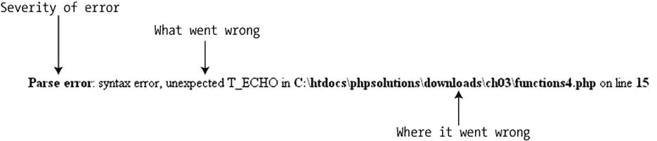
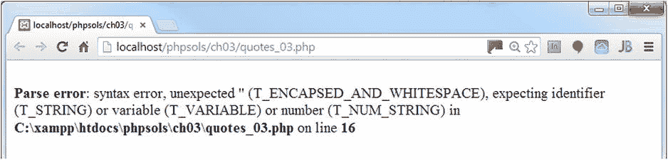
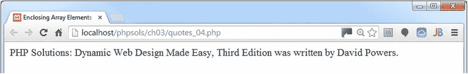
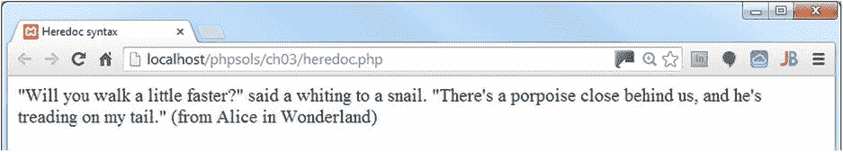
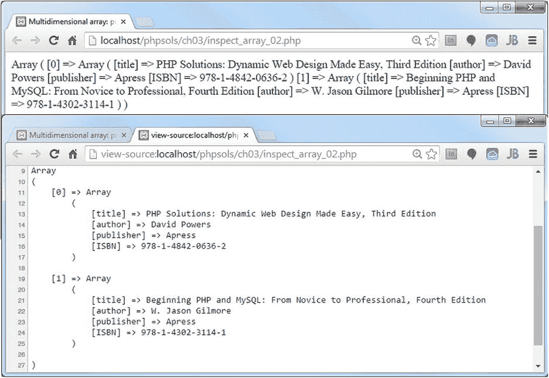

# 处理数字

PHP 可以对数字进行大量操作，从简单的加法到复杂的数学运算。本章后半部分将详细说明你可以在 PHP 中使用的算术运算符。目前你需要记住的是，数字除了小数点外不得包含任何标点符号。如果你给 PHP 提供包含逗号（或其他任何内容）作为千位分隔符的数字，PHP 会报错。

## 理解 PHP 错误消息

错误消息是编程生活中不可避免的现实，因此你需要理解它们试图告诉你什么。下图展示了一条典型的错误消息。



PHP 错误消息会报告 PHP 发现问题的行号。大多数新手——很自然地——会认为那就是寻找错误的地方。但这是错误的……

大多数时候，PHP 是在告诉你发生了意外情况。换句话说，错误位于那行代码之前。上面的错误消息意味着 PHP 在原本不应该有 `echo` 命令的地方发现了一个 `echo` 命令。（错误消息总是用 `T_` 作为 PHP 元素的前缀，`T_` 代表标记。忽略它就好。）

与其担心 `echo` 命令可能出了什么问题（很可能没问题），不如开始往回查找，寻找任何缺失的内容，可能上一行缺少了一个分号或结束引号。

有时，消息会在脚本的最后一行报告错误。这通常意味着你在页面更靠前的位置遗漏了一个闭合的花括号。

错误主要有七种类型，按重要性从高到低排列如下：

- **致命错误**：错误之前的任何 HTML 输出都会显示，但一旦遇到该错误——正如其名——其他所有内容都会立即被终止。致命错误通常由引用不存在的文件或函数引起。
- **可恢复错误**：这种错误仅在抛出特定类型的错误（称为异常）时发生。错误消息包含大量细节，解释了问题的原因和位置，但初学者可能难以理解。要避免可恢复错误，请使用“处理异常”部分中描述的 `try` 和 `catch` 块。
- **解析错误**：这意味着你的代码语法中存在错误，例如引号不匹配、缺少分号或闭合花括号。它会立即停止脚本，甚至不允许显示任何 HTML 输出。
- **警告**：这提醒你存在一个严重问题，例如缺少包含文件（包含文件是第 4 章的主题）。但是，该错误严重程度不足以阻止脚本的其余部分执行。
- **弃用**：这警告你某些功能计划在未来的 PHP 版本中移除。如果你看到这种类型的错误消息，你应该认真考虑更新你的脚本，因为如果你的服务器升级，它可能突然停止工作。
- **严格**：这种类型的错误消息会警告你使用了不被认为是良好实践的技术。
- **通知**：这告知你一些相对较小的问题，例如使用了未声明的变量。尽管这种错误不会阻止你的页面显示（并且你可以关闭通知的显示），但你应始终尝试消除它们。任何错误都是对输出的威胁。

### 为什么我的页面是空白的？

许多初学者将 PHP 页面加载到浏览器中并看到完全空白的内容时，都会感到困惑。没有错误消息，只是一个空白页面。当出现解析错误（即代码中存在错误）并且 `php.ini` 中的 `display_errors` 指令被关闭时，就会发生这种情况。

如果你遵循了上一章的建议，在你的本地测试环境中应该已启用 `display_errors`。然而，大多数托管公司会关闭 `display_errors`。这对于安全性有好处，但会使在远程服务器上进行故障排除变得困难。除了解析错误，缺少包含文件也经常导致空白页面。

你可以通过在页面顶部添加以下代码来为单个脚本开启错误显示：

```
ini_set('display_errors', '1');
```

将此代码放在 PHP 开始标签后的第一行，或者如果 PHP 代码在页面下方，则放在页面顶部的一个独立 PHP 代码块中。当你上传页面并刷新浏览器时，你应该会看到 PHP 生成的任何错误消息。

如果在添加这行代码后仍然看到空白页面，这意味着你的语法存在错误。在本地使用开启了 `display_errors` 的环境测试页面，以找出导致问题的原因。

**注意**：纠正错误后，请移除开启错误显示的代码。如果稍后脚本中其他部分出现故障，你不想在实时网站上暴露潜在的漏洞。


#### 处理异常

PHP 5 引入了一种新的错误处理方式，与许多其他编程语言类似，称为异常。当问题发生时，许多内置类会自动抛出异常——即生成一种特殊类型的对象，其中包含错误原因和发生位置的详细信息。你也可以使用关键字 `throw` 抛出自定义异常，如下所示：

```
if (错误发生) {
    throw new Exception('休斯顿，我们遇到问题了');
}
```

括号内的字符串用作错误消息。显然，在实际脚本中，你需要让消息更明确。当异常被抛出时，你应在另一个代码块中处理它，这个代码块被恰当地称为 `catch`。

当使用对象时，将你的主脚本包裹在一个名为 `try` 的块中，并将错误处理代码放在 `catch` 块中。如果抛出异常，PHP 引擎会放弃 `try` 块中的代码，并仅执行 `catch` 块中的代码。其优点是，你可以使用 `catch` 块将用户重定向到错误页面，而不是在屏幕上显示难看的错误消息——如果关闭了错误消息显示（在线网站应如此设置），则可能显示空白屏幕。

> **注意**：`try` 和 `catch` 块必须始终成对使用。不能只有一个而没有另一个。

在开发阶段，你应该使用 `catch` 块来显示异常生成的错误消息，如下所示：

```
try {
    // 主脚本写在这里
} catch (Exception $e) {
    echo $e->getMessage();
}
```

这会生成一条错误消息，通常比可恢复错误生成的长篇消息更容易理解。在前述问题的情况下，它会输出“休斯顿，我们遇到问题了”。虽然我之前建议使用描述性变量名，但在异常处理中使用 `$e` 是一种常见惯例。

> **提示**：如果你能读到这里，恭喜你。现在你应该拥有足够的知识来开始实践了。本章剩余部分将更详细地介绍编写 PHP 脚本的各个方面。与其硬着头皮继续，我建议你稍作休息，然后进入下一章。当你获得一些 PHP 实践经验后再回来查阅下面的参考部分，因为那时你会更容易理解。

## PHP：快速参考

以下各节并不试图涵盖 PHP 语法的所有方面。为此，你应该参考 [`http://php.net/manual/en/`](http://php.net/manual/en/) 上的 PHP 文档，或查阅更详细的参考书，例如 W. Jason Gilmore 所著的 *Beginning PHP and MySQL: From Novice to Professional, Fourth Edition*（Apress, 2010，ISBN: 978-1-4302-3114-1）。

### 在现有网站中使用 PHP

在同一网站中混合使用 `.html` 和 `.php` 页面是没有问题的。但是，PHP 代码通常仅在具有 `.php` 文件扩展名的文件中才会被处理，因此，即使并非所有页面都包含动态功能，最好也为所有页面使用相同的扩展名。这样，你就可以灵活地向页面添加 PHP，而不会破坏现有链接或丢失搜索引擎排名。

### PHP 中的数据类型

PHP 是一种所谓的弱类型语言。实际上，这意味着与某些其他计算机语言（例如 Java 或 C#）不同，PHP 不关心你在变量中存储什么类型的数据。

大多数时候，这非常方便，但你需要小心处理用户输入。你可能期望用户在表单中输入数字，但如果遇到的是单词，PHP 也不会反对。仔细检查用户输入是后续章节的主要主题之一。

尽管 PHP 是弱类型，但它使用以下八种数据类型：

- **整型（Integer）**：这是一个整数，例如 1、25、42 或 2006。整数不得包含任何逗号或其他标点作为千位分隔符。你也可以使用十六进制数，它们应以 `0x` 开头（例如 `0xFFFFFF`、`0x000000`）。
- **浮点数（Floating-point number）**：这是一个包含小数点的数字，例如 9.99、98.6 或 2.1。PHP 不支持使用逗号作为小数点（这在许多欧洲国家很常见）。你必须使用句点。与整型一样，浮点数不得包含千位分隔符。（此类型也称为 float 或 double。）
- **字符串（String）**：字符串是任意长度的文本。它可以短至零个字符（空字符串），并且没有上限。
- **布尔型（Boolean）**：此类型只有两个值：`true` 或 `false`。但是，PHP 会将其他值隐式视为真或假。请参阅本章后面的“根据 PHP 判断真假”。
- **数组（Array）**：数组是一种能够存储多个值的变量，尽管它可能不包含任何值（空数组）。数组可以保存任何数据类型，包括其他数组。数组的数组称为多维数组。有关如何向数组填充值的详细信息，请参阅本章后面的“创建数组”。
- **对象（Object）**：对象是一种复杂的数据类型，能够存储和操作值。你将在第 6 章了解更多关于对象的内容。
- **资源（Resource）**：当 PHP 连接到外部数据源（如文件或数据库）时，它会将对它的引用存储为资源。
- **NULL**：这是一个特殊的数据类型，表示变量没有值。

PHP 弱类型的一个重要副作用是，如果将整数或浮点数括在引号中，PHP 会自动将其从字符串转换为数字，从而无需任何特殊处理即可执行计算。这与 JavaScript 不同，可能会产生意想不到的后果。当 PHP 看到加号（`+`）时，它假设你想要执行加法，因此它会尝试将字符串转换为整数或浮点数，如下例所示（代码位于 `ch03` 文件夹中的 `data_conversion_01.php`）：

```
$fruit = '2 apples';
$veg = ' 2 carrots';
echo $fruit + $veg;  // 显示 4
```

PHP 发现 `$fruit` 和 `$veg` 都以数字开头，因此它提取数字并忽略其余部分。但是，如果字符串不是以数字开头，PHP 会将其转换为 0，如下例所示（代码位于 `data_conversion_02.php`）：

```
$fruit = '2 apples';
$veg = ' and 2 carrots';
echo $fruit + $veg;  // 显示 2
```

弱类型有利有弊。它使 PHP 对初学者非常容易，但这也意味着在使用变量之前，通常需要检查它是否包含正确的数据类型。

### 使用 PHP 进行计算

PHP 非常擅长处理数字，可以执行各种计算，从简单的算术到复杂的数学运算。此参考部分仅涵盖标准算术运算符。有关 PHP 支持的数学函数和常量的详细信息，请参见 [`http://php.net/manual/en/book.math.php`](http://php.net/manual/en/book.math.php)。

> **注意**：常量与变量类似，都使用名称来表示值。但是，常量的值一旦定义就不能更改。所有 PHP 预定义常量都是大写的。与变量不同，它们不以美元符号开头。例如，π 的常量是 `M_PI`。


## 算术运算符

标准算术运算符的工作方式与你预期的一致，尽管有些运算符看起来与你在学校学到的略有不同。例如，星号（`*`）用作乘号，斜杠（`/`）用于表示除法。表 3-1 展示了标准算术运算符如何工作的示例。为演示其效果，设置了以下变量：

```
$x = 20;
$y = 10;
$z = 3;
```

**表 3-1.** PHP 中的算术运算符

| 操作 | 运算符 | 示例 | 结果 |
| --- | --- | --- | --- |
| 加法 | `+` | `$x + $y` | `30` |
| 减法 | `-` | `$x - $y` | `10` |
| 乘法 | `*` | `$x * $y` | `200` |
| 除法 | `/` | `$x / $y` | `2` |
| 取模 | `%` | `$x % $z` | `2` |
| 自增（加 1） | `++` | `$x++` | `21` |
| 自减（减 1） | `--` | `$y--` | `9` |
| 乘方 | `**` | `$y**$z` | `1000` |

取模运算符在运算前会通过去除小数部分将两个数字转换为整数，然后返回除法的余数，如下所示：

```
5 % 2.5    // 结果为 1，而不是 0（2.5 的小数部分被去除）
10 % 2     // 结果为 0
```

取模运算对于判断一个数是奇数还是偶数非常有用。`$number % 2` 总是产生 0 或 1。如果结果为 0，则表示没有余数，因此该数为偶数。

自增（`++`）和自减（`--`）运算符可以放在变量之前或之后。当它们位于变量之前时，会在进行任何进一步计算之前加 1 或减 1。当它们位于变量之后时，会先执行主要计算，然后再加 1 或减 1。由于美元符号是变量名的组成部分，当自增和自减运算符用于变量前面时，它们会放在美元符号之前：

```
++$x
--$y
```

乘方运算符需要 PHP 5.6 或更高版本。在 PHP 5.6 之前，请使用 `pow()` 函数，该函数接受两个参数：底数和指数。例如，`pow(10, 3)` 等同于 `10**3`。两者都表示 10 的 3 次方。

## 确定计算顺序

PHP 中的计算遵循与标准算术相同的优先级规则。表 3-2 按照优先级顺序列出了算术运算符，最高优先级位于顶部。

**表 3-2.** 算术运算符的优先级

| 分组 | 运算符 | 规则 |
| --- | --- | --- |
| 括号 | `()` | 先计算括号内的操作。如果这些表达式嵌套，则最先计算最内层的。 |
| 乘方 | `**` | |
| 自增/自减 | `++ --` | |
| 乘法和除法 | `* / %` | 如果表达式包含两个或更多这些运算符，它们将从左到右进行计算。 |
| 加法和减法 | `+ -` | 如果表达式包含两个或更多这些运算符，它们将从左到右进行计算。 |

## 结合计算与赋值

PHP 提供了一种简写方式，可以通过组合赋值运算符对变量执行计算并将结果重新赋值给该变量。主要的运算符列于表 3-3。

**表 3-3.** PHP 中使用的组合算术赋值运算符

| 运算符 | 示例 | 等同于 |
| --- | --- | --- |
| `+=` | `$a += $b` | `$a = $a + $b` |
| `-=` | `$a -= $b` | `$a = $a - $b` |
| `*=` | `$a *= $b` | `$a = $a * $b` |
| `/=` | `$a /= $b` | `$a = $a / $b` |
| `%=` | `$a %= $b` | `$a = $a % $b` |
| `**=` | `$a **= $b` | `$a = $a ** $b` |

组合乘方赋值运算符（`**=`）仅在 PHP 5.6 及更高版本中可用。

### 向现有字符串添加内容

相同的便捷简写方式允许你通过组合句点和等号，向现有字符串末尾添加新内容，如下所示：

```
$hamlet = 'To be';
$hamlet .= ' or not to be';
```

请注意，除非你希望两个字符串无间断地连接，否则需要在附加文本的开头创建一个空格。这种简写方式被称为组合连接运算符，在连接多个字符串时非常有用，例如在构建电子邮件内容或循环遍历数据库搜索结果时。

> **提示**  
> 复制代码时，等号前面的句点很容易被忽略。当你看到同一个变量在一系列语句的开头重复出现时，这通常是一个明确的信号，表明你需要使用 `.=` 而不是单独的 `=`。

### 关于引号你想知道的一切——以及更多

在任何计算机语言（不仅仅是 PHP）中处理引号都可能充满困难，因为计算机总是将第一个匹配的引号视为字符串的结束。结构化查询语言（SQL）——用于与数据库通信的语言——也使用字符串。由于你的字符串可能包含撇号，单引号和双引号的组合并不足够。此外，PHP 在双引号内对变量和转义序列（某些前面带有反斜杠的字符）给予特殊处理。在接下来的几页中，我将为你理清这个纠缠并让你完全理解它。

#### PHP 如何处理字符串内的变量

选择使用双引号还是单引号可能看起来只是个人喜好问题，但 PHP 处理它们的方式有一个重要区别。

* 单引号之间的任何内容都被视为纯文本。
* 双引号充当处理变量和称为转义序列的特殊字符的信号。

在以下示例中，`$name` 被赋值，然后在单引号字符串中使用。因此 `$name` 被当作普通文本处理（代码在 `quotes_01.php` 中）：

```
$name = 'Dolly';
echo 'Hello, $name';  // Hello, $name
```

如果你将第二行中的单引号替换为双引号（参见 `quotes_02.php`），`$name` 会被处理，其值将显示在屏幕上：

```
$name = 'Dolly';
echo "Hello, $name";  // Hello, Dolly
```

> **注意**  
> 在两个示例中，第一行的字符串都是单引号。导致变量被处理的原因是它位于双引号字符串中，而不是它最初是如何获取值的。

由于双引号在这方面非常有用，许多人一直使用它们。从技术上讲，当你不需要处理任何变量时使用双引号是低效的。我个人的偏好是除非字符串包含变量，否则使用单引号。


### 在双引号内使用转义序列

双引号还有另一个重要作用：它会以特殊方式处理转义序列。所有转义序列都是通过在字符前放置反斜杠来形成的。其中大多数旨在避免与变量使用的字符发生冲突，但有三个具有特殊含义：`\n` 插入换行符，`\r` 插入回车符，`\t` 插入制表符。表 3-4 列出了 PHP 支持的主要转义序列。

**表 3-4.** PHP 的主要转义序列

| 转义序列 | 在双引号字符串中表示的字符 |
| --- | --- |
| `\"` | 双引号 |
| `\n` | 换行 |
| `\r` | 回车 |
| `\t` | 制表符 |
| `\\` | 反斜杠 |
| `\$` | 美元符号 |
| `\{` | 左花括号 |
| `\}` | 右花括号 |
| `\[` | 左方括号 |
| `\]` | 右方括号 |

**注意**

除 `\\` 外，表 3-4 中列出的转义序列仅在双引号字符串中有效。在单引号字符串中，它们会被视为字面反斜杠后跟第二个字符。字符串末尾的反斜杠始终需要转义。否则，它会被解释为转义紧随其后的引号。在单引号字符串中，请按照本章前半部分所述，使用反斜杠转义单引号和撇号。

### 在字符串中嵌入关联数组元素

在双引号字符串中处理关联数组元素有一个令人讨厌的“陷阱”。以下代码行尝试将本章前半部分中的 `$book` 关联数组的几个元素嵌入到双引号字符串中：

`echo "$book['title'] was written by $book['author'].";`

这看起来没问题。数组元素的键使用了单引号，因此不存在引号不匹配的问题。然而，如果你将 `quotes_03.php` 加载到浏览器中，会得到如下神秘的错误消息。



解决方案很简单。你需要将关联数组变量用花括号括起来，如下所示（参见 `quotes_04.php`）：

`echo "{$book['title']} was written by {$book['author']}.";`

现在变量值会正确显示，如下面的截图所示。



索引数组元素（例如 `$shoppingList[2]`）不需要这种特殊处理，因为数组索引是数字且未用引号括起来。

**注意**

有些人试图通过从数组键中去除引号来避免关联数组元素的问题，例如：`$book[title]`。虽然这样能工作，但去除数组键的引号会创建一个未定义的常量，这可能导致你的代码在未来出现问题。

### 使用 Heredoc 语法避免转义引号

使用反斜杠转义一两个引号并不是什么大负担，但我经常看到代码示例中反斜杠似乎乱用一气。这样的代码肯定难以输入，也肯定难以阅读。而且，这完全是多余的。PHP heredoc 语法提供了一种相对简单的方法来将文本赋值给变量，而无需对引号进行任何特殊处理。

**注意**

“heredoc”这个名称源自 here-document，这是一种在 Unix 和 Perl 编程中使用的技术，用于向命令传递大量文本。

使用 heredoc 将字符串赋值给变量包括以下步骤：

1. 输入赋值运算符，后跟 `<<<` 和一个标识符。该标识符可以是字母、数字和下划线的任意组合，但不能以数字开头。稍后将使用相同的组合来标识 heredoc 的结束。
2. 在新的一行开始字符串。它可以包含单引号和双引号。任何变量都会以与双引号字符串相同的方式处理。
3. 在字符串结束后另起一行放置标识符。该行末尾除了一个分号外不应有任何其他内容。此外，标识符必须位于行首，不能有缩进。

看实际例子会容易理解得多。以下简单示例可在本章文件的 `heredoc.php` 中找到：

```
$fish = 'whiting';

$book['title'] = 'Alice in Wonderland';

$mockTurtle = <<< Gryphon

"Will you walk a little faster?" said a $fish to a snail.

"There's a porpoise close behind us, and he's treading on my tail."

(from {$book['title']})

Gryphon;

echo $mockTurtle;
```

在这个例子中，`Gryphon` 是标识符。字符串从下一行开始，双引号被视为字符串的一部分。所有内容都会被包含，直到遇到新行开头的标识符为止。

**注意**

虽然 heredoc 语法避免了转义引号的需要，但关联数组元素 `$book['title']` 仍然需要用花括号括起来，如上一节所述。

从下面的截图可以看出，heredoc 显示了双引号，并处理了 `$fish` 和 `$book['title']` 变量。



要获得相同的效果而不使用 heredoc 语法，你需要添加双引号并像这样转义它们：

```
$mockTurtle = "\"Will you walk a little faster?\" said a $fish to a snail.

\"There's a porpoise close behind us, and he's treading on my tail.\" (from

{$book['title']})";
```

当你有一个长字符串和/或大量引号时，heredoc 语法非常有用。如果你想将 XML 文档或冗长的 HTML 部分赋值给变量，它也很方便。

**注意**

还有一种相关的技术称为 nowdoc 语法，它处理变量的方式与单引号相同——换句话说，将其视为字面文本。要使用 nowdoc 语法创建字符串，请将标识符用单引号括起来，如下所示：`<<< 'Gryphon'`。结束标识符不使用引号。参见 [`http://php.net/manual/en/language.types.string.php#language.types.string.syntax.nowdoc`](http://php.net/manual/en/language.types.string.php#language.types.string.syntax.nowdoc)。

如果使用双引号将标识符括起来，则该字符串被视为 heredoc 语法。

## 创建数组

如前所述，数组有两种类型：索引数组（使用数字标识每个元素）和关联数组（使用字符串）。你可以通过直接为每个元素赋值来构建这两种类型的数组。让我们再看一下 `$book` 关联数组：

```
$book['title'] = 'PHP Solutions: Dynamic Web Design Made Easy, Third Edition';
$book['author'] = 'David Powers';
$book['publisher'] = 'Apress';
$book['ISBN'] = '978-1-4842-0636-2';
```

要直接构建索引数组，请使用数字而不是字符串作为数组键。索引数组从 0 开始编号，因此要构建图 3-3 中描绘的 `$shoppingList` 数组，你应这样声明：

```
$shoppingList[0] = 'wine';
$shoppingList[1] = 'fish';
$shoppingList[2] = 'bread';
$shoppingList[3] = 'grapes';
$shoppingList[4] = 'cheese';
```

虽然这两种都是创建数组的完全有效的方法，但每次都不得不输入变量名很烦人；有一些更简洁的方法来实现。每种数组类型的语法略有不同。


### 构建索引数组

自 PHP 5.4 起，你可以选择在单条语句中定义数组。快捷方式是使用简写语法，这与 JavaScript 中的数组字面量相同。通过将逗号分隔的值列表放在一对方括号内来创建数组，如下所示：

`$shoppingList = ['wine', 'fish', 'bread', 'grapes', 'cheese'];`

**注意**：逗号必须放在引号外面，这与美式排版惯例不同。为便于阅读，我在每个逗号后加了一个空格，但这不是必需的。

另一种方法是将逗号分隔的列表传递给`array()`，如下所示：

`$shoppingList = array('wine', 'fish', 'bread', 'grapes', 'cheese');`

PHP 会自动为每个数组元素从 0 开始编号，因此两种方法创建的都是完全相同的数组，就像你逐个编号一样。要在数组末尾添加新元素，可以使用一对方括号，如下所示：

`$shoppingList[] = 'coffee';`

PHP 会使用下一个可用编号，因此这将成为 `$shoppingList[5]`。

### 构建关联数组

关联数组使用 `=>` 运算符（等号后跟大于号）为每个数组键赋值。使用简写的方括号语法，结构如下：

`$arrayName = ['key1' => 'element1', 'key2' => 'element2'];`

使用 `array()` 也能达到相同效果：

`$arrayName = array('key1' => 'element1', 'key2' => 'element2');`

因此，这是构建 `$book` 数组的简写方式：

```
$book = [
    'title'     => 'PHP Solutions: Dynamic Web Design Made Easy, Third Edition',
    'author'    => 'David Powers',
    'publisher' => 'Apress',
    'ISBN'      => '978-1-4842-0636-2'
];
```

将开头和结尾的大括号放在单独的行中，以及像我那样对齐 `=>` 运算符并非必需，但这能使代码更易于阅读和维护。

### 创建空数组

你可能想要创建空数组的原因有以下两个：

- 创建（或初始化）一个数组，使其准备好可以在循环中添加元素
- 清空现有数组中的所有元素

要创建空数组，只需使用一对空方括号：

`$shoppingList = [];`

或者，使用 `array()` 且括号内不留任何内容，如下所示：

`$shoppingList = array();`

`$shoppingList` 数组现在不包含任何元素。如果使用 `$shoppingList[]` 添加新元素，它将自动从 0 重新开始编号。

### 多维数组

数组元素可以存储任何数据类型，包括其他数组。例如，`$book` 数组只保存一本书的详细信息。创建一个数组的数组（即多维数组）来包含多本书的详细信息可能更方便，如下所示（使用方括号简写）：

```
$books = [
    [
        'title'     => 'PHP Solutions: Dynamic Web Design Made Easy, Third Edition',
        'author'    => 'David Powers',
        'publisher' => 'Apress',
        'ISBN'      => '978-1-4842-0636-2'
    ],
    [
        'title'     => 'Beginning PHP and MySQL: From Beginner to Professional, Fourth Edition',
        'author'    => 'W. Jason Gilmore',
        'publisher' => 'Apress',
        'ISBN'      => '978-1-4302-3114-1'
    ]
];
```

这个示例展示了关联数组嵌套在索引数组中的情况，但多维数组可以嵌套任何一种类型。要引用特定元素，请使用两个数组的键；例如：

`$books[1]['author']`  // 值是 `'W. Jason Gilmore'`

处理多维数组并不像初看那么困难。秘诀是使用循环来获取嵌套数组。然后你可以像处理普通数组一样处理它。这就是处理数据库搜索结果的方式，结果通常包含在多维数组中。

**提示**：简写语法仅适用于 PHP 5.4 或更高版本，而 `array()` 适用于所有 PHP 版本。使用 `array()` 的微弱优势是使结构更易于可视化，但从 JavaScript 借用的数组字面量语法输入更少，并且大多数 Web 开发人员可能都很熟悉。使用你觉得舒服的即可。

### 使用 `print_r()` 检查数组

要在测试时检查数组内容，请将数组传递给 `print_r()`，如下所示（参见 `inspect_array_01.php`）：

`print_r($books);`

将 `inspect_array_01.php` 加载到浏览器中，了解 `print_r()` 如何输出普通数组的内容。以下截图显示了 PHP 如何显示多维数组（代码在 `inspect_array_02.php` 中）。通常，切换到“源代码”视图有助于检查细节，因为浏览器会忽略底层输出中的缩进。或者，在 PHP 代码块外添加 HTML `<pre>` 标签以保留缩进。



**提示**：始终使用 `print_r()` 来检查数组；`echo` 和 `print` 不起作用。要在网页中显示数组内容，请使用 `foreach` 循环，本章后面会介绍。

### PHP 中的“真”与“假”

PHP 条件语句中的决策基于互斥的布尔值 `true` 和 `false`。如果条件等于 `true`，则执行条件块内的代码。如果为 `false`，则忽略。条件是否为 `true` 或 `false` 通过以下方式之一确定：

- 显式设置为布尔值之一的变量
- PHP 隐式解释为 `true` 或 `false` 的值
- 两个非布尔值的比较

#### 显式布尔值

如果变量被赋值为 `true` 或 `false` 并在条件语句中使用，则基于该值进行决策。关键字 `true` 和 `false` 不区分大小写，且不得用引号括起来；例如：

```
$OK = false;

if ($OK) {
    // 执行某些操作
}
```

条件语句内的代码不会被执行，因为 `$OK` 是 `false`。

#### 隐式布尔（“真值”和“假值”）值

使用隐式布尔值提供了一种便捷的简写方式，尽管它有一个缺点——至少对初学者来说——不够清晰。隐式布尔值——有时称为“真值”和“假值”——依赖于 PHP 对其视为 `false` 的相对狭窄的定义，即：

- 不区分大小写的关键字 `false` 和 `null`
- 作为整数（`0`）、浮点数（`0.0`）或字符串（`'0'` 或 `"0"`）的零
- 空字符串（单引号或双引号之间无空格）
- 空数组
- 由空标签创建的 SimpleXML 对象

其他所有值都是 `true`。

**提示**：这解释了为什么 PHP 将 `"false"`（带引号）解释为 `true`。它是一个字符串，所有字符串——除了空字符串——都是 `true`。


#### 通过比较两个值来做出决策

大多数 `true/false`（真/假）决策都是基于使用比较运算符对两个值进行比较。表 3-5 列出了 PHP 中使用的比较运算符。

**表 3-5.** 用于决策的 PHP 比较运算符

| 符号 | 名称 | 示例 | 结果 |
| --- | --- | --- | --- |
| `==` | 等于 | `$a == $b` | 如果 `$a` 和 `$b` 相等，则返回 `true`；否则返回 `false` |
| `!=` | 不等于 | `$a != $b` | 如果 `$a` 和 `$b` 不相等，则返回 `true`；否则返回 `false` |
| `===` | 全等 | `$a === $b` | 判断 `$a` 和 `$b` 是否全等。它们不仅需要值相同，而且数据类型也必须相同（例如，都是整数）。 |
| `!==` | 不全等 | `$a !== $b` | 判断 `$a` 和 `$b` 是否不全等（判断标准与上一个运算符相同） |
| `>` | 大于 | `$a > $b` | 如果 `$a` 大于 `$b`，则返回 `true` |
| `>=` | 大于等于 | `$a >= $b` | 如果 `$a` 大于等于 `$b`，则返回 `true` |
| `<` | 小于 | `$a < $b` | 如果 `$a` 小于 `$b`，则返回 `true` |
| `<=` | 小于等于 | `$a <= $b` | 如果 `$a` 小于等于 `$b`，则返回 `true` |

> **注意：** 单个等号不执行比较操作；它用于赋值。当比较两个值时，必须始终使用相等运算符（`==`）、全等运算符（`===`）或其否定形式（`!=` 和 `!==`）。

#### 测试多个条件

通常，仅比较两个值是不够的。PHP 允许你使用逻辑运算符设置一系列条件，以指定是需要满足所有条件还是仅需满足部分条件。

PHP 中最主要的逻辑运算符列于表 3-6。逻辑非运算符应用于单个条件，而非一系列条件。

**表 3-6.** PHP 中用于决策的主要逻辑运算符

| 符号 | 名称 | 示例 | 结果 |
| --- | --- | --- | --- |
| `&&` | 与 | `$a && $b` | 如果 `$a` 和 `$b` 均为 `true`，则结果为 `true` |
| `&#124;&#124;` | 或 | `$a &#124;&#124; $b` | 如果 `$a` 或 `$b` 中任意一个为 `true`，则结果为 `true`；否则为 `false` |
| `!` | 非 | `!$a` | 如果 `$a` 不为 `true`，则结果为 `true` |

从技术上讲，可以测试的条件数量没有限制。每个条件会从左到右依次被评估，一旦达到决定性的判断点，便不再进行后续测试。当使用 `&&` 时，所有条件都必须满足，因此一旦某个条件为 `false`，测试便会停止。同样，当使用 `||` 时，只需满足一个条件即可，因此一旦某个条件为 `true`，测试便会停止。

```
$a = 10;
$b = 25;
if ($a > 5 && $b > 20) // 返回 true
if ($a > 5 || $b > 30) // 返回 true，$b 从未被测试
```

你应该始终设计测试条件，以期获得最快的结果。如果所有条件都必须满足，先评估最有可能失败的那个。如果只需满足一个条件，先评估最有可能成功的那个。如果一组条件需要作为一个整体来考虑，请将它们括在圆括号中，如下所示：

```
if (($a > 5 && $a < 8) || ($b > 20 && $b < 40))
```

> **注意：** PHP 也允许使用 `AND` 代替 `&&`，使用 `OR` 代替 `||`。然而，它们并非完全等同。为避免出现问题，建议坚持使用 `&&` 和 `||`。

#### 使用 Switch 语句进行决策链

`switch` 语句为使用 `if . . . else` 进行决策提供了一种替代方案。其基本结构如下所示：

```
switch(被测试的变量) {
    case 值 1:
        要执行的语句
        break;
    case 值 2:
        要执行的语句
        break;
    default:
        要执行的语句
}
```

`case` 关键字表示传递给 `switch()` 的变量可能匹配的值。每个备选值前必须加上 `case`，后跟冒号。当找到匹配项时，会执行后续的每一行代码，直到遇到 `break` 或 `return` 关键字，此时 `switch` 语句结束。以下是一个简单的示例：

```
switch($myVar) {
    case 1:
        echo '$myVar 是 1';
        break;
    case 'apple':
    case 'orange':
        echo '$myVar 是一种水果';
        break;
    default:
        echo '$myVar 既不是 1 也不是水果';
}
```

关于 `switch` 需要注意的要点如下：

* `case` 关键字后面的表达式通常是数字或字符串。不能使用像数组或对象这样的复杂数据类型。
* 要在 `case` 中使用比较运算符，必须重复被测试的变量。因此 `case > 100:` 无法工作，但 `case $myVar > 100:` 可以。
* 每个代码块通常应以 `break` 或 `return` 结尾，除非你特别希望继续执行 `switch` 语句中的后续代码。
* 可以将多个 `case` 关键字组合在一起，对它们应用相同的代码块。
* 如果没有找到匹配项，则执行 `default` 关键字后面的任何语句。如果未设置 default 情况，`switch` 语句会静默退出并继续执行下一个代码块。

#### 使用三元运算符

三元运算符（`?:`）是表示条件语句的一种简写方法。其名称来源于它通常使用三个操作数。基本语法如下所示：

```
条件 ? 值为真时的结果 : 值为假时的结果 ;
```

以下是其使用示例：

```
$age = 17;
$fareType = $age >= 16 ? 'adult' : 'child';
```

第二行测试 `$age` 的值。如果它大于等于 16，`$fareType` 被设置为 `adult`，否则 `$fareType` 被设置为 `child`。使用 `if . . . else` 的等效代码如下所示：

```
if ($age >= 16) {
    $fareType = 'adult';
} else {
    $fareType = 'child';
}
```

`if . . . else` 版本更易读，但条件运算符更简洁。大多数初学者讨厌这种简写，但一旦熟悉它，你就会意识到它有多方便。

你可以省略问号和冒号之间的值。这会产生如下效果：如果条件为真，则将条件本身的值赋给变量。前面的例子可以重写如下：

```
$age = 17;
$adult = $age >= 16 ?: false; // $adult 为 true
```

在这种情况下，问号前面的表达式是一个比较，因此它只能等于 `true` 或 `false`。然而，如果问号前面的表达式是“真值”（隐式为真），则返回该值本身。例如：

```
$age = 17;
$years = $age ?: 'unknown';  // $years 为 17
```

> **注意：** 省略问号和冒号之间的值是三元运算符的一种特殊用法。在这里提到它，只是为了提醒你，如果在其他地方遇到它时，了解其含义。

### 创建循环

循环是一段被重复执行的代码，直到满足某个特定条件为止。循环通常通过设置一个变量来计数迭代次数进行控制。每次将变量递增 1，当变量达到预设值时循环停止。循环也可以通过遍历数组中的每个元素来控制。当没有更多元素需要处理时，循环停止。循环中通常包含条件语句，因此尽管它们结构非常简单，但可用于创建以相当复杂的方式处理数据的代码。


