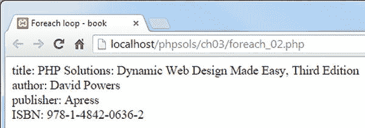

# 使用 While 和 Do . . . While 循环

最简单的循环类型称为 `while` 循环。其基本结构如下：

```
while (条件为真) {
    执行某些操作
}
```

以下代码在浏览器中显示从 1 到 100 的每个数字（你可以在本章配套文件中的 `while.php` 中测试）。它首先将变量（`$i`）设置为 1，然后使用该变量作为控制循环的计数器，同时在屏幕上显示当前数字。

```
$i = 1;  // 设置计数器
while ($i <= 100) {
    echo "$i<br>";
    $i++; // 将计数器增加 1
}
```

**提示**

在本章前半部分，我警告过不要使用含义模糊的变量名。然而，使用 `$i` 作为计数器是一种广泛接受的约定。如果 `$i` 已被使用，通常的做法是使用 `$j` 或 `$k` 作为计数器。

`while` 循环的一种变体使用关键字 `do`，其基本模式如下：

```
do {
    要执行的代码
} while (待测试的条件);
```

`do . . . while` 循环与 `while` 循环的区别在于，`do` 块中的代码至少会执行一次，即使条件永远不为真。以下代码（位于 `dowhile.php` 中）会显示 `$i` 的值一次，即使该值大于预期的最大值。

```
$i = 1000;
do {
    echo "$i<br>";
    $i++; // 将计数器增加 1
} while ($i <= 100);
```

使用 `while` 和 `do . . . while` 循环的危险在于忘记设置结束循环的条件，或者设置了不可能实现的条件。这被称为无限循环，它可能会冻结你的计算机或导致浏览器崩溃。

## 多功能的 for 循环

`for` 循环不太容易产生无限循环，因为你需要在第一行声明循环的所有条件。`for` 循环使用以下基本模式：

```
for (初始化循环; 条件; 每次迭代后执行的代码) {
    要执行的代码
}
```

以下代码的功能与之前的 `while` 循环完全相同，显示从 1 到 100 的每个数字（参见 `forloop.php`）：

```
for ($i = 1; $i <= 100; $i++) {
    echo "$i<br>";
}
```

括号内的三个表达式控制循环的动作（注意，它们用分号分隔，而不是逗号）：

- 第一个表达式在循环开始前执行。在此例中，它将计数器变量 `$i` 的初始值设置为 1。

- 第二个表达式设置决定循环应持续运行多长时间的条件。它可以是一个固定数字、一个变量或一个计算值的表达式。

- 第三个表达式在循环的每次迭代结束时执行。在此例中，它将 `$i` 增加 1，但你可以使用更大的增量。例如，将此示例中的 `$i++` 替换为 `$i+=10` 将显示 1、11、21、31，依此类推。

## 使用 Foreach 遍历数组和对象

PHP 中的最后一种循环类型用于数组和对象。它有两种形式，两者都使用临时变量来处理每个元素。如果你只需要对元素的值进行操作，`foreach` 循环采用以下形式：

```
foreach (变量名 as 元素) {
    对元素执行某些操作
}
```

以下示例遍历 `$shoppingList` 数组并显示每个项目的名称（代码位于 `foreach_01.php`）：

```
$shoppingList = ['wine', 'fish', 'bread', 'grapes', 'cheese'];
foreach ($shoppingList as $item) {
    echo $item.'<br>';
}
```

**注意**

`foreach` 关键字是一个单词。在 `for` 和 `each` 之间插入空格是无效的。

虽然前面的示例使用了索引数组，但你也可以将 `foreach` 循环的简单形式用于关联数组。

`foreach` 循环的另一种形式可以访问每个元素的键和值。它采用这种略有不同的形式：

```
foreach (变量名 as 键 => 值) {
    对键和值执行某些操作
}
```

下一个示例使用本章前面“创建数组”部分中的 `$book` 关联数组，并将每个元素的键和值合并到一个简单的字符串中，如下面的屏幕截图所示（参见 `foreach_02.php`）：

```
foreach ($book as $key => $value) {
    echo "$key: $value<br>";
}
```



**注意**

除了数组之外，`foreach` 循环的主要用途是处理一种称为迭代器的特殊类型对象。你将在第 7 章中了解如何使用迭代器。

## 跳出循环

为了在满足特定条件时提前结束循环，可以在条件语句中插入 `break` 关键字。一旦脚本遇到 `break`，它将退出循环。

要在满足特定条件时跳过循环中的代码，请使用 `continue` 关键字。它不是退出循环，而是返回到循环顶部并处理下一个元素。例如，以下循环在 `$photo` 没有值时跳过当前元素：

```
foreach ($photos as $photo) {
    if (empty($photo)) continue;
    // 显示照片的代码
}
```