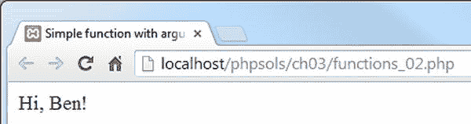
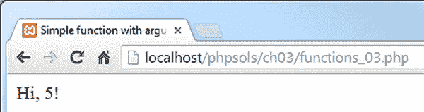
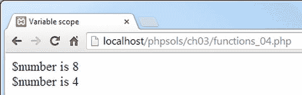
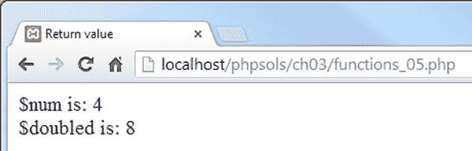
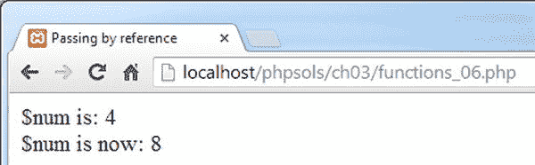
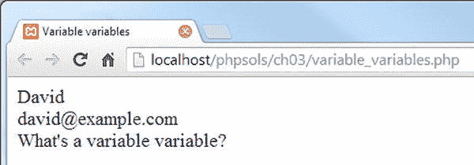

# 使用函数模块化代码

函数提供了一种执行频繁操作任务的便捷方式。除了大量内置函数外，PHP 还允许你创建自己的函数。其优点是你只需编写一次代码，而不需要在需要它的每个地方重新输入。这不仅加快了开发速度，还使代码更易于阅读和维护。如果函数中的代码有问题，你只需在一个地方更新它，而不必在整个网站中搜索。此外，函数通常可以加快页面的处理速度。

在 PHP 中构建自己的函数很容易。你只需将一段代码用一对花括号括起来，并使用 `function` 关键字为新函数命名。函数名后面总是跟着一对圆括号。以下（虽然微不足道）示例演示了自定义函数的基本结构（参见本章配套文件中的 `functions_01.php`）：

```php
function sayHi() {
    echo 'Hi!';
}
```

只需在 PHP 代码块中放置 `sayHi();` 就会在屏幕上显示 `Hi!`。这种类型的函数就像一个无人机：它总是执行完全相同的操作。为了使函数能够响应不同的情况，你需要将值作为参数传递给它。

## 向函数传递值

假设你想要调整 `sayHi()` 函数，使其显示某人的名字。你可以通过在函数声明的圆括号之间插入一个变量来实现这一点。然后在函数内部使用相同的变量来显示传递给函数的任何值。要向函数传递多个参数，请在起始圆括号内用逗号分隔变量。这是修改后的函数的样子（参见 `functions_02.php`）：

```php
function sayHi($name) {
    echo "Hi, $name!";
}
```

你现在可以在页面中使用此函数来显示传递给 `sayHi()` 的任何变量的值。例如，如果你有一个在线表单，将某人的姓名保存在名为 `$visitor` 的变量中，并且 Ben 访问了你的网站，你可以通过在你的页面中放置 `sayHi($visitor);` 来向他显示如下屏幕截图所示的个性化问候。



PHP 弱类型的一个缺点是，如果 Ben 特别不配合，他可能会在表单中键入 5 而不是他的名字，这带给你的可能不是你期望的那种击掌（high five）。



这就是为什么在任何关键情况下使用用户输入之前，应先检查用户输入的原因。

## 变量作用域——函数如同黑盒子

理解函数会创建一个类似于黑盒子的独立环境也很重要。通常，函数内部的操作不会影响脚本的其他部分，除非它返回一个值，这将在下一节中描述。函数内部的变量是函数独有的。下面的例子可以说明这一点（参见 `functions_04.php`）：

```php
function doubleIt($number) {
    $number *= 2;
    echo '$number is ' . $number . '<br>';
}

$number = 4;
doubleIt($number);
echo '$number is ' . $number;
```

前四行定义了一个名为 `doubleIt()` 的函数，它接收一个数字，将其加倍，并显示在屏幕上。脚本的其余部分将值 4 赋给 `$number`。然后，它将 `$number` 作为参数传递给 `doubleIt()` 函数。函数处理 `$number` 并显示 8。函数结束后，`echo` 将 `$number` 显示在屏幕上。这一次，它的值是 4 而不是 8，如下面的截图所示：



这表明主脚本中的 `$number` 与函数内部同名的变量完全无关。这被称为变量的作用域。即使在函数内部改变了变量的值，外部同名的变量也不会受到影响。为了避免混淆，最好在脚本的其余部分使用与函数内部不同的变量名。但这并不总是可能做到，因此，理解函数像小黑盒子一样工作，并且通常不会直接影响脚本其余部分中的变量值，是很有用的。

变量作用域的另一个方面是，函数通常无法访问外部脚本中的值，除非这些值作为参数传递给函数。

**注意：** PHP 的超全局变量，如 `$_POST` 和 `$_GET`，不受变量作用域的影响。它们始终可用，这就是为什么它们被称为超全局变量。

## 从函数返回值

让函数改变传递给它的参数的值不止一种方法，但最重要的方法是使用 `return` 关键字，并将结果赋给同一个变量或另一个变量。这可以通过修改 `doubleIt()` 函数来演示，如下所示（代码在 `functions_05.php` 中）：

```php
function doubleIt($number) {
    return $number *= 2;
}

$num = 4;
$doubled = doubleIt($num);
echo '$num is: ' . $num . '<br>';
echo '$doubled is: ' . $doubled;
```



这次，我为变量使用了不同的名称以避免混淆。我还将 `doubleIt($num)` 的结果赋给了一个新变量。这样做的好处是，原始值和计算结果现在都可以使用。你并不总是需要保留原始值，但有时它非常有用。

## 通过引用传递——改变参数的值

尽管函数通常不会改变传递给它们的参数的值，但有时你确实希望改变原始值，而不是捕获返回值。为此，在定义函数时，你需要在想要改变的参数前加上一个与符号（ampersand），如下所示：

```php
function doubleIt(&$number) {
    $number *= 2;
}
```

请注意，这个版本的 `doubleIt()` 函数既没有 `echo` `$number` 的值，也没有返回计算结果的值。因为括号内的参数前面加了一个与符号，所以作为参数传递给函数的变量的原始值将被改变。这被称为**通过引用传递**。

下面的代码（位于 `functions_06.php` 中）演示了这一效果：

```php
$num = 4;
echo '$num is: ' . $num . '<br>';
doubleIt($num);
echo '$num is now: ' . $num;
```



与符号仅用于函数定义中，在调用函数时不需要使用。

**注意：** 一般来说，使用函数来改变传递给它的参数的原始值并不是一个好主意，因为如果该变量在脚本的其他地方使用，可能会产生意想不到的后果。然而，在某些情况下这样做是很有意义的。例如，内置的数组排序函数就使用传递引用来影响原始数组。

## 自定义函数的位置

如果自定义函数位于使用它的同一个页面中，那么在哪里声明该函数并不重要；可以在使用它的前面或后面。然而，最好将函数集中存储，放在页面的顶部或底部。这样可以使它们更容易查找和维护。

在多个页面中使用的函数最好存储在一个外部文件中，并在每个页面中包含该文件。使用 `include` 和 `require` 包含外部文件将在下一章中详细介绍。当函数存储在外部文件中时，你必须在调用任何函数之前包含该外部文件。

### 动态创建新变量

PHP 支持创建所谓的**可变变量**。虽然这看起来像是一个排版错误，但事实并非如此。简单来说，可变变量会创建一个新变量，其名称源自一个现有变量。这个概念可能难以理解，但下面的例子应该能说明情况（代码在 `variable_variables.php` 中）。

以下语句将字符串 “city” 赋给一个名为 `$location` 的变量：

```php
$location = 'city';
```

通过使用两个美元符号来创建一个可变变量，如下所示：

```php
$$location = 'London';
```

这个可变变量以原始变量的值作为其名称。换句话说，`$$location` 等同于 `$city`。

```php
echo $city; // London
```

虽然这演示了可变变量的工作原理，但它并不是一个非常实用的例子。因此，让我们考虑一个动态创建新变量的场景。假设你有一个像这样的关联数组：

```php
$fields = [
    'name'     => 'David',
    'email'    => 'david@example.com',
    'comments' => "What's a variable variable?"
];
```

要获取数组元素的值，你可以在数组变量后面使用方括号括起来的键名（作为字符串），如下所示：

```
echo $fields['name'];  // David
```

你可以不使用这种语法，而是使用一个`foreach`循环来动态生成`$name`、`$email`和`$comments`变量作为可变变量，如下所示：

```
foreach ($fields as $key => $value) {
    $$key = $value;
}

echo $name . '<br>';
echo $email . '<br>';
echo $comments;
```

这会产生以下输出：



在循环内部，`$$key`是一个可变变量，它根据`$key`的值创建一个新变量。循环还将`$value`赋给`$$key`。第一次运行循环时，`$key`是“name”，`$value`是“David”。因此它创建了一个名为`$name`且值为“David”的变量。随着循环继续运行，`$$key`会创建名为`$email`和`$comments`的新变量。

你将在第5章的邮件处理脚本中看到这种技术。

**提示：** 为了表明双`$`是有意为之，我喜欢将用于创建可变变量的变量用花括号括起来，像这样：`${$key}`。花括号完全是可选的，但可以使代码更易于阅读。