# 4. 使用包含文件轻松减轻工作量

能够将一个文件的内容包含在另一个文件中，是 PHP 最强大的特性之一，也是最容易实现的功能之一。

网站中的大多数页面都共享通用元素，例如页眉、页脚和导航菜单。你可以通过更改外部样式表中的样式规则来改变这些元素在整个站点中的外观。但是，CSS 更改页面元素内容的能力有限。如果你想在菜单中添加一个新项目，你需要编辑显示该菜单的每一个页面的 HTML。像 Dreamweaver 这样的网页制作工具具有模板系统，可以自动更新所有连接到主文件的页面，但你仍然需要将所有文件上传到远程服务器。

使用 PHP 则无需如此，它支持服务器端包含（SSI）。服务器端包含是一个外部文件，其中包含你想要合并到多个页面中的动态代码或 HTML（或两者）。PHP 将内容合并到服务器上的每个网页中。由于每个页面都使用相同的外部文件，你可以通过编辑和上传单个文件来更新菜单或其他通用元素——这大大节省了时间。

在学习本章的过程中，你将了解 PHP 包含的工作原理、PHP 在哪里查找包含文件，以及如何在找不到包含文件时防止出现错误消息。此外，你还会学习使用 PHP 实现一些酷炫的技巧，例如创建随机图像生成器。

本章涵盖以下主题：

-   理解不同的包含命令
-   告诉 PHP 在哪里找到你的包含文件
-   为通用页面元素使用 PHP 包含
-   保护包含文件中的敏感信息
-   自动化“你在这里”的菜单链接
-   从文件名生成页面标题
-   自动更新版权声明
-   显示带有标题的随机图像
-   处理包含文件的错误
-   更改你的 Web 服务器的 `include_path`

图 4-1 展示了页面的四个元素如何通过 PHP 的包含文件魔法而受益。

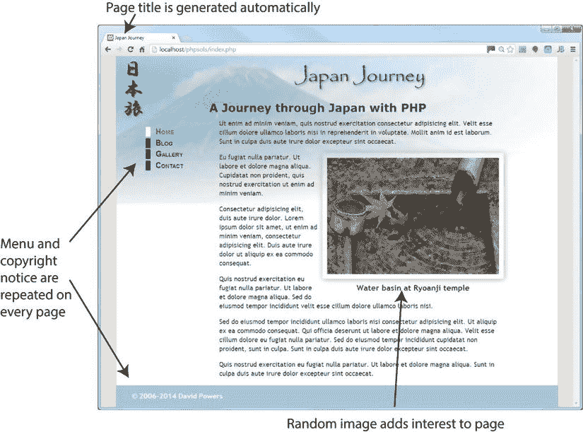

图 4-1. 识别可通过 PHP 改进的静态网页元素

菜单和版权声明出现在每个页面上。通过将它们转换为包含文件，你只需更改一个页面即可使更改在整个站点中传播。借助 PHP 的条件逻辑，你还可以让菜单显示正确的样式，以指示访问者当前所在的页面。类似的 PHP 魔法可以自动更改版权声明中的日期和页面标题中的文本。PHP 还可以通过显示随机图像和标题来增加多样性。图像不必是相同大小；PHP 函数会在 `` 标签中插入正确的 `width` 和 `height` 属性。

## 从外部文件包含代码

从其他文件包含代码的能力是 PHP 的核心部分。所需要做的就是使用一个 PHP 包含命令，并告诉服务器在哪里找到该文件。

### 介绍 PHP 包含命令

PHP 有四个可用于从外部文件包含代码的命令，即：

-   `include`
-   `include_once`
-   `require`
-   `require_once`

它们的基本功能相同，那为什么要有四个呢？根本区别在于，即使外部文件缺失，`include` 也会尝试继续处理脚本，而 `require` 则带有强制性的意味：如果文件缺失，PHP 引擎会停止处理并抛出一个致命错误。实际上，这意味着如果你的页面即使没有外部文件的内容也能保持可用，就应该使用 `include`。如果页面依赖于外部文件，则使用 `require`。

另外两个命令 `include_once` 和 `require_once` 工作方式相同，但它们能防止同一个文件在页面中被包含多次。这在包含定义了函数或类的文件时尤其重要。在脚本中多次尝试定义一个函数或类会触发致命错误。因此，使用 `include_once` 或 `require_once` 可以确保函数和类只被定义一次，即使脚本试图多次包含外部文件（例如当命令位于条件语句中时）也是如此。

提示

对于非关键任务的外部文件使用 `include`，对于定义了函数和类的文件使用 `require_once`。

### PHP 查找包含文件的位置

要包含一个外部文件，请使用四个包含命令之一，后跟文件路径（字符串形式）——换句话说，文件路径必须放在引号中（单引号或双引号都可以）。文件路径可以是绝对路径，也可以是相对于当前文档的路径。例如，以下任何一项都可以正常工作（只要目标文件存在）：

`include 'includes/menu.php';`

`include 'C:/xampp/htdocs/phpsols/includes/menu.php';`

`include '/Applications/MAMP/htdocs/phpsols/includes/menu.php';`

注意

PHP 在 Windows 文件路径中接受正斜杠。

你可以选择性地对包含命令使用括号，因此以下写法也有效：

`include('includes/menu.php');`

`include('C:/xampp/htdocs/phpsols/includes/menu.php');`

`include('/Applications/MAMP/htdocs/phpsols/includes/menu.php');`

当使用相对文件路径时，建议使用 `./` 来表示路径从当前文件夹开始。因此，将第一个示例重写如下会更高效：

`include './includes/menu.php'; // 路径从当前文件夹开始`

什么是不行的？使用相对于站点根目录的文件路径，如下所示：

`include '/includes/menu.php'; // 这样不行`

PHP 还会在 PHP 配置中定义的 `include_path` 中查找。我将在本章后面回到这个话题。在此之前，让我们将 PHP 包含付诸实践。


### PHP 方案 4-1：将菜单和页脚移至包含文件

我们将把图 4-1 所示的页面转换为使用包含文件。因为菜单和页脚出现在日本之旅网站的每个页面上，所以它们是包含文件的最佳候选。清单 4-1 显示了页面主体的代码，其中菜单和页脚以粗体突出显示。

**清单 4-1.** `index.php` 的静态版本

```
<header>
<h1>日本之旅</h1>
</header>
<div id="wrapper">
<ul id="nav">
<li><a href="index.php" id="here">首页</a></li>
<li><a href="blog.php">日志</a></li>
<li><a href="gallery.php">画廊</a></li>
<li><a href="contact.php">联系</a></li>
</ul>
<main>
<h2>用 PHP 穿越日本之旅</h2>
<p>使用 PHP 的好处之一……</p>
<figure>

<figcaption>龙安寺的水盆</figcaption>
</figure>
<p>Ut enim ad minim veniam, quis nostrud . . .</p>
<p>Eu fugiat nulla pariatur. Ut labore et dolore . . .</p>
<p>Sed do eiusmod tempor incididunt ullamco . . .</p>
</main>
<footer>
<p>&copy; 2006&ndash;2014 大卫·鲍尔斯</p>
</footer>
</div>
```

将 `ch04` 文件夹中的 `index_01.php` 复制到 `phpsols` 站点根目录，并重命名为 `index.php`。如果你使用的是 Dreamweaver 等提供更新页面链接功能的程序，请勿更新它们。下载文件中的相对链接是正确的。通过在浏览器中加载 `index.php`，检查 CSS 和图片是否正常显示。它应该与图 4-1 相同。

将 `ch04` 文件夹中的 `blog.php`、`gallery.php` 和 `contact.php` 复制到你的站点根目录。这些页面目前还无法在浏览器中正确显示，因为所需的包含文件尚未创建。不过很快就会解决。

在 `index.php` 中，选中清单 4-1 中以粗体显示的 `nav` 无序列表，然后将其剪切（Ctrl+X/Cmd+X）到你的计算机剪贴板。

在 `includes` 文件夹中创建一个名为 `menu.php` 的新文件。删除编辑程序插入的任何代码；该文件必须完全空白。

将剪贴板中的代码粘贴（Ctrl+V/Cmd+V）到 `menu.php` 中并保存文件。`menu.php` 的内容应如下所示：

```
<ul id="nav">
<li><a href="index.php" id="here">首页</a></li>
<li><a href="blog.php">日志</a></li>
<li><a href="gallery.php">画廊</a></li>
<li><a href="contact.php">联系</a></li>
</ul>
```

不用担心你的新文件没有 `DOCTYPE` 声明或任何 `<html>`、`<head>` 或 `<body>` 标签。包含此文件内容的其他页面会提供这些元素。

打开 `index.php`，在 `nav` 无序列表留下的空间中插入以下内容：

```
<?php require './includes/menu.php'; ?>
```

这使用了指向 `menu.php` 的文档相对路径。在路径开头使用 `./` 效率更高，因为它明确表示路径从当前文件夹开始。

> **提示：** 我使用 `require` 命令是因为导航菜单至关重要。没有它，就无法在网站中导航。

保存 `index.php` 并在浏览器中加载该页面。它应该与之前完全一样。尽管菜单和页面的其余部分来自不同的文件，但 PHP 在向浏览器发送任何输出之前会将它们合并。

> **注意：** 别忘了 PHP 代码需要由 Web 服务器处理。如果你将文件存储在服务器文档根目录的子文件夹 `phpsols` 中，则应使用 URL `http://localhost/phpsols/index.php` 访问 `index.php`。如需查找服务器文档根目录的帮助，请参阅第 2 章中的“在哪里放置你的 PHP 文件（Windows 和 Mac）”。

对 `footer` 执行相同操作。剪切清单 4-1 中以粗体显示的行，并将其粘贴到 `includes` 文件夹中一个名为 `footer.php` 的空白文件中。然后在 `<footer>` 留下的间隙中插入包含新文件的命令：

```
<?php include './includes/footer.php'; ?>
```

这次我使用了 `include` 而不是 `require`。`<footer>` 是页面的重要组成部分，但如果找不到包含文件，网站仍然可以使用。

保存所有页面，并在浏览器中重新加载 `index.php`。它应该看起来与原始页面完全相同。如果你导航到网站中的其他页面，菜单和页脚应该会出现在每个页面上。包含文件中的代码现在正在为所有页面提供服务。

为了证明菜单来自单个文件，请更改 `menu.php` 中“日志”链接的文本，如下所示：

```
<li><a href="blog.php">博客</a></li>
```

保存 `menu.php` 并重新加载网站。此更改会反映在所有页面上。你可以对照 `ch04` 文件夹中的 `index_02.php`、`menu_01.php` 和 `footer_01.php` 检查你的代码。

如图 4-2 所示，当前的代码存在一个问题。即使你离开首页导航到其他页面，指示当前所在页面的样式也不会改变（它由 `<a>` 标签中的 `here` ID 控制）。

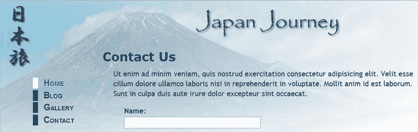

**图 4-2.** 当前页面指示器仍指向首页

幸运的是，通过一点 PHP 条件逻辑可以轻松解决这个问题。在此之前，我们先来看看 Web 服务器和 PHP 引擎如何处理包含文件。

## 为包含文件选择正确的文件扩展名

正如你刚刚看到的，包含文件可以包含原始 HTML。当 PHP 引擎遇到包含命令时，它会在外部文件的开头停止处理 PHP，并在末尾继续处理。如果希望外部文件使用 PHP 代码，则代码必须包含在 PHP 标签中。由于外部文件作为包含它的 PHP 文件的一部分进行处理，因此包含文件可以使用任何文件扩展名。

一些开发者使用 `.inc` 作为文件扩展名，以明确表示该文件旨在被包含在另一个文件中。然而，大多数服务器将 `.inc` 文件视为纯文本。如果该文件包含敏感信息（例如数据库的用户名和密码），这会带来安全风险。如果该文件存储在网站根文件夹中，任何发现该文件名称的人只需在浏览器地址栏中键入 URL，浏览器就会乖乖地显示所有秘密细节！

另一方面，任何带有 `.php` 扩展名的文件都会在发送到浏览器之前自动发送给 PHP 引擎进行解析。只要你的秘密信息位于 PHP 代码块内且文件扩展名为 `.php`，就不会被暴露。这就是为什么一些开发者使用 `.inc.php` 作为 PHP 包含文件的双重扩展名。`.inc` 部分提醒你这是一个包含文件，但服务器只关心末尾的 `.php`，这确保了所有 PHP 代码都能被正确解析。

在很长一段时间里，我遵循使用 `.inc.php` 作为包含文件扩展名的惯例。但由于我将所有包含文件存储在一个名为 `includes` 的单独文件夹中，我认为双重扩展名是多余的。现在我只使用 `.php`。

选择哪种命名约定由你决定，但单独使用 `.inc` 是安全性最低的。


## PHP 解决方案 4-2：测试包含文件的安全性

本方案演示了使用 `.inc` 和 `.php`（或 `.inc.php`）作为包含文件的扩展名之间的区别。请使用上一节中的 `index.php` 和 `menu.php`。或者使用 `ch04` 文件夹中的 `index_02.php` 和 `menu_01.php`。如果你使用下载的文件，请在使用前从文件名中移除 `_02` 和 `_01`。

将 `menu.php` 重命名为 `menu.inc`，并相应编辑 `index.php` 来包含它：

```
<?php require './includes/menu.inc'; ?>
```

在浏览器中加载 `index.php`。你应该看不到任何区别。

修改 `menu.inc` 内部的代码，将密码存储在 PHP 变量中，如下所示：

```
<ul id="nav">
<li><a href="index.php" id="here">首页</a></li>
<?php $password = 'topSecret'; ?>
<li><a href="blog.php">博客</a></li>
<li><a href="gallery.php">画廊</a></li>
<li><a href="contact.php">联系</a></li>
</ul>
```

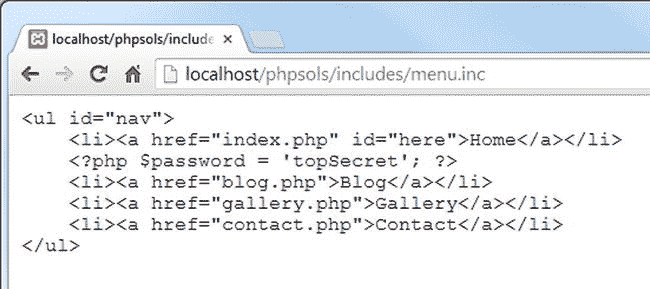

图 4-4. 在浏览器中直接加载 `menu.inc` 会暴露 PHP 代码

现在在浏览器中直接加载 `menu.inc`。图 4-4 显示了会发生什么。


图 4-3. PHP 代码没有输出，因此只有 HTML 被发送到浏览器

重新加载页面。如图 4-3 所示，密码在源代码中保持隐藏。尽管包含文件没有 `.php` 扩展名，但其内容已与 `index.php` 合并，所以 PHP 代码被处理了。

服务器和浏览器都不知道如何处理 `.inc` 文件，因此整个内容都会显示在屏幕上：原始的 HTML、你的秘密密码，一切都会暴露。

将包含文件的名称改为 `menu.inc.php`，然后通过在之前步骤使用的 URL 末尾添加 `.php`，直接在浏览器中加载它。这次，你应该会看到一个无序的链接列表。检查浏览器的源代码视图。PHP 代码没有被暴露。

将名称改回 `menu.php`，并通过直接在浏览器中加载包含文件并再次查看源代码来测试它。

移除你在步骤 3 中添加至 `menu.php` 中的密码 PHP 代码，并将 `index.php` 中的包含命令改回原始设置，如下所示：

```
<?php require './includes/menu.php'; ?>
```

## PHP 解决方案 4-3：自动标识当前页面

现在你已经了解了使用 `.inc` 和 `.php` 作为文件扩展名之间的区别，让我们修复菜单不标识当前页面的问题。该解决方案涉及使用 PHP 找出当前页面的文件名，然后使用条件语句在相应的 `<a>` 标签中插入一个 ID。

继续使用相同的文件。或者使用 `ch04` 文件夹中的 `index_02.php`、`contact.php`、`gallery.php`、`blog.php`、`menu_01.php` 和 `footer_01.php`，确保从所有文件名中移除 `_01` 和 `_02`。

打开 `menu.php`。当前代码如下所示：

```
<ul id="nav">
<li><a href="index.php" id="here">首页</a></li>
<li><a href="blog.php">博客</a></li>
<li><a href="gallery.php">画廊</a></li>
<li><a href="contact.php">联系</a></li>
</ul>
```

控制当前页面指示的样式由第 2 行高亮的 `id="here"` 定义。你需要 PHP 在以下情况插入 `id="here"`：如果当前页面是 `blog.php`，则插入到 `blog.php <a>` 标签中；如果页面是 `gallery.php`，则插入到 `gallery.php <a>` 标签中；如果页面是 `contact.php`，则插入到 `contact.php <a>` 标签中。

希望你现在已经得到了提示——你需要在每个 `<a>` 标签中加入一个 `if` 语句（参见第 3 章中的“做出决策”）。第 2 行需要看起来像这样：

```
<li><a href="index.php" <?php if ($currentPage == 'index.php') { echo 'id="here"'; } ?>>首页</a></li>
```

其他链接应以类似的方式进行修改。但是 `$currentPage` 如何获取其值呢？你需要找出当前页面的文件名。

暂时将 `menu.php` 放在一边，创建一个名为 `get_filename.php` 的新 PHP 页面。在一对 PHP 标签之间插入以下代码（或者使用 `ch04` 文件夹中的 `get_filename.php`）：

```
echo $_SERVER['SCRIPT_FILENAME'];
```

保存 `get_filename.php` 并在浏览器中查看它。在 Windows 系统上，你应该会看到类似以下截图的内容。（`ch04` 文件夹中的版本包含此步骤和下一步的代码，并附有文本说明哪个是哪个。）

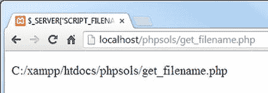

在 Mac OS X 上，你应该会看到类似这样的内容：

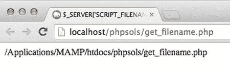

`$_SERVER['SCRIPT_FILENAME']` 来自 PHP 内置的超全局数组之一，它总是给出当前页面的绝对文件路径。你现在需要的是提取出文件名的方法。

像这样修改上一步中的代码：

```
echo basename($_SERVER['SCRIPT_FILENAME']);
```

保存 `get_filename.php` 并点击浏览器中的“重新加载”按钮。你现在应该只看到文件名：`get_filename.php`。

内置的 PHP 函数 `basename()` 以文件路径作为参数并提取出文件名。就这样——你找到了一种找出当前页面文件名的方法。

像这样修改 `menu.php` 中的代码（更改部分以粗体显示）：

```
<?php $currentPage = basename($_SERVER['SCRIPT_FILENAME']); ?>
<ul id="nav">
<li><a href="index.php" <?php if ($currentPage == 'index.php') { echo 'id="here"';} ?>>首页</a></li>
<li><a href="blog.php" <?php if ($currentPage == 'blog.php') { echo 'id="here"';} ?>>博客</a></li>
<li><a href="gallery.php" <?php if ($currentPage == 'gallery.php') { echo 'id="here"';} ?>>画廊</a></li>
<li><a href="contact.php" <?php if ($currentPage == 'contact.php') { echo 'id="here"';} ?>>联系</a></li>
</ul>
```

**注意：** 确保你正确结合了单引号和双引号。虽然 HTML 允许在属性值周围省略引号，但通常最佳实践是使用它们。由于我在 `here` 周围使用了双引号，所以我将字符串 `'id="here"'` 用单引号括起来。我本可以写成 `"id=\"here\""`，但混合使用单引号和双引号更容易阅读。

如有必要，将你的代码与 `ch04` 文件夹中的 `menu_02.php` 进行比较。

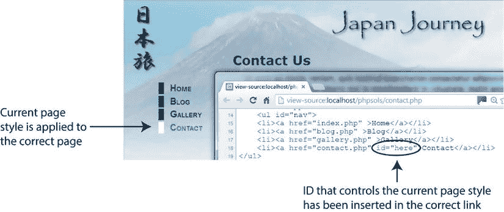

图 4-5. 包含文件中的条件代码为每个页面生成不同的输出

保存 `menu.php` 并在浏览器中加载 `index.php`。菜单看起来应该和之前没有区别。使用菜单导航到其他页面。这次，如图 4-5 所示，当前页面的边框应该是白色的，指示你在网站中的位置。如果你在浏览器中查看页面的源代码视图，你会看到 `here` ID 已自动插入到正确的链接中。


### PHP 方案 4-4：根据文件名自动生成页面标题

既然你已经知道如何获取当前页面的文件名，那么自动生成每个页面的 `<title>` 标签内容也会很有用。本方案使用 `basename()` 提取文件名，然后利用 PHP 字符串函数格式化名称，以便插入到 `<title>` 标签中。

此方法仅适用于文件名能体现页面内容的场景，但由于这是一种良好的实践，所以其实算不上限制。虽然以下步骤使用的是 Japan Journey 网站，但你可以在任何页面上尝试。

创建一个名为 `title.php` 的新 PHP 文件，并将其保存在 `includes` 文件夹中。删除脚本编辑器自动插入的代码，然后输入以下代码：

```
<?php
$title = basename($_SERVER['SCRIPT_FILENAME'], '.php');
```

**提示：** 由于该文件仅包含 PHP 代码，请勿在末尾添加 PHP 结束标签。当同一文件中 PHP 代码后无其他内容时，结束标签是可选的。省略该标签有助于避免包含文件中常见的“headers already sent（标头已发送）”错误。你将在 PHP 方案 4-8 中了解更多关于此错误的信息。

PHP 方案 4-3 中使用的 `basename()` 函数有一个可选的第二个参数：一个字符串，包含前面带点号的文件扩展名。添加第二个参数可以提取文件名并去除其扩展名。因此，这段代码会找到当前页面的文件名，去除 `.php` 扩展名，并将结果赋值给变量 `$title`。

打开 `contact.php`，并在 `DOCTYPE` 上方输入以下代码来引入 `title.php`：

```
<?php include './includes/title.php'; ?>
```

像这样修改 `<title>` 标签：

```
<title>Japan Journey <?php echo "&#8212;{$title}"; ?></title>
```

这里使用 `echo` 显示 `—`（长破折号的数字实体）后跟 `$title` 的值。由于字符串被双引号括起来，PHP 会显示 `$title` 的值。变量 `$title` 被花括号括起来，因为长破折号和 `$title` 之间没有空格。虽然并非总是必要，但在双引号字符串中使用变量且没有空格时，将变量括在花括号内是一个好习惯。这可以使变量对开发者和 PHP 引擎都更清晰。

我没有使用 `echo` 的简写形式（`<?=`），因为我们稍后会向此代码块添加更多脚本。

你的页面开头几行应如下所示：

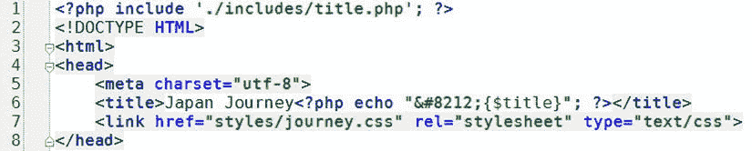

**注意：** 通常情况下，网页中 `DOCTYPE` 声明之前不应有任何内容。但这不适用于 PHP 代码，只要它不向浏览器发送任何输出即可。`title.php` 中的代码仅给 `$title` 赋值，因此 `DOCTYPE` 声明仍然是浏览器看到的第一个输出。

看起来不错，但如果你希望标题中来自文件名的部分首字母大写怎么办？PHP 有一个简洁的小函数 `ucfirst()`，正是用于此目的（一旦你意识到 `uc` 代表“大写”，就很容易记住这个名字）。在第 2 步的代码中添加另一行，如下所示：


图 4-6. 提取文件名后，即可动态生成页面标题

保存两个页面，然后在浏览器中加载 `contact.php`。不带 `.php` 扩展名的文件名已添加到浏览器标签页中，如图 4-6 所示。

```
<?php
$title = basename($_SERVER['SCRIPT_FILENAME'], '.php');
$title = ucfirst($title);
```

如果你是编程新手，这看起来可能令人困惑，但一旦分析起来其实很简单：PHP 标签后的第一行代码获取文件名，去掉末尾的 `.php`，并将其存储为 `$title`。下一行获取 `$title` 的值，将其传递给 `ucfirst()` 来大写首字母，然后将结果存回 `$title`。因此，如果文件名是 `contact.php`，`$title` 初始值为 `contact`，但在执行下一行后，它变成了 `Contact`。

**提示：** 你可以通过将这两行合并为一行来缩短代码，如下所示：

```
$title = ucfirst(basename($_SERVER['SCRIPT_FILENAME'], '.php'));
```

当像这样嵌套函数时，PHP 会先处理最内层的函数，并将结果传递给外层函数。这使代码更短，但可读性较差。

这种技术的一个缺点是文件名只包含一个单词——至少应该是这样。URL 中不允许有空格，这就是大多数网页设计软件将空格替换为 `%20` 的原因，这在 URL 中看起来既丑陋又不专业。你可以通过使用下划线来解决这个问题。

将 `contact.php` 的文件名更改为 `contact_us.php`。

像这样修改 `title.php` 中的代码：

```
<?php
$title = basename($_SERVER['SCRIPT_FILENAME'], '.php');
$title = str_replace('_', ' ', $title);
$title = ucwords($title);
```

中间一行使用名为 `str_replace()` 的函数来查找每个下划线并将其替换为空格。该函数接受三个参数：要查找的字符、替换字符以及要修改的字符串。

**提示：** 你也可以使用 `str_replace()` 来删除字符，方法是将空字符串（一对中间没有任何内容的引号）作为第二个参数。这会将第一个参数中的字符串替换为空，从而有效地删除它。

最后一行动态生成代码使用了与 `ucfirst()` 相关的函数 `ucwords()`，该函数会将每个单词的首字母大写。


图 4-8. 从 `index.php` 生成页面标题会产生不理想的结果

保存 `title.php`，然后在浏览器中加载重命名后的 `contact_us.php`。图 4-7 显示了结果。（Google Chrome 会截断标签页中的标题，但你可以通过工具提示看到完整标题。）

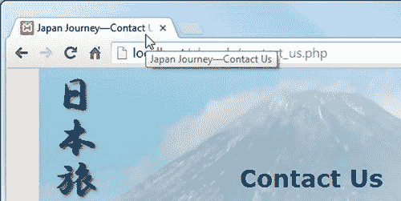

图 4-7. 下划线已被移除，并且两个单词都首字母大写

将文件名称改回 `contact.php`，然后重新加载文件到浏览器中。`title.php` 中的脚本仍然有效。因为没有下划线需要替换，所以 `str_replace()` 会保持 `$title` 的值不变，而 `ucwords()` 会将首字母转换为大写，即使只有一个单词。

对 `index.php`、`blog.php` 和 `gallery.php` 重复步骤 3 和 4。

Japan Journey 网站的主页名为 `index.php`。如图 4-8 所示，将当前方案应用于此页面似乎不太合适。

有两种解决方案：要么不对此类页面应用此技术，要么使用条件语句（`if` 语句）来处理特殊情况。例如，要显示 Home 而非 Index，可以像这样修改 `title.php` 中的代码：

```
<?php
$title = basename($_SERVER['SCRIPT_FILENAME'], '.php');
$title = str_replace('_', ' ', $title);
if ($title == 'index') {
    $title = 'home';
}
$title = ucwords($title);
```

条件语句的第一行使用两个等号来检查 `$title` 的值。下一行使用单个等号将新值赋给 `$title`。如果页面名称不是 `index.php`，花括号内的行将被忽略，`$title` 保持其原始值。

**提示：**


PHP 是区分大小写的，因此这个解决方案仅在`"index"`全为小写时才有效。要进行不区分大小写的比较，请将上述代码第四行修改为：

```
if (strtolower($title) == 'index') {
```

函数`strtolower()`将字符串转换为小写（因此得名），常用于进行不区分大小写的比较。小写转换并非永久性的，因为`strtolower($title)`并未赋值给变量；它仅用于比较操作。要使更改永久生效，需要将结果赋值回变量，例如最后一行将`ucwords($title)`赋值回`$title`。

要将字符串转换为大写，请使用`strtoupper()`。

返回`contact.php`，你将看到页面标题仍然从页面名称正确派生。


**图 4-9**

条件语句将`index.php`上的标题更改为 Home。保存`title.php`并在浏览器中重新加载`index.php`。页面标题现在看起来更自然，如图 4-9 所示。

最后还需要改进一点。`<title>`标签内的 PHP 代码依赖于变量`$title`的存在，如果包含文件出现问题，该变量将不会被设置。在尝试显示来自外部来源的变量内容之前，最好使用名为`isset()`的函数检查该变量是否存在。

将`echo`命令包裹在条件语句中并测试变量是否存在，如下所示：

```
<title>Japan Journey<?php if (isset($title)) { echo "—{$title}"; } ?></title>
```

如果`$title`不存在，则忽略其余代码，保留默认站点标题 Japan Journey。你需要将此更改应用到所有四个页面：`index.php`、`blog.php`、`gallery.php`和`contact.php`。

你可以将代码与`title.php`以及`ch04`文件夹中`index_03.php`、`blog_02.php`、`gallery_02.php`和`contact_02.php`的更新版本进行比对。

## 创建内容变化的页面

到目前为止，我们已经使用 PHP 根据页面的文件名生成不同的输出。接下来的两个解决方案将生成独立于文件名变化的内容：一个在 1 月 1 日自动更新年份的版权声明，以及一个随机图像生成器。

### PHP 解决方案 4-5：自动更新版权声明

目前，`footer.php`中的版权声明仅包含静态 HTML。此 PHP 解决方案将展示如何使用`date()`函数自动生成当前年份。代码还指定了版权起始年份，并使用条件语句判断当前年份是否不同。如果不同，则同时显示两个年份。

继续使用 PHP 解决方案 4-4 中的文件。或者，使用`ch04`文件夹中的`index_03.php`和`footer_01.php`，并移除文件名中的数字。如果使用`ch04`文件夹中的文件，请确保`includes`文件夹中有`title.php`和`menu.php`的副本。

打开`footer.php`。它包含以下 HTML：

```
<footer>
<p>&copy; 2006&ndash;2014 David Powers</p>
</footer>
```

日期之间的`&ndash;`是短破折号的字符实体。

使用包含文件的优点在于，只需更改这一个文件即可更新整个网站的版权声明。然而，更高效的方法是自动增加年份，从而完全无需每年更新。

PHP 的`date()`函数可以非常简洁地处理这个问题。将段落中的代码修改如下：

```
<p>&copy; 2006&ndash;<?php echo date('Y'); ?> David Powers</p>
```

这将替换第二个日期，并使用四位数字显示当前年份。请确保向`date()`传递大写字母 Y 作为参数。

保存`footer.php`并在浏览器中加载`index.php`。页面底部的版权声明应看起来与之前相同——当然，除非你是在 2015 年或之后阅读本文，在这种情况下将显示当前年份。与大多数版权声明一样，这里涵盖了一个年份范围，表示网站首次上线的时间。由于第一个日期是过去的日期，可以硬编码。但如果你正在创建一个新网站，则只需要当前年份。直到 1 月 1 日才需要年份范围。

你不可能为了更新版权声明而中断新年狂欢。必须有更好的方法。多亏了 PHP，你可以在新年前夜尽情狂欢。

要显示年份范围，你需要知道起始年份和当前年份。如果两个年份相同，则仅显示当前年份；如果不同，则同时显示并用短破折号分隔。这是一个简单的`if...else`场景。将`footer.php`中的段落代码修改如下：

```
<p>&copy;
<?php
$startYear = 2006;
$thisYear = date('Y');
if ($startYear == $thisYear) {
    echo $startYear;
} else {
    echo "{$startYear}&ndash;{$thisYear}";
}
?>
David Powers</p>
```

与 PHP 解决方案 4-4 一样，我在`else`子句中使用了花括号包裹变量，因为它们位于不含空格的双引号字符串中。

保存`footer.php`并在浏览器中重新加载`index.php`。版权声明应看起来与之前相同。将传递给`date()`函数的参数改为小写 y，如下所示：

```
$thisYear = date('y');
```

保存`footer.php`并点击浏览器的刷新按钮。第二个年份将仅显示最后两位数字，如下截图所示：


> **提示**
> 
> 这应提醒你 PHP 是区分大小写的。对于`date()`函数，大写 Y 和小写 y 会产生不同的结果。忘记大小写敏感性是 PHP 中最常见的错误原因之一。

将传递给`date()`的参数改回大写 Y。将`$startYear`的值设置为当前年份并重新加载页面。这次，你应该只看到当前年份显示。你现在拥有了一个全自动的版权声明。完成后的代码位于`ch04`文件夹中的`footer_02.php`。


### PHP 方案 4-6：显示随机图片

显示随机图片非常简单。你只需要一个可用图片列表，并将其存储在索引数组中（参见第 3 章中的“创建数组”）。由于索引数组从 0 开始编号，你可以通过生成一个介于 0 和数组长度减 1 之间的随机数来随机选择一张图片。这一切只需几行代码即可完成……

继续使用相同的文件。或者，使用 `ch04` 文件夹中的 `index_03.php` 并将其重命名为 `index.php`。由于 `index_03.php` 使用了 `title.php`、`menu.php` 和 `footer.php`，请确保这三个文件都在你的 `includes` 文件夹中。图片已存放在 `images` 文件夹中。

在 `includes` 文件夹中创建一个空白的 PHP 页面，并将其命名为 `random_image.php`。插入以下代码（该代码也存在于 `ch04` 文件夹的 `random_image_01.php` 中）：

```php
<?php

$images = ['kinkakuji', 'maiko', 'maiko_phone', 'monk', 'fountains',

'ryoanji', 'menu', 'basin'];

$i = rand(0, count($images)-1);

$selectedImage = "images/{$images[$i]}.jpg";
```

这就是完整的脚本：一个不包含 `.jpg` 文件扩展名的图片名称数组（无需重复共享信息——它们都是 JPEG 格式）、一个随机数生成器，以及一个用于构建选中文件正确路径名的字符串。

**注意：** 此脚本使用了自 PHP 5.4 起引入的简写数组语法。

要在指定范围内生成随机数，请将最小值和最大值作为参数传递给 `rand()` 函数。由于数组中有八张图片，你需要一个介于 0 到 7 之间的数字。简单的做法是使用 `rand(0, 7)` — 简单但效率低下。每次更改 `$images` 数组时，你都需要手动计算它包含多少个元素，并修改传递给 `rand()` 的最大值。

让 PHP 替你计数要容易得多，而这正是 `count()` 函数的作用：它计算数组中元素的数量。你需要一个比数组元素数量少一的数字，因此传递给 `rand()` 的第二个参数变成了 `count($images)-1`，结果存储在 `$i` 中。

最后一行使用这个随机数为选中的文件构建正确的路径名。变量 `$images[$i]` 被嵌入到一个双引号字符串中，且与周围字符之间没有空格，因此它被包含在花括号内。数组从 0 开始，所以如果随机数是 1，`$selectedImage` 就是 `images/maiko.jpg`。

如果你是 PHP 新手，可能会觉得理解以下代码有些困难：

```php
$i = rand(0, count($images)-1);
```

其实，传递给 `rand()` 的第二个参数是一个表达式，而不是一个数字。如果这样能让你更容易理解，可以将代码重写如下：

```php
$numImages = count($images); // $numImages 是 8
$max = $numImages - 1;       // $max 是 7
$i = rand(0, $max);          // $i = rand(0, 7)
```

打开 `index.php`，通过在与 `title.php` 相同的代码块中插入命令来引入 `random_image.php`，如下所示：

```php
<?php include './includes/title.php';
include './includes/random_image.php'; ?>
```

由于 `random_image.php` 不会直接向浏览器发送任何输出，因此将其放在 `DOCTYPE` 之上是安全的。

向下滚动 `index.php`，找到在 `<figure>` 元素中显示图片的代码。它看起来像这样：

```html
<figure>

<figcaption>Water basin at Ryoanji temple</figcaption>
</figure>
```

不要使用固定的 `images/basin.jpg` 图片，而是用 `$selectedImage` 替换它。所有图片都有不同的尺寸，因此删除 `width` 和 `height` 属性，并使用通用的 `alt` 属性。同时移除 `<figcaption>` 元素中的文本。第三步中的代码现在应该如下所示：

```html
<figure>
" alt="Random image">
<figcaption></figcaption>
</figure>
```

**注意：** PHP 代码块只显示一个值，因此你可以使用简写 `<?=`。


**图 4-10.** 将图片文件名存储在索引数组中可以轻松显示随机图片

保存 `random_image.php` 和 `index.php`，然后在浏览器中加载 `index.php`。此时图片应该会随机显示。点击浏览器中的“重新加载”按钮；你应该会看到各种不同的图片，如图 4-10 所示。

你可以将代码与 `ch04` 文件夹中的 `index_04.php` 和 `random_image_01.php` 进行对比。

这是一种简单有效的随机图片显示方式，但如果能动态设置不同尺寸图片的宽度和高度，并为图片添加描述性标题，效果会更好。


#### PHP 方案 4-7：为随机图片添加标题

本方案使用多维数组（即数组的数组）来存储每张图片的文件名和标题。如果你觉得多维数组的概念抽象难懂，不妨把它想象成一个大箱子，里面装了许多信封，每个信封里都有一张照片和它的标题。箱子是顶层数组，里面的信封则是子数组。

这些图片尺寸各不相同，但 PHP 恰好提供了一个名为 `getimagesize()` 的函数。猜猜它是做什么的。

此 PHP 方案基于之前的方案构建，因此请继续使用相同的文件。

打开 `random_image.php` 并将代码修改如下：

```
<?php

$images = [
    ['file'    => 'kinkakuji',
     'caption' => '京都金阁寺'],
    ['file'    => 'maiko',
     'caption' => '舞伎——京都的见习艺伎'],
    ['file'    => 'maiko_phone',
     'caption' => '每个舞伎都应该有一个——当然是手机'],
    ['file'    => 'monk',
     'caption' => '在京都化缘的僧人'],
    ['file'    => 'fountains',
     'caption' => '东京市中心的喷泉'],
    ['file'    => 'ryoanji',
     'caption' => '京都龙安寺的秋叶'],
    ['file'    => 'menu',
     'caption' => '京都先斗町餐厅外的菜单'],
    ['file'    => 'basin',
     'caption' => '京都龙安寺的水盆']
];

$i = rand(0, count($images)-1);
$selectedImage = "images/{$images[$i]['file']}.jpg";
$caption = $images[$i]['caption'];
```

**注意**  
代码需要仔细处理。每个子数组由一对方括号括起来，后跟一个逗号，用于与下一个子数组分隔。按照图示对齐数组键和值，你会发现构建和维护多维数组会更容易。

虽然代码看起来复杂，但它只是一个普通的索引数组，包含八个元素，每个元素都是一个关联数组，定义了 `'file'` 和 `'caption'`。多维数组的定义构成了一条语句，因此在第 19 行之前没有分号。该行的右括号与第 2 行的左括号匹配。

用于选择图片的变量也需要更改，因为 `$images[$i]` 不再包含字符串，而是包含一个数组。要获取正确的图片文件名，需要使用 `$images[$i]['file']`。所选图片的标题包含在 `$images[$i]['caption']` 中，并存储在一个较短的变量中。

现在需要修改 `index.php` 中的代码以显示标题，如下所示：

```
<figure>
" alt="随机图片">
<figcaption><?= $caption; ?></figcaption>
</figure>
```

在 `random_image.php` 末尾添加以下代码：

```
if (file_exists($selectedImage) && is_readable($selectedImage)) {
    $imageSize = getimagesize($selectedImage);
}
```

`if` 语句使用了两个函数 `file_exists()` 和 `is_readable()`，以确保 `$selectedImage` 不仅存在，而且可以访问（它可能已损坏或权限错误）。这些函数返回布尔值（`true` 或 `false`），因此可以直接用作条件语句的一部分。`if` 语句内的单行代码使用 `getimagesize()` 函数获取图片的尺寸，并将其存储在 `$imageSize` 中。你将在第 8 章了解更多关于 `getimagesize()` 的信息。目前，你需要关注以下两条信息：

* `$imageSize[0]`：图片的宽度（像素）
* `$imageSize[3]`：一个字符串，包含图片的高度和宽度，格式化为可插入 `` 标签的内容

首先，让我们修复 `` 标签中的代码。按如下方式修改：


**图 4-11.** 长标题超出了图片范围，并将其向左偏移过多

保存 `index.php` 和 `random_image.php`，然后在浏览器中加载 `index.php`。大多数图片看起来正常，但手持手机的舞伎图片右侧会出现一个难看的空白，如图 4-11 所示。

```
" alt="随机图片" <?= $imageSize[3]; ?>>
```

这会在 `` 标签中插入正确的 `width` 和 `height` 属性。

虽然这设置了图片的尺寸，但仍需控制标题的宽度。你不能在外部样式表中使用 PHP，但这并不妨碍你在 `index.php` 的 `<head>` 中创建一个 `<style>` 块。在结束的 `</head>` 标签之前插入以下代码。

```
<?php if (isset($imageSize)) { ?>
<style>
figcaption {
    width: <?= $imageSize[0]; ?>px;
}
</style>
<?php } ?>
```

这段代码只有短短七行，但却是 PHP 和 HTML 的奇特混合。让我们从第一行和最后一行开始。如果去掉 PHP 标签并用注释替换 HTML `<style>` 块，你会得到以下内容：

```
if (isset($imageSize)) {
    // 如果 $imageSize 已设置，则执行某些操作
}
```

换句话说，如果变量 `$imageSize` 尚未设置（定义），PHP 引擎会忽略花括号之间的所有内容。括号之间的代码大部分是 HTML 和 CSS，这无关紧要。如果 `$imageSize` 尚未设置，PHP 引擎会跳转到右花括号，中间代码不会发送到浏览器。

**提示**  
许多经验不足的 PHP 编码人员错误地认为需要在条件语句中使用 `echo` 或 `print` 来生成 HTML 输出。只要开闭花括号匹配，你就可以像这样使用 PHP 隐藏或显示 HTML 部分。这比一直使用 `echo` 整洁得多，也省去了大量输入。

如果 `$imageSize` 已设置，则会创建 `<style>` 块，并使用 `$imageSize[0]` 为包含标题的段落设置正确的宽度。

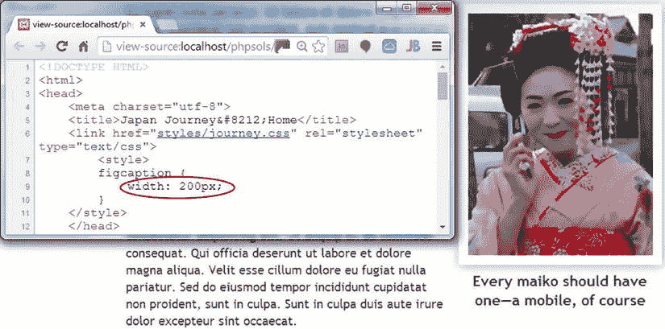

**图 4-12.** 通过创建与图片大小直接相关的样式规则，消除了难看的空白

保存 `random_image.php` 和 `index.php`，然后在浏览器中重新加载 `index.php`。点击“重新加载”按钮，直到出现手持手机的舞伎图片。这一次，它看起来应该像图 4-12。如果查看浏览器的源代码，样式规则会使用正确的图片宽度。

**注意**  
如果标题仍然突出，请确保 `<style>` 块中结束的 PHP 标签和 `px` 之间没有空格。CSS 不允许值和度量单位之间有空白。

`random_image.php` 底部的条件语句仅当所选图片存在且可读时才设置 `$imageSize`，因此如果设置了 `$imageSize`，你就知道一切准备就绪。在 `index.php` 中，在显示图片的 `<figure>` 元素周围添加条件语句的开闭块，如下所示：

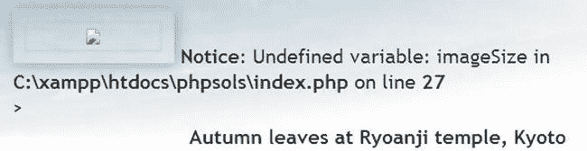

**图 4-13.** 包含文件中的错误可能会破坏页面外观

`random_image.php` 中的代码和你刚刚插入的代码防止了所选图片无法找到时出现错误，但显示图片的代码缺少类似的检查。临时更改 `random_image.php` 或 `images` 文件夹中某个图片的名称。多次重新加载 `index.php`。最终，你应该会看到类似图 4-13 中的错误消息。这看起来非常不专业。

```
<?php if (isset($imageSize)) { ?>
<figure>
" alt="随机图片"
<?= $imageSize[3]; ?>>
<figcaption><?= $caption; ?></figcaption>
</figure>
<?php } ?>
```


已存在的图像会正常显示，但即使文件缺失或损坏，你也能避免令人尴尬的错误信息——这显得更加专业。别忘了恢复你在上一步中修改的图像名称。

你可以在`ch04`文件夹中的`index_05.php`和`random_image_02.php`文件中核对你的代码。

## 使用包含文件防止错误

许多主机商会关闭通知级别的错误报告，因此，如果你只在远程服务器上进行测试，可能不会意识到图 4-13 所示的问题。然而，在互联网上部署 PHP 页面之前，消除所有错误非常重要。仅仅因为你看不到错误信息，并不意味着你的页面没有问题。

使用 PHP 这类服务器端技术的页面会处理许多未知因素，因此明智的做法是进行防御性编码，在使用值之前先进行检查。本节将介绍一些措施，你可以用来预防和排查包含文件相关的错误。

### 检查变量的存在性

从 PHP 解决方案 4-7 中可以得出的教训是，你应该始终使用`isset()`来验证来自包含文件的变量是否存在，并将使用该变量的任何代码包装在条件语句中。在这个特定案例中，如果`$imageSize`不存在，你就知道没有图像可显示，因此需要移除`<figure>`元素。不过，在其他情况下，你或许可以为变量分配一个默认值，如下所示：

```
if (!isset($someVariable)) {
    $someVariable = default value;
}
```

这段代码使用了逻辑`非`运算符（参见第 3 章的表格 3-6），检查`$someVariable`是否未被设置。如果`$someVariable`不存在，则为其分配一个默认值，该值可以在后面的脚本中使用。如果它已存在，则条件语句内的代码会被跳过，并会使用原始值。

### 检查函数或类是否已定义

包含文件经常用于定义自定义函数或类。尝试使用一个未定义的函数或类会触发致命错误。要检查一个函数是否已定义，请将函数名作为字符串传递给`function_exists()`。在向`function_exists()`传递函数名时，省略函数名末尾的括号。例如，你可以这样检查一个名为`doubleIt()`的函数是否已定义：

```
if (function_exists('doubleIt')) {
    // 使用 doubleIt()
}
```

要检查一个类是否已定义，可以类似地使用`class_exists()`，将一个包含类名的字符串作为参数传递：

```
if (class_exists('MyClass')) {
    // 使用 MyClass
}
```

假设你想使用该函数或类，那么更实用的方法是：如果函数或类尚未定义，则使用条件语句来包含定义文件。例如，如果`doubleIt()`的定义位于名为`utilities.php`的文件中：

```
if (!function_exists('doubleIt')) {
    require_once './includes/utilities.php';
}
```

## 在线上网站中抑制错误信息

假设你的包含文件在远程服务器上正常工作，那么前几节概述的措施可能就是你需要的全部错误检查了。但是，如果你的远程服务器显示了错误信息，你应该采取措施来抑制它们。以下技术可以隐藏所有错误信息，而不仅仅是与包含文件相关的那些。

### 使用错误控制运算符

一种比较粗糙但有效的技术是使用 PHP 错误控制运算符（`@`），它可以抑制与其所在行相关的错误信息。你可以将`@`放在行的开头，或者直接放在你可能认为会生成错误的函数或命令前面，如下所示：

```
@ include './includes/random_image.php';
```

错误控制运算符的问题在于，它隐藏了错误，而不是绕开它们解决问题。它只有一个字符，因此很容易忘记你使用过它。结果，你可能在脚本的错误部分浪费大量时间查找错误。如果你使用了错误控制运算符，那么在排查问题时，`@`标记应该是你第一个移除的东西。

另一个缺点是，你需要在每一个可能生成错误信息的行上都使用错误控制运算符，因为它只影响当前行。

### 在 PHP 配置中关闭`display_errors`

在线上网站中抑制错误信息的一个更好方法是，在 Web 服务器的配置中关闭`display_errors`指令。最有效的方式是你的主机商允许你控制`php.ini`设置时，直接编辑它。找到`display_errors`指令，并将其从`On`改为`Off`。

如果你无法控制`php.ini`，许多主机商允许你通过一个名为`.htaccess`或`.user.ini`的文件来更改有限范围的配置设置。具体使用哪个文件取决于 PHP 在服务器上的安装方式，因此请咨询你的主机商以确定使用哪一个。

如果你的服务器支持`.htaccess`文件，请在服务器根目录下的`.htaccess`文件中添加以下命令：

```
php_flag display_errors Off
```

在`.user.ini`文件中，命令则很简单：

```
display_errors Off
```

`.htaccess`和`.user.ini`都是纯文本文件。与`php.ini`一样，每个命令都应单独占一行。如果这些文件在你的远程服务器上尚不存在，你可以直接在文本编辑器中创建它们。确保你的编辑器不会自动在文件名末尾添加`.txt`。然后，将该文件上传到你的网站服务器根目录。

> **提示**
> Mac OS X 会隐藏以点号开头的文件名，因此你在 Mac Finder 中将无法看到它们。但是，你应该可以使用专门的脚本编辑器打开它们。在“文件 ➤ 打开”对话框中，选择“启用: 所有项目”并勾选“显示隐藏项目”复选框。

#### 在单个文件中关闭`display_errors`

如果你无法控制服务器配置，可以通过在任何脚本的顶部添加以下代码行来阻止错误信息显示：

```
<?php ini_set('display_errors', '0'); ?>
```


### PHP 解决方案 4-8：在无法找到包含文件时进行重定向

到目前为止所有建议的技术都只是抑制在找不到包含文件时的错误消息。如果缺少包含文件会导致页面失去意义，那么你应该在包含文件缺失时将用户重定向到错误页面。

一种实现方式是抛出异常，像这样：

```
$file = './includes/menu.php';
if (file_exists($file) && is_readable($file)) {
    include $file;
} else {
    throw new Exception("$file can't be found");
}
```

当使用可能抛出异常的代码时，你需要将其包装在 `try` 块中，并创建一个 `catch` 块来处理异常（参见第 3 章中的"处理异常"）。这个 PHP 解决方案展示了如何做到这一点，即当找不到包含文件时，使用 `catch` 块将用户重定向到不同的页面。

如果你已经彻底设计和测试了你的网站，那么在大多数使用包含文件的页面上应该不需要用到这种技术。然而，这绝非一个毫无意义的练习。它展示了 PHP 的几个重要特性：如何抛出和捕获异常，以及如何重定向到另一个页面。正如你将从下面的说明中看到的，重定向并不总是那么简单。这个 PHP 解决方案展示了如何克服最常见的问题。

继续使用 PHP 解决方案 4-7 中的 `index.php`。或者，使用 `ch04` 文件夹中的 `index_05.php`。

将 `ch04` 文件夹中的 `error.php` 复制到站点根目录。如果你的编辑程序提示你更新页面中的链接，请不要更新。这是一个静态页面，包含一条通用错误消息和返回其他页面的链接。在你的编辑程序中打开 `index.php`。导航菜单是最不可或缺的包含文件，因此像这样编辑 `index.php` 中的 `require` 命令：

```
$file = './includes/menu.php';
if (file_exists($file) && is_readable($file)) {
    require $file;
} else {
    throw new Exception("$file can't be found");
}
```

提示：像这样将包含文件的路径存储在一个变量中，可以避免重复输入四次，从而减少拼写错误的可能性。

要重定向用户到另一个页面，请使用 `header()` 函数。但是，如果在调用 `header()` 之前有任何输出已经发送到浏览器，重定向就不会工作。除非存在语法错误，否则 PHP 引擎通常会从页面顶部开始处理，输出 HTML，直到遇到问题。这意味着当 PHP 引擎执行到这段代码时，输出已经开始了。为了防止这种情况，在任何输出生成之前启动 `try` 块。（这在许多设置上实际上不会起作用，但请稍安勿躁，因为它展示了一个重要的点。）

滚动到页面顶部，像这样编辑开头的 PHP 代码块：

```php
<?php try {
    include './includes/title.php';
    include './includes/random_image.php'; ?>
```

这样就打开了 `try` 块。

向下滚动到页面底部，在结束的 `</html>` 标签之后添加以下代码：

```php
<?php } catch (Exception $e) {
    header('Location: http://localhost/phpsols/error.php ');
} ?>
```

这样就关闭了 `try` 块并创建了一个 `catch` 块来处理异常。`catch` 块中的代码使用 `header()` 将用户重定向到 `error.php`。

`header()` 函数向浏览器发送一个 HTTP 头。它接受一个字符串作为参数，该字符串包含由冒号分隔的头及其值。在这里，它使用 `Location` 头将浏览器重定向到冒号后 URL 指定的页面。如果需要，请调整 URL 以匹配你自己的设置。

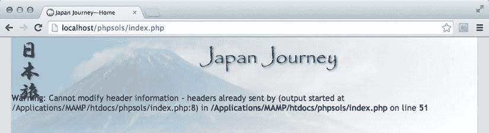

图 4-14。如果输出已经发送到浏览器，`header()` 函数将无法工作。

保存 `index.php` 并在浏览器中测试该页面。它应该正常显示。更改 `$file`（你在第 2 步中创建的变量）的值，使其指向一个不存在的包含文件，例如 `men.php`。保存 `index.php` 并在浏览器中重新加载它。如果你在测试环境中使用 XAMPP，你很可能被正确地重定向到 `error.php`。使用 MAMP（以及其他测试环境），你很可能会看到图 4-14 中的消息。

图 4-14 中的错误消息可能是导致最多人捶键盘的原因了。（我也心头带伤。）如前所述，如果输出已经发送到浏览器，则不能使用 `header()` 函数。那么，到底发生了什么？

答案就在错误消息中，但并非一目了然。它说错误发生在第 51 行，这是调用 `header()` 函数的地方。你真正需要知道的是输出是在哪里生成的。这个信息隐藏在这里：

`(output started at /Applications/MAMP/htdocs/phpsols/index.php:8)`

冒号后面的数字 8 是行号。那么，`index.php` 的第 8 行是什么？正如你从下面的屏幕截图中看到的，第 8 行使用 `echo` 来显示 `$title` 的值。

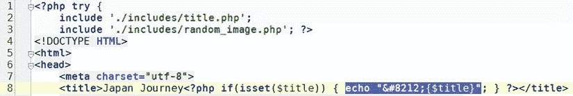

因为直到这一点代码都没有错误，PHP 引擎已经输出了 HTML。一旦发生这种情况，`header()` 就无法重定向页面。

即使你删除这行 PHP 代码，错误消息也只会报告输出是从包含 PHP 块的下一行开始的。实际发生的情况是，web 服务器正在输出 `DOCTYPE` 之后的所有 HTML，但 PHP 引擎需要处理一个 PHP 代码块才能报告行号。这就提出了一个问题：在输出已经发送到浏览器之后，如何重定向页面。幸运的是，PHP 提供了答案，它允许你将输出存储在一个缓冲区（web 服务器的内存）中。

注意：你在 XAMPP 和其他一些设置中不会收到此错误消息的原因是，PHP 配置中已启用输出缓冲。XAMPP 将该值设置为 4096，这意味着在 HTTP 头发送到浏览器之前，缓冲区中存储了 4 KB 的输出。虽然这很有用，但它给你一种虚假的安全感，因为你的远程服务器上可能没有启用输出缓冲。所以，即使你被正确重定向了，也请继续阅读。

像这样编辑 `index.php` 顶部的代码块：

```php
<?php ob_start();
try {
    include './includes/title.php';
    include './includes/random_image.php'; ?>
```

`ob_start()` 函数会开启输出缓冲，防止在调用 `header()` 函数之前有任何输出被发送到浏览器。

PHP 引擎会在脚本结束时自动刷新缓冲区，但最好显式地进行刷新。像这样编辑页面底部的 PHP 代码块：

```php
<?php } catch (Exception $e) {
    ob_end_clean();
    header('Location: http://localhost/phpsols/error.php ');
}
ob_end_flush();
?>
```

这里添加了两个不同的函数。当重定向到另一个页面时，你不希望缓冲区中存储的 HTML 被发送出去。因此，在 `catch` 块内部，调用了 `ob_end_clean()`，它会关闭缓冲区并丢弃其内容。

然而，如果没有抛出异常，你希望显示缓冲区的内容，因此在 `try` 和 `catch` 两个块之后的页面末尾调用了 `ob_end_flush()`。这会刷新缓冲区的内容并将其发送到浏览器。

将 `$file` 的值改回 `./includes/menu.php` 并保存 `index.php`。当你点击错误页面上的 Home 链接时，`index.php` 应该会正常显示。

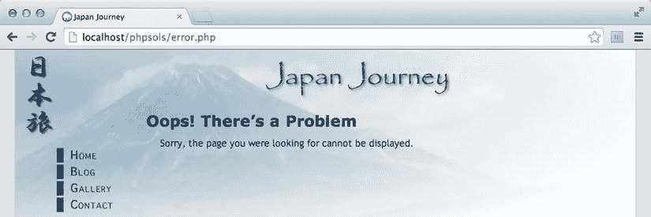

图 4-15。


