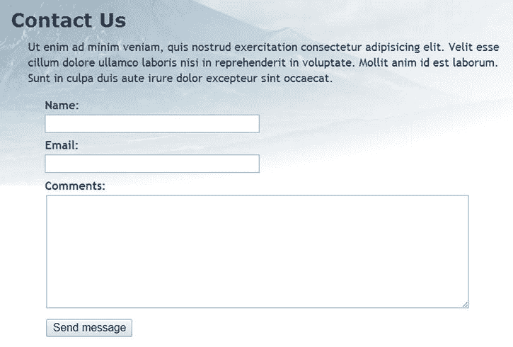
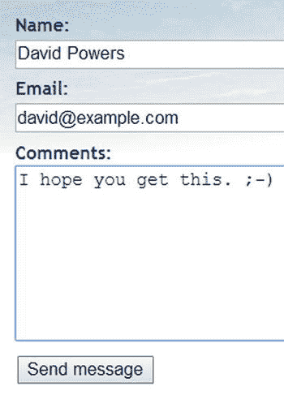
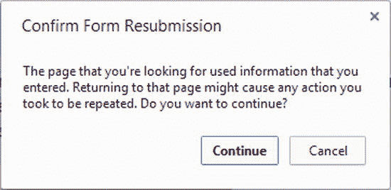
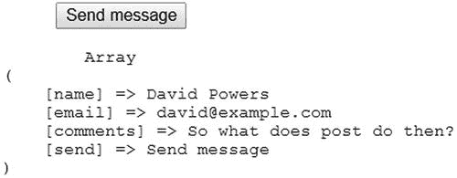
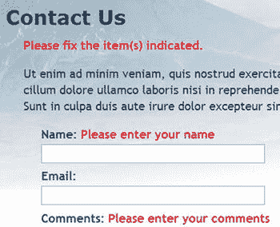
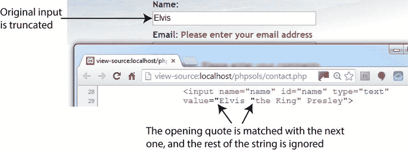
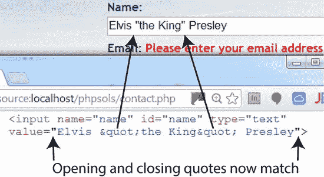
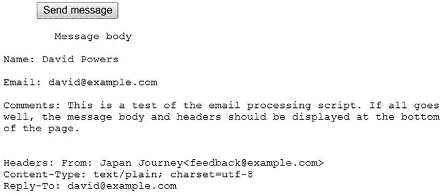

# PHP 如何从表单中收集信息

虽然 HTML 包含了构建表单所需的所有标签，但它并未提供任何在提交时处理表单的方法。为此，你需要一个服务器端解决方案，例如 PHP。

日本之旅网站包含一个简单的反馈表单（见图 5-1）。其他元素——如单选按钮、复选框和下拉菜单——稍后会添加。



图 5-1. 处理反馈表单是 PHP 最流行的用途之一

首先，让我们看一下该表单的 HTML 代码（位于 `ch05` 文件夹的 `contact_01.php` 中）：

```html
<form method="post" action="">
<p>
<label for="name">Name:</label>
<input name="name" id="name" type="text">
</p>
<p>
<label for="email">Email:</label>
<input name="email" id="email" type="text">
</p>
<p>
<label for="comments">Comments:</label>
<textarea name="comments" id="comments"></textarea>
</p>
<p>
<input name="send" type="submit" value="Send message">
</p>
</form>
```

前两个 `<input>` 标签和 `<textarea>` 标签都包含 `name` 和 `id` 属性，且被设置为相同的值。这种重复的原因是：HTML、CSS 和 JavaScript 都引用 `id` 属性，而表单处理脚本依赖于 `name` 属性。因此，尽管 `id` 属性是可选的，但对于每个需要处理的元素，你必须使用 `name` 属性。

另外需要注意的两点是，起始 `<form>` 标签中的 `method` 和 `action` 属性。`method` 属性决定了表单如何发送数据。它可以设置为 `post` 或 `get`。`action` 属性告诉浏览器当点击“提交”按钮时将数据发送到哪里进行处理。如果该值留空（如此处所示），则页面会尝试自行处理表单。

**注意**

我刻意没有使用任何新的 HTML5 表单功能，例如 `type="email"` 和 `required` 属性。这样可以更轻松地测试 PHP 服务器端验证脚本。测试完成后，你可以更新表单以使用 HTML5 验证功能。浏览器中的验证主要是为了方便用户，防止提交不完整的信息，因此它是可选的。服务器端验证则绝不可省略。

## 理解 `post` 和 `get` 的区别

演示 `post` 和 `get` 方法之间区别的最佳方式是使用一个真实的表单。如果你完成了上一章，可以继续使用相同的文件。

否则，`ch05` 文件夹中包含日本之旅网站的完整文件集，其中包含了 第 4 章 中的所有代码。将 `contact_01.php` 复制到站点根目录，并将其重命名为 `contact.php`。另外，将 `ch05/includes` 文件夹的内容复制到站点根目录的 `includes` 文件夹中。

找到 `contact.php` 中的起始 `<form>` 标签，并将 `method` 属性的值从 `post` 改为 `get`，如下所示：

```html
<form method="get" action="">
```

保存 `contact.php` 并在浏览器中加载该页面。在表单中输入你的姓名、电子邮件地址和一条简短的消息，然后点击“发送消息”。



查看浏览器地址栏。你应该会看到表单的内容附加在 URL 的末尾，如下所示：


如果你分解这个 URL，它看起来是这样的：

```
http://localhost/phpsols/contact.php
?name=David+Powers
&email=david%40example.com
&comments=I+hope+you+get+this.+%3B-%29
&send=Send+message
```

基本 URL 之后的每一行都以表单元素的 `name` 属性开头，后跟一个等号和输入字段的内容。URL 不能包含空格或某些字符（例如我的笑脸符号），因此浏览器将它们编码为十六进制值，这个过程称为 URL 编码（有关完整的值列表，请参见 [`www.w3schools.com/tags/ref_urlencode.asp`](http://www.w3schools.com/tags/ref_urlencode.asp)）。

第一个 `name` 属性前面有一个问号（`?`），其余前面有一个 & 符号（`&`）。在使用搜索引擎时你会看到这种类型的 URL，这有助于解释为什么问号之后的所有内容被称为查询字符串。

回到 `contact.php` 的代码中，将 `method` 改回 `post`，如下所示：

```html
<form method="post" action="">
```

保存 `contact.php` 并在浏览器中重新加载页面。输入另一条消息并点击“发送消息”。你的消息应该会消失，但不会发生其他任何事情。消息并没有丢失，只是你还未做任何处理。

在 `contact.php` 中，在结束的 `</form>` 标签正下方添加以下代码：

```php
<pre>
<?php if ($_POST) { print_r($_POST); } ?>
</pre>
```

如果已发送任何 `post` 数据，这将显示 `$_POST` 超全局数组的内容。如 第 3 章 所述，`print_r()` 函数允许你检查数组的内容；`<pre>` 标签只是让输出更易于阅读。

保存页面并点击浏览器中的“刷新”按钮。你可能会看到一个类似于下面的警告。这告诉你数据将被重新发送，这完全正是你想要的。确认你希望再次发送信息。



来自第 6 步的代码现在应该会在表单下方显示你消息的内容，如图 5-2 所示。所有内容都已存储在 PHP 的超全局数组 `$_POST` 中，该数组包含使用 `post` 方法发送的数据。每个表单元素的 `name` 属性被用作数组键，这使得检索内容变得很容易。



图 5-2. `$_POST` 数组使用表单的 `name` 属性来标识每个数据元素

正如你刚刚看到的，`get` 方法以一种非常暴露的方式发送数据，使其容易受到篡改。此外，某些浏览器将 URL 的最大长度限制在约 2000 个字符，因此 `get` 方法只能用于少量数据。`post` 方法更安全，并且可以用于更大量的数据。默认情况下，PHP 允许最多 8 MB 的 `post` 数据，尽管托管公司可能会设置不同的限制。

因此，在处理表单时，你通常应使用 `post` 方法。`get` 方法主要与数据库搜索结合使用；将你的搜索结果加入书签非常有用，因为所有搜索条件都包含在 URL 中。我们将在本书后面再次讨论 `get` 方法。本章重点介绍 `post` 方法及其相关的超全局数组 `$_POST`。

**警告**

尽管 `post` 方法比 `get` 更安全，但你不应假设它是 100% 安全的。为了实现安全传输，你需要使用加密技术或安全套接字层（SSL），并且 URL 必须以 `https://` 开头。

### 使用 PHP 超全局变量获取表单数据

`$_POST` 超全局数组包含通过 `post` 方法发送的数据。不出所料，通过 `get` 方法发送的数据则存储在 `$_GET` 数组中。

要访问表单提交的值，只需将表单元素的 `name` 属性值用引号括起来，放在 `$_POST` 或 `$_GET` 后面的方括号中，具体使用哪个取决于表单的 `method` 属性。因此，如果通过 `post` 方法发送，`email` 就变成 `$_POST['email']`；如果通过 `get` 方法发送，则变成 `$_GET['email']`。就是这么简单。

你可能会遇到使用 `$_REQUEST` 的脚本，它无需区分 `$_POST` 或 `$_GET`。但这种做法安全性较低。请始终使用 `$_POST` 或 `$_GET`。

旧版脚本可能使用`$HTTP_POST_VARS`或`$HTTP_GET_VARS`，它们与`$_POST`和`$_GET`含义相同。不过旧版变量在大多数服务器上已无法使用，请改用`$_POST`和`$_GET`。

**注意**

忽略那些建议你通过启用 PHP 配置中的`register_globals`来简化表单数据获取的“建议”。`register_globals`指令已在 PHP 5.4 中永久禁用，以提高安全性。你无法再将其重新开启。

## 处理并验证用户输入

本章的最终目标是将`contact.php`表单中的输入通过电子邮件发送到你的收件箱。使用 PHP 的`mail()`函数相对简单，它至少需要三个参数：邮件发送的目标地址、包含主题行的字符串，以及包含邮件正文的字符串。你可以通过将输入字段的内容拼接（连接）成一个字符串来构建邮件正文。

大多数互联网服务提供商（ISP）实施的安全措施使得在本地测试环境中测试`mail()`函数变得困难，甚至不可能。因此，在 PHP 解决方案 5-1 至 5-4 中，我们不会直接使用`mail()`，而是专注于验证用户输入，确保必填字段已填写并显示错误消息。实施这些措施能让你的在线表单更加用户友好和安全。

多年来，网页设计师一直使用 JavaScript 在点击提交按钮时检查用户输入。这一角色正逐渐被支持 HTML5 的浏览器所取代。这被称为客户端验证，因为它发生在用户的计算机（或客户端）上。这种验证很有用，因为它几乎是即时的，并且无需向服务器发送不必要的往返请求就能提醒用户出现问题。然而，你绝不能仅仅依赖客户端验证，因为它太容易被绕过。恶意用户只需通过自定义脚本提交数据，你的检查就形同虚设。使用 PHP 在服务器端检查用户输入同样至关重要。

### 创建可重用脚本

能够为多个网站重复使用同一个脚本（可能只需少量编辑）能大大节省时间。然而，将输入数据发送到单独的文件进行处理，会导致难以在保留用户输入的同时提醒用户错误。为了解决这个问题，本章采用的方法被称为自处理表单。

当表单提交时，页面会重新加载，并通过条件语句运行处理脚本。如果服务器端验证发现了错误，表单会重新显示，并附带错误消息，同时保留用户的输入。

表单特有的脚本部分将嵌入在`DOCTYPE`声明之上。通用的、可重用的脚本部分将放在一个单独的文件中，该文件可以被任何需要邮件处理脚本的页面引用。

#### PHP 解决方案 5-1：确保必填字段不为空

当必填字段留空时，你不仅无法获得所需信息，而且用户可能永远得不到回复，尤其是在联系方式被遗漏的情况下。

继续使用上一个练习中的文件。或者，使用`ch05`文件夹中的`contact_02.php`，并从文件名中移除`_02`。

处理脚本使用两个名为`$errors`和`$missing`的数组来存储错误信息和未填写的必填字段。这些数组将用于控制表单标签旁边错误消息的显示。页面首次加载时不应有任何错误，因此在`contact.php`顶部的 PHP 代码块中将`$errors`和`$missing`初始化为空数组，如下所示：

```php
<?php
include './includes/title.php';
$errors = [];
$missing = [];
?>
```

邮件处理脚本应仅在表单已提交时运行。如图 5-2 所示，`$_POST`数组包含提交按钮的名称/值对，在`contact.php`中该按钮名为`send`。只有当表单被提交时，`$_POST['send']`的值才会被定义（设置）。因此，你可以使用条件语句和`isset()`函数来控制是否运行处理脚本。将以下高亮显示的代码添加到页面顶部的 PHP 代码块中。

```php
<?php
include './includes/title.php';
$errors = [];
$missing = [];

// 检查表单是否已提交
if (isset($_POST['send'])) {
    // 邮件处理脚本
}
?>
```

**注意**

此表单中提交按钮的`name`属性是`send`。如果你为提交按钮指定了不同的名称，则需要使用该名称。

虽然你暂时还不会发送邮件，但可以先定义两个变量来存储邮件的目标地址和主题行。以下代码应放置在上一步创建的条件语句内部：

```php
if (isset($_POST['send'])) {
    // 邮件处理脚本
    $to = 'david@example.com'; // 请使用你自己的电子邮件地址
    $subject = '来自 Japan Journey 的反馈';
}
```

接下来，创建两个数组：一个列出表单中每个字段的`name`属性，另一个列出所有必填字段。为了演示，我们将`email`字段设为可选，因此只有`name`和`comments`字段是必填的。在条件块内部，紧接着定义主题行的代码之后添加以下代码：

```php
$subject = '来自 Japan Journey 的反馈';

// 列出预期的字段
$expected = ['name', 'email', 'comments'];

// 设置必填字段
$required = ['name', 'comments'];
}
```

**提示**

为什么需要`$expected`数组？这是为了防止攻击者向`$_POST`数组中注入其他变量，试图覆盖你的默认值。通过只处理你预期会出现的变量，你的表单会更加安全。任何无关的值都会被忽略。

下一段代码并非此表单所特有，因此应放在一个外部文件中，以便任何邮件处理脚本都能引用。在`includes`文件夹中创建一个名为`processmail.php`的新 PHP 文件。然后，在`contact.php`中紧接上一步输入的代码之后包含它，如下所示：

```php
$required = ['name', 'comments'];
require './includes/processmail.php';
}
```

`processmail.php`中的代码首先检查`$_POST`变量中是否有未填写的必填字段。删除编辑器插入的任何默认代码，并将以下内容添加到`processmail.php`中：

```php
<?php
foreach ($_POST as $key => $value) {
    // 赋值给临时变量，如果不是数组则去除首尾空白
    $temp = is_array($value) ? $value : trim($value);

    // 如果为空且是必填字段，则添加到 $missing 数组
    if (empty($temp) && in_array($key, $required)) {
        $missing[] = $key;
        ${$key} = '';
    } elseif (in_array($key, $expected)) {
        // 否则，赋给一个与 $key 同名的变量
        ${$key} = $temp;
    }
}
```

简单来说，这个`foreach`循环会遍历`$_POST`数组，去除文本字段中的首尾空白字符，并将字段内容赋值给同名的变量（例如`$_POST['email']`变成`$email`，以此类推）。如果某个必填字段留空，其`name`属性的值会被添加到`$missing`数组中，同时相关变量被设置为空字符串。只有`$_POST`数组中键名存在于`$required`和`$expected`数组中的元素才会被处理。

去除首尾空白字符可以防止有人通过多次按空格键来规避填写必填字段。同时，我们还会获得一个未填写的必填字段列表，并且表单中的所有值都会被赋值给简化后的变量，这样后续处理起来更方便。

如果你不需要了解代码运行的细节，可以直接跳到第 7 步。但如果你想深入理解这段代码，请继续往下读。

循环内的第一行代码使用了三元运算符（参见第 3 章中的“使用三元运算符”）。这是一种根据条件为真或假来赋值的便捷简写方式。同样的代码行可以改写如下：

```php
if (is_array($value) {
  $temp = $value;
} else {
  $temp = trim($value);
}
```

`is_array()`函数用于检查当前值是否为数组。如果是，则将该值原封不动地赋值给名为`$temp`的变量。但如果不是数组，则`trim()`函数会先去除该值的首尾空白字符，然后再将其赋值给`$temp`。

循环的其余部分使用条件语句来处理 `$_POST` 数组中每个元素的键和值。第一个条件使用 `empty()` 函数检查 `$temp` 在上一行去除首尾空白字符后是否仍然包含值。如果 `empty()` 返回 `true`，则 `in_array()` 函数会检查当前数组键是否存在于 `$required` 数组中。如果该项也返回 `true`，则意味着必填字段没有设置值。因此，`if` 块中的两行代码会将这个键添加到 `$missing` 数组中，然后根据键名动态创建一个变量，并将其值设置为空字符串。

条件语句的 `elseif` 部分会检查该键是否存在于 `$expected` 数组中。如果存在，则会根据键名动态创建一个变量，并将 `$temp` 的值赋给它。

> **注意**：关于如何使用数组键创建同名新变量的详细解释，请参见第 3 章中的“动态创建新变量”。

保存 `processmail.php`，稍后还会向其中添加更多代码。现在让我们转向 `contact.php` 的主体部分。如果缺少任何内容，你需要显示一条警告。在页面内容中，`<h2>` 标题和第一段之间添加一个条件语句，如下所示：

```php
<h2>联系我们</h2>
<?php if ($missing || $errors) { ?>
  <p class="warning">请修正指出的问题。</p>
<?php } ?>
<p>Ut enim ad minim veniam . . . </p>
```

这会检查 `$missing` 和 `$errors` 两个变量，你已经在第 1 步中将它们初始化为空数组。正如第 3 章中“PHP 的‘真值’判断”所解释的，空数组被视为 `false`，因此条件语句内的段落会在页面首次加载时不显示。但是，如果在提交表单时必填字段没有填写，该字段的名称就会被添加到 `$missing` 数组中。至少包含一个元素的数组会被视为 `true`。这里的 `||` 表示“或”，因此，如果必填字段留空或检测到错误，就会显示这个警告段落。（`$errors` 数组将在 PHP 解决方案 5-3 中发挥作用。）

为确保到目前为止一切正常，请保存 `contact.php` 并在浏览器中正常加载（不要点击刷新按钮）。警告消息不会显示。在未填写任何字段的情况下点击“发送消息”。现在你应该看到关于缺失项目的消息，如下面的截图所示。


为了在每个缺失的必填字段旁边显示合适的消息，请使用 PHP 条件语句在 `<label>` 标签内插入一个 `<span>`，如下所示：

```php
<label for="name">姓名：
<?php if ($missing && in_array('name', $missing)) { ?>
  <span class="warning">请输入您的姓名</span>
<?php } ?>
</label>
```

第一个条件检查 `$missing` 数组。如果数组为空，条件语句失败，`<span>` 永远不会显示。但如果 `$missing` 包含任何值，`in_array()` 函数会检查 `$missing` 数组中是否包含值 `name`。如果包含，则显示 `<span>`。

为 `email` 和 `comments` 字段插入类似的警告，如下所示：

```php
<label for="email">电子邮件：
<?php if ($missing && in_array('email', $missing)) { ?>
  <span class="warning">请输入您的电子邮件地址</span>
<?php } ?>
</label>
<input name="email" id="email" type="text">
</p>
<p>
<label for="comments">评论：
<?php if ($missing && in_array('comments', $missing)) { ?>
  <span class="warning">请输入您的评论</span>
<?php } ?>
</label>
```

PHP 代码完全相同，只是在 `$missing` 数组中查找的值不同。该值与表单元素的 `name` 属性相同。

保存 `contact.php` 并再次测试该页面，首先在所有字段中不输入任何内容。表单标签应显示为图 5-3。



**图 5-3.** 通过验证用户输入，您可以显示有关必填字段的警告

尽管你为 `email` 字段的 `<label>` 添加了警告，但它并未显示，因为 `email` 尚未被添加到 `$required` 数组中。因此，`processmail.php` 中的代码也不会将其添加到 `$missing` 数组中。

将 `email` 添加到 `comments.php` 顶部代码块中的 `$required` 数组，如下所示：

```php
$required = ['name', 'comments', 'email'];
```

再次在不填写任何字段的情况下点击“发送消息”。这次，每个标签旁边都会出现一条警告消息。在“姓名”字段中输入您的姓名。在“电子邮件”和“评论”字段中，只需按下几次空格键，然后点击“发送消息”。“姓名”字段旁边的警告消息消失了，但其他两个警告消息仍然存在。`processmail.php` 中的代码会去除文本字段中的空白字符，因此它会拒绝通过输入一系列空格来绕过必填字段的尝试。

如果遇到任何问题，请将您的代码与 `ch05` 文件夹中的 `contact_02.php` 和 `includes/processmail_01.php` 进行比较。

更改必填字段只需要更改 `$required` 数组中的名称，并在表单内相应输入元素的 `<label>` 标签中添加适当的提示信息即可。这样做很容易，因为您始终使用表单输入元素的 `name` 属性。

### 表单未完成时保留用户输入

想象一下，您花了十分钟填写一个表单。您点击“提交”按钮，然后收到回复说某个必填字段缺失。如果必须重新填写所有字段，那会让人抓狂。由于每个字段的内容都在 `$_POST` 数组中，所以在发生错误时重新显示这些内容是很容易的。

### PHP 方案 5-2：创建粘性表单字段

本 PHP 方案演示了如何使用条件语句从 `$_POST` 数组中提取用户输入，并将其重新显示在文本输入字段和文本区域中。

请继续使用之前的文件进行操作。或者，使用 `ch05` 文件夹中的 `contact_02.php` 和 `includes/processmail_01.php`。

页面首次加载时，你希望输入字段中不显示任何内容，但如果必填字段缺失或存在错误，则需要重新显示内容。关键在于：如果 `$missing` 或 `$errors` 数组包含任何值，则应重新显示每个字段的内容。你通过 `<input>` 标签的 `value` 属性为文本输入字段设置默认文本，因此请按如下方式修改 `name` 的 `<input>` 标签：

```php
<input name="name" id="name" type="text"
<?php if ($missing || $errors) {
    echo 'value="' . htmlentities($name) . '"';
} ?>>
```

花括号内的那一行包含引号和句点的组合，可能会让你感到困惑。首先需要明白的是，这里只有一个分号——就在行尾——因此 `echo` 命令适用于整行。如第 3 章所述，句点被称为连接运算符，用于连接字符串和变量。你可以将整行分解为以下三个部分：

-   `'value="' .`

-   `htmlentities($name)`

-   `. '"'`

第一部分输出文本 `value="`，并使用连接运算符将其连接到下一部分，第二部分将 `$name` 传递给一个名为 `htmlentities()` 的函数。我将稍后解释该函数的作用，第三部分再次使用连接运算符连接下一部分，该部分仅由一个双引号组成。因此，如果 `$missing` 或 `$errors` 包含任何值，并且 `$_POST['name']` 包含 `Joe`，那么 `<input>` 标签内将生成如下内容：

```html
<input name="name" id="name" type="text" value="Joe">
```

`$name` 变量包含原始用户输入，该输入通过 `$_POST` 数组传输。你在 PHP 方案 5-1 的 `processmail.php` 中创建的 `foreach` 循环会处理 `$_POST` 数组，并将每个元素分配给同名的变量。这允许你直接将 `$_POST['name']` 作为 `$name` 访问。

那么，`htmlentities()` 函数有什么作用呢？顾名思义，该函数将某些字符转换为其对应的 HTML 字符实体。这里我们需要关注的是双引号。假设 Elvis 真的还在世，并决定通过表单发送反馈。如果你仅使用 `$name`（不使用 `htmlentities()`），图 5-4 展示了当省略必填字段时会发生的情况。



**图 5-4.** 在重新显示表单字段之前，引号需要特殊处理

然而，将 `$_POST` 数组元素的内容传递给 `htmlentities()` 后，字符串中间的双引号会被转换为 `&quot;`。如图 5-5 所示，内容不再被截断。



**图 5-5.** 在显示之前将值传递给 `htmlentities()` 解决了问题

很酷的一点是，当表单重新提交时，字符实体 `&quot;` 会被转换回双引号。因此，在发送电子邮件之前无需进一步转换。

**注意：** 在 PHP 5.4 之前，`htmlentities()` 默认使用 ISO-8859-1（西欧）编码进行转换。这在 PHP 5.4 中更改为 UTF-8。在 PHP 5.6 中，它又更改为服务器 PHP 配置中 `default_charset` 的值。这一最新更改不会影响大多数人，因为 UTF-8 是 `default_charset` 的默认值。但如果你有特殊需求，这意味着你可以设置自己的默认编码。

如果 `htmlentities()` 导致文本乱码，你可以通过向该函数传递第二个和第三个可选参数来直接在脚本中设置编码。例如，要将编码设置为简体中文，请使用 `htmlentities($name, ENT_COMPAT, 'GB2312')`。详情请参阅文档：[`http://php.net/manual/en/function.htmlentities.php`](http://php.net/manual/en/function.htmlentities.php)。

以同样方式编辑 `email` 字段，使用 `$email` 代替 `$name`。`comments` 文本区域需要稍作不同处理，因为 `<textarea>` 标签没有 `value` 属性。你必须将 PHP 代码块放在文本区域的开始和结束标签之间，如下所示（新代码以粗体显示）：

```
<textarea name="comments" id="comments"><?php
if ($missing || $errors) {
    echo htmlentities($comments);
} ?></textarea>
```

务必将 PHP 开始和结束标签紧贴着 `<textarea>` 标签放置。如果不这样做，文本区域内会出现不需要的空白字符。

保存 `contact.php` 并在浏览器中测试页面。如果任何必填字段被省略，表单将显示原始内容以及任何错误消息。

你可以使用 `ch05` 文件夹中的 `contact_03.php` 检查你的代码。

**警告：** 使用此技术会阻止表单的重置按钮清除已被 PHP 脚本更改的任何字段。与在提交不完整表单时保留现有内容所带来的更高可用性相比，这是一个小不便。

### 过滤潜在攻击

一种被称为电子邮件标头注入的特别恶劣的攻击技术，试图将在线表单变成垃圾邮件中继。防止这种情况的一个简单方法是查找字符串 `Content-Type:`、`Cc:` 和 `Bcc:`，因为这些是攻击者注入到你的脚本中以诱骗其发送包含多个收件人的 HTML 电子邮件的电子邮件标头。如果你在用户输入中检测到任何这些字符串，几乎可以肯定你成为了攻击目标，因此你应该阻止该消息。无辜的消息也可能被阻止，但阻止攻击的优势超过了这个微小的风险。

#### PHP 方案 5-3：拦截包含特定短语的邮件

此 PHP 方案检查用户输入中是否存在可疑短语。如果检测到，则将一个布尔变量设置为 `true`。稍后将利用此变量阻止邮件发送。

继续处理与之前相同的页面。或者，使用 `ch05` 文件夹中的 `contact_03.php` 和 `includes/processmail_01.php`。

PHP 条件语句依赖于真/假测试来决定是否执行某段代码。过滤可疑短语的方法是创建一个布尔变量，一旦检测到这些短语中的任何一个，该变量就会切换为 `true`。检测是通过搜索模式或正则表达式完成的。将以下代码添加到 `processmail.php` 顶部现有的 `foreach` 循环之前：

```
// 假设没有可疑内容
$suspect = false;
// 创建用于定位可疑短语的模式
$pattern = '/Content-Type:|Bcc:|Cc:/i';
foreach ($_POST as $key => $value) {
```

赋值给 `$pattern` 的字符串将用于执行不区分大小写的搜索，查找以下任一内容：“Content-Type:”、“Bcc:”或“Cc:”。它采用一种称为 Perl 兼容正则表达式（PCRE）的格式编写。搜索模式被括在一对正斜杠中，最后一个斜杠后面的 `i` 使模式不区分大小写。

**提示**

有关正则表达式（regex）的基础介绍，请参阅我在 [`www.adobe.com/devnet/dreamweaver/articles/regular_expressions_pt1.html`](http://www.adobe.com/devnet/dreamweaver/articles/regular_expressions_pt1.html) 上的教程。如需更深入的讲解，*《正则表达式食谱（第 2 版）》*由 Jan Goyvaerts 和 Steven Levithan 合著（O’Reilly，2012 年，ISBN：978-1-4493-1943-4）非常出色。

现在，您可以使用存储在 `$pattern` 中的 PCRE 来过滤 `$_POST` 数组中的任何可疑用户输入。目前，`$_POST` 数组的每个元素仅包含一个字符串。但是，多选表单元素（例如复选框组）会返回一个结果数组。因此，您需要深入任何子数组并分别检查每个元素的内容。这正是以下自定义函数 `isSuspect()` 的作用。将其紧接在第 1 步的 `$pattern` 变量之后插入：

```
$pattern = '/Content-Type:|Bcc:|Cc:/i';
// 用于检查可疑短语的函数
function isSuspect($val, $pattern, &$suspect) {
    // 如果变量是数组，则遍历每个元素
    // 并将其递归传递回同一个函数
    if (is_array($val)) {
        foreach ($val as $item) {
            isSuspect($item, $pattern, $suspect);
        }
    } else {
        // 如果找到其中一个可疑短语，则将布尔值设置为 true
        if (preg_match($pattern, $val)) {
            $suspect = true;
        }
    }
}
foreach ($_POST as $key => $value) {
```

`isSuspect()` 函数是一段代码，您可能只想复制粘贴，而无需深入了解其工作原理。需要注意的重要一点是，第三个参数前面有一个 &（`&$suspect`）。这意味着，传递给 `isSuspect()` 作为第三个参数的变量所做的任何更改，都会影响该变量在脚本其他位置的值。这种技术称为按引用传递（参见第 3 章中的“按引用传递——更改参数的值”）。

该函数的另一个特点是它被称为递归函数。它会不断调用自身，直到找到一个可以使用 `preg_match()` 函数与正则表达式进行比较的值，如果找到匹配项，`preg_match()` 将返回 `true`。

要调用该函数，请将 `$_POST` 数组、模式和 `$suspect` 布尔变量作为参数传递给它。紧跟在函数定义之后插入以下代码：

```
// 检查 $_POST 数组及其任何子数组中是否有可疑内容
isSuspect($_POST, $pattern, $suspect);
```

**注意**

这次您不需要在 `$suspect` 前面加上 &。仅当在第 2 步定义函数时才需要 &，调用时不需要。

如果检测到可疑短语，`$suspect` 的值将变为 `true`。此时也没有必要进一步处理 `$_POST` 数组。将处理 `$_POST` 变量的代码包装在如下条件语句中：

# 发送邮件

在进一步操作之前，有必要解释一下 PHP 的 `mail()` 函数是如何工作的，因为它将帮助您理解处理脚本的其余部分。

PHP 的 `mail()` 函数最多接受五个参数，所有参数均为字符串，如下所示：

- 收件人的地址
- 主题行
- 邮件正文
- 其他邮件标头列表（可选）
- 附加参数（可选）

第一个参数中的电子邮件地址可以是以下两种格式之一：

```
'user@example.com'
'Some Guy <user2@example.com>'
```

要发送到多个地址，请使用逗号分隔的字符串，如下所示：

```
'user@example.com, another@example.com, Some Guy <user2@example.com>'
```

邮件正文必须作为单个字符串呈现。这意味着您需要从 `$_POST` 数组中提取输入数据并格式化消息，添加标签以标识每个字段。默认情况下，`mail()` 函数仅支持纯文本。新行必须同时使用回车符和换行符。还建议将行的长度限制为不超过 78 个字符。虽然听起来很复杂，但您可以使用大约 20 行 PHP 代码自动构建邮件正文，您将在 PHP 方案 5-5 中看到这一点。

添加其他邮件标头将在下一节详细介绍。

许多托管公司现在要求提供第五个参数。它确保邮件由受信任的用户发送，通常由您自己的电子邮件地址前面加上 `-f`（中间没有空格）组成，并全部括在引号中。请查看您托管公司的说明，以了解是否需要此参数及其应采用的准确格式。

### 安全使用额外的邮件头

您可以在 [`www.faqs.org/rfcs/rfc2076`](http://www.faqs.org/rfcs/rfc2076) 找到完整的邮件头列表，但一些最知名且实用的邮件头能让您将邮件副本发送到其他地址（抄送和密件抄送）或更改编码。除最后一个外，每个新邮件头都必须在单独的一行上，并以回车符和换行符结尾。这意味着要在双引号字符串中使用 `\r` 和 `\n` 转义序列（请参阅第 3 章中的表 3-4）。

默认情况下，`mail()` 使用 Latin1 (ISO-8859-1) 编码，这种编码不支持重音字符。如今的网页编辑器经常使用 Unicode (UTF-8)，它支持大多数书面语言，包括欧洲语言中常用的重音，以及非字母文字，例如中文和日文。为确保邮件消息不乱码，请使用 `Content-Type` 邮件头将编码设置为 UTF-8，如下所示：

```
$headers = "Content-Type: text/plain; charset=utf-8\r\n";
```

您还需要在网页的 `<head>` 部分的 `<meta>` 标签中添加 UTF-8 作为 `charset` 属性，如下所示，这是在 HTML5 中：

```
<meta charset="utf-8">
```

如果您仍在使用 HTML 4.01，`<meta>` 标签会更为冗长：

```
<meta http-equiv="Content-Type" content="text/html; charset=utf-8">
```

假设您还想将消息的副本发送给其他部门，外加一份发送给另一个不希望其他人看到的地址。由 `mail()` 发送的邮件通常被标识为来自 `nobody@yourdomain`（或任何分配给 Web 服务器的用户名），因此添加一个更友好的“发件人”地址是个好主意。以下是构建这些额外邮件头的方法，使用组合连接运算符（`.=`）将每个邮件头添加到现有变量中：

```
$headers .= "From: Japan Journey<feedback@example.com>\r\n";
$headers .= "Cc: sales@example.com, finance@example.com\r\n";
$headers .= 'Bcc: secretplanning@example.com';
```

构建完您想使用的邮件头集合后，将包含它们的变量作为第四个参数传递给 `mail()`，如下所示（假设目标地址、主题和消息正文已存储在变量中）：

```
$mailSent = mail($to, $subject, $message, $headers);
```

像这样的硬编码额外邮件头不会带来安全风险，但任何来自用户输入的内容在使用前都必须经过过滤。最大的危险来自要求用户输入电子邮件地址的文本字段。一种广泛使用的技术是将用户的电子邮件地址合并到 `From` 或 `Reply-To` 邮件头中，这使得您可以通过点击电子邮件程序中的“回复”按钮直接回复收到的消息。这非常方便，但攻击者经常试图在电子邮件输入字段中塞入大量伪造的邮件头。

虽然电子邮件字段是攻击者的主要目标，但如果您允许用户更改值，目标地址和主题行都很容易受到攻击。用户输入应始终被视为可疑。PHP Solution 5-3 仅对可疑短语进行了基本测试。在直接在邮件头中使用外部输入之前，您需要应用更严格的测试，如 PHP Solution 5-4 所示。

#### PHP Solution 5-4：添加邮件头并自动设置回复地址

此 PHP 解决方案为邮件添加了三个邮件头：`From`、`Content-Type`（用于将编码设置为 UTF-8）和 `Reply-To`。在将用户的电子邮件地址添加到最后一个邮件头之前，它使用内置的 PHP 过滤器来验证提交的值是否符合有效电子邮件地址的格式。

继续使用之前的页面进行练习。或者，使用 `ch05` 文件夹中的 `contact_04.php` 和 `includes/processmail_02.php`。

邮件头通常特定于某个网站或页面，因此 `From` 和 `Content-Type` 邮件头将被添加到 `contact.php` 的脚本中。将以下代码添加到页面顶部 `processmail.php` 被引入之前的 PHP 代码块中：

```
$required = ['name', 'comments', 'email'];

// 创建额外的邮件头
$headers = "From: Japan Journey<feedback@example.com>\r\n";
$headers .= 'Content-Type: text/plain; charset=utf-8';

require './includes/processmail.php';
```

`From` 邮件头末尾的 `\r\n` 是一个转义序列，用于插入回车符和换行符，因此该字符串必须放在双引号中。目前，`Content-Type` 是最后一个邮件头，因此它后面没有跟回车符或换行符，并且该字符串放在单引号中。

验证电子邮件地址的目的是确保其格式有效，但该字段可能为空，原因可能是您决定不将其设为必填项，或者用户忽略了它。如果该字段是必填项但为空，它将被添加到`$missing`数组中，并且您在 PHP Solution 5-1 中添加的警告将会显示。如果该字段不为空，但输入无效，您需要显示一条不同的消息。

切换到`processmail.php`并将其添加到脚本底部：

```php
// 验证用户的电子邮件
if (!$suspect && !empty($email)) {
    $validemail = filter_input(INPUT_POST, 'email', FILTER_VALIDATE_EMAIL);
    if ($validemail) {
        $headers .= "\r\nReply-To: $validemail";
    } else {
        $errors['email'] = true;
    }
}
```

这首先检查是否未发现可疑短语，并且`email`字段不为空。两个条件前都使用了逻辑非运算符（`!`），因此如果`$suspect`和`empty($email)`都为`false`，则返回`true`。您在 PHP Solution 5-1 中添加的`foreach`循环会将`$_POST`数组中的所有预期元素分配给更简单的变量，因此`$email`包含与`$_POST['email']`相同的值。

下一行使用`filter_input()`来验证电子邮件地址。第一个参数是一个 PHP 常量`INPUT_POST`，它指定值必须存在于`$_POST`数组中。第二个参数是您要测试的元素的名称。最后一个参数是另一个 PHP 常量，它指定您要检查该元素是否符合电子邮件的有效格式。

如果`filter_input()`函数测试的值有效，则返回该值。否则，返回`false`。因此，如果用户提交的值看起来像有效的电子邮件地址，则`$validemail`包含该地址。如果格式无效，则`$validemail`为`false`。`FILTER_VALIDATE_EMAIL`常量只接受单个电子邮件地址，因此任何插入多个电子邮件地址的尝试都将被拒绝。

**注意：**`FILTER_VALIDATE_EMAIL`检查的是格式，而不是地址是否真实有效。

如果`$validemail`不为`false`，则可以安全地将其合并到`Reply-To`邮件头中。由于步骤 1 中添加到`$headers`的最后一个值没有以回车符和换行符结尾，因此会在`Reply-To`之前添加它们。在构建`$headers`字符串时，只要用回车符和换行符将它们分隔开，将`\r\n`放在一个邮件头的末尾还是下一个邮件头的开头都没有关系。

如果`$validemail`为`false`，则将`$errors['email']`添加到`$errors`数组中。

您现在需要修改`contact.php`中`email`字段的`<label>`，如下所示：

```php
<label for="email">电子邮件:
<?php if ($missing && in_array('email', $missing)) { ?>
<span class="warning">Please enter your email address</span>
<?php } elseif (isset($errors['email'])) { ?>
<span class="warning">Invalid email address</span>
<?php } ?>
</label>
```

这段代码在第一个条件语句中添加了一个`elseif`子句，如果电子邮件地址验证失败，则显示不同的警告信息。

保存`contact.php`并通过将所有字段留空并单击“发送消息”来测试表单。您将看到原始错误消息。通过在“电子邮件”字段中输入非电子邮件地址的值再次测试。这次，您将看到无效消息。如果输入两个电子邮件地址，也会发生同样的情况。

您可以对照`ch05`文件夹中的`contact_05.php`和`includes/processmail_03.php`检查您的代码。

### PHP 解决方案 5-5：构建消息正文并发送邮件

许多 PHP 教程演示了如何像这样手动构建消息正文：

```php
$message = "Name: $name\r\n\r\n";
$message .= "Email: $email\r\n\r\n";
$message .= "Comments: $comments";
```

这种方式为每个输入字段添加标签以标识其来源，并在每个字段之间插入两个回车和换行符。对于少量字段来说这很好，但当字段增多时，操作会变得繁琐。只要您为表单字段指定了有意义的`name`属性，就可以通过`foreach`循环自动构建消息正文，这也是本 PHP 解决方案采用的方法。

> **注意**：`name`属性不能包含空格。要使用多个单词命名表单字段，请用下划线或连字符连接它们，例如`first_name`或`first-name`。

继续使用与之前相同的文件。或者，使用`ch05`文件夹中的`contact_05.php`和`includes/processmail_03.php`。

在`processmail.php`脚本的底部添加以下代码：

```php
$mailSent = false;
```

这将初始化一个变量，用于在邮件发送后将用户重定向到感谢页面。在确定`mail()`函数成功之前，它需要设置为`false`。

现在添加构建消息的代码。它紧跟在刚刚初始化的变量之后：

```php
// go ahead only if not suspect, all required fields OK, and no errors
if (!$suspect && !$missing && !$errors) {
    // initialize the $message variable
    $message = '';
    // loop through the $expected array
    foreach($expected as $item) {
        // assign the value of the current item to $val
        if (isset(${$item}) && !empty(${$item})) {
            $val = ${$item};
        } else {
            // if it has no value, assign 'Not selected'
            $val = 'Not selected';
        }
        // if an array, expand as comma-separated string
        if (is_array($val)) {
            $val = implode(', ', $val);
        }
        // replace underscores and hyphens in the label with spaces
        $item = str_replace(['_', '-'], ' ', $item);
        // add label and value to the message body
        $message .= ucfirst($item).": $val\r\n\r\n";
    }
    // limit line length to 70 characters
    $message = wordwrap($message, 70);
    $mailSent = true;
}
```

这是另一个复杂的代码块，您可能更愿意直接复制粘贴。尽管如此，您需要知道它的作用。简而言之，代码检查`$suspect`、`$missing`和`$errors`是否都为`false`。如果是，它通过遍历`$expected`数组来构建消息正文，将结果存储为一系列标签/值对。

理解这段代码工作原理的关键在于以下条件语句：

```php
if (isset(${$item}) && !empty(${$item})) {
    $val = ${$item};
}
```

看起来有点奇怪的`${$item}`根据`$item`的值动态创建一个变量。这是变量变量（参见第 3 章中的“动态创建新变量”）的另一个示例。每次循环运行时，`$item`包含`$expected`数组中当前元素的值。第一个元素是`name`，所以`${$item}`动态创建一个名为`$name`的变量。实际上，条件语句变成了这样：

```php
if (isset($name) && !empty($name)) {
    $val = $name;
}
```

在下一次循环中，`${$item}`创建了一个名为`$email`的变量，依此类推。

> **注意**：关于此脚本的关键点是，它只从`$expected`数组中的项目构建消息正文。要使它正常工作，您必须将所有表单字段的名称列出在`$expected`数组中。

如果未指定为必填的字段留空，则其值设置为“Not selected”。代码还会处理来自多选元素（如复选框组和`<select>`列表）的值，这些值作为`$_POST`数组的子数组传输。`implode()`函数将子数组转换为逗号分隔的字符串。

每个标签都从输入字段的`name`属性派生，该属性位于`$expected`数组的当前元素中。`str_replace()`的第一个参数是一个包含下划线和连字符的数组。如果在`name`属性中找到其中任意一个字符，它就会被替换为第二个参数，即一个由单个空格组成的字符串。然后，第一个字母通过`ucfirst()`被设置成大写。

在消息体被合并成单个字符串后，它会被传递给`wordwrap()`函数，以将行长度限制为 70 个字符。发送电子邮件的代码仍需添加，但出于测试目的，`$mailSent`已被设置为`true`。

保存`processmail.php`。在`contact.php`底部找到以下代码块：

```php
<?php if ($_POST) {print_r($_POST);} ?>
```

将其更改为：

```php
<?php if ($_POST && $mailSent) {
    echo "Message body\n\n";
    echo htmlentities($message) . "\n";
    echo 'Headers: '. htmlentities($headers);
} ?>
```

这会检查表单是否已被提交且邮件是否准备发送。然后，它会显示`$message`和`$headers`中的值。这两个值都传递给`htmlentities()`以确保它们在浏览器中正确显示。

保存`contact.php`，并通过输入你的姓名、电子邮件地址和简短评论来测试表单。当你点击“发送消息”时，你应该会在页面底部看到消息体和头部信息，如图 5-6 所示。



图 5-6：验证消息体和头部信息是否正确形成

假设消息体和头部信息在页面底部正确显示，你就可以添加发送电子邮件的代码了。如果你的代码不起作用，请对照`ch05`文件夹中的`contact_06.php`和`includes/processmail_04.php`进行检查。

在`processmail.php`中，添加发送邮件的代码。找到以下行：

`$mailSent = true;`

将其更改为：

```php
$mailSent = mail($to, $subject, $message, $headers);
if (!$mailSent) {
    $errors['mailfail'] = true;
}
```

这会将目标地址、主题行、消息体和头部信息传递给`mail()`函数，如果成功将电子邮件交给 Web 服务器的邮件传输代理（MTA），该函数会返回`true`。如果失败（可能因为邮件服务器宕机），`$mailSent`会被设置为`false`，并且条件语句会向`$errors`数组添加一个元素，从而允许你在重新显示表单时保留用户的输入。

在`contact.php`顶部的 PHP 块中，紧接在包含`processmail.php`的命令之后，添加以下条件语句：

```php
require './includes/processmail.php';
if ($mailSent) {
    header('Location: http://www.example.com/thank_you.php ');
    exit;
}
}
?>
```

将`www.example.com`替换为你自己的域名。这会检查`$mailSent`是否为`true`。如果是，`header()`函数会将用户重定向到`thank_you.php`，一个确认消息已发送的页面。下一行的`exit`命令确保页面重定向后脚本终止。

`ch05`文件夹中有一个`thank_you.php`的副本。

如果`$mailSent`为`false`，则会重新显示`contact.php`；你需要警告用户消息无法发送。编辑紧接在`<h2>`标题之后的条件语句，如下所示：

`<h2>Contact Us </h2>`

```php
<?php if ( ($_POST && $suspect) || ($_POST && isset($errors['mailfail'])) ) { ?>
<p class="warning">Sorry, your mail could not be sent. . . .
```

原始条件和新的条件都已用括号括起来，因此每一对被当作一个整体来处理。如果表单已提交且发现了可疑短语，或者表单已提交且设置了`$errors['mailfail']`，则会显示消息未发送的警告。

删除`contact.php`底部显示消息体和头部信息的代码块（包括`<pre>`标签）。

在本地测试这很可能会导致显示感谢页面，但电子邮件永远不会到达。这是因为大多数测试环境没有 MTA。即使你设置了一个，大多数邮件服务器也会拒绝来自未识别来源的邮件。将`contact.php`和所有相关文件（包括`processmail.php`和`thank_you.php`）上传到你的远程服务器，并在那里测试联系表单。不要忘记`processmail.php`需要放在名为`includes`的子文件夹中。

你可以对照`ch05`文件夹中的`contact_07.php`和`includes/processmail_05.php`来检查你的代码。

#### 故障排除：`mail()`

理解`mail()`不是一个电子邮件程序这一点很重要。PHP 的责任在其将地址、主题、消息和头部信息传递给 MTA 后就结束了。它无法得知电子邮件是否送达了预期目的地。通常情况下，电子邮件会即刻到达，但网络拥塞可能会导致延迟数小时甚至一两天。

如果你从`contact.php`发送消息后被重定向到感谢页面，但收件箱中什么也没有收到，请检查以下内容：

*   消息是否被垃圾邮件过滤器拦截了？

*   你是否检查了`$to`中存储的目标地址？尝试使用另一个电子邮件地址，看看是否有区别。

*   你在`From`头中是否使用了真实地址？使用虚假或无效的地址很可能会导致邮件被拒绝。请使用与你的 Web 服务器属于同一域的有效地址。

*   向你的托管公司咨询，看看`mail()`的第五个参数是否是必需的。如果是，它通常应该是一个由`-f`后跟你的电子邮件地址组成的字符串。例如，`david@example.com`变成`'-fdavid@example.com'`。

如果你仍然没有收到来自`contact.php`的消息，请创建一个包含以下脚本的文件：

```php
<?php
ini_set('display_errors', '1');
$mailSent = mail('you@example.com', 'PHP mail test', 'This is a test email');
if ($mailSent) {
    echo 'Mail sent';
} else {
    echo 'Failed';
}
```

将`you@example.com`替换为你自己的电子邮件地址。将文件上传到你的网站，并在浏览器中加载该页面。

如果你看到一条关于没有`From`头的错误消息，请添加一个作为`mail()`函数的第四个参数，如下所示：

`$mailSent = mail('you@example.com', 'PHP mail test', 'This is a test email', 'From: me@example.com');`

通常最好使用一个与第一个参数中的目标地址不同的地址。

如果你的托管公司要求第五个参数，请按如下方式调整代码：

`$mailSent = mail('you@example.com', 'PHP mail test', 'This is a test email', null, '-fme@example.com');`

使用第五个参数通常可以替代提供`From`头的需要，因此使用`null`（不带引号）作为第四个参数表示它没有值。

如果你看到“Mail sent”但没有邮件到达，或者在尝试了所有五个参数后看到“Failed”，请向你的托管公司寻求建议。

如果你收到了此脚本的测试邮件，但没有收到来自`contact.php`的邮件，说明你的代码中有错误或者你忘记上传`processmail.php`。另外，按照第 3 章中的“为什么我的页面是空白的？”所述，临时打开错误显示，以检查`contact.php`是否能够找到`processmail.php`。