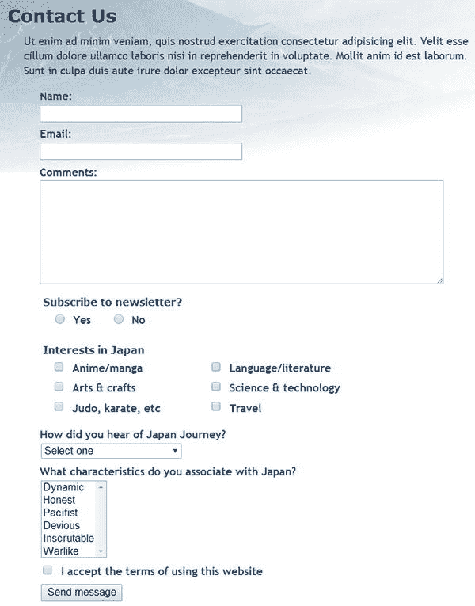

# 处理多项选择表单元素

`contact.php` 中的表单仅使用了文本输入字段和文本区域。为了成功处理表单，你还需要了解如何处理多项选择元素，即：

- 单选按钮

- 复选框

- 下拉选项菜单

- 多项选择列表

它们背后的原理与你一直使用的文本输入字段相同：表单元素的 `name` 属性作为 `$_POST` 数组中的键。然而，存在一些重要差异：

- 复选框组和多项选择列表将选中的值存储为数组，因此你需要在 `name` 属性的末尾添加一对空方括号。例如，对于一个名为 `interests` 的复选框组，每个 `<input>` 标签中的 `name` 属性应为 `name="interests[]"`。如果省略方括号，则只有最后选中的项目会通过 `$_POST` 数组传递。

- 复选框组或多项选择列表中选中项目的值会作为 `$_POST` 数组的子数组传递。PHP 解决方案 5-5 中的代码会自动将这些子数组转换为逗号分隔的字符串。但是，当将表单用于其他目的时，你需要从子数组中提取值。你将在后续章节中了解如何操作。

- 如果未选中任何值，则单选按钮、复选框和多项选择列表不会包含在 `$_POST` 数组中。因此，在处理表单时，在尝试访问它们的值之前，必须使用 `isset()` 检查它们是否存在，这一点至关重要。

本章中剩余的 PHP 解决方案展示了如何处理多项选择表单元素。我不会详细讲解每个步骤，而是重点强调关键点。在完成本章剩余部分时，请牢记以下几点：

- 处理这些元素依赖于 `processmail.php` 中的代码。

- 必须将每个元素的 `name` 属性添加到 `$expected` 数组中，才能将其添加到消息正文中。

- 若要将字段设为必填项，请将其 `name` 属性添加到 `$required` 数组中。

- 如果非必填字段留空，`processmail.php` 中的代码会将其值设置为“未选择”。

图 5-7 展示了将每种输入类型添加到原始设计后的 `contact.php`。



*图 5-7. 包含多项选择表单元素示例的反馈表单*

> **提示：** HTML5 新增了许多表单输入类型。它们都使用 `name` 属性，并以文本或 `$_POST` 数组的子数组形式发送值，因此你应该能够相应调整代码。

## PHP 解决方案 5-6：处理单选按钮组

单选按钮组允许你仅选择一个值。虽然在 HTML 标记中设置默认值很常见，但这不是必须的。本 PHP 解决方案展示了如何处理这两种情况。

处理单选按钮的简单方法是将其中的一个设为默认值。由于始终会选中一个值，因此单选按钮组始终包含在 `$_POST` 数组中。

带有默认值的单选按钮组代码如下所示（`name` 属性和 PHP 代码以粗体突出显示）：

```
<fieldset id="subscribe">
  <h2>订阅时事通讯？</h2>
  <p>
    <input name="subscribe" type="radio" value="是" id="subscribe-yes"
    <?php
    if ($_POST && $_POST['subscribe'] == '是') {
      echo 'checked';
    } ?> >
    <label for="subscribe-yes">是</label>

    <input name="subscribe" type="radio" value="否" id="subscribe-no"
    <?php
    if (!$_POST || $_POST['subscribe'] == '否') {
      echo 'checked';
    } ?> >
    <label for="subscribe-no">否</label>
  </p>
</fieldset>
```

单选按钮组的所有成员共享相同的 `name` 属性。因为只能选择一个值，所以 `name` 属性不以一对空方括号结尾。

与“是”按钮相关的条件语句检查 `$_POST` 以查看表单是否已提交。如果已提交且 `$_POST['subscribe']` 的值为“是”，则向 `<input>` 标签添加 `checked` 属性。

在“否”按钮中，条件语句使用了 `||`（或）。第一个条件是 `!$_POST`，当表单尚未提交时，该条件为 `true`。如果为 `true`，则在页面首次加载时将 `checked` 属性作为默认值添加。如果为 `false`，则表示表单已提交，因此会检查 `$_POST['subscribe']` 的值。

当单选按钮没有默认值时，它不会包含在 `$_POST` 数组中，因此不会被 `processmail.php` 中构建 `$missing` 数组的循环检测到。为了确保单选按钮元素包含在 `$_POST` 数组中，你需要在表单提交后测试其是否存在。如果未包含，你需要将其值设置为空字符串，如下所示：

```
$required = ['name', 'comments', 'email', 'subscribe'];
// 为可能不存在的变量设置默认值
if (!isset($_POST['subscribe'])) {
  $_POST['subscribe'] = '';
}
```

如果单选按钮组是必填项但未选择，则在表单重新加载时需要显示错误消息。你还需要更改 `<input>` 标签中的条件语句以反映不同的行为。

以下清单展示了 `contact_08.php` 中的 `subscribe` 单选按钮组，所有 PHP 代码以粗体突出显示：

```
<fieldset id="subscribe">
  <h2>订阅时事通讯？
    <?php if ($missing && in_array('subscribe', $missing)) { ?>
      <span class="warning">请做出选择</span>
    <?php } ?>
  </h2>
  <p>
    <input name="subscribe" type="radio" value="是" id="subscribe-yes"
    <?php
    if ($_POST && $_POST['subscribe'] == '是') {
      echo 'checked';
    } ?> >
    <label for="subscribe-yes">是</label>

    <input name="subscribe" type="radio" value="否" id="subscribe-no"
    <?php
    if ($_POST && $_POST['subscribe'] == '否') {
      echo 'checked';
    } ?> >
    <label for="subscribe-no">否</label>
  </p>
</fieldset>
```

控制 `<h2>` 标签中警告消息的条件语句使用了与文本输入字段相同的技术。如果单选按钮组是必填项且位于 `$missing` 数组中，则会显示该消息。

两个单选按钮中围绕 `checked` 属性的条件语句相同。它检查表单是否已提交，并且仅当 `$_POST['subscribe']` 中的值匹配时才显示 `checked` 属性。

### PHP 解决方案 5-7：处理复选框组

复选框可以单独使用，也可以成组使用。处理它们的方法略有不同。本 PHP 解决方案将说明如何处理名为 `interests` 的复选框组。PHP 解决方案 5-10 则介绍如何处理单个复选框。

当作为一组使用时，组内所有复选框共享同一个 `name` 属性，该属性需要以一对空的方括号结尾，以便 PHP 将选中的值作为数组传输。为了识别哪些复选框被选中，每个复选框需要一个唯一的 `value` 属性。

如果没有选中任何项目，则该复选框组不会包含在 `$_POST` 数组中。表单提交后，你需要检查 `$_POST` 数组，看它是否包含针对该复选框组的子数组。如果不包含，你需要创建一个空的子数组，作为 `processmail.php` 中脚本的默认值。

为节省篇幅，仅展示该组中的前两个复选框。`name` 属性和 PHP 代码段以粗体突出显示。

```
# 对日本的兴趣

每个复选框共享相同的 `name` 属性，该属性以一对空的方括号结尾，因此数据被当作数组处理。如果省略方括号，`$_POST['interests']` 将仅包含被选中的第一个复选框的值。

> **注：** 虽然为了实现多选必须在 `name` 属性中添加方括号，但选中值的子数组位于 `$_POST['interests']` 中，而不是 `$_POST['interests[]']`。

每个复选框元素内的 PHP 代码与单选按钮组中的代码功能相同，都是将 `checked` 属性包裹在条件语句中。第一个条件检查表单是否已提交。第二个条件使用 `in_array()` 函数检查与该复选框关联的 `value` 是否存在于 `$_POST['interests']` 子数组中。如果存在，则表示该复选框被选中。

表单提交后，你需要检查 `$_POST['interests']` 是否存在。如果它尚未设置，你必须创建一个空数组作为脚本其余部分处理的默认值。其代码模式与单选按钮组相同：

```php
$required = ['name', 'comments', 'email', 'subscribe', 'interests'];
// 为可能不存在的变量设置默认值
if (!isset($_POST['subscribe'])) {
    $_POST['subscribe'] = '';
}
if (!isset($_POST['interests'])) {
    $_POST['interests'] = [];
}
```

要设置最少数量的必选复选框，请使用 `count()` 函数确认从表单传输过来的值的数量。如果数量少于最低要求，则将该组添加到 `$errors` 数组中，如下所示：

```php
if (!isset($_POST['interests'])) {
    $_POST['interests'] = [];
}
// 最少需要的复选框数量
$minCheckboxes = 2;
if (count($_POST['interests']) < $minCheckboxes) {
    $errors['interests'] = true;
}
```

`count()` 函数返回数组中的元素数量，因此，如果选中的复选框少于两个，则会创建 `$errors['interests']`。你可能想知道为什么我使用变量而不是直接使用数字，如下所示：

```php
if (count($_POST['interests']) < 2) {
```

这样做当然可以，而且输入更少，但 `$minCheckboxes` 可以在错误消息中重复使用。将数量存储在变量中意味着此条件和错误消息始终保持同步。

表单正文中的错误消息如下所示：

```php
<h2>对日本的兴趣
<?php if (isset($errors['interests'])) { ?>
<span class="warning">请至少选择 <?= $minCheckboxes;?> 项</span>
<?php } ?>
</h2>
```

## PHP 解决方案 5-8：使用下拉选项菜单

使用 `<select>` 标签创建的下拉选项菜单与单选按钮组类似，通常都允许用户从几个选项中选择一个。它们的不同之处在于，下拉菜单中总是会选中一个项目，即使它只是提示用户选择其他选项的第一个项目。因此，`$_POST` 数组始终包含一个引用 `<select>` 菜单的元素，而单选按钮组则会被忽略，除非预设了默认值。

以下代码显示了 `contact_08.php` 中下拉菜单的前两个项目，PHP 代码以粗体突出显示。与所有多项选择元素一样，PHP 代码包裹了指示哪个项目被选中的属性。虽然此属性在单选按钮和复选框中都称为 `checked`，但在 `<select>` 菜单和列表中称为 `selected`。如果表单因缺少必填项而重新提交，使用正确的属性来重新显示所选项非常重要。当页面首次加载时，`$_POST` 数组不包含任何元素，因此你可以通过测试 `!$_POST` 来选择第一个 `<option>`。一旦表单提交，`$_POST` 数组始终包含来自下拉菜单的元素，因此你无需测试其是否存在。

```php
<p>
<label for="howhear">您是如何了解到 Japan Journey 的？</label>
<select name="howhear" id="howhear">
<option value="No reply"
<?php
if (!$_POST || $_POST['howhear'] == 'No reply') {
echo 'selected';
} ?>>请选择</option>
<option value="Apress"
<?php
if (isset($_POST && $_POST['howhear'] == 'Apress')) {
echo 'selected';
} ?>>Apress</option>
. . .
</select>
</p>
```

尽管下拉菜单中总有一个选项被选中，但你可能会强制用户做出除默认选项之外的选择。为此，请将 `<select>` 菜单的 `name` 属性添加到 `$required` 数组中，然后将默认选项的 `value` 属性和 `$_POST` 数组元素设置为空字符串，如下所示：

```php
<option value=""
<?php
if (!$_POST || $_POST['howhear'] == '') {
echo 'selected';
} ?>>请选择</option>
```

在 `<option>` 标签中，`value` 属性不是必需的，但如果你省略它，表单将使用开始和结束标签之间的文本作为选中的值。因此，有必要将 `value` 属性显式设置为空字符串。否则，"请选择" 将作为选中的值传输。

如果未做出选择，显示警告消息的代码遵循熟悉的模式：

```php
<label for="select">您是如何了解到 Japan Journey 的？
<?php if ($missing && in_array('howhear', $missing)) { ?>
<span class="warning">请做出选择</span>
<?php } ?>
</label>
```

## PHP 方案 5-9：处理多选列表

多选列表与复选框组类似：允许用户选择零个或多个项目，因此结果会以数组形式存储。如果未选择任何项目，则多选列表不会包含在 `$_POST` 数组中，因此你需要像处理复选框组一样，添加一个空子数组。

以下代码展示了 `contact_08.php` 中多选列表的前两个项目，其中 `name` 属性和 PHP 代码已加粗高亮。`name` 属性后附加的方括号确保其结果以数组形式存储。该代码的工作方式与 PHP 方案 5-7 中的复选框组完全相同。

```php
<p>
<label for="characteristics">您认为日本具有哪些特征？</label>
<select name="characteristics[]" size="6" multiple="multiple" id="characteristics">
<option value="Dynamic"
<?php
if ($_POST && in_array('Dynamic', $_POST['characteristics'])) {
    echo 'selected';
} ?>
>充满活力</option>
<option value="Honest"
<?php
if ($_POST && in_array('Honest', $_POST['characteristics'])) {
    echo 'selected';
} ?>
>诚实守信</option>
. . .
</select>
</p>
```

在处理消息的代码中，为多选列表设置默认值的方式与处理复选框数组相同：
```

```
if (!isset($_POST['interests'])) {
    $_POST['interests'] = [];
}
if (!isset($_POST['characteristics'])) {
    $_POST['characteristics'] = [];
}
```

要将多选列表设为必填项并设置最小选择数量，请使用 PHP 方案 5-7 中用于复选框组的相同技术。

### PHP 方案 5-10：处理单个复选框

处理单个复选框的方式与处理复选框组略有不同。对于单个复选框，你不需要在 `name` 属性后附加方括号，因为它无需作为数组处理。此外，`value` 属性是可选的。如果你不设置 `value` 属性，当复选框被选中时，其值默认为“On”。然而，如果复选框未被选中，其名称就不会包含在 `$_POST` 数组中，因此你需要测试其是否存在。

此 PHP 方案演示了如何添加一个用于确认用户是否已接受网站条款的单个复选框。它假定必须选中该复选框。

以下代码展示了单个复选框，其中 `name` 属性和 PHP 代码已加粗高亮。

```
<p>
<input type="checkbox" name="terms" value="accepted" id="terms"
<?php
if ($_POST && !isset($errors['terms'])) {
    echo 'checked';
} ?>
>
<label for="terms">我接受使用本网站的条款
<?php if (isset($errors['terms'])) { ?>
<span class="warning">请选择该复选框</span>
<?php } ?>
</label>
</p>
```

`<input>` 元素内的 PHP 代码块仅在 `$_POST` 数组包含值且 `$errors['terms']` 尚未设置时，才插入 `checked` 属性。这确保了页面首次加载时复选框不会被选中。如果用户提交表单时未确认接受条款，复选框也会保持未选中状态。

如果设置了 `$errors['terms']`，第二个 PHP 代码块会在标签旁边显示错误消息。

除了将 `terms` 添加到 `$expected` 和 `$required` 数组之外，你还需要为 `$_POST['terms']` 设置一个默认值；然后在提交表单时处理数据的代码中设置 `$errors['terms']`：

```
if (!isset($_POST['characteristics'])) {
    $_POST['characteristics'] = [];
}
if (!isset($_POST['terms'])) {
    $_POST['terms'] = '';
    $errors['terms'] = true;
}
```

仅当复选框为必填项时，你才需要创建 `$errors['terms']`。对于可选的复选框，如果它不包含在 `$_POST` 数组中，只需将其值设置为空字符串即可。

### 本章回顾

构建 `processmail.php` 投入了大量工作，但该脚本的妙处在于它适用于任何表单。唯一需要更改的部分是 `$expected` 和 `$required` 数组，以及与表单相关的细节，例如目标地址、邮件头和为那些未选择值就不会包含在 `$_POST` 数组中的多选元素设置的默认值。

我避免讨论 HTML 电子邮件，因为 `mail()` 函数只处理纯文本电子邮件。`www.php.net/manual/en/function.mail.php` 上的 PHP 在线手册展示了通过添加额外邮件头发送 HTML 邮件的方法。然而，这不是一个好主意，因为 HTML 邮件应始终为不接受 HTML 的电子邮件程序提供纯文本替代版本。如果你想发送 HTML 邮件或附件，请尝试使用 PHPMailer (`https://github.com/Synchro/PHPMailer/`)。

正如你将在后续章节中看到的，在线表单几乎是你用 PHP 做所有事情的核心。它们是浏览器和 Web 服务器之间的网关。你会反复用到本章学到的技术。