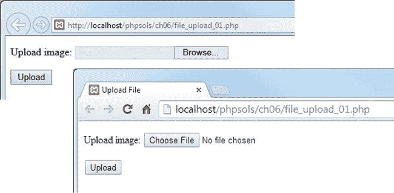
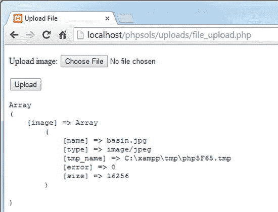
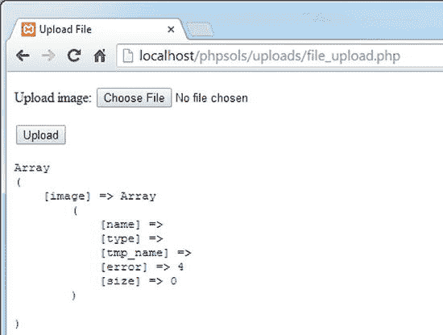

# 6. 上传文件

PHP 处理表单的能力不仅限于文本。它还可以用于将文件上传到服务器。例如，你可以构建一个房地产网站，供客户上传其房产图片；或者一个供所有亲朋好友上传假期照片的网站。然而，仅仅因为你可以这样做，并不一定意味着你应该这样做。允许他人向你的网站上传材料可能会使你面临各种问题。你需要确保图片尺寸正确、质量合适，并且不包含任何非法内容。你还需要确保上传的文件不包含恶意脚本。换句话说，你需要像保护自己的计算机一样仔细保护你的网站。

PHP 使得限制接受的文件类型和大小相对简单。但它无法检查内容的合适性。请仔细考虑安全措施，例如通过将上传表单放置在受密码保护的区域，将上传权限限制给已注册和受信任的用户。

在你学习如何使用 PHP（在第 9 章和第 17 章）限制对页面的访问之前，如果在公共网站上部署，请仅在本章中的受密码保护目录中使用 PHP 解决方案。大多数托管公司通过网站的控制面板提供简单的密码保护。

本章的第一部分致力于理解文件上传的机制，这将使你更容易理解后续的代码。这是一章内容相当丰富的章节，而不是快速解决方案的集合。但到本章结束时，你将构建一个能够处理单个和多个文件上传的 PHP 类。然后，你只需编写几行代码，就可以在任何表单中使用该类。

你将学习以下内容：

- 理解 `$_FILES` 数组
- 限制上传的大小和类型
- 防止文件被覆盖
- 处理多个上传

## PHP 如何处理文件上传

术语“上传”意味着将文件从一台计算机移动到另一台计算机，但就 PHP 而言，所发生的一切只是将文件从一个位置移动到另一个位置。这意味着你可以在本地计算机上测试本章中的所有脚本，而无需将文件上传到远程服务器。

PHP 默认支持文件上传，但托管公司可能限制上传的大小或完全禁用上传。在进一步操作之前，最好检查一下远程服务器上的设置。


### 检查服务器是否支持文件上传

所有你需要的信息都显示在 PHP 的主要配置页面中，你可以通过在远程服务器上运行 `phpinfo()` 来显示该页面，如第 2 章所述。向下滚动，直到在 Core 部分找到 `file_uploads`。

如果本地值（Local Value）为 On，你就可以开始了，但你也应该检查表 6-1 中列出的其他配置设置。

**表 6-1.** 影响文件上传的 PHP 配置设置

| 指令 | 默认值 | 描述 |
| --- | --- | --- |
| `max_execution_time` | 30 | PHP 脚本可以运行的最大秒数。如果脚本运行时间更长，PHP 会生成一个致命错误。 |
| `max_file_uploads` | 20 | 可以同时上传的最大文件数量。如果超过此限制，多余的文件会被静默忽略。 |
| `max_input_time` | 60 | PHP 脚本被允许解析 `$_POST` 和 `$_GET` 数组以及文件上传的最大秒数。非常大的上传可能会超时。 |
| `post_max_size` | 8M | 所有 `$_POST` 数据（包括文件上传）允许的最大大小。虽然默认值是 8 MB，但托管公司可能会设置更小的限制。 |
| `upload_tmp_dir` |   | PHP 在此处存储上传的文件，直到你的脚本将它们移动到永久位置。如果在 `php.ini` 中未定义任何值，PHP 将使用系统的默认临时目录（在 Mac/Linux 上为 `C:\Windows\Temp` 或 `/tmp`）。 |
| `upload_max_filesize` | 2M | 单个上传文件允许的最大大小。虽然默认值是 2 MB，但托管公司可能会设置更小的限制。单独的数字表示允许的字节数。后跟 K 的数字表示允许的千字节数。 |

从 PHP 5.6 开始，PHP 可以处理大于 2 GB 的单个文件上传，但实际限制由表 6-1 中的设置决定。`post_max_size` 的默认值 8 MB 包含了 `$_POST` 数组的内容，因此典型服务器上可以同时上传的文件总大小小于 8 MB，且没有单个文件大于 2 MB。服务器管理员可以更改这些默认值，因此检查托管公司设置的限制很重要。如果你超过这些限制，一个原本完美无缺的脚本将会失败。

如果 `file_uploads` 的本地值为 Off，则上传功能已被禁用。对此你无能为力，只能询问你的托管公司是否提供启用了文件上传的套餐。你唯一的选择是迁移到其他主机，或使用不同的解决方案，例如通过 FTP 上传文件。

**提示**

使用 `phpinfo()` 检查远程服务器的设置后，最好删除该脚本或将其放入受密码保护的目录中。

### 向表单添加文件上传字段

向 HTML 表单添加文件上传字段很容易。只需在开始的 `<form>` 标签中添加 `enctype="multipart/form-data"`，并将 `<input>` 元素的 `type` 属性设置为 `file`。以下代码是一个简单的上传表单示例（它位于 `ch06` 文件夹中的 `file_upload_01.php` 文件中）：

```html
<form action="" method="post" enctype="multipart/form-data" id="uploadImage">
  <p>
    <label for="image">上传图片：</label>
    <input type="file" name="image" id="image">
  </p>
  <p>
    <input type="submit" name="upload" id="upload" value="上传">
  </p>
</form>
```

尽管这是标准的 HTML，但它在网页中的呈现方式取决于浏览器（见图 6-1）。大多数现代浏览器会显示一个“选择文件”或“浏览”按钮，右侧显示状态消息或所选文件的名称。Internet Explorer 会显示一个文本输入字段，右侧有一个“浏览”按钮。较新版本的 Internet Explorer 使其成为只读字段，一旦你点击字段内部，就会启动文件选择面板。这些差异不会影响上传表单的操作，但在设计布局时需要考虑它们。



**图 6-1.** 文件输入字段的外观因浏览器而异

### 理解 `$_FILES` 数组

令许多人困惑的是，他们的文件在上传后似乎消失了。这是因为你不能像处理文本输入那样，在 `$_POST` 数组中引用上传的文件。PHP 在一个独立的超全局数组（恰当地命名为 `$_FILES`）中传输上传文件的详细信息。此外，文件会上传到临时文件夹，除非你显式地将它们移动到所需位置，否则会被删除。虽然这听起来很麻烦，但这样做是有充分理由的：你可以在接受上传之前对文件进行安全检查。

#### 检查 `$_FILES` 数组

理解 `$_FILES` 数组工作原理的最佳方式是实际查看它的运作。如果你已经安装了本地测试环境，可以在自己的电脑上测试所有功能。它的工作方式与将文件上传到远程服务器完全相同。

在 `phpsols` 站点根目录中创建一个名为 `uploads` 的新文件夹。在 `uploads` 文件夹中创建一个名为 `file_upload.php` 的新 PHP 文件，并插入上一节的代码。或者，从 `ch06` 文件夹复制 `file_upload_01.php` 并将文件重命名为 `file_upload.php`。在结束的 `</form>` 标签之后立即插入以下代码（它也在 `file_upload_02.php` 中）：

```php
</form>

<pre>
<?php
if (isset($_POST['upload'])) {
    print_r($_FILES);
}
?>
</pre>

</body>
```

这段代码使用 `isset()` 来检查 `$_POST` 数组是否包含 `upload`（即提交按钮的 `name` 属性）。如果包含，你就知道表单已提交，因此可以使用 `print_r()` 来检查 `$_FILES` 数组。`<pre>` 标签使输出更易于阅读。

保存 `file_upload.php` 并在浏览器中加载它。点击“浏览”（或“选择文件”）按钮，并在硬盘上选择一个文件。点击“打开”（在 Mac 上为“选择”）关闭文件选择对话框，然后点击“上传”。你应看到类似图 6-2 的内容。

你可以看到 `$_FILES` 数组实际上是一个多维数组——数组的数组。顶层数组只包含一个元素，该元素的键（或索引）来自文件输入字段的 `name` 属性，在本例中是 `image`。



**图 6-2.** `$_FILES` 数组包含上传文件的详细信息

`image` 元素包含另一个数组（或子数组），由五个元素组成，分别是：

*   `name`：上传文件的原始名称
*   `type`：上传文件的 MIME 类型
*   `tmp_name`：上传文件的位置
*   `error`：一个整数，表示上传状态
*   `size`：上传文件的大小，以字节为单位

不要浪费时间搜索 `tmp_name` 指示的临时文件：它将不复存在。如果你不立即保存它，PHP 会将其丢弃。

不选择文件就点击上传。`$_FILES` 数组应如图 6-3 所示。



**图 6-3.** 当没有文件上传时，`$_FILES` 数组仍然存在

错误级别为 4 表示未上传文件；0 表示上传成功。本章后面的表 6-2 列出了所有错误代码。

选择一个程序文件并点击上传按钮。在很多情况下，表单会尝试上传该程序，并将其类型显示为 `application/zip`、`application/octet-stream` 或类似内容。这是一个警告，表明检查上传文件的 MIME 类型非常重要。


### 建立上传目录

另一个容易混淆的问题是权限问题。一个在本地运行完美的上传脚本，当你将其传输到远程服务器时，可能会遇到类似如下的报错信息：

```
Warning: move_uploaded_file(/home/user/htdocs/testarea/kinkakuji.jpg)
[function.move-uploaded-file]: failed to open stream: Permission denied in
/home/user/htdocs/testarea/upload_test.php on line 3
```

为什么会被拒绝权限？多数主机服务商使用 Linux 服务器，这类系统对文件和目录的所有权有严格规定。大多数情况下，PHP 并非以你的用户名运行，而是作为 Web 服务器用户——通常是 `nobody` 或 `apache`。除非 PHP 已被配置为以你的用户名运行，否则你需要为每个想上传文件的目录授予全局访问权限（`chmod 777`）。

由于 777 是最不安全的设置，请先从 700 权限开始测试上传。如果不行，再尝试 770，只有在万不得已时才使用 777。上传目录不必位于你的网站根目录内。如果你的主机服务商在网站根目录外提供了私人目录，请在该私人目录中为上传文件创建子目录。或者，你可以在网站根目录内创建一个目录，但不要在任何网页中链接到它。给它起一个无害的名称，例如 `lastyear`。

#### 在 Windows 上创建用于本地测试的上传文件夹

在接下来的练习中，我建议你在 C 盘根目录下创建一个名为 `upload_test` 的文件夹。Windows 系统没有权限问题，所以只需这样做即可。

#### 在 Mac OS X 上创建用于本地测试的上传文件夹

Mac 用户可能需要多做一点准备工作，因为文件权限与 Linux 类似。在你的主文件夹中创建一个名为 `upload_test` 的文件夹，并按照 PHP 方案 6-1 中的说明进行操作。

如果一切顺利，你无需额外操作。但如果你收到 PHP“failed to open stream”的警告，请按如下方式更改 `upload_test` 文件夹的权限：

在 Mac Finder 中选择 `upload_test`，然后选择 文件 ➤ 显示简介（Cmd-I）打开其信息面板。在“共享与权限”中，点击右下角的挂锁图标解锁设置，然后将“everyone”的权限从“只读”更改为“读与写”，如下方截图所示。


再次点击挂锁图标以保存新设置，然后关闭信息面板。现在你应该能够使用 `upload_test` 文件夹继续本章剩余的内容。

## 上传文件

在构建文件上传类之前，最好先创建一个简单的文件上传脚本，以确保你的系统能正确处理上传。

### 将临时文件移动到上传文件夹

上传文件的临时版本存在时间极短。如果你不对文件进行任何操作，它会被立即丢弃。你需要告诉 PHP 将其移动到哪里，以及将其命名为什么。这可以通过 `move_uploaded_file()` 函数来实现，该函数接受以下两个参数：

- 临时文件的名称
- 文件新位置的完整路径，包括文件名本身

获取临时文件的名称很简单：它存储在 `$_FILES` 数组中，键名为 `tmp_name`。由于第二个参数需要完整路径，这为你提供了重命名文件的机会。现在，我们保持简单，使用原始文件名，它存储在 `$_FILES` 数组中，键名为 `name`。

#### PHP 方案 6-1：创建基础文件上传脚本

继续使用上一个练习中的同一个文件。或者，使用 `ch06` 文件夹中的 `file_upload_03.php`。本 PHP 方案的最终脚本位于 `file_upload_04.php`。

如果你使用的是上一个练习中的文件，请删除 `</form>` 和 `</body>` 标签之间加粗显示的代码：

```
</form>
<pre>
<?php
if (isset($_POST['upload'])) {
  print_r($_FILES);
}
?>
</pre>
</body>
```

除了 PHP 配置中设置的内置限制（见表 6-1），你还可以在 HTML 表单中指定上传文件的最大大小。在文件输入字段之前立即添加以下加粗显示的行：

```
<label for="image">上传图片：</label>
<input type="hidden" name="MAX_FILE_SIZE" value="<?= $max; ?>">
<input type="file" name="image" id="image">
```

这是一个隐藏表单字段，因此不会在屏幕上显示。但是，必须将其放在文件输入字段之前，否则它将无法工作。`name` 属性 `MAX_FILE_SIZE` 是固定的，并且区分大小写。`value` 属性以字节为单位设置上传文件的最大大小。

我没有直接指定数值，而是使用了一个名为 `$max` 的变量。该值也将在服务器端文件上传验证中使用，因此只需定义一次是有意义的，这样可以避免在一个地方更改它而忘记在其他地方更改的可能性。

在 `DOCTYPE` 声明上方的 PHP 代码块中定义 `$max` 的值，如下所示：

```
<?php
// 设置最大上传大小（以字节为单位）
$max = 51200;
?>
<!DOCTYPE HTML>
```

这将最大上传大小设置为 50 KB（51,200 字节）。

将上传文件从其临时位置移动到永久位置的代码需要在表单提交后运行。在你刚刚在页面顶部创建的 PHP 代码块中插入以下代码：

```
$max = 51200;
if (isset($_POST['upload'])) {
  // 定义上传文件夹的路径
  $destination = '/path/to/upload_test/';
  // 将文件移动到上传文件夹并重命名
  move_uploaded_file($_FILES['image']['tmp_name'],
                     $destination . $_FILES['image']['name']);
}
?>
```

虽然代码很短，但包含了很多操作。条件语句通过检查“上传”按钮的键是否存在于 `$_POST` 数组中，来确保仅在点击该按钮时才执行代码。

`$destination` 的值取决于你的操作系统和 `upload_test` 文件夹的位置。

- 如果你使用的是 Windows，并且在 C 盘根目录创建了 `upload_test` 文件夹，则应如下所示：

```
$destination = 'C:/upload_test/';
```

请注意，我使用的是正斜杠，而不是 Windows 约定使用的反斜杠。你可以使用任意一种，但如果使用反斜杠，最后一个反斜杠需要用另一个反斜杠进行转义，如下所示（否则反斜杠会转义引号）：

```
$destination = 'C:\upload_test\\';
```

- 在 Mac 上，如果你在主文件夹中创建了 `upload_test` 文件夹，则应如下所示（将 username 替换为你的 Mac 用户名）：

```
$destination = '/Users/username/upload_test/';
```

- 在远程服务器上，你需要将完全限定的文件路径作为第二个参数。在 Linux 上，可能如下所示：

```
$destination = '/home/user/private/upload_test/';
```

`if` 语句内的最后一行使用 `move_uploaded_file()` 函数移动文件。该函数接受两个参数：临时文件的名称和文件将要保存到的完整路径。

`$_FILES` 是一个多维数组，其名称来自文件输入字段。因此，`$_FILES['image']['tmp_name']` 是临时文件，`$_FILES['image']['name']` 包含原始文件的名称。第二个参数 `$destination . $_FILES['image']['name']` 将上传的文件以其原始名称存储在上传文件夹中。

**警告**


你可能遇到过使用`copy()`而非`move_uploaded_file()`的脚本。如果没有其他检查机制，`copy()`会让你的网站面临严重的安全风险。例如，恶意用户可能试图欺骗你的脚本，让它复制本不应有权访问的文件（如密码文件）。请始终使用`move_uploaded_file()`；它安全得多。

保存`file_upload.php`，并在浏览器中加载它。点击“浏览”或“选择文件”按钮，从`phpsols`站点的`images`文件夹中选择一个文件。如果你从其他位置选择文件，请确保其大小小于 50KB。点击“打开”（Mac 上为“选择”）以在表单中显示文件名。在显示文件输入字段的浏览器中，你可能无法看到完整路径。这是一个外观问题，留待你自己通过 CSS 解决。点击“上传”按钮。如果在本地测试，表单输入字段应该几乎立即清空。导航到`upload_test`文件夹，确认你选择的图片副本已存在。如果不在，请对照`file_upload_04.php`检查你的代码。另外，检查上传文件夹是否已设置正确的权限（如有必要）。

注意：下载文件使用`C:/upload_test/`。请根据你的环境进行调整。

如果没有收到错误信息但找不到文件，请确保图片没有超过`upload_max_filesize`（参见表 6-1）。同时检查你是否遗漏了`$destination`末尾的尾部斜杠。你可能会在`upload_test`文件夹中找不到`myfile.jpg`，而是在磁盘结构中高一级的位置发现`upload_testmyfile.jpg`。

将`$max`的值改为`3000`，保存`file_upload.php`，然后通过选择一个大于 2.9KB 的文件（`images`文件夹中的任何文件都可以）再次测试。点击“上传”按钮并检查`upload_test`文件夹。该文件应该不在那里。

如果你有实验兴趣，请将`MAX_FILE_SIZE`隐藏字段移到文件输入字段下方，然后再次尝试。请确保你选择的文件与步骤 6 中使用的文件不同，因为`move_uploaded_file()`会覆盖同名的现有文件。稍后你将学习如何为文件赋予唯一名称。

这次，文件应被复制到你的上传文件夹中。在继续之前，将隐藏字段移回其原始位置。

使用`MAX_FILE_SIZE`的好处是，如果文件大于规定值，PHP 会放弃上传，从而避免因文件过大而产生不必要的延迟。不幸的是，用户可以通过伪造隐藏字段提交的值来绕过这一限制，因此本章剩余部分将要开发的脚本也会在服务器端检查文件大小。

## 创建 PHP 文件上传类

正如你刚刚所见，上传文件只需几行代码，但这本身并不足以使任务完成。你需要通过执行以下步骤来提高过程的安全性：

*   检查错误级别。
*   在服务器端验证文件是否超过最大允许大小。
*   检查文件类型是否可接受。
*   从文件名中移除空格。
*   重命名与现有文件同名的文件以防止覆盖。
*   自动处理多个文件上传。
*   告知用户结果。

每次上传文件时都需要执行这些步骤，因此构建一个易于重用的脚本很有意义。这就是我选择使用自定义类的原因。构建 PHP 类通常被视为高级主题，但不要因此望而却步。

类是一组旨在协同工作的函数的集合。这虽然是一种过度简化，但足以让你理解基本概念。类中的每个函数通常应专注于单一任务，因此你将构建独立的函数来实现前面列表中概述的步骤。代码还应该是通用的，不能局限于特定的网页。一旦构建了类，你就可以在任何表单中重用。尽管类定义很长，但使用该类只需编写几行代码。

如果你赶时间，完成的类位于`ch06/PhpSolutions`文件夹中。即使你不亲手构建脚本，也请通读说明，以便清楚地了解其工作原理。

### 定义 PHP 类

定义 PHP 类非常简单。使用`class`关键字，后跟类名，然后将类的所有代码放在一对花括号之间。按照惯例，类名以大写字母开头，并存储在与其同名的单独文件中。

#### 使用命名空间避免命名冲突

如果你编写自己的脚本，通常不必担心命名冲突。我们将要创建一个用于上传文件的类，因此`Upload`或`FileUpload`似乎是合乎逻辑的名称。但一旦你开始使用他人（包括本书）编写的脚本和类，就可能存在多个类具有相同名称的风险。

避免使用常见名称冲突的原始策略是将类定义存储在描述其功能的文件夹结构中，并为顶级文件夹赋予一个基于域名或公司名称的唯一名称。然后，类名通过使用下划线代替斜杠，从文件夹结构中创建出来。这经常导致笨拙的类名，例如`Zend_File_Transfer_Adapter_Http`。

注意：将类定义存储在基于类名和命名空间的文件和文件夹中，可以方便地使用自动加载脚本自动加载类。我们不会使用自动加载器，因为在上传表单所在的文件中只需要包含一个类定义。自动加载器主要在处理多个类时派上用场。

PHP 5.3 引入了一种使用命名空间的更简洁系统。PHP 命名空间仍然基于文件夹结构，但它们使用反斜杠代替下划线。命名空间也单独声明，允许你使用简单的类名。

我们将要构建的类名为`Upload`，但为了避免命名冲突，它将在名为`PhpSolutions\File`的命名空间中创建。

使用`namespace`关键字在文件顶部声明命名空间，后跟命名空间，如下所示：

`namespace PhpSolutions\File;`

注意：PHP 在所有操作系统上都使用反斜杠作为命名空间分隔符。不要试图在 Linux 或 Mac OS X 上将其改为正斜杠。

因此，如果我们在此命名空间中创建一个名为`Upload`的类，其完全限定名称为`PhpSolutions\File\Upload`。表面上看，这似乎很难说是进步。该类仍然有一个使用反斜杠代替下划线的笨拙名称。区别在于，你可以导入一个带命名空间的类并使用较短的名称。

#### 导入带命名空间的类

为避免每次引用带命名空间的类时都必须使用其完全限定名称，你可以在脚本开头使用`use`关键字导入该类，如下所示：

`use PhpSolutions\File\Upload;`

导入类之后，你就可以将其引用为`Upload`，而不是使用完全限定名称。导入带命名空间的类与包含它不同。它仅仅是一个声明，表明你想使用该类的较短名称。事实上，你可以使用`as`关键字为导入的类分配别名，如下所示：

`use PhpSolutions\File\Upload as FileUploader;`

然后该类可以被称为`FileUploader`。使用别名主要在大型应用程序中两个不同框架的类同名时有用。

注意：你仍需单独包含类定义。事实上，在加载类定义之前导入带命名空间的类是很常见的，因为`use`关键字必须在脚本的顶层声明。它不能嵌套在条件语句内部。


### PHP 方案 6-2：创建基础文件上传类

在本 PHP 方案中，你将创建一个名为 `Upload` 的类的基本定义来处理文件上传。你还会创建该类的一个实例（一个 `Upload` 对象），并使用它来上传一张图片。请留出充足的时间来完成以下步骤。这些步骤并不困难，但会介绍一些你可能不熟悉的概念（如果你之前从未接触过 PHP 类）。

在 `phpsols` 站点根文件夹中创建一个名为 `PhpSolutions` 的子文件夹。文件夹名中的大小写字母组合请与此保持一致。然后在 `PhpSolutions` 文件夹中创建一个名为 `File`（大写 F）的子文件夹。在新的 `PhpSolutions/File` 文件夹中，创建一个名为 `Upload.php` 的文件。文件名中的大小写字母组合也请保持正确。然后插入以下代码：

```php
<?php

namespace PhpSolutions\File;

class Upload {

}
```

所有剩余的代码都放在这对花括号之间。此文件仅包含 PHP 代码，因此你不需要添加 PHP 结束标签。

PHP 类通过将一些变量和函数声明为 `protected` 来隐藏其内部工作机制。如果你在变量或函数前加上关键字 `protected`，那么它只能在类内部或子类中被访问。这可以防止值被意外更改。

`Upload` 类需要为以下项目设置受保护的变量：

- 上传文件夹的路径
- 最大文件大小
- 报告上传状态的消息
- 允许的 MIME 类型

通过在花括号内添加它们来创建这些变量，如下所示：

```php
class Upload {

    protected $destination;

    protected $max = 51200;

    protected $messages = [];

    protected $permitted = [
        'image/gif',
        'image/jpeg',
        'image/pjpeg',
        'image/png'
    ];

}
```

这些属性可以通过 `$this->` 在类的其他位置访问，`$this` 指向当前对象。例如，在类定义内部，你可以将 `$destination` 作为 `$this->destination` 来访问。

**注意：** 首次在类内部声明属性时，它和任何其他变量一样以美元符号开头。但是，在 `->` 运算符之后，你需要省略属性名中的美元符号。

除了 `$destination` 之外，每个受保护的属性都设置了默认值：

- `$max` 将最大文件大小设置为 50 KB（51200 字节）。
- `$messages` 是一个空数组。
- `$permitted` 包含一个图像 MIME 类型数组。

`$destination` 的值将在创建类的实例时被设置。其他值将由类内部控制，但你也会创建函数（或在类中称为方法）来更改 `$max` 和 `$permitted` 的值。

当创建类的实例（对象）时，类定义文件会自动调用类的构造函数方法，该方法用于初始化对象。所有类的构造函数方法都叫 `__construct()`（两个下划线）。与你在上一步中定义的属性不同，构造函数需要在类外部可访问，因此你需要在它的定义前加上 `public` 关键字。

**注意：** `public` 和 `protected` 关键字控制属性和方法的可见性。公有属性和方法可以在任何地方被访问。任何在类定义或子类外部访问受保护属性或方法的尝试都会触发致命错误。

`Upload` 类的构造函数接受一个参数，即你想要上传文件的目标文件夹的路径，并将其赋值给 `$destination`。在受保护属性列表之后，类定义结束花括号之前，添加以下代码：

```php
public function __construct($path) {
    if (!is_dir($path) || !is_writable($path)) {
        throw new \Exception("$path 必须是有效且可写的文件夹。");
    }
    $this->destination = $path;
}
```

构造函数内部的判断语句将 `$path` 传递给 `is_dir()` 和 `is_writable()` 函数，这两个函数检查提交的值是否为一个可写的有效文件夹。如果任一条件不满足，构造函数就会抛出一个异常，并附带一条说明问题的消息。

**注意：** `Exception` 前面的反斜杠表示要使用 PHP 核心命令，而不是在命名空间内定义的。只有在可能存在歧义时，才需要用反斜杠作为核心命令的前缀。类可以定义自己的异常，因此在这里这样做是必要的。

如果 `$path` 没问题，它就会被赋值给当前对象的 `$destination` 属性。

接下来，创建一个名为 `upload()` 的公有方法。该方法将在文件上传之前启动一系列测试。紧接在你之前定义的构造函数方法之后，插入以下代码：

```php
public function upload() {
    $uploaded = current($_FILES);
    if ($this->checkFile($uploaded)) {
        $this->moveFile($uploaded);
    }
}
```

要访问 PHP 方案 6-1 中 `$_FILES` 数组里的文件，你需要知道文件输入字段的 `name` 属性。`file_upload.php` 中的表单使用了 `image`，所以你需要将文件名作为 `$_FILES['image']['name']` 来访问。但是，如果该字段使用了不同的名称，比如 `upload`，你就需要使用 `$_FILES['upload']['name']`。为了让脚本更灵活，`upload()` 方法的第一行将 `$_FILES` 数组传递给 `current()` 函数，该函数返回数组的当前元素。因此，无论表单中使用的名称是什么，`$uploaded` 都持有对 `$_FILES` 数组中第一个元素的引用。这是构建通用代码的第一个好处。最初需要付出更多努力，但最终能节省时间。

**提示：** `$_FILES` 是 PHP 的超级全局数组之一，因此在脚本的所有部分都可以使用它。这就是为什么无需将其作为参数传递给类构造函数方法的原因。

`upload()` 方法中的条件语句使用了 `$this` 关键字来调用 `checkFile()`。`$this` 关键字也用于调用在类内部定义的函数（方法）。接下来我们需要定义 `checkFile()`。现阶段，我们假设文件没问题，因此 `checkFile()` 将简单地返回 `true`。在类定义中添加以下代码：

```php
protected function checkFile($file) {
    return true;
}
```

在定义前加上 `protected` 关键字意味着此方法只能在类内部访问。我们将在 PHP 方案 6-3 中回到 `checkFile()`，在上传文件之前添加一系列测试。

**提示：** 类内部函数（方法）定义的顺序无关紧要，只要它们都位于包含该类的花括号之内即可。不过，通常的做法是将所有公有方法放在一起置于顶部，而受保护的方法放在底部。

如果文件通过了测试系列，`upload()` 方法中的条件语句会将该文件传递给另一个名为 `moveFile()` 的内部方法，该方法基本上是我们在 PHP 方案 6-1 中使用的 `move_uploaded_file()` 函数的一个包装器。代码如下所示：

```php
protected function moveFile($file) {
    $success = move_uploaded_file($file['tmp_name'],
        $this->destination . $file['name']);
    if ($success) {
        $result = $file['name'] . ' 上传成功';
        $this->messages[] = $result;
    } else {
        $this->messages[] = '无法上传 ' . $file['name'];
    }
}
```

如果上传成功，`move_uploaded_file()` 返回 `true`。否则，返回 `false`。通过将返回值存储在 `$success` 中，相应的消息会被存储到 `$messages` 数组中。

由于 `$messages` 是一个受保护的属性，你需要创建一个公有方法来获取数组的内容。

```php
public function getMessages() {
    return $this->messages;
}
```


