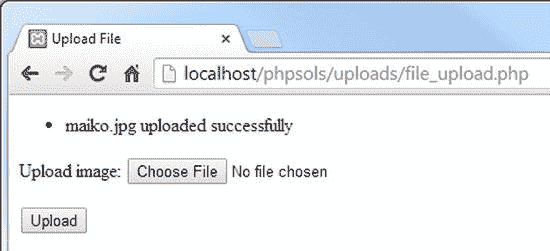

# 这仅返回 `$messages` 数组的内容。既然它仅此功能，为何不一开始就将数组设为公开属性？公开属性可在类定义之外被访问和修改。保护 `$messages` 可确保数组内容无法被更改，因此你能确定消息是由该类生成的。对于此类消息，这或许显得无关紧要，但当你开始处理更复杂的脚本或与团队协作时，这一点就变得至关重要。

保存 `Upload.php` 并切换到 `file_upload.php`。在 `file_upload.php` 的顶部，紧跟在 PHP 开始标记之后添加以下代码行，以导入 `Upload` 类：

```
use PhpSolutions\File\Upload;
```

## 注意

你必须在脚本的顶层导入带命名空间的类，即使类定义稍后才被加载。将 `use` 语句放在条件语句内部会导致解析错误。

在条件语句内部，删除调用 `move_uploaded_file()` 函数的代码，然后使用 `require_once` 包含 `Upload` 类定义：

```
if (isset($_POST['upload'])) {

    // 定义上传文件夹的路径
    $destination = 'C:/upload_test/';

    require_once '../PhpSolutions/File/Upload.php';

}
```

现在我们可以创建 `Upload` 类的实例，但由于我们使用的类可能会抛出异常，因此最好创建一个 `try/catch` 块（请参阅第 3 章中的“处理异常”）。在上一步插入的代码之后立即添加以下代码：

```
try {
    $loader = new Upload($destination);
    $loader->upload();
    $result = $loader->getMessages();
} catch (Exception $e) {
    echo $e->getMessage();
}
```

这会创建一个名为 `$loader` 的 `Upload` 类实例，并将 `upload_test` 文件夹的路径传递给它。然后调用 `$loader` 对象的 `upload()` 和 `getMessages()` 方法，并将 `getMessages()` 的结果存储在 `$result` 中。

`catch` 块无需在 `Exception` 前加反斜杠，因为 `file_upload.php` 中的脚本不在命名空间中。只有类定义位于命名空间中。

## 注意

`Upload` 类有一个 `getMessages()` 方法，而异常使用的是 `getMessage()`。多出的那个“s”至关重要。

在表单上方添加以下 PHP 代码块，以显示 `$loader` 对象返回的任何消息：

```
<body>
<?php
if (isset($result)) {
    echo '<ul>';
    foreach ($result as $message) {
        echo "<li>$message</li>";
    }
    echo '</ul>';
}
?>
<form action="" method="post" enctype="multipart/form-data" id="uploadImage">
```

这是一个简单的 `foreach` 循环，它以无序列表的形式显示 `$result` 的内容。当页面首次加载时，`$result` 尚未设置，因此这段代码仅在表单提交后运行。

保存 `file_upload.php` 并在浏览器中测试。只要你选择一张小于 50 KB 的图片，就应该看到文件上传成功的确认信息，如图 6-4 所示。

你可以将你的代码与 `ch06` 文件夹中的 `file_upload_05.php` 和 `PhpSolutions/File/Upload_01.php` 进行比较。



图 6-4. `Upload` 类报告上传成功

该类的功能与 PHP 解决方案 6-1 完全相同：上传文件，但为此需要更多的代码。不过，你已经为将来对上传文件执行一系列安全检查的类奠定了基础。这段代码你只需编写一次。当你使用该类时，无需再次编写此代码。

如果你之前没有接触过对象和类，某些概念可能显得陌生。可以将 `$loader` 对象简单视为访问你在 `Upload` 类中定义的函数（方法）的一种方式。你经常创建独立的对象来存储不同的值，例如处理 `DateTime` 对象时。在此场景下，单个对象足以处理文件上传。

## 检查上传错误

目前，`Upload` 类会不加区分地上传任何类型的文件。甚至 50 KB 的限制也可以被绕过，因为唯一检查是在浏览器中进行的。在将文件移交给 `moveFile()` 方法之前，`checkFile()` 方法需要运行一系列测试。其中最重要的测试之一是检查 `$_FILES` 数组报告的错误级别。

错误级别 8 最无帮助，因为 PHP 无法检测是哪个 PHP 扩展导致上传停止。幸运的是，这种情况很少遇到。

表 6-2 显示了错误级别的完整列表。

**表 6-2.** `$_FILES` 数组中不同错误级别的含义

| 错误级别 | 含义 |
| --- | --- |
| 0 | 上传成功 |
| 1 | 文件超过 `php.ini` 中指定的最大上传大小（默认 2 MB） |
| 2 | 文件超过 `MAX_FILE_SIZE` 指定的大小（参见 PHP 解决方案 6-1） |
| 3 | 文件仅部分上传 |
| 4 | 表单提交时未指定文件 |
| 6 | 没有临时文件夹 |
| 7 | 无法将文件写入磁盘 |
| 8 | 上传被未指定的 PHP 扩展停止 |

错误级别 5 当前未定义。


