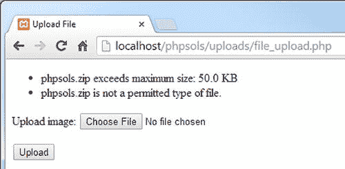
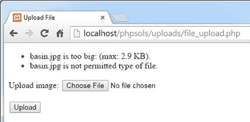
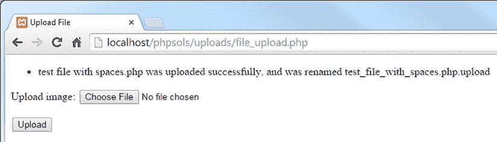
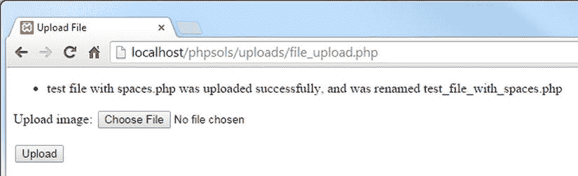
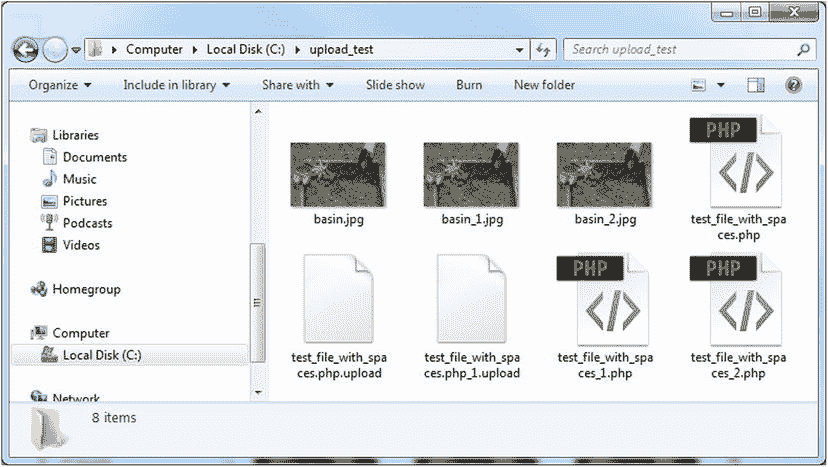
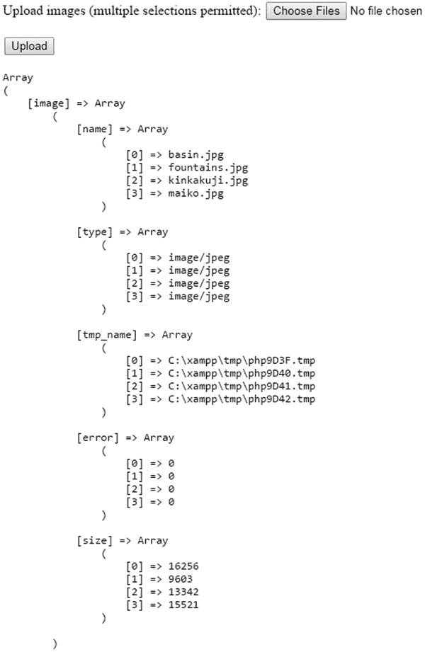

# PHP 解决方案 6-3：检测错误级别、文件大小和 MIME 类型

该 PHP 解决方案更新了 `checkFile()` 方法，使其调用一系列内部（受保护）方法来验证文件是否可以接受。如果文件因任何原因未能通过验证，系统会通过错误信息向用户报告原因。

继续使用 `Upload.php` 文件进行操作。或者，使用 `ch06/PhpSolutions/File` 文件夹中的 `Upload_01.php` 文件，将其移动到 `phpsols` 站点顶层目录下的 `PhpSolutions/File` 文件夹，并重命名为 `Upload.php`。（对于未完成的文件，务必移除下划线和数字。）

`checkFile()` 方法需要执行三项检测：错误级别检测、文件大小检测以及文件 MIME 类型检测。按如下方式更新该方法定义：

```
protected function checkFile($file) {
    $accept = true;
    if ($file['error'] != 0) {
        $this->getErrorMessage($file);
        // 若未提交文件，则停止检查
        if ($file['error'] == 4) {
            return false;
        } else {
            $accept = false;
        }
    }
    if (!$this->checkSize($file)) {
        $accept = false;
    }
    if (!$this->checkType($file)) {
        $accept = false;
    }
    return $accept;
}
```

最初，`checkFile()` 直接返回 `true`。现在，使用一个名为 `$accept` 的变量作为该方法的返回值，并初始化为 `true`。三个条件语句执行一系列检测，这些检测由稍后将定义的受保护方法完成。如果文件未通过任一检测，`$accept` 将被设为 `false`。只有当所有三项检测都通过时，该方法才返回 `true`。

使用 `$accept` 作为返回值可以生成描述文件所有问题的错误信息。这避免了令人烦恼的情况：上传因一个原因被拒绝，而第一个问题解决后又因另一个不同原因被拒绝。

传递给 `checkFile()` 方法的参数是 `$_FILES` 数组中的顶层元素。我们使用的表单中的上传字段名为 `image`，因此 `$file` 等同于 `$_FILES['image']`。这意味着你可以将 `$_FILES['image']['error']` 作为 `$file['error']` 来访问。

> **注意：** 如 PHP 解决方案 6-2 所述，上传字段的名称并不重要，因为 `upload()` 方法会自动从 `$_FILES` 数组中获取当前元素。

第一个条件语句检查错误级别。如果不为零，则上传存在问题；`$file` 作为参数传递给 `getErrorMessage()` 方法，该方法你将在接下来定义。

如果错误级别为 4，则表示未选择文件。没有进一步检查的必要，因此该方法立即返回 `false`。否则，将 `$accept` 设为 `false`，并执行接下来的两个条件语句，对文件大小和 MIME 类型进行检查。

`getErrorMessage()` 方法是一个 `switch` 语句（参见 第 3 章 中的“使用 switch 语句进行决策链”），它使用表 6-2 中列出的错误级别，将相应的信息添加到 `$messages` 数组中。代码如下：

```
protected function getErrorMessage($file) {
    switch($file['error']) {
        case 1:
        case 2:
            $this->messages[] = $file['name'] . ' 太大了: (最大: ' .
                $this->getMaxSize() . ')。';
            break;
        case 3:
            $this->messages[] = $file['name'] . ' 仅被部分上传。';
            break;
        case 4:
            $this->messages[] = '未提交文件。';
            break;
        default:
            $this->messages[] = '抱歉，上传 ' .
                $file['name'] . ' 时出现问题。';
            break;
    }
}
```

错误级别 1 和 2 的错误信息部分由一个名为 `getMaxSize()` 的方法生成，该方法将 `$max` 的值从字节转换为千字节。你将很快定义 `getMaxSize()`。

只有前四个错误级别有描述性信息。`default` 关键字捕获其他错误级别（包括未来可能添加的），并添加一个通用的原因。

在定义 `getMaxSize()` 之前，我们先处理其他检测。`checkSize()` 方法如下所示：

```
protected function checkSize($file) {
    if ($file['error'] == 1 || $file['error'] == 2 ) {
        return false;
    } elseif ($file['size'] == 0) {
        $this->messages[] = $file['name'] . ' 是一个空文件。';
        return false;
    } elseif ($file['size'] > $this->max) {
        $this->messages[] = $file['name'] . ' 超过了文件的最大大小 (' .
            $this->getMaxSize() . ')。';
        return false;
    } else {
        return true;
    }
}
```

该条件语句首先检查错误级别。如果是 1 或 2，则文件太大，因此该方法直接返回 `false`。相应的错误信息已由 `getErrorMessage()` 方法设置。

下一个条件检查报告的大小是否为零。虽然文件太大或未选择文件时也会发生这种情况，但这些情况已被 `getErrorMessage()` 方法处理。因此，这里假设文件是空的。

接下来，将报告的大小与存储在 `$max` 属性中的值进行比较。虽然过大的文件应触发错误级别 2，但你仍需进行此比较，以防用户成功绕过了 `MAX_FILE_SIZE`。错误信息也使用 `getMaxSize()` 来显示最大大小。

如果大小正常，该方法返回 `true`。

第三项检测检查 MIME 类型。将以下代码添加到类定义中：

```
protected function checkType($file) {
    if (in_array($file['type'], $this->permitted)) {
        return true;
    } else {
        $this->messages[] = $file['name'] . ' 是不允许的文件类型。';
        return false;
    }
}
```

该条件语句将 `$_FILES` 数组报告的类型与存储在 `$permitted` 属性中的数组进行对比。如果该类型存在于数组中，则方法返回 `true`。否则，拒绝原因被添加到 `$messages` 数组中，方法返回 `false`。

`getErrorMessages()` 和 `checkSize()` 方法所使用的 `getMaxSize()` 方法，会将存储在 `$max` 中的原始字节数转换为更友好的格式。将以下定义添加到类文件中：

```
public function getMaxSize() {
    return number_format($this->max/1024, 1) . ' KB';
}
```

这使用了 `number_format()` 函数，该函数通常接收两个参数：要格式化的数值以及数值保留的小数位数。第一个参数是 `$this->max/1024`，它将 `$max` 除以 1024（一千字节的字节数）。第二个参数是 1，因此数字格式化为保留一位小数。末尾的 `'. ' KB'` 将 KB 附加到格式化后的数字后面。

`getMaxSize()` 方法被声明为 public，以便你可以在使用 `Upload` 类的脚本的其他部分显示该值。

保存 `Upload.php` 并使用 `file_upload.php` 再次测试。对于小于 50 KB 的图片，其工作方式与之前相同。但如果你尝试上传一个既太大又属于错误 MIME 类型的文件，你将得到类似于图 6-5 的结果。

你可以将代码与 `ch06/PhpSolutions/File` 文件夹中的 `Upload_02.php` 进行对比。



**图 6-5.** 该类现在能够报告无效大小和 MIME 类型导致的错误


### 修改受保护的属性

`$permitted` 属性仅允许上传图片，而 `$max` 属性将文件大小限制为不超过 50 KB，但这些限制可能过于严格。无需每次需求不同时都深入类定义文件进行修改，你可以创建公共方法，从而能够动态地修改受保护属性。

使用 MIME 类型来筛选允许的文件类型存在一个问题：MIME 类型有成百上千种。此外，`$_FILES` 数组中报告的值依赖于浏览器。MIME 类型对图片文件效果良好，但其他类型文件报告的值往往不一致。例如，Firefox 将 Microsoft Word 文档的 MIME 类型报告为 `application/vnd.ms-word.document.12`，而 Internet Explorer 和 Chrome 则使用 `application/vnd.openxmlformats-officedocument.wordprocessingml.document`。

为了让 `Upload` 类更加灵活，我们将创建一个公共方法来关闭 MIME 类型检查。这将允许上传任何类型的文件。取消上传类型的所有限制是有风险的，因此我们稍后需要制定一个策略来消除潜在的危险文件。我们还将创建一个公共方法来更改允许的最大文件大小。

#### PHP 解决方案 6-4：允许上传不同类型和大小的文件

该 PHP 解决方案展示了如何通过跳过 MIME 类型检查来允许上传所有类型的文件。你还需要添加一个公共方法来更改允许的最大文件大小。

继续使用上一个 PHP 解决方案中的 `Upload.php` 文件。或者，使用 `ch06/PhpSolutions/File` 文件夹中的 `Upload_02.php` 文件。

为了控制是否应检查 MIME 类型，创建一个名为 `$typeCheckingOn` 的受保护属性并将其值设置为 `true`。在 `Upload.php` 的类定义顶部，向属性列表添加以下代码行：

```
protected $typeCheckingOn = true;
```

接下来，创建一个名为 `allowAllTypes()` 的公共方法，将 `$typeCheckingOn` 的值设置为 `false`：

```
public function allowAllTypes() {
    $this->typeCheckingOn = false;
}
```

`$typeCheckingOn` 是一个类属性，因此你需要使用 `$this->` 来访问它。

现在，你可以通过在 `checkFile()` 方法中使用 `$typeCheckingOn` 属性作为条件来控制类型检查。修改方法定义如下：

```
protected function checkFile($file) {
    $accept = true;
    if ($file['error'] != 0) {
        $this->getErrorMessage($file);
        // 如果未提交文件则停止检查
        if ($file['error'] == 4) {
            return false;
        } else {
            $accept = false;
        }
    }
    if (!$this->checkSize($file)) {
        $accept = false;
    }
    if ($this->typeCheckingOn) {
        if (!$this->checkType($file)) {
            $accept = false;
        }
    }
    return $accept;
}
```

这仅是将 `checkFile()` 中的最后一个条件语句嵌套在另一个条件中。默认情况下，`$typeCheckingOn` 为 `true`，因此 `checkType()` 将检查 MIME 类型。但是，如果你在 `upload()` 方法之前调用 `Upload` 对象的 `allowAllTypes()` 方法，`$typeCheckingOn` 将变为 `false`，从而允许上传任何类型的文件。你很快将看到如何操作，但首先让我们创建一个公共方法来调整可上传文件的最大大小。

更改允许的最大大小的方法需要检查提交的值是否为数字，并将其赋值给 `$max` 属性。在类文件中添加以下方法定义：

```
public function setMaxSize($num) {
    if (is_numeric($num) && $num > 0) {
        $this->max = (int) $num;
    }
}
```

该条件语句将提交的值传递给 `is_numeric()` 函数，该函数会检查其是否为数字。同时，它还检查 `$num` 是否大于零。

如果两个条件都成立，则使用所谓的强制类型转换运算符将 `$num` 赋值给 `$max` 属性，该运算符会强制将值转换为整数（有关详细说明，请参阅本 PHP 解决方案末尾的“显式更改数据类型”）。`is_numeric()` 函数接受任何类型的数字，包括十六进制数或包含数值的字符串。这确保了该值被转换为整数。

**注意**

PHP 还有一个名为 `is_int()` 的函数，用于检查整数类型。但是，该值不能是其他任何类型。例如，它会拒绝 `'102400'`，即使它是一个数值，因为引号使其成为字符串。

保存 `Upload.php` 并再次测试 `file_upload.php`。它应该像之前一样继续上传小于 50 KB 的图片。修改 `file_upload.php`，将允许的最大大小更改为 3000 字节，如下所示（代码位于处理上传的条件语句之前）：

```
$max = 3000;
```

你还需要在 `try` 块中调用 `$loader` 对象的 `setMaxSize()` 方法，如下所示：

```
$loader = new Upload($destination);
$loader->setMaxSize($max);
$loader->upload();
$result = $loader->getMessages();
```

通过更改 `$max` 的值并将其作为参数传递给 `setMaxSize()`，你可以同时影响表单隐藏字段中的 `MAX_FILE_SIZE` 和类内部存储的最大值。

**注意**

对 `setMaxSize()` 的调用必须在你使用 `upload()` 方法之前进行。在文件已经保存后更改类中的最大大小是没有意义的。


保存`file_upload_php`并再次测试。选择一个之前未使用过的图片，或删除`upload_test`文件夹的内容。第一次尝试时，你可能只会看到一条文件过大的消息。检查`upload_test`文件夹以确认文件没有被传输。

再试一次。这次，你应该会看到类似图 6-6 的结果。



图 6-6.

大小限制生效了，但检查 MIME 类型时出现错误

这是怎么回事？第一次可能没有看到关于允许文件类型的消息，原因是隐藏字段中`MAX_FILE_SIZE`的值直到你在浏览器中重新加载表单时才会刷新。第二次出现错误消息是因为更新后的`MAX_FILE_SIZE`值阻止了文件上传。因此，`$_FILES`数组的`type`元素为空。你需要调整`checkType()`方法来解决这个问题。

在`Upload.php`中，修改`checkType()`的定义如下：

```
protected function checkType($file) {

    if (in_array($file['type'], $this->permitted)) {

        return true;

    } else {

        if (!empty($file['type'])) {

            $this->messages[] = $file['name'] . ' is not permitted 

type of file.';

        }

        return false;

    }

}
```

如果文件大小超过了表单隐藏字段中`MAX_FILE_SIZE`指定的限制，则不会上传任何内容，因此`$_FILES`数组的`type`元素为空。高亮显示的代码添加了一个新条件，仅在`$file['type']`不为空时才创建错误消息。

注意

这样做的缺点是不会在文件类型不可接受时警告用户。然而，这比仅仅因为文件太大而显示关于允许类型的虚假警告更可取。

保存类定义并再次测试`file_upload.php`。这次你应该只看到文件过大的消息。将`file_upload.php`顶部的`$max`值重置为`51200`。现在你应该能够上传图片了。如果第一次失败，那是因为`MAX_FILE_SIZE`还没有在表单中刷新。通过以下方式在`Upload`对象上调用`allowAllTypes()`方法来测试它（新代码行必须在调用`upload()`方法之前）：

```
$loader = new Upload($destination);
$loader->setMaxSize($max);
$loader->allowAllTypes();
$loader->upload();
$result = $loader->getMessages();
```

尝试上传任何类型的文件。只要它小于 50 KB，就应该会成功上传。如有必要，将`$max`的值更改为一个足够大的数字。

提示

使用计算来设置`$max`的值。例如：`$max = 600 * 1024; // 600 KB`。

你可以对照`ch06/PhpSolutions/File`文件夹中的`Upload_03.php`来检查你的类定义。`ch06`文件夹中的`file_upload_06.php`包含了上传表单的更新版本。

到现在，我希望你已经理解了 PHP 类是如何由专门执行单一任务的函数（方法）构建的。修复关于图片不是允许类型的错误消息正因为该消息只能来自`checkType()`方法而变得简单。方法定义中使用的大部分代码都依赖于内置的 PHP 函数。一旦你学会了哪些函数最适合手头的任务，构建一个类——或任何其他 PHP 脚本——就变得容易多了。

### 显式更改数据类型

大多数时候，你不需要担心变量或值的数据类型。严格来说，通过表单提交的所有值都是字符串，但 PHP 会静默地将数字转换为适当的数据类型。这种自动的类型转换非常方便。但有时，你需要确保一个值是特定的数据类型。在这种情况下，你可以通过在值前面加上括号括起来的数据类型名称来将其强制转换（或更改）为所需的类型。你在 PHP Solution 6-4 中看到了这样一个例子，它将一个数值强制转换为整数，如下所示：

```
$this->max = (int) $num;
```

如果该值已经是目标类型，则保持不变。表 6-4 列出了 PHP 中使用的强制转换运算符。

表 6-4.

PHP 强制转换运算符

| 运算符 | 替代写法 | 转换为 |
| :--- | :--- | :--- |
| `(array)` |  | 数组 |
| `(bool)` | `(boolean)` | 布尔值（`true` 或 `false`） |
| `(float)` | `(double)`， `(real)` | 浮点数 |
| `(int)` | `(integer)` | 整数 |
| `(object)` |  | 对象 |
| `(string)` |  | 字符串 |
| `(unset)` |  | Null |

要了解更多关于特定类型之间强制转换时的行为，请参阅在线文档：[`http://php.net/manual/en/language.types.type-juggling.php`](http://php.net/manual/en/language.types.type-juggling.php)

### 使潜在危险的文件无害化

PHP Solution 6-4 中添加的`allowAllTypes()`方法使`Upload`类更灵活，但这也让你的服务器面临有人上传可执行文件并尝试运行它的风险。为了减轻这些风险，你可以自动为某些类型的文件名添加后缀。如果有人将`dosomedamage.php`上传到你的站点，你可以通过将名称更改为`dosomedamage.php.upload`来使其无害。


#### PHP 解决方案 6-5：检查并修正文件名

本 PHP 解决方案演示了如何通过为没有文件扩展名或扩展名不受信任的文件名可选地附加 `.upload`，来消除潜在危险文件的安全隐患。同时，它还会检查文件名，将空格替换为下划线。

继续使用上一个 PHP 解决方案中的 `Upload.php` 文件进行操作。或者，也可以使用 `ch06/PhpSolutions/File` 文件夹中的 `Upload_03.php` 文件。

在 `Upload.php` 类的定义顶部，于现有属性之后添加以下三个新的受保护属性：

```
protected $notTrusted = ['bin', 'cgi', 'exe', 'js', 'pl', 'php', 'py', 'sh'];
protected $suffix = '.upload';
protected $newName;
```

第一个属性定义了一个包含潜在不安全文件扩展名的数组。第二个属性设置了将附加到风险文件名的默认后缀。第三个属性用于在文件名被更改时存储新的文件名。

> **注意**：`$notTrusted` 数组中的文件扩展名前面没有点号。这是因为检测文件扩展名的 PHP 内置函数会去掉开头的点号。

默认情况下，该类会将 `.upload` 后缀附加到扩展名位于不可信列表中的文件。但如果只有已注册（且受信任）的用户才能上传文件，你可能不希望发生这种情况。为了使后缀变为可选，请像这样修改 `allowAllTypes()` 方法的定义：

```
public function allowAllTypes($suffix = true) {
    $this->typeCheckingOn = false;
    if (!$suffix) {
        $this->suffix = '';  // 空字符串
    }
}
```

这为 `allowAllTypes()` 方法添加了 `$suffix` 参数，并将其默认值设置为 `true`。在函数（方法）定义中为参数赋值会使其变为可选参数。

添加到方法定义中的条件语句使用了取反运算符（`!`）。因此，如果传递给 `allowAllTypes()` 的参数是 `false`，则类的 `$suffix` 属性值会被设置为空字符串（一对中间没有任何内容的引号）。实际上，这关闭了为文件名附加后缀的功能。它不会添加 `.upload`，而是什么都不加。

我们需要在文件上传前所经历的一系列检查中再添加一项检查。请像这样修改 `checkFile()` 方法（为节省篇幅，省略了部分现有代码）：

```
protected function checkFile($file) {
    $accept = true;
    // 省略了错误和大小检查代码
    if ($this->typeCheckingOn) {
        if (!$this->checkType($file)) {
            $accept = false;
        }
    }
    if ($accept) {
        $this->checkName($file);
    }
    return $accept;
}
```

如果文件未能通过之前的任何一项测试，则无需检查其文件名。因此，加粗显示的代码使用了条件语句，仅在 `$accept` 为 `true` 时才会调用新方法 `checkName()`。

将 `checkName()` 定义为一个受保护的方法。其第一部分代码如下所示：

```
protected function checkName($file) {
    $this->newName = null;
    $nospaces = str_replace(' ', '_', $file['name']);
    if ($nospaces != $file['name']) {
        $this->newName = $nospaces;
    }
}
```

该方法开始时将 `$newName` 属性设置为 `null`（换言之，没有值）。该类最终将能够处理多个文件的上传。因此，每次都需要重置该属性。

然后，`str_replace()` 函数将文件名中的空格替换为下划线，并将结果赋值给 `$nospaces`。`str_replace()` 函数在 PHP 解决方案 4-4 中已有描述。

将 `$nospaces` 的值与 `$file['name']` 进行比较。如果两者不相同，则将 `$nospaces` 赋值给 `$newName` 属性。

这样就处理了文件名中的空格问题。接下来，你需要为潜在不安全文件的名称添加后缀。

要判断文件是否潜在不安全，你需要提取文件扩展名。你可以使用 `pathinfo()` 函数来实现。在 `checkName()` 方法的右花括号之前添加以下代码行：


`$extension = pathinfo($nospaces, PATHINFO_EXTENSION);`

`pathinfo()` 函数的第一个参数是去除了空白的文件名。第二个参数是一个 PHP 常量，用于指示该函数仅返回文件扩展名。

**注意**：PHP 常量是区分大小写的。`PATHINFO_EXTENSION` 必须全部大写。

只有在 `$typeCheckingOn` 属性为 `false` 且 `$suffix` 属性不为空字符串时，你才需要添加后缀。因此，添加后缀的代码需要被包含在一个同时检查这两个条件的条件语句中。

然后，在该条件语句内部，需要嵌套另一个条件语句来检查文件扩展名是否在 `$notTrusted` 数组中。对于没有扩展名的文件，也最好添加后缀，因为这些文件在 Linux 服务器上经常被用作可执行文件。在上一步骤插入的行之后，将以下代码添加到 `checkName()` 方法中：

```
if (!$this->typeCheckingOn && !empty($this->suffix)) {

if (in_array($extension, $this->notTrusted) || empty($extension)) {

$this->newName = $nospaces . $this->suffix;

}

}
```

嵌套条件语句内部的代码将后缀拼接到不含空格的文件名版本上，并将结果赋给 `$newName` 属性。

如果文件名已通过移除空格、添加后缀或同时进行这两种操作而更改，那么 `moveFile()` 方法在将文件保存到目标位置时需要使用修改后的名称。像这样更新 `moveFile()` 方法的开头部分：

```
protected function moveFile($file) {

$filename = isset($this->newName) ? $this->newName : $file['name'];

$success = move_uploaded_file($file['tmp_name'],

$this->destination . $filename );

if ($success) {
```

新的第一行使用三元运算符（参见第 3 章中的“使用三元运算符”）为 `$filename` 赋值。问号前的条件检查 `$newName` 属性是否已由 `checkName()` 方法设置。如果已设置，则使用新名称。否则，将 `$file['name']`（包含来自 `$_FILES` 数组的原始值）赋给 `$filename`。

在第二行中，`$filename` 替换了拼接到 `$destination` 属性的值。因此，如果名称已更改，则使用新名称来存储文件。但如果没有进行任何更改，则使用原始名称。

让用户知道文件名是否已被更改是一个好主意。对 `moveFile()` 中用于在文件成功上传时创建消息的条件语句进行如下修改：

```
if ($success) {

$result = $file['name'] . ' was uploaded successfully';

if (!is_null($this->newName)) {

$result .= ', and was renamed ' . $this->newName;

}

$this->messages[] = $result;

}
```

如果 `$newName` 属性不为 `null`，说明文件已被重命名，并且该信息会通过组合连接运算符（`.=`）添加到存储在 `$result` 中的消息里。

保存 `Upload.php`，并测试上传文件名中包含空格和/或文件扩展名在 `$notTrusted` 数组中的文件。空格应被替换为下划线，并且应为潜在风险的文件类型添加后缀，如图 6-7 所示。



图 6-7. 空格已被替换，并且已为文件名添加后缀

在 `file_upload.php` 中，向 `allowAllTypes()` 传递 `false` 作为参数，像这样：

`$loader->allowAllTypes(false);`

保存 `file_upload.php`，并使用一个扩展名在 `$notTrusted` 数组中的文件再次测试上传表单。这一次，文件名中只有空格会被替换。`.upload` 后缀将不会被添加（见图 6-8）。



图 6-8. 这一次，后缀没有追加到文件名上

你可以将你的代码与 `ch06/PhpSolutions/File` 文件夹中的 `Upload_04.php` 进行核对。

## 防止文件被覆盖

按照目前的脚本，PHP 会自动覆盖现有文件而不发出警告。这可能正是你想要的。另一方面，这也可能是你最可怕的噩梦。该类需要提供一种选择，是覆盖现有文件，还是为其指定一个唯一的名称。


### PHP 方案 6-6：重命名重复文件

此 PHP 方案对 `Upload` 类进行了改进，增加了在上传文件的扩展名前插入数字的选项，以避免覆盖已存在的同名文件。默认情况下，此选项已启用。

继续使用之前的同一个类定义文件进行操作。或者，使用 `ch06/PhpSolutions/File` 文件夹中的 `Upload_04.php` 文件。

重命名重复文件需要成为可选功能，因此请在类定义顶部的属性列表中添加一个新属性：

`protected $renameDuplicates;`

我们并不创建公共方法来设置该属性的值，而是将其作为 `upload()` 方法的一个可选参数。像这样修改方法定义：

```
public function upload( $renameDuplicates = true ) {
    $this->renameDuplicates = $renameDuplicates;
    $uploaded = current($_FILES);
    if ($this->checkFile($uploaded)) {
        $this->moveFile($uploaded);
    }
}
```

正如之前 PHP 方案中所述，通过在函数（方法）定义中为其赋值，可以使参数变为可选。除非你在调用 `upload()` 方法时传递了 `false` 作为参数，否则这将自动将 `$renameDuplicates` 属性设置为 `true`。

所有重命名重复文件的代码都需要添加到你在上一个 PHP 方案中创建的 `checkName()` 方法中。在方法结束的花括号前添加以下代码：

```
if ($this->renameDuplicates) {
    $name = isset($this->newName) ? $this->newName : $file['name'];
    $existing = scandir($this->destination);
    if (in_array($name, $existing)) {
        // 重命名文件
    }
}
```

条件语句检查 `$renameDuplicates` 属性是 `true` 还是 `false`。只有当它为 `true` 时，大括号内的代码才会被执行。

条件块内的第一行代码使用三元运算符设置 `$name` 的值。这与 `moveFile()` 方法中使用的技术相同。如果 `$newName` 属性有值，则该值被赋给 `$name`。否则，使用原始名称。

下一行使用 `scandir()` 函数，该函数返回目录中所有文件和文件夹的数组。传递给 `scandir()` 的参数是上传文件夹，因此 `$existing` 包含该文件夹中已有文件的数组。

下一行的条件语句将 `$name` 传递给 `in_array()` 函数，以确定 `$existing` 数组是否包含同名的文件。如果没有匹配项，则无需执行任何操作。

如果在 `$existing` 数组中找到了 `$name`，则需要生成一个新名称。在嵌套条件语句内的“重命名文件”注释下添加以下代码：

```
// 重命名文件
$basename = pathinfo($name, PATHINFO_FILENAME);
$extension = pathinfo($name, PATHINFO_EXTENSION);
$i = 1;
do {
    $this->newName = $basename . '_' . $i++;
    if (!empty($extension)) {
        $this->newName .= ".$extension";
    }
} while (in_array($this->newName, $existing));
```

在之前的 PHP 方案中，我们使用 `pathinfo()` 来获取文件扩展名。这次，你需要同时获取文件的基本名和扩展名。你需要再次获取扩展名，因为如果文件类型不受信任，可能会在文件名后附加后缀。

为了获取基本名，传递给 `pathinfo()` 的第二个参数是 `PATHINFO_FILENAME`。现在我们已经将基本名和扩展名分别存储在不同的变量中，因此很容易通过在基本名和扩展名之间插入一个数字来构建新名称。

计数器变量 `$i` 被初始化为 1，然后一个 `do . . . while` 循环从 `$basename`、下划线和计数器 `$i` 开始构建新名称，每次循环运行时 `$i` 都会递增。条件语句在 `$extension` 不是空字符串时添加一个点和扩展名。循环的条件会持续检查新名称是否在 `$existing` 数组中。

**注意**  
有关该循环工作原理的说明，请参见第 3 章中的“使用 while 和 do ... while 进行循环”。

假设你要上传一个名为 `menu.jpg` 的文件，并且上传文件夹中已存在一个同名文件。循环将名称重建为 `menu_1.jpg`，并将结果赋给 `$newName` 属性。然后，循环的条件使用 `in_array()` 检查 `menu_1.jpg` 是否在 `$existing` 数组中。

如果 `menu_1.jpg` 已存在，循环继续，但递增运算符 (`++`) 已将 `$i` 增加到 2，因此 `$newName` 变为 `menu_2.jpg`，该名称再次由 `in_array()` 进行检查。循环会一直持续，直到 `in_array()` 不再找到匹配项。`$newName` 属性中保留的任何值都将用作新的文件名。

保存 `Upload.php` 并在 `file_upload.php` 中测试修改后的类。首先，像这样将 `false` 作为参数传递给 `upload()` 方法：

`$loader->upload( false );`

多次上传同一个文件。您应该会收到上传成功的消息，但当您检查 `upload_test` 文件夹的内容时，应该只存在一份该文件的副本。每次上传时它都会被覆盖。

从 `upload()` 调用中移除参数：

`$loader->upload();`

保存 `file_upload.php` 并重复测试，多次上传同一文件。每次上传文件时，您都应该看到一条消息，提示文件已被重命名。

还可以使用扩展名在 `$notTrusted` 数组中的文件进行尝试。默认情况下，数字会插入后缀之前。如果你将 `false` 作为参数传递给 `allowAllTypes()`，则不会添加后缀，数字会插入到文件的正常扩展名之前。

通过检查 `upload_test` 文件夹的内容来查看结果。您应该会看到类似图 6-9 的内容。

如有必要，您可以对照 `ch06/PhpSolutions/File` 文件夹中的 `Upload_05.php` 文件检查您的代码。



*图 6-9.*  
该类会从文件名中移除空格，并防止文件被覆盖

### 上传多个文件

现在您已拥有一个灵活的文件上传类，但它一次只能处理一个文件。在文件字段的 `<input>` 标签中添加 `multiple` 属性，即可在符合 HTML5 标准的浏览器中选择多个文件。如果您在表单中添加额外的文件字段，旧版浏览器也支持多文件上传。

构建 `Upload` 类的最后一步是使其能够处理多个文件。为了理解代码的工作原理，您需要了解当表单允许多文件上传时，`$_FILES` 数组会发生什么变化。


### `$_FILES` 数组如何处理多个文件

由于 `$_FILES` 是一个多维数组，因此它能够处理多个上传。除了在 `<input>` 标签中添加 `multiple` 属性外，还需要在 `name` 属性中添加一对方括号，如下所示：

`<input type="file" name="image[]" id="image" multiple>`

正如在第 5 章中学到的，在 `name` 属性中添加方括号会以数组形式提交多个值。你可以使用 `ch06` 文件夹中的 `multi_upload_01.php` 或 `multi_upload_02.php` 来查看这对 `$_FILES` 数组的影响。图 6-10 显示了在使用支持 `multiple` 属性的现代桌面浏览器中选择四个文件后的结果。



图 6-10. `$_FILES` 数组可以一次性上传多个文件

虽然这种结构不如将每个文件的详细信息分别存储在单独的子数组中那么方便，但数字键可以追踪指向每个文件的详细信息。例如，`$_FILES['image']['name'][2]` 直接对应 `$_FILES['image']['tmp_name'][2]`，以此类推。

在撰写本文时，所有现代桌面浏览器都支持 `multiple` 属性，iOS 上的 Safari（自 6.1 版本起）也支持该属性。Internet Explorer 9 及更早版本以及 Android（当前版本为 4.4）不支持该属性。

不支持 `multiple` 属性的浏览器会使用相同的结构上传单个文件，因此文件名称存储为 `$_FILES['image']['name'][0]`。

**提示**

如果需要在旧版浏览器上支持多文件上传，请省略 `multiple` 属性，并为要同时上传的文件数量创建单独的文件输入字段。为每个 `<input>` 标签设置相同的 `name` 属性，后跟方括号。生成的 `$_FILES` 数组结构与图 6-10 相同。

### PHP 解决方案 6-7：调整类以处理多文件上传

本 PHP 解决方案展示了如何调整 `Upload` 类的 `upload()` 方法来处理多文件上传。该类会自动检测 `$_FILES` 数组是否如图 6-10 所示的结构，并使用循环来处理上传的任意数量文件。

当你从设计为仅处理单次上传的表单上传文件时，`$_FILES` 数组将文件名作为字符串存储在 `$_FILES['image']['name']` 中。但是，当你从能处理多文件上传的表单上传时，`$_FILES['image']['name']` 是一个数组。即使只上传了一个文件，其名称也存储为 `$_FILES['image']['name'][0]`。

因此，通过检测 `name` 元素是否为数组，你可以决定如何处理 `$_FILES` 数组。如果 `name` 元素是数组，你需要遍历它，使用其索引提取当前文件的其他详细信息，然后将它们存储在一个变量中，该变量可以被传递给 `checkFile()` 方法。

基于这一点，继续使用你现有的类文件。或者，使用 `ch06/PhpSolutions/File` 文件夹中的 `Upload_05.php`。

通过添加一个条件语句来检查 `$uploaded` 的 `name` 元素是否为数组，从而修改 `upload()` 方法：

```
public function upload($renameDuplicates = true) {
    $this->renameDuplicates = $renameDuplicates;
    $uploaded = current($_FILES);
    if (is_array($uploaded['name'])) {
        // 处理多文件上传
    } else {
        if ($this->checkFile($uploaded)) {
            $this->moveFile($uploaded);
        }
    }
}
```

条件语句检查 `$uploaded['name']` 是否是一个数组。如果是，则需要特殊处理。现有的 `checkFile()` 调用现在位于 `else` 块中。

**注意**

如果你需要提醒 `$uploaded` 如何包含对 `$_FILES` 数组中第一个元素的引用，请参考 PHP 方案 6-2。

为了处理多文件上传，挑战在于将单个文件关联的五个值（`name`, `type` 等）收集起来，然后将它们传递给 `checkFile()` 和 `moveFile()` 方法。

如果你参考图 6-10，`$uploaded['name']` 是一个包含已上传文件名称的索引数组。通过使用 `foreach` 循环遍历该数组，你可以同时访问键和值，如下所示：

```
foreach ($uploaded['name'] as $key => $value) { }
```

循环第一次运行时，`$key` 为 0。使用这个键，你可以访问 `$_FILES` 数组中第一个文件的其他元素，并将它们分配给一个名为 `$currentFile` 的新数组。第二次运行时，你会获得第二个文件的详细信息，以此类推。

修改后的 `upload()` 方法代码如下所示：

```
public function upload($renameDuplicates = true) {
    $this->renameDuplicates = $renameDuplicates;
    $uploaded = current($_FILES);
    if (is_array($uploaded['name'])) {
        // 处理多文件上传
        foreach ($uploaded['name'] as $key => $value) {
            $currentFile['name'] = $uploaded['name'][$key];
            $currentFile['type'] = $uploaded['type'][$key];
            $currentFile['tmp_name'] = $uploaded['tmp_name'][$key];
            $currentFile['error'] = $uploaded['error'][$key];
            $currentFile['size'] = $uploaded['size'][$key];
            if ($this->checkFile($currentFile)) {
                $this->moveFile($currentFile);
            }
        }
    } else {
        if ($this->checkFile($uploaded)) {
            $this->moveFile($uploaded);
        }
    }
}
```

你所关心的只是 `$key`，因此 `$value` 从未被使用。循环第一次运行时，`$uploaded['name'][$key]` 访问存储在 `$uploaded['name'][0]` 中的值，并将其赋给 `$currentFile['name']`；`$uploaded['type'][$key]` 访问 `$uploaded['type'][0]` 并赋给 `$currentFile['type']`，依此类推。你永远不会循环遍历 `type`、`tmp_name`、`error` 和 `size` 的数组。由于 `$_FILES` 数组的可预测性，它们的值可以通过键来访问。

每次循环运行时，`$currentFile` 都包含单个文件的详细信息，然后这些详细信息会像之前一样传递给 `checkFile()` 和 `moveFile()` 方法。

保存 `Upload.php` 并使用 `file_upload.php` 进行测试。它的表现应和之前一样，一次只上传一个文件。在文件字段的 `name` 属性末尾添加一对方括号，并插入 `multiple` 属性，如下所示：

`<input type="file" name="image[]" id="image" multiple>`

你不需要对 `DOCTYPE` 声明之上的 PHP 代码做任何更改。该代码对于单次和多次上传都是相同的。

**注意**

IE 10 之前的 Internet Explorer 版本只会上传最后选定的文件。

保存 `file_upload.php` 并在浏览器中重新加载。通过选择多个文件进行测试。当你点击“上传”时，应该会看到与每个文件相关的消息。符合你条件的文件会被上传。太大或类型错误的文件会被拒绝。

你可以对照 `ch06/PhpSolutions/File` 文件夹中的 `Upload_06.php` 检查你的代码。


## 使用上传类

`Upload`类的使用非常简单——只需按照本章前面“使用命名空间类”中所述导入命名空间即可。在脚本中包含该类定义，并通过将文件路径作为参数传递给`upload_test`文件夹来创建一个`Upload`对象，如下所示：

`$destination = 'C:/upload_test/';`

`$loader = new Upload($destination);`

> **注意：** 上传文件夹的路径必须以尾部斜杠结尾。

默认情况下，该类只允许上传图像，但可以覆盖此设置。该类具有以下公共方法：

- `setMaxSize()`：接受一个整数，设置每个上传文件的最大大小，覆盖默认的 51200 字节（50 KB）。该值必须以字节表示。
- `getMaxSize()`：报告以 KB 为单位的最大大小，格式化为一位小数。
- `allowAllTypes()`：允许上传任何类型的文件。默认情况下，对于文件名扩展名列在`$notTrusted`属性中的文件，会追加`.upload`作为后缀。要阻止追加后缀，可向此方法传递`false`作为参数。
- `upload()`：将文件保存到目标文件夹。文件名中的空格会被替换为下划线。默认情况下，与现有文件同名的文件会通过在文件扩展名前插入一个数字来重命名。要覆盖文件，可向此方法传递`false`作为参数。
- `getMessages()`：返回一个消息数组，报告上传的状态。

## 文件上传注意事项

使用 PHP 从 Web 表单上传文件相当直接。失败的主要原因是没有为上传目录或文件夹设置正确的权限，以及在脚本结束前忘记将上传的文件移动到其目标位置。然而，允许其他人将文件上传到您的服务器会让您面临风险。实际上，您是在允许访问者自由写入您服务器的硬盘。您不会允许陌生人在您自己的计算机上这样做，因此您应该以同样的警惕性来保护对上传目录的访问。

理想情况下，上传应仅限于已注册且受信任的用户，因此上传表单应位于您网站中受密码保护的部分。此外，上传文件夹不需要位于您的网站根目录内，因此应尽可能将其放在私有目录中，除非您希望上传的内容立即显示在网页上。但请记住，PHP 无法检查内容是否合法或得体，因此立即公开显示会带来超出纯技术层面的风险。您还应牢记以下安全要点：

- 在 Web 表单和服务器端都设置上传文件的最大大小。
- 通过检查`$_FILES`数组中的 MIME 类型来限制上传文件的类型。或者，向可执行文件的名称添加后缀，以防止它们被远程运行。
- 将文件名中的空格替换为下划线或连字符。
- 定期检查您的上传文件夹。确保里面没有不应该存在的内容，并定期进行清理。即使您限制了文件上传大小，也可能在未意识到的情况下耗尽分配的空间。

## 章节回顾

本章向您介绍了如何创建 PHP 类。如果您是 PHP 或编程新手，可能会觉得有些困难。不要灰心。`Upload`类包含超过 180 行代码，其中一些很复杂，尽管我希望描述已经解释了代码在每个阶段的作用。即使您不理解所有代码，`Upload`类也会为您节省大量时间。它实现了文件上传所需的主要安全措施，但使用它只需十几行代码：

```php
use PhpSolutions\File\Upload;

if (isset($_POST['upload'])) {
    require_once 'PhpSolutions/File/Upload.php';

    try {
        $loader = new Upload('C:/upload_test/');
        $loader->upload();
        $result = $loader->getMessages();
    } catch (Exception $e) {
        echo $e->getMessage();
    }
}
```

如果您觉得本章内容比较吃力，可以在更有经验时再回来看，届时您会发现代码更容易理解。

在下一章中，您将学习一些检查文件和文件夹内容的技术，包括如何使用 PHP 读写文本文件。

