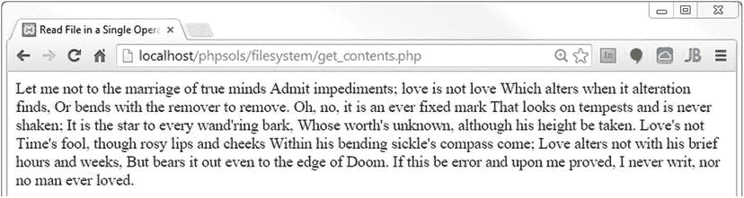
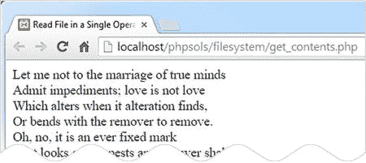
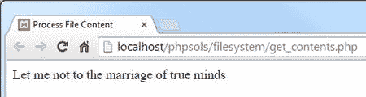

# 7. 使用 PHP 管理文件

PHP 拥有大量用于处理服务器文件系统的函数，但要找到合适的函数并不总是那么容易。本章将理清这些纷繁复杂的内容，向您展示这些函数的一些实际用途，例如读写文本文件以存储少量信息而无需数据库。循环在检查文件系统内容方面起着重要作用，因此您还将探索一些标准 PHP 库（SPL）迭代器，这些迭代器旨在提高循环效率。

除了打开本地文件，PHP 还可以读取其他服务器上的公共文件，例如新闻源。新闻源通常格式化为 XML（可扩展标记语言）。在过去，从 XML 文件中提取信息是一个繁琐的过程，但由于名副其实的 `SimpleXML`，情况已不再如此。在本章中，您将看到如何创建一个下拉菜单来列出文件夹中的所有图像，如何创建一个函数从文件夹中选择特定类型的文件，如何从另一台服务器拉取实时新闻源，以及如何提示访问者下载图像或 PDF 文件而不是在浏览器中打开它。额外的好处是，您将学习如何更改从另一个网站获取的日期的时区。

本章涵盖以下主题：

- 读写文件
- 列出文件夹中的内容
- 使用 `SplFileInfo` 类检查文件
- 使用 SPL 迭代器控制循环
- 使用 `SimpleXML` 从 XML 文件中提取信息
- 消费 RSS 源
- 创建下载链接

## 检查 PHP 能否打开文件

正如我在上一章中解释的，PHP 在大多数 Linux 服务器上以 `nobody` 或 `apache` 身份运行。因此，文件夹必须具有最低访问权限 `755`，脚本才能打开文件。要创建或更改文件，您通常需要设置全局访问权限 `777`，这是最不安全的设置。如果 PHP 配置为以您自己的名称运行，您可以设置得更严格，因为您的脚本可以在您拥有读取、写入和执行权限的任何文件夹中创建和写入文件。在 Windows 服务器上，您需要写入权限才能创建或更新文件。如果您需要更改权限的帮助，请咨询您的主机服务商。

### 影响文件访问的配置设置

托管公司可以通过 `php.ini` 对文件访问施加进一步限制。要了解已施加了哪些限制，请在您的网站上运行 `phpinfo()`，并检查 Core 部分中的设置。表 7-1 列出了您需要检查的设置。除非您自己运行服务器，否则通常无法控制这些设置。

表 7-1. 影响文件访问的 PHP 配置设置

| 指令 | 默认值 | 描述 |
| --- | --- | --- |
| `allow_url_fopen` | On | 允许 PHP 脚本打开互联网上的公开文件 |
| `allow_url_include` | Off | 控制包含远程文件的能力 |

表 7-1 中的设置都控制通过 URL（而非本地文件系统）对文件的访问，但它们之间存在重要区别。第一个设置 `allow_url_fopen` 允许您读取远程文件，但不能直接将它们包含到脚本中。这通常是安全的，因此默认启用。如果您的网站上禁用了 `allow_url_fopen`，您将无法访问有用的外部数据源，例如新闻源和公共 XML 文档。

另一方面，`allow_url_include` 允许您直接将远程文件包含到脚本中。这是一个重大的安全风险，因此默认禁用 `allow_url_include`。

**提示**：如果您的托管公司已禁用 `allow_url_fopen`，请请求启用它。否则，您将无法使用 PHP 解决方案 7-5。但不要混淆名称：在托管环境中，`allow_url_include` 应始终处于关闭状态。

在 PHP 5.4 之前，某些服务器对本地文件的访问施加了限制。这些限制现已被移除。对本地文件系统中文件的访问由每个文件和文件夹上设置的权限控制。

### 为本地测试创建文件存储文件夹

将数据存储在站点根目录内非常不安全，尤其是在需要为文件夹设置全局访问权限时。如果您能访问站点根目录之外的私有文件夹，请将数据存储作为子文件夹创建，并为其授予必要的权限。

就本章而言，我建议 Windows 用户在 C 盘上创建一个名为 `private` 的文件夹。

Mac 用户应在其主文件夹内创建一个 `private` 文件夹。如有必要，按照上一章所述，在文件夹的信息面板中设置读写权限。

如果您在 Linux 上进行测试，还需要确保 Web 服务器对 `private` 文件夹拥有读写权限。

## 读写文件

读写文件的能力有着广泛的应用。例如，您可以打开另一个网站上的文件，将内容读入服务器的内存，使用字符串和 XML 操作函数提取信息，然后将结果写入本地文件。您还可以查询自己服务器上的数据库，并将数据输出为文本或 CSV（逗号分隔值）文件。您甚至可以生成 Open Document Format 或 Microsoft Excel 电子表格格式的文件。但首先，让我们来看一下基本操作。

**提示**：如果您订阅了 lynda.com 的在线培训库，可以在我的“使用 PHP 将数据导出到文件”课程（[`www.lynda.com/PHP-tutorials/Exporting-Data-Files-PHP/158375-2.html`](http://www.lynda.com/PHP-tutorials/Exporting-Data-Files-PHP/158375-2.html)）中学习如何将数据从数据库导出为各种格式，例如 Microsoft Excel 和 Word。

### 单次操作读取文件

PHP 有三个函数可以在单次操作中读取文本文件的内容。

*   `readfile()` 打开一个文件并直接输出其内容。
*   `file_get_contents()` 将整个文件的内容读入单个字符串，但不直接产生输出。
*   `file()` 将每一行读入一个数组。

#### PHP 解决方案 7-1：获取文本文件的内容

此 PHP 解决方案演示了使用 `readfile()`、`file_get_contents()` 和 `file()` 访问文件内容之间的区别。

将 `sonnet.txt` 复制到您的 `private` 文件夹。这是一个包含莎士比亚十四行诗第 116 首的文本文件。在 `phpsols` 站点根目录中创建一个名为 `filesystem` 的新文件夹，然后在该新文件夹中创建一个名为 `get_contents.php` 的 PHP 文件。将以下代码插入 PHP 块中（`ch07` 文件夹中的 `get_contents_01.php` 显示了嵌入在网页中的代码，但您可以仅使用 PHP 代码进行测试）：

```
readfile('C:/private/sonnet.txt');
```

如果您使用的是 Mac，请按如下方式修改路径名，使用您自己的 Mac 用户名：

```
readfile('/Users/username/private/sonnet.txt');
```

如果您在 Linux 或远程服务器上进行测试，请相应修改路径名。

**注意**：为简洁起见，本章剩余示例仅显示 Windows 路径名。

保存 `get_contents.php` 并在浏览器中查看。您应该会看到类似以下截图的内容。浏览器会忽略原始文本中的换行符，并将莎士比亚的十四行诗显示为一个连续的文本块。



**提示**：如果看到错误消息，请检查代码输入是否正确，以及在 Mac 或 Linux 上是否设置了正确的文件和文件夹权限。

PHP 有一个名为 `nl2br()` 的函数，可以将换行符转换为 `<br/>` 标签。像这样更改 `get_contents.php` 中的代码（代码在 `get_contents_02.php` 中）：

```
nl2br(readfile('C:/private/sonnet.txt'));
```

**注意**：为了与 XHTML 兼容，`nl2br()` 会在 `<br/>` 的闭合尖括号前插入一个尾部斜杠。在 HTML5 中，尾部斜杠是可选的。`<br/>` 和 `<br>` 都是有效的。

保存 `get_contents.php` 并在浏览器中重新加载。输出仍然是一个连续的文本块。当您这样将一个函数作为参数传递给另一个函数时，内部函数的结果通常会传递给外部函数，从而在单个表达式中执行两个操作。因此，您会期望文件的内容在显示到浏览器之前先传递给 `nl2br()`。然而，`readfile()` 会立即输出文件内容。当它完成时，已经没有任何内容可供 `nl2br()` 插入 `<br/>` 标签了。文本已经到达浏览器。

**注意**：当两个函数像这样嵌套时，内部函数先执行，外部函数处理结果。但内部函数的返回值需要作为参数对外部函数有意义。`readfile()` 的返回值是从文件中读取的字节数。即使您在行首添加了 `echo`，您也只会得到添加到文本末尾的 `594`。在这种情况下，嵌套函数不起作用，但它通常是一种非常有用的技术，可以避免在将内部函数的结果传递给另一个函数处理之前将其存储在变量中。

您需要使用`file_get_contents()`而不是`readfile()`来将换行符转换为`<br/>`标签。`readfile()`只是输出文件内容，而`file_get_contents()`将文件内容作为一个字符串返回。如何处理它完全由您决定。像这样修改代码（或使用`get_contents_03.php`）：

```
echo nl2br(file_get_contents('C:/private/sonnet.txt'));
```

在浏览器中重新加载页面。现在，十四行诗的每一行都显示在自己的行上。



`file_get_contents()`的优势在于您可以将文件内容赋值给一个变量，并以某种方式处理它，然后再决定如何处理它。像这样更改`get_contents.php`中的代码（或使用`get_contents_04.php`）并将页面加载到浏览器中：

```
$sonnet = file_get_contents('C:/private/sonnet.txt');
// 将换行符替换为空格
$words = str_replace("\r\n", ' ', $sonnet);
```

```
// 拆分为单词数组
$words = explode(' ', $words);
```

```
// 提取前九个数组元素
$first_line = array_slice($words, 0, 9);
```

```
// 连接前九个元素并显示
echo implode(' ', $first_line);
```

这段代码将`sonnet.txt`的内容存储在名为`$sonnet`的变量中，然后将其传递给`str_replace()`函数，该函数将回车符和换行符替换为空格，并将结果存储为`$words`。

**注意**

关于`"\r\n"`的解释，请参阅第3章中的“在双引号内使用转义序列”。该文本文件是在Windows系统中创建的，因此换行符由回车符和换行符表示。Mac OS X和Linux系统上创建的文件仅使用换行符（`"\n"`）。

随后，`$words`被传递给`explode()`函数。这个名称听起来有些骇人的函数，能将字符串“炸开”并转换为数组。它使用第一个参数来确定在何处断开字符串。这里使用了空格，因此文本文件的内容被拆分为一个单词数组。

接着，单词数组被传递给`array_slice()`函数，该函数从数组中截取一段，起始位置由第二个参数指定，第三个参数指定截取的长度。PHP从0开始计数数组，因此这一操作提取了前九个单词。

最后，`implode()`执行与`explode()`相反的操作，它将数组的元素连接起来，并在每个元素之间插入第一个参数。结果通过`echo`显示，产生如下输出：



现在，脚本不再显示整个文件内容，而是只显示第一行。完整的字符串仍然存储在`$sonnet`中。

然而，如果你想逐行处理每个行，使用`file()`函数会更简单，它会将文件的每一行读入一个数组。要显示`sonnet.txt`的第一行，之前的代码可以简化为这样（参见`get_contents_05.php`）：

```
$sonnet = file('C:/private/sonnet.txt');
echo $sonnet[0];
```

事实上，如果你不需要完整的数组，可以在调用`file()`函数后，直接在方括号中添加索引号来访问某一行。以下代码显示了十四行诗的第十一行（参见`get_contents_06.php`）：

```
echo file('C:/private/sonnet.txt')[10];
```


**注意**

像这样直接访问作为函数返回结果的数组元素，是一种称为“数组解引用”的技术。该技术从PHP 5.4版本开始引入。`get_contents_06.php`中的代码在较旧版本的PHP中无法运行。

在我们刚刚探讨的三个函数中，`readfile()`可能用处最小。它只是读取文件内容并直接将其输出到缓冲中。你无法操作文件内容或从中提取信息。不过，`readfile()`的一个实际用途是强制下载文件，本章后面会看到。

另外两个函数`file_get_contents()`和`file()`则更有用，因为你可以将内容捕获到一个变量中，以便重新格式化或提取信息。它们的唯一区别在于：`file_get_contents()`将内容读入一个单一的字符串，而`file()`生成一个数组，其中每个元素对应文件中的一行。

**提示**

`file()`函数会在每个数组元素的末尾保留换行符。如果你想去除换行符，可以将常量`FILE_IGNORE_NEW_LINES`作为第二个参数传递给该函数。你还可以通过使用`FILE_SKIP_EMPTY_LINES`作为第二个参数来跳过空行。要同时去除换行符并跳过空行，可以用竖线分隔这两个常量，像这样：`FILE_IGNORE_NEW_LINES | FILE_SKIP_EMPTY_LINES`。

尽管我们仅使用本地文本文件测试了`file_get_contents()`和`file()`，但它们也可以检索其他域上公开文件的内容。这使得它们对于访问其他网页上的信息非常有用，尽管提取信息通常需要对字符串函数和文档对象模型（DOM）有扎实的理解。

`file_get_contents()`和`file()`的缺点是它们会将整个文件读入内存。对于非常大的文件，使用每次只处理文件一部分的函数会更可取。接下来我们将讨论这些函数。