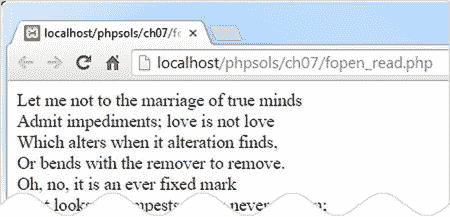

# 以读写模式打开和关闭文件

到目前为止，我们介绍过的函数都能一次性完成所有操作。不过，PHP 还提供了一组函数，允许你打开文件、读取和/或写入内容，然后关闭文件。该文件可以是本地文件系统中的文件，也可以是其他域上公开可用的文件。

以下是用于此类操作的最重要的函数：

*   `fopen()`：打开文件
*   `fgets()`：读取文件内容，通常是一次读取一行
*   `fgetcsv()`：从 CSV 文件中获取当前行，并将其转换为数组
*   `fread()`：读取文件的指定长度
*   `fwrite()`：写入文件
*   `feof()`：判断是否已到达文件末尾
*   `rewind()`：将内部指针移回文件开头
*   `fseek()`：将内部指针移动到文件中的特定位置
*   `fclose()`：关闭文件

第一个函数 `fopen()` 提供了令人眼花缭乱的选项，用于指定文件打开后的使用方式：`fopen()` 有一种只读模式、四种只写模式和五种读写模式。之所以有这么多模式，是因为它们让你能够控制是覆盖现有内容还是追加新内容。有时，你可能希望 PHP 在文件不存在时创建它。

每种模式都决定了打开文件时将内部指针放置在何处。它就像文字处理器中的光标：当你调用 `fread()` 或 `fwrite()` 时，PHP 会从指针当前所在的位置开始读取或写入。

表 7-2 将指导您了解所有选项。

**表 7-2.** `fopen()` 使用的读写模式

| 类型 | 模式 | 描述 |
| --- | --- | --- |
| 只读 | `r` | 内部指针初始位置位于文件开头。 |
| 只写 | `w` | 写入前删除现有数据。如果文件不存在则创建。 |
| | `a` | 追加模式。新数据添加到文件末尾。如果文件不存在则创建。 |
| | `c` | 保留现有内容，但内部指针置于文件开头。如果文件不存在则创建。 |
| | `x` | 仅在文件不存在时创建文件。如果已存在同名文件则失败。 |
| 读写 | `r+` | 读写操作可以任意顺序进行，并从当前内部指针所在位置开始。指针初始位于文件开头。操作成功要求文件必须已存在。 |
| | `w+` | 删除现有数据。写入后可回读数据。如果文件不存在则创建。 |
| | `a+` | 打开文件，准备在文件末尾添加新数据。移动内部指针后也允许回读数据。如果文件不存在则创建。 |
| | `c+` | 保留现有内容，内部指针置于文件开头。如果文件不存在则创建新文件。 |
| | `x+` | 创建新文件，但如果同名文件已存在则失败。写入后可回读数据。 |

如果选错了模式，你可能会意外删除宝贵的数据。你还需注意内部指针的位置。如果指针位于文件末尾，而你试图读取内容，结果将一无所获。另一方面，如果指针位于文件开头，而你开始写入，则会覆盖等量的现有数据。本章后面的“移动内部指针”部分将对此进行更详细的解释。

使用 `fopen()` 需要传入以下两个参数：

*   要打开文件的路径，如果文件位于不同域名下则提供 URL
*   包含表 7-2 中列出的某个模式的字符串

`fopen()` 函数返回一个指向打开文件的引用，该引用随后可与其他读写函数一起使用。以下是打开文本文件进行读取的方法：

```php
$file = fopen('C:/private/sonnet.txt', 'r');
```

之后，你可以将 `$file` 作为参数传递给其他函数，例如 `fgets()` 和 `fclose()`。通过一些实际演示，事情应该会变得更清晰。你可能会发现使用 `ch07` 文件夹中的文件更容易，而不是自行构建文件。我将快速介绍每种模式。

**注意：** Mac 和 Linux 用户需要调整示例文件中 `private` 文件夹的路径，以匹配其环境设置。

## 使用 `fopen()` 读取文件

文件 `fopen_read.php` 包含以下代码：

```php
// 存储文件路径名
$filename = 'C:/private/sonnet.txt';

// 以只读模式打开文件
$file = fopen($filename, 'r');

// 读取文件并存储其内容
$contents = fread($file, filesize($filename));

// 关闭文件
fclose($file);

// 使用 <br/> 标签显示内容
echo nl2br($contents);
```

如果你在浏览器中加载此文件，应会看到以下输出：



结果与 `get_contents_03.php` 中使用 `file_get_contents()` 完全相同。与 `file_get_contents()` 不同，`fread()` 函数需要知道要读取多少内容。你需要提供第二个参数来指示字节数。如果你只想读取一个超大文件的前 100 个左右的字符，这将非常有用。但是，如果你想要整个文件，则需要将文件路径名传递给 `filesize()` 以获取正确的大小。

另一种使用 `fopen()` 读取文件内容的方法是使用 `fgets()`，它一次检索一行。这意味着你需要将 `while` 循环与 `feof()` 结合使用，才能一直读取到文件末尾。`fopen_readloop.php` 中的代码如下所示：

```php
$filename = 'C:/private/sonnet.txt';

// 以只读模式打开文件
$file = fopen($filename, 'r');

// 创建变量来存储内容
$contents = '';

// 循环遍历每一行，直到文件末尾
while (!feof($file)) {
    // 获取下一行，并追加到 $contents 中
    $contents .= fgets($file);
}

// 关闭文件
fclose($file);

// 显示内容
echo nl2br($contents);
```

`while` 循环使用 `fgets()` 逐行检索文件内容——`!feof($file)` 等价于“直到 `$file` 的末尾”——并将它们存储在 `$contents` 中。

使用 `fgets()` 与使用 `file()` 函数非常相似，因为它也是一次处理一行。区别在于，一旦你找到所需的信息，就可以使用 `fgets()` 跳出循环。如果你在处理一个非常大的文件，这是一个显著的优势。而 `file()` 函数会将整个文件加载到数组中，从而消耗内存。