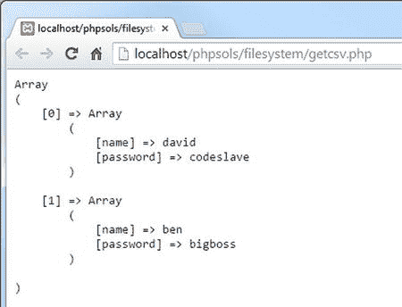
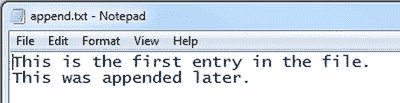
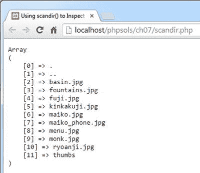
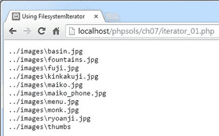
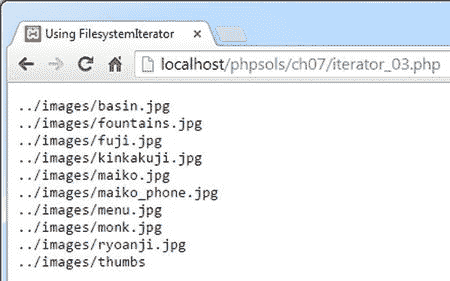
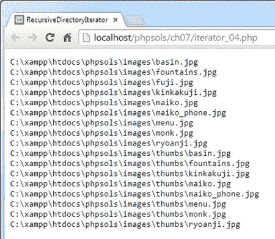
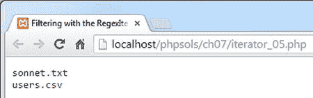

# PHP 方案 7-2：从 CSV 文件中提取数据

文本文件可作为平面文件数据库使用，每条记录存储在单独一行中，各字段之间用逗号、制表符或其他分隔符隔开。这类文件称为 CSV 文件。通常，CSV 代表逗号分隔值，但当使用制表符或其他分隔符时，也可表示字符分隔值。本 PHP 方案展示了如何使用 `fopen()` 和 `fgetcsv()` 将 CSV 文件中的值提取到多维关联数组中。

将 `ch07` 文件夹中的 `users.csv` 复制到你的 `private` 文件夹。该文件包含以下逗号分隔值数据：

`name,password`

`david,codeslave`

`ben,bigboss`

第一行由文件其余数据列标题组成。只有两行数据，每行包含一个用户名和密码。该文件还将在第 9 章中用于创建一个简单的基于文件的登录系统。

> **警告**：以逗号分隔值存储数据时，逗号后不应有空格。如果添加空格，它将被视为数据字段的第一个字符。CSV 文件中的每一行必须包含相同数量的项目。

在 `filesystem` 文件夹中创建一个名为 `getcsv.php` 的文件，并使用 `fopen()` 以读取模式打开 `users.csv`：

`$file = fopen('C:/private/users.csv', 'r');`

使用 `fgetcsv()` 将文件中的第一行提取为数组，然后将其赋值给名为 `$titles` 的变量：

`$titles = fgetcsv($file);`

这将创建一个包含第一行（name 和 password）值的数组 `$titles`。

`fgetcsv()` 函数需要一个参数，即你已打开文件的引用。它还接受最多四个可选参数：

- 行的最大长度：默认值为 0，表示无限制。
- 字段之间的分隔符：默认为逗号。
- 封闭字符：如果字段包含作为数据一部分的分隔符，则必须用引号括起来。默认值为双引号。
- 转义字符：默认值为反斜杠。

我们使用的 CSV 文件不需要设置任何可选参数。

在下一行，初始化一个空数组，用于存储将从 CSV 数据中提取的值：

`$users = [];`

从一行中提取值后，`fgetcsv()` 会移动到下一行。要获取文件中的其余数据，你需要创建一个循环。在 `fopen_readloop.php` 中，使用了 `!feof($file)` 作为条件。这次，将 `fgetcsv()` 的返回值赋值给条件中的一个变量，如下所示：

```php
while (($data = fgetcsv($file)) !== false) {
    $users[] = array_combine($titles, $data);
}
```

请注意，将从 `fgetcsv()` 返回值的语句用一对单独的括号括起来，然后使用不全等运算符（`!==`）与 `false` 进行比较。这会使得循环运行直到 `fgetcsv()` 不再产生数据。

循环内的代码使用 `array_combine()` 函数生成一个关联数组，并将其添加到 `$users` 数组中。此函数需要两个参数，这两个参数必须是具有相同数量元素的数组。两个数组合并，从第一个参数提取结果关联数组的键，从第二个参数提取值。

关闭 CSV 文件：

`fclose($file);`

要检查结果，请使用 `print_r()`。将其包裹在 `<pre>` 标签中，使输出更易于阅读：

```php
echo '<pre>';
print_r($users);
echo '</pre>';
```

这对于 `users.csv` 运行良好，但脚本可以更健壮。如果 `fgetcsv()` 遇到空行，它会返回一个包含单个 `null` 元素的数组，当作为参数传递给 `array_combine()` 时会导致错误。通过添加以粗体突出显示的条件语句来修改 `while` 循环：



**图 7-1.** CSV 数据已转换为多维关联数组

保存 `getcsv.php` 并在浏览器中加载它。你应该会看到如图 7-1 所示的结果。

```php
while (($data = fgetcsv($file)) !== false) {
    if (count($data) == 1 && is_null($data[0])) {
        continue;
    }
    $users[] = array_combine($titles, $data);
}
```

该条件语句使用 `count()` 方法找出数组中有多少个元素。如果只有一个，并且第一个元素的值为 `null`，则 `continue` 关键字返回循环顶部而不执行下一行。

你可以对照 `ch07` 文件夹中的 `getcsv.php` 检查你的代码。

### 在 Mac OS 上创建的 CSV 文件

PHP 通常难以检测 Mac 操作系统上创建的 CSV 文件的行尾。如果 `fgetcsv()` 无法正确从 CSV 文件中提取数据，请在脚本顶部添加以下代码行：

`ini_set('auto_detect_line_endings', true);`

这对性能影响很小，因此仅当 Mac 行尾导致 CSV 文件出现问题时才应使用。

## 使用 `fopen()` 替换内容

第一个只写模式（`w`）会删除文件中的任何现有内容，因此对于需要频繁更新的文件非常有用。你可以使用 `fopen_write.php` 测试 `w` 模式，该文件在 `DOCTYPE` 声明之上有以下 PHP 代码：

```php
<?php
// 如果表单已提交，处理输入文本
if (isset($_POST['putContents'])) {
    // 以只写模式打开文件
    $file = fopen('C:/private/write.txt', 'w');
    // 写入内容
    fwrite($file, $_POST['contents']);
    // 关闭文件
    fclose($file);
}
?>
```

当页面中的表单提交时，此代码将 `$_POST['contents']` 的值写入名为 `write.txt` 的文件中。`fwrite()` 函数接受两个参数：文件的引用以及你要写入的任何内容。

> **注意**：你可能会遇到 `fputs()` 而不是 `fwrite()`。这两个函数完全相同：`fputs()` 是 `fwrite()` 的同义词。

如果在浏览器中加载 `fopen_write.php`，在文本区域中键入一些内容，然后单击“写入文件”，PHP 会创建 `write.txt` 并插入你在文本区域中键入的任何内容。由于这只是一个演示，我省略了任何检查以确保文件已成功写入。打开 `write.txt` 以验证你的文本已插入。现在，在文本区域中键入不同的内容并再次提交表单。原始内容将从 `write.txt` 中删除，并替换为新文本。已删除的文本将永久消失。

## 使用 `fopen()` 追加内容

追加模式不仅会在末尾添加新内容，保留任何现有内容，而且如果文件不存在，还可以创建新文件。`fopen_append.php` 中的代码如下所示：

```php
// 以追加模式打开文件
$file = fopen('C:/private/append.txt', 'a');
// 写入内容后跟一个新行
fwrite($file, $_POST['contents'] . PHP_EOL);
// 关闭文件
fclose($file);
```

请注意，我在 `$_POST['contents']` 之后连接了 `PHP_EOL`。这是一个 PHP 常量，表示使用适合操作系统的正确字符的新行。在 Windows 上，它会插入一个回车符和换行符，但在 Mac 和 Linux 上只插入一个换行符。

如果在浏览器中加载 `fopen_append.php`，键入一些文本并提交表单，它会在 private 文件夹中创建一个名为 `append.txt` 的文件并插入你的文本。键入其他内容并再次提交表单；新文本应添加到先前文本的末尾，如下面的屏幕截图所示。



我们将在第 9 章中再次讨论追加模式。


### 写入前锁定文件

使用 `c` 模式调用 `fopen()` 的目的是让你在修改文件前有机会用 `flock()` 锁定它。`flock()` 函数接受两个参数：文件引用和一个指定锁定操作方式的常量。共有三种操作类型：
- `LOCK_SH` 获取共享锁以进行读取
- `LOCK_EX` 获取独占锁以进行写入
- `LOCK_UN` 释放锁定

要在写入前锁定文件，请以 `c` 模式打开文件，并立即调用 `flock()`，如下所示：

```
// 以 c 模式打开文件
$file = fopen('C:/private/lock.txt', 'c');
// 获取独占锁
flock($file, LOCK_EX);
```

这会打开文件（如果文件不存在则创建），并将内部指针置于文件开头。这意味着你需要将指针移动到文件末尾或删除现有内容，然后才能开始使用 `fwrite()` 写入。要将指针移动到文件末尾，请使用 `fseek()` 函数，如下所示：

```
// 移动到文件末尾
fseek($file, 0, SEEK_END);
```

或者，通过调用 `ftruncate()` 删除现有内容：

```
// 删除现有内容
ftruncate($file, 0);
```

完成文件写入后，你必须在调用 `fclose()` 之前手动解锁文件：

```
// 在关闭前解锁文件
flock($file, LOCK_UN);
fclose($file);
```

**注意**  
根据 `flock()` 的文档，关闭文件时不再自动解锁（参见 [`http://php.net/manual/en/function.flock.php`](http://php.net/manual/en/function.flock.php)）。即使你可以重新打开该文件，它对于其他用户和进程仍然处于锁定状态。

### 防止覆盖已有文件

与其他写入模式不同，`x` 模式不会打开已有文件。它只会创建一个准备写入的新文件。如果同名文件已存在，`fopen()` 返回 `false`，从而防止你覆盖它。`fopen_exclusive.php` 中的处理代码如下所示：

```
// 只在文件不存在时创建并准备写入
// 错误控制运算符用于阻止显示错误信息
if ($file = @ fopen('C:/private/once_only.txt', 'x')) {
   // 写入内容
   fwrite($file, $_POST['contents']);
   // 关闭文件
   fclose($file);
} else {
   $error = '文件已存在，无法被覆盖。';
}
```

尝试以 `x` 模式写入已有文件会生成一系列 PHP 错误消息。将写入和关闭操作包裹在条件语句中可以处理大部分错误，但 `fopen()` 仍然会产生一个警告。在 `fopen()` 前使用错误控制运算符（`@`）可以抑制该警告。

在浏览器中加载 `fopen_exclusive.php`，输入一些文本，然后点击“写入文件”。内容应被写入目标文件夹中的 `once_only.txt`。如果再次尝试，表单上方将显示存储在 `$error` 中的消息。

### 使用 `fopen()` 进行组合读写操作

通过在之前的任何模式后添加加号（`+`），文件将以读写模式打开。你可以按任意顺序执行任意数量的读取或写入操作，直到文件被关闭。各组合模式的区别如下：

- `r+`：文件必须已存在；不会自动创建新文件。内部指针置于开头，准备读取现有内容。
- `w+`：删除现有内容，因此首次打开文件时无内容可读。
- `a+`：文件打开时内部指针位于末尾，准备追加新内容，因此在读取任何内容前需要将指针移回。
- `c+`：文件打开时内部指针位于开头。
- `x+`：总是创建新文件，因此首次打开文件时无内容可读。

读取使用 `fread()` 或 `fgets()`，写入使用 `fwrite()`，与之前完全相同。理解内部指针的位置非常重要。

### 移动内部指针

读取和写入操作始终从内部指针当前所在位置开始，因此通常你希望读取时指针位于文件开头，写入时位于文件末尾。要将指针移动到开头，像这样将文件引用传递给 `rewind()`：

```
rewind($file);
```

要将指针移动到文件末尾，像这样使用 `fseek()`：

```
fseek($file, 0, SEEK_END);
```

你还可以使用 `fseek()` 将内部指针移动到特定位置或相对于当前位置的偏移位置。详情参见 [`http://php.net/manual/en/function.fseek.php`](http://php.net/manual/en/function.fseek.php)。

**提示**  
在追加模式（`a` 或 `a+`）下，无论指针当前在什么位置，内容总是被写入到文件末尾。

## 探索文件系统

PHP 的文件系统函数也可以打开目录（文件夹）并检查其内容。在 PHP 解决方案 6-6 中，你实际使用了一个这样的函数：通过 `scandir()` 创建 `images` 文件夹中现有文件名的数组，并循环遍历该数组为上传的文件创建唯一名称。从 Web 开发者的角度来看，文件系统函数的其他实际用途包括：构建显示文件夹内容的下拉菜单，以及创建提示用户下载文件（如图片或 PDF 文档）的脚本。

### 使用 `scandir()` 检查文件夹

让我们更仔细地看一下你在 PHP 解决方案 6-6 中用过的 `scandir()` 函数。它返回一个包含指定文件夹内文件和子文件夹的数组。只需将文件夹（目录）的路径名作为字符串传递给 `scandir()`，并将结果存储在一个变量中，如下所示：

```
$files = scandir('../images');
```

你可以使用 `print_r()` 显示数组内容来检查结果，如下方截图所示（代码在 `ch07` 文件夹的 `scandir.php` 中）：



`scandir()` 返回的数组不仅仅包含文件。前两项是代表当前文件夹和父文件夹的点文件。最后一项是一个名为 `thumbs` 的文件夹。该数组仅包含每个项目的名称。如果你想获取有关文件夹内容的更多信息，最好使用 `FilesystemIterator` 类。


### 使用 `FilesystemIterator` 检查文件夹内容

`FilesystemIterator` 类是标准 PHP 库（SPL）的组成部分。尽管名称如此，SPL 并非外部库或框架，而是 PHP 核心的一部分。其功能之一就是提供一系列专门的迭代器，让你用极少的代码实现复杂的循环。

`FilesystemIterator` 类是在 PHP 5.3 中新增的。它为原始的 `DirectoryIterator` 类添加了新功能，该类允许你遍历目录或文件夹的内容。

因为它是一个类，你可以使用 `new` 关键字实例化一个 `FilesystemIterator` 对象，并将要检查的文件夹路径传递给构造函数，像这样：

`$files = new FilesystemIterator('../images');`

与 `scandir()` 不同，这不会返回一个文件名数组，因此你不能使用 `print_r()` 来显示其内容。相反，它会创建一个对象，让你可以访问文件夹内部的所有内容。要显示文件名，请使用 `foreach` 循环，如下所示（代码位于 `ch07` 文件夹中的 `iterator_01.php`）：

```
$files = new FilesystemIterator('../images');
foreach ($files as $file) {
    echo $file . '<br>';
}
```

这将产生以下结果：



关于此输出，可以得出以下观察结果：

-   代表当前文件夹和父文件夹的点文件被省略了。
-   显示的值代表文件的相对路径，而不仅仅是文件名。
-   由于截图是在 Windows 上进行的，因此相对路径中使用了反斜杠。

在大多数情况下，反斜杠并不重要，因为 PHP 在 Windows 路径中接受正斜杠或反斜杠。然而，如果你想根据 `FilesystemIterator` 的输出生成 URL，有一个选项可以使用 Unix 风格的路径。设置该选项的一种方法是将一个常量作为第二个参数传递给 `FilesystemIterator()`，如下所示（参见 `iterator_02.php`）：

```
$files = new FilesystemIterator('../images', FilesystemIterator::UNIX_PATHS);
```

或者，你也可以像这样在 `FilesystemIterator` 对象上调用 `setFlags()` 方法（参见 `iterator_03.php`）：

```
$files = new FilesystemIterator('../images');
$files->setFlags(FilesystemIterator::UNIX_PATHS);
```

两者都会产生如下截图所示的输出。



当然，这在 Mac OS X 或 Linux 上不会有什么不同，但设置此选项可以使你的代码更具可移植性。

> **提示**
> SPL 类使用的常量都是类常量。它们总是以类名和作用域解析运算符（双冒号）作为前缀。像这样冗长的名称使得使用带有 PHP 代码提示和代码补全功能的编辑程序非常值得。

虽然能够显示文件夹内容的相对路径很有用，但使用 `FilesystemIterator` 类的真正价值在于，每次循环运行时，它都会让你访问一个 `SplFileInfo` 对象。`SplFileInfo` 类有近 30 个方法，可用于提取关于文件和文件夹的有用信息。表 7-3 列出了一些最有用的 `SplFileInfo` 方法。

**表 7-3.** 可通过 `SplFileInfo` 方法访问的文件信息

| 方法 | 返回内容 |
| --- | --- |
| `getFilename()` | 文件的名称 |
| `getPath()` | 当前对象的相对路径（不含文件名），如果当前对象是文件夹，则不含文件夹名称 |
| `getPathName()` | 当前对象的相对路径，根据当前类型包含文件名或文件夹名称 |
| `getRealPath()` | 当前对象的完整路径，如果合适则包含文件名 |
| `getSize()` | 文件或文件夹的大小（以字节为单位） |
| `isDir()` | 如果当前对象是文件夹（目录），则返回 True |
| `isFile()` | 如果当前对象是文件，则返回 True |
| `isReadable()` | 如果当前对象可读，则返回 True |
| `isWritable()` | 如果当前对象可写，则返回 True |

要访问子文件夹的内容，请使用 `RecursiveDirectoryIterator` 类。这将向下深入文件夹结构的每一层，但你需要将其与名称奇怪的 `RecursiveIteratorIterator` 结合使用，如下所示（代码位于 `iterator_04.php`）：

```
$files = new RecursiveDirectoryIterator('../images');
$files->setFlags(RecursiveDirectoryIterator::SKIP_DOTS);
$files = new RecursiveIteratorIterator($files);
foreach ($files as $file) {
    echo $file->getRealPath() . '<br>';
}
```

> **注意**
> 默认情况下，`RecursiveDirectoryIterator` 包含代表当前文件夹和父文件夹的点文件。要排除它们，你需要将该类的 `SKIP_DOTS` 常量作为第二个参数传递给构造函数，或者使用 `setFlags()` 方法。

如下截图所示，`RecursiveDirectoryIterator` 会检查所有子文件夹的内容，在一次操作中揭示 `thumbs` 文件夹的内容：



如果你只想查找特定类型的文件呢？那就轮到另一个迭代器出场了……

### 使用 `RegexIterator` 限制文件类型

`RegexIterator` 充当另一个迭代器的包装器，使用正则表达式作为搜索模式来过滤其内容。假设你想在 `ch07` 文件夹中查找文本文件和 CSV 文件。用于搜索 `.txt` 和 `.csv` 文件扩展名的正则表达式如下所示：

```
'/\.(?:txt|csv)$/i'
```

这个正则表达式以不区分大小写的方式匹配这两种文件扩展名。`iterator_05.php` 中的代码如下所示：

```
$files = new FilesystemIterator('.');
$files = new RegexIterator($files, '/\.(?:txt|csv)$/i');
foreach ($files as $file) {
    echo $file->getFilename() . '<br>';
}
```

第一行将一个点传递给 `FilesystemIterator` 构造函数，这会告诉它检查当前文件夹。

然后，原始的 `$files` 对象作为第一个参数传递给 `RegexIterator` 构造函数，正则表达式作为第二个参数，过滤后的集合被重新赋值给 `$files`。在 `foreach` 循环内部，`getFilename()` 方法检索文件的名称。结果如下：



现在只列出了文本文件和 CSV 文件。所有的 PHP 文件都被忽略了。

> **提示**
> 随着你阅读本书的深入，你会看到我会频繁使用正则表达式。它们是值得添加到你的技能库中的有用工具。

我想到了这个阶段，你可能会想知道这是否可以用于任何实际的用途。让我们来构建一个文件夹内图片的下拉菜单。


