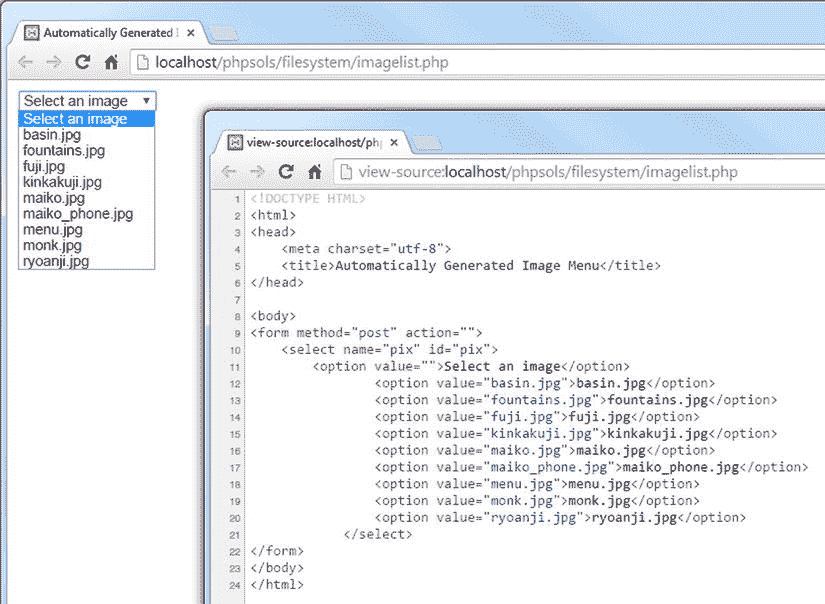

# PHP 解决方案 7-3：构建文件下拉菜单

在处理数据库时，您经常需要获取特定文件夹中的图片或其它文件列表。例如，您可能希望为商品详情页面关联一张照片。虽然您可以在文本字段中手动输入图片名称，但必须确保图片存在且名称拼写正确。让 PHP 通过自动构建下拉菜单来完成这项艰巨任务。菜单始终保持最新状态，且绝无拼写错误的风险。

在 `filesystem` 文件夹中创建一个名为 `imagelist.php` 的 PHP 页面。或者，使用 `ch07` 文件夹中的 `imagelist_01.php`。在 `imagelist.php` 内创建一个表单，并插入一个仅包含一个 `<option>` 的 `<select>` 元素，如下所示（该代码已包含在 `imagelist_01.php` 中）：

```html
<form method="post" action="">
<select name="pix" id="pix">
<option value="">选择一张图片</option>
</select>
</form>
```

这个 `<option>` 是下拉菜单中唯一的静态元素。

按如下方式修改表单中的 `<select>` 元素：

```php
<select name="pix" id="pix">
<option value="">选择一张图片</option>
<?php
$files = new FilesystemIterator('../images');
$images = new RegexIterator($files, '/\.(?:jpg|png|gif)$/i');
foreach ($images as $image) {
$filename = $image->getFilename();
?>
<option value="<?= $filename; ?>"><?= $filename; ?></option>
<?php } ?>
</select>
```

请确保 `images` 文件夹的路径与您站点的文件夹结构相匹配。作为 `RegexIterator` 构造函数的第二个参数的正则表达式，用于不区分大小写地匹配文件扩展名为 `.jpg`、`.png` 和 `.gif` 的文件。

`foreach` 循环仅获取当前图片的文件名，并将其插入到 `<option>` 元素中。

保存 `imagelist.php` 并在浏览器中加载。您应该会看到一个下拉菜单，列出了 `images` 文件夹中的所有图片，如图 7-2 所示。



**图 7-2.** PHP 轻松创建指定文件夹中图片的下拉菜单

当融入在线表单后，所选图片的文件名会出现在 `$_POST` 数组中，并通过 `<select>` 元素的 `name` 属性进行标识——在本例中为 `$_POST['pix']`。就是这么简单！

您可以将您的代码与 `ch07` 文件夹中的 `imagelist_02.php` 进行比较。