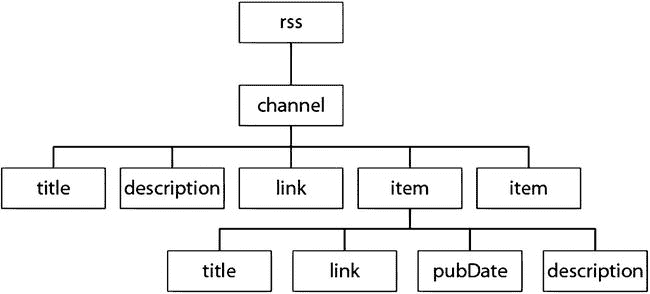
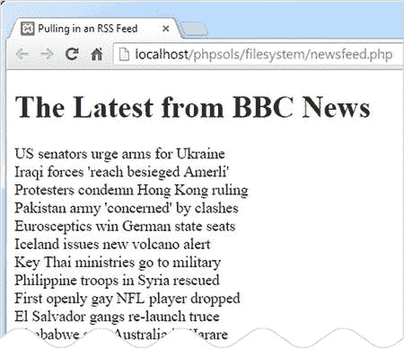
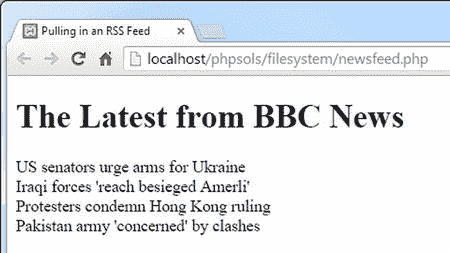
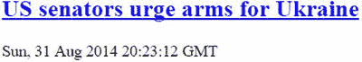
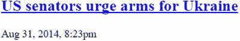
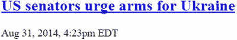
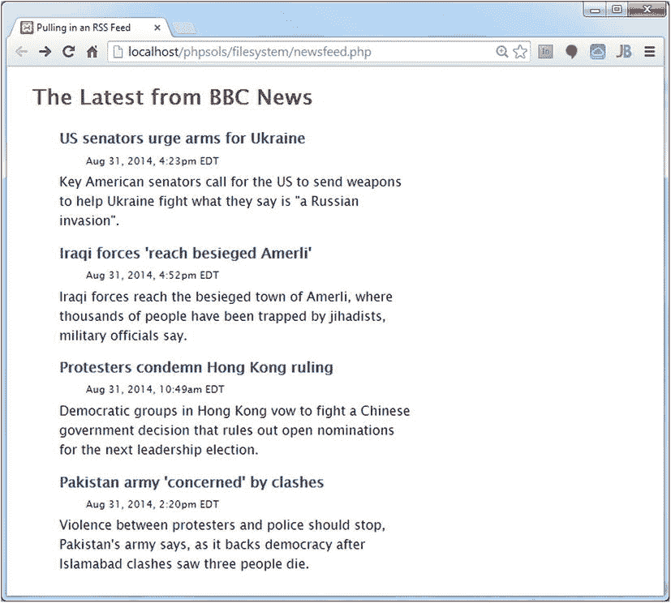

# 访问远程文件

在本地计算机或自有网站上读取、写入和检查文件非常有用。但 `allow_url_fopen` 也能让你访问互联网上任何位置的公开文档。你不能直接包含来自其他服务器的文件——除非开启了 `allow_url_include`——但你可以读取其内容，保存到变量中，并在将其整合到你自己的页面或保存信息到数据库之前，使用 PHP 函数进行处理。只要远程服务器的所有者设置了适当的权限，你还可以向远程服务器上的文档写入内容。

在此需要提醒一句。从远程来源提取内容整合到自己的页面时，存在潜在的安全风险。例如，远程页面可能包含嵌入在 `<script>` 标签或超链接中的恶意脚本。除非远程页面以已知格式从受信任的来源提供数据（例如 Amazon.com 数据库中的产品详情、政府气象局提供的天气信息、或报纸或广播公司提供的新闻源），否则应通过将内容传递给 `htmlentities()` 函数（参见 PHP 方案 5-2）进行清理。`htmlentities()` 不仅会将双引号转换为 `&quot;`，还会将 `<` 转换为 `&lt;`，将 `>` 转换为 `&gt;`。这样会将标签显示为纯文本，而不是将其作为 HTML 处理。

如果你希望允许某些 HTML 标签，可以使用 `strip_tags()` 函数。向 `strip_tags()` 传递一个字符串时，它会返回移除了所有 HTML 标签和注释的字符串。它还会移除 PHP 标签。第二个可选参数是一个列表，用于指定你想要保留的标签。例如，以下代码会剥离除段落、一级标题和二级标题之外的所有标签：

`$stripped = strip_tags($original, '<p><h1><h2>');`

**提示**

关于安全问题的深入讨论，请参阅 Chris Snyder 和 Michael Southwell 合著的《Pro PHP Security, 2nd Edition》（Apress, 2010, ISBN: 978-1-4302-3318-3）。

## 消费新闻及其他 RSS 源

你可能希望在网站中整合的一些最有用的远程信息来源来自 RSS 源。RSS 代表 Really Simple Syndication（真正简易聚合），它是 XML 的一种方言。XML 与 HTML 类似，都使用标签来标记内容。不同之处在于，XML 标签用于以可预测的层次结构组织数据，而不是定义段落、标题和图像。XML 以纯文本编写，因此经常用于在可能运行不同操作系统的计算机之间共享信息。

图 7-3 展示了典型的 RSS 2.0 源结构。整个文档由一对 `<rss>` 标签包裹。这是根元素，类似于网页中的 `<html>` 标签。文档的其余部分由一对 `<channel>` 标签包裹，其中始终包含描述 RSS 源的以下三个元素：`<title>`、`<description>` 和 `<link>`。



**图 7-3.** RSS 源的主要内容位于 item 元素中

除了这三个必需的元表外，`<channel>` 还可以包含许多其他元素，但有趣的内容要在 `<item>` 元素中寻找。以新闻源为例，这里就是各个新闻条目所在之处。如果你查看的是博客的 RSS 源，`<item>` 元素通常包含博文的摘要。

每个 `<item>` 元素可以包含多个子元素，但图 7-3 中显示的是最常见，通常也是最有趣的：

- `<title>`：条目的标题

- `<link>`：条目的 URL

- `<pubDate>`：发布日期

- `<description>`：条目的摘要

这种可预测的格式使得使用 SimpleXML 从 RSS 源中提取信息变得容易。

**注意**

你可以在 [`www.rssboard.org/rss-specification`](http://www.rssboard.org/rss-specification) 找到完整的 RSS 规范。与大多数技术规范不同，它用平实的语言写成，易于阅读。

## 使用 SimpleXML

只要你了解 XML 文档的结构，SimpleXML 就能做到名副其实：它让从 XML 中提取信息变得简单。第一步是将 XML 文档的 URL 传递给 `simplexml_load_file()`。你也可以通过将路径作为参数传递来加载本地 XML 文件。例如，以下代码从 BBC 获取世界新闻源：

```php
$feed = simplexml_load_file('http://feeds.bbci.co.uk/news/world/rss.xml');
```

这会创建 `SimpleXMLElement` 类的一个实例。现在，源中的所有元素都可以作为 `$feed` 对象的属性，通过元素名称来访问。对于 RSS 源，`<item>` 元素可以像 `$feed->channel->item` 这样访问。

要显示每个 `<item>` 的 `<title>`，可以创建一个如下的 `foreach` 循环：

```php
foreach ($feed->channel->item as $item) {
    echo $item->title . '<br>';
}
```

如果你将此与图 7-3 进行比较，你会看到你通过使用 `->` 运算符链接元素名称来访问元素，直到到达目标。由于有多个 `<item>` 元素，你需要使用循环来进一步深入。或者，也可以使用数组表示法，如下所示：

`$feed->channel->item[2]->title`

这会获取第三个 `<item>` 元素的 `<title>`。除非你只想要一个特定的值，否则使用循环更简单。

有了这些背景知识，接下来让我们使用 SimpleXML 来显示新闻源的内容。

## PHP 方案 7-5：消费 RSS 新闻源

本 PHP 方案演示了如何使用 `SimpleXML` 从实时新闻源中提取信息，并将其展示在网页上。它同时也展示了如何将 `<pubDate>` 元素格式化为更友好的格式，以及如何使用 `LimitIterator` 类限制显示的项目数量。

在 `filesystem` 文件夹中创建一个名为 `newsfeed.php` 的新页面。此页面将包含 PHP 和 HTML 的混合代码。本 PHP 方案选择的新闻源是 BBC 世界新闻。使用大多数新闻源的一个条件是必须注明来源。因此，在页面顶部添加一个格式化为 `<h1>` 标题的“来自 BBC 新闻的最新消息”。

**注意：** 关于在自己的网站上使用 BBC 新闻源的条款和条件，请参阅 [`www.bbc.co.uk/news/10628494#mysite`](http://www.bbc.co.uk/news/10628494#mysite) 和 [`www.bbc.co.uk/terms/additional_rss.shtml`](http://www.bbc.co.uk/terms/additional_rss.shtml)。

在标题下方创建一个 PHP 代码块，并添加以下代码来加载新闻源：

```php
$url = 'http://feeds.bbci.co.uk/news/world/rss.xml';
$feed = simplexml_load_file($url);
```

使用一个 `foreach` 循环来访问 `<item>` 元素并显示每个元素的 `<title>`：

```php
foreach ($feed->channel->item as $item) {
    echo $item->title . '<br>';
}
```

通常，新闻源包含 50 个或更多项目。这对于新闻网站来说没问题，但你可能希望在自己的网站上显示更短的选项。使用另一个 SPL 迭代器来选择特定范围的项目。像这样修改代码：



**图 7-4.** 新闻源包含大量项目

保存 `newsfeed.php` 并在浏览器中加载该页面。你应该会看到一长串类似于图 7-4 显示的新闻项。

```php
$url = 'http://feeds.bbci.co.uk/news/world/rss.xml';
$feed = simplexml_load_file($url, 'SimpleXMLIterator');
$filtered = new LimitIterator($feed->channel->item, 0, 4);
foreach ($filtered as $item) {
    echo $item->title . '<br>';
}
```

要使用 `SimpleXML` 配合 SPL 迭代器，你需要将 `SimpleXMLIterator` 类的名称作为第二个参数提供给 `simplexml_load_file()`。然后，你可以将要影响的 `SimpleXML` 元素传递给迭代器的构造函数。

在这个例子中，`$feed->channel->item` 被传递给 `LimitIterator` 的构造函数。`LimitIterator` 接受三个参数：要限制的对象、起始点（从 0 开始计数）以及循环运行的次数。这段代码从第一个项目开始，并将项目数量限制为四个。

`foreach` 循环现在遍历 `$filtered` 的结果。如果你再次测试页面，你将看到仅四个标题，如图 7-5 所示。如果显示的标题选择与之前不同，请不要感到惊讶。BBC 新闻网站每分钟都在更新。

既然你已经限制了项目的数量，修改 `foreach` 循环，将 `<title>` 元素包裹在一个指向原始文章的链接中，然后显示 `<pubDate>` 和 `<description>` 元素。循环体如下所示：



**图 7-5.** `LimitIterator` 限制显示的项目数量

```php
foreach ($filtered as $item) { ?>
    <h2><a href="<?= $item->link; ?>"><?= $item->title; ?></a></h2>
    <p class="datetime"><?php echo $item->pubDate; ?></p>
    <p><?php echo $item->description; ?></p>
<?php } ?>
```

保存页面并再次测试。链接会将你直接带到 BBC 网站上的相关新闻报道。新闻源现在可以工作了，但是 `<pubDate>` 的格式遵循 RSS 规范中规定的格式，如下一个截图所示：



要以更友好的方式格式化日期和时间，请将 `$item->pubDate` 传递给 `DateTime` 类的构造函数，然后使用 `DateTime format()` 方法进行显示。像这样修改 `foreach` 循环中的代码：

```php
<p class="datetime"><?php $date = new DateTime($item->pubDate);
echo $date->format('M j, Y, g:ia'); ?></p>
```

这将日期重新格式化为如下所示：



神秘的 PHP 日期格式化字符串在第 14 章中解释。

这看起来好多了，但时间仍然以 GMT（伦敦时间）表示。如果你的网站大多数访问者在美国东海岸，你可能希望显示当地时间。使用 `DateTime` 对象就没有问题。使用 `setTimezone()` 方法更改为纽约时间。你甚至可以自动显示 EDT（美国东部夏令时）或 EST（美国东部标准时间），具体取决于是否处于夏令时。像这样修改代码：

```php
<p class="datetime"><?php $date = new DateTime($item->pubDate);
$date->setTimezone(new DateTimeZone('America/New_York'));
$offset = $date->getOffset();
$timezone = ($offset == -14400) ? ' EDT' : ' EST';
echo $date->format('M j, Y, g:ia') . $timezone; ?></p>
```

要创建一个 `DateTimeZone` 对象，请将 [`http://php.net/manual/en/timezones.php`](http://php.net/manual/en/timezones.php) 上列出的一个时区作为参数传递给它。这是唯一需要 `DateTimeZone` 对象的地方，因此它被直接创建为 `setTimezone()` 方法的参数。

没有专门的方法告诉你是否处于夏令时，但 `getOffset()` 方法返回时间相对于协调世界时（UTC）的偏移秒数。以下代码行决定显示 EDT 还是 EST：

```php
$timezone = ($offset == -14400) ? ' EDT' : ' EST';
```

这使用了 `$offset` 的值与三元运算符。在夏季，纽约比 UTC 晚四个小时（-14400 秒）。所以，如果 `$offset` 是 -14400，条件判断为 `true`，则 EDT 被赋值给 `$timezone`。否则，使用 EST。

最后，`$timezone` 的值被连接到格式化后的时间上。`$timezone` 使用的字符串有一个前导空格，用于将时区与时间分隔开。当页面加载时，时间会调整为美国东海岸的时间，如下所示：





**图 7-6.** 实时新闻源只需要十几行 PHP 代码

现在页面只需要用 CSS 进行美化。图 7-6 展示了在 `styles` 文件夹中使用 `newsfeed.css` 样式化后的最终新闻源。

**提示：** 如果你订阅了 lynda.com 在线培训库，你可以在我的课程“Up and Running with the Standard PHP Library”（[`www.lynda.com/PHP-tutorials/Up-Running-Standard-PHP-Library/175038-2.html`](http://www.lynda.com/PHP-tutorials/Up-Running-Standard-PHP-Library/175038-2.html)）中学习更多关于 SPL 和 SimpleXML 的知识。

虽然我在这个 PHP 方案中使用了 BBC 新闻源，但它应该适用于任何 RSS 2.0 源。例如，你可以在本地尝试使用 [`http://rss.cnn.com/rss/edition.rss`](http://rss.cnn.com/rss/edition.rss)。在公开网站上使用 CNN 新闻源需要获得 CNN 的许可。在将任何新闻源整合到网站之前，请务必向版权所有者核实条款和条件。