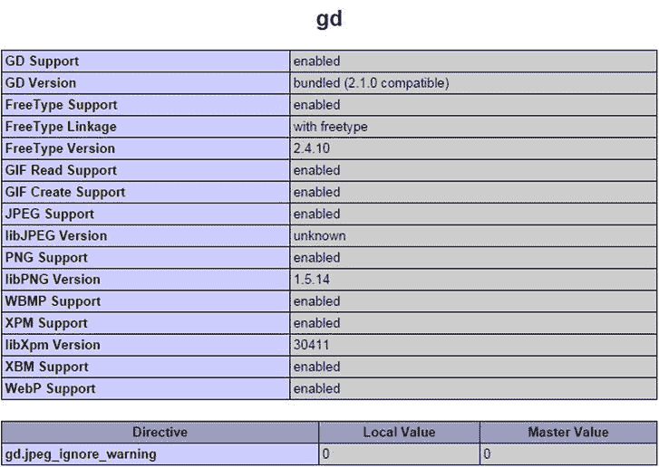

# 8. 生成缩略图

PHP 拥有大量用于处理图像的函数。你已在第 4 章中认识了其中一个函数——`getimagesize()`。除了提供图像尺寸的有用信息外，PHP 还能通过调整大小或旋转来操作图像。它还能在不影响原图的情况下动态添加文本，甚至可以即时创建图像。

为了让你初步体验 PHP 的图像处理功能，我将向你展示如何生成已上传图像的较小副本。大多数情况下，你会想使用像 Adobe Photoshop 这样的专用图形程序来生成缩略图，因为它能提供更好的质量控制。但如果你想允许注册用户上传图像，同时确保它们符合最大尺寸限制，使用 PHP 自动生成缩略图就会非常有用。你可以只保存调整大小后的副本，也可以同时保存副本和原图。

在第 6 章中，你构建了一个处理文件上传的 PHP 类。本章中，你将创建两个类：一个用于生成缩略图，另一个用于在单次操作中上传和调整图像大小。第二个类并非从头构建，而是基于第 6 章的 `Upload` 类。使用类的一大优势是它们具有可扩展性——基于另一个类的类可以继承其父类的功能。构建用于上传图像并从中生成缩略图的类涉及大量代码。但一旦定义了这些类，使用它们只需几行脚本。如果你很赶时间，或者写大量代码会让你冷汗直流，可以直接使用完成后的类。稍后再回来了解代码的工作原理。它使用了许多在其他情况下也很有用的基本 PHP 函数。

在本章中，你将了解以下内容：

*   缩放图像
*   保存缩放后的图像
*   自动调整大小并重命名上传的图像
*   通过扩展现有类来创建子类

## 检查服务器的能力

在 PHP 中处理图像依赖于 GD 扩展。最初，GD 代表 GIF Draw，但由于 GIF 专利的问题，对 GIF 文件的支持在 1999 年被取消，但 GD 这个名称保留了下来。有问题的专利于 2004 年到期，GIF 再次得到支持。第 2 章中推荐的一体化 PHP 包默认支持 GD，但你需要确保你的远程 Web 服务器上也已启用 GD 扩展。

与前几章一样，在你的网站上运行 `phpinfo()` 来检查服务器配置。向下滚动，直到到达以下屏幕截图所示的区域（它应该在页面中间位置）：



如果你找不到这个区域，说明 GD 扩展未启用，因此你将无法在你的网站上使用本章的任何脚本。请请求启用它，或更换到不同的主机。

> **注意**  
> 严格针对缩写/首字母缩略词爱好者：GIF 代表图形交换格式。JPEG 是联合图像专家小组创建的标准，而 PNG 是便携式网络图形的缩写。尽管 JPEG 是该标准的正确名称，但 “E” 经常被省略，尤其是在用作文件扩展名时。

## 动态操作图像

GD 扩展允许你完全从头生成图像或处理现有图像。无论哪种方式，底层过程总是遵循四个基本步骤：

1.  在处理图像时，在服务器内存中为图像创建一个资源。
2.  处理图像。
3.  显示和/或保存图像。
4.  从服务器内存中移除图像资源。

这个过程意味着你始终只在内存中操作图像，而不是在原图上操作。除非你在脚本终止前将图像保存到磁盘，否则任何更改都会丢失。处理图像需要大量内存，因此在不再需要时立即销毁图像资源至关重要。如果脚本运行非常缓慢或崩溃，很可能表明原始图像过大。

### 制作较小的图像副本

本章的目的是向你展示如何在上传时自动调整图像大小。这涉及到扩展第 6 章中的 `Upload` 类。然而，为了更容易理解如何使用 PHP 的图像处理函数，我建议先从使用服务器上已有的图像开始，然后创建一个单独的类来生成缩略图。

#### 准备工作

起点是以下简单的表单，它使用 PHP 解决方案 7-3 创建 `images` 文件夹中照片的下拉菜单。你可以在 `ch08` 文件夹的 `create_thumb_01.php` 中找到代码。将其复制到 `phpsols` 站点根目录的新文件夹 `gd` 中，并将其重命名为 `create_thumb.php`。

页面顶部是一个 PHP 代码块，它将 `phpsols` 站点中指向 `images` 文件夹的完整路径分配给名为 `$folder` 的变量（基于 Windows 系统上的 XAMPP）。下一行注释掉了 Mac OS X 上 MAMP 的默认位置。请根据你自己的设置进行相应调整。

页面主体中的表单如下所示：

```html
<form method="post" action="">
<p>
<select name="pix" id="pix">
<option value="">选择一张图像</option>
<?php
$files = new FilesystemIterator('../images');
$images = new RegexIterator($files, '/\.(?:jpg|png|gif)$/i');
foreach ($images as $image) {
$filename = $image->getFilename();
?>
<option value="<?= $folder . $filename; ?>"><?= $filename; ?></option>
<?php } ?>
</select>
</p>
<p>
<input type="submit" name="create" value="创建缩略图">
</p>
</form>
```

加载到浏览器后，下拉菜单应显示 `images` 文件夹中照片的名称。这可以让你更方便地快速选择图像进行测试。

在你于第 6 章创建的 `upload_test` 文件夹中，创建一个名为 `thumbs` 的新文件夹，并确保它具有 PHP 写入所需的权限。如果需要复习，请参考第 6 章中的“建立上传目录”。

#### 构建缩略图类

为了生成缩略图，该类需要执行以下步骤：

-   获取原始图像的尺寸。
-   获取图像的 MIME 类型。
-   计算缩放比例。
-   为原始图像创建正确 MIME 类型的图像资源。
-   为缩略图创建一个图像资源。
-   创建调整大小后的副本。
-   使用正确的 MIME 类型将调整大小后的副本保存到目标文件夹。
-   销毁图像资源以释放内存。

除了生成缩略图，该类会自动在文件扩展名之前插入 `_thb`，但一个公共方法允许你更改此值。该类还需要公共方法来设置目标文件夹和缩略图的最大尺寸，以及检索由该类生成的消息。为了简化计算，最大尺寸仅控制缩略图两个维度中较大的那个。

为了避免命名冲突，`Thumbnail` 类将使用命名空间。由于它专门用于图像，我们将在 `PhpSolutions` 文件夹中创建一个名为 `Image` 的新文件夹，并使用 `PhpSolutions\Image` 作为命名空间。

要做的事情很多，所以我将代码分成几个部分。它们都是同一个类定义的一部分，但以这种方式呈现脚本应该更易于理解，特别是如果你想在其他上下文中使用其中的某些代码。


