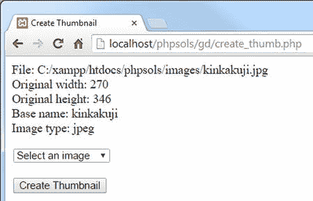
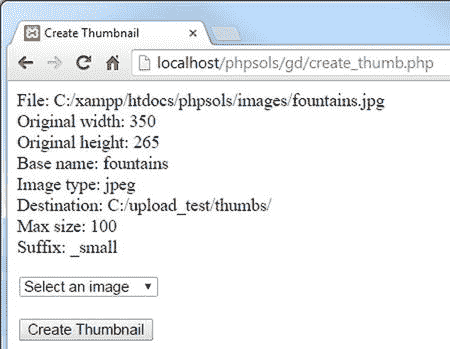

# PHP 解决方案 8-1：获取图像详情

本 PHP 解决方案介绍了如何获取原始图像的尺寸和 MIME 类型。

在 `PhpSolutions` 文件夹中创建一个名为 `Image` 的新文件夹。然后在该文件夹中创建一个名为 `Thumbnail.php` 的页面。该文件仅包含 PHP 代码，因此请删除编辑程序插入的任何 HTML 代码。在新文件顶部声明命名空间：

`namespace PhpSolutions\Image;`

该类需要跟踪相当多的属性。通过列出这些属性来开始类的定义，如下所示：

```
class Thumbnail {

    protected $original;
    protected $originalwidth;
    protected $originalheight;
    protected $basename;
    protected $thumbwidth;
    protected $thumbheight;
    protected $maxSize = 120;
    protected $canProcess = false;
    protected $imageType;
    protected $destination;
    protected $suffix = '_thb';
    protected $messages = [];

}
```

如同 `Upload` 类一样，所有属性都被声明为 `protected`，这意味着它们不能在类定义之外被意外更改。这些名称具有描述性，因此几乎不需要解释。`$maxSize` 属性被赋予了一个默认值 120（像素）。这决定了缩略图较长边的最大尺寸。

`$canProcess` 布尔值初始设置为 `false`。这是为了防止脚本尝试处理非图像文件。如果 MIME 类型与图像匹配，则该值将重置为 `true`。如果发生其他错误，您也可以使用它来阻止生成缩略图。

构造函数接受一个参数，即图像的路径。在受保护属性列表之后，但在闭合花括号内部，添加构造函数定义：

```
public function __construct($image) {
    if (is_file($image) && is_readable($image)) {
        $details = getimagesize($image);
    } else {
        $details = null;
        $this->messages[] = "Cannot open $image.";
    }

    // 如果 getimagesize() 返回一个数组，则看起来像一张图像
    if (is_array($details)) {
        $this->original = $image;
        $this->originalwidth = $details[0];
        $this->originalheight = $details[1];
        $this->basename = pathinfo($image, PATHINFO_FILENAME);
        // 检查 MIME 类型
        $this->checkType($details['mime']);
    } else {
        $this->messages[] = "$image doesn't appear to be an image.";
    }
}
```

构造函数以一个条件语句开始，该语句检查 `$image` 是否是一个文件并且是可读的。如果是，则将其传递给 `getimagesize()`，结果存储在 `$details` 中。否则，`$details` 被设置为 `null`，并向 `$messages` 属性添加一条错误消息。

当您将图像传递给 `getimagesize()` 时，它会返回一个包含以下元素的数组：

- `0`：宽度（以像素为单位）
- `1`：高度
- `2`：一个指示图像类型的整数
- `3`：一个字符串，包含正确的宽度和高度属性，用于插入 `` 标签
- `mime`：图像的 MIME 类型
- `channels`：对于 RGB 图像为 `3`，对于 CMYK 图像为 `4`
- `bits`：每种颜色的位数

如果传递给 `getimagesize()` 的参数值不是图像，则返回 `false`。因此，如果 `$details` 是一个数组，您就知道正在处理一张图像。图像的路径存储在 `$original` 属性中，其宽度和高度分别存储在 `$originalWidth` 和 `$originalHeight` 中。

文件的名称（不含扩展名）使用带有 `PATHINFO_FILENAME` 常量的 `pathinfo()` 提取，方式与 PHP 解决方案 6-6 相同。这存储在 `$basename` 属性中，并将在之后用于构建带有后缀的缩略图名称。

但是，图像可能不是合适的类型，因此最后的检查是将其 MIME 类型传递给一个名为 `checkType()` 的内部方法，您将在下一步中定义该方法。

`checkType()` 方法将 MIME 类型与可接受的图像类型数组进行比较。如果找到匹配项，则将 `$canProcess` 属性重置为 `true`，并将类型存储在 `$imageType` 属性中。该方法在内部使用，因此需要声明为 `protected`。将以下代码添加到类定义中：

```
protected function checkType($mime) {
    $mimetypes = ['image/jpeg', 'image/png', 'image/gif'];
    if (in_array($mime, $mimetypes)) {
        $this->canProcess = true;
        // 提取 'image/' 之后的字符
        $this->imageType = substr($mime, 6);
    }
}
```

图像类型有很多种，但只有 JPEG、PNG 和 GIF 是浏览器普遍支持的；只有当图像的 MIME 类型与 `$mimetypes` 数组中列出的其中之一匹配时，`$canProcess` 属性才会被设置为 `true`。如果 MIME 类型不在列表中，`$canProcess` 保持为 `false`，这稍后会阻止该类尝试创建缩略图。

所有图像的 MIME 类型都以 `image/` 开头。为了使该值在以后更容易使用，`substr()` 函数提取斜杠后的字符并将其存储在 `$imageType` 属性中。当使用两个参数时，`substr()` 从第二个参数指定的位置（从 0 开始计数）开始，并返回字符串的其余部分。

> **注意：** 尽管 PHP 5.5 及更高版本可以处理 WebP 图像，但鉴于浏览器支持有限，我决定不将其包含在 `Thumbnail` 类中。在撰写本文时，WebP 图像格式仅受 Google Chrome、Opera 和 Android 4 支持。

在构建类时测试代码是个好主意。尽早发现错误比在长脚本中寻找问题要容易得多。为了测试代码，在类定义内部创建一个名为 `test()` 的新公共方法。

方法在类定义中出现的顺序无关紧要，但常见的做法是将所有公共方法放在构造函数之后，并将受保护方法放在文件底部。这使代码更易于维护。

在构造函数和 `checkType()` 定义之间插入以下定义：

```
public function test() {
    echo 'File: ' . $this->original . '<br>';
    echo 'Original width: ' . $this->originalwidth . '<br>';
    echo 'Original height: ' . $this->originalheight . '<br>';
    echo 'Base name: ' . $this->basename . '<br>';
    echo 'Image type: ' . $this->imageType . '<br>';
    if ($this->messages) {
        print_r($this->messages);
    }
}
```

这使用 `echo` 和 `print_r()` 来显示属性的值。

为了测试目前为止的类定义，保存 `Thumbnail.php`，并在 `create_thumb.php` 中 `DOCTYPE` 声明上方的 PHP 代码块中添加以下代码（该代码可在 `ch08` 文件夹的 `create_thumb_02.php` 中找到）：

```
use PhpSolutions\Image\Thumbnail;

if (isset($_POST['create'])) {
    require_once('../PhpSolutions/Image/Thumbnail.php');
    try {
        $thumb = new Thumbnail($_POST['pix']);
        $thumb->test();
    } catch (Exception $e) {
        echo $e->getMessage();
    }
}
```

这从 `PhpSolutions\Image` 命名空间导入 `Thumbnail` 类，然后添加在表单提交时要执行的代码。

`create_thumb.php` 中提交按钮的 `name` 属性是 `create`，因此此代码仅在表单被提交时运行。它包含 `Thumbnail` 类定义，创建一个类的实例（将表单中选定的值作为参数传递），并调用 `test()` 方法。



**图 8-1.** 显示所选图像的详细信息，确认代码正在工作。

保存 `create_thumb.php` 并将其加载到浏览器中。选择一张图像，然后单击“创建缩略图”。这将产生类似于图 8-1 的输出。

如有必要，请对照 `ch08/PhpSolutions/Images` 文件夹中的 `Thumbnail_01.php` 检查您的代码。


虽然某些属性具有默认值，但您需要提供通过创建公共方法来更改它们的选项，以设置缩略图的最大尺寸以及应用于文件名基础的（文件名茎部）后缀。您还需要告诉类在哪里创建缩略图。这类方法的正式术语是“赋值方法”（mutator method），但由于它设置一个值，通常被称为“设置器方法”（setter method）。下一步就是创建这些设置器方法。

### PHP 解决方案 8-2：创建设置器方法

除了设置受保护属性的值之外，设置器方法在确保所赋值有效性方面也扮演着重要角色。继续使用同一个类定义。或者，使用`ch08/PhpSolutions/Image`文件夹中的`Thumbnail_01.php`。

首先，为将要创建缩略图的文件夹创建设置器方法。在构造函数定义之后，将以下代码添加到`Thumbnail.php`中：

```
public function setDestination($destination) {
    if (is_dir($destination) && is_writable($destination)) {
        // 获取最后一个字符
        $last = substr($destination, -1);
        // 如果缺少尾部斜杠，则添加一个
        if ($last == '/' || $last == '\\') {
            $this->destination = $destination;
        } else {
            $this->destination = $destination . DIRECTORY_SEPARATOR;
        }
    } else {
        $this->messages[] = "Cannot write to $destination.";
    }
}
```

这段代码首先检查`$destination`是否是一个文件夹（目录）并且是否可写。如果不是，则方法定义末尾的`else`子句中的错误消息会被添加到`$messages`属性中。否则，执行其余代码。

在将`$destination`的值赋给`$destination`属性之前，代码检查提交的值是否以正斜杠或反斜杠结尾。它通过使用`substr()`函数提取`$destination`中的最后一个字符来实现这一点。`substr()`的第二个参数决定开始提取的位置。负数表示从字符串末尾开始计数。如果省略第三个参数，函数将返回字符串的剩余部分。所以，`$last = substr($destination, -1)` 的效果是提取最后一个字符并将其存储在`$last`中。

条件语句检查`$last`是否是正斜杠或反斜杠。需要两个反斜杠，因为 PHP 使用反斜杠来转义引号（参见第 3 章中的“理解何时使用引号”和“使用转义序列”）。

有必要检查`$destination`中是正斜杠还是反斜杠，因为 Windows 用户可能会习惯性地使用反斜杠。如果条件语句确认最后一个字符是正斜杠或反斜杠，则将`$destination`赋给`$destination`属性。否则，`else`块在将 PHP 常量`DIRECTORY_SEPARATOR`赋给`$destination`属性之前，将其连接到`$destination`的末尾。`DIRECTORY_SEPARATOR`常量会根据操作系统自动选择正确的斜杠类型。

> 提示：PHP 在路径中同样对待正斜杠或反斜杠。即使这导致添加了相反类型的斜杠，就 PHP 而言，路径仍然是有效的。

用于缩略图最大尺寸的设置器方法只需要检查该值是否为数字。将以下代码添加到类定义中：

```
public function setMaxSize($size) {
    if (is_numeric($size)) {
        $this->maxSize = abs($size);
    }
}
```

`is_numeric()`函数检查提交的值是否为数字。如果是，则将其赋给`$maxSize`属性。作为预防措施，该值被传递给`abs()`函数，该函数将数字转换为其绝对值。换句话说，负数被转换为正数。

如果提交的值不是数字，则什么也不会发生。该属性的默认值保持不变。

用于插入到文件名中的后缀的设置器函数需要确保该值不包含任何特殊字符。代码如下所示：

```
public function setSuffix($suffix) {
    if (preg_match('/^\w+$/', $suffix)) {
        if (strpos($suffix, '_') !== 0) {
            $this->suffix = '_' . $suffix;
        } else {
            $this->suffix = $suffix;
        }
    } else {
        $this->suffix = '';
    }
}
```

这使用了`preg_match()`，它以正则表达式作为第一个参数，并在作为第二个参数传递的值中搜索匹配项。正则表达式需要包裹在一对匹配的分隔符字符中——通常如这里所使用的正斜杠。去掉分隔符后，正则表达式看起来像这样：

`^\w+$`

在此上下文中，脱字符（`^`）告诉正则表达式从字符串的开头开始匹配。`\w`是一个正则表达式标记，它匹配任何字母数字字符或下划线。`+`表示匹配前面的标记或字符一次或多次，而`$`表示匹配字符串的结尾。换句话说，正则表达式匹配一个仅包含字母数字字符和下划线的字符串。如果字符串包含空格或特殊字符，则不会匹配。

如果匹配失败，方法定义末尾的`else`子句将`$suffix`属性设置为空字符串。否则，执行此条件语句：

`if (strpos($suffix, '_') !== 0) {`

如果`$suffix`的第一个字符不是下划线，则条件为真。它使用`strpos()`函数来查找第一个下划线的位置。如果第一个字符是下划线，则`strpos()`返回的值是`0`。但是，如果`$suffix`不包含下划线，`strpos()`返回`false`。如第 3 章所述，`0`在 PHP 中被视为`false`，因此条件需要使用“不完全相同”运算符（使用两个等号）。所以，如果后缀不是以下划线开头，则会添加一个下划线。否则，保留原始值。

> 注意：不要混淆`strpos()`和`strrpos()`。前者找到第一个匹配字符的位置。后者则反向搜索字符串。

更新`test()`方法以显示您刚刚为其创建设置器方法的那些属性的值。修订后的代码如下所示：

```
public function test() {
    echo 'File: ' . $this->original . '<br>';
    echo 'Original width: ' . $this->originalwidth . '<br>';
    echo 'Original height: ' . $this->originalheight . '<br>';
    echo 'Base name: ' . $this->basename . '<br>';
    echo 'Image type: ' . $this->imageType . '<br>';
    echo 'Destination: ' . $this->destination . '<br>';
    echo 'Max size: ' . $this->maxSize .  '<br>';
    echo 'Suffix: ' . $this->suffix .  '<br>';
    if ($this->messages) {
        print_r($this->messages);
    }
}
```

通过在`create_thumb.php`中使用新的设置器方法来测试更新后的类，如下所示：

```
$thumb = new Thumbnail($_POST['pix']);
$thumb->setDestination('C:/upload_test/thumbs/');
$thumb->setMaxSize(100);
$thumb->setSuffix('small');
$thumb->test();
```

将`upload_test/thumbs`的路径调整为与您的设置匹配。

尝试进行多项测试，例如省略传递给`setDestination()`的值的尾部斜杠，或选择一个不存在的文件夹。同时，将无效值传递给最大尺寸和后缀的设置器。无效的目标文件夹会产生错误消息，但其他错误会静默失败，使用默认值作为最大尺寸，或使用空字符串作为后缀。



图 8-2. 验证设置器方法是否有效

保存两个页面，并从`create_thumb.php`的列表中选择一张图片。您应该会看到类似于图 8-2 中的结果。

如有必要，请将您的代码与`ch08/PhpSolutions/Image`中的`Thumbnail_02.php`以及`ch08`文件夹中的`create_thumb_03.php`进行比较。


