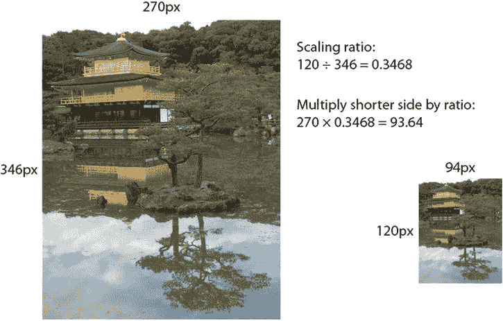
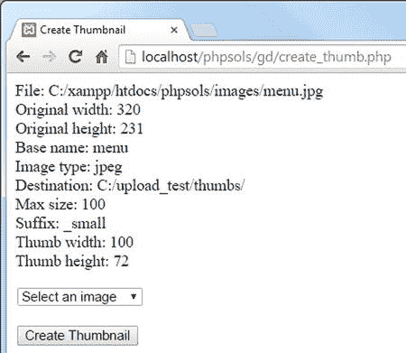
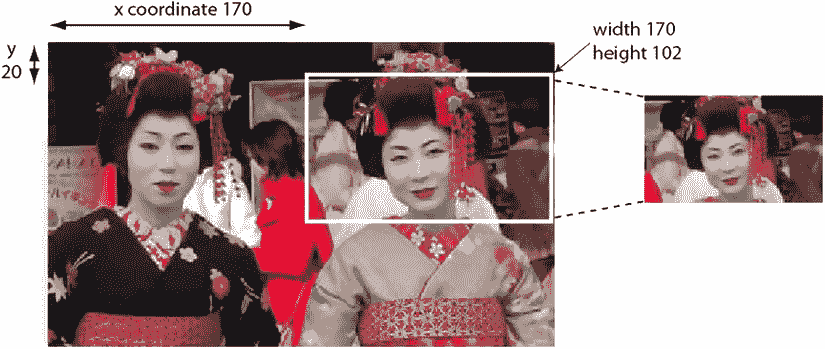
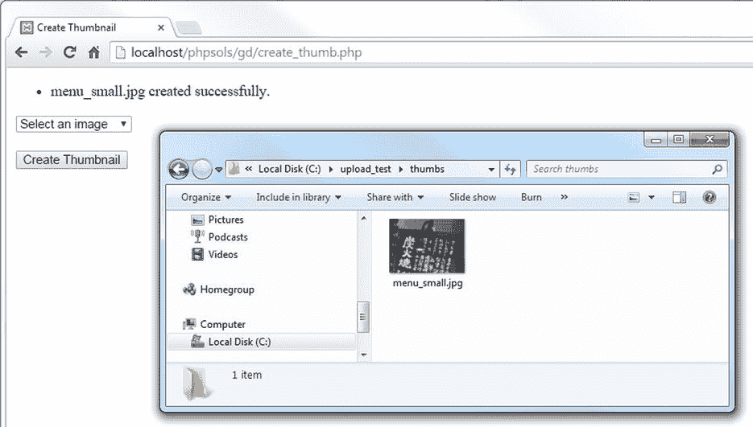
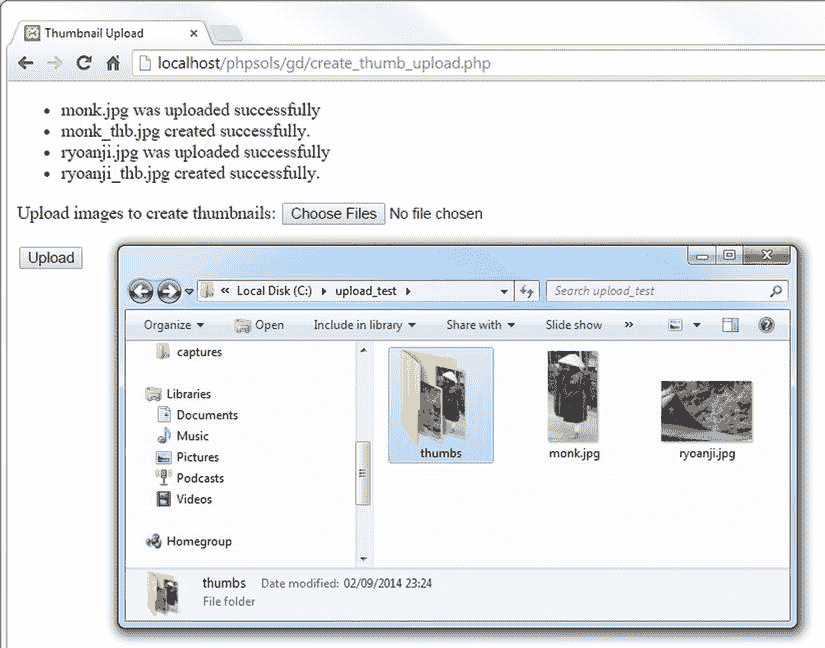

# 排版后的内容

你可能不同意我的决定：当作为参数传递的值无效时，静默失败。不过，现在你对条件语句应该有足够的经验，可以根据自己的需求调整代码。例如，如果你希望缩略图最大尺寸的设置方法返回错误消息而不是静默失败，请检查该值是否大于零，并添加一个`else`块来生成错误消息。`else`块还应该将`$canProcess`属性设置为`false`，以防止该类尝试创建缩略图图像。以下是调整`setMaxSize()`方法的方式：

```
public function setMaxSize($size) {
    if (is_numeric($size) && $size > 0) {
        $this->maxSize = $size;
    } else {
        $this->messages[] = 'The value for setMaxSize() must be a positive number.';
        $this->canProcess = false;
    }
}
```

## PHP 解决方法 8-3：计算缩略图的尺寸

这个 PHP 解决方法向`Thumbnail`类添加了一个受保护方法，用于计算缩略图的尺寸。`$maxSize`属性中设置的值决定了宽度或高度，具体取决于哪个更大。为了避免扭曲缩略图，你需要计算较短尺寸的缩放比例。该比例通过将最大缩略图尺寸除以原始图像的较大尺寸来计算。

例如，金阁寺（`kinkakuji.jpg`）的原始图像为 270 × 346 像素。如果最大尺寸设置为 120，将 120 除以 346 得到缩放比例 0.3468。将原始图像的宽度乘以这个比例，可将缩略图的宽度固定为 94 像素（向上取整到最接近的整数），从而保持正确的比例。下图 8-3 展示了缩放比例的工作方式。



**图 8-3.** 计算缩略图图像的缩放比例

继续使用你现有的类定义。或者，使用`ch08/PhpSolutions/Image`文件夹中的`Thumbnail_02.php`。

计算缩略图尺寸不需要任何额外的用户输入，因此可以通过一个受保护方法来处理。将以下代码添加到类定义中。将其放在文件末尾，就在闭合花括号内部。

```
protected function calculateSize($width, $height) {
    if ($width <= $this->maxSize && $height <= $this->maxSize) {
        $ratio = 1;
    } elseif ($width > $height) {
        $ratio = $this->maxSize/$width;
    } else {
        $ratio = $this->maxSize/$height;
    }
    $this->thumbwidth = round($width * $ratio);
    $this->thumbheight = round($height * $ratio);
}
```

原始图像的尺寸作为`Thumbnail`对象的属性存储，因此你可以直接引用它们为`$this->originalWidth`和`$this->originalHeight`。然而，该方法需要经常引用这些值，所以我决定将它们作为参数传递，以使代码更易于阅读和输入。

条件语句首先检查原始图像的宽度和高度是否小于或等于最大尺寸。如果是，则图像无需调整大小，因此缩放比例设置为 1。

`elseif`块检查宽度是否大于高度。如果是，则使用宽度来计算缩放比例。如果高度更大或两边相等，则调用`else`块。在这两种情况下，都使用高度来计算缩放比例。

最后两行将原始宽度和高度乘以缩放比例，并将结果赋值给`$thumbwidth`和`$thumbheight`属性。计算过程被包裹在`round()`函数中，该函数将结果四舍五入到最接近的整数。

此方法需要由创建缩略图图像的方法调用。将以下公共方法添加到受保护方法上方的类定义中：

```
public function create() {
    if ($this->canProcess && $this->originalwidth != 0) {
        $this->calculateSize($this->originalwidth, $this->originalheight);
    } elseif ($this->originalwidth == 0) {
        $this->messages[] = 'Cannot determine size of ' . $this->original;
    }
}
```

这会检查`$canProcess`是否为`true`，并且原始图像的宽度是否为 0。第二个测试是必要的，因为如果`getimagesize()`无法确定尺寸，它会将宽度和高度设置为 0。这通常发生在图像格式包含多个图像时。如果`$originalwidth`属性为 0，会向`$messages`数组中添加一条错误消息。

要测试新方法，请像这样修改`test()`方法：

```
public function test() {
    echo 'File: ' . $this->original . '<br>';
    echo 'Original width: ' . $this->originalwidth . '<br>';
    echo 'Original height: ' . $this->originalheight . '<br>';
    echo 'Base name: ' . $this->basename . '<br>';
    echo 'Image type: ' . $this->imageType . '<br>';
    echo 'Destination: ' . $this->destination . '<br>';
    echo 'Max size: ' . $this->maxSize .  '<br>';
    echo 'Suffix: ' . $this->suffix .  '<br>';
    echo 'Thumb width: ' . $this->thumbwidth . '<br>';
    echo 'Thumb height: ' . $this->thumbheight . '<br>';
    if ($this->messages) {
        print_r($this->messages);
    }
}
```

更新`create_thumb.php`中的代码以调用`create()`方法。它必须在`test()`方法之前调用。否则，缩略图的宽度和高度将不会被计算。修改后的代码如下所示：

```
$thumb = new Thumbnail($_POST['pix']);
$thumb->setDestination('C:/upload_test/thumbs/');
$thumb->setMaxSize(100);
$thumb->setSuffix('small');
$thumb->create();
$thumb->test();
```



**图 8-4.** 该类现在正在生成创建缩略图图像所需的所有值

通过在`create_thumb.php`中选择一张图像并点击“Create Thumbnail”来测试更新后的类。你应该会看到屏幕上显示这些值，如图 8-4 所示。

如有必要，请将你的代码与`ch08`文件夹中的`Thumbnail_03.php`进行对照检查。


### 使用 GD 函数创建图像的缩放副本

收集完所有必要信息后，您就可以从较大的图像中生成缩略图。这需要为原始图像和缩略图分别创建图像资源。对于原始图像，您需要使用与图像 MIME 类型匹配的函数。以下每个函数都接受一个参数：文件的路径。

- `imagecreatefromjpeg()`
- `imagecreatefrompng()`
- `imagecreatefromgif()`

由于缩略图尚不存在，您需要使用另一个函数 `imagecreatetruecolor()`，它接受两个参数——宽度和高度（以像素为单位）。

还有一个函数用于创建图像的缩放副本：`imagecopyresampled()`。它至少需要十个参数——且均为必填参数。这些参数分为五对，如下所示：

-   两个图像资源的引用——先副本，后原始
-   要放置复制图像左上角的 `x` 和 `y` 坐标
-   原始图像左上角的 `x` 和 `y` 坐标
-   副本的宽度和高度
-   要从原始图像复制区域的宽度和高度

图 8-5 展示了如何使用最后四对参数来提取特定区域，以下是对 `imagecopyresampled()` 的参数设置：

```
imagecopyresampled($thumb, $source, 0, 0, 170, 20, $thbwidth,$thbheight, 170, 102);
```



**图 8-5.** `imagecopyresampled()` 函数允许您复制图像的一部分

要复制区域的 `x` 和 `y` 坐标是从图像左上角以像素为单位测量的。x 轴和 y 轴从左上角的 0 开始，向右和向下递增。通过将要复制区域的宽度和高度分别设置为 170 和 102，PHP 提取出白色轮廓标出的区域。

现在您明白了网站是如何裁剪上传的图像的。它们使用 JavaScript 或其他技术动态计算坐标。对于 `Thumbnail` 类，您将使用原始图像的全部内容来生成缩略图。

使用 `imagecopyresampled()` 创建副本后，您需要保存它，再次使用特定于 MIME 类型的函数，即：

- `imagejpeg()`
- `imagepng()`
- `imagegif()`

每个函数都将图像资源和要保存的路径作为其前两个参数。

`imagejpeg()` 和 `imagepng()` 函数接受一个可选的第三个参数来设置图像质量。对于 `imagejpeg()`，您可以通过指定一个 0（最差）到 100（最佳）范围内的数字来设置质量。如果省略该参数，默认值为 75。对于 `imagepng()`，范围是 0 到 9。令人困惑的是，0 产生最佳质量（无压缩）。

最后，保存缩略图后，您需要通过将图像资源传递给 `imagedestroy()` 来销毁它们。尽管名称带有破坏性，但此函数对原始图像或缩略图没有影响。它仅通过销毁处理过程中所需的图像资源来释放服务器内存。

### PHP 解决方案 8-4：生成缩略图

此 PHP 解决方案通过创建图像资源、复制缩略图并将其保存到目标文件夹来完成 `Thumbnail` 类的编写。

继续处理您现有的类定义。或者，使用 `ch08/PhpSolutions/Image` 文件夹中的 `Thumbnail_03.php`。

原始图像的图像资源必须与其 MIME 类型对应，因此首先创建一个内部方法来选择正确的类型。将以下代码添加到类定义中。这是一个受保护的方法，因此将其放在页面底部（但在类的右花括号内）。

```
protected function createImageResource() {
    if ($this->imageType == 'jpeg') {
        return imagecreatefromjpeg($this->original);
    } elseif ($this->imageType == 'png') {
        return imagecreatefrompng($this->original);
    } elseif ($this->imageType == 'gif') {
        return imagecreatefromgif($this->original);
    }
}
```

您在 PHP 解决方案 8-1 中创建的 `checkType()` 方法将 MIME 类型存储为 `jpeg`、`png` 或 `gif`。因此，条件语句检查 MIME 类型，将其与相应的函数匹配，并传递原始图像作为参数。然后该方法返回生成的图像资源。

现在该定义执行所有实际工作的内部方法了。它包含大量代码，因此我将分部分进行说明。首先像这样定义 `createThumbnail()` 方法：

```
protected function createThumbnail() {
    $resource = $this->createImageResource();
    $thumb = imagecreatetruecolor($this->thumbwidth, $this->thumbheight);
}
```

这会调用您在步骤 1 中创建的 `createImageResource()` 方法，然后为缩略图创建一个图像资源，将缩略图的宽度和高度传递给 `imagecreatetruecolor()`。

创建缩略图的下一步涉及将两个图像资源传递给 `imagecopyresampled()` 并设置坐标和尺寸。像这样修改 `createThumbnail()` 方法：

```
protected function createThumbnail() {
    $resource = $this->createImageResource();
    $thumb = imagecreatetruecolor($this->thumbwidth, $this->thumbheight);
    imagecopyresampled($thumb, $resource, 0, 0, 0, 0, $this->thumbwidth,
        $this->thumbheight, $this->originalwidth, $this->originalheight);
}
```

前两个参数是您刚刚为缩略图和原始图像创建的图像资源。接下来的四个参数将副本和原始图像的 `x` 和 `y` 坐标都设置为左上角。接着是为缩略图计算出的宽度和高度，然后是原始图像的宽度和高度。将参数 3 到 6 设置为左上角，并将两组尺寸均设置为完整大小，这样会将整个原始图像复制到整个缩略图中。换句话说，它创建了一个原始图像的缩小版副本。

您不需要将 `imagecopyresampled()` 的结果赋给一个变量。缩放后的图像现在存储在 `$thumb` 中，但您仍需保存它。

像这样完成 `createThumbnail()` 的定义：

```
protected function createThumbnail() {
    $resource = $this->createImageResource();
    $thumb = imagecreatetruecolor($this->thumbwidth, $this->thumbheight);
    imagecopyresampled($thumb, $resource, 0, 0, 0, 0, $this->thumbwidth,
        $this->thumbheight, $this->originalwidth, $this->originalheight);
    $newname = $this->basename . $this->suffix;
    if ($this->imageType == 'jpeg') {
        $newname .= '.jpg';
        $success = imagejpeg($thumb, $this->destination . $newname, 100);
    } elseif ($this->imageType == 'png') {
        $newname .= '.png';
        $success = imagepng($thumb, $this->destination . $newname, 0);
    } elseif ($this->imageType == 'gif') {
        $newname .= '.gif';
        $success = imagegif($thumb, $this->destination . $newname);
    }
    if ($success) {
        $this->messages[] = "$newname 创建成功。";
    } else {
        $this->messages[] = "无法为 " .
            basename($this->original) . " 创建缩略图。";
    }
    imagedestroy($resource);
    imagedestroy($thumb);
}
```


新代码的第一行将后缀连接到已去除扩展名的文件名上。因此，如果原始文件名为 `menu.jpg` 且使用了默认的 `_thb` 后缀，那么 `$newname` 就变成了 `menu_thb`。

条件语句会检查图片的 MIME 类型，并追加对应的文件扩展名。对于 `menu.jpg` 这个例子，`$newname` 最终变成 `menu_thb.jpg`。然后，缩放后的图片被传递给相应的保存函数，并使用目标文件夹和 `$newname` 作为保存路径。对于 JPEG 和 PNG 图片，可选的质量参数被设置为最高级别：JPEG 为 100，PNG 为 0。

保存操作的结果存储在 `$success` 中。根据结果，`$success` 的值要么是 `true`，要么是 `false`，并且相应的消息会被添加到 `$messages` 属性中。这里使用 `basename()` 函数而不是 `$basename` 属性来创建消息，因为文件扩展名已从 `$basename` 属性中被剥离，而 `basename()` 函数会保留扩展名。

最后，`imagedestroy()` 通过销毁用于创建缩略图占用的资源来释放服务器内存。

更新 `create()` 方法的定义，使其调用 `createThumbnail()` 方法：

```
public function create() {
    if ($this->canProcess && $this->originalwidth != 0) {
        $this->calculateSize($this->originalwidth, $this->originalheight);
        $this->createThumbnail();
    } elseif ($this->originalwidth == 0) {
        $this->messages[] = 'Cannot determine size of ' . $this->original;
    }
}
```

你不再需要 `test()` 方法了。你可以将其从类定义中删除，或者将其注释掉。如果你打算进一步试验或增强这个类，将其注释掉可以省去从头开始重新创建的麻烦。到目前为止，你一直使用 `test()` 方法来显示错误消息。现在创建一个公共方法来获取这些消息：

```
public function getMessages() {
    return $this->messages;
}
```

保存 `Thumbnail.php`。在 `create_thumb.php` 中，将对 `test()` 方法的调用替换为对 `getMessages()` 的调用，并将结果赋值给一个变量，如下所示：

```
$thumb->create();
$messages = $thumb->getMessages();
```

在 `<body>` 开始标签之后立即添加一个 PHP 代码块，用于显示所有消息：

```
<?php
if (isset($messages) && !empty($messages)) {
    echo '<ul>';
    foreach ($messages as $message) {
        echo "<li>$message</li>";
    }
    echo '</ul>';
}
?>
```

你在之前的章节中见过这段代码，因此无需解释。

如果缩略图没有创建成功，由 `Thumbnail` 类生成的错误消息应该能帮助你定位问题来源。此外，请仔细将你的代码与 `ch08/PhpSolutions/Image` 文件夹中的 `Thumbnail_04.php` 进行核对。如果之前 PHP 解决方案中的测试都通过了，那么错误很可能出在 `create()`、`createImageResource()` 或 `createThumbnail()` 方法定义中。另一个需要检查的地方当然就是你的 PHP 配置。这个类依赖于 GD 扩展是否已启用。尽管 GD 得到广泛支持，但它并不总是默认开启的。



图 8-6.

缩略图已成功创建在目标文件夹中。保存 `create_thumb.php`，在浏览器中加载它，并从列表中选择一个图片，点击“Create Thumbnail”进行测试。如果一切顺利，你应该会看到一条报告缩略图创建成功的消息，并且你可以确认它在 `upload_test` 的 `thumbs` 子文件夹中存在，如图 8-6 所示。

## 上传时自动调整图片大小

既然你已经有了一个能从大图创建缩略图的类，那么相对简单地修改第 6 章 中的 `Upload` 类，使其能从上传的图片生成缩略图——实际上，不仅能从单个图片，还能从多个图片生成。

与其修改 `Upload` 类中的代码，更高效的方法是扩展该类并创建一个子类。这样，你可以选择使用原始类来执行任何类型文件的上传，或者使用子类在上传时创建缩略图。子类还需要提供在创建缩略图后保存或丢弃较大图片的选项。

在深入研究代码之前，让我们快速了解一下如何创建子类。

### 扩展类

使用类的一大优点是其可扩展性。要扩展一个类，你只需包含原始类的定义，并使用 `extends` 关键字定义子类，如下所示：

```
require_once 'OriginalClass.php';

class MyNewClass extends OriginalClass {
    // 子类定义
}
```

这会从原始父类 `OriginalClass` 创建一个名为 `MyNewClass` 的新子类。父子类比非常贴切，因为子类继承了父类的所有特性，但可以调整其中一些特性，并拥有自己的新特性。这意味着 `MyNewClass` 与 `OriginalClass` 共享相同的属性和方法，但你可以添加新的属性和方法。你还可以重新定义（或覆盖）父类的某些方法和属性。这简化了创建用于执行更专门化任务的类的过程。你在第 6 章 中创建的 `Upload` 类执行基本的文件上传。在本章中，你将对其进行扩展，创建一个名为 `ThumbnailUpload` 的子类，它使用其父类的基本上传功能，但增加了创建缩略图的专门功能。该子类将创建在 `PhpSolutions/Image` 文件夹中，因此它将使用 `PhpSolutions\Image` 作为其命名空间。

像所有孩子一样，子类经常需要向父类借用东西。当你重写子类中的方法但又需要使用原始版本时，这种情况经常发生。要引用父类版本，你需要在它前面加上 `parent` 关键字后跟两个冒号，如下所示：

```
parent::originalMethod();
```

你将在 PHP 解法 8-5 中看到这是如何工作的，因为子类定义了自己的构造函数以添加一个额外的参数，但同时还需要使用父类的构造函数。

> **注意**  
> 这里对继承的描述仅涵盖了理解 PHP 解法 8-5 所需的最低限度内容。要更深入地了解 PHP 类，请参阅我的 *PHP Object-Oriented Solutions*（friends of ED, 2008，ISBN: 978-1-4302-1011-5）。

让我们创建一个能够同时上传图片并生成缩略图的类。


好的，作为一名高级文档工程师和翻译员，我将严格遵循您的注意事项和示例格式，将给定的英文文本翻译成中文。


### PHP 方案 8-5：创建 `ThumbnailUpload` 类

该 PHP 方案扩展了 第 6 章 中的 `Upload` 类，并与 `Thumbnail` 类结合使用，以完成图片的上传和调整大小。它演示了如何创建子类并重写父类方法。要创建子类，你需要来自第 6 章的 `Upload.php` 和本章的 `Thumbnail.php`。这些文件的副本分别位于 `ch06/PhpSolutions/File` 和 `ch08/PhpSolutions/Image` 文件夹中。

在 `PhpSolutions/Image` 文件夹中创建一个名为 `ThumbnailUpload.php` 的新文件。它只包含 PHP 代码，因此请删除脚本编辑器插入的任何 HTML，并添加以下代码：

```
<?php

namespace PhpSolutions\Image;

use PhpSolutions\File\Upload;

require_once __DIR__ . '/../File/Upload.php';
require_once 'Thumbnail.php';

class ThumbnailUpload extends Upload {

}
```

这声明了 `PhpSolutions\Image` 命名空间，并在包含 `Upload` 和 `Thumbnail` 类的定义之前，导入了来自 `PhpSolutions\File` 命名空间的 `Upload` 类。

> **注意**  
> 在包含文件中使用时，`__DIR__` 返回被包含文件的目录，不包含尾部斜杠。在 `Upload.php` 相对路径的开头添加斜杠，允许 PHP 构建完整路径，向上返回一级以在 `PhpSolutions/File` 文件夹中找到它。`Thumbnail.php` 与 `ThumbnailUpload.php` 位于同一文件夹，因此仅使用文件名即可包含。请参阅第 4 章中的“嵌套包含文件”。

然后，`ThumbnailUpload` 类声明它扩展了 `Upload`。尽管 `Upload` 位于不同的命名空间，但因为它已被导入，你可以直接将其称为 `Upload`。所有后续代码都需要插入到类定义的花括号之间。

子类需要三个属性：保存缩略图的文件夹、决定是否删除原始图片的布尔值，以及要添加到缩略图的后缀。如果不想使用 `Thumbnail` 中定义的默认后缀，则需要最后一个属性。在花括号内添加以下属性定义：

```
protected $thumbDestination;
protected $deleteOriginal;
protected $suffix = '_thb';
```

当你扩展一个类时，唯一需要定义构造函数方法的情况是，当你想改变其工作方式时。`ThumbnailUpload` 类接受一个额外的参数，该参数决定是否删除原始图片，让你可以选择只保留缩略图，或保留两个版本的图片。在本地测试时，`Thumbnail` 对象可以访问你本地硬盘上的原始图片。但是，生成缩略图是服务器端操作，因此，如果不先将原始图片上传到服务器，它就无法在网站上工作。

构造函数还需要调用父构造函数来定义上传文件夹的路径。将以下定义添加到类中：

```
public function __construct($path, $deleteOriginal = false) {
    parent::__construct($path);
    $this->thumbDestination = $path;
    $this->deleteOriginal = $deleteOriginal;
}
```

构造函数接受两个参数：上传文件夹的路径和一个决定是否删除原始图片的布尔变量。第二个参数在构造函数签名中设置为 `false`，使其成为可选参数。

> **注意**  
> 定义函数或类方法时，传递给该函数（方法）的参数（严格来说是形参）被称为其签名。

构造函数内部的第一行代码将 `$path` 传递给父构造函数，以设置文件上传的目标文件夹。第二行代码也将 `$path` 赋值给 `$thumbDestination` 属性，使得同一文件夹成为两个图片的默认文件夹。

最后一行代码将第二个参数的值赋给 `$deleteOriginal` 属性。由于第二个参数是可选的，它会被自动设置为 `false`，除非你明确将其设置为 `true`，否则两个图片都会被保留。

像这样创建缩略图目标文件夹的设置方法：

```
public function setThumbDestination($path) {
    if (!is_dir($path) || !is_writable($path)) {
        throw new \Exception("$path 必须是有效且可写的目录。");
    }
    $this->thumbDestination = $path;
}
```

此方法将路径作为其唯一参数，检查它是否是一个文件夹（目录）且可写，并将该值赋给 `$thumbDestination` 属性。如果作为参数传递的值无效，该类将抛出异常。`Exception` 前面有一个反斜杠，表示你正在使用核心的 `Exception` 类，而不是此命名空间特定的类。

> **技巧**  
> 除了为缩略图目标文件夹创建设置方法，我本可以向构造函数添加一个额外的参数。但是，当你想将缩略图和原始图片保存在同一文件夹时，我的选择简化了构造函数。另外，如果缩略图目标有问题，我本可以静默地使用原始上传文件夹，而不是抛出异常。我认为目标文件夹的问题过于严重，不容忽视。此类决策是编写任何脚本（不仅仅是设计类）不可或缺的一部分。

除了名称之外，缩略图后缀的设置方法与 `Thumbnail.php` 中的设置方法相同。它看起来像这样：

```
public function setThumbSuffix($suffix) {
    if (preg_match('/\w+/', $suffix)) {
        if (strpos($suffix, '_') !== 0) {
            $this->suffix = '_' . $suffix;
        } else {
            $this->suffix = $suffix;
        }
    } else {
        $this->suffix = '';
    }
}
```

你需要在此处定义该方法，因为该类继承自 `Upload`，而不是 `Thumbnail`。一个 PHP 类只能有一个父类。

> **注意**  
> 为了解决单继承的问题，PHP 5.4 引入了一个名为 trait 的特性。Trait 定义了旨在被多个类使用的方法。Trait 的结构与类相同，只是它使用关键字 `trait` 而不是 `class` 来声明。你可以使用 `use` 关键字将 trait 导入到类定义中。我决定不将 `setThumbSuffix()` 移到 trait 中，因为它非常简短，并且仅被两个类使用。要了解更多关于 trait 的信息，请参阅 [`php.net/manual/en/language.oop5.traits.php`](http://php.net/manual/en/language.oop5.traits.php)。

父类 `Upload` 有一个 `allowAllTypes()` 方法，该方法移除了对可上传文件 MIME 类型的限制。`ThumbnailUpload` 类仅用于图片类型。为了防止这个继承的方法允许上传其他类型的文件，添加以下代码来覆盖它：

```
public function allowAllTypes() {
    $this->typeCheckingOn = true;
}
```

与父方法不同，此方法将 `$typeCheckingOn` 属性设置为 `true`，强制执行 MIME 类型检查。换句话说，在 `ThumbnailUpload` 对象上调用 `allowAllTypes()` 将不会产生任何效果。

接下来，使用以下代码创建一个受保护的方法来生成缩略图：

```
protected function createThumbnail($image) {
    $thumb = new Thumbnail($image);
    $thumb->setDestination($this->thumbDestination);
    $thumb->setSuffix($this->suffix);
    $thumb->create();
    $messages = $thumb->getMessages();
    $this->messages = array_merge($this->messages, $messages);
}
```

此方法接受一个参数，即图片的路径，并创建一个 `Thumbnail` 对象。该代码与 `create_thumb.php` 类似，因此无需解释。

最后一行使用 `array_merge()` 将 `Thumbnail` 对象生成的任何消息与 `ThumbnailUpload` 类的 `$messages` 属性合并。尽管你在步骤 2 中定义的属性不包含 `$messages` 属性，但子类会自动从其父类继承它。


## 使用 `ThumbnailUpload` 类

在父类中，`moveFile()` 方法会将上传的文件保存到目标位置。缩略图需要从原始图像生成，因此你需要重写父类的 `moveFile()` 方法，并用它来调用你刚刚定义的 `createThumbnail()` 方法。从 `Upload.php` 复制 `moveFile()` 方法，并通过添加以下加粗显示的代码进行修改。

```
protected function moveFile($file) {

    $filename = isset($this->newName) ? $this->newName : $file['name'];

    $success = move_uploaded_file($file['tmp_name'],

    $this->destination . $filename);

    if ($success) {

        // 仅在原始图像未被删除时添加消息

        if (!$this->deleteOriginal) {

            $result = $file['name'] . ' 上传成功';

            if (!is_null($this->newName)) {

                $result .= '，并已重命名为 ' . $this->newName;

            }

            $this->messages[] = $result;

        }

        // 从上传的图像创建缩略图

        $this->createThumbnail($this->destination . $filename);

        // 如果需要，删除上传的原始图像

        if ($this->deleteOriginal) {

            unlink($this->destination . $filename);

        }

    } else {

        $this->messages[] = '无法上传 ' . $file['name'];

    }

}
```

如果原始图像上传成功，新添加的代码会包含一个条件语句，使得仅在 `$deleteOriginal` 为 `false` 时生成消息。接着，它调用 `createThumbnail()` 方法，并将上传的图像作为参数传入。最后，如果 `$deleteOriginal` 已被设置为 `true`，它会使用 `unlink()` 删除上传的原始图像，只保留缩略图。

保存 `ThumbnailUpload.php`。为了测试它，将 `ch08` 文件夹中的 `create_thumb_upload_01.php` 复制到 `gd` 文件夹，并另存为 `create_thumb_upload.php`。该文件包含一个简单的表单，其中有一个文件字段和一个用于显示消息的 PHP 代码块。在 `DOCTYPE` 声明之前添加以下 PHP 代码块：

```
<?php

use PhpSolutions\Image\ThumbnailUpload;

if (isset($_POST['upload'])) {

    require_once('../PhpSolutions/Image/ThumbnailUpload.php');

    try {

        $loader = new ThumbnailUpload('C:/upload_test/');

        $loader->setThumbDestination('C:/upload_test/thumbs/');

        $loader->upload();

        $messages = $loader->getMessages();

    } catch (Exception $e) {

        echo $e->getMessage();

    }

}

?>
```

如有必要，调整构造函数和 `setThumbDestination()` 方法中的路径。

通过再次上传相同的图像来测试 `ThumbnailUpload` 类。这次，原始图像和缩略图应当像第 6 章中那样，通过在文件扩展名前添加数字的方式进行重命名。尝试不同的测试：更改插入到缩略图名称中的后缀，或者在创建缩略图后删除原始图像。如果遇到问题，请将你的代码与 `ch08/PhpSolutions/Image` 文件夹中的 `ThumbnailUpload.php` 进行核对。



图 8-7. 缩略图在上传图像的同时被创建

保存 `create_thumb_upload.php` 并在浏览器中加载它。单击“浏览”或“选择文件”按钮，然后选择多张图像。当你单击“上传”按钮时，应该会看到提示上传成功并创建缩略图的消息。如图 8-7 所示，检查目标文件夹。

**提示**：在不支持表单字段 `multiple` 属性的旧版浏览器中，该类会上传单张图像并为其创建缩略图。为了支持旧版浏览器的多文件上传，请在表单中创建多个文件字段，并为它们设置相同的 `name` 属性，后跟一对空的方括号，如下所示：`name="image[]"`。

## 使用 `ThumbnailUpload` 类

`ThumbnailUpload` 类很容易使用。由于它使用了命名空间，你需要在文件的顶层导入该类，如下所示：

`use PhpSolutions\Image\ThumbnailUpload;`

然后包含类定义，并将上传文件夹的路径传递给类的构造函数方法：

`$loader = new ThumbnailUpload('C:/upload_test/');`

如果你想在创建缩略图后删除原始图像，请将 `true` 作为第二个参数传递给构造函数，如下所示：

`$loader = new ThumbnailUpload('C:/upload_test/', true);`

该类具有以下公有方法：

- `setThumbDestination()`：设置用于保存缩略图的目标文件夹路径。如果不调用此方法，缩略图将存储在原始图像所在的同一文件夹中。
- `setThumbSuffix()`：使用此方法更改插入到缩略图名称中的后缀。默认值为 `_thb`。
- `upload()`：上传原始图像并生成缩略图。默认情况下，与现有图像同名的图像会被重命名。若要覆盖现有图像，请将 `false` 作为参数传递给此方法。
- 该类还继承自父类 `Upload` 的以下方法：
- `getMessages()`：检索上传和缩略图生成过程中产生的消息。
- `getMaxSize()`：获取单张图像的最大上传大小。默认值为 50 KB。
- `setMaxSize()`：更改最大上传大小。参数应以允许的字节数表示。

因为 `ThumbnailUpload` 类依赖于 `Upload` 和 `Thumbnail` 类，所以在实际网站上使用此类时，你需要将这三个类定义文件上传到你的远程 Web 服务器。

### 本章回顾

这又是一个内容密集的章节，不仅展示了如何从较大的图像生成缩略图，还向你介绍了如何扩展现有类以及重写继承的方法。设计和扩展类起初可能会让人感到困惑，但如果你专注于每个方法的作用，事情就会变得不那么令人望而生畏。类设计的一个关键原则是将大型任务分解为小的、可管理的单元。理想情况下，一个方法应执行单一任务，例如为原始图像创建图像资源。

使用类的真正优势在于，一旦你定义了它们，就能节省大量时间和精力。每次你想向网站添加文件或缩略图上传功能时，无需输入数十行代码，调用该类只需几行简单的代码。此外，不要认为本章的代码仅限于创建和上传缩略图。类文件中的许多子程序都可以经过调整用于其他场景。

在下一章中，你将全面了解 PHP 会话。它能保留与特定用户相关的信息，并在密码保护网页方面起着至关重要的作用。


