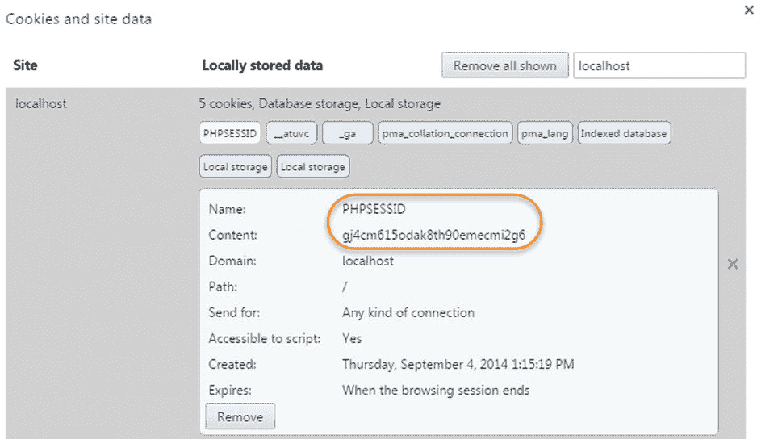
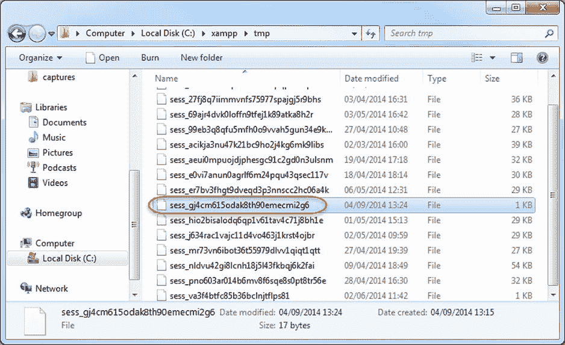
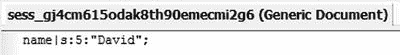
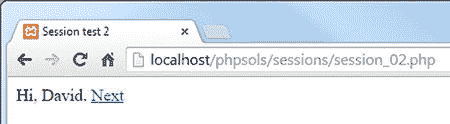
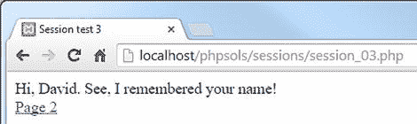
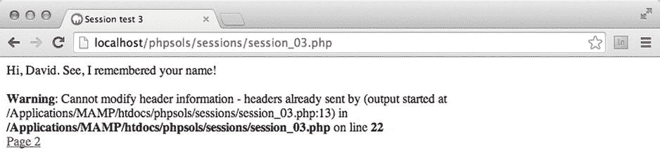
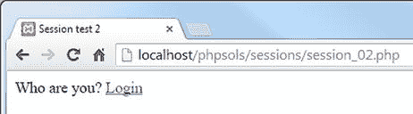
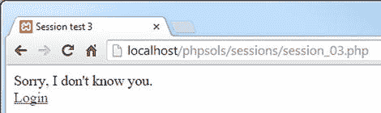

# 9. 具备记忆功能的页面：简易登录与多页表单

网络世界是一场精妙的幻象。当你访问一个设计精良的网站时，会体验到一种强烈的连贯性，仿佛在翻阅一本书或一本杂志。所有元素都完美融合，成为一个协调的整体。而现实情况则大相径庭。网页的每个部分都由网络服务器分别存储和处理。除了需要知道将相关文件发送到哪里之外，服务器对你的身份毫无兴趣。每次 PHP 脚本运行时，变量只存在于服务器的内存中，并且通常在脚本执行完毕后就被丢弃。即便是 `$_POST` 和 `$_GET` 数组中的变量，其寿命也极其短暂。它们的值只被传递给下一个脚本一次，之后便从内存中移除——除非你对其进行某些操作，比如将信息存储在一个隐藏的表单字段中。即便如此，也只有在表单被提交时，这些信息才会持续存在。

为了解决这些问题，PHP 采用了会话（Sessions）机制。在简要介绍会话的工作原理之后，我将向你展示如何使用会话变量来创建一个简单的基于文件的登录系统，并在无需使用隐藏表单字段的情况下，将信息从一个页面传递到另一个页面。

在本章中，你将学习以下内容：

-   理解什么是会话以及如何创建它们
-   创建一个基于文件的登录系统
-   使用自定义类检查密码强度
-   为会话设置时间限制
-   使用会话在多页面间追踪信息

## 什么是会话及其工作原理

会话通过在 Web 服务器上以及访问者计算机的 Cookie 中存储一个随机标识符（即会话 ID）来确保连续性。Web 服务器利用这个 Cookie 来识别正在与同一个人（更准确地说，是同一台计算机）通信。图 9-1 至 9-3 展示了在我的本地测试环境中创建的一个简单会话的详细信息。



*图 9-1. PHP 会话将唯一标识符作为 Cookie 存储在浏览器中*

如图 9-1 所示，存储在浏览器中的 Cookie 被称为 `PHPSESSID`，其内容是一串杂乱的字母和数字。这个随机字符串就是会话的 ID。

在 Web 服务器上，会创建一个匹配的文件，文件名中包含同样杂乱的字母和数字，如图 9-2 所示。



*图 9-2. Cookie 的内容标识了存储在 Web 服务器上的会话数据*

当一个会话被启动时，服务器会将信息存储在会话变量中。只要会话保持活动状态（通常直到浏览器关闭），这些变量就可以被其他页面访问。由于每个访问者的会话 ID 都是唯一的，因此存储在会话变量中的信息不会被其他人看到。这意味着会话非常适合用于用户身份验证，尽管它们也可以用于任何你希望在从一页转到下一页时为同一用户保留信息的场景，例如多页表单或购物车。

存储在用户计算机上的唯一信息是包含会话 ID 的 Cookie，而这个 ID 本身毫无意义。这意味着，仅通过检查此 Cookie 的内容，私有信息是不会暴露的。

会话变量及其值存储在 Web 服务器上。图 9-3 显示了一个简单会话文件的内容。如你所见，它是纯文本格式，内容也不难解读。图中所示的会话只有一个变量：`name`。变量名后面跟着一个竖线，然后是字母“s”、冒号、一个数字、另一个冒号，以及用引号括起来的变量值。“s”代表字符串，数字表示该字符串包含的字符数。因此，这个会话变量包含我的名字，作为一个长度为 5 个字符的字符串。



*图 9-3. 会话的详细信息以纯文本形式存储在服务器上*

这种设置有几个影响。包含会话 ID 的 Cookie 通常保持活动状态直到浏览器关闭。因此，如果多人共用同一台计算机，除非他们在交接给下一个人之前总是关闭浏览器（这是你无法控制的），否则他们都能访问彼此的会话。因此，提供一个注销机制来删除 Cookie 和会话变量，以保持你的网站安全，这一点非常重要。你还可以创建一个超时机制，在特定不活动时间后自动阻止任何人重新获得访问权限。

将会话变量以纯文本形式存储在 Web 服务器上，这本身并不值得担忧。只要服务器配置正确，会话文件就不能通过浏览器访问。不活动的文件也会被 PHP 定期删除（理论上的生存时间是 1,440 秒——24 分钟，但这并不能保证）。然而，显而易见的是，如果攻击者成功入侵了服务器或劫持了一个会话，这些信息就可能暴露。因此，尽管会话对于保护网站部分区域的密码或处理多页表单来说通常足够安全，但你绝不应将会话变量用于存储敏感信息，例如密码或信用卡详细信息。正如你将在本章后面的“使用会话限制访问”中看到的，虽然密码用于访问受保护站点，但密码本身是存储在单独的位置（最好是加密的），而不是作为会话变量。

会话默认是受支持的，因此你不需要任何特殊配置。但是，如果用户浏览器中禁用了 Cookie，会话将无法工作。可以配置 PHP 通过查询字符串发送会话 ID，但这被认为是一种安全风险。

### 创建 PHP 会话

只需将以下命令放在你希望用于会话的每个 PHP 页面中：

```
session_start();
```

这个命令在每个页面中只应调用一次，并且必须在 PHP 脚本生成任何输出之前调用，因此理想位置是紧跟在 PHP 开始标签之后。如果在调用 `session_start()` 之前生成了任何输出，该命令将失败，并且该页面的会话将不会被激活（稍后请参阅“‘Headers already sent’ 错误”一节以了解原因）。

### 创建和销毁会话变量

你可以通过将变量添加到 `$_SESSION` 超全局数组来创建会话变量，其方式与赋值普通变量相同。假设你想存储访问者的名字并显示问候语。如果名字在登录表单中作为 `$_POST['name']` 提交，你可以这样赋值：

```
$_SESSION['name'] = $_POST['name'];
```

现在，`$_SESSION['name']` 可以在任何以 `session_start()` 开头的页面中使用。由于会话变量存储在服务器上，一旦你的脚本或应用程序不再需要它们，就应该将其清除。像这样释放一个会话变量：

```
unset($_SESSION['name']);
```

要释放所有会话变量——例如，当你要注销某人时——将 `$_SESSION` 超全局数组设置为空数组，像这样：

```
$_SESSION = [];
```

> **警告**  
> 不要试图使用 `unset($_SESSION)`。它虽然能正常工作，但效果过强。它不仅会清除当前会话，还会阻止存储任何后续的会话变量。


### 销毁会话

仅仅取消设置所有会话变量能有效防止任何信息被重复使用，但你也应像这样使会话 Cookie 失效：

```
if (isset($_COOKIE[session_name()])) {
    setcookie(session_name(), '', time()-86400, '/');
}
```

这里使用函数 `session_name()` 动态获取会话名称，并将会话 Cookie 重置为空字符串，且将其过期时间设为 24 小时之前（86,400 是一天的秒数）。最后一个参数（`'/'`）将 Cookie 应用于整个域名。

最后，使用以下命令销毁会话：

```
session_destroy();
```

像这样销毁会话后，未经授权的人员便无法访问网站的限制区域或会话期间交换的任何信息。然而，访问者可能会忘记注销，因此无法始终保证 `session_destroy()` 命令会被触发，这就是为什么不在会话变量中存储敏感信息如此重要的原因。

**注意**

你可能会在旧脚本中见到 `session_register()` 和 `session_unregister()` 函数。这些函数已在 PHP 5.4 中被移除，不再可用。请改用 `$_SESSION['variable_name']` 和 `unset($_SESSION['variable_name'])`。

### 重新生成会话 ID

当用户状态发生改变时（例如登录后），建议作为安全措施重新生成会话 ID。这会更改标识会话的随机字母数字字符串，但会保留存储在会话变量中的所有信息。在《PHP Pro Security》第二版（Apress, 2010，ISBN 978-1-4302-3318-3）中，Chris Snyder 和 Michael Southwell 解释道：“生成新会话 ID 的目的是消除攻击者利用低级安全会话知识执行高级安全任务的可能性，无论这种可能性多么微小。”

要重新生成会话 ID，只需调用 `session_regenerate_id()`，然后将用户重定向到另一个页面或重新加载当前页面。

### “标头已发送”错误

虽然使用 PHP 会话非常简单，但有一个问题常让初学者头疼不已。你看到的不是一切按预期工作，而是以下消息：

```
Warning: Cannot add header information - headers already sent
```

我之前在讨论 `header()` 函数时已多次提及此问题。它同样会影响 `session_start()` 和 `setcookie()`。对于 `session_start()`，解决方案很简单：确保将其紧跟在 PHP 开始标签之后（或尽早放置），并检查开始标签前没有空白字符。

有时即使 PHP 标签前没有空白字符，问题仍会发生。这通常是由于编辑软件在脚本开头插入了字节顺序标记（BOM）。如果遇到这种情况，请打开脚本编辑器的偏好设置，禁用 PHP 页面中的 BOM 使用。

然而，当使用 `setcookie()` 销毁会话 Cookie 时，很可能需要在调用该函数之前向浏览器发送输出。在这种情况下，PHP 允许你使用 `ob_start()` 将输出保存在缓冲区中。然后在 `setcookie()` 完成其工作后，使用 `ob_end_flush()` 刷新缓冲区。你将在 PHP 解决方案 9-2 中了解如何实现。

## 使用会话限制访问

当考虑限制网站访问时，最先想到的词可能是“用户名”和“密码”。尽管这些通常是解锁网站入口的关键，但它们对会话来说并非必需。你可以将任何值存储为会话变量，并用它来决定是否允许访问某个页面。例如，你可以创建一个名为 `$_SESSION['status']` 的变量，根据其值赋予访问者网站不同区域的权限，如果未设置则该变量不赋予任何访问权限。

一个小演示应该能让一切清晰明了，并向你展示会话在实际中是如何运作的。


  
### PHP 解决方案 9-1：一个简单的会话示例

此示例只需几分钟即可构建完成，但你也可以在 `ch09` 文件夹中的 `session_01.php`、`session_02.php` 和 `session_03.php` 文件中找到完整代码。

在 `phpsols` 站点根目录下创建一个名为 `sessions` 的新文件夹，并在其中创建一个名为 `session_01.php` 的页面。插入一个包含名为 `name` 的文本字段和一个 `Submit` 按钮的表单。将 `method` 设置为 `post`，`action` 设置为 `session_02.php`。表单应如下所示：

```
<form method="post" action="session_02.php">

<p>

<label for="name">Name:</label>

<input type="text" name="name" id="name">

</p>

<p>

<input type="submit" name="Submit" value="Submit">

</p>

</form>
```

在另一个名为 `session_02.php` 的页面中，在 `DOCTYPE` 声明上方插入以下代码：

```
<?php

// 启动会话

session_start();

// 检查表单是否已提交且 name 不为空

if ($_POST && !empty($_POST['name'])) {

// 设置会话变量

$_SESSION['name'] = $_POST['name'];

}

?>
```

在 `session_02.php` 的 `<body>` 标签之间插入以下代码：

- 内联注释解释了代码的功能。会话启动后，只要 `$_POST['name']` 不为空，其值就会被赋给 `$_SESSION['name']`。

```
<?php

// 检查会话变量是否已设置

if (isset($_SESSION['name'])) {

// 如果已设置，则按名称问候

echo 'Hi, ' . $_SESSION['name'] . '. <a href="session_03.php">Next</a>';

} else {

// 如果未设置，则返回登录页面

echo 'Who are you? <a href="session_01.php">Login</a>';

}

?>
```

- 如果 `$_SESSION['name']` 已设置，则会显示一条欢迎消息以及一个指向 `session_03.php` 的链接。否则，页面会提示访客无法识别其身份，并提供返回第一个页面的链接。

**注意**

输入以下行时请务必小心：

`echo 'Hi, ' . $_SESSION['name'] . '. <a href="session03.php">Next</a>';`

前两个句点（围绕 `$_SESSION['name']` 的）是 PHP 的连接运算符。第三个句点（紧跟在单引号之后）是一个普通的句点，将作为字符串的一部分显示。

创建 `session_03.php`。在 `DOCTYPE` 上方输入以下代码以启动会话：

`<?php session_start(); ?>`

在 `session_03.php` 的 `<body>` 标签之间插入以下代码：

```
<?php

// 检查会话变量是否已设置

if (isset($_SESSION['name'])) {

// 如果已设置，则按名称问候

echo 'Hi, ' . $_SESSION['name'] . '. See, I remembered your name!<br>';

// 取消设置会话变量

unset($_SESSION['name']);

// 使会话 cookie 失效

if (isset($_COOKIE[session_name()])) {

setcookie(session_name(), '', time()-86400, '/');

}

// 结束会话

session_destroy();

echo '<a href="session_02.php">Page 2</a>';

} else {

// 如果无法识别，则显示相应信息

echo "Sorry, I don't know you.<br>";

echo '<a href="session_01.php">Login</a>';

}

?>
```

在浏览器中加载 `session_01.php`，在文本字段中输入你的姓名，然后点击 Submit。你应该会看到类似以下截图的内容。在此阶段，这里发生的情况与普通表单相比没有明显区别。

- 如果 `$_SESSION['name']` 已设置，页面会显示它，然后将其取消设置并使当前会话 cookie 失效。通过在第一个代码块末尾放置 `session_destroy()`，会话及其关联的变量将不再可用。



当你点击 Next 时，会话的强大功能开始显现。即使 `$_POST` 数组不再可用，页面仍能记住你的姓名。如果你使用 XAMPP 作为测试环境，你可能会看到类似以下截图的画面。



- 但是，在其他环境（例如 MAMP）中，你可能会收到类似这样的"headers already sent"警告消息：



**注意**

正如第 4 章中所解释的，XAMPP 不会产生关于标头的警告，因为它被配置为缓冲前 4 KB 的输出。然而，并非所有服务器都会缓冲输出，因此修复此问题非常重要。

点击 Page 2 的链接（如果你收到了错误消息，它就在消息下方）。会话已被销毁，因此这次 `session_02.php` 不知道你是谁。



在浏览器地址栏中输入 `session_03.php` 的地址并加载它。它同样不记得该会话，并显示一条适当的消息。



即使你在第 8 步中没有收到警告消息，当你将依赖会话的页面部署到其他服务器时，也需要防止它发生。错误消息不仅看起来不好，而且还意味着 `setcookie()` 无法使会话 cookie 失效。尽管 `session_start()` 紧跟在 `session_03.php` 中开头 PHP 标签之后，但警告消息是由在 `setcookie()` 之前输出的 `DOCTYPE` 声明、`<head>` 和其他 HTML 内容触发的。

### PHP 解决方案 9-2：使用 ob_start() 缓冲输出

虽然你可以将 `setcookie()` 放在 `DOCTYPE` 声明上方的 PHP 代码块中，但你还需要将 `$_SESSION['name']` 的值赋给一个普通变量，因为它在会话销毁后就不复存在了。与其完全拆解整个脚本，不如使用 `ob_start()` 来缓冲输出。

继续使用上一节中的 `session_03.php` 文件。

像这样修改 `DOCTYPE` 声明上方的 PHP 代码块：

```
<?php

session_start();

ob_start();

?>
```

在使会话 cookie 失效后立即刷新输出，如下所示：

- 这会开启输出缓冲，并阻止将输出发送到浏览器，直到脚本结束或你使用 `ob_end_flush()` 专门刷新输出。

```
// 使会话 cookie 失效

if (isset($_COOKIE[session_name()])) {

setcookie(session_name(), '', time()-86400, '/');

}

ob_end_flush();
```

保存 `session_03.php` 并再次测试整个流程。这次应该不会出现警告。更重要的是，会话 cookie 将不再有效。

### 使用基于文件的身份验证

正如你刚才所见，会话变量和条件语句的结合使用，让你能够根据会话变量是否已设置，向访问者呈现完全不同的页面。你只需要添加一个密码检查系统，就拥有了一个基本的用户身份验证系统。

在 PHP 解决方案 7-2 中，我向你展示了如何使用 `fopen()` 和 `fgetcsv()` 函数从 CSV 文件生成一个多维关联数组。现在，你可以改编该脚本，利用会话创建一个简单的登录系统。每个人的用户名和密码作为逗号分隔的值存储在 `users.csv` 文件中。文件的第一行包含用作每个子数组键的字段标题。文件内容如下所示：

```
name,password

david,codeslave

ben,bigboss
```

**注意**

以下 PHP 解决方案假设在 `private` 文件夹中有一个 `users.csv` 的副本，该文件夹是在第 7 章中设置的。如果你尚未设置供 PHP 读写文件的文件夹，请参阅第 7 章。如果你创建自己的 `users.csv` 版本，请注意用户名和密码之间的逗号后不应有空格。


