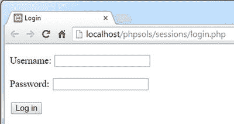
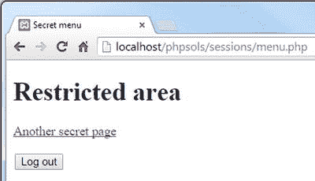
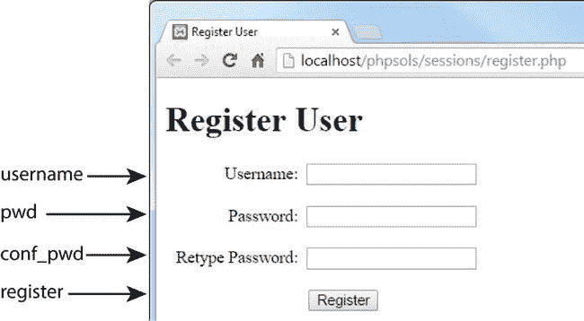

# PHP 方案 9-3：构建登录页面

该 PHP 方案展示了如何通过 `post` 方法提交用户名和密码，然后将提交的值与外部文本文件中存储的值进行核对。如果找到匹配项，脚本将设置一个会话变量，然后将用户重定向到另一个页面。

在 `sessions` 文件夹中创建一个名为 `login.php` 的文件，然后插入一个包含用户名和密码文本输入字段的表单，以及一个名为 `login` 的提交按钮，如下所示（或者，使用 `ch09` 文件夹中的 `login_01.php`）：

```html
<form method="post" action="">
  <p>
    <label for="username">用户名:</label>
    <input type="text" name="username" id="username">
  </p>
  <p>
    <label for="pwd">密码:</label>
    <input type="password" name="pwd" id="pwd">
  </p>
  <p>
    <input name="login" type="submit" value="登录">
  </p>
</form>
```

这是一个简单的表单，没什么特别的：



在 `DOCTYPE` 声明上方的 PHP 代码块中添加以下代码：

```php
$error = '';

if (isset($_POST['login'])) {
  session_start();
  $username = $_POST['username'];
  $password = $_POST['pwd'];

  // 存储用户名和密码的位置
  $userlist = 'C:/private/users.csv';

  // 登录成功后的重定向地址
  $redirect = 'http://localhost/phpsols/sessions/menu.php';

  require_once '../includes/authenticate.php';
}
```

-   这段代码将一个名为 `$error` 的变量初始化为空字符串。如果登录失败，将用它来显示错误消息，告知用户失败原因。

-   条件语句随后检查 `$_POST` 数组中是否包含名为 `login` 的元素。如果包含，表示表单已提交，花括号内的代码会启动一个 PHP 会话，并将通过 `$_POST` 数组传递的值存储在 `$username` 和 `$password` 中。然后创建 `$userlist`，用于定义包含注册用户名和密码的文件路径，以及 `$redirect`，即用户成功登录后将跳转到的页面 URL。

-   最后，条件语句内的代码引入了 `authenticate.php`，你接下来将创建这个文件。

> **注意：** 请调整 `$userlist` 的值，使其与你自己系统中的实际路径一致。

在 `includes` 文件夹中创建一个名为 `authenticate.php` 的文件。该文件只包含 PHP 代码，因此删除脚本编辑器插入的任何 HTML 内容，并插入以下代码：

```php
<?php
if (!file_exists($userlist) || !is_readable($userlist)) {
  $error = '登录功能不可用，请稍后再试。';
} else {
  $file = fopen($userlist, 'r');
  // 忽略 CSV 文件第一行中的标题
  $titles = fgetcsv($file);
  // 循环处理剩余行
  while (($data = fgetcsv($file)) !== false) {
    // 如果第一个元素为空则跳过
    if (is_null($data[0])) {
      continue;
    }
    // 如果用户名和密码匹配，则创建会话变量，
    // 重新生成会话 ID，并跳出循环
    if ($data[0] == $username && $data[1] == $password) {
      $_SESSION['authenticated'] = 'Jethro Tull';
      session_regenerate_id();
      break;
    }
  }
  fclose($file);
}
```

如果登录成功，`header()` 函数需要将用户重定向到 `$redirect` 中存储的 URL，然后退出脚本。否则，需要生成一条错误消息，告知用户登录失败。完整的脚本如下所示：

-   这段代码改编自 PHP 方案 7-2 中 `getcsv.php` 使用的代码。条件语句首先检查文件是否存在或是否可读。如果 `$userlist` 有问题，则立即生成错误消息。

-   否则，`else` 块中的主代码通过以只读模式打开文件，并使用 `fgetcsv()` 函数返回每一行数据的数组，来提取 CSV 文件的内容。在 PHP 方案 7-2 中，这些值被存储在一个包含每位注册用户名称和密码的多维数组中。这次则无需存储它们。我们只关心找到与 `$username` 和 `$password` 值匹配的用户名/密码对。

-   CSV 文件的第一行包含字段标题。脚本将其提取到一个名为 `$titles` 的变量中，但从未使用过。`while` 循环随后检查剩余行。每次循环运行时，它都会将当前行提取到一个名为 `$data` 的数组中。第一个元素包含用户名，第二个元素包含对应的密码。如果 `$data[0]` 为 `null`，则可能意味着当前行是空行，因此会跳过。

-   如果 `$data` 数组中的两个元素都与 `$username` 和 `$password` 匹配，脚本会创建一个名为 `$_SESSION['authenticated']` 的变量，并赋予它一个 1970 年代伟大民谣摇滚乐队的名字。这两者（除了杰思罗·塔尔的音乐）并无特殊含义；变量名和值是我随意选择的。关键的是创建了一个会话变量。一旦找到匹配项，会话 ID 会被重新生成，然后 `break` 退出循环。

```php
<?php
if (!file_exists($userlist) || !is_readable($userlist)) {
  $error = '登录功能不可用，请稍后再试。';
} else {
  $file = fopen($userlist, 'r');
  // 忽略 CSV 文件第一行中的标题
  $titles = fgetcsv($file);
  // 循环处理剩余行
  while (($data = fgetcsv($file)) !== false) {
    // 如果第一个元素为空则跳过
    if (is_null($data[0])) {
      continue;
    }
    // 如果用户名和密码匹配，则创建会话变量，
    // 重新生成会话 ID，并跳出循环
    if ($data[0] == $username && $data[1] == $password) {
      $_SESSION['authenticated'] = 'Jethro Tull';
      session_regenerate_id();
      break;
    }
  }
  fclose($file);

  // 如果会话变量已设置，则进行重定向
  if (isset($_SESSION['authenticated'])) {
    header("Location: $redirect");
    exit;
  } else {
    $error = '用户名或密码无效。';
  }
}
```

在 `login.php` 文件中，在 `<body>` 开始标签之后添加以下简短代码块，用于显示任何错误消息：

```php
<body>
<?php
if ($error) {
  echo "<p>$error</p>";
}
?>
<form method="post" action="">
```

完成后的代码位于 `ch09` 文件夹中的 `login_02.php`。在测试 `login.php` 之前，你需要创建 `menu.php` 并使用会话限制访问权限。

## PHP 方案 9-4：通过会话限制页面访问

本 PHP 方案演示了如何通过检查指示用户凭证已验证的会话变量是否存在，来限制对页面的访问。如果该变量未被设置，`header()` 函数会将用户重定向到登录页面。

在 `sessions` 文件夹中创建两个页面，分别命名为 `menu.php` 和 `secretpage.php`。只要它们相互链接，内容无所谓。或者，使用 `ch09` 文件夹中的 `menu_01.php` 和 `secretpage_01.php`。通过在 `DOCTYPE` 声明上方插入以下代码来保护每个页面的访问：

```php
<?php
session_start();
// 如果会话变量未设置，重定向到登录页面
if (!isset($_SESSION['authenticated'])) {
    header('Location: http://localhost/phpsols/sessions/login.php ');
    exit;
}
?>
```

- 启动会话后，脚本检查 `$_SESSION['authenticated']` 是否已设置。如果未设置，它会将用户重定向到 `login.php` 并退出。就是这么简单！脚本无需知道 `$_SESSION['authenticated']` 的值，尽管你可以通过将第 4 行修改如下来加倍确认：

```php
if (!isset($_SESSION['authenticated']) || $_SESSION['authenticated']
!= 'Jethro Tull' ) {
```

- 你可以对照 `ch09` 文件夹中的 `menu_02.php` 和 `secretpage_02.php` 检查代码。

保存 `menu.php` 和 `secretpage.php`，然后尝试在浏览器中加载它们中的任何一个。你应该总是被重定向到 `login.php`。在 `login.php` 中输入 `users.csv` 中的有效用户名和密码（值区分大小写），然后点击 `Log in`。你应该会立即被重定向到 `menu.php`，并且指向 `secretpage.php` 的链接也应该可以正常工作。

- 如果 `$_SESSION['authenticated']` 的值不正确，现在也会拒绝访客访问。

**提示**

如果在 Mac OS X 上创建自己的 `users.csv` 版本，登录可能会失败。如果发生这种情况，按照第 7 章中"在 Mac OS 上创建的 CSV 文件"所述，在 `authenticate.php` 顶部添加以下行：

`ini_set('auto_detect_line_endings', true);`

要保护网站上的任何页面，你只需将上述步骤 2 中的八行代码添加到 `DOCTYPE` 声明上方即可。

### PHP 方案 9-5：创建可重用的退出按钮

除了登录网站之外，用户还应该能够退出登录。本 PHP 方案演示了如何创建可插入到任何页面的退出按钮。

继续使用上一节中的文件进行操作。

在 `menu.php` 的 `<body>` 中插入以下表单，创建一个退出按钮：

```html
<form method="post" action="">
<input name="logout" type="submit" value="Log out">
</form>
```

- 页面应类似于以下截图：



现在需要添加点击退出按钮时运行的脚本。将 `DOCTYPE` 声明上方的代码修改如下（代码位于 `menu_02.php` 中）：

```php
<?php
session_start();
// 如果会话变量未设置，重定向到登录页面
if (!isset($_SESSION['authenticated'])) {
    header('Location: http://localhost/phpsols/sessions/login.php ');
    exit;
}
// 仅当退出按钮被点击时才运行此脚本
if (isset($_POST['logout'])) {
    // 清空 $_SESSION 数组
    $_SESSION = [];
    // 使会话 cookie 失效
    if (isset($_COOKIE[session_name()])) {
        setcookie(session_name(), '', time()-86400, '/');
    }
    // 结束会话并重定向
    session_destroy();
    header('Location: http://localhost/phpsols/sessions/login.php ');
    exit;
}
?>
```

保存 `menu.php` 并通过点击 `Log out` 进行测试。你应该会被重定向到 `login.php`。任何尝试返回 `menu.php` 或 `secretpage.php` 的操作都会将你带回 `login.php`。你可以将相同的代码放在每个受限页面中，但 PHP 的精髓在于节省工作，而不是增加工作量。因此将其转换为包含文件是合理的。在 `includes` 文件夹中创建一个名为 `logout.php` 的新文件。将步骤 1 和 2 中的新代码剪切并粘贴到新文件中，如下所示（位于 `ch09` 文件夹的 `logout.php` 中）：

- 此代码与本章前面"销毁会话"中的代码相同。唯一的区别是，它被包含在条件语句中，使其仅在点击退出按钮时运行，并且它使用 `header()` 将用户重定向到 `login.php`。

```php
<?php
// 仅当退出按钮被点击时才运行此脚本
if (isset($_POST['logout'])) {
    // 清空 $_SESSION 数组
    $_SESSION = array();
    // 使会话 cookie 失效
    if (isset($_COOKIE[session_name()])) {
        setcookie(session_name(), '', time()-86400, '/');
    }
    // 结束会话并重定向
    session_destroy();
    header('Location: http://localhost/phpsols/sessions/login.php ');
    exit;
}
?>
<form method="post" action="">
<input name="logout" type="submit" value="Log out">
</form>
```

在 `menu.php` 中你剪切表单代码的相同位置，包含新文件，如下所示：

`<?php include '../includes/logout.php'; ?>`

- 你可以对照 `ch09` 文件夹中的 `menu_04.php`、`secretpage_03.php` 和 `logout.php` 检查代码。

在 `menu.php` 顶部调用 `session_start()` 之后立即添加 `ob_start();`。无需使用 `ob_end_flush()` 或 `ob_end_clean()`。如果你没有显式地刷新缓冲区，PHP 会在脚本结束时自动刷新。保存 `menu.php` 并测试页面。它的外观和工作方式应该与之前完全相同。对 `secretpage.php` 重复步骤 5 和 6。现在你拥有一个简单、可重用的退出按钮，可以将其集成到任何受限页面中。

- 像这样从外部文件包含代码意味着在调用 `setcookie()` 和 `header()` 之前会有输出发送到浏览器。因此，你需要像 PHP 方案 9-2 所示那样缓冲输出。

### 提升密码安全性

尽管这种基于文件的用户认证方式足以限制网页访问权限，但所有密码都以明文形式存储。为了更高的安全性，建议对密码进行加密。多年来，一直推荐使用 `MD5` 或 `SHA-1` 算法将密码加密为 32 位或 40 位的十六进制数。这些算法最初的优势——运算速度快——如今却成为了主要弱点。自动化脚本每秒可进行海量计算，通过暴力破解尝试所有可能的组合来推断原始值。

PHP 5.5 引入了一个更强大的密码加密和验证系统，使用两个函数：`password_hash()` 和 `password_verify()`。要加密密码，只需将其传递给 `password_hash()` 函数，如下所示：

```php
$encrypted = password_hash($password, PASSWORD_DEFAULT);
```

`password_hash()` 的第二个参数是一个常量，它将加密方法的选择权交给 PHP，让你能够始终采用当前公认最安全的加密方法。

**注意：** `password_hash()`函数为高级用户提供了其他选项。详情请参见[`http://php.net/manual/en/function.password-hash.php`](http://php.net/manual/en/function.password-hash.php)。关于安全密码哈希的常见问题（FAQ）页面位于[`http://php.net/manual/en/faq.passwords.php`](http://php.net/manual/en/faq.passwords.php)。

使用`password_hash()`执行的是单向加密。这意味着即使你的密码文件泄露，也没有人能破解出原始密码。这也意味着你无法将加密后的密码还原回原始值。从某个角度来看，这无关紧要：当用户登录时，`password_verify()`会将提交的值与加密版本进行比对。缺点是如果用户忘记密码，你无法向他们发送密码提醒；你必须生成一个新密码。尽管如此，出于安全考虑，加密是必要的。

### 在旧版 PHP 中启用密码哈希

密码哈希函数在 PHP 5.5 之前的版本中不可用。不过，如果你的服务器运行的是 PHP 5.3.7 或更高版本，或者任何 PHP 5.4 版本，你可以通过`password_compat`库启用相同的功能。

要检查`password_compat`是否能在你的 PHP 版本上运行，请从[`https://github.com/ircmaxell/password_compat`](https://github.com/ircmaxell/password_compat)下载`version-test.php`。如果输出结果为"Pass"，则在脚本中包含`password.php`即可启用密码哈希函数。这是一个单个文件，可以从同一 URL 下的`lib`文件夹中下载。

一旦包含了`password.php`，这些函数的工作原理与 PHP 5.5 及更高版本完全相同。

加密并不能防范密码最常见的问题：密码过于简单或使用常见词汇。许多注册系统现在通过要求混合使用字母数字字符和符号来强制使用更强的密码。

为了改进目前开发的基本登录系统，你需要创建一个用户注册表单，用于检查以下内容：

- 密码和用户名包含最少字符数

- 密码符合最低强度标准，例如包含数字、大小写字母和符号的混合

- 密码与确认字段中的第二次输入一致

- 用户名尚未被使用

## PHP 解决方案 9-6：创建密码强度检查器

本 PHP 解决方案演示如何创建一个类，用于检查密码是否满足特定要求，例如无空格、最少字符数以及不同类型字符的组合。默认情况下，该类仅检查密码是否无空格并包含最少字符数。可选方法允许你设置更严格的条件，例如使用大小写字母、数字以及非字母数字符号的组合。

本 PHP 解决方案从构建用户注册表单开始，该表单也将在 PHP 解决方案 9-7 中使用。

在`sessions`文件夹中创建一个名为`register.php`的页面，并插入一个包含三个文本输入字段和一个提交按钮的表单。按以下截图中所示布局表单并命名输入元素。如果想节省时间，请使用`ch09`文件夹中的`register_01.php`。



与往常一样，你希望处理脚本仅在表单提交后运行，因此所有内容都需要封装在一个条件语句中，该语句检查提交按钮的`name`属性是否存在于`$_POST`数组中。然后你需要检查输入是否满足最低要求。在`DOCTYPE`声明上方的 PHP 代码块中插入以下代码：

```
if (isset($_POST['register'])) {
    $username = trim($_POST['username']);
    $password = trim($_POST['pwd']);
    $retyped = trim($_POST['conf_pwd']);
    require_once '../PhpSolutions/Authenticate/CheckPassword.php';
}
```

在`PhpSolutions`文件夹中创建一个名为`Authenticate`的新文件夹。然后在新文件夹内创建一个名为`CheckPassword.php`的文件。该文件仅包含 PHP 脚本，因此移除所有 HTML 并添加以下代码：

- 条件语句内的代码将三个文本字段的输入传递给`trim()`以去除首尾空白，并将结果赋值给简单变量。接下来包含将包含密码检查类的文件，你将随后定义该类。

```
<?php
namespace PhpSolutions\Authenticate;

class CheckPassword {
    protected $password;
    protected $minimumChars;
    protected $mixedCase = false;
    protected $minimumNumbers = 0;
    protected $minimumSymbols = 0;
    protected $errors = [];

    public function __construct($password, $minimumChars = 8) {
        $this->password = $password;
        $this->minimumChars = $minimumChars;
    }

    public function check() {
        if (preg_match('/\s/', $this->password)) {
            $this->errors[] = '密码不能包含空格。';
        }
        if (strlen($this->password) < $this->minimumChars) {
            $this->errors[] = "密码长度必须至少为$this->minimumChars 个字符。";
        }
        return $this->errors ? false : true;
    }

    public function getErrors() {
        return $this->errors;
    }
}
```

保存`CheckPassword.php`并切换到`register.php`。在`register.php`中，在开头的 PHP 标签后立即添加以下一行以导入`CheckPassword`类：