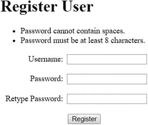
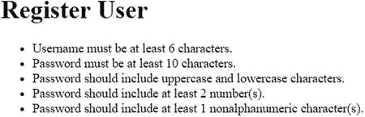
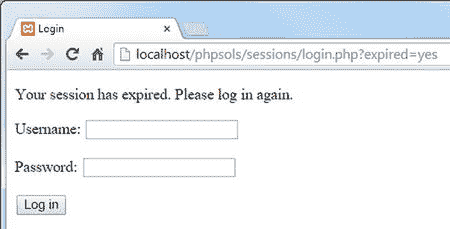

# CheckPassword 类文档

- 这定义了基本的`CheckPassword`类，它最初只检查密码是否包含空格以及是否具有所需的最少字符数。您很快就会添加其他功能。

- 该文件首先声明`PhpSolutions\Authenticate`为其命名空间，然后定义具有六个受保护属性的`CheckPassword`类。前两个用于密码和最少的字符数。`$mixedCase`、`$minimumNumbers`和`$minimumSymbols`属性将用于增强密码强度，但最初设置为`false`或 0。`$errors`属性将用于在密码未通过任何检查时存储错误消息数组。

- 构造函数方法接受两个参数：密码和最少的字符数，并将它们分配给相关属性。默认情况下，最少字符数设置为 8，这使得此参数可选。

- `check()`方法包含两个条件语句。第一个使用`preg_match()`和一个正则表达式来搜索密码中的空白字符。第二个条件语句使用`strlen()`，它返回字符串的长度，并将结果与`$minimumChars`进行比较。

- 如果密码未通过任一测试或两个测试都未通过，`$errors`属性将包含至少一个元素，PHP 将其视为固有的`true`。`check()`方法中的最后一行使用`$errors`属性作为三元运算符的条件。如果发现任何错误，`check()`方法返回`false`，表示密码验证失败。否则，返回`true`（如果您需要提醒此结构的工作原理，请参阅第 3 章中的“使用三元运算符”）。

- `getErrors()`公共方法简单地返回错误消息数组。

`use PhpSolutions\Authenticate\CheckPassword;`

**注意**

您必须始终在脚本的顶层导入带命名空间的类。试图在条件语句中导入该类会产生解析错误。

在表单提交后执行代码的条件语句内部，创建一个`CheckPassword`对象，传递`$password`作为参数。然后调用`check()`方法并处理结果，如下所示：

```php
require_once '../PhpSolutions/Authenticate/CheckPassword.php';

$checkPwd = new CheckPassword($password);
$passwordOK = $checkPwd->check();

if ($passwordOK) {
    $result = ['Password OK'];
} else {
    $result = $checkPwd->getErrors();
}
```

`CheckPassword`构造函数的第二个参数是可选的，因此省略它会将最少字符数设置为默认的 8。`check()`方法的结果被赋值给`$passwordOK`。如果返回`true`，则一个报告密码正常的单元素数组被赋值给`$result`。否则，使用`getErrors()`方法从`$checkPwd`对象中检索错误数组。

**注意**

一旦测试完成，单元素数组将被注册用户的脚本替换。您需要使用数组，因为下一步将使用`foreach`循环来显示结果。

在页面正文的表单上方添加以下 PHP 代码块：

```php
<h1>Register User</h1>
<?php
if (isset($result)) {
    echo '<ul>';
    foreach ($result as $item) {
        echo "<li>$item</li>";
    }
    echo '</ul>';
}
?>
<form action="" method="post">
```

保存`register.php`并在浏览器中加载它。通过不填写任何字段单击“注册”按钮来测试`CheckPassword`类。您应该会看到一条消息，告知您密码至少需要 8 个字符。使用包含 8 个字符的密码尝试。您应该看到“Password OK”。使用至少 8 个字符但在中间插入空格的密码尝试。您将收到警告，不允许使用空格。使用少于 8 个字符但中间有空格的密码尝试。您将看到以下警告：

- 这会在表单提交后以无序列表的形式显示密码测试的结果。



更改`register.php`中的代码，将可选的第二个参数传递给`CheckPassword`构造函数，将最少字符数设置为 10：

```php
$checkPwd = new CheckPassword($password, 10);
```

保存并再次测试页面。如果遇到任何问题，请将您的代码与`ch09`文件夹中的`register_02.php`和`ch09/PhpSolutions/Authenticate`文件夹中的`CheckPassword_01.php`进行比较。假设您的代码正常工作，将设置密码强度的公共方法添加到`CheckPassword.php`中的类定义中。从技术上讲，将它们放在类中的哪个位置没有区别（只要它们在大括号内），但我倾向于按照使用顺序放置公共方法。您需要在调用`check()`方法之前设置选项，因此将以下代码插入到构造函数和`check()`方法定义之间：

```php
public function requireMixedCase() {
    $this->mixedCase = true;
}

public function requireNumbers($num = 1) {
    if (is_numeric($num) && $num > 0) {
        $this->minimumNumbers = (int) $num;
    }
}

public function requireSymbols($num = 1) {
    if (is_numeric($num) && $num > 0) {
        $this->minimumSymbols = (int) $num;
    }
}
```

需要更新`check()`方法以执行这些强度标准的必要检查。如下修改代码：

- 这段代码非常简单。`requireMixedCase()`方法不接受任何参数，并将`$mixedCase`属性重置为`true`。其他两个方法接受一个参数，检查它是否大于 0 的数字，并将其分配给相关属性。`(int)`类型转换操作符确保它是一个整数。您首次在 PHP 方案 6-4 中遇到类型转换操作符（有关详细说明，请参阅第 6 章中的“显式更改数据类型”）。`$num`的值设置了密码必须包含的最少数字或非字母数字符号的数量。默认情况下，该值设置为 1，使参数可选。

```markdown
### PHP 解决方案 9-7：创建基于文件的用户注册系统

此 PHP 解决方案创建了一个简单的用户注册系统，该系统使用 `password_hash()` 函数对密码进行加密。它使用 PHP 解决方案 9-6 中的 `CheckPassword` 类来强制实施最低强度要求。进一步的检查确保用户名包含最少数量的字符，并且用户在第二个字段中正确重新输入了密码。

用户凭据存储在一个纯文本文件中，该文件必须位于 Web 服务器的文档根目录之外。这些说明假定你已经设置了一个 PHP 具有写入权限的 `private` 文件夹，如第 7 章 所述。还假定你熟悉该章中的“使用 `fopen()` 追加内容”部分。

继续使用前面 PHP 解决方案中的文件。或者，使用 `ch09` 文件夹中的 `register_03.php` 和 `ch09/PhpSolutions/Authenticate` 文件夹中的 `CheckPassword_02.php`。

> **注意**
> PHP 解决方案 9-7 和 9-8 中使用的密码哈希函数至少需要 PHP 5.5。有关如何获取 `password_compat` 库的详细信息，请参阅本章前面的“在较旧版本的 PHP 中启用密码哈希”。

在 `includes` 文件夹中创建一个名为 `register_user_csv.php` 的文件，并剥离脚本编辑器插入的任何 HTML。 当使用命名空间类时，导入语句必须与使用该类位于同一文件中，即使它是一个包含文件也是如此。从 `register.php` 顶部剪切以下行，并将其粘贴到 `register_user_csv.php` 中。

```php
use PhpSolutions\Authenticate\CheckPassword;
```

从 `register.php` 中剪贴以下代码，并将其粘贴到 `register_user_csv.php` 中的导入语句之后（你的密码强度设置不同也没关系）：

```php
require_once '../PhpSolutions/Authenticate/CheckPassword.php';

$checkPwd = new CheckPassword($password, 10);

$checkPwd->requireMixedCase();

$checkPwd->requireNumbers(2);

$checkPwd->requireSymbols();

$passwordOK = $checkPwd->check();

if ($passwordOK) {

    $result = array('Password OK');

} else {

    $result = $checkPwd->getErrors();

}
```

### 代码解析

*   三个新的条件语句各自仅在等效的公有方法在 `check()` 方法之前被调用时才会执行。每个条件语句都将一个正则表达式存储为 `$pattern`，然后使用 `preg_match()` 或 `preg_match_all()` 来测试密码。
*   如果 `$mixedCase` 属性被设置为 `true`，则正则表达式和密码会被传递给 `preg_match()`，以查找密码中任意位置是否存在至少一个小写字母和一个大写字母。
*   `$minimumNumbers` 和 `$minimumSymbols` 属性默认设置为 0。如果它们被重新设置为一个正数，则正则表达式和密码会被传递给 `preg_match_all()` 函数，以查找正则表达式匹配的次数。该函数需要三个参数：正则表达式、待搜索的字符串以及一个用于存储匹配结果的变量；它返回找到的匹配次数。在这种情况下，你只关心匹配的次数，存储匹配结果的变量被丢弃。
*   最后一个条件语句中可怕的 `$pattern` 实际上是通过将单引号字符串与双引号字符串拼接而成的正则表达式。这样做是为了在允许的符号中同时包含单引号和双引号。我已经包含了英语键盘上的大多数非字母数字符号。如果你想添加其他符号，请将它们放在最后一个右方括号之前，如下所示：

```php
$pattern = "/[-!$%^&*(){}<>[\]'" . '"|#@:;.,?+=_\/\∼` £ `]/';
```

保存 `CheckPassword.php`，并通过在 `register.php` 中调用新方法来测试更新后的类。例如，以下代码要求密码至少包含十个字符、至少一个大写字母和一个小写字母、两个数字以及一个非字母数字符号：

```php
$checkPwd = new CheckPassword($password, 10);

$checkPwd->requireMixedCase();

$checkPwd->requireNumbers(2);

$checkPwd->requireSymbols();

$passwordOK = $checkPwd->check();
```

*   调用新方法的顺序无关紧要，只要它们在构造函数之后、`check()` 方法调用之前即可。使用各种组合可以强制执行不同强度的密码。
*   如有必要，请对照 `ch09` 文件夹中的 `register_03.php` 和 `ch09/PhpSolutions/Authenticate` 文件夹中的 `CheckPassword_02.php` 检查你的代码。

在为本章编写代码时，我最初将密码检查器设计为一个函数。函数内部的 basic 代码是相同的，但我决定将其转换为一个类，以使其更灵活且更易于使用。函数的问题在于它需要大量参数来设置不同的选项，并且很难记住参数的顺序。此外，处理结果也存在困难。如果没有错误，函数返回 `true`；但如果发现任何错误，它返回错误消息数组。由于 PHP 将包含元素的数组视为隐式的 `true`，这意味着必须使用全等运算符（三个等号——见表 3-5）来检查结果是否为布尔值 `true`。

将代码转换为类消除了这些问题。用于设置选项的公有方法具有直观的名称，并且可以按任意顺序设置，或者根本不设置。并且结果始终是布尔值 `true` 或 `false`，因为有一个单独的方法来检索错误消息数组。这需要编写更多代码，但改进是值得的。

### `CheckPassword` 类的 `check()` 方法

```php
public function check() {
    if (preg_match('/\s/', $this->password)) {
        $this->errors[] = 'Password cannot contain spaces.';
    }

    if (strlen($this->password) < $this->minimumChars) {
        $this->errors[] = "Password must be at least $this->minimumChars characters.";
    }

    if ($this->mixedCase) {
        $pattern = '/(?=.*[a-z])(?=.*[A-Z])/';
        if (!preg_match($pattern, $this->password)) {
            $this->errors[] = 'Password should include uppercase and lowercase characters.';
        }
    }

    if ($this->minimumNumbers) {
        $pattern = '/\d/';
        $found = preg_match_all($pattern, $this->password, $matches);
        if ($found < $this->minimumNumbers) {
            $this->errors[] = "Password should include at least $this->minimumNumbers number(s).";
        }
    }

    if ($this->minimumSymbols) {
        $pattern = "/[-!$%^&*(){}<>[\]'" . '"|#@:;.,?+=_\/\∼]/';
        $found = preg_match_all($pattern, $this->password, $matches);
        if ($found < $this->minimumSymbols) {
            $this->errors[] = "Password should include at least $this->minimumSymbols nonalphanumeric character(s).";
        }
    }

    return $this->errors ? false : true;
}
```

在 `register.php` 中 `DOCTYPE` 声明上方的脚本末尾，创建一个用于存储用户凭据的文本文件位置的变量；并包含 `register_user_csv.php`。 `register.php` 顶部 PHP 块中的代码现在应如下所示：

```php
if (isset($_POST['register'])) {

    $username = trim($_POST['username']);

    $password = trim($_POST['pwd']);

    $retyped = trim($_POST['conf_pwd']);

    $userfile = 'C:/private/encrypted.csv';

    require_once '../includes/register_user_csv.php';

}
```

在 `register_user_csv.php` 中，粘贴你在步骤 3 中从 `register.php` 剪切的代码，并修改包含类定义的命令，如下所示：

*   用于存储用户凭据的 CSV 文件尚不存在。它将在第一个用户注册时自动创建。如有必要，请修改 `private` 文件夹的路径以匹配你自己的设置。

```php
require_once __DIR__ . '/../PhpSolutions/Authenticate/CheckPassword.php';
```

在包含命令之后立即插入以粗体突出显示的代码：

*   你需要调整相对路径，因为 `register_user_csv.php` 也是一个包含文件（请参阅第 4 章 中的“嵌套包含文件”）。

```php
require_once __DIR__ . '/../PhpSolutions/Authenticate/CheckPassword.php';

$usernameMinChars = 6;

$errors = [];

if (strlen($username) < $usernameMinChars) {

    $errors[] = "Username must be at least $usernameMinChars characters.";

}

if (preg_match('/\s/', $username)) {

    $errors[] = 'Username should not contain spaces.';

}

$checkPwd = new CheckPassword($password, 10);
```

像这样修改 `register_user_csv.php` 底部的代码：

新的代码的前两行指定了用户名的最小字符数，并初始化了一个用于存储错误信息的空数组。其余代码检查用户名的长度，并测试它是否包含空格。这些条件语句使用了与 `CheckPassword` 类中相同的代码。

```php
$passwordOK = $checkPwd->check();

if (!$passwordOK) {

    $errors = array_merge($errors, $checkPwd->getErrors());

}

if ($password != $retyped) {

    $errors[] = "Your passwords don't match.";

}

if ($errors) {

    $result = $errors;

} else {

    $result = ['All OK'];

}
```

保存 `register_user_csv.php` 和 `register.php`，然后再次测试表单。将所有字段留空并点击“注册”。您应该会看到以下错误信息：

- 这将逻辑非运算符（`!`）添加到测试 `$passwordOK` 值的条件语句中。如果密码验证失败，则使用 `array_merge()` 将 `$checkPwd->getErrors()` 的结果与现有的 `$errors` 数组合并。
- 下一个条件语句比较 `$password` 和 `$retyped`，如果它们不匹配，则向 `$errors` 数组添加一条错误信息。
- 如果发现任何错误，最后的条件语句会将 `$errors` 数组赋值给 `$result`。否则，将一个单元素数组赋值给 `$result`，报告一切正常。再次说明，这仅用于测试目的。检查完代码后，用于注册用户的脚本将替换最后的条件语句。



- 尝试各种测试以确保验证代码正常工作。
- 如果遇到问题，请将你的代码与 `ch09` 文件夹中的 `register_user_csv_01.php` 和 `register_04.php` 进行对比。

假设代码正常工作，就可以开始创建脚本的注册部分了。我们先暂停一下，思考主脚本需要做什么。首先，你需要加密密码。然后，在将详细信息写入 CSV 文件之前，必须检查用户名是否唯一。这就带来了一个问题：应该使用 `fopen()` 的哪种模式。

> **注意**：各种 `fopen()` 模式在第 7 章中有描述。

理想情况下，你希望内部指针位于文件开头，以便可以遍历现有记录。`r+` 模式可以实现这一点，但操作失败，除非文件已经存在。不能使用 `w+`，因为它会删除现有内容。也不能使用 `x+`，因为如果同名文件已存在，它也会失败。

这样，`a+` 和 `c+` 就成了满足灵活性需求的唯二选项：两者都能在必要时创建文件，并允许你读取和写入。它们的区别在于打开文件时内部指针的位置：`a+` 将其置于文件末尾，而 `c+` 将其置于文件开头。这使得 `c+` 更便于检查现有记录，但 `a+` 的优势在于它总是将新内容追加到文件末尾。这避免了意外覆盖现有值的风险。我们将以 `a+` 模式打开 CSV 文件。

第一次运行脚本时文件是空的（你可以通过 `filesize()` 函数返回 `0` 来判断），因此你可以直接使用 `fputcsv()` 写入详细信息。这是 `fgetcsv()` 的对应函数，后者已在第 7 章中描述。`fgetcsv()` 一次从 CSV 文件中提取一行数据，而 `fputcsv()` 则创建一条 CSV 记录。它有两个必需参数：文件引用和一组要作为 CSV 记录插入的值。它还接受可选参数来设置分隔符和封闭字符（参见 [`http://php.net/manual/en/function.fputcsv.php`](http://php.net/manual/en/function.fputcsv.php) 的在线文档）。

如果 `filesize()` 返回的不是 `0`，你需要重置内部指针并循环遍历记录，以查看用户名是否已注册。如果找到匹配项，则跳出循环并准备错误信息。如果循环结束都没有找到匹配项，则说明这是一个需要添加到文件中的新用户名。既然你已了解了脚本的流程，就可以将其插入到 `register_user_csv.php` 中。

删除 `register_user_text.inc.php` 底部的以下代码：

```php
if ($errors) {

    $result = $errors;

} else {

    $result = ['All OK'];

}
```

将其替换为以下代码：

```php
if (!$errors) {

    // encrypt password using default encryption

    $password = password_hash($password, PASSWORD_DEFAULT);

    // open the file in append mode

    $file = fopen($userfile, 'a+');

    // if filesize is zero, no names yet registered

    // so just write the username and password to file as CSV

    if (filesize($userfile) === 0) {

        fputcsv($file, [$username, $password]);

        $result = "$username registered.";

    } else {

        // if filesize is greater than zero, check username first

        // move internal pointer to beginning of file

        rewind($file);

        // loop through file one line at a time

        while (($data = fgetcsv($file)) !== false) {

            if ($data[0] == $username) {
```

### 使用 `password_verify()` 验证加密密码

`password_verify()` 函数的功能正如你所期望的那样：它用于验证通过 `password_hash()` 加密的密码。该函数仅需两个参数：提交的密码和加密后的版本。若提交的密码正确，函数返回 `true`，否则返回 `false`。

### PHP 解决方案 9-8：使用加密登录

既然你已经有了加密的密码，就需要修改登录表单以适配新的设置。只需选择包含加密密码的 CSV 文件，并使用 `password_verify()` 检查所提交密码的有效性。同样，这依赖于使用 PHP 5.5 或在脚本中包含 `password_compat` 库。

打开 PHP 解决方案 9-3 中的 `login.php`，或使用 `ch09` 文件夹中的 `login_02.php`。将 `$userlist` 的位置改为使用加密密码：

`$userlist = 'C:/private/encrypted.csv';`

打开 PHP 解决方案 9-3 中的 `includes/authenticate.php`，或使用 `ch09` 文件夹中的 `authenticate_01.php`。加密密码文件的第一行没有标题，因此删除以下注释和代码行：

`// 忽略 CSV 文件第一行的标题`
`$titles = fgetcsv($file);`

找到以下代码行：

`if ($data[0] == $username && $data[1] == $password) {`

将其修改为：

`if ($data[0] == $username && password_verify($password, $data[1])) {`

保存 `login.php` 并进行测试。它应该与之前一样正常工作，同时更加安全。如有必要，可使用 `ch09` 文件夹中的 `login_03.php` 和 `authenticate_02.php` 检查你的代码。

- `$password` 包含提交的密码，而 `$data[1]` 包含加密版本，因此它们作为参数传递给 `password_verify()`，该函数仅在密码正确时返回 `true`。

PHP 解决方案 9-3 至 9-8 构建了一个简单而有效的用户认证系统，无需数据库后端。然而，它确实存在局限性。最重要的是，包含用户名和密码的 CSV 文件必须位于服务器根目录之外。此外，一旦记录数量增多，查询数据库通常比逐行遍历 CSV 文件快得多。第 17 章 涵盖了使用数据库进行用户认证的内容。

#### 保持加密与时俱进

使用 PHP 5.5 新增的密码哈希函数的主要优势在于，它们被设计为能紧跟加密技术的改进。无需指定特定的加密标准，而是将 `PASSWORD_DEFAULT` 作为 `password_hash()` 的第二个参数，这能确保新注册始终使用当时被认为最安全的方法。即使默认值发生变化，`password_verify()` 函数仍能验证现有密码，因为加密密码包含识别其加密方式的信息。

还有一个名为 `password_needs_rehash()` 的函数，用于检查加密密码是否需要更新为当前标准。它被设计用于用户登录网站时。以下代码假设提交的密码存储在 `$password` 中，加密密码存储在 `$encrypted` 中，并且你使用的是 PHP 默认的加密方法。

```php
if (password_verify($password, $encrypted)) {
    if (password_needs_rehash($encrypted, PASSWORD_DEFAULT)) {
        $encrypted = password_hash($password, PASSWORD_DEFAULT);
        // 存储更新后的 $encrypted
    }
}
```

每次用户登录都执行此检查，几乎肯定过于频繁。PHP 的策略是仅在重大版本发布（如 5.7.0 或 7.0.0）时更改默认加密方式。唯一的例外是当当前默认加密方式发现严重安全漏洞时。如果你紧跟 PHP 的发展动态，可以在默认加密方式更改时，创建一个脚本一次性更新所有存储的密码。如果你没有时间关注 PHP 世界的变化，那么在每次登录时使用 `password_needs_rehash()` 应该能确保网站安全，尽管这可能会拖慢登录过程。

### 设置会话时间限制

默认情况下，PHP 将用户计算机上的会话 cookie 的生命周期设置为 0，这会使会话保持活动状态，直到用户注销或关闭浏览器。你可以通过调用 `ini_set()` 函数来提前设置会话超时，该函数允许你动态更改某些 PHP 配置指令。在会话开始时，将指令 `session.cookie_lifetime` 作为第一个参数，将包含 cookie 保持活动秒数的字符串作为第二个参数。例如，你可以将会话 cookie 的生命周期限制为 10 分钟，如下所示：

```php
session_start();
ini_set('session.cookie_lifetime', '600');
```

尽管这很有效，但它有两个缺点。首先，过期时间是基于服务器时间，而非用户计算机时间。如果用户计算机时钟不准，cookie 可能立即过期，或者持续的时间远超你的预期。另一个问题是，用户可能会在没有说明的情况下自动注销。下一个 PHP 解决方案提供了一种更友好的方法。

### PHP 方案 9-9：在一段非活动时间后结束会话

本 PHP 方案演示了如何在用户于指定时间段内未进行任何触发页面加载的操作时结束会话。当会话首次启动时（通常在用户登录时），当前时间会被存储在一个会话变量中。每当用户加载页面时，该会话变量都会与当前时间进行比较：如果时间差超过预设限制，则销毁会话及其变量；否则，将该变量更新为当前时间。

以下说明假设你已经按照 PHP 方案 9-3 至 9-8 设置了登录系统。

你需要将当前时间存储在用户凭证验证通过之后、但脚本将用户重定向到网站受限制部分之前。在 `authenticate.php` 中找到以下代码段（大约在第 16-20 行），并插入以下粗体显示的新代码：

```php
if ($data[0] == $username && password_verify($password, $data[1])) {
    $_SESSION['authenticated'] = 'Jethro Tull';
    $_SESSION['start'] = time();
    session_regenerate_id();
    break;
}
```

当会话超时时，直接将用户毫不客气地丢回登录屏幕并不友好，因此最好解释一下发生了什么。在 `login.php` 中，在紧接 `<body>` 标签（大约在第 22-27 行）后的 PHP 代码块中添加以下粗体显示的代码：

- `time()` 函数会返回一个当前时间戳。通过将其存储在 `$_SESSION['start']` 中，它变得对所有以 `session_start()` 开头的页面都可用。

```php
<?php
if ($error) {
    echo "<p>$error</p>";
} elseif (isset($_GET['expired'])) { ?>
    <p>您的会话已过期。请重新登录。</p>
<?php } ?>
```

打开 `menu.php`，剪切 `DOCTYPE` 声明上方 PHP 代码块中的代码，并将其粘贴到一个新的空白文件中。将该文件保存为 `includes` 文件夹下的 `session_timeout.php`，然后按如下方式编辑代码：

- 如果 URL 的查询字符串中包含名为 `expired` 的变量，则会显示该消息。

```php
<?php
session_start();
ob_start();
// 设置时间限制（单位：秒）
$timelimit = 15;
// 获取当前时间
$now = time();
// 如果被拒绝，重定向到的页面
$redirect = 'http://localhost/phpsols/sessions/login.php';
// 如果未设置会话变量，则重定向到登录页面
if (!isset($_SESSION['authenticated'])) {
    header("Location: $redirect");
    exit;
} elseif ($now > $_SESSION['start'] + $timelimit) {
    // 如果已超时，销毁会话并重定向
    $_SESSION = [];
    // 使会话 cookie 失效
    if (isset($_COOKIE[session_name()])) {
        setcookie(session_name(), '', time()-86400, '/');
    }
    // 结束会话并使用查询字符串重定向
    session_destroy();
    header("Location: {$redirect}?expired=yes");
    exit;
} else {
    // 如果代码执行到这里，说明一切正常，因此更新开始时间
    $_SESSION['start'] = time();
}
```

- 行内注释解释了发生了什么，你应该能认出 `elseif` 子句中的大部分内容（来自 PHP 方案 9-5）。PHP 以秒为单位衡量时间，我将 `$timelimit`（第 5 行）设置为了极其短暂的 15 秒，纯粹是为了演示效果。若要设置一个更合理的限制，例如 15 分钟，之后可以这样修改：

`$timelimit = 15 * 60; // 15 分钟`

- 当然，你也可以将 `$timelimit` 设置为 `900`，但当 PHP 可以帮你完成繁重工作时，何必自寻烦恼呢？

- 如果 `$_SESSION['start']` 加上 `$timelimit` 的和小于当前时间（存储为 `$now`），你就结束会话并将用户重定向到登录页面。执行重定向的那一行会在 URL 末尾添加一个查询字符串，如下所示：

`http://localhost/phpsols/sessions/login.php?expired=yes`

在 `menu.php` 的 `DOCTYPE` 声明上方包含 `session_timeout.php`。include 命令应为 PHP 代码块中的唯一代码：

- 第 2 步中的代码不关心 `expired` 的值；将值设为 `yes` 只是为了让它在浏览器地址栏中看起来更友好。

- 如果脚本执行到了最后的 `else`，这意味着 `$_SESSION['authenticated']` 已设置且未达到时间限制，因此 `$_SESSION['start']` 被更新为当前时间，页面正常显示。

```php
<?php require_once '../includes/session_timeout.php'; ?>
<!DOCTYPE HTML>
```

用同样的方式替换 `secretpage.php` 中 `DOCTYPE` 声明上方的代码。保存所有已编辑的页面，并将 `menu.php` 或 `secretpage.php` 加载到浏览器中。如果页面显示，请点击“退出”。然后重新登录，并在 `menu.php` 和 `secretpage.php` 之间来回导航。一旦确认链接正常工作，等待 15 秒或更长时间，再尝试导航回另一个页面。你应会被自动注销，并看到以下画面：



- 如有必要，请根据 `ch09` 文件夹中的 `authenticate_03.php`、`login_04.php`、`session_timeout.php`、`menu_05.php` 和 `secretpage_04.php` 检查你的代码。

### 在多页表单间传递信息

通过 `$_POST` 和 `$_GET` 数组传递的变量只具有短暂的存在性。一旦它们被传递到某个页面，除非你以某种方式保存其值，否则它们就会消失。在表单之间传递信息的常用方法是从 `$_POST` 数组中提取其值，并将其存储在 HTML 的隐藏字段中，如下所示：

`<input type="hidden" name="address" id="address" value="<?= $_POST['address']; ?>">`

顾名思义，隐藏字段是表单代码的一部分，但屏幕上不会显示任何内容。隐藏字段适用于一两个项目，但假设你有一个分布在四页上的调查。如果每页有 10 个项目，那么你总共需要 60 个隐藏字段（第二页 10 个，第三页 20 个，第四页 30 个）。会话变量可以帮你省去所有这些编码工作。它们还可以确保访问者始终从多页表单的正确页面开始。

### PHP 解决方案 9-10：使用会话实现多页表单

在本 PHP 解决方案中，您将构建一个用于多页表单的脚本，该脚本从 `$_POST` 数组收集数据并将其分配给会话变量。如果用户尝试先访问表单的其他部分，该脚本会自动将用户重定向到表单的第一页。

将 `ch09` 文件夹中的 `multiple_01.php`、`multiple_02.php`、`multiple_03.php` 和 `multiple_04.php` 复制到 `sessions` 文件夹。前三页包含询问用户姓名、年龄和地址的简单表单。每个 `<form>` 标签的 `action` 属性为空，因此表单是自处理的，但它们尚不包含任何处理脚本。最后一页将最终显示前三页的数据。

在 `multiple_01.php` 的 `DOCTYPE` 声明上方的 PHP 代码块中添加以下代码：

```php
if (isset($_POST['next'])) {
    session_start();
    // 设置一个变量来控制对其他页面的访问
    $_SESSION['formStarted'] = true;
    // 设置必填字段
    $required = 'first_name';
    $firstPage = 'multiple_01.php';
    $nextPage = 'multiple_02.php';
    $submit = 'next';
    require_once '../includes/multiform.php';
}
```

在`includes`文件夹中创建一个名为`multiform.php`的文件。删除所有HTML标记并插入以下代码：

* 提交按钮的`name`属性是`next`，因此此代码块仅在表单已提交时运行。它启动会话并创建一个将用于控制对其他表单页面访问的会话变量。

* 接下来是四个变量，将由处理多页表单的脚本使用：

    * `$required`：当前页面中必填字段的`name`属性数组。如果只有一个必填字段，则可以使用字符串代替数组。如果没有必填字段，则可以省略。

    * `$firstPage`：表单第一页的文件名

    * `$nextPage`：表单下一页的文件名

    * `$submit`：当前页面中提交按钮的名称

* 最后，代码包含了处理多页表单的脚本。

```php
<?php
if (!isset($_SESSION)) {
    session_start();
}
$filename = basename($_SERVER['SCRIPT_FILENAME']);
$current = 'http://' . $_SERVER['HTTP_HOST'] . $_SERVER['PHP_SELF'];
```

现在您已经获取了当前文件的名称及其URL，可以使用`str_replace()`创建第一页和下一页的URL，如下所示：

* 多页表单的每一页都需要调用`session_start()`，但在同一页上调用两次会产生错误，因此条件语句首先检查`$_SESSION`超全局变量是否可访问。如果不可访问，则启动该页面的会话。

* 在条件语句之后，`$_SERVER['SCRIPT_FILENAME']`被传递给`basename()`函数以提取当前页面的文件名。这与您在PHP解决方案4-3中使用的技术相同。

* `$_SERVER['SCRIPT_FILENAME']`包含父文件的路径，因此当此脚本包含在`multiple_01.php`中时，`$filename`的值将是`multiple_01.php`，而不是`multiform.php`。

* 下一行从字符串`http://`以及`$_SERVER['HTTP_HOST']`（包含当前域名）和`$_SERVER['PHP_SELF']`（包含当前文件除去域名后的路径）的值构建当前页面的URL。如果您在本地测试，当您加载多页表单的第一页时，`$current`将是`http://localhost/phpsols/sessions/multiple_01.php`。

```php
$redirectFirst = str_replace($filename, $firstPage, $current);
$redirectNext = str_replace($filename, $nextPage, $current);
```

为防止用户不从头开始就访问多页表单，添加一个检查`$filename`值的条件语句。如果它不同于第一页，并且`$_SESSION['formStarted']`尚未创建，则`header()`函数将重定向到第一页，如下所示：

* `str_replace()`的第一个参数是您要替换的字符串，第二个参数是替换字符串，第三个参数是目标字符串。在步骤2中，您将`$firstPage`设置为`multiple_01.php`，将`$nextPage`设置为`multiple_02.php`。因此，`$redirectFirst`变为`http://localhost/phpsols/sessions/multiple_01.php`，`$redirectNext`变为`http://localhost/phpsols/sessions/multiple_02.php`。

```php
if ($filename != $firstPage && !isset($_SESSION['formStarted'])) {
    header("Location: $redirectFirst");
    exit;
}
```

脚本的其余部分遍历`$_POST`数组，检查哪些必填字段为空，并将它们添加到`$missing`数组。如果没有缺失项，`header()`函数会将用户重定向到多页表单的下一页。`multiform.php`的完整脚本如下所示：

```php
<?php
if (!isset($_SESSION)) {
    session_start();
}
$filename = basename($_SERVER['SCRIPT_FILENAME']);
$current = 'http://' . $_SERVER['HTTP_HOST'] . $_SERVER['PHP_SELF'];
$redirectFirst = str_replace($filename, $firstPage, $current);
$redirectNext = str_replace($filename, $nextPage, $current);
if ($filename != $firstPage && !isset($_SESSION['formStarted'])) {
    header("Location: $redirectFirst");
    exit;
}
if (isset($_POST[$submit])) {
    // 创建空数组用于存储任何缺失的字段
    $missing = [];
    // 如果未设置 $required 则创建数组
    if (!isset($required)) {
        $required = [];
    } else {
        // 使用类型转换运算符将单个字符串转换为数组
        $required = (array) $required;
    }
    // 处理 $_POST 变量并将它们保存到 $_SESSION 数组中
    foreach ($_POST as $key => $value) {
        // 跳过提交按钮
        if ($key == $submit) continue;
        // 分配给临时变量，如果不是数组则去除空白
        $temp = is_array($value) ? $value : trim($value);
        // 如果为空且是必填字段，则添加到 $missing 数组中
        if (empty($temp) && in_array($key, $required)) {
            $missing[] = $key;
        } else {
            // 否则，分配给与 $key 同名的变量
            $_SESSION[$key] = $temp;
        }
    }
    // 如果没有必填字段缺失，则重定向到下一页
    if (!$missing) {
        header("Location: $redirectNext");
        exit;
    }
}
```

在`multiple_02.php`的`DOCTYPE`声明上方的PHP代码块中添加以下代码：

> **注意：** 此代码与第5章中用于处理反馈表单的代码非常相似，因此内联注释应足以解释其工作原理。包裹新代码的条件语句使用`$_POST[$submit]`来检查表单是否已提交。我使用变量而不是硬编码提交按钮的名称，以使代码更加灵活。尽管此脚本仅在表单提交后才包含在第一页中，但它直接包含在其他页面中，因此有必要在此处添加条件语句。

> 提交按钮的名称和值始终包含在`$_POST`数组中，因此`foreach`循环使用`continue`关键字，当键与提交按钮的名称相同时跳过当前项。这避免了将不需要的值添加到`$_SESSION`数组中。有关`continue`的描述，请参阅第3章的“跳出循环”。

```php
$firstPage = 'multiple_01.php';
$nextPage = 'multiple_03.php';
$submit = 'next';
require_once '../includes/multiform.php';
```

在`multiple_03.php`中，在`DOCTYPE`声明上方的PHP代码块中添加以下内容：