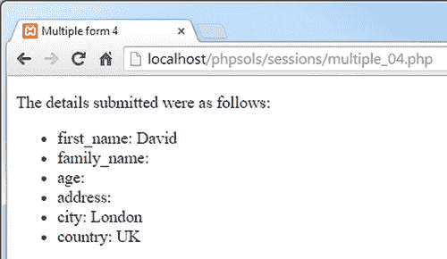

# 多页表单与数据库入门

这将设置`$firstPage`、`$nextPage`和`$submit`的值，并包含你刚刚创建的处理脚本。此页面上的表单仅包含一个字段（可选），因此不需要`$required`变量。处理脚本会在主页面中未设置该变量时自动创建一个空数组。

```
// 设置必填字段
$required = ['city', 'country'];
$firstPage = 'multiple_01.php';
$nextPage = 'multiple_04.php';
$submit = 'next';
require_once '../includes/multiform.php';
```

在`multiple_01.php`、`multiple_02.php`和`multiple_03.php`的`<form>`标签上方添加以下代码：

*   两个字段是必填项，因此它们的`name`属性被列为一个数组并赋给`$required`。其余代码与上一页相同。

```
<?php if (isset($missing)) { ?>
<p> 请修复以下必填字段：</p>
<ul>
<?php
foreach ($missing as $item) {
echo "<li>$item</li>";
}
?>
</ul>
<?php } ?>
```

在`multiple_04.php`中，在`DOCTYPE`声明上方的 PHP 代码块中添加以下代码，以便在用户未从第一页进入时将其重定向回第一页：

*   这将显示尚未填写的必填项列表。

```
session_start();
if (!isset($_SESSION['formStarted'])) {
header('Location: http://localhost/phpsols/sessions/multiple_01.php ');
exit;
}
```

在页面主体中，将以下代码添加到无序列表中以显示结果：

```
<ul>
<?php
$expected = ['first_name', 'family_name', 'age',
'address', 'city', 'country'];
// 取消设置 formStarted 变量
unset($_SESSION['formStarted']);
foreach ($expected as $key) {
echo "<li>$key: $_SESSION[$key]</li>";
// 取消设置会话变量
unset($_SESSION[$key]);
}
?>
</ul>
```

*   你可以对照`ch09`文件夹中的`multiple_01_done.php`、`multiple_02_done.php`、`multiple_03_done.php`、`multiple_04_done.php`和`multiform.php`来检查你的代码。



**图 9-5.** 会话变量保留了来自多个页面的输入

保存所有页面，然后尝试在浏览器中加载表单的中间页面或最后一页。你应被重定向到第一页。不填写任何字段点击"下一步"。系统将要求你填写`first_name`字段。填写必填字段并在每个页面上点击"下一步"。结果应显示在最终页面上，如图 9-5 所示。

*   这将表单字段的`name`属性列为一个数组并赋给`$expected`。这是一项安全措施，确保你不会处理恶意用户可能注入`$_POST`数组的虚假值。
*   代码随后取消设置`$_SESSION['formStarted']`，并遍历`$expected`数组，使用每个值访问`$_SESSION`数组中的相关元素并在无序列表中显示。然后删除会话变量。单独删除会话变量可以保留任何其他与会话相关的信息。

这只是多页表单的一个简单演示。在实际应用中，当必填字段留空时，你需要保留用户的输入。

通过在第一页表单提交后创建`$_SESSION['formStarted']`，并在每一页使用`$required`、`$firstPage`、`$nextPage`和`$submit`，`multiform.php`中的脚本可以用于任何多页表单。使用`$missing`数组处理未填写的必填字段。

## 章节回顾

如果你在开始阅读本书时对 PHP 知之甚少或一无所知，那么你已不再是初学者阵营的一员，而是正在以多种有用的方式利用 PHP 的强大功能。希望到了现在，你已经开始意识到相同或类似的技术会反复出现。你不应只是复制代码，而应开始识别那些可以根据自己需求进行调整的技术，并进行独立实验。

本书的其余部分将继续巩固你的知识，但引入了一个新的因素：MySQL 关系数据库（及其替代品 MariaDB），这将把你的 PHP 技能提升到一个更高的水平。下一章将介绍 MySQL，并向你展示如何为后续章节设置它。

