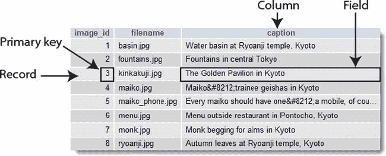
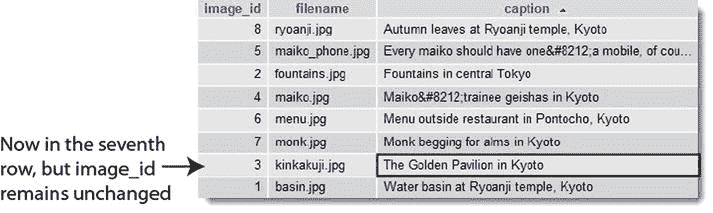
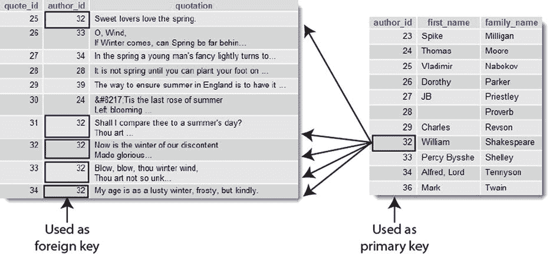
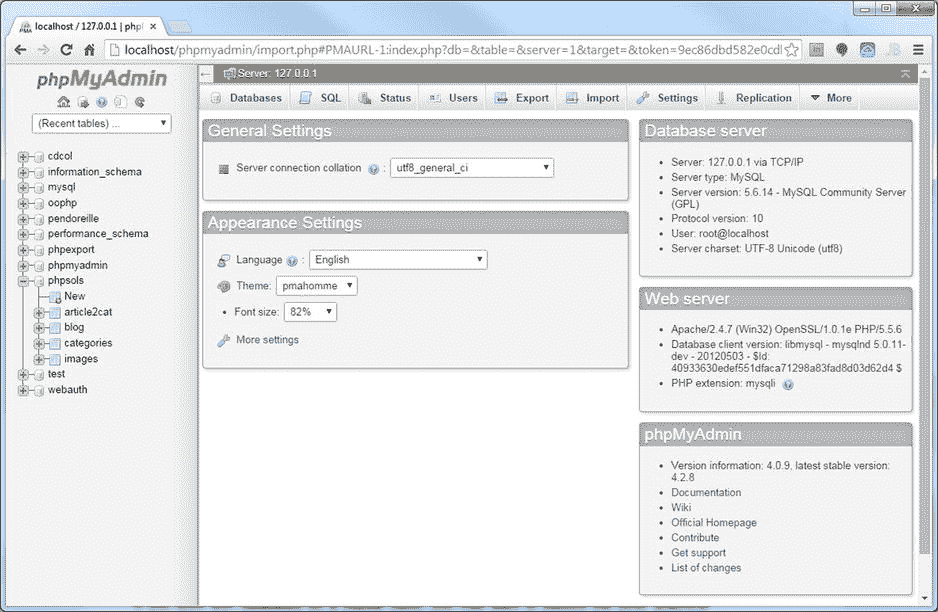
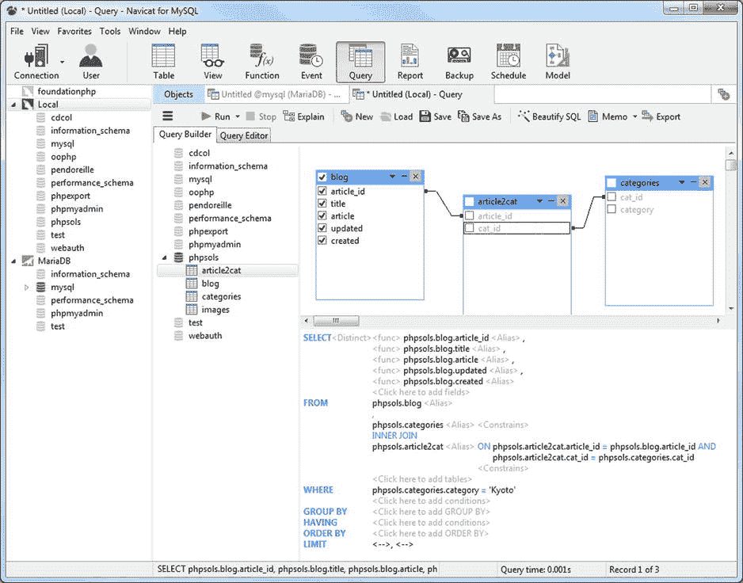
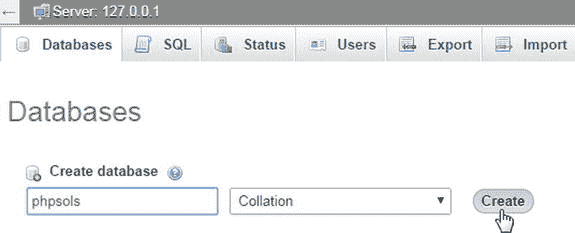
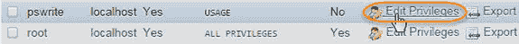
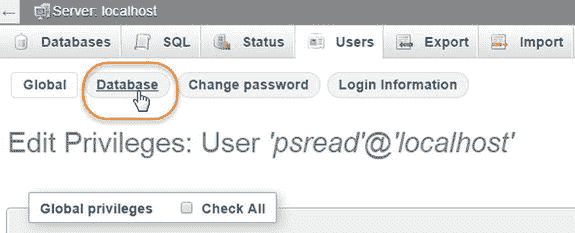
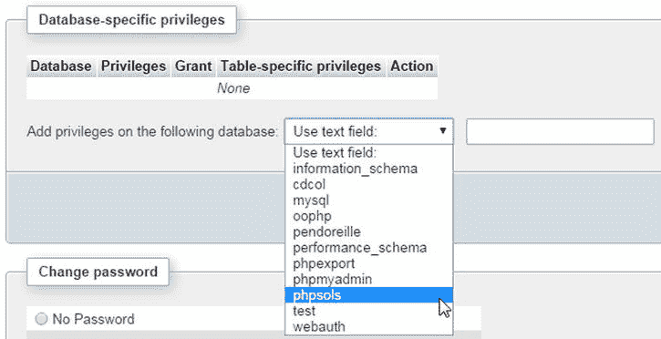
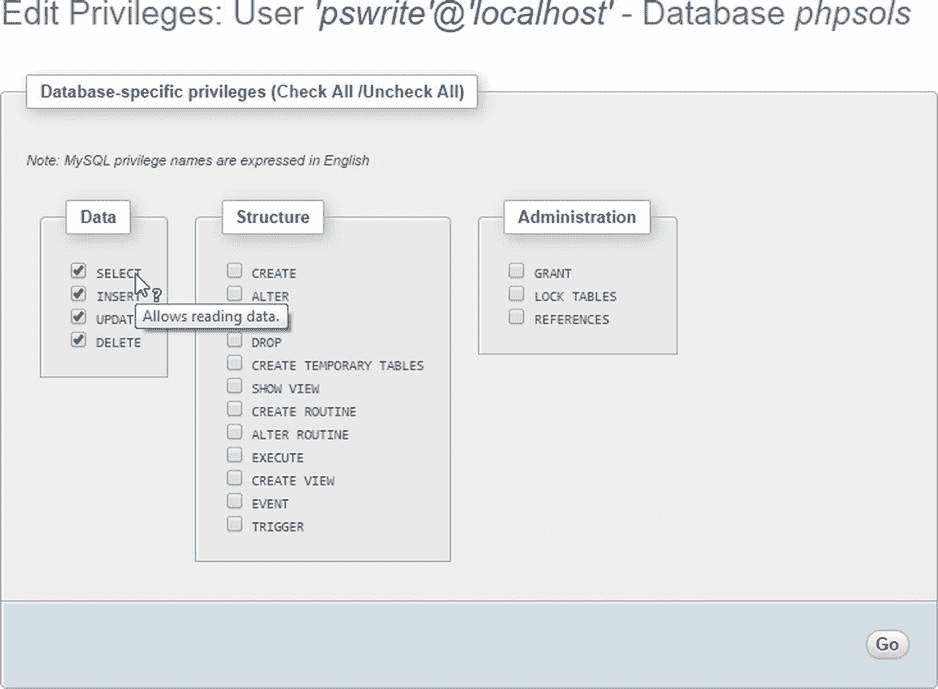

# 10. 数据库入门

动态网站与数据库结合后具有全新的意义。从数据库提取内容使你能以静态网站不可能（即使并非完全不可能）的方式呈现材料。脑海中浮现的例子包括在线商店（如[Amazon.com](http://amazon.com/)）、新闻网站（如 BBC 的[www.bbcnews.com](http://www.bbcnews.com/)）以及包括 Google 和 Yahoo!在内的大型搜索引擎。数据库技术使得这些网站能够呈现成千上万甚至数百万个独特的页面。即使你的雄心壮志远不及此，一个数据库也可以以相对较少的努力增加你网站的丰富内容。

PHP 支持所有主流数据库，包括 Microsoft SQL Server、Oracle 和 PostgreSQL，但它最常与开源数据库 MySQL 结合使用。根据 DB-Engines（[`db-engines.com/en/ranking`](http://db-engines.com/en/ranking)）的数据，截至 2014 年底，MySQL 排名为使用第二广泛的数据库。然而，围绕 MySQL 的未来存在争议，Google 和 Wikimedia 已放弃 MySQL 转而支持 MariaDB（[`mariadb.org/`](https://mariadb.org/)）。几个领先的 Linux 发行版也已用 MariaDB 取代了 MySQL。本章首先简要讨论这两个数据库之间竞争的影响。

在本章中，你将学习以下内容：

*   数据库如何存储信息
*   选择图形界面与数据库交互
*   创建用户帐户
*   使用适当的数据类型定义数据库表
*   备份数据并将其传输到另一台服务器

好的，作为一名高级文档工程师和翻译员，我将严格遵守您提供的注意事项和示例，将给定的英文文本翻译成中文。

## 你应该选择哪个数据库？

在本节的第一版和第二版中，对于选择哪个数据库是毫无疑问的。`MariaDB` 要么不存在，要么用户群极小，而 `MySQL` 则提供了以下优势：

*   **成本**：MySQL 社区版在开源 GPL 许可证下是免费的（[`www.gnu.org/licenses/old-licenses/gpl-2.0.html`](http://www.gnu.org/licenses/old-licenses/gpl-2.0.html)）。
*   **功能强大**：MySQL 被 NASA、白宫、戴姆勒克莱斯勒和 BBC 新闻等领先机构使用。它功能丰富且速度快。
*   **广泛可用**：MySQL 是最流行的开源数据库。大多数托管公司都会自动提供 MySQL 与 PHP 的组合。
*   **跨平台兼容性**：MySQL 可在 Windows、Mac OS X 和 Linux 上运行。当数据库从一个系统转移到另一个系统时，无需进行转换。
*   **开源**：社区版的代码和功能与商业版本完全相同。

MySQL 最初由瑞典的 MySQL AB 开发，但该公司于 2008 年被 Sun Microsystems 收购。两年后，Sun 被主要的商业数据库供应商甲骨文收购。许多人认为这威胁到了 MySQL 作为免费开源数据库的持续生存。然而，甲骨文公司公开表示“MySQL 是甲骨文完整、开放和集成战略中不可或缺的一部分。”这并没有给 MySQL 的原始创建者之一 Michael “Monty” Widenius 留下深刻印象，他指责甲骨文从 MySQL 中移除功能，并且在修复安全漏洞方面行动迟缓。

由于 MySQL 代码是开源的，Widenius 将其复刻出来创建了 MariaDB，它被描述为“MySQL 的增强型、可直接替代的版本。”最初，MariaDB 遵循与 MySQL 相同的版本号，因此 MariaDB 5.1 是 MySQL 5.1 的替代品。这种情况一直持续到版本 5.5。此后，MariaDB 跃升至版本 10.0。进行此更改是为了明确 MySQL 5.6 中的某些功能将不会导入到 MariaDB 中。

**提示**
MySQL 的官方发音是“my-ess-queue-ell”。

### MariaDB 和 MySQL 的兼容性

尽管 MariaDB 10.0 和 MySQL 5.6 之间存在分歧，但这两个数据库系统实际上是可互换的。MariaDB 的可执行文件使用与 MySQL 相同的名称（Mac OS X 和 Linux 上为 `mysqld`，Windows 上为 `mysqld.exe`）。主要的权限表也叫做 `mysql`，并且默认存储引擎标识为 `InnoDB`，尽管它实际上是 `InnoDB` 的一个名为 `Percona XtraDB` 的复刻版本。

就本书中的代码而言，使用 MariaDB 还是 MySQL 应该没有区别。MariaDB 理解所有 MySQL 特有的 PHP 代码。我将在后续章节中使用的 MySQL 图形界面 `phpMyAdmin` 也支持它。

我没有水晶球来预测 MariaDB 和 MySQL 之间的竞争在未来几年将如何发展。在撰写本文时，MariaDB 在 DB-Engines 每月调查中排名第 27 位，其分数仅为 MySQL 的一小部分。但随着像谷歌和维基媒体这样的大公司迁移到 MariaDB，这种情况可能会迅速改变。尽管如此，为了使本书更具可读性，我决定坚持使用当前的市场领导者 MySQL。除非我特别提到 MariaDB，否则您应假定所有对 MySQL 的引用同样适用于 MariaDB。

**注意**
本书中的所有代码已在当前稳定版本的 MySQL (5.6) 和 MariaDB (10.0) 上测试通过。这些代码也应在两者的 5.1 至 5.5 版本中运行。

## 数据库如何存储信息

关系型数据库（如 MySQL）中的所有数据都存储在表中，这与电子表格的存储方式非常相似，信息按行和列组织。图 10-1 显示了您将在本章后面构建的数据库表，该表显示在 `phpMyAdmin` 中。

**图 10-1.** 数据库表像电子表格一样按行和列存储信息

每列都有一个名称（`image_id`、`filename` 和 `caption`），指明其存储的内容。

行没有标签，但第一列（`image_id`）包含一个称为主键的唯一值，用于标识与该行关联的数据。每行包含一条相关数据的独立记录。

行和列相交、存储数据的位置称为字段。例如，图 10-1 中第三条记录的 `caption` 字段包含值“京都的金阁寺”，该记录的主键是 3。

**注意**
术语“字段”和“列”经常互换使用，尤其是在旧版本的 `phpMyAdmin` 中。一个字段为单个记录保存一条信息，而一个列则为所有记录保存相同的字段。

### 主键如何工作

尽管图 10-1 显示 `image_id` 是从 1 到 8 的连续序列，但它们不是行号。图 10-2 显示了按字母顺序排序标题后的同一张表。在图 10-1 中突出显示的字段已移动到第七行，但它仍然具有相同的 `image_id` 和 `filename`。

**图 10-2.** 即使表格按不同顺序排序，主键也能标识该行

虽然主键很少显示，但它能标识记录及其存储的所有数据。一旦您知道记录的主键，就可以更新、删除它，或者用它来在单独的页面中显示数据。不用担心如何找到主键，使用结构化查询语言 (SQL) 可以轻松完成，这是与所有主流数据库通信的标准方式。要记住的重要事情是，为每条记录分配一个主键。

**提示**
有些人将 SQL 发音为“sequel”。其他人则将其拼读为“ess-queue-ell”。

- 主键不必是数字，但它必须是唯一的。
- 社会保险号、员工 ID 或产品编号是很好的主键。它们可能由数字、字母和其他字符组成，但始终是唯一的。
- MySQL 可以自动为您生成一个主键。
- 一旦主键被分配，它永远不应重复，也永远不应更改。

由于主键必须是唯一的，MySQL 在删除记录时通常不会重用该编号。这会在序列中留下空洞。甚至不要考虑重新编号。序列中的间隙根本不重要。主键的目的是标识记录，而通过更改数字来填补间隙，您将使数据库的完整性面临严重风险。

**提示**
有些人希望删除序列中的间隙，以便跟踪表中的记录数。这是不必要的，您将在下一章中发现这一点。

### 使用主键和外键关联表

与电子表格不同，大多数数据库将数据存储在多个较小的表中，而非一个庞大的表中。这可以避免数据重复和不一致。假设你正在构建一个收藏名言的数据库。与其每次都输入作者姓名，更高效的做法是将作者姓名放在一个单独的表中，并在每条名言中存储对作者主键的引用。如图 10-3 所示，左侧表中由`author_id 32`标识的每一条记录都是威廉·莎士比亚的名言。

图 10-3. 外键用于关联存储在不同表中的信息

由于姓名只存储在一个位置，这确保了它始终拼写正确。如果确实出现了拼写错误，只需更正一处，就能确保更改反映在整个数据库中。

将一个表的主键存储在另一个表中称为创建外键。使用外键关联不同表中的信息是关系型数据库最强大的特性之一。在早期阶段这可能难以理解，因此我们将先处理单个表，直到第 15 章和第 16 章再详细讨论外键。同时，请牢记以下几点：

* 当值用作表的主键时，在该列中必须唯一。因此，图 10-3 右侧表中的每个`author_id`只使用一次。
* 当值用作外键时，同一值可以有多个引用。因此，`32`在左侧表的`author_id`列中出现了多次。

**提示**

只要`author_id`在其作为主键的表中保持唯一，就能确定它始终指向同一个人。

### 将信息分解为小块

你可能已经注意到，图 10-3 右侧的表为每位作者的名和姓分别设置了单独的列。这是关系型数据库的一条重要原则：将复杂信息分解为其组成部分，并将每个部分分开存储。

决定将此过程进行到何种程度并不总是容易的。除了名和姓，你可能还需要为称谓（先生、夫人、女士、博士等）以及中间名或姓名首字母设置单独的列。地址最好分解为街道、城镇、县、州、邮政编码等。虽然将信息分解成小块可能有些麻烦，但你可以随时使用 SQL 和/或 PHP 将它们重新组合起来。然而，一旦记录数量超过几十条，试图将存储在单个字段中的复杂信息分离出来将是一项重大工程。

### 良好数据库设计的检查点

设计数据库没有唯一正确的途径——每个数据库都各不相同。不过，以下指南应能指引你正确的方向：

* 为表中的每条记录赋予一个唯一标识符（主键）。
* 将每组相关数据放入其自身的表中。
* 通过将一个表的主键用作其他表中的外键来交叉引用相关信息。
* 在每个字段中仅存储一条信息。
* 保持 DRY（不要重复自己）。

在早期阶段，你很可能会犯下后来才感到后悔的设计错误。尝试预见未来的需求，并使表结构具有灵活性。你可以随时添加新表以应对新的需求。

理论就讲到这里。接下来我们将通过为第 4 章和第 5 章中的日本之旅网站构建一个数据库，来进行更实际的练习。

## 使用图形界面

与 MySQL 数据库交互的传统方式是通过命令提示符窗口或终端。但使用第三方图形界面（例如 phpMyAdmin，一个基于浏览器的 MySQL 前端）要容易得多（见图 10-4）。

图 10-4. phpMyAdmin 是一个免费的 MySQL 图形界面，可在浏览器中运行

由于 phpMyAdmin（[`www.phpmyadmin.net`](http://www.phpmyadmin.net/)）会随 XAMPP、MAMP 以及大多数其他免费的一体化包自动安装，因此本书选用了它。它易于使用，并具备设置和管理 MySQL 数据库所需的所有基本功能。它适用于 Windows、Mac OS X 和 Linux。许多托管公司将其作为 MySQL 的标准界面提供。

如果你经常使用数据库，最终可能会想探索其他图形界面。其中值得一提的是 Navicat（[`www.navicat.com`](http://www.navicat.com/)），这是一款付费产品，适用于 Windows、Mac OS X 和 Linux。Navicat Cloud 服务还允许你通过 iPhone 或 iPad 管理数据库。Navicat 在 Web 开发者中尤其受欢迎，因为它能够从远程服务器到本地计算机执行数据库的定时备份。它还帮助你以直观且可视化的方式构建 SQL 查询（见图 10-5）。

图 10-5. Navicat 是最流行的 MySQL 图形用户界面之一

**注意**

Navicat 有分别适用于 MySQL 和 MariaDB 的版本，但 MySQL 版本也支持 MariaDB。

### 启动 phpMyAdmin

如果你在 Windows 上运行 XAMPP，有三种方法可以启动 phpMyAdmin：

* 在浏览器地址栏中输入 `http://localhost/phpMyAdmin/`。
* 点击 XAMPP 控制面板中的 MySQL Admin 按钮。
* 点击 XAMPP 管理页面（`http://localhost/xampp/`）中“工具”下的 phpMyAdmin 链接。

如果你在 Mac OS X 上安装了 MAMP，请点击 MAMP 起始页顶部菜单中的 phpMyAdmin 标签（点击 MAMP 控件小部件中的“打开起始页”）。

如果你手动安装了 phpMyAdmin 或使用了其他一体化包，请按照该包的说明操作，或在浏览器地址栏中输入相应的地址（通常为 `http://localhost/phpmyadmin/`）。

**提示**

如果收到消息说服务器未响应或套接字配置不正确，请确保 MySQL 服务器正在运行。

如果你安装了 XAMPP，可能会看到一个要求输入用户名和密码的屏幕。如果是这样，请以 root 超级用户身份登录 phpMyAdmin。输入 `root` 作为用户名，并使用设置 XAMPP 时为用户 root 创建的密码。

## 设置 phpsols 数据库

在本地测试环境中，你在 MySQL 中可以创建的数据库数量没有限制，并且可以随意命名它们。我假设你正在本地测试环境中工作，因此将向你展示如何设置一个名为 `phpsols` 的数据库，以及两个分别名为 `psread` 和 `pswrite` 的用户账户。

**注意**

在共享主机上，你可能仅限于使用托管公司设置的一个数据库。如果你在远程服务器上进行测试且无权设置新的数据库和用户账户，请将托管公司分配给你的数据库名称和用户名分别替换为 `phpsols` 和 `pswrite`。

好的，作为一名高级文档工程师和翻译员，我将严格遵循您提供的注意事项和示例，将英文文本翻译成中文。

---

### MySQL 命名规则

MySQL 中数据库、表和字段的基本命名规则如下：

- 名称长度最多可达 64 个字符。
- 合法字符包括数字、字母、下划线和 `$`。
- 名称可以以数字开头，但不能完全由数字组成。

一些托管公司似乎对这些规则浑然不知，会为客户分配名称中包含一个或多个连字符（非法字符）的数据库。如果数据库、表或字段名称包含空格或非法字符，则必须在 SQL 查询中使用反引号（`` ` ``）将其括起来。请注意，这不是单引号 (`'`)，而是一个单独的字符。在我的 Windows 键盘上，它位于 Tab 键的正上方。在我的 Mac 键盘上，它位于左 Shift 键旁边，与波浪号 (`~`) 在同一个键上。

在选择名称时，你可能会不小心用到 MySQL 的众多保留字 (http://dev.mysql.com/doc/refman/5.6/en/reserved-words.html) 之一，例如 `date` 或 `time`。避免这种情况的一种方法是使用复合词，例如 `arrival_date`、`arrival_time` 等。另一种方法是用反引号将所有名称括起来。phpMyAdmin 会自动执行此操作，但在 PHP 脚本中编写自己的 SQL 时，你需要手动执行此操作。

注意

因为很多人都使用过 `date`、`text`、`time` 和 `timestamp` 作为字段名称，所以 MySQL 允许不使用反引号使用它们。但是，你应该避免使用它们。这是一种不好的做法，而且如果要将数据迁移到其他数据库系统，很可能无法正常工作。

#### 名称的大小写敏感性

Windows 和 Mac OS X 将 MySQL 名称视为不区分大小写。但是，Linux 和 Unix 服务器会区分大小写。为了避免在将数据库和 PHP 代码从本地计算机传输到远程服务器时出现问题，我强烈建议您在所有数据库、表和字段名称中***只使用小写字母***。当使用多个单词构建名称时，用下划线连接它们。

### 使用 phpMyAdmin 创建新数据库

在 phpMyAdmin 中创建新数据库很容易。

启动 phpMyAdmin，然后选择主窗口顶部的 `Databases` 选项卡。在标记为 `Create new database` 的字段中键入新数据库的名称 (`phpsols`)。将 `Collation` 下拉菜单保留为默认设置，然后单击 `Create`，如下面的屏幕截图所示：

注意

排序规则根据所用语言的规则确定记录的排序顺序。除非您使用的语言不是英语、瑞典语或芬兰语，否则永远不需要更改其值。

您应该会看到数据库已创建的确认信息。

在新数据库中创建表之前，最好先为其创建用户帐户。保持 phpMyAdmin 打开，因为您将在下一节中继续使用它。

### 创建特定于数据库的用户帐户

MySQL 的新安装通常只有一个注册用户——名为“root”的超级用户帐户，它拥有对一切的完全控制权。（XAMPP 还会创建一个名为“pma”的用户帐户，phpMyAdmin 使用它来实现本书未涵盖的高级功能。）root 用户只能用于顶级管理，例如创建和删除数据库、创建用户帐户以及导出和导入数据。每个单独的数据库都应该有至少一个（最好是两个）具有有限权限的专用用户帐户。

当您将数据库上线时，应授予用户所需的最少权限，且不要更多。有四个重要的权限——全部以等效的 SQL 命令命名：

- `SELECT`：从数据库表中检索记录
- `INSERT`：向数据库中插入记录
- `UPDATE`：更改现有记录
- `DELETE`：删除记录，但不删除表或数据库（用于此的命令是 `DROP`）

大多数情况下，访问者只需要检索信息，因此 `psread` 用户帐户将仅具有 `SELECT` 权限，并且是只读的。但是，对于用户注册或站点管理，您需要所有四个权限。这些权限将提供给 `pswrite` 帐户。

#### 授予用户权限

在 phpMyAdmin 中，点击屏幕顶部的 `Users` 选项卡。

提示

如果您看不到 `Users` 选项卡，请点击屏幕左上角的小房子图标返回主屏幕。现在应该可以看到 `Users` 选项卡。

在 `Users overview` 页面上，点击页面中间位置的 `Add a new User` 链接。在打开的页面上，在 `User name` 字段中输入 `pswrite`（或您要创建的用户帐户的名称）。从 `Host` 下拉菜单中选择 `Local`。这会在旁边的字段中自动输入 `localhost`。选择此选项允许 `pswrite` 用户仅从同一台计算机连接到 MySQL。然后在 `Password` 字段中输入密码，并在 `Re-type` 字段中再次输入以进行确认。

注意

在本书的示例文件中，我使用了 `0Ch@Nom1$u` 作为密码。MySQL 密码是区分大小写的。

在 `Login Information` 表格下方，是有 `Database for user` 和 `Global privileges` 标签的部分。忽略它们两者。向下滚动到页面底部，然后单击 `Go` 按钮。这将带您返回 `Users overview` 页面，并确认用户已创建。

在 `Users overview` 表格中，点击列出新用户的行中的 `Edit Privileges` 链接，如下面的屏幕截图所示：

这将打开一个页面，其中再次显示 `Global privileges` 表格。如果您在页面顶部看到四个按钮，请单击 `Database` 按钮，如下面的屏幕截图所示。

激活标有 `Add privileges on the following database` 的下拉菜单，然后选择 `phpsols`。

- 这将显示一个标记为 `Database-specific privileges` 的部分。在没有页面顶部按钮的较旧版本的 phpMyAdmin 中，向下滚动到 `Global privileges` 下方的 `Database-specific privileges` 部分。

注意

MySQL 有三个默认数据库：`information_schema`，一个只读的虚拟数据库，包含同一服务器上所有其他数据库的详细信息；`mysql`，包含所有用户帐户和权限的详细信息；以及 `test`，它是空的。除非您确定自己在做什么，否则永远不应直接编辑 `mysql` 数据库。

- 如果您将鼠标指针悬停在每个选项上，phpMyAdmin 会显示一个工具提示，描述该选项的用途，如图所示。在选择了四个权限后，点击顶部的 `Go` 按钮。

下一个屏幕允许您仅为此用户设置 `phpsols` 数据库的权限。您希望 `pswrite` 拥有前面列出的所有四个权限，因此选中 `SELECT`、`INSERT`、`UPDATE` 和 `DELETE` 旁边的复选框。

警告

phpMyAdmin 中的许多屏幕都有多个 `Go` 按钮。始终点击您要设置的选项所在部分底部或旁边的按钮。

phpMyAdmin 会向您显示权限已为 `pswrite` 用户帐户更新的确认信息；页面再次显示 `Database-specific privileges` 表，以防您需要更改任何内容。点击页面顶部的 `Users` 选项卡返回 `Users overview`。

点击 `Add a new User` 并重复步骤 3 到 8，以创建第二个名为 `psread` 的用户帐户。此用户将拥有更严格的权限，因此当您执行到步骤 7 时，只选中 `SELECT` 选项。示例文件中为 `psread` 使用的密码是 `K1y0mi$u`。

