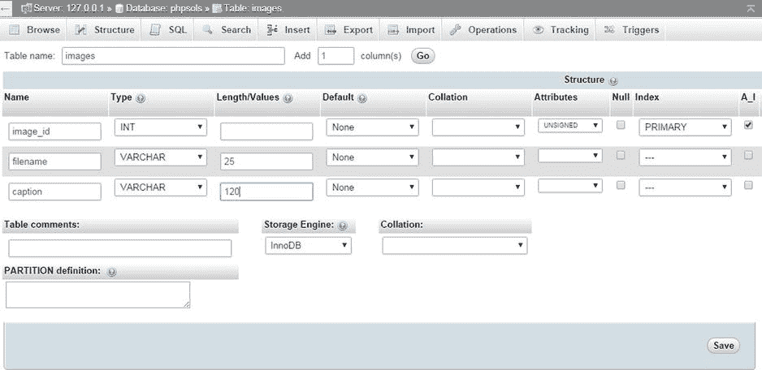
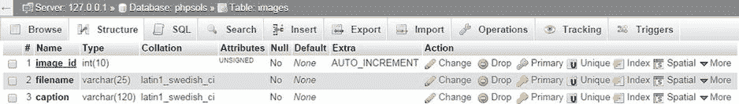

# 创建数据库表

既然你已经拥有了数据库和专用用户账户，现在可以开始创建表了。首先，我们来创建一个存储图片详情的数据表，如本章开头的图 10-1 所示。在开始输入数据之前，你需要定义表结构。这包括决定以下内容：

- 表的名称
- 包含多少列
- 每一列的名称
- 每一列将存储何种数据类型
- 各字段是否必须始终包含数据
- 哪一列作为表的主键

如果你查看图 10-1，可以看到该表包含三列：`image_id`（主键）、`filename` 和 `caption`。由于它存储的是图片详情，因此“images”是一个不错的表名。存储文件名而不附带说明意义不大，所以每列都必须包含数据。很好！除了数据类型之外，所有决定都已做出。我将在后续讲解中介绍数据类型。

## 定义 `images` 表

以下说明展示了如何在 phpMyAdmin 中定义表。如果你更倾向于使用 Navicat 或其他 MySQL 界面工具，请参照表 10-1 中的设置。

- 第一列 `image_id` 定义为类型 `INT`（代表整数）。其属性设为 `UNSIGNED`，意味着只允许正数。其索引声明为 `PRIMARY`，并且选中了 `A_I`（`AUTO_INCREMENT`）复选框，这样每当插入新记录时，MySQL 会自动在此列填入下一个可用数字（从 1 开始）。
- 下一列 `filename` 定义为类型 `VARCHAR`，长度为 `25`。这意味着它最多接受 25 个字符的文本。
- 最后一列 `caption` 也为 `VARCHAR`，长度为 `120`，因此最多接受 120 个字符的文本。
- 所有列的“Null”复选框均未选中，因此它们必须始终包含内容。不过，这个“内容”可以仅仅是一个空字符串。我将在本章后面的“选择正确的列类型”一节中更详细地介绍列类型。
- 以下截图显示了在 phpMyAdmin 中设置完成后的选项（`A_I` 右侧的列已被省略，因为它们无需填写）：

**表 10-1.** `images` 表的设置

| 字段 | 类型 | 长度/值 | 属性 | 空值 | 索引 | A_I |
| --- | --- | --- | --- | --- | --- | --- |
| `image_id` | `INT` | | `UNSIGNED` | 未选中 | `PRIMARY` | 已选中 |
| `filename` | `VARCHAR` | `25` | | 未选中 | | |
| `caption` | `VARCHAR` | `120` | | 未选中 | | |

启动 phpMyAdmin（如果尚未打开），然后从屏幕左侧的数据库列表中选择 `phpsols`。这将打开“结构”选项卡，并提示未在数据库中找到任何表。在 **创建表** 部分，在“名称”字段中输入新表的名称（`images`），并在“列数”字段中输入 3。然后点击 **执行** 按钮。下一个屏幕是你定义表的地方。这里有很多选项，但并非所有都需要填写。表 10-1 列出了 `images` 表的设置。

- 靠近屏幕底部有一个存储引擎的选项。这决定了用于内部存储数据库文件的格式。`InnoDB` 自 MySQL 5.5 起成为默认引擎。在此之前 `MyISAM` 是默认引擎。我将在第 15 章中解释这些存储引擎之间的区别。在此之前，请使用 `InnoDB`。从一种存储引擎转换到另一种非常简单。
- 完成后，点击屏幕底部的 **保存** 按钮。

**提示**

如果你点击的是 **执行** 而非 **保存**，phpMyAdmin 会添加一个额外的列供你定义。如果发生这种情况，只需点击 **保存**。只要不在字段中输入值，phpMyAdmin 就会忽略该额外列。

下一个屏幕列出了 `images` 表以及一系列可对其执行的操作。在 **操作** 下，点击 **结构**，或者点击屏幕顶部的 **结构** 选项卡。这将显示你刚刚创建的表的详细信息。

不必因为“排序规则”显示为 `latin1_swedish_ci` 而惊慌。MySQL 最初是在瑞典开发的，瑞典语的排序规则与英语（及芬兰语）相同。`image_id` 的下划线表明它是表的主键。要编辑任何设置，请点击相应行的 **更改**。这将打开之前的屏幕，并允许你修改数值。

**提示**

如果你完全搞砸了想重新开始，请点击屏幕顶部的 **操作** 选项卡。然后在 **删除数据或表** 部分，点击 **删除表 (DROP)** 并确认你要删除该表。（在 SQL 中，`delete` 仅指记录。删除表或数据库使用 `drop`。）