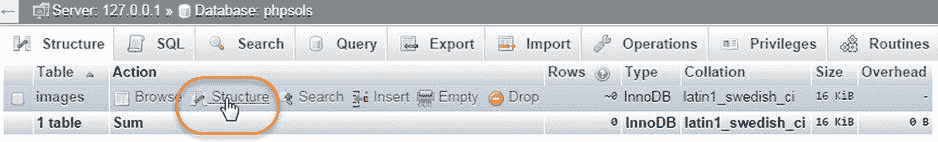
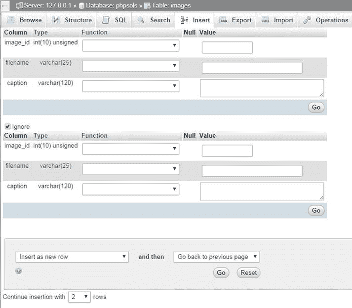
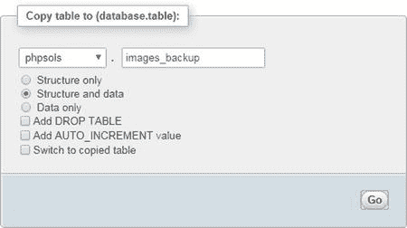
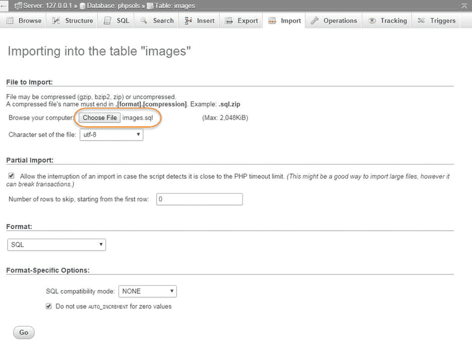
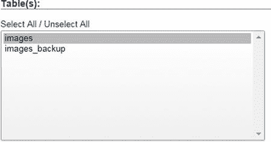
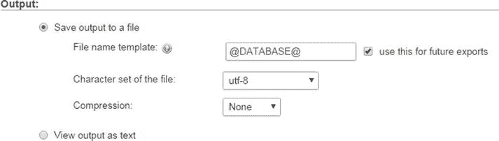
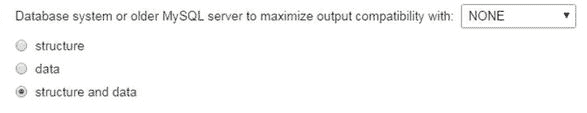
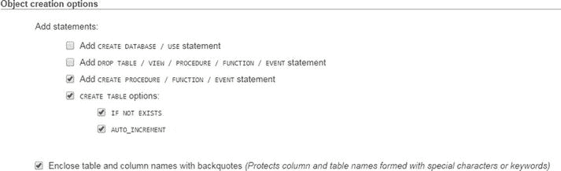
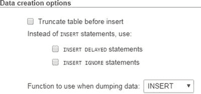

# 向表中插入记录

既然你已经有了表，就需要向其中放入一些数据。最终，你需要使用 HTML 表单、PHP 和 SQL 构建自己的内容管理系统，但使用 phpMyAdmin 是快捷简便的方法。


### 使用 phpMyAdmin 手动插入记录

以下说明介绍了如何通过 phpMyAdmin 界面将记录添加到 `images` 表中。

如果 phpMyAdmin 仍像上一节末尾那样显示 `images` 表的结构，请跳至步骤 2。否则，请启动 phpMyAdmin，并从左侧列表中选择 `phpsols` 数据库。然后，在 `images` 右侧点击 `Structure`，如下方截图所示：



**提示：** 主框架顶部的面包屑导航提供了页面顶部各选项卡的上下文背景。上方截图左上角的 `Structure` 选项卡指的是 `phpsols` 数据库的结构。要访问单个表的结构，请点击该表名称旁边的 `Structure` 链接。

点击页面顶部中央的 `Insert` 选项卡。这将显示以下界面，供您插入最多两条记录：



点击第二个表单底部的 `Go` 按钮。用于插入记录的 SQL 语句将显示在页面顶部。我将在后续章节中解释基本的 SQL 命令，但学习 phpMyAdmin 显示的 SQL 语句是掌握如何构建自己查询语句的好方法。SQL 与人类语言非常接近，因此学习起来并不困难。

点击页面左上角的 `Browse` 选项卡。您应该能看到 `images` 表中的前两条记录，如下图所示：

*   通常，当您在第二个表单中添加值时，`Ignore` 复选框会自动取消勾选，但如有必要，请手动取消勾选。

在第二个表单中，将 `image_id` 的 `Value` 字段留空，并按如下方式填写接下来的两个字段：

*   `filename`: `fountains.jpg`
*   `caption`: `Fountains in central Tokyo`

*   由于已将 `image_id` 定义为 `AUTO_INCREMENT`，MySQL 会自动插入下一个可用的数字。因此，您必须将 `image_id` 的 `Value` 字段留空。按如下方式填写接下来的两个 `Value` 字段：
    *   `filename`: `basin.jpg`
    *   `caption`: `Water basin at Ryoanji temple, Kyoto`

这些表单会显示每个列的名称和详细信息。您可以忽略 `Function` 字段。MySQL 拥有大量函数，可应用于要存储在表中的值。您将在后续章节中了解更多相关信息。`Value` 字段用于输入要插入表中的数据。


*   如您所见，MySQL 已为 `image_id` 字段插入了 `1` 和 `2`。

您可以继续输入其余六张图片的详细信息，但为了加快速度，让我们使用一个包含所有必要数据的 SQL 文件。

### 从 SQL 文件加载图片记录

由于 `images` 表的主键已设置为 `AUTO_INCREMENT`，因此需要删除该表及其所有数据。SQL 文件会自动执行此操作，并从头重建该表。以下说明假定 phpMyAdmin 已打开并停留在上一节步骤 6 的页面上。

如果您愿意覆盖 `images` 表中的数据，请直接跳至步骤 2。但是，如果您已输入不想丢失的数据，请将数据复制到另一个表。点击页面顶部的 `Operations` 选项卡，在 `Copy table to (database.table)` 部分的空白字段中输入新表的名称，然后点击 `Go`。以下截图显示了将 `images` 表的结构和数据复制到 `phpsols` 数据库中的 `images_backup` 表的设置。



点击页面顶部的 `Import` 选项卡。在下一个界面中，点击 `File to import` 中的 `Browse`（或 `Choose File`）按钮，然后导航到 `ch10` 文件夹中的 `images.sql` 文件。将所有选项保留为默认设置，并点击页面底部的 `Go`。

*   点击 `Go` 后，您应该会看到表已复制成功的确认信息。页面顶部的面包屑导航表明 phpMyAdmin 仍位于 `images` 表中，因此您可以继续执行步骤 2，即使屏幕上显示的是不同的页面。



phpMyAdmin 会删除原始表，创建一个新版本，并插入所有记录。当您看到文件已成功导入的确认信息后，点击页面左上角的 `Browse` 按钮。您现在应该可以看到与本章开头图 10-1 相同的数据。

如果您在文本编辑器中打开 `images.sql`，将会看到其中包含创建 `images` 表并填充数据的 SQL 命令。该表的构建方式如下：

```
DROP TABLE IF EXISTS `images`;

CREATE TABLE `images` (

 `image_id` int(10) unsigned NOT NULL AUTO_INCREMENT,

 `filename` varchar(25) NOT NULL,

 `caption` varchar(120) NOT NULL,

PRIMARY KEY (`image_id`)

) ENGINE=InnoDB  DEFAULT CHARSET=latin1 AUTO_INCREMENT=9 ;
```

像这样从 SQL 文件导入数据，就是将数据从本地测试环境传输到网站所在的远程服务器的方式。假设您的托管公司提供 phpMyAdmin 来管理远程数据库，那么传输数据所需做的就是启动远程服务器上的 phpMyAdmin 版本，点击 `Import` 选项卡，选择本地计算机上的 SQL 文件，然后点击 `Go`。

下一节将介绍如何创建 SQL 文件。


好的，作为一名高级文档工程师和翻译员，我将严格遵循您提供的注意事项和示例格式，将以下英文文本翻译成中文。


### 创建用于备份和数据传输的 SQL 文件

MySQL 并不会将你的数据库存储在单个文件中，让你可以简单地将其上传到你的网站。即使你找到了正确的文件，除非 MySQL 服务器已关闭，否则你很可能会损坏它们。无论如何，大多数主机公司不会允许你上传原始文件，因为这还需要关闭他们的服务器，给所有人带来极大的不便。

尽管如此，将一个数据库从一个服务器移动到另一个服务器是很容易的。这只需要创建一个数据的备份转储，然后使用 `phpMyAdmin` 或任何其他数据库管理程序将其加载到另一个数据库中。这个转储文件是一个文本文件，包含了填充单个表，乃至整个数据库所需的所有 SQL 命令。`phpMyAdmin` 可以为你的整个 MySQL 服务器、单个数据库、选定的表或单个表创建备份。

**提示**  
在你准备将数据传输到另一台服务器或创建备份之前，不需要阅读关于如何创建转储文件的细节。

为简单起见，这些说明只展示了如何备份单个数据库。

在 `phpMyAdmin` 中，从左侧的列表中选择 `phpsols` 数据库。如果该数据库已经被选中，请点击屏幕顶部的 `Database: phpsols` 面包屑导航，如下所示：


从屏幕顶部的选项卡中选择 `导出`。有两种导出方法：快速（Quick）和自定义（Custom）。快速方法对于导出文件的格式只有一个选项。默认是 SQL，所以你只需点击 `执行`，`phpMyAdmin` 就会创建 SQL 转储文件并将其保存到浏览器的默认 `下载` 文件夹。该文件与数据库同名，因此对于 `phpsols` 数据库，它被称为 `phpsols.sql`。

快速方法适用于导出少量数据，但你通常需要对导出选项进行更多控制；请选择 `自定义` 单选按钮。有很多选项，让我们逐节查看它们。

`表` 部分列出了你数据库中的所有表。默认情况下，所有表都被选中，但你可以通过点击 `取消全选`，然后在 Windows 上按住 Control 键或在 Mac 上按住 Command 键并选择你想要导出的表，来选择导出哪些表。在下面的截图中，只选择了 `images` 表，因此 `images_backup` 不会被导出。



**提示**  
通常，备份单个表而不是整个数据库是个好主意，因为大多数 PHP 服务器被配置为将上传限制在 2 MB。如下一步所述，压缩转储文件也有助于规避大小限制。

`输出` 部分有单选按钮，让你可以选择将 SQL 转储保存到文件（这是默认设置）或将输出视为文本。如果你想在创建文件之前检查生成的 SQL，将输出视为文本会很有用。



*   `文件名模板` 包含一个位于 `@` 标记之间的值。这会根据你导出的内容（是服务器、数据库还是表）自动生成文件名。这个模板的一个非常酷的特性是，你可以使用 PHP 的 `strftime()` 格式化字符来增强它（参见 [`http://php.net/manual/en/function.strftime.php`](http://php.net/manual/en/function.strftime.php)）。例如，你可以在文件扩展名之前自动添加当前日期到文件名，如下所示：

    `@DATABASE@` `_%Y-%m-%d`

*   `格式` 部分默认为 SQL，但提供了一系列其他格式，包括 CSV、JSON 和 XML。在 `格式特定选项` 中，你可以选择最大化与不同数据库系统或旧版本 MySQL 的输出兼容性。通常，该值应设置为默认值：`NONE`。
*   `文件的字符集` 的默认值是 `utf-8`。仅当你的数据以特定的区域格式存储时，你才需要更改此选项。
*   `压缩` 是一个非常有用的选项。默认情况下，转储文件不被压缩，但下拉菜单提供了使用 zip、gzip 或 bzip 压缩的选项。这可以大大减小转储文件的大小，从而加快向另一台服务器传输数据的速度。在导入压缩文件时，`phpMyAdmin` 会自动检测压缩类型并解压缩它。



`对象创建选项` 部分允许你微调用于创建数据库和表的 SQL。下面的截图显示了默认设置。

*   单选按钮为你提供了仅导出结构、仅导出数据或同时导出结构和数据的选项。默认是同时导出两者。
*   如果你选择了 `结构` 或 `数据` 单选按钮，页面上的其余一些选项将被移除。



`数据创建选项` 部分控制数据如何插入到表中。在大多数情况下，默认设置就可以了。但是，你可能对更改前四个选项感兴趣，如下面的截图所示。

*   在创建备份时，通常最好选中 `添加 DROP TABLE / VIEW / PROCEDURE / FUNCTION / EVENT 语句` 复选框，因为备份通常用于替换已损坏的现有数据。
*   最后一个复选框（默认选中）将表和列名包裹在反引号（`` ` ``）中，以避免与包含无效字符或使用保留字的名称产生问题。我建议始终勾选此选项。



当你做出所有选择后，点击页面底部的 `执行`。现在你有了一个备份，可以用来将数据库的内容传输到另一台服务器。

*   第一个复选框允许你在插入数据之前清空表。如果你想替换现有数据（例如，在数据损坏时），这会很有用。
*   另外两个复选框影响 `INSERT` 命令的执行方式。`INSERT DELAYED` 不适用于默认的 InnoDB 表。而且，它在 MySQL 5.6.6 中已被弃用，因此最好避免使用它。
*   `INSERT IGNORE` 会跳过错误，例如重复的主键。就我个人而言，我认为最好能收到错误警报，所以我不推荐使用它。
*   标记为 `转储数据时使用的函数` 的下拉菜单允许你选择 `INSERT`、`UPDATE` 或 `REPLACE`。默认是使用 `INSERT` 插入新记录。如果你选择 `UPDATE`，则仅更新现有记录。`REPLACE` 在必要时进行更新，如果新记录不存在则插入它们。

**提示**  
默认情况下，`phpMyAdmin` 创建的文件只包含用于创建和填充数据库表的 SQL 命令。除非你选择自定义选项来执行此操作，否则它不包含创建数据库的命令。这意味着你可以将表导入到任何数据库中。它的名称不需要与本地测试环境中的名称相同。

### 在 MySQL 中选择正确的数据类型

当你为 `image_id` 列选择 `类型` 时，你可能会感到有点震惊。`phpMyAdmin` 列出了所有可用的数据类型——在 MySQL 5.6 中将近有 40 种。为了避免用不必要的细节使你困惑，我将只解释那些最常用的。

你可以在 MySQL 文档中找到所有数据类型的完整详细信息，网址是 [`http://dev.mysql.com/doc/refman/5.6/en/data-types.html`](http://dev.mysql.com/doc/refman/5.6/en/data-types.html)。


### 存储文本

主要文本数据类型之间的区别，归结于单个字段可存储的最大字符数、对尾随空格的处理方式，以及是否可设置默认值。

-   `CHAR`：固定长度字符串。您必须在“长度/值”字段中指定所需长度。最大允许值为 255。在内部，字符串会用空格右填充至指定长度，但在检索值时，尾随空格会被剥离。您可以定义默认值。
-   `VARCHAR`：可变长度字符串。您必须指定计划使用的最大字符数（在 phpMyAdmin 中，在“长度/值”字段中输入该数字）。在 MySQL 5.0 之前，限制为 255。在 MySQL 5.0 中，该限制增加到了 65,535。如果存储的字符串包含尾随空格，则在检索时会保留这些空格。接受默认值。
-   `TEXT`：存储最多 65,535 个字符（大约比本章节长 50%）的文本。无法定义默认值。

`TEXT` 很方便，因为您不需要指定最大大小（实际上，您也无法指定）。尽管在 MySQL 5.0 及更高版本中 `VARCHAR` 的最大长度与 `TEXT` 相同，但其他因素可能会限制实际可存储的数量。

**提示：** 保持简单：对于较短的文本项使用 `VARCHAR`，对于较长的文本项使用 `TEXT`。

### 存储数字

最常用的数字列类型如下：

-   `INT`：介于 –2,147,483,648 和 2,147,483,647 之间的任何整数。如果列被声明为 `UNSIGNED`，则范围为 0 到 4,294,967,295。
-   `FLOAT`：浮点数。您可以选择指定两个用逗号分隔的数字来限制范围。第一个数字指定最大位数，第二个数字指定小数点后应有多少位。由于 PHP 会在计算后格式化数字，我建议您使用不带可选参数的 `FLOAT`。
-   `DECIMAL`：带小数的数字；在小数点后包含固定位数。在定义表时，您需要指定最大位数以及小数点后应有多少位。在 phpMyAdmin 中，在“长度/值”字段中输入用逗号分隔的数字。例如，`6,2` 允许范围从 –9999.99 到 9999.99 的数字。如果您不指定大小，当值存储在此类型的列中时，小数部分将被截断。

`FLOAT` 和 `DECIMAL` 的区别在于精度。浮点数被视为近似值，并且容易受到舍入误差的影响（详细解释，请参阅 [`http://dev.mysql.com/doc/refman/5.6/en/problems-with-float.html`](http://dev.mysql.com/doc/refman/5.6/en/problems-with-float.html)）。

使用 `DECIMAL` 存储货币。然而，需要注意的是，在 MySQL 5.0.3 之前，`DECIMAL` 数据类型是作为字符串存储的，因此无法与 SQL 函数（如 `SUM()`）一起用于在数据库内部执行计算。如果您使用的远程服务器运行的是较旧版本的 MySQL，请将货币以“分”为单位存储在 `INT` 列中；如果是英镑，则使用“便士”。然后使用 PHP 将结果除以 100 并按需格式化货币。更好的是，迁移到运行 MySQL 5.0 或更高版本的服务器上。

**注意：** 不要使用逗号或空格作为千位分隔符。除数字外，数字中只允许使用负号（`-`）和小数点（`.`）。

### 存储日期和时间

MySQL 仅以一种格式存储日期：`YYYY-MM-DD`。这是国际标准化组织（ISO）批准的标准，并避免了不同国家惯例固有的歧义。我将在第 14 章中回到日期这个话题。最重要的日期和时间列类型如下：

-   `DATE`：以 `YYYY-MM-DD` 格式存储的日期。范围是从 1000-01-01 到 9999-12-31。
-   `DATETIME`：以 `YYYY-MM-DD HH:MM:SS` 格式显示的日期和时间组合。
-   `TIMESTAMP`：时间戳（通常由计算机自动生成）。有效值范围从 1970 年初到 2038 年 1 月中旬的某段时间。

**注意：** MySQL 的时间戳基于人类可读的日期，并且自 MySQL 4.1 起，使用与 `DATETIME` 相同的格式。因此，它们与基于自 1970 年 1 月 1 日以来经过的秒数的 Unix 和 PHP 时间戳不兼容。请不要混淆它们。

### 存储预定义列表

MySQL 允许您存储两种类型的预定义列表，它们可以被视为数据库中单选按钮和复选框状态的等效物：

-   `ENUM`：此列类型存储来自预定义列表的单个选择，例如“是、否、不知道”或“男、女”。预定义列表中可以存储的项目最大数量是令人难以置信的 65,535——好一个单选按钮组！
-   `SET`：此列类型存储来自预定义列表的零个或多个选择。该列表最多可容纳 64 个选择。

虽然 `ENUM` 非常有用，但 `SET` 往往不那么有用，主要是因为它违反了在每个字段中仅存储一条信息的原则。它可以发挥作用的情况包括：记录汽车的选装配件或调查中的多项选择。

### 存储二进制数据

存储诸如图像之类的二进制数据并不是一个好主意。它会使您的数据库变得臃肿，并且您无法直接从数据库显示图像。但是，以下的列类型是为二进制数据设计的：

-   `TINYBLOB`：最多 255 字节
-   `BLOB`：最多 64 KB
-   `MEDIUMBLOB`：最多 16 MB
-   `LONGBLOB`：最多 4 GB

拥有如此异想天开的名字，发现 `BLOB` 代表“二进制大对象”（binary large object）时，难免会有些失望。

## 章节回顾

本章的大部分内容都致力于理论，解释了良好数据库设计的基本原则。您需要仔细规划数据库的结构，将重复信息移到单独的表中，而不是像电子表格那样，将所有要存储的信息放在一个单一的大表中。只要您为表中的每条记录提供一个唯一标识符——即它的主键——您就可以跟踪信息，并通过使用外键将其与其他表中的相关记录关联起来。使用外键的概念一开始可能难以理解，但在本书结束时应该会变得更加清晰。

您还学习了如何创建具有有限权限的 MySQL 用户账户，以及如何定义表以及如何使用 SQL 文件导入和导出数据。在下一章中，您将使用 PHP 连接到 `phpsols` 数据库，以显示 `images` 表中存储的数据。


