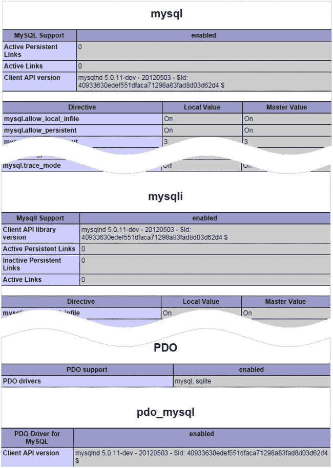
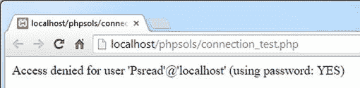
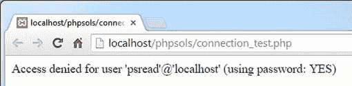
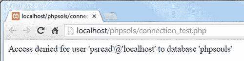
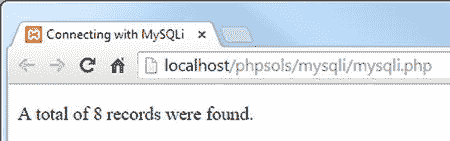
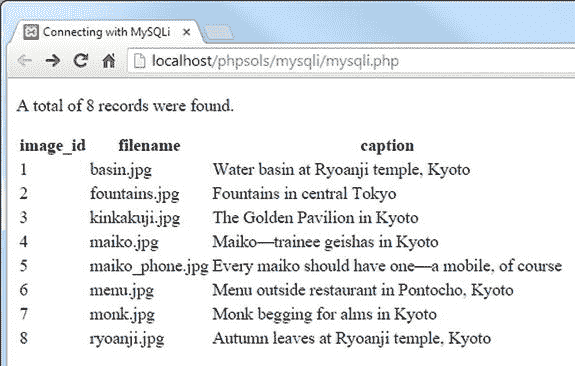

# 11. 使用 PHP 和 SQL 连接数据库

PHP 提供了三种不同的方式来连接和与 MySQL 数据库交互：原始的 MySQL 扩展、MySQL Improved（`MySQLi`）或 PHP Data Objects（`PDO`）。选择哪一种是一个重要的决定，因为它们使用不兼容的代码。你不能在同一个脚本中混用它们。原始的 MySQL 扩展在 PHP 5.5 中已被弃用，并将在未来某个未指定的日期被移除。本书不涉及它。

如果你计划只使用 MySQL（或其替代品 `MariaDB`），我推荐你使用 `MySQLi`。它专门为与 MySQL 协作而设计，并且与 `MariaDB` 完全兼容。

另一方面，如果数据库的灵活性对你很重要，请选择 `PDO`。`PDO` 的优势在于它是软件中立的。至少在理论上，你可以通过只修改几行 PHP 代码，将你的网站从 MySQL 切换到 Microsoft SQL Server 或其他数据库系统。在实践中，你通常需要重写至少部分 SQL 查询，因为每个数据库供应商都在标准 SQL 之上添加了自定义函数。

本书的其余章节将同时涵盖 `MySQLi` 和 `PDO`。如果你只想专注于其中一种，只需忽略与另一种相关的部分即可。

尽管 PHP 连接到数据库并存储任何结果，但数据库查询需要用 SQL 编写。本章教你在表中检索存储信息的基础知识。

在本章中，我们将涵盖以下内容：

*   使用 `MySQLi` 和 `PDO` 连接到 MySQL 和 MariaDB
*   计算表中的记录数
*   使用 `SELECT` 查询检索数据并在网页中显示
*   使用预处理语句和其他技术保持数据安全

## 检查你的远程服务器设置

XAMPP 和 MAMP 同时支持 `MySQLi` 和 `PDO`，但你需要检查远程服务器的 PHP 配置以验证其提供的支持程度。在你的远程服务器上运行 `phpinfo()`，滚动配置页面，并查找以下部分。它们是按字母顺序列出的，因此你需要向下滚动很长一段距离才能找到它们。



所有托管公司都应该拥有前两个部分（`mysql` 和 `mysqli`）。如果只列出了第一个，那么你的服务器已经危险地过时了。你的主机至少应该列出 `mysqli`。如果你计划使用 `PDO`，你不仅需要检查 `PDO` 是否已启用，还必须确保列出了 `pdo_mysql`。`PDO` 需要为每种类型的数据库提供不同的驱动程序。

### 厘清困惑

PHP 弃用原始 MySQL 扩展的决定，加上对 Oracle 关于 MySQL 计划的不确定性，导致一些人宣称 MySQL 已经死亡。事实并非如此。如前一章所述，MySQL 在 2014 年底排名第二的数据库。排名第一的数据库是 Oracle。一个拥有前两大数据库的公司不太可能扼杀这样一个成功的产品。即使它这样做了，`MariaDB` 也是 MySQL 的无缝替代品。

运行 MariaDB 的大部分代码是相同的，因为 MySQL 是一个开源项目。许多在 MariaDB 上工作的工程师来自最初的 MySQL 团队，因此他们非常有资格维护和开发它。MariaDB 在保持 MySQL 所有核心功能的同时，已经开始添加新功能。除非你需要 MariaDB 的新功能，否则 MySQL 和 MariaDB 是可互换的。

PHP 放弃原始 MySQL 扩展的决定完全无关。MySQL Improved（`MySQLi`）于 2004 年在 PHP 5.0 中引入，作为原始 MySQL 扩展的替代品，但 PHP 5 的缓慢采用使得无法淘汰旧函数。

尽管本书不使用原始的 MySQL 扩展，但你需要意识到它的存在，并知道如何识别使用它的脚本。原始 MySQL 扩展中的所有函数都以 `mysql_` 开头。避免使用它们的所有脚本、文章和书籍。它们现在已经完全过时了。

`MySQLi` 可以用两种方式编写：使用普通函数（过程式代码）或使用对象。在本书中，我使用 `MySQLi` 对象，因为它们涉及更少的输入。然而，如果你遇到使用 `MySQLi` 函数的其他来源，你可以识别它们，因为它们以 `mysqli_` 开头。但是，请注意：它们中的大多数都有对应的 `mysql_` 版本。例如，`mysql_connect()` 和 `mysqli_connect()`，`mysql_query()` 和 `mysqli_query()`，等等。乍一看，它们很容易混淆。名称上唯一的区别是在下划线前多了字母“i”。尽管它们相似，但从旧函数转换到新函数并不仅仅是插入那个“i”的问题。函数接受的参数通常略有不同。

最后，如果你担心 MySQL 的未来，简单的答案是学习如何使用 `PDO`。有超过 10 个主要数据库的 `PDO` 驱动程序。你可能需要对 SQL 进行一些更改以使其适用于不同的数据库，但本书中教授的所有 PHP 代码都将完全相同。

## PHP 如何与数据库通信

无论你使用 `MySQLi` 还是 `PDO`，过程总是遵循以下顺序：

1.  使用主机名、用户名、密码和数据库名称连接到数据库。
2.  准备一个 SQL 查询。
3.  执行查询并保存结果。
4.  从结果中提取数据（通常使用循环）。

用户名和密码是你刚刚创建的账户或托管公司提供给你的账户的用户名和密码。但是主机名呢？在本地测试环境中，它是 `localhost`。令人惊讶的是，即使在远程服务器上，它通常也是 `localhost`。这是因为在许多情况下，数据库服务器位于与你网站相同的服务器上。换句话说，显示页面的 Web 服务器和数据库服务器是彼此本地的。然而，如果数据库服务器位于单独的机器上，你的托管公司会告诉你使用的地址。需要理解的重要一点是，主机名与你的网站域名不同。

让我们快速看一下如何通过每种方法连接到数据库。

### 使用 MySQL Improved 扩展连接

`MySQLi` 有两个接口：过程式和面向对象式。过程式接口旨在简化从原始 MySQL 函数的过渡。由于面向对象版本更紧凑，这里采用该版本。

要连接到 MySQL 或 MariaDB，你通过向构造函数方法传递四个参数来创建一个 `mysqli` 对象：主机名、用户名、密码和数据库名称。以下是你如何连接到 `phpsols` 数据库的方法：

```php
$conn = new mysqli($hostname, $username, $password, 'phpsols');
```

这将连接对象存储为 `$conn`。

如果你的数据库服务器使用非标准端口，你需要将端口号作为第五个参数传递给 `mysqli` 构造函数。

**提示**

MAMP 使用套接字连接到 MySQL，因此即使 MySQL 在端口 8889 上监听，也无需添加端口号。这同时适用于 `MySQLi` 和 `PDO`。

### 连接 PDO

`PDO` 的使用方式略有不同。最重要的区别在于，如果连接失败，`PDO` 会抛出异常。如果不捕获这个异常，调试信息会显示所有连接细节，包括你的用户名和密码。因此，你需要将代码包裹在 `try` 块中并捕获异常，以防止敏感信息被泄露。

`PDO` 构造方法的第一个参数是数据源名称（DSN）。它是一个字符串，由 PDO 驱动名称、冒号以及 PDO 驱动特定的连接细节组成。

要连接 MySQL 或 MariaDB，DSN 需要采用以下格式：

`'mysql:host=hostname;dbname=databaseName'`

如果你的数据库服务器使用了非标准端口，DSN 还应包含端口号，如下所示：

`'mysql:host=hostname;port=portNumber;dbname=databaseName'`

在 DSN 之后，你需要将用户名和密码传递给 `PDO()` 构造方法。因此，连接到 `phpsols` 数据库的代码如下所示：

```php
try {
    $conn = new PDO("mysql:host=$hostname;dbname=phpsols", $username, $password);
} catch (PDOException $e) {
    echo $e->getMessage();
}
```

在测试期间，使用 `echo` 显示异常生成的消息是可以接受的，但当你将脚本部署到线上网站时，需要将用户重定向到一个错误页面，如 PHP 解决方案 4-8 所述。

**提示**

要连接到不同的数据库系统，PHP 代码中唯一需要修改的部分就是 DSN。其余所有 PDO 代码都是完全与数据库无关的。有关如何为 PostgreSQL、Microsoft SQL Server、SQLite 以及其他数据库系统创建 DSN 的详细信息，请参阅 [`http://php.net/manual/en/pdo.drivers.php`](http://php.net/manual/en/pdo.drivers.php)。

### PHP 解决方案 11-1：创建可复用的数据库连接器

连接数据库是一项常规工作，从现在开始，每个页面都需要执行此操作。本 PHP 解决方案创建了一个存储在外部文件中的简单函数，用于连接数据库。它主要是为了方便在后续章节中测试不同的 MySQLi 和 PDO 脚本，而无需每次重新输入连接细节或在不同的连接文件之间切换。

在 `includes` 文件夹中创建一个名为 `connection.php` 的文件，并插入以下代码（`ch11` 文件夹中有一个完整的脚本副本）：

```php
<?php
function dbConnect($usertype, $connectionType = 'mysqli') {
    $host = 'localhost';
    $db = 'phpsols';
    if ($usertype == 'read') {
        $user = 'psread';
        $pwd = 'K1y0mi$u';
    } elseif ($usertype == 'write') {
        $user = 'pswrite';
        $pwd = '0Ch@Nom1$u';
    } else {
        exit('Unrecognized user');
    }
    // 连接代码写在这里
}
```

将 `连接代码写在这里` 注释替换为以下代码：

*   该函数接受两个参数：用户类型和连接类型。第二个参数默认为 `mysqli`。如果你希望专注于使用 PDO，可以将第二个参数的默认值设置为 `pdo`。

*   函数内部的前两行存储了要连接的主机服务器和数据库名称。

*   条件语句检查第一个参数的值，并在 `psread` 和 `pswrite` 用户名及密码之间进行切换。如果用户账户无法识别，`exit()` 函数会停止脚本并显示 `Unrecognized user`。

```php
if ($connectionType == 'mysqli') {
    $conn = @ new mysqli($host, $user, $pwd, $db);
    if ($conn->connect_error) {
        exit($conn->connect_error);
    }
    return $conn;
} else {
    try {
        return new PDO("mysql:host=$host;dbname=$db", $user, $pwd);
    } catch (PDOException $e) {
        echo $e->getMessage();
    }
}
```

*   如果第二个参数设置为 `mysqli`，则会创建一个名为 `$conn` 的 MySQLi 连接对象。错误控制运算符（`@`）可以防止构造方法显示错误消息。如果连接失败，原因会存储在对象的 `connect_error` 属性中。如果该属性为空，则被视为 `false`，因此会跳过下一行，并返回 `$conn` 对象。但如果出现问题，`exit()` 会显示 `connect_error` 的值并终止脚本。

*   否则，该函数返回一个 PDO 连接对象。无需对 `PDO` 构造方法使用错误控制运算符，因为如果有问题，它会抛出 `PDOException`。`catch` 块使用异常的 `getMessage()` 方法来显示问题的原因。

**提示**

如果你的数据库服务器使用了非标准端口，请不要忘记将端口号作为第五个参数添加到 `mysqli()` 构造方法中，并将其包含在 PDO 的 DSN 中，如前几节所述。如果数据库使用套接字连接（这在 Mac OS X 和 Linux 上很常见），则无需此操作。

在 `phpsols` 站点根文件夹中创建一个名为 `connection_test.php` 的文件，并插入以下代码：

```php
<?php
require_once './includes/connection.php';
if ($conn = dbConnect('read')) {
    echo 'Connection successful';
}
```

这将包含连接脚本，并使用 `psread` 用户账户和 MySQLi 进行测试。

保存页面并在浏览器中加载。如果你看到 `Connection successful`，则一切正常。如果收到错误消息，请参阅下一节的故障排除提示。

使用 `pswrite` 用户和 MySQLi 测试连接：

```php
if ($conn = dbConnect('write')) {
    echo 'Connection successful';
}
```

通过向 `dbConnect()` 添加第二个参数 `'pdo'`，使用 PDO 测试两个用户账户。

假设一切顺利，你就可以开始与 `phpsols` 数据库进行交互了。如果遇到问题，请查看下一节。

### 数据库连接问题故障排除

连接数据库失败最常见的原因是用户名或密码错误。密码和用户名区分大小写。请仔细检查拼写。例如，以下截图展示了如果将 `psread` 改为 `Psread` 会发生什么。



访问被拒绝，因为没有这样的用户。用户名开头的字母大小写至关重要。但即使用户名正确，你也可能会收到类似的错误消息，如下所示：



这让很多人感到困惑。错误消息确认你正在使用密码。那么为什么访问会被拒绝呢？这是因为密码错误。

如果错误消息显示 `using password: NO`，表示你忘记提供密码了。`using password` 这个短语是提示问题与登录凭据相关。

当该短语缺失时，则表明是另一个问题，如下图所示。



这里的问题是数据库名称不正确。如果你拼错了主机，你会收到一条消息，提示没有这样的主机。

本节中的截图由 MySQLi 生成。PDO 会生成相同的消息，但还会包含错误编号和代码。

### 查询数据库并显示结果

在尝试显示数据库查询结果之前，最好先确定结果的数量。如果没有结果，你就无从显示。此外，在为长结果集创建分页导航系统时，也需要知道结果数量（你将在下一章学习如何实现）。在用户身份验证中（详见第 17 章），如果搜索用户名和密码时没有结果，则意味着登录应该失败。

`MySQLi` 和 `PDO` 在计数和显示结果时使用了不同的方法。接下来的两个 PHP 解决方案展示了如何使用 `MySQLi` 实现。至于 `PDO`，请直接跳到 PHP 解决方案 11-4。

#### PHP 解决方案 11-2：统计结果集中的记录数（MySQLi）

本 PHP 解决方案演示如何提交一条 SQL 查询，该查询选择 `images` 表中的所有记录，并将结果存储在 `MySQLi_Result` 对象中。该对象的 `num_rows` 属性包含查询检索到的记录数。

在 `phpsols` 站点根目录下创建一个名为 `mysqli` 的新文件夹，然后在该文件夹内创建一个名为 `mysqli.php` 的新文件。该页面最终将用于显示表格，因此它应包含 `DOCTYPE` 声明和 HTML 骨架。在 `DOCTYPE` 声明上方的 PHP 代码块中包含连接文件，并使用只读权限的账户连接到 `phpsols` 数据库，如下所示：

`require_once '../includes/connection.php';`

`$conn = dbConnect('read');`

接下来，准备 SQL 查询。在上一步之后（但在关闭 PHP 标签之前）立即添加此代码：

`$sql = 'SELECT * FROM images';`

这表示“从 `images` 表中选择所有数据”。星号（`*`）是“所有列”的简写。

现在，通过调用连接对象的 `query()` 方法并将 SQL 查询作为参数传递来执行查询，如下所示：

`$result = $conn->query($sql);`

结果存储在一个变量中，我将其命名为 `$result`。

如果出现问题，`$result` 将为 `false`。要找出问题所在，我们需要获取错误消息，该消息存储在 `mysqli` 连接对象的 `error` 属性中。在前一行之后添加以下条件语句：

```php
if (!$result) {
    $error = $conn->error;
}
```

假设没有问题，`$result` 现在持有一个 `MySQLi_Result` 对象，它有一个名为 `num_rows` 的属性。要获取查询找到的记录数，请在条件语句中添加一个 `else` 块，并将该值赋给一个变量，如下所示：

```php
if (!$result) {
    $error = $conn->error;
} else {
    $numRows = $result->num_rows;
}
```

你现在可以在页面主体中像这样显示结果：

```php
<?php
if (isset($error)) {
    echo "<p>$error</p>";
} else {
    echo "<p>A total of $numRows records were found.</p>";
}
?>
```

保存 `mysqli.php` 并在浏览器中加载它。你应该会看到以下结果：

- 如果出现问题，`$error` 将被设置，因此会显示出来。否则，`else` 块会显示找到的记录数。这两个字符串都嵌入了变量，因此它们用双引号括起来。



如有必要，请与 `ch11` 文件夹中的 `mysqli_01.php` 核对你的代码。

### PHP 解决方案 11-3：使用 MySQLi 显示 images 表

显示 `SELECT` 查询结果的最常见方法是使用循环一次从结果集中提取一行。`MySQLi_Result` 有一个名为 `fetch_assoc()` 的方法，它将当前行作为关联数组检索出来，以便在网页中显示。数组中的每个元素都以表中相应列的名称命名。

本 PHP 解决方案演示如何循环遍历 `MySQLi_Result` 对象以显示 `SELECT` 查询的结果。继续使用 PHP 解决方案 11-2 中的文件。

删除页面主体中 `else` 块末尾的右花括号（大约在第 25 行）。虽然显示 `images` 表的代码大部分是 HTML，但它需要位于 `else` 块内部。在闭合的 PHP 标签后插入一个空行，并在下一行的单独 PHP 块中添加右花括号。修改后的代码应如下所示：

```php
} else {
    echo "<p>A total of $numRows records were found.</p>";
?>
<?php } ?>
```

在 `mysqli.php` 主体中的两个 PHP 块之间添加以下表格，使其受 `else` 块控制。这样做的目的是防止 SQL 查询失败时出现错误。显示结果集的 PHP 代码以粗体突出显示。

```php
<table>
    <tr>
        <th>image_id</th>
        <th>filename</th>
        <th>caption</th>
    </tr>
    <?php while ($row = $result->fetch_assoc()) { ?>
    <tr>
        <td><?= $row['image_id']; ?></td>
        <td><?= $row['filename']; ?></td>
        <td><?= $row['caption']; ?></td>
    </tr>
    <?php } ?>
</table>
```

`while` 循环遍历数据库结果，使用 `fetch_assoc()` 方法将每条记录提取到 `$row` 中。`$row` 的每个元素都显示在一个表格单元格中。循环持续进行，直到 `fetch_assoc()` 到达结果集的末尾。

保存 `mysqli.php` 并在浏览器中查看。你应该会看到 `images` 表的内容显示出来，如下面的屏幕截图所示：



如有必要，你可以将你的代码与 `ch11` 文件夹中的 `mysql_02.php` 进行比较。

### MySQLi 连接备忘单

表 11-1 总结了 `MySQLi` 连接和数据库查询的基本细节。

**表 11-1.** 使用 MySQL 改进版面向对象接口连接到 MySQL/MariaDB

| 操作 | 用法 | 注释 |
| --- | --- | --- |
| 连接 | `$conn = new mysqli($h,$u,$p,$d);` | 所有参数均为可选；实践中始终需要前四个参数：主机名、用户名、密码、数据库名。创建连接对象。 |
| 选择数据库 | `$conn->select_db('dbName');` | 用于选择不同的数据库。 |
| 提交查询 | `$result = $conn->query($sql);` | 返回结果对象。 |
| 统计结果 | `$numRows = $result->num_rows;` | 返回结果对象中的行数。 |
| 提取记录 | `$row = $result->fetch_assoc();` | 将当前行作为关联数组从结果对象中提取出来。 |
| 提取记录 | `$row = $result->fetch_row();` | 将当前行作为索引（编号）数组从结果对象中提取出来。 |

### PHP 解决方案 11-4：计算结果集中的记录数（PDO）

PDO 没有与 MySQLi 的 `num_rows` 属性直接对应的功能。对于大多数数据库，你需要执行一条 SQL 查询来计算表中项目的数量，然后获取结果。然而，PDO 的 `rowCount()` 方法在 MySQL 和 MariaDB 中具有双重用途。通常，它仅报告插入、更新或删除记录所影响的行数，但在 MySQL 和 MariaDB 中，它还能报告 `SELECT` 查询找到的记录数。

在 `phpsols` 站点中创建一个名为 `pdo` 的新文件夹。然后在你刚刚创建的文件夹中创建一个名为 `pdo.php` 的文件。该页面最终将用于显示一个表格，因此它应包含 `DOCTYPE` 声明和 HTML 骨架。在 `DOCTYPE` 声明上方的 PHP 代码块中包含连接文件，然后使用只读账户创建到 `phpsols` 数据库的 PDO 连接，如下所示：

```
require_once '../includes/connection.php';
$conn = dbConnect('read', 'pdo');
```

接下来，准备 SQL 查询：

```
$sql = 'SELECT * FROM images';
```

现在执行查询并将结果存储在一个变量中，如下所示：

-   这意味着“选择 `images` 表中的所有记录。”星号 (`*`) 是“所有列”的简写形式。

```
$result = $conn->query($sql);
```

要检查查询是否存在问题，你可以使用连接对象的 `errorInfo()` 方法从数据库获取错误信息数组。仅当出现问题时，才会创建该数组的第三个元素。将以下代码添加到脚本中：

```
$errorInfo = $conn->errorInfo();
if (isset($errorInfo[2])) {
    $error = $errorInfo[2];
}
```

要获取结果集中的行数，创建一个 `else` 块并在 `$result` 对象上调用 `rowCount()` 方法，如下所示：

-   `$conn->errorInfo()` 生成的数组存储为 `$errorInfo`，因此你可以通过使用 `isset()` 检查 `$errorInfo[2]` 是否已定义来判断是否出现任何问题。如果已定义，则将错误信息赋值给 `$error`。

```
if (isset($errorInfo[2])) {
    $error = $errorInfo[2];
} else {
    $numRows = $result->rowCount();
}
```

现在你可以在页面主体中显示查询结果，如下所示：

```
<?php
if (isset($error)) {
    echo "<p>$error</p>";
} else {
    echo "<p>共找到 $numRows 条记录。</p>";
}
?>
```

保存页面并在浏览器中加载。你应该会看到与 PHP 解决方案 11-2 步骤 8 相同的结果。如有必要，可将你的代码与 `pdo_01.php` 进行对照检查。

### 在其他数据库中使用 PDO 统计记录数

使用 PDO 的 `rowCount()` 来报告 `SELECT` 查询找到的记录数在 MySQL 和 MariaDB 中均有效，但无法保证在所有其他数据库上都能工作。如果 `rowCount()` 不起作用，请改用以下代码：

```
// 准备 SQL 查询
$sql = 'SELECT COUNT(*) FROM images';
// 提交查询并捕获结果
$result = $conn->query($sql);
$errorInfo = $conn->errorInfo();
if (isset($errorInfo[2])) {
    $error = $errorInfo[2];
} else {
    // 找出检索到了多少条记录
    $numRows = $result->fetchColumn();
    // 释放数据库资源
    $result->closeCursor();
}
```

这段代码使用带星号的 SQL `COUNT()` 函数来计算表中的所有项目。结果只有一个，因此可以使用 `fetchColumn()` 方法检索，该方法从数据库结果中获取第一列。将结果存储在 `$numRows` 中后，你必须调用 `closeCursor()` 方法来释放数据库资源，以便进行任何后续查询。

### PHP 解决方案 11-5：使用 PDO 显示 images 表

要使用 PDO 显示 `SELECT` 查询的结果，你可以在 `foreach` 循环中使用 `query()` 方法，将当前行作为关联数组提取出来。数组中的每个元素以表中相应的列名命名。

继续处理上一个 PHP 解决方案中的同一个文件。

删除页面主体中 `else` 块末尾的右花括号（大约在第 26 行）。尽管显示 `images` 表的大部分代码是 HTML，但它需要位于 `else` 块内部。在结束 PHP 标签后插入一个空行，然后在下一行的一个单独 PHP 代码块中添加右花括号。修改后的代码应如下所示：

```
} else {
    echo "<p>共找到 $numRows 条记录。</p>";
?>
<?php } ?>
</body>
```

在 `pdo.php` 页面主题的两个 PHP 代码块之间添加以下表格，使其受 `else` 块控制。这是为了防止 SQL 查询失败时出现错误。显示结果集的 PHP 代码以粗体显示。

```
<table>
<tr>
    <th>image_id</th>
    <th>文件名</th>
    <th>说明</th>
</tr>
<?php foreach ($conn->query($sql) as $row) { ?>
<tr>
    <td><?php echo $row['image_id']; ?></td>
    <td><?php echo $row['filename']; ?></td>
    <td><?php echo $row['caption']; ?></td>
</tr>
<?php } ?>
</table>
```

保存页面并在浏览器中查看。它应该看起来像 PHP 解决方案 11-3 中的截图。你可以将你的代码与 `ch11` 文件夹中的 `pdo_02.php` 进行对照。

### PDO 连接速查表

表 11-2 总结了使用 PDO 进行连接和数据库查询的基本细节。一些命令将在后续章节中使用，但这里列出以便于参考。

**表 11-2.** 使用 PDO 进行数据库连接

| 操作 | 用法 | 说明 |
| --- | --- | --- |
| 连接 | `$conn = new PDO($DSN,$u,$p);` | 实践中需要三个参数：数据源名称（DSN）、用户名、密码。必须包裹在 `try/catch` 块中。 |
| 提交 `SELECT` 查询 | `$result = $conn->query($sql);` | 将结果作为 `PDOStatement` 对象返回。 |
| 提取记录 | `foreach($conn->query($sql) as $row) {` | 在一次操作中提交 `SELECT` 查询并以关联数组形式获取当前行。 |
| 统计结果数 | `$numRows = $result->rowCount()` | 在 MySQL/MariaDB 中，返回 `SELECT` 查询的结果数。大多数其他数据库不支持。 |
| 获取单个结果 | `$item = $result->fetchColumn();` | 获取结果第一列中的第一条记录。要从其他列获取结果，请使用列号（从 0 开始计数）作为参数。 |
| 获取下一条记录 | `$row = $result->fetch();` | 从结果集中以关联数组形式获取下一行。 |
| 释放数据库资源 | `$result->closeCursor();` | 释放连接以允许新查询。 |
| 提交非 `SELECT` 查询 | `$affected = $conn->exec($sql);` | 虽然 `query()` 可用于非 `SELECT` 查询，但 `exec()` 返回受影响的行数。 |

## 使用 SQL 与数据库交互

正如你刚才所见，PHP 连接到数据库、发送查询并接收结果，但查询本身需要用 SQL 编写。尽管 SQL 是一个通用标准，但存在许多 SQL 方言。包括 MySQL 在内的每个数据库供应商都对标准语言进行了扩展。这些扩展提高了效率和功能，但通常与其他数据库不兼容。本书中的 SQL 适用于 MySQL 5.1 或更高版本，但不一定能移植到 Microsoft SQL Server、Oracle 或其他数据库。

### 编写 SQL 查询

SQL 语法规则不多，而且所有规则都非常简单。