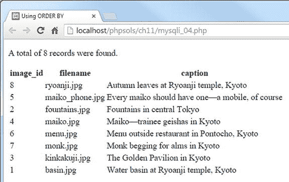
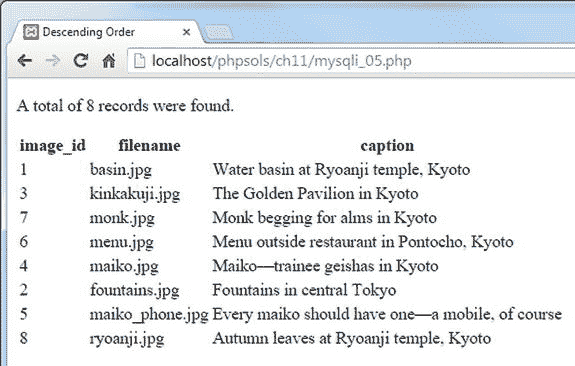
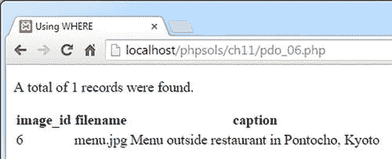
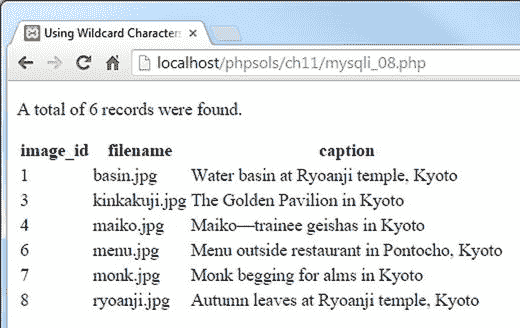
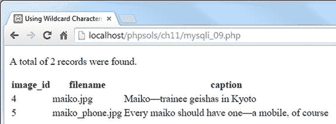

# 处理数字

作为一般规则，数字不应加引号，因为引号内的任何内容都是字符串。然而，MySQL 接受用引号括起来的数字，并将其视为等效的数字。务必将实数与由数字组成的其他数据类型区分开来。例如，日期由数字组成，但应括在引号中并存储在日期相关的列类型中。同样，电话号码应括在引号中并存储在文本相关的列类型中。

> **注意：** SQL 查询通常以分号结尾，这是指示数据库执行查询的指令。使用 PHP 时，必须从 SQL 语句中省略分号。因此，本书中的独立 SQL 示例均不包含结尾分号。

## 优化 SELECT 查询检索的数据

到目前为止，您唯一运行过的 SQL 查询是从 `images` 表中检索所有记录。在大多数情况下，您希望更具选择性。

### 选择特定列

使用星号选择所有列是一种方便的快捷方式，但通常您应该只指定所需的列。在 `SELECT` 关键字后列出以逗号分隔的列名。例如，此查询仅为每条记录选择 `filename` 和 `caption` 字段：

```sql
SELECT filename, caption FROM images
```

您可以在 `ch11` 文件夹中的 `mysqli_03.php` 和 `pdo_03.php` 文件中测试此查询。

### 更改结果的顺序

要控制排序顺序，请添加一个 `ORDER BY` 子句，后跟按优先级顺序排列的列名。多个列名之间用逗号分隔。以下查询按字母顺序对 `images` 表中的标题进行排序（代码在 `mysqli_04.php` 和 `pdo_04.php` 中）：

```php
$sql = 'SELECT * FROM images ORDER BY caption';
```

> **注意：** 此分号是 PHP 语句的一部分，而不是 SQL 查询的一部分。

前面的查询产生以下输出：



要反转排序顺序，请添加 `DESC`（表示“降序”）关键字，如下所示（在 `mysqli_05.php` 和 `pdo_05.php` 中有示例）：

```php
$sql = 'SELECT * FROM images ORDER BY caption DESC';
```



还有一个 `ASC`（表示“升序”）关键字。这是默认排序顺序，因此通常省略。

但是，当同一个表中的列按不同顺序排序时，指定 `ASC` 可以提高清晰度。例如，如果您每天发布多篇文章，可以使用以下查询按字母顺序显示标题，但按发布日期排序，最新的在前：

```sql
SELECT * FROM articles
ORDER BY published DESC, title ASC
```

### 搜索特定值

要搜索特定值，请在 `SELECT` 查询中添加一个 `WHERE` 子句。`WHERE` 子句位于表名之后。例如，`mysqli_06.php` 和 `pdo_06.php` 中的查询如下所示：

```php
$sql = 'SELECT * FROM images
WHERE image_id = 6';
```

> **注意：** SQL 使用一个等号来测试相等性，这与 PHP 使用两个等号不同。

它产生以下结果：



除了测试相等性之外，`WHERE` 子句还可以使用比较运算符，例如大于 (`>`) 和小于 (`<`)。现在先不逐一介绍所有选项，我将在需要时介绍其他选项。第 13 章全面总结了四个主要的 SQL 命令：`SELECT`、`INSERT`、`UPDATE` 和 `DELETE`，包括与 `WHERE` 一起使用的主要比较运算符列表。

如果与 `ORDER BY` 结合使用，`WHERE` 子句必须放在前面。例如（代码在 `mysqli_07.php` 和 `pdo_07.php` 中）：

```php
$sql = 'SELECT * FROM images
WHERE image_id > 5
ORDER BY caption DESC';
```

这将选择 `image_id` 大于 5 的三张图片，并按标题降序排序。

### 使用通配符搜索文本

在 SQL 中，百分号（`%`）是一个通配符，可以匹配任何内容或不匹配任何内容。它在 `WHERE` 子句中与 `LIKE` 关键字结合使用。

`mysqli_08.php` 和 `pdo_08.php` 中的查询如下所示：

```php
$sql = 'SELECT * FROM images
WHERE caption LIKE "%Kyoto%"';
```

它搜索 `images` 表中所有 `caption` 列包含“Kyoto”的记录，并产生以下结果：



如前面的屏幕截图所示，它从 `images` 表的八条记录中找到了六条。所有标题都以“Kyoto”结尾，因此结尾的通配符不匹配任何内容，而开头的通配符匹配每个标题的其余部分。

如果您省略开头的通配符（`"Kyoto%"`），查询将搜索以“Kyoto”开头的标题。没有标题以它开头，因此您将无法获得任何搜索结果。

`mysqli_09.php` 和 `pdo_09.php` 中的查询如下所示：

```php
$sql = 'SELECT * FROM images
WHERE caption LIKE "%maiko%"';
```

它产生以下结果：



该查询将“maiko”全部拼写为小写，但查询也找到了首字母大写的记录。使用 `LIKE` 进行通配符搜索不区分大小写。

要执行区分大小写的搜索，您需要添加 `BINARY` 关键字，如下所示（代码在 `mysqli_10.php` 和 `pdo_10.php` 中）：

```php
$sql = 'SELECT * FROM images
WHERE caption LIKE BINARY "%maiko%"';
```

到目前为止，您看到的所有示例都是硬编码的，但大多数情况下，SQL 查询中使用的值需要来自用户输入。除非您非常小心，否则这会使您面临称为 SQL 注入的恶意攻击风险。本章的其余部分将解释这种危险以及如何避免它。