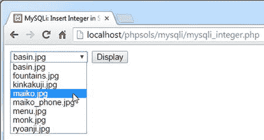
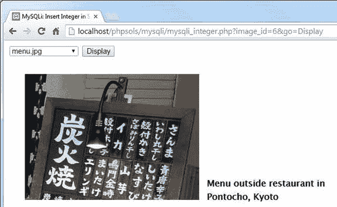
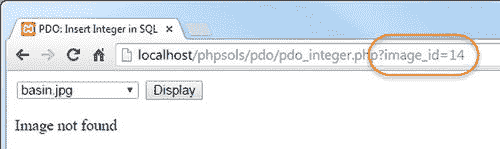
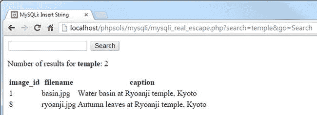
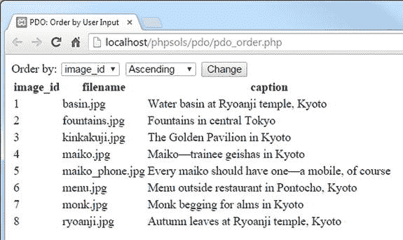

# 理解 SQL 注入的危险

SQL 注入与我在第 5 章中警告过的邮件头注入非常相似。注入攻击试图在 SQL 查询中插入虚假条件，从而暴露或破坏你的数据。以下查询的含义应该很容易理解：

```sql
SELECT * FROM users WHERE username = 'xyz' AND pwd = 'abc'
```

这是登录应用程序的基本模式。如果查询找到了一个记录，其中 `username` 为 `xyz` 且 `pwd` 为 `abc`，你就知道提交了正确的用户名和密码组合，因此登录成功。攻击者需要做的只是注入一个额外的条件，就像这样：

```sql
SELECT * FROM users WHERE username = 'xyz' AND pwd = 'abc' OR 1 = 1
```

`OR` 意味着只需要其中一个条件为真，因此即使没有正确的用户名和密码，登录也会成功。SQL 注入依赖于引号和其他控制字符在查询部分来自变量或用户输入时没有被正确转义。

根据具体情况，你可以采用多种策略来防止 SQL 注入：

*   如果变量是整数（例如，记录的主键），使用 `is_numeric()` 和 `(int)` 类型转换运算符，确保其在插入查询时是安全的。

*   如果使用 MySQLi，在将每个变量插入查询之前，将其传递给 `real_escape_string()` 方法。

*   与 `real_escape_string()` 对应的 PDO 方法是 `quote()`，但它并非适用于所有数据库。PDO 文档建议不要使用 `quote()`，强烈推荐改用预处理语句。

*   使用预处理语句。在预处理语句中，SQL 查询中的占位符代表来自用户输入的值。PHP 代码会自动将字符串包裹在引号中，并转义嵌入的引号和其他控制字符。MySQLi 和 PDO 的语法不同。

*   上述策略均不适用于列名，因为列名不能放在引号中。要对列名使用变量，需创建一个可接受值的数组，并在将提交的值插入查询之前检查该值是否在数组中。

除了 `quote()` 之外，我们来看一下每种技术的使用方法。

## PHP 解决方案 11-6：将用户输入的整数插入到查询中

此 PHP 解决方案演示了如何在将来自用户输入的变量插入 SQL 查询之前，对其进行清理以确保其仅包含整数。该技术对于 MySQLi 和 PDO 是相同的。

从 `ch11` 文件夹中将 `mysqli_integer_01.php` 或 `pdo_integer_01.php` 复制到 `mysqli` 或 `pdo` 文件夹。每个文件都包含一个 SQL 查询，用于从 `images` 表中选择 `image_id` 和 `filename` 列。在页面主体中，有一个带有下拉菜单的表单，该菜单由一个循环填充，循环遍历 SQL 查询的结果。MySQLi 版本如下所示：

```php
<form action="" method="get">

<select name="image_id">

<?php while ($row = $images->fetch_assoc()) { ?>

<option value="<?= $row['image_id']; ?>"

<?php if (isset($_GET['image_id']) &&

$_GET['image_id'] == $row['image_id']) {

echo 'selected';

} ?>

><?= $row['filename']; ?></option>

<?php } ?>

</select>

<input type="submit" name="go" value="Display">

</form>
```

*   表单使用 `get` 方法，并将 `image_id` 赋值给 `<option>` 标签的 `value` 属性。如果 `$_GET['image_id']` 与 `$row['image_id']` 的值相同，则当前 `image_id` 与通过页面查询字符串传递的相同，因此会向开头的 `<option>` 标签添加 `selected` 属性。`$row['filename']` 的值会被插入到开头的 `<option>` 和结尾的 `</option>` 标签之间。

*   PDO 版本是相同的，只是它使用 PDO 的 `fetch()` 方法直接在 `foreach` 循环中运行查询。

*   如果将页面加载到浏览器中，你会看到一个下拉菜单，其中列出了 `images` 文件夹中的文件，效果如下：



在 `</form>` 标签之后立即插入以下代码。除了一行代码之外，该代码对于 MySQLi 和 PDO 是相同的。

```php
<?php

if (isset($_GET['image_id'])) {

if (!is_numeric($_GET['image_id'])) {

$image_id = 1;

} else {

$image_id = (int) $_GET['image_id'];

}

$sql = "SELECT filename, caption FROM images

WHERE image_id = $image_id";

$result = $conn->query($sql);

$row = $result->fetch_assoc();

?>

<figure>">

<figcaption><?= $row['caption']; ?></figcaption>

</figure>

<?php } ?>
```

如果你使用的是 PDO 版本，请找到这一行：

*   条件语句检查 `image_id` 是否通过 `$_GET` 数组发送。如果是，下一个条件语句使用逻辑非运算符与 `is_numeric()` 来检查它是否不是数字。`is_numeric()` 函数应用了严格测试，只接受数字或数字字符串。如果值以数字开头，它不会尝试将其转换为数字。

*   如果通过查询字符串提交的值不是数字，则会将默认值赋给一个名为 `$image_id` 的新变量。然而，如果 `$_GET['image_id']` 是数字，则使用 `(int)` 类型转换运算符将其赋值给 `$image_id`。使用类型转换运算符是一项额外的预防措施，以防有人通过提交浮点数来探测脚本的错误信息。

*   既然你知道 `$image_id` 是一个整数，将其直接插入 SQL 查询是安全的。因为它是一个数字，所以不需要用引号包裹，但赋值给 `$sql` 的字符串需要使用双引号，以确保 `$image_id` 的值被插入到查询中。

*   新查询通过 `query()` 方法提交给 MySQL，结果存储在 `$row` 中。最后，`$row['filename']` 和 `$row['caption']` 用于在页面中显示图像及其标题。

`$row = $result->fetch_assoc();`

将其更改为：

```php
$row = $result->fetch();
```

保存页面并在浏览器中加载。页面首次加载时，只显示下拉菜单。从下拉菜单中选择一个文件名，然后点击“Display”。您选择的图像应显示出来，如下面的截图所示：



- 像这样修改 MySQLi 的代码：

在浏览器中编辑查询字符串，将 `image_id` 的值改为一个字符串，或以数字开头的字符串。您应该会看到 `basin.jpg`，其 `image_id` 为 1。尝试一个介于 1.0 和 8.9 之间的浮点数。相关图像会正常显示。尝试一个超出 1 到 8 范围的数字。由于查询本身没有问题，因此不会显示错误消息。它只是在寻找一个不存在的值。在这个示例中，这无关紧要，但通常情况下，您应该使用 MySQLi 的 `num_rows` 属性或 PDO 的 `rowCount()` 方法来检查查询返回的行数。

- 如果遇到问题，请对照 `ch11` 文件夹中的 `mysqli_integer_02.php` 或 `pdo_integer_02.php` 检查您的代码。

```php
$result = $conn->query($sql);
if ($result->num_rows) {
$row = $result->fetch_assoc();
?>
<figure>">
<figcaption><?= $row['caption']; ?></figcaption>
</figure>
<?php } else { ?>
<p>Image not found</p>
<?php }
} ?>
```

再次测试页面。当您从下拉菜单中选择图像时，它会像以前一样正常显示。但如果您在查询字符串中输入一个超出范围的值，则会看到以下信息：

- 对于 PDO，使用 `$result->rowCount()` 代替 `$result->num_rows`。

- 如果查询没有返回任何行，PHP 会将 0 隐式视为 `false`，因此条件判断失败，转而执行 `else` 子句。



修改后的代码位于 `ch11` 文件夹中的 `mysqli_integer_03.php` 和 `pdo_integer_03.php`。

### PHP 解决方案 11-7：使用 `real_escape_string()` 在 MySQLi 中插入字符串

本 PHP 解决方案展示了如何使用 MySQLi 的 `real_escape_string()` 方法将搜索表单中的值插入到 SQL 查询中。除了处理单引号和双引号之外，它还会转义其他控制字符，例如换行符和回车符。

提示

仅当需要将来自外部源的一两个字符串值插入到查询中，或者该查询仅使用一次时，此 MySQLi 专属技术才更有用。对于更复杂的查询，请使用准备好的语句，如下一节所述。要在 PDO 中嵌入字符串，始终建议使用准备好的语句。

从 `ch11` 文件夹复制 `mysqli_real_escape_01.php`，并将其保存到 `mysqli` 文件夹中，命名为 `mysql_real_escape.php`。该文件包含一个搜索表单和一个用于显示结果的表格。在 `DOCTYPE` 声明之上的 PHP 代码块中添加以下代码：

```php
if (isset($_GET['go'])) {
require_once '../includes/connection.php';
$conn = dbConnect('read');
$searchterm = '%' . $conn->real_escape_string($_GET['search']) . '%';
}
```

在下一行（右花括号之前）添加 `SELECT` 查询：

```php
$sql = "SELECT * FROM images WHERE caption LIKE '$searchterm'";
```

- 如果表单已提交，这将包含连接文件并为只读用户帐户建立连接。然后，将 `$_GET['search']` 传递给连接对象的 `real_escape_string()` 方法，使其能够安全地合并到 SQL 查询中，并在结果两端连接 `%` 通配符，然后将结果赋值给 `$searchterm`。因此，如果通过搜索表单提交的值是“hello”，则 `$searchterm` 变为 `%hello%`。

执行查询并通过在前一行之后添加以下代码来获取返回的行数：

- 整个查询被包裹在双引号中，以便包含 `$searchterm` 的值。但是，`$searchterm` 包含一个字符串，因此它也需要用引号包裹。为避免冲突，请在 `$searchterm` 周围使用单引号。

```php
$result = $conn->query($sql);
if (!$result) {
$error = $conn->error;
} else {
$numRows = $result->num_rows;
}
```

在表单上方插入一个 PHP 代码块，以在查询出现问题时显示错误消息：

```html
<body>
<?php
if (isset($error)) {
echo "<p>$error</p>";
}
?>
<form method="get" action="">
```

在表单之后，添加显示结果的 PHP 代码：

```html
</form>
<?php if (isset($numRows)) { ?>
<p>Number of results for <b><?= htmlentities($_GET['search']); ?></b>:
<?= $numRows; ?></p>
<?php if ($numRows) { ?>
<table>
<tr>
<th>image_id</th>
<th>filename</th>
<th>caption</th>
</tr>
<?php while ($row = $result->fetch_assoc()) { ?>
<tr>
<td><?= $row['image_id']; ?></td>
<td><?= $row['filename']; ?></td>
<td><?= $row['caption']; ?></td>
</tr>
<?php } ?>
</table>
<?php }
} ?>
</body>
```

- 第一个条件语句包裹了段落和表格，如果 `$numRows` 不存在（这在页面首次加载时发生），则阻止显示它们。如果表单已提交，则会设置 `$numRows`，因此搜索词会使用 `htmlentities()`（参见第 5 章）重新显示，并且 `$numRows` 的值报告匹配的数量。

- 如果查询未返回任何结果，则 `$numRows` 为 0，该值被视为 `false`，因此表格不会显示。如果 `$numRows` 包含除 0 以外的任何值，则显示表格，并且 `while` 循环显示查询结果。



您可以将代码与 `ch11` 文件夹中的 `mysqli_real_escape_02.php` 进行对照。

注意

如果您在搜索字段中未输入任何内容就单击“`Search`”按钮，则会显示所有记录。这是因为搜索词变为 `%%`，它可以匹配任何内容。如果您不希望发生这种情况，可以使用 `empty()` 函数来测试 `$_GET['search']` 是否有值。

尽管 `real_escape_string()` 会转义提交值中的引号和其他控制字符，您仍然需要在 SQL 查询中用引号包裹字符串。`LIKE` 关键字后必须始终跟一个字符串，即使搜索词仅限于数字也是如此。

## 对用户输入使用预处理语句

`MySQLi` 和 `PDO` 都支持预处理语句，这提供了重要的安全特性。预处理语句是 SQL 查询的一个模板，它为每个可变的值包含一个占位符。这不仅使得在 PHP 代码中嵌入变量更加容易，还能防止 SQL 注入攻击，因为在查询执行之前，引号和其他字符会被自动转义。

使用预处理语句的其他优点是，当相同的查询被多次使用时，它们更加高效。此外，你可以将 `SELECT` 查询中每一列的结果绑定到命名变量，从而更容易地显示输出。

`MySQLi` 和 `PDO` 都使用问号作为匿名占位符，如下所示：

`$sql = 'SELECT image_id, filename, caption FROM images WHERE caption LIKE ?';`

`PDO` 也支持命名占位符的使用。命名占位符以冒号开头，后跟一个标识符，如下所示：

`$sql = 'SELECT image_id, filename, caption FROM images WHERE caption LIKE :search';`

**注意**：即使占位符代表的值是字符串，它们也不需要用引号包裹。这使得构建 SQL 查询更加容易，因为无需担心单引号和双引号的正确组合。

占位符仅能用于列值。它们不能用于 SQL 查询的其他部分，例如列名或运算符。这是因为当 SQL 执行时，包含非数字字符的值会被自动转义并用引号包裹。列名和运算符不能放在引号中。

预处理语句所需的代码比直接提交查询略多，但占位符使 SQL 更易于阅读和编写，并且该过程更安全。

`MySQLi` 和 `PDO` 的语法不同，因此接下来的部分将分别讨论它们。

### 在 MySQLi 预处理语句中嵌入变量

使用 `MySQLi` 预处理语句涉及几个阶段。

#### 初始化语句

要初始化预处理语句，请在数据库连接上调用 `stmt_init()` 方法，并将其存储在一个变量中，如下所示：

`$stmt = $conn->stmt_init();`

#### 准备语句

然后，将 SQL 查询传递给语句的 `prepare()` 方法。这会检查你是否在错误的位置使用了问号占位符，并确保当所有内容组合在一起时，查询是有效的 SQL。

如果有任何错误，`prepare()` 方法会返回 `false`，因此通常将后续步骤包含在条件语句中，以确保它们仅在一切正常时才运行。

可以通过语句的 `error` 属性访问错误消息。

### 将值绑定到占位符

用变量中的实际值替换问号，在技术术语中称为绑定参数。正是这一步保护你的数据库免受 SQL 注入。

按照希望它们插入到 SQL 查询中的相同顺序，将变量传递给语句的 `bind_param()` 方法，同时第一个参数指定每个变量的数据类型，同样按照与变量相同的顺序。数据类型必须由以下四个字符之一指定：

- `b`：二进制（例如图像、Word 文档或 PDF 文件）
- `d`：双精度（浮点数）
- `i`：整数（整数）
- `s`：字符串（文本）

传递给 `bind_param()` 的变量数量必须与问号占位符的数量完全相同。例如，要传递一个字符串值，请使用以下代码：

`$stmt->bind_param('s', $_GET['words']);`

要传递两个值，`SELECT` 查询需要两个问号作为占位符，并且两个变量都需要使用 `bind_param()` 进行绑定，如下所示：

```php
$sql = 'SELECT * FROM products WHERE price < ? AND type = ?';
$stmt = $conn->stmt_init();
$stmt->prepare($sql);
$stmt->bind_param('ds', $_GET['price'], $_GET['type']);
```

`bind_param()` 的第一个参数 `'ds'` 指定 `$_GET['price']` 为浮点数，`$_GET['type']` 为字符串。

### 执行语句

一旦语句准备好并且值已绑定到占位符，就调用语句的 `execute()` 方法。然后可以从语句对象中获取 `SELECT` 查询的结果。对于其他类型的查询，这就是过程的结束。

### 绑定结果（可选）

可选地，你可以使用 `bind_result()` 方法将 `SELECT` 查询的结果绑定到变量。这避免了解析每一行然后以 `$row['column_name']` 的形式访问结果。

要绑定结果，你必须在 `SELECT` 查询中具体指定每一列的名称。按照相同的顺序列出你想要使用的变量，并将它们作为参数传递给 `bind_result()`。例如，假设你的 SQL 如下所示：

`$sql = 'SELECT image_id, filename, caption FROM images WHERE caption LIKE ?';`

要绑定查询的结果，请使用以下代码：

`$stmt->bind_result($image_id, $filename, $caption);`

这允许你直接以 `$image_id`、`$filename` 和 `$caption` 的形式访问结果。

#### 存储结果（可选）

当你对 `SELECT` 查询使用预处理语句时，结果是无缓冲的。这意味着它们会保留在数据库服务器上，直到你获取它们。这样做的好处是占用更少的内存，特别是当结果集包含大量行时。然而，无缓冲结果施加了以下限制：

- 一旦结果被获取，它们就不再存储在内存中。因此，你不能多次使用同一个结果集。
- 在所有的结果被获取或清除之前，你不能在同一数据库连接上运行另一个查询。
- 你不能使用 `num_rows` 属性来查找结果集中有多少行。
- 你不能使用 `data_seek()` 来移动到结果集中的特定行。

为避免这些限制，你可以使用语句的 `store_result()` 方法选择性地存储结果集。但是，如果你只是想立即显示结果而不在之后重复使用，则无需先存储它。

**注意**：要清除无缓冲结果，请调用语句的 `free_result()` 方法。

### 获取结果

要遍历使用预处理语句执行的 `SELECT` 查询的结果，可以使用 `fetch()` 方法。如果已经将结果绑定到变量，请这样做：

```php
while ($stmt->fetch()) {
    // 显示每一行绑定的变量
}
```

如果你没有将结果绑定到变量，请使用 `$row = $stmt->fetch()` 并以 `$row['column_name']` 的形式访问每个变量。

#### 关闭语句

当你完成预处理语句的使用后，`close()` 方法会释放所使用的内存。

#### PHP 解决方案 11-8：在搜索中使用 MySQLi 预处理语句

本 PHP 解决方案演示了如何在 `SELECT` 查询中使用 MySQLi 预处理语句，并展示了如何将结果绑定到命名变量。

从 `ch11` 文件夹中复制 `mysqli_prepared_01.php`，并将其保存到 `mysqli` 文件夹中，重命名为 `mysqli_prepared.php`。该文件包含的搜索表单和结果表格与 PHP 解决方案 11-7 中使用的相同。在 `DOCTYPE` 声明上方的 PHP 代码块中，创建一个条件语句，以便在提交搜索表单时引入 `connection.php` 并创建只读连接。代码如下所示：

```php
if (isset($_GET['go'])) {
    require_once '../includes/connection.php';
    $conn = dbConnect('read');
}
```

接下来，在条件语句内部添加 SQL 查询。查询需要指定要从 `images` 表中检索的三个列的名称。使用问号作为搜索词的占位符，如下所示：

```php
$sql = 'SELECT image_id, filename, caption FROM images
        WHERE caption LIKE ?';
```

在将用户提交的搜索词传递给 `bind_param()` 方法之前，需要为其添加通配符，并赋值给一个新变量，如下所示：

```php
$searchterm = '%'. $_GET['search'] .'%';
```

现在可以创建预处理语句了。`DOCTYPE` 声明上方 PHP 代码块中的完成代码如下所示：

```php
if (isset($_GET['go'])) {
    require_once '../includes/connection.inc.php';
    $conn = dbConnect('read');
    $sql = 'SELECT image_id, filename, caption FROM images
            WHERE caption LIKE ?';
    $searchterm = '%'. $_GET['search'] .'%';
    $stmt = $conn->stmt_init();
    if ($stmt->prepare($sql)) {
        $stmt->bind_param('s', $searchterm);
        $stmt->execute();
        $stmt->bind_result($image_id, $filename, $caption);
        $stmt->store_result();
        $numRows = $stmt->num_rows;
    } else {
        $error = $stmt->error;
    }
}
```

在 `<body>` 开始标签后添加一个条件语句，以便在出现问题时显示错误消息：

- 这将初始化预处理语句并将其赋值给 `$stmt`。然后将 SQL 查询传递给 `prepare()` 方法，该方法检查查询语法的有效性。如果语法有问题，`else` 块会将错误消息赋值给 `$error`。如果语法无误，则执行条件语句中的其余脚本。
- 条件语句中的第一行将 `$searchterm` 绑定到 `SELECT` 查询，替换问号占位符。第一个参数告诉预处理语句将其视为字符串。
- 执行预处理语句后，下一行将 `SELECT` 查询的结果绑定到 `$image_id`、`$filename` 和 `$caption`。这些变量必须与查询中的顺序一致。我这里用它们代表的列名来命名变量，但你可以使用任何你想要的变量名。
- 然后存储结果。请注意，只需调用语句对象的 `store_result()` 方法即可存储结果。与使用 `query()` 不同，你无需将 `store_result()` 的返回值赋值给变量。如果赋值，其值仅根据结果是否成功存储而为 `true` 或 `false`。
- 最后，通过语句对象的 `num_rows` 属性获取查询检索到的行数，并存储在 `$numRows` 中。

```php
<?php
if (isset($error)) {
    echo "<p>$error</p>";
}
?>
```

在搜索表单后添加以下代码以显示结果：

```
<?php if (isset($numRows)) { ?>
<p>针对 <b><?= htmlentities($_GET['search']); ?></b> 的结果数量：<?= $numRows; ?></p>
<?php if ($numRows) { ?>
<table>
<tr>
<th>image_id</th>
<th>filename</th>
<th>caption</th>
</tr>
<?php while ($stmt->fetch()) { ?>
<tr>
<td><?= $image_id; ?></td>
<td><?= $filename; ?></td>
<td><?= $caption; ?></td>
</tr>
<?php } ?>
</table>
<?php }
} ?>
```

这段代码大部分与 PHP 解决方案 11-7 中使用的代码相同。区别在于显示结果的 `while` 循环。它不再对结果对象使用 `fetch_assoc()` 方法并将结果存储在 `$row` 中，而是直接调用预处理语句的 `fetch()` 方法。无需将当前记录存储为 `$row`，因为各列的值已绑定到 `$image_id`、`$filename` 和 `$caption`。

你可以将自己的代码与 `ch11` 文件夹中的 `mysqli_prepared_02.php` 进行比较。

### 在 PDO 预处理语句中嵌入变量

PDO 预处理语句提供了匿名和命名占位符两种选择。

#### 使用匿名占位符

匿名占位符使用问号，方式与 MySQLi 完全相同：

```
$sql = 'SELECT image_id, filename, caption FROM images WHERE caption LIKE ?';
```

#### 使用命名占位符

命名占位符以冒号开头，如下所示：

```
$sql = 'SELECT image_id, filename, caption FROM images WHERE caption LIKE :search';
```

使用命名占位符可以使代码更易于理解，尤其是如果你选择了基于包含要嵌入 SQL 的值的变量名来命名时。

#### 准备语句

准备和初始化语句只需一步完成（与需要两步的 MySQLi 不同）。你直接将带有占位符的 SQL 传递给连接对象的 `prepare()` 方法，该方法会返回预处理语句，如下所示：

```
$stmt = $conn->prepare($sql);
```

### 将值绑定到占位符

有多种方法可以将值绑定到占位符。使用匿名占位符时，最简单的方法是创建一个与占位符顺序相同的值数组，然后将该数组传递给语句的 `execute()` 方法。即使只有一个占位符，也必须使用数组。例如，要将 `$searchterm` 绑定到单个匿名占位符，必须将其用一对方括号括起来，如下所示：

`$stmt->execute([$searchterm]);`

你也可以用类似方式将值绑定到命名占位符，但传递给 `execute()` 方法的参数必须是一个关联数组，将命名占位符作为每个值的键。因此，以下代码将 `$searchterm` 绑定到 `:search` 命名占位符：

`$stmt->execute([':search' => $searchterm]);`

或者，你可以在调用 `execute()` 方法之前，使用语句的 `bindParam()` 和 `bindValue()` 方法来绑定值。与匿名占位符一起使用时，这两个方法的第一个参数都是一个从 1 开始的数字，表示占位符在 SQL 中的位置。对于命名占位符，第一个参数是作为字符串的命名占位符。第二个参数是你想要插入查询中的值。

不过，这两种方法之间有一个细微的差别。

- 使用 `bindParam()` 时，第二个参数必须是变量。它不能是字符串、数字或任何其他类型的表达式。

- 使用 `bindValue()` 时，第二个参数应为字符串、数字或表达式。但它也可以是变量。

由于 `bindValue()` 接受任何类型的值，`bindParam()` 可能显得多余。区别在于，传递给 `bindValue()` 的参数值必须是已知的，因为它绑定的是实际值，而 `bindParam()` 只绑定变量。因此，值可以在之后赋给该变量。

为了说明这种差异，我们使用“使用命名占位符”中的 `SELECT` 查询。`:search` 占位符跟在 `LIKE` 关键字之后，因此该值需要与通配符组合。尝试执行以下操作会生成错误：

```
// 这不会生效
$stmt->bindParam(':search', '%'. $_GET['search'] .'%');
```

你不能使用 `bindParam()` 将通配符与变量连接起来。通配符需要在将变量作为参数传递之前添加，如下所示：

```
$searchterm = '%'. $_GET['search'] .'%';
$stmt->bindParam(':search', $searchterm);
```

或者，你也可以将该表达式构建为 `bindValue()` 的参数。

```
// 这会生效
$stmt->bindValue(':search', '%'. $_GET['search'] .'%');
```

`bindParam()` 和 `bindValue()` 方法接受一个可选的第三个参数：一个指定数据类型的常量。主要的常量如下：

- `PDO::PARAM_INT`：整数（整型数）

- `PDO::PARAM_LOB`：二进制（如图像、Word 文档或 PDF 文件）

- `PDO::PARAM_STR`：字符串（文本）

- `PDO::PARAM_BOOL`：布尔值（真或假）

- `PDO::PARAM_NULL`：空值

如果你想将数据库列的值设置为 `null`，`PDO::PARAM_NULL` 非常有用。例如，如果主键是自动递增的，则在插入新记录时需要传递 `null` 作为值。以下是使用 `bindValue()` 将名为 `:id` 的参数设置为 `null` 的方法：

```
$stmt->bindValue(':id', NULL, PDO::PARAM_NULL);
```

> **注意：** PDO 中没有用于浮点数的常量。

### 执行语句

如果你使用 `bindParam()` 或 `bindValue()` 将值绑定到占位符，则只需不带参数地调用 `execute()` 方法：

```
$stmt->execute();
```

否则，按照上一节所述传递一个值数组。在这两种情况下，查询的结果都存储在 `$stmt` 中。

错误消息的访问方式与 PDO 连接相同。但是，不是在连接对象上调用 `errorInfo()` 方法，而是在 PDO 语句对象上调用它，如下所示：

```
$errorInfo = $stmt->errorInfo();
if (isset($errorInfo[2])) {
    $error = $errorInfo[2];
}
```

### 绑定结果（可选）

要将 `SELECT` 查询的结果绑定到变量，需要使用 `bindColumn()` 方法分别绑定每一列，该方法接受两个参数。第一个参数可以是列的名称，也可以是从 1 开始计数的列编号。该编号来自其在 `SELECT` 查询中的位置，而不是在数据库表中的出现顺序。因此，为了在我们一直使用的 SQL 示例中将 `filename` 列的结果绑定到 `$filename`，以下任一方式均可接受：

```
$stmt->bindColumn('filename', $filename);
$stmt->bindColumn(2, $filename);
```

由于每一列是分别绑定的，因此你不需要绑定所有列。但是，这样做会更方便，因为它避免了将 `fetch()` 方法的结果赋值给数组的需要。

### 获取结果

要获取 `SELECT` 查询的结果，请调用语句的 `fetch()` 方法。如果你使用了 `bindColumn()` 将输出绑定到变量，则可以直接使用这些变量。否则，它会返回当前行的数组，该数组同时以列名和零索引的列编号作为索引。

> **注意：** 你可以通过向 PDO 的 `fetch()` 方法传递一个常量作为参数来控制其输出类型。参见 [`http://php.net/manual/en/pdostatement.fetch.php`](http://php.net/manual/en/pdostatement.fetch.php)。

### PHP 方案 11-9：在搜索中使用 PDO 预处理语句

本 PHP 方案展示了如何将搜索表单中用户提交的值嵌入到带有 PDO 预处理语句的 `SELECT` 查询中。它使用的搜索表单与 PHP 方案 11-7 和 11-8 中 MySQLi 版本的搜索表单相同。

将`ch11`文件夹中的`pdo_prepared_01.php`复制到`pdo`文件夹中，并将其保存为`pdo_prepared.php`。在`DOCTYPE`声明上方的PHP代码块中添加以下代码：

```php
if (isset($_GET['go'])) {
    require_once '../includes/connection.php';
    $conn = dbConnect('read', 'pdo');
    $sql = 'SELECT image_id, filename, caption FROM images
            WHERE caption LIKE :search';
    $stmt = $conn->prepare($sql);
    $stmt->bindValue(':search', '%' . $_GET['search'] . '%');
    $stmt->execute();
    $errorInfo = $stmt->errorInfo();
    if (isset($errorInfo[2])) {
        $error = $errorInfo[2];
    } else {
        $stmt->bindColumn('image_id', $image_id);
        $stmt->bindColumn('filename', $filename);
        $stmt->bindColumn(3, $caption);
        $numRows = $stmt->rowCount();
    }
}
```

用于显示结果的代码与PHP方案11-8中步骤6和7的代码相同。你可以在`ch11`文件夹中的`pdo_prepared_02.php`文件中查看完整的代码。

- 当表单提交时，此代码会包含连接文件并创建一个PDO只读连接。预处理语句使用`:search`作为命名参数，替代用户提交的值。

- `%`通配符在绑定到预处理语句的同时与搜索词连接。因此，这里使用`bindValue()`而不是`bindParam()`。

- 语句执行后，会调用语句的`errorInfo()`方法来查看是否生成了错误消息并存储在`$errorInfo[2]`中。

- 如果没有问题，`else`块会使用`bindColumn()`方法将结果绑定到`$image_id`、`$filename`和`$caption`。前两个使用了列名，但`caption`列是通过其在`SELECT`查询中的位置（从1开始计数）来引用的。

### PHP解决方案11-10：通过用户输入更改列选项

本PHP解决方案演示了如何通过用户输入更改`SELECT`查询中SQL关键字的名称。SQL关键字不能使用引号包裹，因此使用预处理语句或MySQLi的`real_escape_string()`方法无效。相反，你需要确保用户输入与预期的值数组匹配。如果找不到匹配项，则使用默认值。该技术对于MySQLi和PDO是相同的。

将`ch11`文件夹中的`mysqli_order_01.php`或`pdo_order_01.php`复制到`mysqli`或`pdo`文件夹中。两个版本都从`images`表中选出所有记录，并以表格形式显示结果。页面还包含一个表单，允许用户选择用于对结果进行升序或降序排序的列名。在初始状态下，表单处于非活动状态。页面默认按`image_id`升序显示详细信息，如下所示：



按如下方式修改`DOCTYPE`声明上方PHP代码块中的代码（以下清单显示的是PDO版本，但以**粗体**突出显示的更改对于MySQLi同样适用）：

```php
require_once '../includes/connection.php';

// 连接数据库
$conn = dbConnect('read', 'pdo');

// 设置默认值
$col = 'image_id';
$dir = 'ASC';

// 创建允许值的数组
$columns = ['image_id', 'filename', 'caption'];
$direction = ['ASC', 'DESC'];

// 如果表单已提交，仅使用期望的值
if (isset($_GET['column']) && in_array($_GET['column'], $columns)) {
    $col = $_GET['column'];
}

if (isset($_GET['direction']) && in_array($_GET['direction'], $direction)) {
    $dir = $_GET['direction'];
}

// 使用清理后的变量准备SQL查询
$sql = "SELECT * FROM images
        ORDER BY $col $dir";

// 提交查询并捕获结果
$result = $conn->query($sql);
$errorInfo = $conn->errorInfo();
if (isset($errorInfo[2])) {
    $error = $errorInfo[2];
}
```

编辑下拉菜单中的`<option>`标签，使其显示`$col`和`$dir`的已选值，如下所示：

*   新代码定义了两个变量`$col`和`$dir`，它们被直接嵌入到`SELECT`查询中。由于已为其分配了默认值，因此页面首次加载时，查询会按`image_id`列以升序显示结果。

*   然后，两个数组`$columns`和`$direction`定义了允许的值：列名以及`ASC`和`DESC`关键字。条件语句使用这些数组来检查`$_GET`数组中的`column`和`direction`参数。仅当提交的值分别与`$columns`和`$direction`数组中的值匹配时，才会将其重新赋值给`$col`和`$dir`。这可以防止任何尝试向SQL查询中注入非法值的行为。

```html
<select name="column" id="column">
    <option <?php if ($col == 'image_id') echo 'selected'; ?>
    >image_id</option>
    <option <?php if ($col == 'filename') echo 'selected'; ?>
    >filename</option>
    <option <?php if ($col == 'caption') echo 'selected'; ?>
    >caption</option>
</select>

<select name="direction" id="direction">
    <option value="ASC" <?php if ($dir == 'ASC') echo 'selected'; ?>
    >Ascending</option>
    <option value="DESC" <?php if ($dir == 'DESC') echo 'selected'; ?>
    >Descending</option>
</select>
```

保存页面并在浏览器中测试。你可以通过选择下拉菜单中的值并点击“更改”来更改显示的排序顺序。但是，如果你尝试通过查询字符串注入非法值，页面将使用`$col`和`$dir`的默认值，按`image_id`以升序显示结果。

你可以将你的代码与`ch11`文件夹中的`mysqli_order_02.php`和`pdo_order_02.php`进行对照。

## 章节回顾

PHP提供了三种与MySQL通信的方法：

*   原始的MySQL扩展，已弃用：不应在新项目中使用。如果你维护一个现有站点，可以轻松识别它是否使用了原始的MySQL扩展，因为所有函数都以`mysql_`开头。你需要立即计划将站点转换为使用其他方法之一。原始的MySQL函数将在PHP的未来版本中停止工作。

*   MySQL改进版（MySQLi）扩展：建议用于所有新的MySQL项目。它需要PHP 5.0和MySQL 4.1或更高版本。它更高效，并且具有预处理语句的附加安全性。它也完全兼容MariaDB。


PHP 数据对象（PDO）抽象层，它是与数据库无关的：如果你可能需要调整项目以适用于其他数据库，则应选择此选项。尽管代码与数据库无关，但 PDO 需要为所选数据库安装正确的驱动程序。MySQL 的驱动程序完全兼容 MariaDB，并且通常已安装。其他驱动程序不太常见。但是，如果安装了正确的驱动程序，则只需更改连接字符串中的数据源名称（DSN）即可从一个数据库切换到另一个数据库。

尽管 PHP 与数据库通信并存储结果，但查询需要用 SQL 编写，SQL 是用于查询关系型数据库的标准语言。本章展示了如何使用 `SELECT` 语句检索存储在数据库表中的信息，使用 `WHERE` 子句细化搜索，以及使用 `ORDER BY` 更改排序顺序。你还学习了几种保护查询免受 SQL 注入的技术，包括预处理语句，它使用占位符而不是将变量直接嵌入查询中。

在下一章中，你将通过创建一个在线相册来将所学知识付诸实践。

## 12. 创建动态相册

上一章主要侧重于以文本形式提取 `images` 表的内容。本章将基于这些技术来开发图 12-1 所示的迷你相册。


图 12-1. 这个迷你相册通过从数据库中提取信息来驱动

该相册还演示了一些你很可能会希望整合到纯文本驱动页面中的酷炫功能。例如，左侧的缩略图网格每行显示两张图片。只需更改两个数字，你就可以随心所欲地设置网格的列宽和行深。单击其中一个缩略图会替换主图像和标题。重新加载的是同一个页面，但创建在线目录时使用的正是同样的技术，该目录会将你带到另一个页面，获取有关产品的更多详细信息。缩略图网格底部的“下一步”链接会向你显示下一组照片，使用的技术与在长搜索结果集中翻页的技术完全相同。这个相册可不只是一两张漂亮脸蛋......

本章涵盖内容：

*   为什么将图片存储在数据库中是一个坏主意，以及你应该怎么做

*   规划动态相册的布局

*   在表格行中显示固定数量的结果

*   限制一次检索的记录数

*   在长结果集中进行分页
