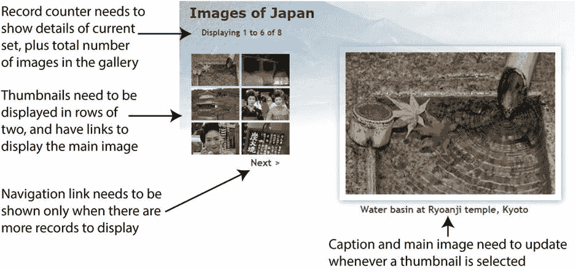
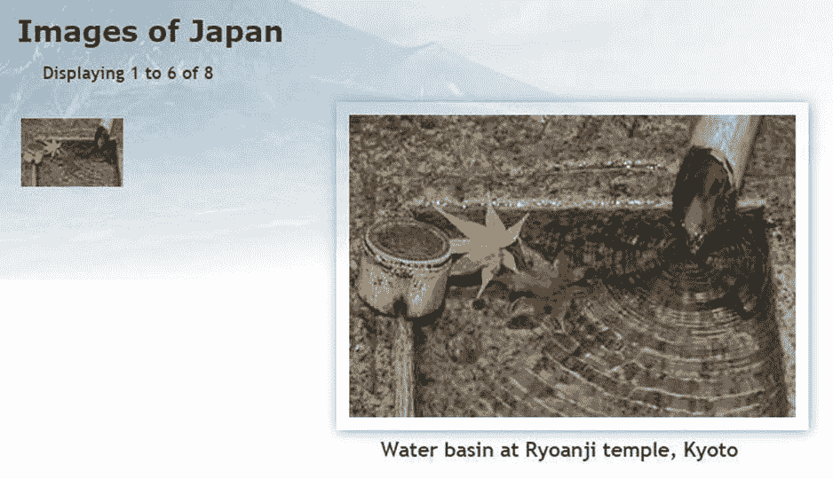
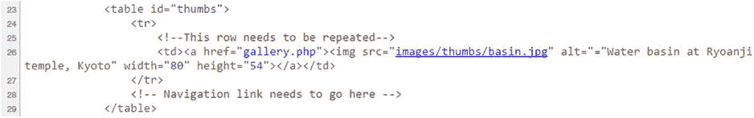

# 为何不在数据库中存储图片？

`images` 表包含文件名和标题，但并不存储图片本身。尽管你可以在数据库中存储二进制对象（如图片），但我并不打算这样做，原因很简单：这通常得不偿失。主要问题如下：

-   若不单独存储文本信息，图片无法被索引或搜索。
-   图片通常体积较大，会导致表体积膨胀。如果数据库存储空间有限，你可能会面临空间耗尽的风险。
-   若频繁删除图片，表碎片化会影响性能。
-   从数据库检索图片需要将图片传递给一个单独的脚本，这会拖慢网页显示速度。

更高效的做法是将图片存储在你网站的一个普通文件夹中，并利用数据库来存储图片的相关信息。你只需要两类信息——文件名和可作为`alt`文本使用的标题。一些开发者会在数据库中存储图片的完整路径，但我认为只存储文件名能为你提供更大的灵活性。指向`images`文件夹的路径将被嵌入到 HTML 中。无需存储图片的高度和宽度。正如你在第 4 章和第 8 章中所见，你可以使用 PHP 的`getimagesize()`函数动态生成这些信息。

## 规划画廊

我发现设计数据库驱动网站的最佳方法是，首先创建一个包含占位文本和图片的静态页面。然后，我创建 CSS 样式规则，使页面达到我想要的视觉效果，最后用 PHP 代码替换每个占位元素。每次替换后，我都会在浏览器中检查页面，确保一切正常运作。

图 12-2 展示了我为画廊制作的静态模型，并指出了需要转换为动态代码的元素。这些图片与第 4 章中随机图片生成器使用的图片相同，并且尺寸各异。我尝试过缩放图片以创建缩略图，但认为结果看起来过于杂乱，因此我将缩略图设为标准尺寸（80×54 像素）。此外，为了方便起见，我将每个缩略图命名为与大图相同的名称，并将它们存储在`images`文件夹下一个名为`thumbs`的子文件夹中。



图 12-2. 明确将静态画廊转换为动态画廊所需完成的工作

在前一章中，显示`images`表的内容很简单。你创建了一个单行表格，每个字段的内容放在单独的表格单元格中。通过遍历结果集，每条记录都显示在单独的一行上，模拟了数据库表的列结构。而这次，缩略图网格的两列结构不再匹配数据库结构。你需要在创建下一行之前，统计一行中已经插入了多少个缩略图。

在弄清楚需要做什么之后，我删除了缩略图 2 到 6 的代码以及导航链接的代码。下面的列表显示了`gallery.php`的`<main>`元素中剩余的内容，其中需要转换为 PHP 代码的元素已加粗标出（你可以在`ch12`文件夹的`gallery_01.php`中找到这段代码）：

```html
<main>
<h2>Images of Japan</h2>
<p id="picCount">Displaying 1 to 6 of 8</p>
<div id="gallery">
<table id="thumbs">
<tr>
<!-- This row needs to be repeated -->
<td><a href="gallery.php"></a></td>
</tr>
<!-- Navigation link needs to go here -->
</table>
<figure id="main_image">

<figcaption>Water basin at Ryoanji temple, Kyoto</figcaption>
</figure>
</div>
</main>
```

## 将画廊元素转换为 PHP

在显示画廊内容之前，你需要连接到`phpsols`数据库，并检索`images`表中存储的所有记录。其步骤与前一章相同，使用以下简单的 SQL 查询：

```sql
SELECT filename, caption FROM images
```

然后，你可以使用第一条记录来显示第一张图片及其关联的标题和缩略图。你不需要用到`image_id`。


### PHP 解决方案 12-1：显示首张图片

如果你已在第 4 章设置了"日本之旅"网站，可直接使用原始的 `gallery.php` 文件。或者，将 `ch12` 文件夹中的 `gallery_01.php` 复制到 `phpsols` 站点根目录并重命名为 `gallery.php`。同时需要将 `title.php`、`menu.php` 和 `footer.php` 复制到 `phpsols` 站点的 `includes` 文件夹中。如果编辑器询问是否要更新文件中的链接，请选择不更新。

该画廊需要数据库连接，因此需引入 `connection.php`，创建对 `phpsols` 数据库的只读连接，并定义 SQL 查询。请在 `gallery.php` 文件中 `DOCTYPE` 声明上方、PHP 结束标记之前添加以下代码（新增代码以粗体显示）：



**图 12-3.** 精简版静态画廊，已准备好进行转换

在浏览器中加载 `gallery.php` 确认显示正常。页面主体部分应如图 12-3 所示，包含一个缩略图及其同版本大图。

```
include './includes/title.php';
require_once './includes/connection.php';
$conn = dbConnect('read');
$sql = 'SELECT filename, caption FROM images';
```

如果使用 PDO，请在 `dbConnect()` 中添加第二个参数 `'pdo'`。

提交查询并从结果中提取首条记录的代码取决于所使用的连接方式。对于 MySQLi，请使用以下代码：

```
// 提交查询
$result = $conn->query($sql);
if (!$result) {
    $error = $conn->error;
} else {
    // 将首条记录提取为数组
    $row = $result->fetch_assoc();
}
```

对于 PDO，请使用以下代码：

```
// 提交查询
$result = $conn->query($sql);
// 获取错误信息
$errorInfo = $conn->errorInfo();
if (isset($errorInfo[2])) {
    $error = $errorInfo[2];
} else {
    // 将首条记录提取为数组
    $row = $result->fetch();
}
```

为了在页面加载时显示首张图片，需要在创建缩略图网格循环之前获取首条结果。上述 MySQLi 和 PDO 版本的代码均提交了查询、提取了首条记录并存储至 `$row`。

现在首张图片的详细信息已存储为 `$row['filename']` 和 `$row['caption']`。除了文件名和标题，我们还需要大图的尺寸，以便在页面主体中显示。请在获取首条结果的代码之后，立即在 `else` 代码块中添加以下代码：

```
// 获取主图的名称和标题
$mainImage = $row['filename'];
$caption = $row['caption'];
// 获取主图尺寸
$imageSize = getimagesize('images/'.$mainImage)[3];
```

如第 8 章所述，`getimagesize()` 返回一个数组，其第四个元素包含可直接插入 `` 标签的图片宽高字符串。我们只需要第四个元素，因此可使用第 7 章介绍的数组解引用技术。在 `getimagesize()` 的右括号后添加 `[3]` 只返回数组的第四个元素，并赋值给 `$imageSize`。

**注意：** 数组解引用需要 PHP 5.4 或更高版本。如果服务器运行旧版 PHP，需在调用 `getimagesize()` 后省略 `[3]`，将完整数组赋值给 `$imageSize`，然后按常规方式通过 `$imageSize[3]` 访问第四个元素。

现在可以利用这些信息动态显示缩略图、主图和标题。主图和缩略图名称相同，但最终需要通过循环遍历整个结果集来显示所有缩略图。因此，表格单元格中的动态代码应引用当前记录——即 `$row['filename']` 和 `$row['caption']`，而非 `$mainImage` 和 `$caption`。稍后您将明白为何我将首条记录的值赋给了独立变量。请按如下方式修改表格中的代码：

```
<td><a href="gallery.php">
    "
         alt="<?= $row['caption']; ?>" width="80" height="54"></a></td>
```

为防止查询出错，需要检查 `$error` 是否已设置，并阻止画廊显示。请在 `<h2>Images of Japan</h2>` 标题后立即添加包含以下条件语句的 PHP 代码块：

```
<?php if (isset($error)) {
    echo "<p>$error</p>";
} else {
?>
```

在结束标签 `</main>`（大约第 54 行）前插入新行，并添加包含 `else` 代码块闭合花括号的 PHP 代码块：

```
<?php } ?>
```

保存 `gallery.php` 并在浏览器中查看。它应显示与图 12-3 相同的效果。唯一区别在于缩略图及其 `alt` 文本是动态生成的。您可以通过查看源代码来验证这一点。原始静态版本包含空 `alt` 属性，但如下图所示，现在它包含了首条记录的标题：



如果出现问题，请确保图片 `src` 属性中静态文本和动态生成的文本之间没有间隙。同时检查您使用的代码是否与数据库连接类型匹配。您可以对照 `ch12` 文件夹中的 `gallery_mysqli_02.php` 或 `gallery_pdo_02.php` 检查代码。

确认能从数据库中获取详细信息后，即可转换主图代码。请按如下方式修改（新增代码以粗体显示）：

```
<figure id="main_image">
    " alt="<?= $caption; ?>"
         <?= $imageSize; ?>>
    <figcaption><?= $caption; ?></figcaption>
</figure>
```

`$imageSize` 会插入包含主图正确 `width` 和 `height` 属性的字符串。

再次测试页面。效果应仍与图 12-3 相同，但图片和标题已从数据库动态获取，并且 `getimagesize()` 正在为主图计算正确尺寸。您可以对照 `ch12` 文件夹中的 `gallery_mysqli_03.php` 或 `gallery_pdo_03.php` 检查代码。

## 构建动态元素

静态页面转换后的首要任务是显示所有缩略图，然后构建动态链接，以便在点击任意缩略图时显示其大图版本。显示所有缩略图很简单——只需循环遍历即可（稍后将讨论如何以每行两个的方式显示）。激活每个缩略图的链接则需要多花些心思。您需要一种方法来告知页面应显示哪张大图。

### 通过查询字符串传递信息

在上一节中，您使用 `$mainImage` 标识大图，因此需要在点击缩略图时更改其值。解决方案是将图片文件名添加到链接 URL 末尾的查询字符串中，如下所示：

```
<a href="gallery.php?image=filename">
```

然后您可以检查 `$_GET` 数组中是否包含名为 `image` 的元素。如果包含，则更改 `$mainImage` 的值；如果不包含，则保留 `$mainImage` 为结果集中首条记录的文件名。


