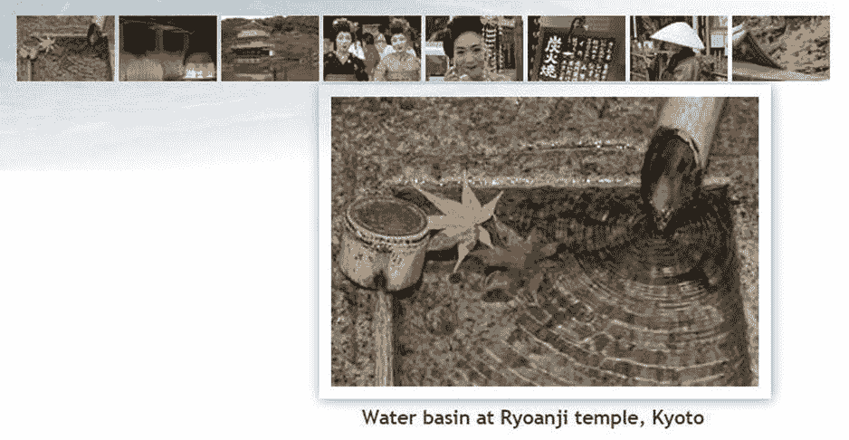

# PHP 方案 12-2：激活缩略图

继续使用上一节中的同一文件。或者，将 `gallery_mysqli_03.php` 或 `gallery_pdo_03.php` 复制到 `phpsols` 站点根目录，并将其保存为 `gallery.php`

找到包裹缩略图的链接起始 `<a>` 标签，内容如下：

```
<a href="gallery.php">
```

将其修改为：

```
<a href="<?= $_SERVER['PHP_SELF']; ?>?image=<?=$row['filename']; ?>">
```

键入代码时需小心。PHP 标签中的问号很容易与查询字符串开头的问号混淆。同样重要的是，`?image=` 周围不应有空格。

`$_SERVER['PHP_SELF']` 是一个便捷的预定义变量，指向当前页面的名称。你可以直接在 URL 中硬编码 `gallery.php`，但使用 `$_SERVER['PHP_SELF']` 可确保 URL 指向正确的页面。其余代码则使用当前文件名构建查询字符串。

保存页面并在浏览器中加载。将鼠标指针悬停在缩略图上，查看状态栏中显示的 URL。它应显示如下：

```
http://localhost/phpsols/gallery.php?image=basin.jpg
```

如果状态栏中未显示任何内容，请单击缩略图。页面应保持不变，但地址栏中的 URL 现在应包含查询字符串。检查 URL 或查询字符串中是否有间隙。

要显示所有缩略图，您需要将表格单元格包裹在一个循环中。在关于重复行的 HTML 注释后插入新行，并创建一个 `do... while` 循环的前半部分，如下所示（关于不同类型循环的详细信息，请参阅第 3 章）：

```
<!-- 此行需重复 -->

<?php do { ?>
```

结果集中已有第一条记录的详细信息，因此获取后续记录的代码需要放在结束的 `</td>` 标签之后。在结束的 `</td>` 和 `</tr>` 标签之间创建一些空间，并插入以下代码。根据不同数据库连接方法，代码略有不同。

对于 MySQLi，请使用：

```
</td>

<?php } while ($row = $result->fetch_assoc()); ?>

</tr>
```

对于 PDO，请使用：

```
</td>

<?php } while ($row = $result->fetch()); ?>

</tr>
```

这会获取结果集中的下一条记录，并将循环返回至顶部。由于 `$row['filename']` 和 `$row['caption']` 的值不同，因此下一个缩略图及其关联的 `alt` 文本会被插入到新的表格单元格中。查询字符串也会随新文件名更新。

保存页面并在浏览器中测试。您现在应该看到所有八个缩略图排列在画廊顶部的一行中，如下面的截图所示。



将鼠标指针悬停在每个缩略图上，您应该会看到查询字符串显示文件名。您可以对照 `gallery_mysqli_04.php` 或 `gallery_pdo_04.php` 检查您的代码。

单击缩略图仍然没有反应，因此您需要创建改变主图像及其关联说明的逻辑。在 `DOCTYPE` 声明上方的代码块中找到此部分：

```
// 获取主图像的名称和说明
$mainImage = $row['filename'];
$caption = $row['caption'];
```

选中定义 `$caption` 的那一行，并将其剪切到剪贴板。将另一行包裹在条件语句中，如下所示：

```
// 获取主图像的名称
if (isset($_GET['image'])) {
    $mainImage = $_GET['image'];
} else {
    $mainImage = $row['filename'];
}
```

`$_GET` 数组包含通过查询字符串传递的值，因此如果设置了（定义了）`$_GET['image']`，它将从查询字符串中获取文件名并存储为 `$mainImage`。如果 `$_GET['image']` 不存在，则像之前一样从结果集中的第一条记录获取值。

最后，您需要获取主图像的说明。它不再每次都相同，因此您需要将其移动到在 `thumbs` 表中显示缩略图的循环中。将它放在循环的起始花括号之后（大约在第 48 行）。将光标置于花括号后，插入几行，然后粘贴您在上一步中剪切的说明定义。您希望说明与主图像匹配，因此如果当前记录的文件名与 `$mainImage` 相同，那就是您要找的。将刚刚粘贴的代码包裹在条件语句中，如下所示：

```
<?php
do {
    // 如果缩略图与主图像相同，则设置说明
    if ($row['filename'] == $mainImage) {
        $caption = $row['caption']; // 这是您粘贴的行
    }
?>
```

保存页面并在浏览器中重新加载。这次，当您单击缩略图时，主图像和说明将会改变。不用担心某些图像和说明被页脚遮挡。当缩略图移动到主图像左侧时，这将自行修正。

> **注意：** 像这样通过查询字符串传递信息是使用 PHP 和数据库结果的一个重要方面。虽然表单信息通常通过 `$_POST` 数组传递，但 `$_GET` 数组经常用于传递要显示、更新或删除的记录的详细信息。它也常用于搜索，因为查询字符串很容易被添加书签。

在这种情况下没有 SQL 注入的风险。但如果有其他人更改了通过查询字符串传递的文件名的值，并且开启了 `display_errors`，那么在找不到图像时，您将看到丑陋的错误消息。在调用 `getimagesize()` 之前，让我们先检查图像是否存在。将其包裹在条件语句中，如下所示：

```
if (file_exists('images/'.$mainImage)) {
    // 获取主图像的尺寸
    $imageSize = getimagesize('images/'.$mainImage)[3];
} else {
    $error = '图像未找到。';
}
```

尝试将查询字符串中 `image` 的值更改为除现有文件之外的任何值。加载页面时，您应该会看到*图像未找到*。

如有必要，请对照 `gallery_mysqli_05.php` 或 `gallery_pdo_05.php` 检查您的代码。

## 创建多列表格

仅有八张图片时，画廊顶部的一行缩略图看起来还不错。然而，能够通过使用循环动态构建表格非常有用，该循环在一行中插入特定数量的表格单元格，然后移入下一行。这是通过记录已插入的单元格数量来实现的。当达到该行的限制时，代码需要为当前行插入结束标签，并且如果还有更多缩略图，还需为下一行插入开始标签。使其易于实现的是取模运算符 `%`，它返回除法的余数。

这是它的工作原理。假设您希望每行有两个单元格。插入第一个单元格后，计数器设置为 `1`。如果用取模运算符计算 `1` 除以 `2`（`1 % 2`），结果是 `1`。当插入下一个单元格时，计数器增加到 `2`。`2 % 2` 的结果是 `0`。下一个单元格产生这样的计算：`3 % 2`，结果为 `1`；但第四个单元格产生 `4 % 2`，结果又是 `0`。因此，每次计算结果为 `0` 时，您就知道——或者更确切地说，PHP 知道——您已经到达了一行的末尾。

那么如何知道是否还有更多行呢？通过将插入结束和开始 `<tr>` 标签的代码放在循环顶部，必须至少还剩一张图片。然而，循环第一次运行时，余数也是 `0`，问题在于您需要阻止插入这些标签，直到至少显示了一张图片。呼……让我们试试看。


