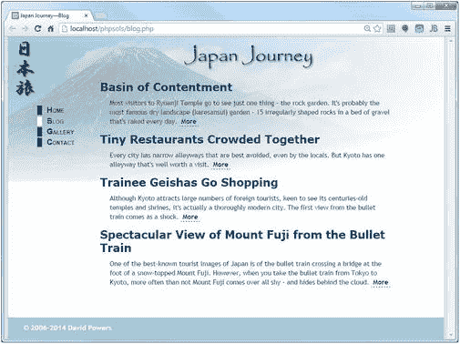
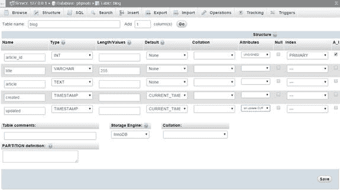
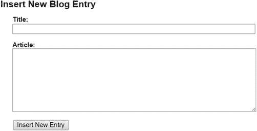
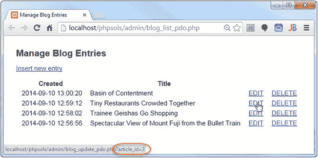
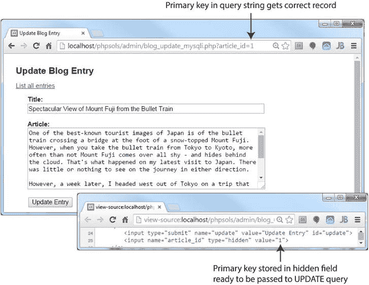

# PHP 解决方案 12-3：水平与垂直循环

本 PHP 解决方案展示了如何控制循环，以在表格中显示特定数量的列。列数通过设置一个常量来控制。继续使用上一节中的文件，或者使用 `gallery_mysqli_05.php` 或 `gallery_pdo_05.php`。

你可能会在后续阶段想要更改表格中的列数，因此最好在脚本顶部创建一个易于查找的常量，而不是将数值深埋在代码中。在创建数据库连接之前插入以下代码：

```
// 定义表格中的列数
define('COLS', 2);
```

常量与变量类似，区别在于其值不能被脚本的其他部分更改。你可以使用 `define()` 函数创建常量，该函数接受两个参数：常量的名称和它的值。按照惯例，常量总是使用大写字母。与变量不同，它们不以美元符号开头。

你需要在循环外部初始化单元格计数器。同时创建一个变量来指示是否为第一行。在你刚刚定义的常量之后立即添加以下代码：

```
define('COLS', 2);

// 初始化水平循环的变量
$pos = 0;
$firstRow = true;
```

用于计数的代码放在显示缩略图的循环起始处的 PHP 块内。像这样修改代码：

```
<?php do {
  // 如果缩略图与主图像相同，则设置标题
  if ($row['filename'] == $mainImage) {
    $caption = $row['caption'];
  }

  // 如果余数为 0 且不是第一行，则关闭当前行并开始新行
  if ($pos++ % COLS === 0 && !$firstRow) {
    echo '</tr><tr>';
  }

  // 循环开始后，此条件不再成立
  $firstRow = false;
?>
```

由于递增运算符（`++`）放在 `$pos` 之后，其值在递增 `1` 之前被列数除。循环第一次运行时，余数为 `0`，但 `$firstRow` 为 `true`，因此条件语句失败。然而，在条件语句之后，`$firstRow` 被重置为 `false`。在循环的后续迭代中，每次余数为 `0` 时，条件语句会关闭当前表格行并开始新的一行。

如果没有更多记录，你需要检查表格底部是否有未完成的行。在现有的 `do...while` 循环之后添加一个 `while` 循环。在 MySQLi 版本中，它看起来像这样：

```
<?php } while ($row = $result->fetch_assoc());

while ($pos++ % COLS) {
  echo '<td>&nbsp;</td>';
}
?>
```

在 PDO 版本中，新代码是相同的。唯一的区别是前一行使用 `$result->fetch()` 而不是 `$result->fetch_assoc()`。

第二个循环在 `$pos++ % COLS` 产生余数（被解释为 `true`）时，继续递增 `$pos`，并插入一个空单元格。

**注意：** 这个第二个循环并未嵌套在第一个循环内部。它仅在第一个循环结束后运行。


图 12-4。缩略图现在整齐排列成列

保存页面并在浏览器中重新加载。原本在画廊顶部单行排列的缩略图现在应整齐地两两对齐，如图 12-4 所示。

尝试更改 `COLS` 的值并重新加载页面。主图像可能会被移位，因为页面仅设计为两列，但你可以看到通过更改一个数字就能轻松控制每行的单元格数量。你可以将代码与 `gallery_mysqli_06.php` 或 `gallery_pdo_06.php` 进行对照检查。

## 分页浏览长记录集

八个缩略图的网格在画廊中显示得很合适，但如果你有 28 个或 48 个呢？答案是限制每页显示的结果数量，然后构建一个导航系统，让你能够在结果中前后翻页。你在使用搜索引擎时已经无数次见过这种技术；现在你将学习如何自己构建它。

这项任务可以分解为以下两个阶段：

- 选择要显示的子集记录
- 创建用于翻页浏览子集的导航链接

这两个阶段都相对容易实现，尽管它们需要应用一些条件逻辑。保持冷静，你就能轻松完成。

### 选择子集记录

限制每页的结果数量很简单——只需在 SQL 查询中添加 `LIMIT` 关键字，如下所示：

```
SELECT filename, caption FROM images LIMIT 起始位置, 最大数量
```

`LIMIT` 关键字后面可以跟一个或两个数字。如果只使用一个数字，它会设置要检索的最大记录数。这很有用，但不适合分页系统。为此，你需要使用两个数字：第一个数字指示从哪条记录开始，第二个数字规定要检索的最大记录数。MySQL 从 0 开始计数记录，因此要显示前六张图片，你需要以下 SQL：

```
SELECT filename, caption FROM images LIMIT 0, 6
```

要显示下一组，SQL 需要改为这样：

```
SELECT filename, caption FROM images LIMIT 6, 6
```

`images` 表中只有八条记录，但第二个数字只是一个最大值，因此这会检索记录 7 和 8。

要构建导航系统，你需要一种生成这些数字的方法。第二个数字永远不会改变，所以我们定义一个名为 `SHOWMAX` 的常量。生成第一个数字（称之为 `$startRecord`）也非常容易。从 0 开始对页面编号，然后将第二个数字乘以当前页码。因此，如果你将当前页称为 `$curPage`，公式如下：

```
$startRecord = $curPage * SHOWMAX;
```

对于 SQL，它变为：

```
SELECT filename, caption FROM images LIMIT $startRecord, SHOWMAX
```

如果 `$curPage` 是 0，`$startRecord` 也是 0（0 × 6），但当 `$curPage` 增加到 1 时，`$startRecord` 变为 6（1 × 6），依此类推。

由于 `images` 表中只有八条记录，你需要一种方法来找出记录总数，以防止导航系统检索空结果集。在上一章中，你使用了 MySQLi 的 `num_rows` 属性和 PDO 的 `rowCount()`。但这次它们不起作用，因为你想知道的是记录总数，而不是当前结果集中的记录数。答案是使用 SQL 的 `COUNT()` 函数，如下所示：

```
SELECT COUNT(*) FROM images
```

当与星号结合使用时，`COUNT()` 会获取表中的记录总数。因此，要构建导航系统，你需要运行两个 SQL 查询：一个用于查找记录总数，另一个用于检索所需的子集。这些是简单的查询，因此结果几乎是即时的。

我稍后会处理导航链接。我们先从限制第一页上的缩略图数量开始。


### PHP 方案 12-4：显示记录子集

本 PHP 方案展示了如何筛选出记录子集，为创建长列表分页导航系统做准备。同时，它还演示了如何显示当前选中的记录编号以及记录总数。

继续使用之前的同一个文件。或者，使用 `gallery_mysqli_06.php` 或 `gallery_pdo_06.php`。

定义 `SHOWMAX` 以及用于查找表中记录总数的 SQL 查询。将页面顶部的代码修改如下（新代码以**粗体**显示）：

```
// 初始化水平循环器变量
$pos = 0;
$firstRow = true;

// 设置最大记录数
define('SHOWMAX', 6);

$conn = dbConnect('read');

// 准备获取总记录数的 SQL
$getTotal = 'SELECT COUNT(*) FROM images';
```

现在你需要运行这条新的 SQL 查询。这段代码紧接在上一步代码之后，但根据 MySQL 连接类型的不同而有所区别。对于 MySQLi，请使用以下代码：

```
// 提交查询并将结果存储为 $totalPix
$total = $conn->query($getTotal);
$row = $total->fetch_row();
$totalPix = $row[0];
```

这段代码提交了查询，然后使用 `fetch_row()` 方法，该方法从 `MySQLi_Result` 对象中获取单行数据作为索引数组。结果中只有一列，因此 `$row[0]` 包含 `images` 表中记录的总数。

对于 PDO，请使用以下代码：

```
// 提交查询并将结果存储为 $totalPix
$total = $conn->query($getTotal);
$totalPix = $total->fetchColumn();
```

这段代码提交了查询，然后使用 `fetchColumn()` 获取单个结果，并将其存储在 `$totalPix` 中。

接下来，设置 `$curPage` 的值。你稍后创建的导航链接将通过查询字符串传递所需页面的值，因此需要检查 `$_GET` 数组中是否存在 `curPage`。如果存在，则使用该值；否则，将当前页面设置为 0。将以下代码插入到上一步代码之后：

```
// 设置当前页面
if (isset($_GET['curPage'])) {
    $curPage = $_GET['curPage'];
} else {
    $curPage = 0;
}
```

现在你拥有了计算起始行和构建 SQL 查询以检索记录子集所需的全部信息。将以下代码添加到上一步代码之后：

```
// 计算子集的起始行
$startRow = $curPage * SHOWMAX;
```

但这里有一个问题。`$curPage` 的值来自查询字符串。如果有人在浏览器地址栏中手动更改了该数字，`$startRow` 可能会大于数据库中的记录数。如果 `$startRow` 的值超过了 `$totalPix`，你需要将 `$startRow` 和 `$curPage` 都重置为 `0`。将以下条件语句添加到上一步代码之后：

```
if ($startRow > $totalPix) {
    $startRow = 0;
    $curPage = 0;
}
```

注意：如果手动将 `curPage` 改为非数字值，当它与 `SHOWMAX` 相乘时，PHP 会自动将其转换为 `0`。

原始的 SQL 查询现在应该在下一行。按如下方式修改它：

```
// 准备 SQL 以检索图像详情子集
$sql = "SELECT filename, caption FROM images LIMIT $startRow," . SHOWMAX;
```

这次我使用了双引号，因为我希望 PHP 处理 `$startRow`。与变量不同，常量在双引号字符串内部不会被处理。因此，`SHOWMAX` 通过连接运算符（句点）被添加到 SQL 查询的末尾。结束引号内的逗号是 SQL 的一部分，用于分隔 `LIMIT` 子句的两个参数。


**图 12-5.** 缩略图的数量受 `SHOWMAX` 常量的限制

保存页面并在浏览器中重新加载。您应该只能看到六个缩略图，而不是八个，如图 12-5 所示。更改 `SHOWMAX` 的值以查看不同数量的缩略图。

缩略图网格上方的文本不会更新，因为它仍然是硬编码的，所以让我们来修复它。在页面的主体部分找到以下代码行：

`<p id="picCount">Displaying 1 to 6 of 8</p>`

将其替换为以下代码：

```
<p id="picCount">Displaying <?php echo $startRow+1;
    if ($startRow+1 < $totalPix) {
        echo ' to ';
        if ($startRow+SHOWMAX < $totalPix) {
            echo $startRow+SHOWMAX;
        } else {
            echo $totalPix;
        }
    }
    echo " of $totalPix";
?></p>
```

让我们逐行分析。`$startRow` 的值是从零开始的，因此你需要加 1 才能得到一个对用户更友好的数字。因此，`$startRow+1` 在第一页显示 1，在第二页显示 7。在第二行，`$startRow+1` 与总记录数进行比较。如果它小于总记录数，则表示当前页面显示的是一个记录范围，因此第三行显示文本“ to ”（两边带空格）。然后，你需要计算出该范围的最大值，因此一个嵌套的 `if ... else` 条件语句将起始行的值加上页面要显示的最大记录数。如果结果小于总记录数，`$startRow+SHOWMAX` 会给出页面上的最后一条记录编号。但如果结果等于或大于总数，则改为显示 `$totalPix`。最后，退出两个条件语句并显示“ of ”以及总记录数。

保存页面并在浏览器中重新加载。您仍然只能看到第一个缩略图子集，但每当您更改 `SHOWMAX` 的值时，您应该会看到第二个数字动态变化。如有必要，请对照 `gallery_mysqli_07.php` 或 `gallery_pdo_07.php` 检查您的代码。

### 在记录子集之间导航

正如我在上一节第 3 步中提到的，所需页面的值通过查询字符串传递给 PHP 脚本。页面首次加载时，没有查询字符串，因此 `$curPage` 的值被设置为 `0`。虽然单击缩略图显示不同图像时会生成查询字符串，但它只包含主图像的文件名，因此原始的缩略图子集保持不变。要显示下一个子集，您需要创建一个将 `$curPage` 的值增加 `1` 的链接。同理，要返回上一个子集，您需要另一个将 `$curPage` 的值减少 `1` 的链接。

这很简单，但您还需要确保只有当存在有效的导航子集时才显示这些链接。例如，在第一页上显示后退链接没有意义，因为不存在前一个子集。类似地，在显示最后一个子集的页面上不应显示前进链接，因为已无内容可导航。

这两个问题都可以通过使用条件语句轻松解决。还有最后一件事需要您处理。在单击缩略图时生成的查询字符串中，也必须包含当前页面的值。如果不这样做，`$curPage` 会自动重置为 `0`，并且会显示第一组缩略图，而不是当前的子集。


### PHP 解法 12-5：创建导航链接

本 PHP 解法展示了如何创建导航链接，以便在每批记录子集中前后翻页。继续使用之前的同一文件，或者改用 `gallery_mysqli_07.php` 或 `gallery_pdo_07.php`。

我已将导航链接放置在缩略图表格底部的额外行中。请在占位符注释与闭合的 `</table>` 标签之间插入以下代码：

`<!-- Navigation link needs to go here -->`

`<tr><td>`

`<?php`

`// 如果当前页大于 0，则创建上一页链接`

`if ($curPage > 0) {`

`echo '<a href="' . $_SERVER['PHP_SELF'] . '?curPage=' . ($curPage-1) .`

`'">` `&` `lt; 上一页</a>';`

`} else {`

`// 否则，将单元格留空`

`echo '` `&` `nbsp;';`

`}`

`?>`

`</td>`

`<?php`

`// 如果列数大于 2，则用空单元格填充最后一行`

`if (COLS-2 > 0) {`

`for ($i = 0; $i < COLS-2; $i++) {`

`echo '<td>` `&` `nbsp;</td>';`

`}`

`}`

`?>`

`<td>`

`<?php`

`// 如果存在更多记录，则创建下一页链接`

`if ($startRow+SHOWMAX < $totalPix) {`

`echo '<a href="' . $_SERVER['PHP_SELF'] . '?curPage=' . ($curPage+1) .`

`'"> 下一页` `&` `gt;</a>';`

`} else {`

`// 否则，将单元格留空`

`echo '` `&` `nbsp;';`

`}`

`?>`

`</td></tr>`

`</table>`

看起来代码很多，但实际上它分为三个部分：第一部分，如果 `$curPage` 大于 `0`，则创建一个上一页链接；第二部分，如果表格列数超过两列，则用空单元格填充表格最后一行；第三部分，使用前面的公式（`$startRow+SHOWMAX < $totalPix`）来决定是否显示下一页链接。

请确保链接中的引号组合正确无误。另需注意，`$curPage-1` 和 `$curPage+1` 的计算被括在括号中，以免数字后的句点被误解为小数点。此处的句点用作连接运算符，用于拼接查询字符串的各个部分。

现在，你需要将当前页的值添加到缩略图周围链接的查询字符串中。请找到以下代码段（大约在第 95 行）：

`<a href="<?= $_SERVER['PHP_SELF']; ?>?image=<?= $row['filename']; ?>">`

将其修改为：

`<a href="<?= $_SERVER['PHP_SELF']; ?>?image=<?= $row['filename'];?>`

`&` `amp;curPage=<?= $curPage; ?>` `">`

你希望在单击缩略图时显示相同的子集，因此只需通过查询字符串传递 `$curPage` 的当前值即可。

**警告**

由于印刷页面限制，我不得不将代码分成两行。在你的 PHP 脚本中，所有代码必须位于同一行，且闭合 PHP 标签与 `&amp;` 之间不能有空格。此代码用于创建 URL 和查询字符串，其中不能包含空格。


图 12-6.

页面导航系统现已完成。保存页面并进行测试。单击“下一页”链接，你应该会看到剩余的那批缩略图，如图 12-6 所示。由于没有更多图像需要显示，“下一页”链接会消失，但缩略图网格的左下方会出现“上一页”链接。画廊顶部的记录计数器现在会反映当前显示的缩略图范围。如果你点击正确的缩略图，同一子集将保持在屏幕上，同时显示相应的大图。大功告成！

你可以将自己的代码与 `gallery_mysqli_08.php` 或 `gallery_pdo_08.php` 进行对照检查。

### 本章回顾

仅仅几页的篇幅，你就把一份枯燥的文件名列表变成了一个动态的在线画廊，并且配备了页面导航系统。你只需要为每张主要图片创建一张缩略图，将两张图片上传到相应的文件夹，然后将文件名和说明文字添加到数据库的 `images` 表中。只要数据库与 `images` 和 `thumbs` 文件夹的内容保持同步，你就能拥有一个动态画廊。不仅如此，你还学会了如何选择记录子集、通过查询字符串链接到相关信息，以及构建页面导航系统。

你越使用 PHP，就越会意识到，这项技能与其说在于记住大量晦涩的函数，不如说在于理清让 PHP 按你意愿工作的逻辑。这无非是“如果这样，就那样做；如果那样，就做别的”的思维模式。一旦你能预见到某种情况可能的发展方向，通常就能构建出处理它的代码。

到目前为止，你一直专注于从简单的数据库表中提取记录。在下一章中，我将向你展示如何插入、更新和删除数据。

## 13. 管理内容

虽然你可以使用 phpMyAdmin 完成许多数据库管理工作，但你可能希望设置一些区域，让客户可以登录更新某些数据，同时又不必给他们访问整个数据库的全部权限。为此，你需要构建自己的表单，并创建定制的內容管理系统。

每个内容管理系统的核心都是所谓的 CRUD 周期——即创建（Create）、读取（Read）、更新（Update）和删除（Delete）——它仅使用四条 SQL 命令：`INSERT`、`SELECT`、`UPDATE` 和 `DELETE`。为了演示这些基本的 SQL 命令，本章将向你展示如何为一个名为 `blog` 的表格构建一个简单的内容管理系统。

即使你不想构建自己的内容管理系统，本章涵盖的四条命令对于几乎所有基于数据库的页面（如用户登录、用户注册、搜索表单、搜索结果等）来说也是必不可少的。

在本章中，你将学习以下内容：

*   在数据库表中插入新记录
*   显示现有记录列表
*   更新现有记录
*   在删除记录前请求确认

### 设置内容管理系统

管理数据库表中的内容涉及四个阶段，我通常将它们分配给四个独立但相互链接的页面：分别用于插入、更新和删除记录，以及一个现有记录的列表。记录列表有两个目的：首先，标识数据库中存储了什么；更重要的是，通过查询字符串传递记录的主键，以便链接到更新和删除脚本。

`blog` 表包含一系列标题和文章正文，这些内容将显示在 Japan Journey 网站上，如图 13-1 所示。为了保持简洁，该表仅包含五列：`article_id`（主键）、`title`、`article`、`created` 和 `updated`。


图 13-1. 在 Japan Journey 网站中显示的 `blog` 表的内容


### 创建博客数据库表

如果你只想直接开始学习内容管理页面，可以从 `ch13` 文件夹中导入 `blog.sql` 文件中的表结构和数据。打开 phpMyAdmin，选择 `phpsols` 数据库，按照第 10 章的相同方式导入该表。该 SQL 文件会创建表并填充四篇简短文章。

如果你想从头开始自行创建所有内容，请打开 phpMyAdmin，选择 `phpsols` 数据库，然后点击`结构`选项卡（如果未选中）。在`创建表`部分，在`名称`字段中输入 `blog`，在`列数`字段中输入 `5`。然后点击`执行`。使用以下截图和表 13-1 中显示的设置。



**表 13-1.** `blog` 表的列定义

| 字段 | 类型 | 长度/值 | 默认值 | 属性 | 空值 | 索引 | A_I |
| --- | --- | --- | --- | --- | --- | --- | --- |
| `article_id` | `INT` | | | `UNSIGNED` | 未选中 | `PRIMARY` | 选中 |
| `title` | `VARCHAR` | `255` | | | 未选中 | | |
| `article` | `TEXT` | | | | 未选中 | | |
| `created` | `TIMESTAMP` | | `CURRENT_TIMESTAMP` | | 未选中 | | |
| `updated` | `TIMESTAMP` | | `CURRENT_TIMESTAMP` | `on update CURRENT_TIMESTAMP` | 未选中 | | |

`created` 和 `updated` 列的默认值设置为 `CURRENT_TIMESTAMP`。因此，首次录入记录时，两列会获得相同的值。`updated` 列的`属性`设置为 `on update CURRENT_TIMESTAMP`。这意味着每当对记录进行更改时，该列都会被更新。为了追踪记录的原始创建时间，`created` 列的值永远不会被更新。

### 创建基本的插入和更新表单

SQL 通过提供不同的命令来区分插入和更新记录的操作。`INSERT` 仅用于创建全新的记录。一旦记录被插入，任何更改都必须使用 `UPDATE` 来完成。由于这涉及相同的字段，因此可以使用同一页面进行两种操作。但这会使 PHP 代码更复杂，因此我更喜欢先创建插入页面的 HTML，将其另存为更新页面，然后分别编写代码。

插入页面的表单只需要两个输入字段：标题和文章内容。其余三列（主键和两个时间戳）的内容会自动处理。插入表单的代码如下所示：

```
<form method="post" action="">
<p>
<label for="title">标题：</label>
<input name="title" type="text" id="title">
</p>
<p>
<label for="article">文章：</label>
<textarea name="article" id="article"></textarea>
</p>
<p>
<input type="submit" name="insert" value="插入新条目" id="insert">
</p>
</form>
```

该表单使用 `post` 方法。你可以在 `ch13` 文件夹中的 `blog_insert_01.php` 找到完整代码。这些内容管理表单使用了 `styles` 文件夹中的 `admin.css` 进行了一些基本样式设置。在浏览器中查看时，表单如下所示：



更新表单除了标题和提交按钮外完全相同。按钮代码如下所示（完整代码在 `blog_update_mysqli_01.php` 和 `blog_update_pdo_01.php` 中）：

```
<input type="submit" name="update" value="更新条目" id="update">
```

我给了标题和文章输入字段与 `blog` 表中列相同的名称。这有助于在后续编写 PHP 和 SQL 代码时更容易地跟踪变量。

**提示**

作为一项安全措施，一些开发者建议使用与数据库列不同的名称，因为任何人都可以通过查看表单的源代码看到输入字段的名称。使用不同的名称会使入侵数据库更加困难。在网站的密码保护区域，这不必担心。但是，对于公开可访问的表单（例如用户注册或登录表单），你可能需要考虑这一做法。

### 插入新记录

将新记录插入表的基本 SQL 如下所示：

```
INSERT [INTO] table_name (column_names)
VALUES (values)
```

`INTO` 放在方括号中，表示它是可选的。它纯粹是为了让 SQL 读起来更接近人类语言。列名可以按任意顺序排列，但第二组括号中的值必须与其引用的列顺序一致。

虽然 MySQLi 和 PDO 的代码非常相似，但为了避免混淆，我将分别处理它们。

**注意**

本章中的许多脚本使用了一种称为“设置标志”的技术。`flag` 是一个布尔变量，初始化为 `true` 或 `false`，用于检查是否发生了某事。例如，如果 `$OK` 最初设置为 `false`，并且仅在数据库查询成功执行时才重置为 `true`，则它可以作为控制另一个代码块的条件使用。


### PHP 方案 13-1：使用 MySQLi 插入新记录

本 PHP 方案演示了如何使用 MySQLi 预处理语句向 `blog` 表中插入新记录。使用预处理语句可以避免转义引号和控制字符带来的问题，同时还能防止数据库受到 SQL 注入攻击（参见第 11 章）。

在 `phpsols` 站点根目录下创建一个名为 `admin` 的文件夹。从 `ch13` 文件夹中复制 `blog_insert_01.php`，并将其保存到新文件夹中，命名为 `blog_insert_mysqli.php`。插入新记录的代码只应在表单提交后运行，因此将其封装在条件语句中，该语句检查 `$_POST` 数组中提交按钮（`insert`）的 `name` 属性。将以下代码放在 `DOCTYPE` 声明之上：

```php
<?php

if (isset($_POST['insert'])) {

require_once '../includes/connection.php';

// 初始化标志
$OK = false;

// 创建数据库连接
// 初始化预处理语句
// 创建 SQL
// 绑定参数并执行语句
// 如果成功则重定向，否则显示错误

}

?>
```

在引入连接函数后，代码将 `$OK` 设置为 `false`。仅当没有错误时，该变量才会被重置为 `true`。末尾的五个注释勾勒出了我们将在下面填充的剩余步骤。

创建数据库连接，用户需拥有读写权限，然后初始化预处理语句，并创建包含占位符的 SQL，这些占位符将用于存储来自用户输入的数据，具体如下：

```php
// 创建数据库连接
$conn = dbConnect('write');

// 初始化预处理语句
$stmt = $conn->stmt_init();

// 创建 SQL
$sql = 'INSERT INTO blog (title, article)
VALUES(?, ?)';
```

将从 `$_POST['title']` 和 `$_POST['article']` 获取的值用问号占位符表示。其他列将自动填充。`article_id` 列是主键，使用 `AUTO_INCREMENT` 自增，而 `created` 和 `updated` 列的默认值为 `CURRENT_TIMESTAMP`。

> **注意：** 此处的代码顺序与第 11 章略有不同。该脚本将在第 15 章中进一步开发，用于执行一系列 SQL 查询，因此首先初始化预处理语句。

下一步是将问号替换为变量中存储的值——这一过程称为绑定参数。插入以下代码：

```php
if ($stmt->prepare($sql)) {

// 绑定参数并执行语句
$stmt->bind_param('ss', $_POST['title'], $_POST['article']);
$stmt->execute();

if ($stmt->affected_rows > 0) {
    $OK = true;
}

}
```

这部分代码能防止数据库受到 SQL 注入攻击。将变量按照要插入 SQL 查询的顺序传递给 `bind_param()` 方法，同时传递第一个参数，该参数指定每个变量的数据类型，顺序同样与变量一致。两个变量都是字符串，因此该参数为 `'ss'`。

将值绑定到占位符后，调用 `execute()` 方法。

`affected_rows` 属性记录了 `INSERT`、`UPDATE` 或 `DELETE` 查询所影响的行数。

> **警告：** 如果查询触发 MySQL 错误，`affected_rows` 会返回 –1。与某些编程语言不同，PHP 将 –1 视为 `true`。因此，你需要确认 `affected_rows` 大于零，才能确保查询成功。如果大于零，`$OK` 会被重置为 `true`。

最后，将页面重定向到现有记录列表，或显示错误信息。在上一步之后添加以下代码：

```php
// 如果成功则重定向，否则显示错误
if ($OK) {
header('Location:
http://localhost/phpsols/admin/blog_list_mysqli.php ');
exit;
} else {
$error = $stmt->error;
}

}

?>
```

在页面主体中添加以下代码块，以便在插入操作失败时显示错误信息：

```php
<h1>插入新博客条目</h1>

<?php if (isset($error)) {
echo "<p>错误：$error</p>";
} ?>

<form method="post" action="">
```

完整代码位于 `ch13` 文件夹中的 `blog_insert_mysqli.php`。

至此，插入页面已完成。但在测试之前，请先创建 `blog_list_mysqli.php`，该文件将在 PHP 方案 13-3 中介绍。

> **注意：** 为了专注于与数据库交互的代码，本章中的脚本未对用户输入进行验证。在实际应用开发中，应使用第 5 章中介绍的技术检查表单提交的数据，并在检测到错误时重新显示。


### PHP 方案 13-2：使用 PDO 插入新记录

本 PHP 方案演示了如何使用 PDO 预处理语句向 `blog` 表中插入新记录。如果尚未操作，请先在 `phpsols` 站点根目录下创建一个名为 `admin` 的文件夹。

将 `blog_insert_01.php` 复制到 `admin` 文件夹中，并另存为 `blog_insert_pdo.php`。插入新记录的代码应仅在表单提交后运行，因此它被包裹在一个条件语句中，该语句会检查 `$_POST` 数组中是否存在提交按钮的 `name` 属性值（`insert`）。请在 `DOCTYPE` 声明之前的 PHP 代码块中添加以下内容：

```
if (isset($_POST['insert'])) {

require_once '../includes/connection.php';

// 初始化标志
$OK = false;

// 创建数据库连接
// 创建 SQL 语句
// 准备预处理语句
// 绑定参数并执行语句
// 成功则重定向，否则显示错误

}
```

在引入连接函数后，代码将 `$OK` 设置为 `false`。仅当没有错误时，它才会被重置为 `true`。末尾的五条注释勾勒出了后续步骤。

以具有读写权限的用户身份创建到数据库的 PDO 连接，并按如下方式构建 SQL 语句：

```
// 创建数据库连接
$conn = dbConnect('write', 'pdo');

// 创建 SQL 语句
$sql = 'INSERT INTO blog (title, article)
VALUES(:title, :article)';
```

从变量中获取的值由命名占位符表示，这些占位符由列名加上冒号前缀组成（`:title` 和 `:article`）。其他列的值将由数据库自动生成。`article_id` 主键会自动递增，`created` 和 `updated` 列的默认值设置为 `CURRENT_TIMESTAMP`。

下一步是初始化预处理语句，并将变量值绑定到占位符——这一过程称为参数绑定。添加以下代码：

```
// 准备预处理语句
$stmt = $conn->prepare($sql);

// 绑定参数并执行语句
$stmt->bindParam(':title', $_POST['title'], PDO::PARAM_STR);
$stmt->bindParam(':article', $_POST['article'], PDO::PARAM_STR);

// 执行并获取受影响行数
$stmt->execute();
$OK = $stmt->rowCount();
```

首先，将 SQL 查询传递给数据库连接对象（`$conn`）的 `prepare()` 方法，并将语句的引用存储为变量（`$stmt`）。

接下来，将变量中的值绑定到预处理语句中的占位符，然后 `execute()` 方法运行查询。

当与 `INSERT`、`UPDATE` 或 `DELETE` 查询一起使用时，PDO 的 `rowCount()` 方法会报告查询影响的行数。如果记录插入成功，`$OK` 为 `1`，PHP 会将其视为 `true`。否则，它为 `0`，被视为 `false`。

最后，将页面重定向到现有记录列表，或显示错误消息。在上一步骤之后添加此代码：

```
// 成功则重定向，否则显示错误
if ($OK) {
header('Location: http://localhost/phpsols/admin/blog_list_pdo.php');
exit;
} else {
$errorInfo = $stmt->errorInfo();
if (isset($errorInfo[2])) {
$error = $errorInfo[2];
}
}
}
?>
```

由于预处理语句已存储为 `$stmt`，因此可以使用 `$stmt->errorInfo()` 访问错误信息数组。仅当出现问题时，数组的第三个元素才会被设置。

在页面的主体部分添加一个 PHP 代码块，用于显示任何错误消息：

```
<h1>插入新博客条目</h1>
<?php if (isset($error)) {
echo "<p>错误：$error</p>";
} ?>
<form method="post" action="">
```

完整代码位于 `ch13` 文件夹中的 `blog_insert_pdo.php` 文件内。

至此，插入页面已完成，但在测试之前，请先创建 `blog_list_pdo.php`，具体说明见下文。

### 链接到更新和删除页面

在更新或删除记录之前，你需要找到其主键。一种实用的方法是查询数据库并显示所有记录的列表。你可以利用此查询结果来展示所有记录，并附上指向更新和删除页面的链接。通过在每个链接的查询字符串中添加 `article_id` 的值，即可自动标识要更新或删除的记录。如图 13-2 所示，浏览器状态栏（左下角）显示的 URL 将文章 `Tiny Restaurants Crowded Together` 的 `article_id` 标识为 `3`。



**图 13-2.** 编辑和删除链接在查询字符串中包含记录的主键

更新页面利用此信息显示正确的记录以供修改。删除链接中也传递了相同的信息到删除页面。

要创建这样的列表，你需要从一个包含两行以及任意多显示列的 HTML 表格开始，此外还要为编辑和删除链接额外增加两列。第一行用于显示列标题。第二行被包裹在 PHP 循环中，用于显示所有结果。`ch13` 文件夹中的 `blog_list_mysqli_01.php` 文件中的表格代码如下所示（`blog_list_pdo_01.php` 中的版本相同，区别仅在于最后两个表格单元格中的链接指向的是 PDO 版本的更新和删除页面）：

```
<table>
<tr>
<th>创建时间</th>
<th>标题</th>
<th>&nbsp;</th>
<th>&nbsp;</th>
</tr>
<tr>
<td></td>
<td></td>
<td><a href="blog_update_mysqli.php">编辑</a></td>
<td><a href="blog_delete_mysqli.php">删除</a></td>
</tr>
</table>
```


#### PHP 解决方案 13-3：创建指向更新和删除页面的链接

本 PHP 解决方案演示了如何创建一个页面来管理 `blog` 表中的记录，具体方法为显示所有记录的列表并链接到更新和删除页面。MySQLi 和 PDO 版本之间仅存在细微差异，因此本说明将同时介绍两者。

将 `blog_list_mysqli_01.php` 或 `blog_list_pdo_01.php` 复制到 `admin` 文件夹，并根据您计划使用的连接方式，将其另存为 `blog_list_mysqli.php` 或 `blog_list_pdo.php`。不同版本会链接到相应的插入、更新和删除文件。

您需要连接到数据库并创建 SQL 查询。在 `DOCTYPE` 声明上方的 PHP 代码块中添加以下代码：

```
require_once '../includes/connection.php';

// 创建数据库连接

$conn = dbConnect('read');

$sql = 'SELECT * FROM blog ORDER BY created DESC';
```

如果您使用的是 PDO，请在 `dbConnect()` 中添加 `'pdo'` 作为第二个参数。

通过添加以下代码（位于闭合 PHP 标签之前）来提交查询。

对于 MySQLi，请使用以下代码：

```
$result = $conn->query($sql);

if (!$result) {
    $error = $conn->error;
}
```

对于 PDO，请使用以下代码：

```
$result = $conn->query($sql);

$errorInfo = $conn->errorInfo();

if (isset($errorInfo[2])) {
    $error = $errorInfo[2];
}
```

在表格前添加一个条件语句以显示任何错误信息，并将表格包裹在 `else` 代码块中。表格前的代码如下所示：

```
<?php if (isset($error)) {
    echo "<p>$error</p>";
} else { ?>
```

闭合花括号应位于结束的 `</table>` 标签之后，并放入一个单独的 PHP 代码块中。

现在，您需要将第二行表格包裹在一个循环中，并从结果集中检索每条记录。以下代码应放在第一行的闭合 `</tr>` 标签与第二行的开始 `<tr>` 标签之间。

对于 MySQLi，请使用以下代码：

```
</tr>
<?php while($row = $result->fetch_assoc()) { ?>
<tr>
```

对于 PDO，请使用以下代码：

```
</tr>
<?php while ($row = $result->fetch()) { ?>
<tr>
```

这与前一章相同，因此无需解释。

在第二行的前两个单元格中显示当前记录的 `created` 和 `title` 字段，如下所示：

```
<td><?= $row['created']; ?></td>
<td><?= $row['title']; ?></td>
```

在接下来的两个单元格中，将当前记录的查询字符串和 `article_id` 字段的值添加到两个 URL 中，如下所示（虽然链接不同，但高亮显示的代码对于 PDO 版本是相同的）：

```
<td><a href="blog_update_mysqli.php?article_id=<?= $row['article_id']; ?>">编辑</a></td>
<td><a href="blog_delete_mysqli.php?article_id=<?= $row['article_id']; ?>">删除</a></td>
```

这里所做的是将 `?article_id=` 添加到 URL 中，然后使用 PHP 显示 `$row['article_id']` 的值。重要的是不要留下任何可能破坏 URL 或查询字符串的空格。在 PHP 处理完毕后，在浏览器中查看页面源代码时，开始的 `<a>` 标签应如下所示（尽管数字会根据记录而变化）：

```
<a href="blog_update_mysqli.php?article_id=2">
```

最后，使用一个花括号闭合包裹第二行表格的循环，如下所示：

```
</tr>
<?php } ?>
</table>
```

保存 `blog_list_mysqli.php` 或 `blog_list_pdo.php` 并在浏览器中加载该页面。假设您已经将 `blog.sql` 的内容加载到 `phpsols` 数据库中，您应该会看到一个包含四个项目的列表，如图 13-2 所示。现在您可以测试 `blog_insert_mysqli.php` 或 `blog_insert_pdo.php`。插入项目后，您应该会被重定向到相应版本的 `blog_list.php`，并且创建日期和时间以及新项目的标题应显示在列表顶部。如果遇到任何问题，请将您的代码与 `ch13` 文件夹中的版本进行对比。

**提示：** 此代码假定表中始终存在一些记录。作为练习，请使用 PHP 解决方案 11-2（MySQLi）或 11-4（PDO）中的技术来统计结果数量，并使用条件语句在没有找到记录时显示一条消息。解决方案在 `blog_list_norec_mysqli.php` 和 `blog_list_norec_pdo.php` 中。

### 更新记录

更新页面需要执行两个单独的过程，如下所示：

- 检索选定的记录，并将其显示以进行编辑
- 在数据库中更新编辑后的记录

第一阶段使用 `$_GET` 超全局数组从 URL 中检索主键，然后使用它在更新表单中选择并显示该记录，如图 13-3 所示。



图 13-3. 主键在更新过程中跟踪记录

主键存储在更新表单的一个隐藏字段中。在更新页面中编辑记录后，您使用 `post` 方法提交表单，将所有详细信息（包括主键）传递给一个 `UPDATE` 命令。

SQL `UPDATE` 命令的基本语法如下所示：

```
UPDATE table_name SET column_name = value, column_name = value
WHERE condition
```

更新特定记录时的条件是主键。因此，在更新 `blog` 表中的 `article_id 3` 时，基本的 `UPDATE` 查询如下所示：

```
UPDATE blog SET title = value, article = value
WHERE article_id = 3
```

虽然 MySQLi 和 PDO 的基本原理相同，但代码差异足以需要提供单独的说明。


