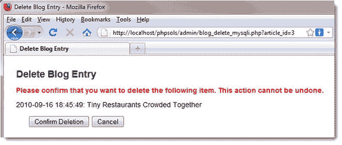

# PHP 方案 13-4：使用 MySQLi 更新记录

本 PHP 方案演示了如何将现有记录加载到更新表单中，然后将编辑后的详情发送到数据库，使用 MySQLi 进行更新。要加载记录，您需要先创建列出所有记录的管理页面，如 PHP 方案 13-3 所述。

将 `ch13` 文件夹中的 `blog_update_mysqli_01.php` 复制到 `admin` 文件夹中，并保存为 `blog_update_mysqli.php`。第一阶段涉及检索要更新的记录的详细信息。将以下代码放在 `DOCTYPE` 声明上方的 PHP 代码块中：

```php
require_once '../includes/connection.php';

// 初始化标志
$OK = false;
$done = false;

// 创建数据库连接
$conn = dbConnect('write');

// 初始化语句
$stmt = $conn->stmt_init();

// 获取所选记录的详细信息
if (isset($_GET['article_id']) && !$_POST) {
    // 准备 SQL 查询
    $sql = 'SELECT article_id, title, article
            FROM blog WHERE article_id = ?';
    if ($stmt->prepare($sql)) {
        // 绑定查询参数
        $stmt->bind_param('i', $_GET['article_id']);
        // 执行查询，并获取结果
        $OK = $stmt->execute();
        // 将结果绑定到变量
        $stmt->bind_result($article_id, $title, $article);
        $stmt->fetch();
    }
}

// 如果未定义 $_GET['article_id'] 则重定向
if (!isset($_GET['article_id'])) {
    header('Location: http://localhost/phpsols/admin/blog_list_mysqli.php');
    exit;
}

// 如果查询失败，获取错误信息
if (isset($stmt) && !$OK && !$done) {
    $error = $stmt->error;
}
```

虽然这与插入页面使用的代码非常相似，但前几行位于条件语句之外。更新过程的两个阶段都需要数据库连接和预处理语句，这样可以避免稍后重复相同的代码。初始化了两个标志：`$OK` 用于检查记录检索是否成功，`$done` 用于检查更新是否成功。

第一个条件语句确保 `$_GET['article_id']` 存在且 `$_POST` 数组为空。因此，仅在设置了查询字符串但表单尚未提交时，才会执行大括号内的代码。

准备 `SELECT` 查询的方式与 `INSERT` 命令相同，使用问号作为变量的占位符。但是，请注意，查询并未使用星号检索所有列，而是按名称指定了三列，如下所示：

```sql
$sql = 'SELECT article_id, title, article
        FROM blog WHERE article_id = ?';
```

这是因为 MySQLi 预处理语句允许您将 `SELECT` 查询的结果绑定到变量，为此必须指定所需的列名及其顺序。

首先，需要初始化预处理语句，并使用 `$stmt->bind_param()` 将 `$_GET['article_id']` 绑定到查询。由于 `article_id` 的值必须是整数，因此将 `'i'` 作为第一个参数传递。

代码执行查询，然后按 `SELECT` 查询中指定的列顺序将结果绑定到变量，最后获取结果。

下一个条件语句在未定义 `$_GET['article_id']` 时，将页面重定向到 `blog_list_mysqli.php`。这可以防止任何人尝试直接在浏览器中加载更新页面。

最后一个条件语句在已创建预处理语句，但 `$OK` 和 `$done` 仍为 `false` 时，存储一条错误消息。您尚未添加更新脚本，但如果记录检索或更新成功，其中一个标志将变为 `true`。因此，如果两者仍为 `false`，则说明某个 SQL 查询出现问题。

现在已检索到记录的内容，需要在更新表单中显示它们。如果预处理语句成功，`$article_id` 应包含要更新的记录的主键，因为它是您使用 `bind_result()` 方法绑定到结果集的变量之一。

但是，如果出现错误，则需要在屏幕上显示消息。但如果有人将查询字符串更改为无效数字，`$article_id` 将设置为 `0`，因此显示更新表单毫无意义。在开头 `<form>` 标签之前立即添加以下条件语句：

```php
<p><a href="blog_list_mysqli.php">列出所有条目</a></p>

<?php if (isset($error)) {
    echo "<p class='warning'>错误：$error</p>";
}

if($article_id == 0) { ?>
    <p class="warning">无效请求：记录不存在。</p>
<?php } else { ?>
    <form name="form1" method="post" action="">
```

第一个条件语句显示由 MySQLi 预处理语句报告的任何错误消息。第二个条件语句将更新表单包裹在 `else` 块中，因此如果 `$article_id` 为 `0`，表单将被隐藏。

在结束 `</form>` 标签后立即添加 `else` 块的闭合花括号，如下所示：

```php
</form>
<?php } ?>
</body>
```

如果 `$article_id` 不为 `0`，则可知 `$title` 和 `$article` 也包含有效值，并且无需进一步测试即可在更新表单中显示。但是，需要将文本值传递给 `htmlentities()` 以避免显示引号时出现问题。按如下所示在 `title` 输入字段的 `value` 属性中显示 `$title`：

```php
<input name="title" type="text" id="title" value="<?= htmlentities($title); ?>">
```

对 `article` 文本区域执行相同操作。由于文本区域没有 `value` 属性，因此代码位于开始和结束 `<textarea>` 标签之间，如下所示：

```php
<textarea name="article" id="article"><?= htmlentities($article); ?></textarea>
```

确保开始和结束的 PHP 标签与 `<textarea>` 标签之间没有空格。否则，在更新后的记录中会出现不需要的空格。

`UPDATE` 命令需要知道要更改记录的主键。需要将主键存储在隐藏字段中，以便它与其他详细信息一起在 `$_POST` 数组中提交。由于隐藏字段不会在屏幕上显示，以下代码可以放在表单内的任何位置：

```php
<input name="article_id" type="hidden" value="<?= $article_id; ?>">
```

保存更新页面，并通过在浏览器中加载 `blog_list_mysqli.php` 并为其中一个记录选择 `EDIT` 链接来进行测试。记录的内容应显示在表单字段中，如图 13-3 所示。

`Update Entry` 按钮目前尚未执行任何操作。只需确保所有内容都正确显示，并确认主键已注册到隐藏字段中。如有必要，可以对照 `blog_update_mysqli_02.php` 检查代码。

提交按钮的 `name` 属性为 `update`，因此所有更新处理代码都需要放在一个条件语句中，该语句检查 `$_POST` 数组中是否存在 `update`。将以下以粗体突出显示的代码立即放置在步骤 1 中重定向页面的代码上方：

```php
$stmt->fetch();
    }
}

// 如果表单已提交，则更新记录
if (isset($_POST ['update'])) {
    // 准备更新查询
    $sql = 'UPDATE blog SET title = ?, article = ?
            WHERE article_id = ?';
    if ($stmt->prepare($sql)) {
        $stmt->bind_param('ssi', $_POST['title'], $_POST['article'],
                          $_POST['article_id']);
        $done = $stmt->execute();
    }
}

// 成功时或未定义 $_GET['article_id'] 时重定向页面
if ($done || !isset($_GET['article_id'])) {
```

`UPDATE` 查询使用问号占位符进行准备，这些占位符将由变量提供值。预处理语句已在条件语句外的代码中初始化，因此可以将 SQL 传递给 `prepare()` 方法，并使用 `$stmt->bind_param()` 绑定变量。前两个变量是字符串，第三个是整数，因此第一个参数是 `'ssi'`。

如果 `UPDATE` 查询执行成功，`execute()` 方法会返回 `true`，并将 `$done` 的值重置。与 `INSERT` 查询不同，使用 `affected_rows` 属性意义不大，因为如果用户点击 `Update Entry` 按钮而未做任何更改，它会返回 `0`，所以我们在此不采用这个属性。你需要在重定向脚本的条件判断中添加 `$done ||`。这可以确保：无论更新成功，还是有人试图直接访问该页面，页面都会被重定向。

保存 `blog_update_mysqli.php`，并通过加载 `blog_list_mysqli.php`、选择任意一个 `EDIT` 链接、对显示的记录进行修改来测试它。当你点击 `Update Entry` 时，应该会返回 `blog_list_mysqli.php`。你可以再次点击相同的 `EDIT` 链接来验证你的更改是否已生效。如有必要，请使用 `blog_update_mysqli_03.php` 检查你的代码。

### PHP 解决方案 13-5：使用 PDO 更新记录

此 PHP 解决方案演示了如何将现有记录加载到更新表单中，然后使用 PDO 将编辑后的详细信息发送到数据库进行更新。要加载记录，你需要按照 PHP 解决方案 13-3 中的描述创建列出所有记录的管理页面。

从 `ch13` 文件夹复制 `blog_update_pdo_01.php`，并将其作为 `blog_update_pdo.php` 保存在 `admin` 文件夹中。第一步涉及检索要更新的记录的详细信息。将以下代码放在 `DOCTYPE` 声明上方的 PHP 代码块中：

```php
require_once '../includes/connection.php';

// 初始化标志
$OK = false;
$done = false;

// 创建数据库连接
$conn = dbConnect('write', 'pdo');

// 获取选定记录的详细信息
if (isset($_GET['article_id']) && !$_POST) {
    // 准备 SQL 查询
    $sql = 'SELECT article_id, title, article FROM blog WHERE article_id = ?';
    $stmt = $conn->prepare($sql);
    // 将占位符的值作为单元素数组传递给 execute()
    $OK = $stmt->execute([$_GET['article_id']]);
    // 绑定结果
    $stmt->bindColumn(1, $article_id);
    $stmt->bindColumn(2, $title);
    $stmt->bindColumn(3, $article);
    $stmt->fetch();
}

// 如果未定义 $_GET['article_id'] 则重定向
if (!isset($_GET['article_id'])) {
    header('Location: http://localhost/phpsols/admin/blog_list_pdo.php');
    exit;
}

// 如果查询失败则存储错误信息
if (isset($stmt) && !$OK && !$done) {
    $errorInfo = $stmt->errorInfo();
    if (isset($errorInfo[2])) {
        $error = $errorInfo[2];
    }
}
```

虽然这与插入页面使用的代码非常相似，但前几行位于第一个条件语句之外。更新过程的两个阶段都需要数据库连接，因此这避免了稍后重复编写相同代码的需求。初始化了两个标志：`$OK` 用于检查检索记录是否成功，`$done` 用于检查更新是否成功。

第一个条件语句检查 `$_GET['article_id']` 是否存在并且 `$_POST` 数组是否为空。这确保了仅当设置了查询字符串但表单尚未提交时，才执行内部的代码。

在为插入表单准备 SQL 查询时，你使用了命名占位符来表示变量。这次，我们像这样使用问号占位符：

```sql
$sql = 'SELECT article_id, title, article FROM blog WHERE article_id = ?';
```

只有一个变量需要绑定到匿名占位符，因此将其作为单元素数组直接传递给 `execute()` 方法，如下所示：

```php
$OK = $stmt->execute([$_GET['article_id']]);
```

**注意事项**：此代码使用了数组短语法，因此 `$_GET['article_id']` 被包裹在一对方括号内。不要忘记数组的右方括号。

然后，使用 `bindColumn()` 方法将结果绑定到 `$article_id`、`$title` 和 `$article`。这次，我使用了数字（从 1 开始计数）来指示每个变量应绑定到哪一列。

结果中只有一条记录需要获取，因此立即调用了 `fetch()` 方法。

下一个条件语句在 `$_GET['article_id']` 未定义时将页面重定向到 `blog_list_pdo.php`。这可以防止任何人尝试在浏览器中直接加载更新页面。

最后一个条件语句在已创建预处理语句但 `$OK` 和 `$done` 都仍为 `false` 时存储错误消息。你尚未添加更新脚本，但如果记录检索或更新成功，其中一个标志将变为 `true`。因此，如果两者都保持 `false`，你就知道其中一个 SQL 查询出现了问题。

现在你已经检索到记录的内容，需要在更新表单中显示它们。如果预处理语句执行成功，`$article_id` 应包含要更新记录的主键，因为它是你使用 `bindColumn()` 方法绑定到结果集的变量之一。

然而，如果出现错误，你需要在屏幕上显示该消息。但如果有人将查询字符串改为无效数字，`$article_id` 将被设置为 `0`，因此显示更新表单就没有意义了。请在开头的 `<form>` 标签之前，立即添加以下条件语句：

```php
<p><a href="blog_list_pdo.php">返回文章列表</a></p>

<?php if (isset($error)) {
echo "<p class='warning'>错误：$error</p>";
}
if($article_id == 0) { ?>
<p class="warning">无效请求：记录不存在。</p>
<?php } else { ?>
<form name="form1" method="post" action="">
```

第一个条件语句用于显示 PDO 预处理语句报告的任何错误消息。第二个条件语句将更新表单包裹在 `else` 块中，这样当 `$article_id` 为 `0` 时，表单将被隐藏。

在结束的 `</form>` 标签之后，立即添加 `else` 块的闭合花括号，如下所示：

```php
</form>
<?php } ?>
</body>
```

如果 `$article_id` 不为 `0`，则你知道 `$title` 和 `$article` 也已存在，并可以在更新表单中显示，而无需进一步测试。但是，你需要将文本值传递给 `htmlentities()` 以避免显示引号时出现问题。在标题输入字段的 `value` 属性中显示 `$title`，如下所示：

```php
<input name="title" type="text" id="title" value="<?= htmlentities($title); ?>" >
```

对文章文本区域执行相同操作。由于文本区域没有 `value` 属性，因此代码需要放在开头的 `<textarea>` 和结束的 `</textarea>` 标签之间，如下所示：

```
<textarea name="article" id="article"><?= htmlentities($article);?></textarea>
```

确保 PHP 标签与 `<textarea>` 标签之间没有空格。否则，在更新的记录中会出现不必要的空格。

`UPDATE` 命令需要知道要更改记录的主键。你需要将主键存储在一个隐藏字段中，以便它与其他详细信息一起在 `$_POST` 数组中提交。由于隐藏字段不会在屏幕上显示，以下代码可以放在表单内的任何位置：

```
<input name="article_id" type="hidden" value="<?= $article_id; ?>">
```

保存更新页面，并通过在浏览器中加载 `blog_list_pdo.php` 并选择某个记录的 `编辑` 链接来测试它。记录的内容应显示在表单字段中，如图 13-3 所示。

“更新条目”按钮目前没有功能。只需确保所有内容正确显示，并确认主键已在隐藏字段中注册即可。如有必要，你可对照 `blog_update_pdo_02.php` 检查你的代码。

提交按钮的 `name` 属性是 `update`，因此所有更新处理代码都需要放在一个条件语句中，该语句检查 `$_POST` 数组中是否存在 `update`。请将以下代码放在步骤 1 中重定向页面的代码之上：

```
$stmt->fetch();
}
// 如果表单已提交，则更新记录
if (isset($_POST['update'])) {
// 准备更新查询
$sql = 'UPDATE blog SET title = ?, article = ?
WHERE article_id = ?';
$stmt = $conn->prepare($sql);
// 通过传递变量数组来执行查询
$done = $stmt->execute([$_POST['title'], $_POST['article'],
$_POST['article_id']]);
}
// 成功或 $_GET['article_id'] 未定义时重定向页面
if ($done || !isset($_GET['article_id'])) {
```

同样，SQL 查询使用问号作为占位符，这些占位符的值将由变量提供。这一次，有三个占位符，因此需要将对应的变量作为数组传递给 `execute()` 方法。不用说，数组的顺序必须与占位符的顺序一致。

如果 `UPDATE` 查询成功，`execute()` 方法返回 `true`，从而重置 `$done` 的值。你不能在此处使用 `rowCount()` 方法来获取受影响的行数，因为如果点击“更新条目”按钮但未做任何更改，它将返回 `0`。你会注意到我们已经在重定向脚本中的条件里添加了 `$done ||`。这确保了无论更新成功还是有人试图直接访问该页面，页面都会被重定向。

保存 `blog_update_pdo.php` 并通过加载 `blog_list_pdo.php` 进行测试，选择一个 `编辑` 链接，并对显示的记录进行更改。当你点击“更新条目”时，应该会被带回 `blog_list_pdo.php`。你可以通过再次点击同一个 `编辑` 链接来验证你的更改是否已生效。如有必要，对照 `blog_update_pdo_03.php` 检查你的代码。

### 删除记录

删除数据库中的记录与更新记录类似。基本的 `DELETE` 命令如下所示：

`DELETE FROM 表名 WHERE 条件`

`DELETE` 命令的潜在危险在于它是不可逆的。一旦删除了记录，就无法恢复——它将永久消失。没有回收站或垃圾桶可以将其找回。更糟糕的是，`WHERE` 子句是可选的。如果省略它，表中的每一条记录都将被不可撤销地发送到网络虚无之中。因此，较好的做法是显示待删除记录的详细信息，并让用户确认或取消该过程（见图 13-4）。



图 13-4. 删除记录不可逆，因此在继续之前需要获得确认

构建和编写删除页面的脚本与更新页面几乎完全相同，因此我将不提供逐步说明。不过，以下是主要要点：

-   检索所选记录的详细信息。

-   显示足够的详细信息（例如标题），以便用户确认已选择正确的记录。

-   为“确认删除”和“取消”按钮赋予不同的 `name` 属性，并使用每个 `name` 属性配合 `isset()` 来控制执行的操作。

-   不要将整个表单包裹在 `else` 块中，而是使用条件语句来隐藏“确认删除”按钮和隐藏字段。

以下是为每种方法执行删除的代码。

对于 MySQLi：

```
if (isset($_POST['delete'])) {
    $sql = 'DELETE FROM blog WHERE article_id = ?';
    if ($stmt->prepare($sql)) {
        $stmt->bind_param('i', $_POST['article_id']);
        $stmt->execute();
        if ($stmt->affected_rows > 0) {
            $deleted = true;
        } else {
            $error = '删除记录时出现问题。';
        }
    }
}
```

对于 PDO：

```
if (isset($_POST['delete'])) {
    $sql = 'DELETE FROM blog WHERE article_id = ?';
    $stmt = $conn->prepare($sql);
    $stmt->execute([$_POST['article_id']]);
    // 获取受影响的行数
    $deleted = $stmt->rowCount();
    if (!$deleted) {
        $error = '删除记录时出现问题。';
    }
}
```

你可以在 `ch13` 文件夹中的 `blog_delete_mysqli.php` 和 `blog_delete_pdo.php` 中找到完成的代码。要测试删除脚本，请将相应文件复制到 `admin` 文件夹。

## 回顾四大基本 SQL 命令

既然你已经了解了 `SELECT`、`INSERT`、`UPDATE` 和 `DELETE` 的实际用法，现在我们来回顾一下 MySQL 和 MariaDB 的基本语法。这不是一个详尽的列表，而是侧重于最重要的选项，包括一些尚未涉及的选项。

我使用了与 MySQL 在线手册（[`http://dev.mysql.com/doc/refman/5.6/en`](http://dev.mysql.com/doc/refman/5.6/en)）相同的排版惯例（你也可以参考该手册）。

-   大写字母表示 SQL 命令。

-   方括号内的表达式是可选的。

-   小写斜体表示变量输入。

-   竖线（`|`）分隔选项。

尽管某些表达式是可选的，但它们必须按列出的顺序出现。例如，在 `SELECT` 查询中，`WHERE`、`ORDER BY` 和 `LIMIT` 都是可选的，但 `LIMIT` 绝不能出现在 `WHERE` 或 `ORDER BY` 之前。

### SELECT

`SELECT` 用于从一个或多个表中检索记录。其基本语法如下：

```
SELECT [DISTINCT] select_list
FROM table_list
[WHERE where_expression]
[ORDER BY col_name | formula] [ASC | DESC]
[LIMIT [skip_count,] show_count]
```

`DISTINCT` 选项告诉数据库你希望从结果中消除重复的行。

`select_list` 是一个用逗号分隔的列名列表，表示你希望在结果中包含的列。若要检索所有列，请使用星号（`*`）。如果多个表中使用了相同的列名，则必须使用 `表名.列名` 的语法来明确引用。第 15 章和第 16 章将详细讲解如何使用多个表。

`table_list` 是一个用逗号分隔的表名列表，结果将从这些表中提取。你希望在结果中包含的所有表都必须列出。

`WHERE` 子句用于指定搜索条件，例如：

```
WHERE quotations.family_name = authors.family_name
WHERE article_id = 2
```

`WHERE` 表达式可以使用比较运算符、算术运算符、逻辑运算符和模式匹配运算符。其中最重要的运算符列在表 13-2 中。

表 13-2. MySQL `WHERE` 表达式中使用的主要运算符

# SQL 运算符与数据操作

## 运算符概览

| 比较运算符 |   | 算术运算符 |   |
| --- | --- | --- | --- |
| `<` | 小于 | `+` | 加法 |
| `<=` | 小于或等于 | `-` | 减法 |
| `=` | 等于 | `*` | 乘法 |
| `!=` | 不等于 | `/` | 除法 |
| `<>` | 不等于 | `DIV` | 整数除法 |
| `>` | 大于 | `%` | 取模 |
| `>=` | 大于或等于 |   |   |
| `IN()` | 在列表中 |   |   |
| `BETWEEN min AND max` | 在两者之间（包含两个值） |   |   |

| 逻辑运算符 |   | 模式匹配运算符 |   |
| --- | --- | --- | --- |
| `AND` | 逻辑与 | `LIKE` | 不区分大小写的匹配 |
| `&&` | 逻辑与 | `NOT LIKE` | 不区分大小写的不匹配 |
| `OR` | 逻辑或 | `LIKE BINARY` | 区分大小写的匹配 |
| `\|\|` | 逻辑或（最好避免使用） | `NOT LIKE BINARY` | 区分大小写的不匹配 |

## 运算符详解

在表示“不等于”的两个运算符中，`<>` 是标准 SQL。并非所有数据库都支持 `!=`。

`DIV` 是取模运算符的对应物。它将除法结果计算为不含小数部分的整数，而取模运算只计算余数。

```
5 / 2        /* 结果 2.5 */
5 DIV 2      /* 结果 2  */
5 % 2        /* 结果 1  */
```

我建议你避免使用 `||`，因为在标准 SQL 中它实际上被用作字符串连接运算符。在 MySQL 中不使用它，可以避免将来使用其他关系数据库时产生混淆。MySQL 使用 `CONCAT()` 函数来连接字符串（详见 [`dev.mysql.com/doc/refman/5.6/en/string-functions.html#function_concat`](http://dev.mysql.com/doc/refman/5.6/en/string-functions.html#function_concat)）。

`IN()` 会对括号内的逗号分隔值列表进行求值，如果找到一个或多个值，则返回 `true`。虽然 `BETWEEN` 通常与数字一起使用，但它也适用于字符串。例如，`BETWEEN 'a' AND 'd'` 对于 a、b、c 和 d 返回 `true`（但不包括其大写形式）。`IN()` 和 `BETWEEN` 前面都可以加上 `NOT` 来执行相反的比较。

`LIKE`、`NOT LIKE` 以及相关的 `BINARY` 运算符用于文本搜索，并结合以下两个通配符使用：

-   `%`：匹配任意字符序列（包括零个字符）。

-   `_`（下划线）：恰好匹配一个字符。

因此，以下 `WHERE` 子句可以匹配 Dennis、Denise 等，但不匹配 Aiden：

```
WHERE first_name LIKE 'den%'
```

若要匹配 Aiden，请在搜索模式的起始处加上 `%`。由于 `%` 匹配任意字符序列（包括零个字符），因此 `'%den%'` 仍然会匹配 Dennis 和 Denise。若要搜索字面意义上的百分号或下划线，请在其前面加上反斜杠（`\%` 或 `\_`）。

条件是从左到右进行求值的，但如果你希望将特定的一组条件放在一起考虑，可以用括号将它们分组。

`ORDER BY` 用于指定结果的排序顺序。可以指定单个列、逗号分隔的列列表，或者像 `RAND()` 这样的表达式（它会随机化顺序）。默认排序顺序是升序（a–z, 0–9），但你可以指定 `DESC`（降序）来反转顺序。

`LIMIT` 后跟一个数字，指定要返回的最大记录数。如果给出两个用逗号分隔的数字，第一个数字告诉数据库要跳过多少行（参见第 12 章的“选择记录子集”）。

有关 `SELECT` 的更多详细信息，请参见 [`dev.mysql.com/doc/refman/5.6/en/select.html`](http://dev.mysql.com/doc/refman/5.6/en/select.html)。

## INSERT

`INSERT` 命令用于向数据库中添加新记录。其通用语法如下：

```
INSERT [INTO] table_name (column_names)
VALUES (values)
```

关键字 `INTO` 是可选的；它只是让命令读起来更接近人类语言。列名和值都是逗号分隔的列表，并且两者的顺序必须一致。因此，要将纽约（blizzard）、底特律（smog）和檀香山（sunny）的天气预报插入到天气数据库中，操作如下：

```
INSERT INTO forecast (new_york, detroit, honolulu)
VALUES ('blizzard', 'smog', 'sunny')
```

这种语法设计是为了让你可以一次插入多条记录。每条后续记录放在一组单独的括号中，每组之间用逗号分隔：

```
INSERT numbers (x,y)
VALUES (10,20),(20,30),(30,40),(40,50)
```

你将在第 16 章中使用这种多记录插入语法。在 `INSERT` 查询中省略的任何列都将被设置为其默认值。切勿为设置为 `AUTO_INCREMENT` 的主键列设置显式值；请将该列名从 `INSERT` 语句中去除。

更多详情，请参见 [`dev.mysql.com/doc/refman/5.6/en/insert.html`](http://dev.mysql.com/doc/refman/5.6/en/insert.html)。

## UPDATE

此命令用于更改现有记录。其基本语法如下：

```
UPDATE table_name
SET col_name = value [, col_name = value]
[WHERE where_expression]
```

`WHERE` 表达式告诉 MySQL 你想要更新哪条或哪些记录（或许，在以下示例的情况下，是你梦寐以求的记录）：

```
UPDATE sales SET q1_2015 = 25000
WHERE title = 'PHP Solutions, Third Edition'
```

有关 `UPDATE` 的更多详细信息，请参见 [`dev.mysql.com/doc/refman/5.6/en/update.html`](http://dev.mysql.com/doc/refman/5.6/en/update.html)。

## DELETE

`DELETE` 可用于删除单条记录、多条记录或整个表的内容。从单表中删除记录的通用语法如下：

```
DELETE FROM table_name [WHERE where_expression]
```

虽然 phpMyAdmin 在删除记录前会提示你确认，但数据库会直接执行你的命令并立即执行删除操作。`DELETE` 是绝对无情的——数据一旦被删除，就永远消失了。以下查询将从名为 `subscribers` 的表中删除所有 `expiry_date` 已经过期的记录：

```
DELETE FROM subscribers
WHERE expiry_date < NOW()
```

更多详情，请参见 [`dev.mysql.com/doc/refman/5.6/en/delete.html`](http://dev.mysql.com/doc/refman/5.6/en/delete.html)。

> **注意**
> 虽然 `WHERE` 子句在 `UPDATE` 和 `DELETE` 中都是可选的，但你应该意识到，如果你省略了 `WHERE`，整个表都会受到影响。这意味着，在使用这两个命令中的任何一个时，一次粗心大意的失误都可能导致所有记录变得完全相同——或者被彻底清除。