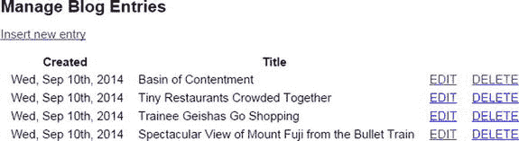
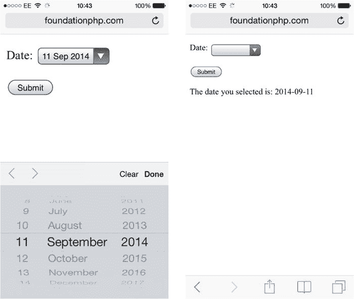
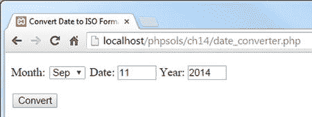
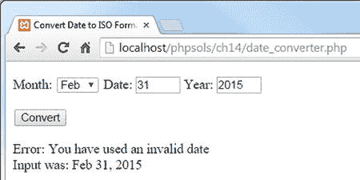
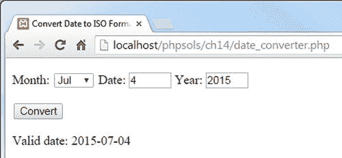

# 14. 格式化文本与日期

上一章还有一些未完成的工作。第 13 章中的图 13-1 显示了 `blog` 表中的内容，每篇文章仅显示前两句话，并提供一个链接指向文章剩余部分。但我没有向你展示具体实现方法。有多种方式可以从长文本的开头提取较短的文本片段。有些方法相当粗糙，通常会在末尾留下一个不完整的单词。在本章中，你将学习如何提取完整的句子。

另一项未完成的工作是：`blog_list_mysqli.php` 和 `blog_list_pdo.php` 中的完整文章列表以原始状态显示了 MySQL 时间戳，这显得不够优雅。你需要重新格式化日期，使其对用户更友好。处理日期可能非常令人头疼，因为 MySQL 和 MariaDB 存储日期的方式与 PHP 完全不同。本章将引导你穿越 PHP/MySQL 环境下存储和显示日期的雷区。你还将学习 PHP 的日期和时间功能，这些功能让复杂的日期计算（例如查找每个月的第二个星期二）变得轻而易举。

在本章中，你将了解以下内容：

- 提取较长文本项的第一部分
- 在 SQL 查询中使用别名
- 将从数据库检索的文本显示为段落
- 使用 MySQL 格式化日期
- 基于时间条件选择记录
- 使用 PHP 的 `DateTime`、`DateTimeZone`、`DateInterval` 和 `DatePeriod` 类

## 显示文本摘要

有许多方法可以从较长的文本中提取前几行或前几个字符。有时你只需要前 20 或 30 个字符来识别一项内容。其他时候，最好显示完整的句子或段落。

### 提取固定数量的字符

你可以使用 PHP 的 `substr()` 函数或 SQL 查询中的 `LEFT()` 函数从文本项的开头提取固定数量的字符。

#### 使用 PHP 的 `substr()` 函数

`substr()` 函数从较长的字符串中提取子字符串。它接受三个参数：要从中提取子字符串的字符串、起始位置（从 0 开始计数）以及要提取的字符数。以下代码显示 `$row['article']` 的前 100 个字符：

```
echo substr($row['article'], 0, 100);
```

原始字符串保持不变。如果省略第三个参数，`substr()` 将提取从起始位置到字符串末尾的所有内容。这仅在起始点不为 0 时才有意义。

#### 在 SQL 查询中使用 `LEFT()` 函数

`LEFT()` 函数从列的开头提取字符。它接受两个参数：列名和要提取的字符数。以下语句从 `blog` 表的 `article` 列中检索 `article_id`、`title` 和前 100 个字符：

```
SELECT article_id, title, LEFT(article, 100)
FROM blog ORDER BY created DESC
```

每当你在 SQL 查询中像这样使用函数时，结果集中的列名将不再是 `article`，而是变为 `LEFT(article, 100)`。因此，最好使用 `AS` 关键字为受影响的列分配别名。你可以将列的原始名称重新分配为别名，或者像下面的例子一样使用描述性名称（代码位于 `ch14` 文件夹中的 `blog_left_mysqli.php` 和 `blog_left_pdo.php`）：

```
SELECT article_id, title, LEFT(article, 100) AS first100
FROM blog ORDER BY created DESC
```

如果你将每条记录处理为 `$row`，则摘要内容位于 `$row['first100']` 中。要同时检索前 100 个字符和完整文章，只需像下面这样在查询中同时包含两者：

```
SELECT article_id, title, LEFT(article, 100) AS first100, article
FROM blog ORDER BY created DESC
```

如图 14-1 所示，提取固定数量的字符会产生粗糙的结果。


图 14-1. 从文章中选取前 100 个字符会将许多单词截断

### 在完整单词处结束摘要

要在完整单词处结束摘要，你需要找到最后一个空格，并用其来确定子字符串的长度。因此，如果你希望摘要最多为 100 个字符，首先使用前述任一方法，并将结果存储在 `$extract` 中。然后，你可以使用 PHP 字符串函数 `strrpos()` 和 `substr()` 来找到最后一个空格，并像这样结束摘要（代码位于 `blog_word_mysqli.php` 和 `blog_word_pdo.php`）：

```
$extract = $row['first100'];
// 查找摘要中最后一个空格的位置
$lastSpace = strrpos($extract, ' ');
// 使用 $lastSpace 设置新摘要的长度并添加 ...
echo substr($extract, 0, $lastSpace) . '... ';
```

这样会产生如图 14-2 所示的更优雅的结果。它使用了 `strrpos()`，该函数用于查找一个字符或子字符串在另一个字符串中的最后一个位置。由于你要查找的是空格，第二个参数是一对引号，中间包含一个空格。结果存储在 `$lastSpace` 中，并将其作为第三个参数传递给 `substr()`，从而在完整单词处结束摘要。最后，添加一个包含三个点和空格的字符串，并通过连接运算符（句点或点）将两者连接起来。


图 14-2. 在完整单词处结束摘要会产生更优雅的结果

**注意：** 不要混淆 `strrpos()`（获取字符或子字符串的最后一个位置）与 `strpos()`（获取第一个位置）。多出的“r”代表“反向”——`strrpos()` 从字符串末尾开始搜索。


### 提取第一段落

假设你在数据库中输入文本时，使用回车键（Enter）来分隔段落，那么这将会非常简单。只需检索完整文本，使用 `strpos()` 找到第一个换行符，然后用 `substr()` 提取截至该位置的第一段文本。

以下 SQL 查询用于 `blog_para_mysqli.php` 和 `blog_para_pdo.php`：

```
SELECT article_id, title, article
FROM blog ORDER BY created DESC
```

以下代码用于显示 `article` 的第一段落：

```
<?= substr($row['article'], 0, strpos($row['article'], PHP_EOL)); ?>
```

如果这段代码让你头晕，那么让我们把它拆开，单独查看第三个参数：

`strpos($row['article'], PHP_EOL)`

这行代码使用 `PHP_EOL` 常量（参见第 7 章中的“使用 `fopen()` 追加内容”），以跨平台的方式定位 `$row['article']` 中的第一个行结束符。你可以将代码重写为：

```
$newLine = strpos($row['article'], PHP_EOL);
echo substr($row['article'], 0, $newLine);
```

两组代码的功能完全相同，但 PHP 允许你将一个函数嵌套作为另一个函数的参数。只要嵌套函数返回有效结果，就可以经常使用此类简写方式。

使用 `PHP_EOL` 常量解决了处理 Linux、Mac OS X 和 Windows 系统在插入换行符时使用不同字符的问题。

### 显示段落

既然我们讨论到了段落主题，许多初学者会对从数据库检索的所有文本都显示为连续块、段落之间没有分隔这一事实感到困惑。HTML 会忽略空白字符，包括换行符。要将数据库中存储的文本按段落显示，你可以选择以下方法：

- 将文本存储为 HTML 格式。
- 将换行符转换为 `<br/>` 标签。
- 创建自定义函数，将换行符替换为段落标签。

#### 将数据库记录存储为 HTML 格式

第一种选择是在内容管理表单中安装 HTML 编辑器，例如 CK Editor（[`ckeditor.com/`](http://ckeditor.com/)）或 TinyMCE（[www.tinymce.com](http://www.tinymce.com/)）。在插入或更新文本时进行标记。HTML 格式会被存储在数据库中，文本也能按预期方式显示。安装这些编辑器的内容超出了本书的讨论范围。

#### 将换行符转换为 `<br/>` 标签

最简单的方法是在显示文本之前，将其传递给 `nl2br()` 函数，代码如下：

```
echo nl2br($row['article']);
```

瞧！——段落出来了。嗯，其实并非如此。`nl2br()` 函数将换行符转换为 `<br/>` 标签（结尾处的斜杠是为了与 XHTML 兼容，在 HTML5 中也是有效的）。结果，你得到的是伪段落。这是一种快速但粗糙的解决方案，并不理想。

#### 创建插入 `<p>` 标签的函数

要将从数据库检索的文本显示为真正的段落，可以用一对段落标签包裹数据库结果，然后使用 `preg_replace()` 函数将连续的换行符替换为关闭的 `</p>` 标签，后面紧接着一个起始的 `<p>` 标签，代码如下：

```
<p><?= preg_replace('/[\r\n]+/', "</p>\n<p>", $row['article']); ?></p>
```

用作第一个参数的正则表达式匹配一个或多个回车符和/或换行符。这里不能使用 `PHP_EOL` 常量，因为你需要匹配所有连续的换行符，并将它们替换为一对段落标签。这对 `<p>` 标签放在双引号内，并在它们之间添加 `\n` 以插入换行符，从而使 HTML 代码更易于阅读。记住正则表达式的模式可能比较困难，因此你可以轻松地将其转换为自定义函数，如下所示：

```
function convertToParas($text) {
    $text = trim($text);
    return '<p>' . preg_replace('/[\r\n]+/', "</p>\n<p>", $text) . "</p>\n";
}
```

该函数会剔除文本开头和结尾的空白字符（包括换行符），在开头添加一个 `<p>` 标签，将内部的连续换行符序列替换为闭合和起始标签，并在末尾附加一个关闭的 `</p>` 标签和一个换行符。

然后你可以这样使用该函数：

```
<?= convertToParas($row['article']); ?>
```

函数定义的代码位于 `ch14` 文件夹中的 `utility_funcs.php` 文件内。你可以在 `blog_ptags_mysqli.php` 和 `blog_ptags_pdo.php` 中查看其用法。


### 提取完整句子

PHP 本身并没有句子的概念。仅仅统计句号数量意味着会忽略所有以感叹号或问号结尾的句子，而且还可能在小数点处错误断句，或在句号后截断引号。为了解决这些问题，我编写了一个名为 `getFirst()` 的 PHP 函数，用于识别普通句子结尾的标点符号：

- 句号、问号或感叹号
- 可选地后跟单引号或双引号
- 后跟一个或多个空格

`getFirst()` 函数接受两个参数：需要提取首个部分的文本，以及需要提取的句子数量。第二个参数是可选的；如果未提供，函数默认提取前两个句子。代码如下（位于 `utility_funcs.php` 中）：

```
function getFirst($text, $number=2) {

// 使用正则表达式将文本拆分为句子
$sentences = preg_split('/([.?!]["\\'']?\s)/', $text, $number+1,
PREG_SPLIT_DELIM_CAPTURE);
if (count($sentences) > $number * 2) {
$remainder = array_pop($sentences);
} else {
$remainder = '';
}
$result = [];
$result[0] = implode('', $sentences);
$result[1] = $remainder;
return $result;
}
```

你真正需要了解的是：该函数返回一个包含两个元素的数组：提取出的句子和剩余文本。你可以利用第二个元素创建指向全文页面的链接。

如果你对函数的工作原理感兴趣，请继续阅读。以粗体高亮的那一行代码使用正则表达式来识别每个句子的结尾——句号、问号或感叹号，可选地后跟双引号或单引号以及空格。这作为第一个参数传递给 `preg_split()`，后者使用该正则表达式将文本拆分为数组。第二个参数是目标文本。第三个参数决定将文本拆分为的最大块数。你希望该值比要提取的句子数量多一。通常，`preg_split()` 会丢弃正则表达式匹配到的字符，但通过将 `PREG_SPLIT_DELIM_CAPTURE` 作为第四个参数，并结合正则表达式中的一对捕获括号，这些字符会被保留为独立的数组元素。换句话说，`$sentences` 数组的元素由句子的文本后跟标点和空格交替组成，如下所示：

```
$sentences[0] = '"Hello, world';
$sentences[1] = '!" ';
```

我们无法预先知道目标文本中有多少句子，因此需要检查提取所需数量的句子后是否还有剩余内容。条件语句使用 `count()` 来获取 `$sentences` 数组的元素个数，并将结果与 `$number` 乘以 2 进行比较（因为每个句子对应数组中的两个元素）。如果还有更多文本，`array_pop()` 会移除 `$sentences` 数组的最后一个元素并将其赋给 `$remainder`。如果没有更多文本，`$remainder` 就是一个空字符串。

函数的最后阶段使用 `implode()` 并将空字符串作为其第一个参数，将提取出的句子重新拼接起来，然后返回一个包含提取文本和剩余内容的双元素数组。

如果你觉得这个解释难以理解，不必担心。这段代码相当高级。我经过大量实验才构建出这个函数，并且多年来逐渐对其进行了改进。

### PHP 解决方案 14-1：显示文章的前两个句子

本 PHP 解决方案展示了如何使用上一节中描述的 `getFirst()` 函数，显示 `blog` 表中每篇文章的摘录。如果你在前面的章节中创建了 Japan Journey 站点，请使用 `blog.php`。或者，使用 `ch14` 文件夹中的 `blog_01.php`，并将其保存为 `phpsols` 站点根目录下的 `blog.php`。你还需要 `includes` 文件夹中的 `footer.php`、`menu.php`、`title.php` 和 `connection.php`。如果 `includes` 文件夹中还没有这些文件，`ch14` 文件夹中提供有副本。

将 `utility_funcs.php` 从 `ch14` 文件夹复制到 `includes` 文件夹，并在 `blog.php` 中 `DOCTYPE` 声明上方的 PHP 代码块中包含它。同时包含 `connection.php` 并创建数据库连接。此页面只需要只读权限，因此使用 `read` 作为传递给 `dbConnect()` 的参数，如下所示：

```
require_once './includes/connection.php';
require_once './includes/utility_funcs.php';
// 创建数据库连接
$conn = dbConnect('read');
```

准备一条 SQL 查询语句以检索 `blog` 表中的所有记录，然后提交它，如下所示：

- 如果你使用 PDO，请将 `'pdo'` 作为第二个参数添加到 `dbConnect()`。

```
$sql = 'SELECT * FROM blog ORDER BY created DESC';
$result = $conn->query($sql);
```

- 对于 MySQLi，请使用以下代码：

添加代码以检查数据库错误。

```
if (!$result) {
$error = $conn->error;
}
```

- 对于 PDO，调用 `errorInfo()` 方法并检查第三个数组元素是否存在，如下所示：

```
$errorInfo = $conn->errorInfo();
if (isset($errorInfo[2])) {
$error = $errorInfo[2];
}
```

删除页面主体中 `<main>` 元素内的所有静态 HTML，并添加代码以在查询出现问题时显示错误消息：

```
<main>
<?php if (isset($error)) {
echo "<p>$error</p>";
} else {
}
?>
</main>
```

在 `else` 块内创建一个循环来显示结果：

```
while ($row = $result->fetch_assoc()) {
echo "<h2>{$row['title']}</h2>";
$extract = getFirst($row['article']);
echo "<p>$extract[0]";
if ($extract[1]) {
echo '<a href="details.php?article_id=' . $row['article_id'] . '">
更多</a>';
}
echo '</p>';
}
```

- 除了这一行，PDO 的代码相同：

`while ($row = $result->fetch_assoc()) {`

- 将其替换为以下内容：

`while ($row = $result->fetch()) {`

通过向 `getFirst()` 添加一个数字作为第二个参数来测试函数，如下所示：

`$extract = getFirst($row['article'], 3);`

- 这将显示前三个句子。如果你增加该数字使其等于或超过文章中的句子数量，则不会显示“更多”链接。
- 你可以将自己的代码与 `ch14` 文件夹中的 `blog_mysqli.php` 和 `blog_pdo.php` 进行比较。

前两个句子已从较长的文本中干净地提取出来。保存页面并在浏览器中测试。你应该会看到每篇文章的前两个句子，如图 14-3 所示。

- `getFirst()` 函数处理 `$row['article']` 并将结果存储在 `$extract` 中。`$extract[0]` 中的前两个句子会立即显示。如果 `$extract[1]` 包含任何内容，则表示还有更多内容需要显示。因此，`if` 块内的代码会显示一个指向 `details.php` 的链接，并在查询字符串中包含文章的主键。

我们将在第 15 章中探讨 `details.php`。在此之前，让我们先解决在动态网站中使用日期这一棘手问题。

## 让我们处理日期

日期和时间对现代生活至关重要，以至于我们很少停下来思考它们有多复杂。一分钟有 60 秒，一小时有 60 分钟，但一天有 24 小时。月份有 28 到 31 天，一年可以是 365 天或 366 天。混乱远不止于此，因为 7/4 对美国或日本人意味着 7 月 4 日，但对欧洲人则意味着 4 月 7 日。更添混乱的是，PHP 处理日期的方式与 MySQL 不同。是时候让混乱变得有序了……

> 注意：MariaDB 以相同的方式处理日期。为避免不必要的重复，我将仅提及 MySQL。


### MySQL 如何处理日期

在 MySQL 中，日期和时间始终按从最大单位到最小单位的降序表示：年、月、日、小时、分钟、秒。小时始终采用 24 小时制，午夜表示为 `00:00:00`。即使这对你来说不太熟悉，这也是国际标准化组织（ISO）推荐的格式。

MySQL 允许在单位之间的分隔符上有相当大的灵活性（任何标点符号都可以接受），但顺序是固定的，没有争议。如果你尝试以年、月、日以外的任何其他格式存储日期，MySQL 会在数据库中插入 `0000-00-00`。

稍后我会再讨论如何将日期插入 MySQL，因为最好使用 PHP 来验证和格式化它们。首先，我们来看看日期存储在 MySQL 后，可以用它来做些什么。MySQL 有许多日期和时间函数，这些函数及其示例列在 [`http://dev.mysql.com/doc/refman/5.6/en/date-and-time-functions.html`](http://dev.mysql.com/doc/refman/5.6/en/date-and-time-functions.html) 上。

最有用的函数之一是 `DATE_FORMAT()`，它的功能正如其名。

#### 在 SELECT 查询中使用 `DATE_FORMAT()` 格式化日期

`DATE_FORMAT()` 的语法如下：

`DATE_FORMAT(date, format)`

通常，`date` 是要格式化的表列，而 `format` 是一个由格式说明符和你想包含的任何其他文本组成的字符串。表 14-1 列出了最常见的说明符，它们都是区分大小写的。

**表 14-1.** 常用的 MySQL 日期格式说明符

| 时间段 | 说明符 | 描述 | 示例 |
| --- | --- | --- | --- |
| 年 | `%Y` | 四位数格式 | 2014 |
|  | `%y` | 两位数格式 | 14 |
| 月 | `%M` | 完整的月份名称 | January, September |
|  | `%b` | 缩写名称，三个字母 | Jan, Sep |
|  | `%m` | 带前导零的数字 | 01, 09 |
|  | `%c` | 不带前导零的数字 | 1, 9 |
| 月中日期 | `%d` | 带前导零 | 01, 25 |
|  | `%e` | 不带前导零 | 1, 25 |
|  | `%D` | 带英文文本后缀 | 1st, 25th |
| 工作日名称 | `%W` | 完整文本 | Monday, Thursday |
|  | `%a` | 缩写名称，三个字母 | Mon, Thu |
| 小时 | `%H` | 24 小时制，带前导零 | 01, 23 |
|  | `%k` | 24 小时制，不带前导零 | 1, 23 |
|  | `%h` | 12 小时制，带前导零 | 01, 11 |
|  | `%l` (小写“L”) | 12 小时制，不带前导零 | 1, 11 |
| 分钟 | `%i` | 带前导零 | 05, 25 |
| 秒 | `%S` | 带前导零 | 08, 45 |
| 上午/下午 | `%p` |  |  |

如前所述，在 SQL 查询中使用函数时，请使用 `AS` 关键字将结果分配给一个别名。参考表 14-1，你可以按常见的美国风格格式化 `blog` 表中 `created` 列的日期，并将其分配给一个别名，如下所示：

```
DATE_FORMAT(created, '%c/%e/%Y') AS date_created
```

要按欧洲风格格式化同一日期，可以调换前两个说明符，如下所示：

```
DATE_FORMAT(created, '%e/%c/%Y') AS date_created
```

**提示**  
使用 `DATE_FORMAT()` 时，不要将原始列名用作别名，因为值会被转换为字符串，这会严重扰乱排序顺序。选择一个不同的别名，并使用原始列名对结果进行排序。

#### PHP 解决方案 14-2：格式化 MySQL 日期或时间戳

此 PHP 解决方案用于格式化第 13 章博客条目管理页面中的日期。

打开 `admin` 文件夹中的 `blog_list_mysqli.php` 或 `blog_list_pdo.php`，找到 SQL 查询。它看起来像这样：

```
$sql = 'SELECT * FROM blog ORDER BY created DESC';
```

将其修改为：

```
$sql = 'SELECT article_id, title,
DATE_FORMAT(created, "%a, %b %D, %Y") AS date_created
FROM blog ORDER BY created DESC';
```

- `blog_list_mysqli.php` 和 `blog_list_pdo.php` 的更新版本位于 `ch14` 文件夹中。



**图 14-4.** MySQL 时间戳现在格式良好

在页面正文的第一个表格单元格中，将 `$row['created']` 改为 `$row['date_created']`，以匹配 SQL 查询中的别名。保存页面并将其加载到浏览器中。现在，日期应格式化如图 14-4 所示。尝试使用其他说明符以满足你的偏好。

- 我在整个 SQL 查询周围使用了单引号，因此 `DATE_FORMAT()` 中的格式字符串需要使用双引号。
- 确保 `DATE_FORMAT()` 的左括号前没有空格。
- 格式字符串以 `%a` 开头，它显示工作日名称的前三个字母。如果使用原始列名作为别名，`ORDER BY` 子句将按反向字母顺序对日期排序：Wed, Thu, Sun 等。使用不同的别名可以确保日期仍按时间顺序排序。

#### 日期的加减运算

处理日期时，添加或减去特定的时间段通常很有用。例如，你可能想要显示过去七天内添加到数据库中的项目，或者停止显示三个月未更新的文章。MySQL 通过 `DATE_ADD()` 和 `DATE_SUB()` 使这变得简单。这两个函数分别有名为 `ADDDATE()` 和 `SUBDATE()` 的同义词。

它们的基本语法都相同，如下所示：

```
DATE_ADD(date, INTERVAL value interval_type)
```

使用这些函数时，`date` 可以是包含要更改日期的列、包含特定日期（采用 `YYYY-MM-DD` 格式）的字符串，或者是一个 MySQL 函数，例如 `NOW()`。`INTERVAL` 是一个关键字，后跟一个值和一个间隔类型，表 14-2 列出了最常用的间隔类型。

**表 14-2.** `DATE_ADD()` 和 `DATE_SUB()` 最常用的间隔类型

| 间隔类型 | 含义 | 值格式 |
| --- | --- | --- |
| `DAY` | 天 | 数字 |
| `DAY_HOUR` | 天和小时 | 字符串，格式为 `'DD hh'` |
| `WEEK` | 周 | 数字 |
| `MONTH` | 月 | 数字 |
| `QUARTER` | 季度 | 数字 |
| `YEAR` | 年 | 数字 |
| `YEAR_MONTH` | 年和月 | 字符串，格式为 `'YY-MM'` |

间隔类型是常量，因此不要在 `DAY`、`WEEK` 等的末尾添加“S”使其成为复数形式。

这些函数最有用的应用之一是仅显示表中最近的项目。

#### PHP 解决方案 14-3：显示过去一周内更新的项目

此 PHP 解决方案演示了如何根据特定的时间间隔限制数据库结果的显示。使用 PHP 解决方案 14-1 中的 `blog.php`。

在 `blog.php` 中找到 SQL 查询。它看起来像这样：

```
$sql = 'SELECT * FROM blog ORDER BY created DESC';
```

将其修改为：

```
$sql = 'SELECT * FROM blog
WHERE updated > DATE_SUB(NOW(), INTERVAL 1 WEEK)
ORDER BY created DESC';
```

- 你可以将你的代码与 `ch14` 文件夹中的 `blog_limit_mysqli.php` 和 `blog_limit_pdo.php` 进行比较。

保存并在浏览器中重新加载页面。根据你上次更新 `blog` 表中的项目的时间，你应该会看到要么没有结果，要么只有有限范围内的项目。如有必要，将间隔类型更改为 `DAY` 或 `HOUR` 以测试时间限制是否有效。打开 `blog_list_mysqli.php` 或 `blog_list_pdo.php`，选择一个未在 `blog.php` 中显示的项目，然后进行编辑。重新加载 `blog.php`。你刚刚更新的项目现在应该会显示出来。

- 这告诉 MySQL，你只需要在过去一周内更新过的项目。


### 在 MySQL 中插入日期

MySQL 要求日期必须按照 `YYYY-MM-DD` 的格式存放，这对于允许用户输入日期的在线表单来说十分令人头疼。正如你在第 13 章中所见，通过使用 `TIMESTAMP` 类型的列，可以自动插入当前日期和时间。你也可以使用 MySQL 的 `NOW()` 函数在 `DATE` 或 `DATETIME` 类型的列中插入当前日期。当你需要插入其他日期时，问题就来了。

在表单中使用文本输入框依赖于用户是否能够按照设定的日期输入模式来操作，例如 `MM/DD/YYYY`。如果每个人都遵守规则，你就可以使用 `explode()` 函数重新排列日期的各个部分，就像这样：

```
if (isset($_POST['theDate'])) {
    $date = explode('/', $_POST['theDate']);
    $mysqlFormat = "$date[2]-$date[0]-$date[1]";
}
```

如果有人不按这个格式输入，你的数据库中最终就会出现无效的日期。

当所有浏览器都支持 HTML5 日期输入字段时，情况最终会变得简单得多。在 `ch14` 文件夹中的 `date_test.php` 里有一个示例。页面主体部分的代码如下：

```
<form method="post" action="">
    <p>
        <label for="date">日期：</label>
        <input type="date" name="date" id="date">
    </p>
    <p>
        <input type="submit" name="submit" id="submit" value="提交">
    </p>
</form>

<?php
if (isset($_POST['submit'])) {
    echo '您选择的日期是：' . htmlentities($_POST['date']);
}
?>
```

使用 `date` 作为输入类型的真正优势在于，浏览器通常会在该字段获得焦点时立即显示日期选择器，并且所选值会根据设备的用户设置来显示。因此，美国人和欧洲人可以以他们偏好的格式看到日期。但是当表单提交时，该值始终是国际标准 `YYYY-MM-DD` 格式。图 14-5 展示了在我的 iPhone 5 上的 Safari 7.1 中 `date_test.php` 的输出结果。日期选择器和 `date` 字段使用的是英国日期格式，但通过 `$_POST` 数组提交的值是国际标准格式。



**图 14-5.** HTML5 日期输入字段以本地格式显示日期，但以国际标准格式提交

不幸的是，截至 2014 年 9 月，只有 50% 的浏览器支持日期输入类型。在撰写本书时，尚无迹象表明诸如 Internet Explorer 和 Firefox 等主流浏览器何时计划提供支持。

因此，从在线表单收集日期最可靠的方法仍然是使用月份、日期和年份各自独立的输入字段。

### PHP 解决方案 14-4：为 MySQL 输入验证和格式化日期

此 PHP 解决方案专注于检查日期的有效性并将其转换为 MySQL 格式。它被设计为可以集成到你自己的插入或更新表单中。

创建一个名为 `date_converter.php` 的页面，并插入一个包含以下代码的表单（或使用 `ch14` 文件夹中的 `date_converter_01.php`）：

```
<form method="post" action="">
    <p>
        <label for="month">月份：</label>
        <select name="month" id="month">
            <option value=""></option>
        </select>
        <label for="day">日期：</label>
        <input name="day" type="number" required id="day" max="31" min="1" maxlength="2">
        <label for="year">年份：</label>
        <input name="year" type="number" required id="year" maxlength="4">
    </p>
    <p>
        <input type="submit" name="convert" id="convert" value="转换">
    </p>
</form>
```

这段代码创建了一个名为 `month` 的下拉菜单以及两个分别名为 `day` 和 `year` 的输入字段。这个下拉菜单目前没有任何值，但稍后将通过 PHP 循环来填充。`day` 和 `year` 字段使用了 HTML5 的 `number` 类型和 `required` 属性。日期字段还设置了 `max` 和 `min` 属性，以便将范围限制在 1 到 31 之间。支持新 HTML5 表单元素的浏览器会在这些字段旁边显示数字调节器，并限制输入的类型和范围。其他浏览器则将其渲染为普通的文本输入字段。为了兼容旧版浏览器，两者都设置了 `maxlength` 属性，以限制可接受的字符数。

修改构建下拉菜单的部分，如下所示：

```
<select name="month" id="month">
    <?php
    $months = ['一月','二月','三月','四月','五月','六月',
               '七月','八月', '九月', '十月', '十一月','十二月'];
    $thisMonth = date('n');
    for ($i = 1; $i <= 12; $i++) { ?>
        <option value="<?= $i; ?>"
        <?php
        if ((!$_POST && $i == $thisMonth) ||
            (isset($_POST['month']) && $i == $_POST['month'])) {
            echo ' selected';
        } ?>>
        <?= $months[$i - 1]; ?>
        </option>
    <?php } ?>
</select>
```

还需用当前日期或表单提交后所选的值来填充日期和年份字段。

- 这段代码创建了一个月份名称数组，并使用 `date()` 函数来查找当前月份的数值（传递给 `date()` 的参数含义将在本章后面解释）。
- 然后，一个 `for` 循环用来填充菜单的 `<option>` 标签。我将 `$i` 的初始值设为 `1`，因为我希望用它来表示月份的值。在循环内部，条件语句检查两组条件，两者都包含在括号内以确保它们按照正确的顺序被求值。第一组检查 `$_POST` 数组是否为空，以及 `$i` 和 `$thisMonth` 的值是否相同。但如果表单已经提交，`$_POST['month']` 将会被设置，因此另一组条件检查 `$i` 是否与 `$_POST['month']` 相同。因此，当表单首次加载时，`selected` 会被插入到当前月份的 `<option>` 标签中。但如果表单已经被提交，则会再次显示用户选择的月份。
- 月份的名称通过从 `$months` 数组中提取来显示在 `<option>` 标签之间。因为索引数组从 0 开始，所以你需要从 `$i` 的值中减去 1 才能获得正确的月份。

```
<label for="day">日期：</label>
<input name="day" type="number" required id="day" max="31" min="1"
       maxlength="2" value="<?php if (!$_POST) {
           echo date('j');
       } elseif (isset($_POST['day'])) {
           echo $_POST['day'];
       } ?>">

<label for="year">年份：</label>
<input name="year" type="number" required id="year" maxlength="4"
       value="<?php if (!$_POST) {
           echo date('Y');
       } elseif (isset($_POST['year'])) {
           echo $_POST['year'];
       } ?>">
```

执行所有检查的代码是 `utility_funcs.php` 中的一个自定义函数。内容如下：


- 如果您测试输入字段，在大多数浏览器中，`Date`字段最多接受两个字符，`Year`字段最多接受四个字符。尽管这减少了出错的可能性，您仍然需要验证输入并正确格式化日期。



图 14-6. 为日期部分使用单独的输入字段有助于消除错误

保存页面并在浏览器中测试。它应该显示当前日期，外观类似于图 14-6。

```php
function convertDateToISO($month, $day, $year) {
    $month = trim($month);
    $day = trim($day);
    $year = trim($year);
    $result[0] = false;
    if (empty($month) || empty($day) || empty($year)) {
        $result[1] = '请填写所有字段';
    } elseif (!is_numeric($month) || !is_numeric($day) ||
        !is_numeric($year)) {
        $result[1] = '请仅使用数字';
    } elseif (($month < 1 || $month > 12) || ($day < 1 || $day > 31) ||
        ($year < 1000 || $year > 9999)) {
        $result[1] = '请使用正确范围内的数字';
    } elseif (!checkdate($month,$day,$year)) {
        $result[1] = '您使用了无效日期';
    } else {
        $result[0] = true;
        $result[1] = sprintf('%d-%02d-%02d', $year, $month, $day);
    }
    return $result;
}
```

- 该函数接受三个参数：`month`、`day`和`year`，它们都应该是数字。前三行代码去除输入两端的空白，下一行初始化`$result`数组的第一个元素。如果输入验证失败，数组的第一个元素为`false`，第二个元素包含错误消息。如果验证通过，`$result`的第一个元素为`true`，第二个元素包含格式化后的日期，准备插入到 MySQL 中。
- 这一系列条件语句检查输入值是否为空或非数字。第三个测试检查数字是否在可接受范围内。年份的范围由 MySQL 的法定范围决定。在极少数情况下，如果您需要的年份超出该范围，您必须选择不同的列类型来存储数据。
- 通过使用一系列`elseif`子句，这段代码在遇到第一个错误时立即停止测试。尽管表单预填了值，但无法保证输入来自您的表单。它可能来自自动脚本，因此这些检查是必要的。
- 如果输入通过了前三个测试，它随后会接受 PHP 函数`checkdate()`的检查，该函数足够智能，能够识别闰年并防止 9 月 31 日这样的错误。
- 最后，如果输入通过了所有测试，它会使用`sprintf()`函数重新构建为适合插入 MySQL 的正确格式。该函数将格式化字符串作为第一个参数，其中`%d`代表整数，`%02d`代表必要时用前导零填充的两位数整数。连字符按字面处理。接下来的三个参数是要插入格式化字符串的值。这会生成 ISO 格式的日期，月份和日期带有前导零。

> **注意**：有关`sprintf()`的详细信息，请参见[`http://php.net/manual/en/function.sprintf.php`](http://php.net/manual/en/function.sprintf.php)。

为了测试目的，在页面主体的表单下方添加以下代码：

```php
if (isset($_POST['convert'])) {
    require_once 'utility_funcs.php';
    $converted = convertDateToISO($_POST['month'], $_POST['day'],
        $_POST['year']);
    if ($converted[0]) {
        echo '有效日期: ' . $converted[1];
    } else {
        echo '错误: ' . $converted[1] . '<br>';
        echo '输入值为: ' . $months[$_POST['month']-1] . ' ' .
            $_POST['day'] . ', ' . $_POST['year'];
    }
}
```

- 您可以将您的代码与`ch14`文件夹中的`date_converter_02.php`进行比较。



图 14-8. `convertDateToISO()`函数拒绝无效日期

- 如果您输入无效日期，您应该看到相应的错误消息（见图 14-8）。



图 14-7. 日期已验证并转换为 ISO 格式

保存页面并通过输入日期并单击“转换”进行测试。如果日期有效，您应该看到它被转换为 ISO 格式，如图 14-7 所示。

- 这检查表单是否已提交。如果已提交，它会包含`utility_funcs.php`（在`ch14`文件夹中有一份副本）并将表单值传递给`convertDateToISO()`函数，将结果保存在`$converted`中。
- 如果日期有效，`$converted[0]`为`true`，格式化后的日期位于`$converted[1]`中。如果日期无法转换为 ISO 格式，`else`块会显示存储在`$converted[1]`中的错误消息以及原始输入。为了显示正确的月份值，从`$_POST['month']`的值中减去 1，将结果用作`$months`数组的键。

当为需要用户输入日期的表创建表单时，以与`date_converter.php`相同的方式添加三个字段：月份、日期和年份。在将表单输入插入数据库之前，包含`utility_funcs.php`（或您决定存放该函数的任何位置），并使用`convertDateToISO()`函数验证日期并将其格式化为适合数据库插入的格式。

```php
require_once 'utility_funcs.php';
$converted = convertDateToMySQL($_POST['month'], $_POST['day'], $_POST['year']);
if ($converted[0]) {
    $date = $converted[1];
} else {
    $errors[] = $converted[1];
}
```

如果您的`$errors`数组包含任何元素，则放弃插入或更新过程并显示错误。否则，`$date`可以安全地插入到 SQL 查询中。

> **注意**：本章其余部分专门介绍在 PHP 中处理日期。这是一个重要但复杂的话题。我建议您浏览每一节以熟悉 PHP 的日期处理功能，并在需要实现特定功能时返回本节。


### 在 PHP 中处理日期

PHP 处理日期和时间的方式在 PHP 5.2 中发生了重大变化，引入了 `DateTime` 和 `DateTimeZone` 类。PHP 5.3 通过添加新的 `DateTime` 方法以及 `DateInterval` 和 `DatePeriod` 类，又引入了进一步的更改。PHP 5.5 中新增了 `DateTimeImmutable` 类，这是另一个增强。在这些更改之前，日期和时间完全以 Unix 时间戳的形式处理——即自 1970 年 1 月 1 日午夜 UTC（协调世界时）以来的秒数。

新类并没有完全取代处理日期和时间信息的原始方式，但它们更加灵活。如果 PHP 在 32 位处理器上编译，时间戳将存储为 32 位整数，将日期的上限范围限制在 2038 年 1 月。新类在内部将日期和时间信息存储为 64 位数字，将范围从过去的大约 2920 亿年扩展到同样遥远的未来。

**注意**  
如果 PHP 在 64 位处理器上编译，所有日期和时间都存储为 64 位数字，从而消除了 2038 年 1 月对时间戳以及从 PHP 4 继承的日期和时间相关函数的限制。

表 14-3 总结了 PHP 中主要的日期和时间相关类与函数。

**表 14-3.** PHP 日期和时间相关类与函数

| | 名称 | 参数 | 描述 |
| --- | --- | --- | --- |
| 类 | | | |
| | `DateTime` | 日期字符串，`DateTimeZone` 对象 | 创建一个包含日期和/或时间信息且对时区敏感的对象，可用于日期和时间计算。 |
| | `DateTimeImmutable` | 同 `DateTime` | 基本与 `DateTime` 相同，但更改任何值都会返回一个新对象，原对象保持不变。需要 PHP 5.5 或更高版本。 |
| | `DateTimeZone` | 时区字符串 | 存储时区信息，供 `DateTime` 对象使用。 |
| | `DateInterval` | 间隔规范 | 表示固定数量的时间，如年、月、小时等。 |
| | `DatePeriod` | 开始，间隔，结束/重复次数，选项 | 计算在设定期间或指定重复次数内的重复日期。 |
| 函数 | | | |
| | `time()` | 无 | 生成当前日期和时间的 Unix 时间戳。 |
| | `mktime()` | 时，分，秒，月，日，年 | 生成指定日期/时间的 Unix 时间戳。 |
| | `strtotime()` | 日期字符串，时间戳 | 尝试根据英文文本描述（例如“下周二”）生成 Unix 时间戳。如果提供了第二个参数，返回值将相对于该参数。 |
| | `date()` | 格式字符串，时间戳 | 使用表 14-4 中列出的说明符格式化英文日期。如果省略第二个参数，则使用当前日期和时间。 |
| | `strftime()` | 格式字符串，时间戳 | 与 `date()` 相同，但使用系统区域设置指定的语言。 |

#### 设置默认时区

PHP 中的所有日期和时间信息都根据服务器的默认时区设置进行存储。Web 服务器与目标受众位于不同时区是很常见的，因此了解如何更改默认时区很有用。

服务器的默认时区通常应在 `php.ini` 的 `date.timezone` 指令中设置，但如果您的托管公司忘记设置，或者您想使用不同的时区，则需要自己进行设置。

如果您的托管公司允许您控制自己的 `php.ini` 版本，请在其中更改 `date.timezone` 的值。这样，它将自动为您的所有脚本设置。

如果您的服务器支持 `.htaccess` 或 `.user.ini` 文件，您可以通过在站点根目录下添加相应的命令来更改时区。对于 `.htaccess`，请使用：

```
php_value date.timezone 'timezone'
```

对于 `.user.ini`，命令如下所示：

```
date.timezone=timezone
```

将 `timezone` 替换为您所在位置的正确设置。您可以在 [`docs.php.net/manual/en/timezones.php`](http://docs.php.net/manual/en/timezones.php) 找到所有有效时区的完整列表。

如果这些选项都不可用，请在任意使用日期或时间函数的脚本开头添加以下内容（将 `timezone` 替换为适当的值）：

```
ini_set('date.timezone', 'timezone');
```

#### 创建 DateTime 对象

要创建一个 `DateTime` 对象，只需使用 `new` 关键字后跟 `DateTime()`，如下所示：

```
$now = new DateTime();
```

这将创建一个表示根据 Web 服务器时钟和默认时区设置的当前日期和时间的对象。

`DateTime()` 构造函数还接受两个可选参数：一个包含日期和/或时间的字符串，以及一个 `DateTimeZone` 对象。第一个参数的日期/时间字符串可以是 [`php.net/manual/en/datetime.formats.php`](http://php.net/manual/en/datetime.formats.php) 中列出的任何格式。与仅接受一种格式的 MySQL 不同，PHP 走向了另一个极端。例如，要为 2014 年圣诞节创建一个 `DateTime` 对象，以下所有格式都是有效的：

```
'12/25/2014'
'25-12-2014'
'25 Dec 2014'
'Dec 25 2014'
'25-XII-2014'
'25.12.2014'
'2014/12/25'
'2014-12-25'
'December 25th, 2014'
```

这不是一个详尽的列表，只是有效格式的一部分。可能引起混淆的地方在于分隔符的使用。例如，斜杠允许用于美式日期（`12/25/2010`）和 ISO 日期（`2010/12/25`），但当日期以欧洲顺序呈现或月份用罗马数字表示时则不允许。要以欧洲顺序表示日期，分隔符必须是点、制表符或破折号。

日期也可以使用相对表达式来指定，例如“下周三”、“明天”或“上周一”。然而，这里也可能存在混淆。有些人使用“下周三”来表示“下周的星期三”。PHP 是按字面意思解释表达式的。如果今天是星期二，“下周三”意味着第二天。

**注意**  
PHP 5.3 通过引入一种从自定义格式创建 `DateTime` 对象的方法，进一步扩展了这种灵活性。这将在下一节之后描述，因为相同的技术用于指定输出和输入格式。

您不能单独使用 `echo` 来显示存储在 `DateTime` 对象中的值。除了 `echo`，您需要告诉 PHP 如何使用 `format()` 方法来格式化输出。


