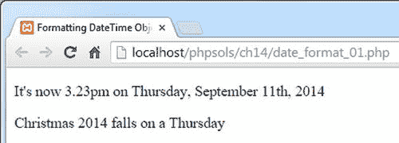

# 在 PHP 中格式化日期

`DateTime` 类的 `format()` 方法使用的格式字符与原始 `date()` 函数相同。虽然这保证了连续性，但这些格式字符通常很难记忆，而且背后似乎缺乏明显的逻辑。表格 14-4 列出了最常用的日期和时间格式字符。

`DateTime` 类和 `date()` 函数仅以英文显示星期几和月份的名称，但 `strftime()` 函数使用的是服务器区域设置所指定的语言。因此，如果服务器的区域设置为西班牙语，`DateTime` 对象和 `date()` 会显示 Saturday，而 `strftime()` 会显示 sábado。除了 `DateTime` 类和 `date()` 函数共同使用的格式字符外，表格 14-4 还列出了 `strftime()` 使用的等效字符。并非所有格式在 `strftime()` 中都有等效项。

**表格 14-4.** 主要的日期和时间格式字符

| 单元 | `DateTime/date()` | `strftime()` | 描述 | 示例 |
| --- | --- | --- | --- | --- |
| 日 | `d` | `%d` | 月份中的日期，带前导零 | 01 到 31 |
|   | `j` | `%e`* | 月份中的日期，不带前导零 | 1 到 31 |
| `S` |   | 月份中日的英文序数后缀 | st, nd, rd, 或 th |
| `D` | `%a` | 星期名称的前三个字母 | Sun, Tue |
| `l`（小写 "L"） | `%A` | 星期名称的全称 | Sunday, Tuesday |
| 月 | `m` | `%m` | 月份数字，带前导零 | 01 到 12 |
|   | `n` |   | 月份数字，不带前导零 | 1 到 12 |
| `M` | `%b` | 月份名称的前三个字母 | Jan, Jul |
| `F` | `%B` | 月份名称的全称 | January, July |
| 年 | `Y` | `%Y` | 四位数字表示的年份 | 2014 |
| `y` | `%y` | 两位数字表示的年份 | 14 |
| 时 | `g` |   | 12 小时制的小时，不带前导零 | 1 到 12 |
| `h` | `%I` | 12 小时制的小时，带前导零 | 01 到 12 |
| `G` |   | 24 小时制的小时，不带前导零 | 0 到 23 |
| `H` | `%H` | 24 小时制的小时，带前导零 | 01 到 23 |
| 分 | `i` | `%M` | 分钟，必要时带前导零 | 00 到 59 |
| 秒 | `s` | `%S` | 秒，必要时带前导零 | 00 到 59 |
| 上午/下午 | `a` | `%p` | 小写 | am |
| 上午/下午 | `A` |   | 大写 | PM |

* 注意：Windows 不支持 `%e`。

你可以将这些格式字符与标点符号结合起来使用，以便根据个人喜好在你网页上显示当前日期。

要格式化一个 `DateTime` 对象，需要将格式字符串作为参数传递给 `format()` 方法，如下所示（代码在 `ch14` 文件夹的 `date_format_01.php` 中）：

```php
<?php
$now = new DateTime();
$xmas2014 = new DateTime('12/25/2014');
?>
<p>It's now <?= $now->format('g.ia'); ?> on <?= $now->format('l, F jS, Y'); ?></p>
<p>Christmas 2014 falls on a <?= $xmas2014->format('l'); ?></p>
```

在这个例子中，创建了两个 `DateTime` 对象：一个用于当前日期和时间，另一个用于 2014 年 12 月 25 日。使用表 14-4 中的格式字符，从这两个对象中提取各种日期部分，产生如下截图所示的输出：



`date_format_02.php` 中的代码通过使用 `date()` 和 `strtotime()` 函数产生相同的输出，如下所示：

```php
<?php $xmas2014 = strtotime('12/25/2014'); ?>
<p>It's now <?= date('g.ia'); ?> on <?= date('l, F jS, Y'); ?></p>
<p>Christmas 2014 falls on a <?= date('l', $xmas2014); ?></p>
```

第一行使用 `strtotime()` 为 2014 年 12 月 25 日创建一个时间戳。无需为当前日期和时间创建时间戳，因为当没有第二个参数时，`date()` 默认使用它们。

如果圣诞节的时间戳在脚本的其他地方没有用到，则可以省略第一行，并将对 `date()` 的最后一次调用重写如下（参见 `date_format_03.php`）：

```php
date('l', strtotime('12/25/2014'));
```