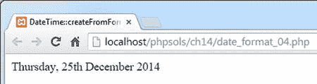
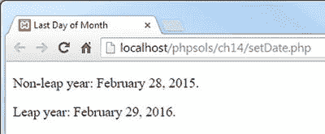
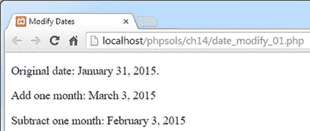
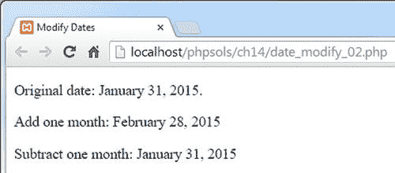
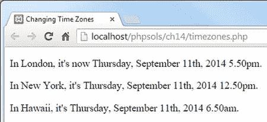
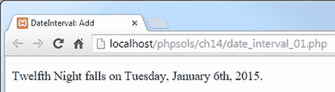
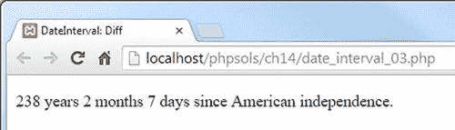
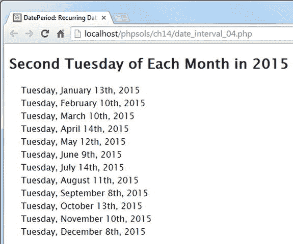
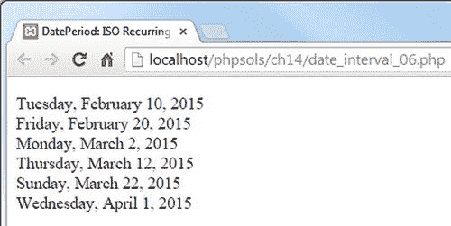

# 从自定义格式创建 DateTime 对象

你可以使用表 14-4 中的格式字符为 `DateTime` 对象指定自定义的输入格式。无需使用 `new` 关键字创建对象，而是使用 `createFromFormat()` 静态方法，如下所示：

```php
$date = DateTime::createFromFormat(format_string, input_date, timezone);
```

第三个参数 `timezone` 是可选的。如果包含，它应该是一个 `DateTimeZone` 对象。

静态方法属于整个类，而不是特定对象。你使用类名后跟作用域解析运算符（双冒号）和方法名来调用静态方法。

**提示**

在内部，这个作用域解析运算符被称为 `PAAMAYIM_NEKUDOTAYIM`，在希伯来语中意为“双冒号”。为什么是希伯来语？驱动 PHP 的 Zend 引擎最初是由 Zeev Suraski 和 Andi Gutmans 在以色列理工学院（Technion–Israel Institute of Technology）学习时开发的。除了在极客冷知识测验中加分之外，了解 `PAAMAYIM_NEKUDOTAYIM` 的含义可以让你在 PHP 错误消息中看到它时，省去许多挠头困惑的功夫。

例如，你可以使用 `createFromFormat()` 方法来接受欧洲格式的日期（日、月、年，用斜杠分隔），如下所示（代码在 `date_format_04.php` 中）：

```php
$xmas2014 = DateTime::createFromFormat('d/m/Y', '25/12/2014');
echo $xmas2014->format('l, jS F Y');
```

这将产生以下输出：



**警告**

尝试将 `25/12/2014` 作为 `DateTime` 构造函数的输入会触发致命错误，因为不支持 `DD/MM/YYYY` 格式。如果你想使用 `DateTime` 构造函数不支持的格式，则必须使用 `createFromFormat()` 静态方法。

尽管 `createFromFormat()` 方法很有用，但它只能在你知道日期始终采用特定格式的情况下使用。

## 在 `Date()` 和 `DateTime` 类之间做选择

在显示日期时，使用 `DateTime` 类总是需要两步操作。你必须先实例化对象，然后才能调用 `format()` 方法。而使用 `date()` 函数，一步就能完成。由于它们使用相同的格式字符，因此在处理当前日期和/或时间时，`date()` 无疑更胜一筹。

对于显示当前日期、时间或年份等简单任务，请使用 `date()`。而 `DateTime` 类的真正优势在于，它可以使用表 14-5 列出的方法处理与日期相关的计算和时区。

表 14-5. 主要的 `DateTime` 方法

| 方法 | 参数 | 描述 |
| --- | --- | --- |
| `format()` | 格式字符串 | 使用表 14-4 中的格式字符格式化日期/时间。 |
| `setDate()` | 年，月，日 | 更改日期。参数应用逗号分隔。超出允许范围的月份或天数会累加到结果日期中，如正文所述。 |
| `setTime()` | 小时，分钟，秒 | 重置时间。参数是用逗号分隔的值。秒是可选的。超出允许范围的值会累加到结果日期/时间中。 |
| `modify()` | 相对日期字符串 | 使用相对表达式更改日期/时间，例如 `'+2 weeks'`。 |
| `getTimestamp()` | 无 | 返回日期/时间的 Unix 时间戳。 |
| `setTimestamp()` | Unix 时间戳 | 根据 Unix 时间戳设置日期/时间。 |
| `setTimezone()` | `DateTimeZone` 对象 | 更改时区。 |
| `getTimezone()` | 无 | 返回一个表示 `DateTime` 对象时区的 `DateTimeZone` 对象。 |
| `getOffset()` | 无 | 返回与 UTC 的时区偏移量，以秒为单位。 |
| `add()` | `DateInterval` 对象 | 将日期/时间增加指定时段。 |
| `sub()` | `DateInterval` 对象 | 从日期/时间中减去指定时段。 |
| `diff()` | `DateTime` 对象，布尔值 | 返回一个 `DateInterval` 对象，表示当前 `DateTime` 对象与作为参数传入的对象之间的差值。将可选的第二个参数设为 `true`，可以将负值转换为其正值。 |

使用带有超出范围值的 `setDate()` 和 `setTime()` 时，超出部分会累加到结果日期或时间中。例如，将月份设为 14 会将日期设置为下一年的二月。将小时设为 26 会导致下一天的凌晨 2 点。

`setDate()` 有一个有用的技巧：通过将月份值设为下一个月，并将日期设为 0，可以将日期设置为任意月份的最后一天。`setDate.php` 中的代码演示了这一点，分别以 2015 年 2 月和 2016 年（闰年）2 月的最后一天为例。

```php
<?php

$format = 'F j, Y';

$date = new DateTime();

$date->setDate(2015, 3, 0);

?>
```

```php
<p>非闰年：<?= $date->format($format); ?>。</p>

<p>闰年：<?php $date->setDate(2016, 3, 0);

echo $date->format($format); ?>。</p>
```

上述示例将产生以下输出：



## 使用相对日期处理溢出问题

`modify()` 方法接受一个相对日期字符串，这可能会产生意想不到的结果。例如，如果你向一个表示 2011 年 1 月 31 日的 `DateTime` 对象添加一个月，得到的结果值不是 2 月的最后一天，而是 3 月 3 日。

这是因为在原始日期上加一个月会得到 2 月 31 日，但在非闰年中，二月只有 28 天。于是，超出范围的值会累加到月份中，得到 3 月 3 日。如果你随后从同一个 `DateTime` 对象中减去一个月，你会回到 2 月 3 日，而不是原始起始日期。`date_modify_01.php` 中的代码说明了这一点，如图 14-9 所示。

```php
<?php

$format = 'F j, Y';

$date = new DateTime('January 31, 2015');

?>
```

```php
<p>原始日期：<?= $date->format($format); ?>。</p>

<p>加一个月：<?php

$date->modify('+1 month');

echo $date->format($format);

$date->modify('-1 month');

?>

<p>减一个月：<?= $date->format($format); ?>
```



图 14-9. 加减月数可能导致意外结果

避免此问题的方法是在相对表达式中使用 `'last day of'`，如下所示（代码在 `date_modify_02.php` 中）：

```php
<?php

$format = 'F j, Y';

$date = new DateTime('January 31, 2015');

?>
```

```php
<p>原始日期：<?= $date->format($format); ?>。</p>

<p>加一个月：<?php

$date->modify('last day of +1 month');

echo $date->format($format);

$date->modify('last day of -1 month');

?>

<p>减一个月：<?= $date->format($format); ?>
```

如图 14-10 所示，现在产生了期望的结果。



图 14-10. 在相对表达式中使用 'last day of' 消除了该问题

## 使用 `DateTimeZone` 类

`DateTime` 对象会自动使用 Web 服务器的默认时区，除非你已使用前述方法之一重置了时区。不过，你可以通过构造函数的可选第二个参数或使用 `setTimezone()` 方法来设置单个 `DateTime` 对象的时区。这两种情况下，参数都必须是一个 `DateTimeZone` 对象。

要创建 `DateTimeZone` 对象，请将 [`http://php.net/manual/en/timezones.php`](http://php.net/manual/en/timezones.php) 中列出的受支持时区之一作为参数传递给构造函数，如下所示：

```
$UK = new DateTimeZone('Europe/London');
$USeast = new DateTimeZone('America/New_York');
$Hawaii = new DateTimeZone('Pacific/Honolulu');
```

在查看受支持的时区列表时，必须意识到这些时区是基于地理区域和城市，而非官方时区名称。这是因为 PHP 会自动考虑夏令时。例如，不使用夏令时的亚利桑那州由 `America/Phoenix` 覆盖。

按地理区域组织时区会带来一些意想不到的情况。`America` 并非指美利坚合众国，而是指南北美洲及加勒比地区。因此，檀香山不列在 `America` 下，而是作为一个太平洋时区。`Europe` 同样指欧洲大陆，包括不列颠群岛，但不包括其他岛屿。因此，雷克雅未克和马德拉被列为大西洋时区，而挪威的朗伊尔城则独享作为唯一北极时区的特权。

`timezones.php` 中的代码为伦敦、纽约和檀香山创建了 `DateTimeZone` 对象，然后使用第一个时区初始化了一个 `DateTime` 对象，如下所示：

```
$now = new DateTime('now', $UK);
```

使用 `echo` 和 `format()` 方法显示日期和时间后，通过 `setTimezone()` 方法更改时区，如下所示：

```
$now->setTimezone($USeast);
```

下次显示 `$now` 时，它将显示纽约的日期和时间。最后，再次使用 `setTimezone()` 将时区更改为檀香山，产生以下输出：



要查找服务器的时区，你可以检查 `php.ini`，或对 `DateTime` 对象使用 `getTimezone()` 方法。`getTimezone()` 方法返回一个 `DateTimeZone` 对象，而非包含时区名称的字符串。要获取时区的值，你需要使用 `DateTimeZone` 对象的 `getName()` 方法，如下所示（代码位于 `timezone_display.php` 中）：

```
$now = new DateTime();
$timezone = $now->getTimezone();
echo $timezone->getName();
```

`DateTimeZone` 类还有其他几个方法可以公开有关时区的信息。为了完整性，这些方法列在表 14-6 中，但 `DateTimeZone` 类的主要用途是为 `DateTime` 对象设置时区。

**表 14-6.** `DateTimeZone` 方法

| 方法 | 参数 | 描述 |
| --- | --- | --- |
| `getLocation()` | 无 | 返回一个关联数组，包含国家代码、纬度、经度以及关于该时区的说明。 |
| `getName()` | 无 | 返回一个字符串，包含该时区的地理区域和城市。 |
| `getOffset()` | `DateTime` 对象 | 计算作为参数传入的 `DateTime` 对象相对于 UTC 的偏移量（以秒为单位）。 |
| `getTransitions()` | 开始，结束 | 返回一个多维数组，包含历史及未来进出夏令时的日期和时间。接受两个可选的时间戳参数来限制结果范围。 |
| `listAbbreviations()` | 无 | 生成一个大型多维数组，包含 PHP 支持的时区的 UTC 偏移量和名称。 |
| `listIdentifiers()` | `DateTimeZone` 常量，国家代码 | 返回一个包含所有 PHP 时区标识符的数组，例如 `Europe/London`、`America/New_York` 等。接受两个可选参数来限制结果范围。使用 [`http://php.net/manual/en/class.datetimezone.php`](http://php.net/manual/en/class.datetimezone.php) 中列出的 `DateTimeZone` 常量之一作为第一个参数。如果第一个参数是 `DateTimeZone::PER_COUNTRY`，则可以使用两个字母的国家代码作为第二个参数。 |

表 14-6 中的最后两个方法是静态方法。通过使用范围解析操作符直接在类上调用它们，如下所示：

```
$abbreviations = DateTimeZone::listAbbreviations();
```

### 使用 `DateInterval` 类添加和减去时间段

`DateInterval` 类用于指定要通过 `add()` 和 `sub()` 方法对 `DateTime` 对象进行添加或减去的时间段。它也用于 `diff()` 方法，该方法会返回一个 `DateInterval` 对象。刚开始使用 `DateInterval` 类可能会感觉有点奇怪，但它其实相对容易理解。

要创建一个 `DateInterval` 对象，你需要向构造函数传递一个指定时间间隔长度的字符串；该字符串必须按照 ISO 8601 标准格式化。该字符串始终以字母 `P`（代表 period）开头，后跟一个或多个整数与被称为周期指示符的字母组成的键值对。如果时间间隔包含小时、分钟或秒，则时间部分前需加上字母 `T`。表 14-7 列出了有效的周期指示符。

**表 14-7.** `DateInterval` 类使用的 ISO 8601 周期指示符

| 周期指示符 | 含义 |
| --- | --- |
| `Y` | 年 |
| `M` | 月 |
| `W` | 周——不能与天组合使用 |
| `D` | 天——不能与周组合使用 |
| `H` | 小时 |
| `M` | 分钟 |
| `S` | 秒 |

以下示例应能说明如何指定一个时间间隔：

```
$interval1 = new DateInterval('P2Y');           // 2 年
$interval2 = new DateInterval('P5W');           // 5 周
$interval3 = new DateInterval('P37D');          // 5 周 2 天
$interval4 = new DateInterval('PT6H20M');       // 6 小时 20 分钟
$interval5 = new DateInterval('P1Y2DT3H5M50S'); // 1 年 2 天 3 小时 5 分 50 秒
```

请注意，`$interval3` 需要指定总天数，因为周会自动转换为天，所以 `W` 和 `D` 不能在同一个时间间隔定义中组合使用。

要将 `DateInterval` 对象与 `DateTime` 类的 `add()` 或 `sub()` 方法一起使用，请将对象作为参数传递。例如，以下代码为 2014 年圣诞节日期增加了 12 天：

```
$xmas2014 = new DateTime('12/25/2014');
$interval = new DateInterval('P12D');
$xmas2014->add($interval);
```

如果你不需要重用该时间间隔，可以直接将 `DateInterval` 构造函数作为参数传递给 `add()`，如下所示：

```
$xmas2014 = new DateTime('12/25/2014');
$xmas2014->add(new DateInterval('P12D'));
```

此计算的结果在 `date_interval_01.php` 中进行了演示，该文件产生以下输出：



除了使用表 14-7 列出的周期指示符之外，另一种方法是使用静态方法 `createFromDateString()`，该方法接受一个英文相对日期字符串作为参数，其工作方式与 `strtotime()` 相同。使用 `createFromDateString()`，前述示例可以重写如下（代码位于 `date_interval_02.php`）：

```
$xmas2014 = new DateTime('12/25/2014');
$xmas2014->add(DateInterval::createFromDateString('+12 days'));
```

这会得到完全相同的结果。

> **注意：** 使用 `DateInterval` 增加和减去月份的效果与前面描述的一致。如果结果日期超出范围，则会增加额外的天数。例如，将一月三十一日增加一个月，结果可能是三月三日或二日，具体取决于是否为闰年。要获取当月的最后一天，请使用前面“使用相对日期处理溢出”中描述的技术。

### 使用 `diff()` 方法查找两个日期之间的差异

要查找两个日期之间的差异，请为两个日期分别创建一个 `DateTime` 对象，并将第二个对象作为参数传递给第一个对象的 `diff()` 方法。结果会作为一个 `DateInterval` 对象返回。要从 `DateInterval` 对象中提取结果，你需要使用该对象的 `format()` 方法，该方法使用表 14-8 中列出的格式字符。这些字符与 `DateTime` 类使用的格式字符不同。幸运的是，其中大部分都很容易记住。

**表 14-8.** `DateInterval::format()` 方法使用的格式字符

| 格式字符 | 描述 | 示例 |
| --- | --- | --- |
| `%Y` | 年。至少两位数字，必要时前导补零 | 12, 01 |
| `%y` | 年，无前导零 | 12, 1 |
| `%M` | 月，带前导零 | 02, 11 |
| `%m` | 月，无前导零 | 2, 11 |
| `%D` | 日，带前导零 | 03, 24 |
| `%d` | 日，无前导零 | 3, 24 |
| `%a` * | 总天数 | 15, 231 |
| `%H` | 小时，带前导零 | 03, 23 |
| `%h` | 小时，无前导零 | 3, 23 |
| `%I` | 分钟，带前导零 | 05, 59 |
| `%i` | 分钟，无前导零 | 5, 59 |
| `%S` | 秒，带前导零 | 05, 59 |
| `%s` | 秒，无前导零 | 5, 59 |
| `%R` | 负号显示减号，正号显示加号 | -, + |
| `%r` | 负号显示减号，正号无符号 | - |
| `%%` | 百分号 | % |

* 在某些 Windows 版本的 PHP 5.3 中存在一个错误，总天数始终返回 6015。

`date_interval_03.php` 中的以下示例展示了如何使用 `diff()` 获取当前日期与美国独立宣言日期之间的差异，并使用 `format()` 方法显示结果：

```
<p><?php
$independence = new DateTime('7/4/1776');
$now = new DateTime();
$interval = $now->diff($independence);
echo $interval->format('%Y years %m months %d days'); ?>
since American independence.</p>
```

如果你在浏览器中加载 `date_interval_03.php`，应该会看到类似于以下截图的内容（当然，实际的时间段会有所不同）。



格式字符遵循一种逻辑模式。大写字母始终生成至少两位数字，必要时前导补零。小写字母没有前导零。

> **注意：** 除了代表总天数的 `%a`，格式字符仅表示整个时间间隔的特定部分。例如，如果你将格式字符串改为 `$interval->format('%m months')`，它仅显示自上次七月四日以来经过的完整月数。它不会显示自 1776 年七月四日以来的总月数。

### 使用 `DatePeriod` 类计算重复日期

借助 `DatePeriod` 类，计算重复日期（例如每个月的第二个星期二）现在变得异常简单。它需要与 `DateInterval` 一起配合使用。

`DatePeriod` 的构造函数很特别，因为它可以接受三种不同形式的参数。创建 `DatePeriod` 对象的第一种方式是提供以下参数：

*   一个 `DateTime` 对象，代表起始日期
*   一个 `DateInterval` 对象，代表重复间隔
*   一个整数，代表重复次数
*   `DatePeriod::EXCLUDE_START_DATE` 常量（可选）

创建好 `DatePeriod` 对象后，你可以在 `foreach` 循环中使用 `DateTime::format()` 方法来显示这些重复日期。

`date_interval_04.php` 中的代码显示了 2015 年每个月的第二个星期二：

```
$start = new DateTime('12/31/2014');
$interval = DateInterval::createFromDateString('second Tuesday of next month');
$period = new DatePeriod($start, $interval, 12, DatePeriod::EXCLUDE_START_DATE);
foreach ($period as $date) {
    echo $date->format('l, F jS, Y') . '<br>';
}
```

它会产生如图 14-11 所示的输出。



**图 14-11.** 使用 `DatePeriod` 类可以非常轻松地计算重复日期

第一行 PHP 代码将起始日期设置为 2014 年 12 月 31 日。下一行使用 `DateInterval` 的静态方法 `createFromDateString()` 将间隔设置为下个月的第二个星期二。这两个值连同重复次数 12 以及 `DatePeriod::EXCLUDE_START_DATE` 常量一起传递给 `DatePeriod` 构造函数。这个常量的名称不言自明。最后，一个 `foreach` 循环使用 `DateTime::format()` 方法显示生成的日期。

创建 `DatePeriod` 对象的第二种方式是用一个代表结束日期的 `DateTime` 对象替换第三个参数中的重复次数。`date_interval_05.php` 中的代码已修改如下：

```
$start = new DateTime('12/31/2014');
$interval = DateInterval::createFromDateString('second Tuesday of next month');
$end = new DateTime('12/31/2015');
$period = new DatePeriod($start, $interval, $end, DatePeriod::EXCLUDE_START_DATE);
foreach ($period as $date) {
    echo $date->format('l, F jS, Y') . '<br>';
}
```

这会产生与图 14-11 完全相同的输出。

你还可以使用 ISO 8601 重复时间间隔标准 ([`en.wikipedia.org/wiki/ISO_8601#Repeating_intervals`](http://en.wikipedia.org/wiki/ISO_8601#Repeating_intervals)) 来创建 `DatePeriod` 对象。这种方式不太友好，主要是因为需要按照正确的格式构造字符串，格式如下：

`R` `n` `/YYYY-MM-DDTHH:MM:SS` `tz` `/P` `interval`

`R` `n` 是字母 `R` 后跟重复次数；`tz` 是相对于 UTC 的时区偏移量（或使用 `Z` 表示 UTC，如下例所示）；`P` `interval` 使用与 `DateInterval` 类相同的格式。`date_interval_06.php` 中的代码演示了如何将 `DatePeriod` 与 ISO 8601 重复间隔一起使用。代码如下：

```
$period = new DatePeriod('R5/2015-02-10T00:00:00Z/P10D');
foreach ($period as $date) {
    echo $date->format('l, F j, Y') . '<br>';
}
```

ISO 重复间隔设置了自 2015 年 2 月 10 日 UTC 午夜开始，间隔为 10 天的 5 次重复。重复次数是在原始日期之后进行的，因此上面的示例会生成 6 个日期，如下面输出所示。



### 本章回顾

本章的大部分内容都致力于介绍 PHP 5.2 和 5.3 中引入的强大日期和时间特性。我没有介绍 PHP 5.5 中引入的 `DateTimeImmutable` 类，因为它除了一个方面之外，在其他所有方面都与 `DateTime` 相同。`DateTimeImmutable` 对象从不修改自身。相反，它总是返回一个包含修改后值的新对象。如果你有一个不会改变的日期（例如一个人的出生日期），这可能会很有用。对此类对象使用 `setDate()` 或 `add()` 方法会返回一个新对象，从而保留原始详细信息，并为更新后的信息（例如入职日期、结婚日期、退休年龄等）提供一个新对象。

你可能不会每天都需要使用日期和时间相关的类，但它们非常有用，并且是对原始 PHP 日期和时间函数的重大改进。MySQL 的日期和时间函数也使得根据时间条件格式化日期和执行查询变得容易。

也许日期最大的问题在于决定是使用 SQL 还是 PHP 来处理格式化和/或计算。PHP `DateTime` 类的一个有用特性是，其构造函数接受以 ISO 格式存储的日期，因此你可以使用数据库中未格式化的日期或时间戳来创建 `DateTime` 对象。但是，除非你需要执行进一步的计算，否则在 `SELECT` 查询中使用 `DATE_FORMAT()` 函数会更高效。

本章还为你提供了三个用于格式化文本和日期的函数。在下一章中，你将学习如何在多个数据库表中存储和检索相关信息。