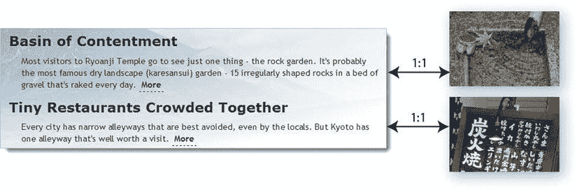
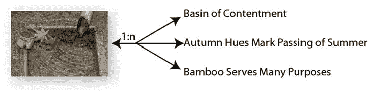
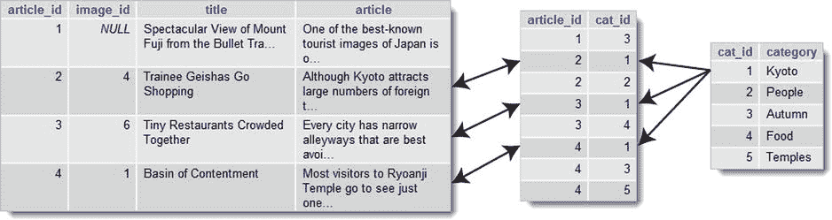
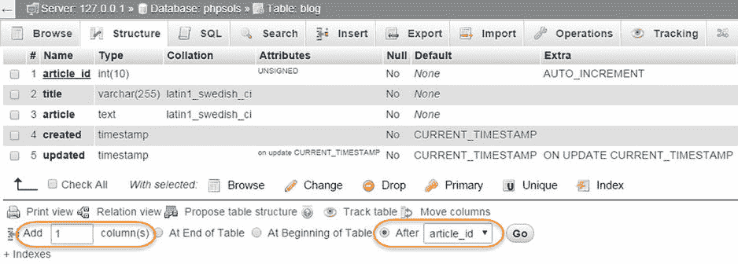
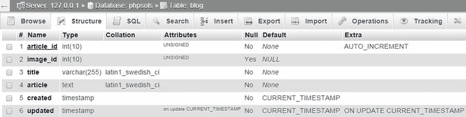
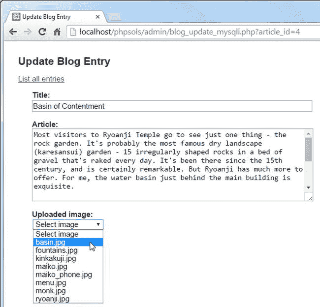

# 理解表关系

最简单的关系类型是一对一（通常表示为 1:1）。这种关系类型常见于包含仅供特定人员查看信息的数据库中。例如，公司通常将员工薪资详情和其他机密信息存储在一个与更广泛可访问的员工名单分开的表中。将每位员工记录的主键作为外键存储在薪资表中，可在表之间建立直接关系，从而允许财务部门查看所有信息，同时将其他人限制为仅能查看公开信息。

`phpsols`数据库中不包含机密信息，但你可能会在`images`表中的单张照片与`blog`表中的一篇文章之间创建一对一关系，如图 15-1 所示。



图 15-1.

一对一关系将一个记录与另一个记录直接关联

这是在两个表之间创建关系的最简单方式，但并非理想方案。随着更多文章的添加，关系的性质可能会发生变化。图 15-1 中与第一篇文章关联的照片显示枫叶漂浮在水面上，因此它可能适合用来阐释一篇关于季节变换或秋日色调的文章。清澈的水、竹制水舀和竹管也暗示了这张照片可能用来阐释的其他主题。因此，你完全可能最终将同一张照片用于多篇文章，或者形成一对多（或 1:n）关系，如图 15-2 所示。



图 15-2.

一对多关系将一个记录与多个其他记录关联

正如你已经了解到的，主键必须是唯一的。因此，在`1:n`关系中，你将来自关系“`1`”侧（主表或父表）的主键作为外键存储在“`n`”侧（副表或子表）的表中。在这种情况下，来自`images`表的`image_id`需要作为外键存储在`blog`表中。关于`1:n`关系需要理解的重要一点是，它也是一组`1:1`关系的集合。从右向左阅读图 15-2，每篇文章都与一张图片存在关系。如果没有这种一对一关系，你将无法识别出哪张图片与哪篇文章关联。

如果你想为每篇文章关联多张图片，该怎么办？你可以在`blog`表中创建多个列来存储外键，但这会很快变得难以管理。你可能从`image1`、`image2`和`image3`开始，但如果大多数文章只有一张图片，那么两列在很大程度上是多余的。而且，对于那些需要四张图片的特殊文章，你是否还要额外增加一列？

当面临处理多对多（或 n:m）关系的需求时，你需要采用不同的方法。`images`和`blog`表没有包含足够的记录来演示`n:m`关系，但你可以添加一个`categories`表来标记单个文章。大多数文章可能属于多个分类，而每个分类也会与多个文章相关联。

解决复杂关系的方法是通过一个交叉引用表（有时称为链接表），它在相关记录之间建立一系列一对一关系。这是一个特殊的表，仅包含两列，且这两列都被声明为联合主键。图 15-3 展示了这是如何工作的。交叉引用表中的每条记录都存储了`blog`表和`categories`表中单独文章之间的关系详情。要查找所有属于“`Kyoto`”分类的文章，你将`categories`表中的`cat_id 1`与交叉引用表中的`cat_id 1`进行匹配。这将标识出`blog`表中`article_id`为`2`、`3`和`4`的记录与“`Kyoto`”相关联。



图 15-3.

交叉引用表将多对多关系解析为 1:1

通过外键在表之间建立关系，对你更新和删除记录的方式有重要影响。如果不够小心，你最终会遇到链接断裂的问题。确保依赖关系不被破坏被称为维护引用完整性。我们将在下一章处理这个重要主题。首先，让我们专注于从通过外键关系链接的独立表中检索信息。

## 将图片链接到文章

为了演示如何处理多个表，让我们从图 15-1 和图 15-2 中概述的简单场景开始：通过将一个表（父表）的主键作为外键存储在第二个表（子表或依赖表）中来解决的`1:1`关系。这涉及在子表中添加一个额外的列来存储外键。

### 修改现有表的结构

理想情况下，你应该在向数据库中填充数据之前设计好数据库结构。然而，像 MySQL 这样的关系型数据库足够灵活，允许你添加、删除或更改表中的列，即使表中已经包含记录。为了将图片与`phpsols`数据库中的文章关联起来，你需要向`blog`表添加一个额外的列来存储`image_id`作为外键。

#### PHP 解决方案 15-1：为表添加额外的列

本 PHP 解决方案演示了如何使用 phpMyAdmin 为现有表添加额外的列。它假设你在第 13 章中已在`phpsols`数据库中创建了`blog`表。

在 phpMyAdmin 中，选择`phpsols`数据库，然后点击`blog`表的`结构`链接。在`blog`表结构下方，有一个表单允许你添加额外的列。你只需要添加一列，因此`添加字段`文本框中的默认值即可。通常的做法是将外键紧挨在表的主键之后放置，因此选择`在...之后`单选按钮，并确认下拉菜单设置为`article_id`，如下面的截图所示。然后点击`执行`。



这将打开一个用于定义列属性的屏幕。使用以下设置：

* 名称：`image_id`
* 类型：`INT`
* 属性：`UNSIGNED`
* 空值：选中
* 索引：`INDEX`

不要选中`A_I`（`AUTO_INCREMENT`）复选框。你不希望`image_id`自动递增。其值将从`images`表中插入。

之所以选中`空值`复选框，是因为并非所有文章都会关联图片。点击`保存`。

选择`结构`选项卡，确认`blog`表结构现在如下所示：



如果你点击屏幕左上角的`浏览`选项卡，你将看到每条记录中`image_id`的值都是 NULL。现在的挑战是如何在不手动查找数字的情况下插入正确的外键。我们接下来将处理这个问题。


### 在数据表中插入外键

在另一个数据表中插入外键的基本原理相当简单：你查询数据库以找到想要链接到另一条记录的主键，然后使用 `INSERT` 或 `UPDATE` 查询将外键添加到目标记录中。

为了演示这一基本原理，你将修改来自第 13 章的更新表单，增加一个下拉菜单，用于列出已在 `images` 表中注册的图片（见图 15-4）。



**图 15-4.** 动态生成的下拉菜单插入相应的外键

该菜单通过一个循环动态生成，该循环显示 `SELECT` 查询的结果。每张图片的主键都存储在 `<option>` 标签的 `value` 属性中。提交表单后，所选值作为外键被合并到 `UPDATE` 查询中。

#### PHP 解决方案 15-2：添加图片外键（MySQLi）

该 PHP 解决方案展示了如何通过将所选图片的主键作为外键添加，从而更新 `blog` 表中的记录。它改编自第 13 章的 `admin/blog_update_mysqli.php`。请使用你在第 13 章中创建的版本。或者，将 `ch13` 文件夹中的 `blog_update_mysqli_03.php` 复制到 `admin` 文件夹，并从文件名中删除 `_03`。

现有的用于检索待更新文章详细信息的 `SELECT` 查询需要修改，以包含外键 `image_id`，并且结果需要绑定到一个新的结果变量 `$image_id` 上。接着，你需要运行第二个 `SELECT` 查询来获取 `images` 表的详细信息。在此之前，你需要通过调用预处理语句的 `free_result()` 方法来释放数据库资源。将以下以粗体突出显示的代码添加到现有脚本中：

```
if (isset($_GET['article_id']) && !$_POST) {

    // 准备 SQL 查询
    $sql = 'SELECT article_id, image_id, title, article FROM blog
            WHERE article_id = ?';

    if ($stmt->prepare($sql)) {
        // 绑定查询参数
        $stmt->bind_param('i', $_GET['article_id']);

        // 执行查询
        $OK = $stmt->execute();

        // 将结果绑定到变量并获取
        $stmt->bind_result($article_id, $image_id, $title, $article);
        $stmt->fetch();

        // 为第二个查询释放数据库资源
        $stmt->free_result();
    }
}
```

你可以在调用 `fetch()` 方法后立即释放结果，因为结果集中只有一条记录，并且每列的值都已绑定到一个变量。

在表单内部，你需要显示存储在 `images` 表中的文件名。由于第二个 `SELECT` 语句不依赖外部数据，使用 `query()` 方法比使用预处理语句更简单。在 `article` 文本区域后添加以下代码（所有代码均为新增，但为了便于参考，PHP 部分以粗体突出显示）：

```
<p>
    <label for="image_id">已上传的图片：</label>
    <select name="image_id" id="image_id">
        <option value="">选择图片</option>
        <?php
        // 获取图片列表
        $getImages = 'SELECT image_id, filename
                      FROM images ORDER BY filename';
        $images = $conn->query($getImages);
        while ($row = $images->fetch_assoc()) {
        ?>
        <option value="<?= $row['image_id']; ?>"
            <?php
            if ($row['image_id'] == $image_id) {
                echo 'selected';
            }
            ?>>  <?= $row['filename']; ?></option>
        <?php } ?>
    </select>
</p>
```

第一个 `<option>` 标签是硬编码的，标签为 `选择图片`，其 `value` 设置为空字符串。其余的 `<option>` 标签通过一个 `while` 循环填充，该循环将每条记录提取到一个名为 `$row` 的数组中。

一个条件语句检查当前的 `image_id` 是否与已存储在 `articles` 表中的相同。如果相同，则将 `selected` 插入到 `<option>` 标签中，以便在下拉菜单中显示正确的值。

确保不要遗漏以下行中的第三个字符：

```
?>>  <?= $row['filename']; ?></option>
```

它是 `<option>` 标签的右尖括号，夹在两个 PHP 标签之间。

保存页面并在浏览器中加载。你应自动被重定向到 `blog_list_mysqli.php`。选择其中一个 EDIT 链接，确保你的页面看起来像图 15-4。检查浏览器源代码视图，验证 `<option>` 标签的 `value` 属性是否包含每张图片的主键。

**提示：** 如果 `<select>` 菜单没有列出图片，那么几乎可以肯定是第 2 步中的 `SELECT` 查询有错误。在调用 `query()` 方法后立即添加 `echo $conn->error;`，然后重新加载页面。你需要查看浏览器源代码才能看到错误信息。如果消息是“Commands out of sync; you can't run this command now”，问题在于未能在第 1 步中使用 `free_result()` 释放数据库资源。

最后阶段是将 `image_id` 添加到 `UPDATE` 查询中。由于某些博客条目可能没有关联图片，你需要创建备用的预处理语句，如下所示：

```
// 如果表单已提交，则更新记录
if (isset($_POST['update'])) {
    // 准备更新查询
    if (!empty($_POST['image_id'])) {
        $sql = 'UPDATE blog SET image_id = ?, title = ?, article = ?
                WHERE article_id = ?';
        if ($stmt->prepare($sql)) {
            $stmt->bind_param('issi', $_POST['image_id'], $_POST['title'],
                              $_POST['article'], $_POST['article_id']);
            $done = $stmt->execute();
        }
    } else {
        $sql = 'UPDATE blog SET image_id = NULL, title = ?, article = ?
                WHERE article_id = ?';
        if ($stmt->prepare($sql)) {
            $stmt->bind_param('ssi', $_POST['title'], $_POST['article'],
                              $_POST['article_id']);
            $done = $stmt->execute();
        }
    }
}
```

如果 `$_POST['image_id']` 有值，则将其作为第一个参数（带占位符问号）添加到 SQL 中。由于它必须是整数，因此在 `bind_param()` 的第一个参数开头添加了 `i`。

然而，如果 `$_POST['image_id']` 没有值，则需要创建不同的预处理语句，在 SQL 查询中将 `image_id` 的值设置为 `NULL`。由于它是显式值，因此不将其添加到 `bind_param()` 中。

再次测试页面，从下拉菜单中选择一个文件名，然后点击 `更新条目`。你可以通过在 phpMyAdmin 中刷新 `浏览` 标签，或选择同一篇文章进行更新，来验证外键是否已插入到 `articles` 表中。这一次，下拉菜单中应显示正确的文件名。

如有必要，请将你的代码与 `ch15` 文件夹中的 `blog_update_mysqli_04.php` 进行核对。


