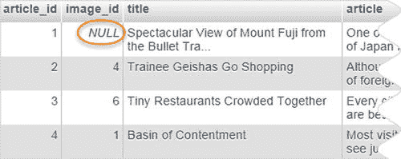
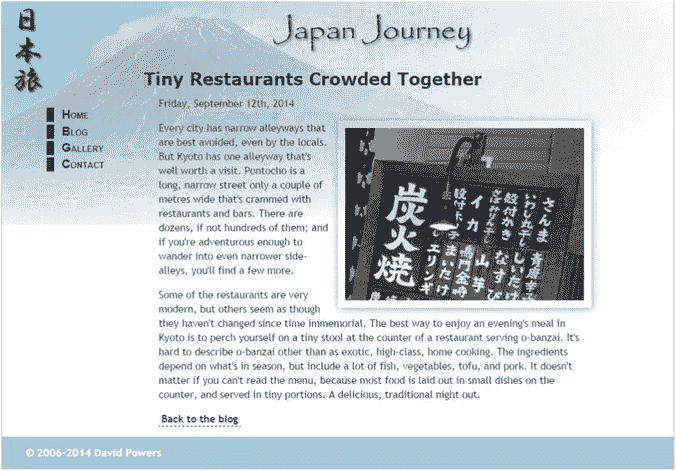
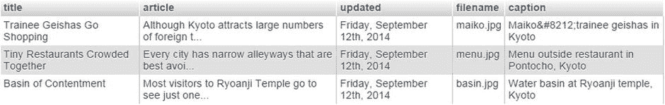
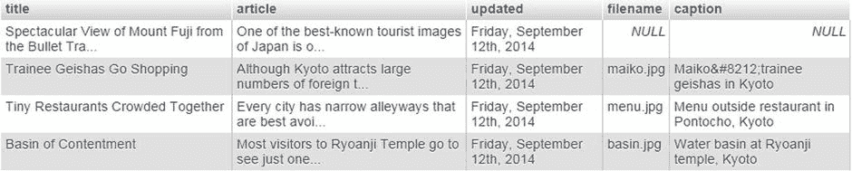
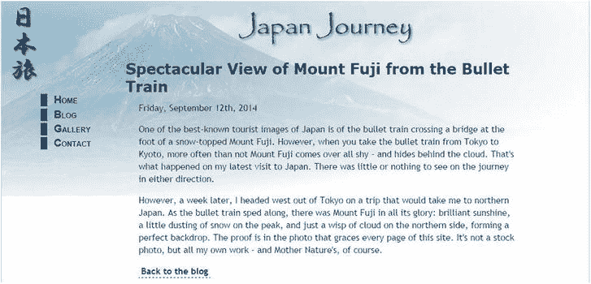

# PHP 解决方案 15-4：构建详情页面

本 PHP 解决方案演示了如何关联 `blog` 和 `images` 表，以显示所选文章及其关联图片。MySQLi 和 PDO 的代码几乎相同，因此本解决方案将同时涵盖两者。

将 `ch15` 文件夹中的 `details_01.php` 复制到 `phpsols` 站点根目录，并将其重命名为 `details.php`。如果编辑环境提示您更新链接，**请勿**更新。确保 `footer.php` 和 `menu.php` 位于 `includes` 文件夹中，然后在浏览器中加载该页面。它应如图 15-5 所示。


图 15-5。

详情页面包含占位图片和文本。在浏览器中加载 `blog_list_mysqli.php` 或 `blog_list_pdo.php`，并通过分配如下所示的图片文件名来更新以下三篇文章：

- Basin of Contentment：`basin.jpg`
- Tiny Restaurants Crowded Together：`menu.jpg`
- Trainee Geishas Go Shopping：`maiko.jpg`

导航到 phpMyAdmin 中的 `blog` 表，点击 `浏览` 选项卡，检查外键是否已注册。至少应有一篇文章的 `image_id` 值为 `NULL`，如图 15-6 所示。



图 15-6。

未关联图片的文章的外键被设置为 `NULL`。在 `details.php` 中，包含上一章的 `utility_funcs.php`（如有必要，将其从 `ch14` 文件夹复制到 `includes` 文件夹）。然后包含数据库连接文件，创建一个只读连接，并在 `DOCTYPE` 声明之前的 PHP 代码块中准备 SQL 查询，如下所示：

```php
require_once './includes/utility_funcs.php';
require_once './includes/connection.php';
// 连接到数据库
$conn = dbConnect('read');  // 如有必要添加 'pdo'
// 检查查询字符串中的 article_id
if (isset($_GET['article_id']) && is_numeric($_GET['article_id'])) {
    $article_id = (int) $_GET['article_id'];
} else {
    $article_id = 0;
}
$sql = "SELECT title, article,DATE_FORMAT(updated, '%W, %M %D, %Y') AS updated,
        filename, caption
        FROM blog INNER JOIN images USING (image_id)
        WHERE blog.article_id = $article_id";
$result = $conn->query($sql);
$row = $result->fetch_assoc();  // 对于 PDO 使用 $result->fetch();
```

该代码检查 `URL` 查询字符串中的 `article_id`。如果存在且为数字，则使用 `(int)` 类型转换运算符将其赋值给 `$article_id`，以确保它是一个整数。否则，`$article_id` 被设置为 `0`。您也可以选择一个默认文章，但暂时将其保留为 `0`，因为我想说明一个重要的点。

`SELECT` 查询从 `blog` 表中检索 `title`、`article` 和 `updated` 列，并从 `images` 表中检索 `filename` 和 `caption` 列。`updated` 的值使用 `DATE_FORMAT()` 函数和别名进行格式化，如 第 14 章 所述。由于只检索一条记录，使用原始列名作为别名不会导致排序问题。

表通过 `INNER JOIN` 和一个 `USING` 子句连接，该子句匹配两个表中 `image_id` 列的值。`WHERE` 子句选择由 `$article_id` 标识的文章。由于已经检查了 `$article_id` 的数据类型，因此在查询中使用是安全的。无需使用预处理语句。

请注意，查询被包裹在双引号中，以便解释 `$article_id` 的值。为避免与外部引号冲突，传递给 `DATE_FORMAT()` 参数的格式字符串使用了单引号。

其余代码在页面主体中显示 SQL 查询的结果。像这样替换 `<h2>` 标签中的占位文本：

```php
<h2>
<?php if ($row) {
    echo $row['title'];
} else {
    echo '未找到记录';
}
?>
</h2>
```

如果 `SELECT` 查询未找到结果，`$row` 将为空，PHP 会将其解释为 `false`。因此，这会显示标题，如果结果集为空，则显示“未找到记录”。

像这样替换占位日期：

```php
<p><?php if ($row) { echo $row['updated']; } ?></p>
```

紧接着日期段落的是一个包含占位图片的 `<figure>` 元素。并非所有文章都关联了图片，因此 `<figure>` 需要包裹在一个条件语句中，该语句同时检查 `$row['filename']` 是否包含值。像这样修改 `<figure>`：

```php
<?php
if ($row && !empty($row['filename'])) {
    $filename = "images/{$row['filename']}";
    $imageSize = getimagesize($filename)[3];
?>
<figure>
    " alt="<?= $row['caption']; ?>" <?= $imageSize;?>>
</figure>
<?php } ?>
```

这段代码使用了 第 12 章 中描述的内容，因此不再赘述。

最后，您需要显示文章。删除占位文本的段落，并在上一步骤最后一个代码块末尾的右花括号与闭合 PHP 标签之间添加以下代码：

```php
<?php }
if ($row) { echo convertToParas($row['article']); }
?>
```

这使用了 `utility_funcs.php` 中的 `convertToParas()` 函数，将博客条目包裹在 `<p>` 标签中，并用闭合和开放标签替换换行符序列（参见 第 14 章 中的“显示段落”）。

保存页面并在浏览器中加载 `blog.php`。点击一个已通过外键分配了图片的文章的“更多”链接。您应该会看到 `details.php` 显示了完整的文章和图片，布局如图 15-7 所示。

如有必要，请使用 `ch15` 文件夹中的 `details_mysqli_01.php` 或 `details_pdo_01.php` 检查您的代码。



图 15-7。

详情页面从一个表中提取文章，从另一个表中提取图片。点击返回 `blog.php` 的链接并测试其他项目。每个关联了图片的文章都应正确显示。点击未关联图片的文章的“更多”链接。这次您应该会看到如图 15-8 所示的结果。


图 15-8。

缺少关联图片导致 `SELECT` 查询失败。

您知道该文章在数据库中，否则前两句不会显示在 `blog.php` 中。要理解这种突然的“消失”，请参考图 15-6。未关联图片的记录的 `image_id` 值为 `NULL`。由于 `images` 表中的所有记录都有主键，`USING` 子句找不到匹配项。下一节将解释如何处理这种情况。

### 查找没有匹配外键的记录

取 PHP 方案 15-4 中的 `SELECT` 查询，并移除搜索特定文章的条件，结果如下所示：

```sql
SELECT title, article, DATE_FORMAT(updated, '%W, %M %D, %Y') AS updated, filename, caption
FROM blog INNER JOIN images USING (image_id)
```

如果你在 `phpMyAdmin` 的 `SQL` 选项卡中运行此查询，将产生如图 15-9 所示的结果。



**图 15-9.** `INNER JOIN` 仅查找两张表中都存在匹配的记录

使用 `INNER JOIN` 时，`SELECT` 查询仅成功找到完全匹配的记录。其中一篇文章没有关联图片，因此 `articles` 表中的 `image_id` 值为 `NULL`，这与 `images` 表中的任何内容都不匹配。

在这种情况下，你需要使用 `LEFT JOIN` 代替 `INNER JOIN`。使用 `LEFT JOIN` 时，结果将包含在左表中有匹配但在右表中没有匹配的记录。左和右指的是执行连接时的顺序。将 `SELECT` 查询重写如下：

```sql
SELECT title, article, DATE_FORMAT(updated, '%W, %M %D, %Y') AS updated, filename, caption
FROM blog LEFT JOIN images USING (image_id)
```

当你在 `phpMyAdmin` 中运行它时，你将获得所有四篇文章，如图 15-10 所示。



**图 15-10.** `LEFT JOIN` 包含在右表中没有匹配的记录

如你所见，来自右表（`images`）的空字段显示为 `NULL`。

如果两表中的列名不同，请使用 `ON`，如下所示：

```sql
FROM table_1 LEFT JOIN table_2 ON table_1.col_name = table_2.col_name
```

现在，你可以在 `details.php` 中重写 `SQL` 查询，如下所示：

```php
$sql = "SELECT title, article, DATE_FORMAT(updated, '%W, %M %D, %Y') AS updated,
filename, caption
FROM blog LEFT JOIN images USING (image_id)
WHERE blog.article_id = $article_id";
```

如果你点击 `更多` 链接查看没有关联图片的文章，你现在应该能看到文章正确显示，如图 15-11 所示。其他文章也应该仍然能正确显示。完成的代码可以在 `details_mysqli_02.php` 和 `details_pdo_02.php` 中找到。



**图 15-11.** `LEFT JOIN` 也检索出没有匹配外键的文章

### 创建智能链接

`details.php` 底部的链接直接返回到 `blog.php`。当 `blog` 表中只有四项记录时这没问题，但一旦数据库中有了更多记录，你就需要建立一个导航系统，正如我在第 12 章中展示的那样。导航系统的问题在于，你需要一种方法让访客返回到他们离开时结果集中的同一位置。

#### PHP 方案 15-5：返回导航系统中的同一位置

此 `PHP` 方案检查访客是从内部链接还是外部链接到达的。如果来源页面位于同一站点内，该链接会将访客返回到同一位置。如果来源页面是外部站点，或者服务器不支持必要的超全局变量，脚本将替换为标准链接。此处以 `details.php` 为例展示，但它可用于任何页面。

该代码不依赖于数据库，因此对于 `MySQLi` 和 `PDO` 是相同的。

找到 `details.php` 主体中的返回链接。它看起来像这样：

```html
<p><a href="blog.php">返回博客</a></p>
```

将光标放在第一个引号的右侧，并插入以下以粗体突出显示的代码：

```php
<p><a href="
<?php
// 检查浏览器是否支持 $_SERVER 变量
if (isset($_SERVER['HTTP_REFERER']) && isset($_SERVER['HTTP_HOST'])) {
    $url = parse_url($_SERVER['HTTP_REFERER']);
    // 查找访客是否来自不同的域名
    if ($url['host'] == $_SERVER['HTTP_HOST']) {
        // 如果域名相同，则使用来源 URL
        echo $_SERVER['HTTP_REFERER'];
    }
} else {
    // 否则，发送到主页
    echo 'blog.php';
} ?>">返回博客</a></p>
```

`$_SERVER['HTTP_REFERER']` 和 `$_SERVER['HTTP_HOST']` 是包含来源页面 `URL` 和当前主机名的超全局变量。你需要使用 `isset()` 检查它们是否存在，因为并非所有服务器都支持它们。此外，浏览器可能会屏蔽来源页面的 `URL`。

`parse_url()` 函数创建一个包含 `URL` 每个部分的数组，因此 `$url['host']` 包含主机名。如果它与 `$_SERVER['HTTP_HOST']` 匹配，你就知道访客是通过内部链接到达的，因此内部链接的完整 `URL` 将被插入到 `href` 属性中。这包括任何查询字符串，因此该链接会将访客送回导航系统中的同一位置。否则，将创建指向目标页面的普通链接。

完成的代码位于 `ch15` 文件夹中的 `details_mysqli_03.php` 和 `details_pdo_3.php`。

### 章节回顾

使用 `INNER JOIN` 和 `LEFT JOIN` 检索存储在多个表中的信息相对简单。成功处理多表的关键在于构建它们之间的关系，使得复杂关系始终可以分解为 `1:1` 关系，必要时可以通过交叉引用（或链接）表来实现。下一章将继续探索多表操作，展示在插入、更新和删除记录时如何处理外键关系。