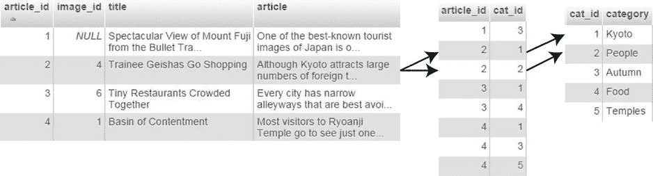
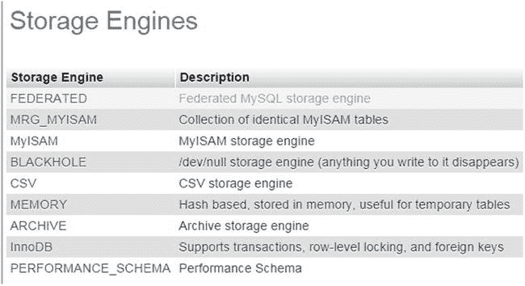
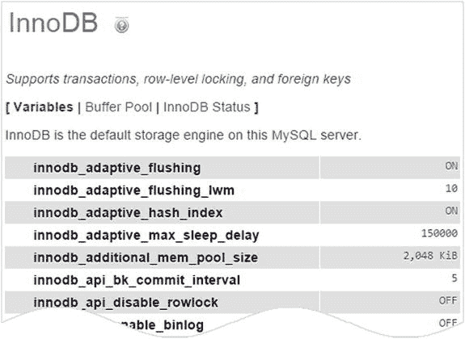
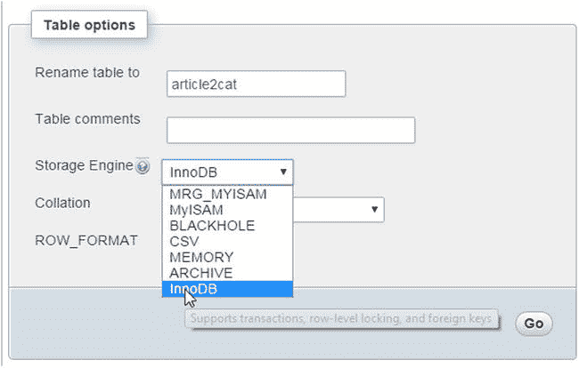
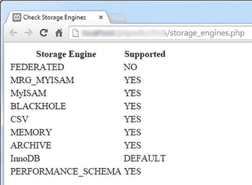
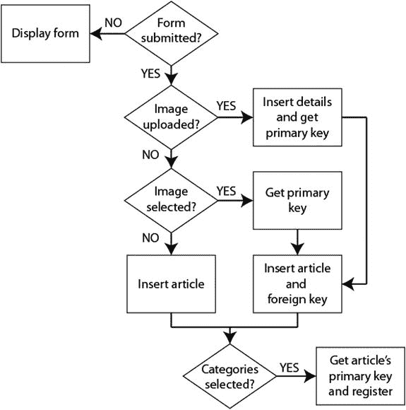
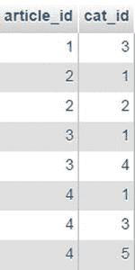
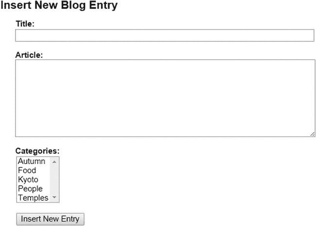
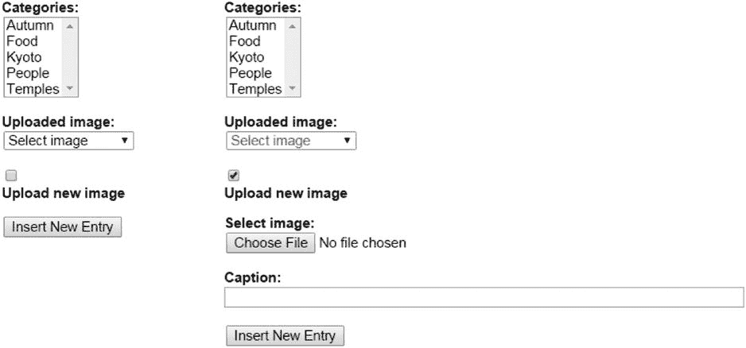

# 维护参照完整性

对于单表来说，无论你更新一条记录多少次，或删除多少条记录，对其他记录的影响都为零。但一旦你将一条记录的主键作为外键存储在另一个表中，就创建了一个需要管理的依赖关系。例如，图 16-1 展示了`blog`表中的第二篇文章（“见习艺伎去购物”）通过`article2cat`交叉引用表链接到了`Kyoto`和`People`这两个分类。



图 16-1.

你需要管理外键关系以避免孤儿记录

如果你删除了这篇文章，但没有删除交叉引用表中`article_id 2`对应的条目，那么查找`Kyoto`或`People`分类下所有文章的查询将尝试匹配`blog`表中一条不存在的记录。类似地，如果你决定删除某个分类，却没有同时删除交叉引用表中与之匹配的记录，那么查找与某篇文章关联分类的查询将尝试匹配一个不存在的分类。

不久之后，你的数据库就会充斥着孤儿记录。幸运的是，维护参照完整性并不困难。SQL 通过建立被称为外键约束的规则来实现这一点，这些规则告诉数据库当你更新或删除一条在另一个表中有从属记录的数据时该怎么做。

## 对外键约束的支持

外键约束由`InnoDB`支持，这是 MySQL 5.5 及更高版本中的默认存储引擎。MariaDB 中对应的存储引擎是 Percona XtraDB，但它自识别为`InnoDB`并具有相同功能。即使你的远程服务器运行的是最新版本的 MySQL 或 MariaDB，也不能保证一定支持`InnoDB`，因为你的托管公司可能禁用了它。

如果你的服务器运行的是旧版本的 MySQL，默认存储引擎是`MyISAM`，它不支持外键约束。不过，你可能仍能访问`InnoDB`，因为自 MySQL 4.0 版本起，它已成为 MySQL 不可分割的一部分。将`MyISAM`表转换为`InnoDB`非常简单，只需几秒钟。

如果你无法访问`InnoDB`，则需要通过在 PHP 脚本中构建必要的规则来维护参照完整性。本章将介绍这两种方法。

> **注意**  
> `MyISAM`表的优点是速度非常快。它们需要的磁盘空间更少，非常适合存储不经常更改的大量数据。它们还支持全文索引和搜索，这一功能在 MySQL 5.6 和 MariaDB 10.0.5 之前的`InnoDB`中不可用。

### PHP 解决方案 16-1：检查是否支持 InnoDB

此 PHP 解决方案说明了如何检查你的远程服务器是否支持`InnoDB`存储引擎。

如果你的托管公司提供 phpMyAdmin 来管理数据库，请在远程服务器上启动 phpMyAdmin，如果可用，点击屏幕顶部的`Engines`选项卡。这将显示一个类似于图 16-2 的存储引擎列表。



图 16-2.

通过 phpMyAdmin 检查存储引擎支持情况

该列表显示所有存储引擎，包括那些不支持的。不支持的或已禁用的存储引擎会变灰显示。如果你不确定`InnoDB`的状态，请在列表中点击它的名称。如果不支持`InnoDB`，你会看到一条相关提示信息。反之，如果你看到类似图 16-3 的变量列表，那么你很幸运——`InnoDB`是受支持的。



图 16-3.

确认 InnoDB 受支持

如果 phpMyAdmin 中没有`Engines`选项卡，请选择数据库中的任意表，然后点击屏幕右上角的`Operations`选项卡。在`表选项`部分，点击`存储引擎`字段右侧的下拉箭头以显示可用选项（见图 16-4）。如果列出了`InnoDB`，则表示它受支持。



图 16-4.

表选项中列出了可用的存储引擎

如果以上两种方法均未给出答案，请打开`ch16`文件夹中的`storage_engines.php`。编辑前三行，插入远程服务器上数据库的主机名、用户名和密码。将`storage_engines.php`上传到你的网站，并在浏览器中加载该页面。你应该会看到存储引擎列表及其支持级别，如图 16-5 所示。在某些情况下，`NO`会被`DISABLED`替代。



图 16-5.

storage_engines.php 中的 SQL 查询会报告哪些引擎受支持

如图 16-5 所示，MySQL 的典型安装支持多种存储引擎。令人惊讶的是，你可以在同一个数据库中使用不同的存储引擎。事实上，建议你这样做。即使你的远程服务器支持`InnoDB`，对于没有外键关系的表，使用`MyISAM`通常效率更高。对于有外键关系的表，则使用`InnoDB`。如果你需要支持事务，也应该使用`InnoDB`。

> **注意**  
> 事务是一系列相关的 SQL 查询。如果系列中的某一部分失败，事务将被终止，数据库会回滚到事务开始前的原始状态。财务数据库广泛使用事务，但这超出了本书的范围。

我将在本章后面部分解释如何将表转换为`InnoDB`以及如何设置外键约束。在此之前，让我们先看看如何建立和使用外键关系，无论使用的是哪种存储引擎。


### 向多个表中插入记录

一条 `INSERT` 查询只能向一个表中插入数据。因此，在处理多个表时，你需要仔细规划插入脚本，以确保所有信息都被存储，并且建立了正确的外键关系。

前一章中的 `PHP Solutions 15-2 (MySQLi)` 和 `15-3 (PDO)` 演示了如何为数据库中已注册的图像添加正确的外键。但是，在插入一条新的博客文章时，你需要能够选择一张现有图像、上传一张新图像，或者选择不带任何图像。这意味着你的处理脚本需要检查是否已选择或上传了图像，并相应地执行相关命令。此外，为零个或多个分类标记一篇博客文章，会增加脚本需要做出的决策数量。图 16-6 展示了决策链。



**图 16-6.** 插入一篇带有图像和分类的新博客文章的决策链

当页面首次加载时，表单尚未提交，因此页面仅显示插入表单。现有的图像和分类都通过查询数据库列在插入表单中，其方式与 `PHP Solutions 15-2` 和 `15-3` 中的更新表单处理图像的方式相同。

表单提交后，处理脚本会经历以下步骤：

-   如果上传了图像，则处理上传，将图像的详细信息存储在 `images` 表中，然后脚本获取新记录的主键。
-   如果没有上传图像，但选择了一张已有图像，脚本则通过 `$_POST` 数组提交的值获取其外键。
-   无论哪种情况，新的博客文章都会被插入到 `blog` 表中，同时将图像的主键作为外键。但是，如果既未上传图像也未从现有图像中选择，则在插入文章到 `blog` 表时不带外键。
-   最后，脚本检查是否选择了任何分类。如果选择了，脚本会获取新文章的主键，并将其与所选分类的主键组合，插入到 `article2cat` 表中。

如果在任何阶段出现问题，脚本都需要放弃其余流程并重新显示用户的输入。这个脚本相当长，因此我会将其分成几个部分。第一步是创建 `article2cat` 交叉引用表。

### 创建交叉引用表

在处理数据库中的多对多关系时，你需要构建一个类似图 16-1 中所示的交叉引用表。交叉引用表仅由两列组成，这两列被共同声明为表的主键（称为复合主键）。如果你查看图 16-7，会发现 `article_id` 和 `cat_id` 两列都多次出现相同的数字——这在主键中是不可接受的，主键必须是唯一的。然而，在复合主键中，是这两个值的组合保持唯一。前两个组合 `1,3` 和 `2,1` 在表中的其他任何地方都没有重复，其他组合也是如此。



**图 16-7.** 在交叉引用表中，两列共同构成一个复合主键

#### 设置分类表和交叉引用表

在 `ch16` 文件夹中，你可以找到 `categories.sql`，其中包含了用于创建 `categories` 表和交叉引用表 `article2cat` 的 SQL 语句，以及一些示例数据。用于创建这些表的设置列在表 16-1 和 16-2 中。两个数据库表都只有两列。

**表 16-1.** `categories` 表的设置

| 名称 | 类型 | 长度/值 | 属性 | 空值 | 索引 | A_I |
| --- | --- | --- | --- | --- | --- | --- |
| `cat_id` | `INT` |  | `UNSIGNED` | 未选择 | `PRIMARY` | 已选择 |
| `category` | `VARCHAR` | 20 |  | 未选择 |  |  |

**表 16-2.** `article2cat` 交叉引用表的设置

| 名称 | 类型 | 长度/值 | 属性 | 空值 | 索引 | A_I |
| --- | --- | --- | --- | --- | --- | --- |
| `article_id` | `INT` |  | `UNSIGNED` | 未选择 | `PRIMARY` |  |
| `cat_id` | `INT` |  | `UNSIGNED` | 未选择 | `PRIMARY` |  |

关于交叉引用表定义的重要一点是，两列都被设为主键，并且两列的 `A_I`（`AUTO_INCREMENT`）复选框都未被选中。

> **注意**：要创建复合主键，必须同时将两列声明为主键。如果错误地只将其中一列声明为主键，数据库会阻止你稍后添加第二列。你必须先删除单列上的主键索引，然后将其重新应用于两列。是这两列的组合被视为一个主键。

### 获取上传图像的文件名

该脚本使用了第 6 章中的 `Upload` 类，但需要对该类稍作调整，因为上传文件的文件名被合并到了 `$messages` 属性中。

#### PHP Solution 16-2: 改进 Upload 类

这个 PHP 方案通过创建一个新的受保护属性来存储成功上传文件的名称，并提供一个公共方法来检索这个名称数组，从而改编了第 6 章中的 `Upload` 类。

1. 打开 `PhpSolutions/File` 文件夹中的 `Upload.php`。或者，从 `ch16/PhpSolutions/File` 文件夹复制 `Upload.php`，并将其保存到 `phpsols` 站点根目录下的 `PhpSolutions/File` 文件夹中。
2. 在文件顶部的属性列表中添加以下代码行：

   `protected $filenames = [];`

   这将初始化一个名为 `$filenames` 的受保护属性，初始值为一个空数组。

3. 修改 `moveFile()` 方法，以便在文件成功上传时，将修改后的文件名添加到 `$filenames` 属性中。新代码以粗体高亮显示。

   ```
   protected function moveFile($file) {
       $filename = isset($this->newName) ? $this->newName : $file['name'];
       $success = move_uploaded_file($file['tmp_name'], $this->destination . $filename);
       if ($success) {
           // 将修改后的文件名添加到已上传文件数组中
           $this->filenames[] = $filename;
           $result = $file['name'] . ' was uploaded successfully';
           if (!is_null($this->newName)) {
               $result .= ', and was renamed ' . $this->newName;
           }
           $this->messages[] = $result;
       } else {
           $this->messages[] = 'Could not upload ' . $file['name'];
       }
   }
   ```

   只有在文件被成功移动到目标文件夹后，该名称才会被添加到 `$filenames` 数组中。

4. 添加一个公共方法来返回存储在 `$filenames` 属性中的值。代码如下所示：

   ```
   public function getFilenames() {
       return $this->filenames;
   }
   ```

   将此代码放在类定义中的任何位置都可以，但通常的做法是将所有公共方法放在一起。

5. 保存 `Upload.php`。如果需要检查你的代码，请将其与 `ch16/PhpSolutions/File` 文件夹中的 `Upload_01.php` 进行对比。


### 调整插入表单以处理多表数据

你在第 13 章中创建的博客文章插入表单，已经包含了将大部分详细信息插入`blog`表所需的代码。与其从头开始，不如调整现有页面。目前，该页面只包含一个用于输入标题的文本字段和一个用于撰写文章的文本区域。

你需要为分类添加一个多选的`<select>`列表，并为现有图像添加一个下拉`<select>`菜单。

为了防止用户在上传新图像的同时选择现有图像，我们通过一个复选框和 JavaScript 来控制相关输入字段的显示。选中复选框会禁用现有图像的下拉菜单，并显示新图像及其说明的输入字段。取消选中复选框则会隐藏并禁用文件和说明字段，同时重新启用下拉菜单。如果 JavaScript 被禁用，上传新图像和说明的选项将被隐藏。

**注意：** 为节省篇幅，本章后续的 PHP 解决方案仅提供 MySQLi 的详细说明。PDO 版本的结构和 PHP 逻辑完全相同。唯一的区别在于向数据库提交 SQL 查询和显示结果的命令。完整注释的 PDO 文件位于`ch16`文件夹中。

#### PHP 解决方案 16-3：添加分类和图像输入字段

本 PHP 解决方案通过为分类和图像添加输入字段，开始调整第 13 章中的博客条目插入表单。

在`admin`文件夹中，找到并打开你在第 13 章中创建的`blog_insert_mysqli.php`版本。或者，将`ch16`文件夹中的`blog_insert_mysqli_01.php`复制到`admin`文件夹，并从文件名中移除`_01`。

分类和现有图像的`<select>`元素需要在页面首次加载时查询数据库，因此你需要将连接脚本和数据库连接移到检查表单是否已提交的条件语句之外。找到以粗体高亮显示的行：

```
if (isset($_POST['insert'])) {
require_once '../includes/connection.php';
// 初始化标志
$OK = false;
// 创建数据库连接
$conn = dbConnect('write');
```

将它们移到条件语句之外，如下所示：

```
require_once '../includes/connection.php';
// 创建数据库连接
$conn = dbConnect('write');
if (isset($_POST['insert'])) {
// 初始化标志
$OK = false;
```

页面主体中的表单需要能够上传文件，因此你需要在开始的`<form>`标签中添加`enctype`属性，如下所示：

```
<form method="post" action="" enctype="multipart/form-data">
```

如果尝试上传文件时发生错误（例如，文件太大或不是图像文件），插入操作将会中止。修改现有的文本输入字段和文本区域，使用与第 5 章相同的技术重新显示值。文本输入字段如下所示：

```
<input name="title" type="text" id="title" value="<?php if (isset($error)) {
echo htmlentities($_POST['title']);
} ?>">
```

文本区域如下所示：

```
<textarea name="article" id="article"><?php if (isset($error)) {
echo htmlentities($_POST['article']);
} ?></textarea>
```

确保开始和结束的 PHP 标签与 HTML 之间没有间隙。否则，你会在文本输入字段和文本区域内添加不必要的空白字符。

新的表单元素位于文本区域和提交按钮之间。首先，添加分类的多选`<select>`列表代码。代码如下所示：

```
<p>
<label for="category">分类：</label>
<select name="category[]" size="5" multiple id="category">
<?php
// 获取分类
$getCats = 'SELECT cat_id, category FROM categories ORDER BY category';
$categories = $conn->query($getCats);
while ($row = $categories->fetch_assoc()) {
?>
<option value="<?= $row['cat_id']; ?>" <?php
if (isset($_POST['category']) && in_array($row['cat_id'],
$_POST['category'])) { echo 'selected';
} ?>><?php echo $row['category']; ?></option>
<?php } ?>
</select>
</p>
```

为了允许选择多个值，`multiple`属性已被添加到`<select>`标签中，并且`size`属性被设置为`5`。这些值需要以数组形式提交，因此在`name`属性后添加了一对方括号。

SQL 查询`categories`表，并通过`while`循环用主键和分类名称填充`<option>`标签。如果`insert`操作失败，`while`循环中的条件语句会为`<option>`标签添加`selected`，以重新显示已选中的值。

保存`blog_insert_mysqli.php`并将页面加载到浏览器中。此时表单应如图 16-8 所示。



**图 16-8。**


```markdown
多选`<select>`列表从`categories`表中提取值。导航至`ch16`文件夹中的`blog_insert_mysqli_02.php`，验证每个类别的主键是否已正确嵌入到每个`<option>`标签的`value`属性中。

接下来，创建`<select>`下拉菜单，用于显示数据库中已注册的图像。将此代码紧跟在你在步骤 5 中插入的代码之后：

```
<p>
<label for="image_id">已上传图像：</label>
<select name="image_id" id="image_id">
<option value="">选择图像</option>
<?php
// 获取图像列表
$getImages = 'SELECT image_id, filename
FROM images ORDER BY filename';
$images = $conn->query($getImages);
while ($row = $images->fetch_assoc()) {
?>
<option value="<?= $row['image_id']; ?>"
<?php
if (isset($_POST['image_id']) && $row['image_id'] ==
$_POST['image_id']) {
echo 'selected';
}
?>
><?php echo $row['filename']; ?></option>
<?php } ?>
</select>
</p>
```

这会创建另一个`SELECT`查询，用于获取`images`表中每张图像的主键和文件名。目前你应该已经非常熟悉这段代码，因此无需额外解释。

复选框、文件输入字段以及用于图片说明的文本输入字段应放置在上一段代码与提交按钮之间。代码如下所示：

```
<p id="allowUpload">
<input type="checkbox" name="upload_new" id="upload_new">
<label for="upload_new">上传新图像</label>
</p>
<p class="optional">
<label for="image">选择图像：</label>
<input type="file" name="image" id="image">
</p>
<p class="optional">
<label for="caption">图片说明：</label>
<input name="caption" type="text" id="caption">
</p>
```

包含复选框的段落已被赋予 ID `allowUpload`，另外两个段落则被赋予类名`optional`。`admin.css`中的样式规则将这三个段落的`display`属性设置为`none`。

保存`blog_insert_mysqli.php`并在浏览器中加载该页面。`images <select>`下拉菜单显示在`categories`列表下方，但你在步骤 9 中插入的三个表单元素是隐藏的。如果浏览器中禁用了 JavaScript，页面将显示为此状态。用户将可以选择类别和现有图像，但无法上传新图像。

如有需要，可将你的代码与`ch16`文件夹中的`blog_insert_mysqli_03.php`进行比对。

将`ch16`文件夹中的`toggle_fields.js`复制到`admin`文件夹。该文件包含以下 JavaScript 代码：

```
var cbox = document.getElementById('allowUpload');
cbox.style.display = 'block';
var uploadImage = document.getElementById('upload_new');
uploadImage.onclick = function () {
var image_id = document.getElementById('image_id');
var image = document.getElementById('image');
var caption = document.getElementById('caption');
var sel = uploadImage.checked;
image_id.disabled = sel;
image.parentNode.style.display = sel ? 'block' : 'none';
caption.parentNode.style.display = sel ? 'block' : 'none';
image.disabled = !sel;
caption.disabled = !sel;
}
```

这段代码利用步骤 8 中插入元素的 ID 来控制它们的显示状态。如果启用了 JavaScript，页面加载时会自动显示复选框，但文件输入字段和图片说明的文本输入字段仍保持隐藏。如果复选框被选中，现有图像的下拉菜单将被禁用，隐藏的元素则会显示出来。如果随后取消选中复选框，下拉菜单将重新启用，文件输入字段和图片说明字段会再次隐藏。

使用`<script>`标签将`toggle_fields.js`链接到`blog_insert_mysqli.php`，并放置在闭合的`</body>`标签之前，如下所示：

```
</form>
<script src="toggle_fields.js"></script>
</body>
```

将 JavaScript 代码添加到页面底部可以加快下载和显示速度。如果将其添加到`<head>`中，`toggle_fields.js`中的代码将无法正常工作。

保存`blog_insert_mysqli.php`并在浏览器中加载该页面。在支持 JavaScript 的浏览器中，复选框应显示在`<select>`下拉菜单和提交按钮之间。选中复选框可禁用下拉菜单并显示隐藏字段，如图 16-9 所示。



**图 16-9.** 复选框控制文件和图片说明输入字段的显示。

取消选中复选框。文件和图片说明输入字段将隐藏，下拉菜单重新启用。如有需要，你可以与`ch16`文件夹中的`blog_insert_mysqli_04.php`和`toggle_fields.js`核对代码。

如果你好奇我为什么使用 JavaScript 而不是 PHP 来控制文件和图片说明输入字段的显示，那是因为 PHP 是一种服务器端语言。在 PHP 引擎将输出发送到浏览器后，除非你向 Web 服务器发送另一个请求，否则它不会与页面进一步交互。而 JavaScript 则在浏览器中运行，因此它能够在本地操控页面内容。JavaScript 还可以与 PHP 结合使用，在后台向 Web 服务器发送请求，并利用返回结果在不重新加载页面的情况下刷新部分页面——这种技术称为 Ajax，但不在本书的讨论范围之内。

更新后的插入表单现在包含了类别和图像的输入字段，但处理脚本仍然只处理标题的文本输入字段和博客条目的文本区域。
```


