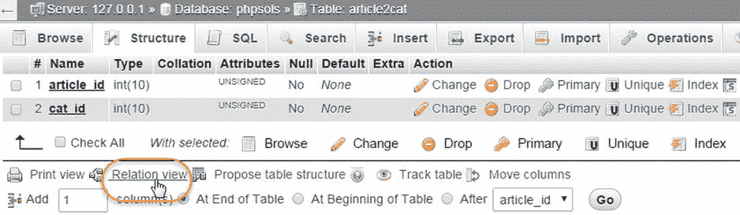
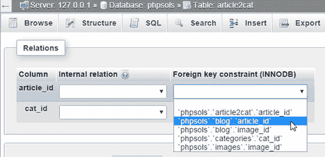
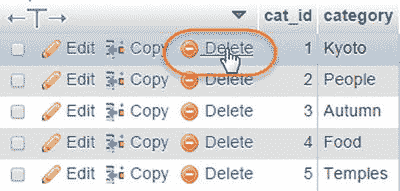
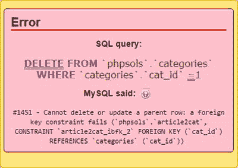

# PHP 方案 16-7：设置外键约束

本 PHP 方案介绍如何在 phpMyAdmin 中为 `article2cat`、`blog` 和 `categories` 表设置外键约束。外键约束必须始终在子表中定义。在此例中，子表是 `article2cat`，因为它将其他表中的主键 `article_id` 和 `cat_id` 作为外键存储。

在 phpMyAdmin 中选择 `article2cat` 表，点击“结构”选项卡。然后点击结构表底部的“关系视图”（如图 16-11 中圈出部分）。



图 16-11. 外键约束在 phpMyAdmin 的关系视图中定义

外键约束只能设置在已建立索引的列上。`article2cat` 表中的 `article_id` 和 `cat_id` 列是该表的复合主键，因此它们都会出现在打开的页面中。如果你的 phpMyAdmin 版本有“内部关系”选项，可以忽略它。

在 `article_id` 行中，打开“外键约束（INNODB）”下的下拉菜单，会显示数据库中已建立索引的列列表，然后选择 `phpsols.blog.article_id`，如图 16-12 所示。这将用于在 `article2cat` 表的 `article_id` 和 `blog` 表的 `article_id` 之间建立正式的外键关系。



图 16-12. 选择父表的主键

这会显示更多选项（在较旧版本的 phpMyAdmin 中，这些选项始终可见）。将“约束名称”留空。phpMyAdmin 会自动生成约束名称。

`ON DELETE` 下拉菜单包含以下选项：

- `CASCADE`：当你删除父表中的记录时，子表中所有从属记录也会被删除。例如，如果你删除 `blog` 表中主键为 `article_id 2` 的记录，则 `article2cat` 表中所有 `article_id` 为 2 的记录也会被自动删除。

- `SET NULL`：当你删除父表中的记录时，子表中所有从属记录的外键会被设置为 `NULL`。外键列必须允许 `NULL` 值。

- `NO ACTION`：在某些数据库系统中，此选项允许延迟外键约束检查。MySQL 会立即执行检查，因此其效果与 `RESTRICT` 相同。

- `RESTRICT`：如果子表中仍存在从属记录，此选项会阻止删除父表中的记录。

注意

`ON UPDATE` 也有相同的选项。除了 `RESTRICT` 之外，其他选项通常使用价值有限，因为除非特殊情况，你不应更改记录的主键。`ON UPDATE RESTRICT` 不仅会阻止修改父表中的主键，还会拒绝子表中任何会导致外键值在父表中找不到匹配项的插入或更新操作。

对于交叉引用表，`CASCADE` 是合乎逻辑的选择。如果决定删除父表中的一条记录，你希望所有对该记录的交叉引用也同时被移除。然而，为了演示外键约束的默认行为，请将 `ON DELETE` 和 `ON UPDATE` 都设置为 `RESTRICT`。

在 `cat_id` 行中，从“外键约束（INNODB）”下拉菜单中选择 `phpsols.categories.cat_id`，并将 `ON DELETE` 和 `ON UPDATE` 设置为 `RESTRICT`。点击“保存”。

注意

如果下拉菜单中没有 `RESTRICT` 选项，请将该选项留空。

如果尚未完成，请至少更新一条博客记录，使其与某个分类关联。在 phpMyAdmin 中，选择 `categories` 表，然后点击某个已知与博客记录关联的分类旁边的“删除”按钮，如图 16-13 所示。



图 16-13. 尝试删除 `categories` 表中的一条记录

注意

在较旧版本的 phpMyAdmin 中，删除图标是一个大的红色 X 号。

当 phpMyAdmin 要求确认删除时，点击“确定”。如果你已正确设置外键约束，将会看到类似图 16-14 的错误消息。



图 16-14. 若存在从属记录，外键约束会阻止删除操作

如果错误消息出现在模态对话框中，点击对话框将其关闭。选择 `article2cat` 表，点击“结构”选项卡，然后点击“关系视图”。

注意

在较旧版本的 phpMyAdmin 中，`ON DELETE` 和 `ON UPDATE` 可能为空。将这些选项留空与选择 `RESTRICT` 效果相同，这也是两者的默认值。

将两个 `ON DELETE` 设置都改为 `CASCADE`，然后点击“保存”。在 `blog` 表中选择一条你知道已与某个分类关联的记录。记下它的 `article_id`，然后删除该记录。检查 `article2cat` 表，与你刚刚删除的记录相关的记录也被删除了。

为继续探索外键约束，请选择 `blog` 表，并与 `images` 表中的 `image_id` 建立外键关系。如果从 `images` 表中删除一条记录，`blog` 表中的 `image_id` 外键需要设置为 `NULL`。如果将 `ON DELETE` 的值设置为 `SET NULL`，这将自动完成。通过从 `images` 表中删除一条记录并检查 `blog` 表中的关联记录来测试此功能。

注意

如果需要将 InnoDB 表转换回 MyISAM，必须先移除所有外键约束。选择“关系视图”，将“外键（INNODB）”字段留空，然后点击“保存”。移除外键约束后，即可按照 PHP 方案 16-6 所述更改存储引擎。此时需选择 `MyISAM` 而非 `InnoDB`。

### 创建带有外键约束的删除脚本

在 InnoDB 表中为 `ON DELETE` 选择值取决于表之间关系的性质。以 `phpsols` 数据库为例，在 `article2cat` 交叉引用表中将两列都设置为 `CASCADE` 不仅是安全的，而且是可取的。如果在 `blog` 或 `categories` 父表中删除了某条记录，则需要在交叉引用表中删除相关联的值。

`images` 表和 `blog` 表之间的关系则不同。如果你从 `images` 表中删除一条记录，可能不希望删除 `blog` 表中相关的文章。在这种情况下，`SET NULL` 是一个合适的选择。当从 `images` 表中删除一条记录时，相关文章中的外键将被设置为 `NULL`，但文章本身保持不变。

另一方面，如果图像对于理解文章至关重要，请选择 `RESTRICT`。任何尝试删除仍有相关文章的图像的操作都会自动被阻止。

这些考量会影响你如何处理删除脚本。当外键约束设置为 `CASCADE` 或 `SET NULL` 时，你不需要做任何特殊处理。你可以使用简单的 `DELETE` 查询，其余工作交给数据库处理。

然而，如果外键约束设置为 `RESTRICT`，`DELETE` 查询将会失败。为了显示适当的错误信息，请使用 MySQLi 语句对象的 `errno` 属性。由于外键约束而失败的查询的 MySQL 错误代码是 `1451`。在调用 `execute()` 方法后，你可以按如下方式检查 MySQLi 中的错误：

```
$stmt->execute();
if ($stmt->affected_rows > 0) {
    $deleted = true;
} else {
    $deleted = false;
    if ($stmt->errno == 1451) {
        $error = '该记录在子表中有依赖文件，无法删除。';
    } else {
        $error = '删除该记录时出现问题。';
    }
}
```

如果你使用 PDO，请使用 `errorCode()` 方法。由于外键约束而失败的查询代码是 `HY000`。在检查受影响的行数之后，你可以使用 PDO 预处理语句检查错误代码，示例如下：

```
$deleted = $stmt->rowCount();
if (!$deleted) {
    if ($stmt->errorCode() == 'HY000') {
        $error = '该记录在子表中有依赖文件，无法删除。';
    } else {
        $error = '删除该记录时出现问题。';
    }
}
```

如果你使用 PDO 的 `exec()` 方法，技术是相同的，该方法对于非 `SELECT` 查询会返回受影响的行数。使用 `exec()` 时，需要在数据库连接上调用 `errorCode()` 方法。

```
$deleted = $conn->exec($sql);
if (!$deleted) {
    if ($conn->errorCode() == 'HY000') {
        $error = '该记录在子表中有依赖文件，无法删除。';
    } else {
        $error = '删除该记录时出现问题。';
    }
}
```

### 创建不带外键约束的删除脚本

如果你无法使用 `InnoDB` 表，则需要将相同的逻辑构建到你自己的删除脚本中。要达到与 `ON DELETE CASCADE` 相同的效果，请连续运行两个 `DELETE` 查询，示例如下：

```
$sql = 'DELETE FROM article2cat WHERE article_id = ?';
$stmt->prepare($sql);
$stmt->bind_param('i', $_POST['article_id']);
$stmt->execute();

$sql = 'DELETE FROM blog WHERE article_id = ?';
$stmt->prepare($sql);
$stmt->bind_param('i', $_POST['article_id']);
$stmt->execute();
```

要达到与 `ON DELETE SET NULL` 相同的效果，请将 `UPDATE` 查询与 `DELETE` 查询结合使用，示例如下：

```
$sql = 'UPDATE blog SET image_id = NULL WHERE image_id = ?';
$stmt->prepare($sql);
$stmt->bind_param('i', $_POST['image_id']);
$stmt->execute();

$sql = 'DELETE FROM images WHERE image_id = ?';
$stmt->prepare($sql);
$stmt->bind_param('i', $_POST['image_id']);
$stmt->execute();
```

要达到与 `ON DELETE RESTRICT` 相同的效果，你需要在继续执行 `DELETE` 查询之前，先运行一个 `SELECT` 查询来查找是否存在依赖记录，示例如下：

```
$sql = 'SELECT image_id FROM blog WHERE image_id = ?';
$stmt->prepare($sql);
$stmt->bind_param('i', $_POST['image_id']);
$stmt->execute();
// 存储结果以找出它包含的行数
$stmt->store_result();
// 如果 num_rows 不为 0，则存在依赖记录
if ($stmt->num_rows) {
    $error = '该记录在子表中有依赖文件，无法删除。';
} else {
    $sql = 'DELETE FROM images WHERE image_id = ?';
    $stmt->prepare($sql);
    $stmt->bind_param('i', $_POST['image_id']);
    $stmt->execute();
}
```

## 章节回顾

一旦你掌握了与数据库通信所需的基本 `SQL` 和 `PHP` 命令，操作单表就变得非常容易。然而，通过外键链接表可能会相当具有挑战性。关系型数据库的强大之处在于其极高的灵活性。问题在于，这种无限的灵活性意味着没有单一的“正确”做事方式。

不过，不要让这阻碍你。你的本能可能是坚持使用单表，但那条路会带来更大的复杂性。让数据库工作变得简单的关键在于早期阶段限制你的野心。构建像本章中这样的简单结构，进行实验，并熟悉它们的工作原理。逐步添加表和外键链接。经验丰富的数据库工作者常说，他们经常花费超过一半的开发时间仅仅用于思考表结构。在那之后，编码就是轻松的部分了！

在最后一章中，我们将回到单表操作，讨论使用数据库进行用户认证以及如何处理加密密码的重要主题。