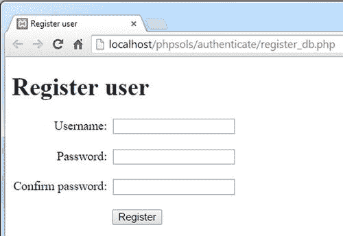
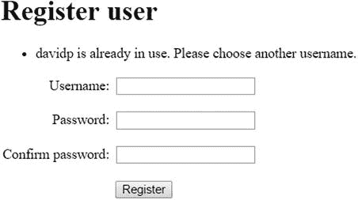
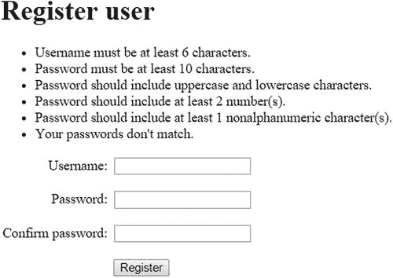

# 使用单向加密

为了保持简洁，我将使用与第 9 章相同的基本表单，因此数据库中仅存储用户名和加密后的密码。

**注意**

以下 PHP 解决方案使用了 `password_hash()` 和 `password_verify()`，这需要 PHP 5.5 或更高版本。你可以在旧版 PHP（最低版本 5.3.7）上使用来自 [`https://github.com/ircmaxell/password_compat`](https://github.com/ircmaxell/password_compat) 的 `password_compat` 库模拟这些函数。

### 创建存储用户详细信息的表

在 phpMyAdmin 中，在 `phpsols` 数据库中创建一个名为 `users` 的新表。该表需要包含表 17-1 中列出的三列设置。

**表 17-1.** `users` 表的设置

| 名称 | 类型 | 长度/值 | 属性 | 空值 | 索引 | A_I |
| --- | --- | --- | --- | --- | --- | --- |
| `user_id` | `INT` | | `UNSIGNED` | 未选中 | `PRIMARY` | 已选中 |
| `username` | `VARCHAR` | `15` | | 未选中 | `UNIQUE` | |
| `pwd` | `VARCHAR` | `255` | | 未选中 | | |

为了确保无人能注册与现有用户名相同的名称，`username` 列被赋予了 `UNIQUE` 索引。

用于存储密码的 `pwd` 列允许存储最多 255 个字符的字符串。这远大于 PHP 5.5 和 5.6 中 `password_hash()` 默认加密方法所需的 60 个字符。但 `PASSWORD_DEFAULT` 常量会随着 PHP 中添加新的、更强的算法而随时间变化。因此，建议的大小为 255 个字符。

## 在数据库中注册新用户

要在数据库中注册用户，你需要创建一个要求输入用户名和密码的注册表单。`username` 列已定义了 `UNIQUE` 索引，因此如果有人尝试注册与现有用户名相同的名称，数据库将返回错误。除了验证用户输入外，处理脚本还需要检测该错误，并建议用户选择不同的用户名。


  
### PHP 解决方案 17-1：创建用户注册表单

本 PHP 解决方案展示了如何改编第 9 章中的注册脚本，使其能与 MySQL 或 MariaDB 协同工作。它使用了 PHP 解决方案 9-6 中的 `CheckPassword` 类和 PHP 解决方案 9-7 中的 `register_user_csv.php`。

如有必要，将 `ch17/PhpSolutions/Authenticate` 文件夹中的 `CheckPassword.php` 复制到 `phpsols` 站点根目录下的 `PhpSolutions/Authenticate` 文件夹中，并将 `ch17` 文件夹中的 `register_user_csv.php` 复制到 `includes` 文件夹中。你还应阅读 PHP 解决方案 9-6 和 9-7 中的说明，以了解原始脚本的工作原理。



将 `ch17` 文件夹中的 `register_db.php` 复制到 `phpsols` 站点根目录下名为 `authenticate` 的新文件夹中。该页面包含与第 9 章相同的基本用户注册表单，含用户名文本输入字段、密码字段、确认密码字段以及提交数据的按钮，如下方截图所示：

在 `DOCTYPE` 声明上方的 PHP 代码块中添加以下代码：

```
if (isset($_POST['register'])) {
$username = trim($_POST['username']);
$password = trim($_POST['pwd']);
$retyped = trim($_POST['conf_pwd']);
require_once '../includes/register_user_mysqli.php';
}
```

这与 PHP 解决方案 9-7 中的代码非常相似。如果表单已提交，用户输入将去除首尾空白字符并赋值给简单变量。然后包含一个名为 `register_user_mysqli.php` 的外部文件。如果计划使用 PDO，请将包含文件命名为 `register_user_pdo.php`。

处理用户输入的文件基于你在第 9 章中创建的 `register_user_csv.php`。复制你的原始文件，并将其保存到 `includes` 文件夹中，命名为 `register_user_mysqli.php` 或 `register_user_pdo.php`。

在你刚刚复制并重命名的文件中，找到如下开头的条件语句（大约在第 24 行）：

```
if (!$errors) {
// 使用默认加密方式加密密码
$password = password_hash($password, PASSWORD_DEFAULT);
```

删除条件语句中剩余的部分。现在条件语句应如下所示：

```
if (!$errors) {
// 使用默认加密方式加密密码
$password = password_hash($password, PASSWORD_DEFAULT);
}
```

将用户详细信息插入数据库的代码写在条件语句内部。首先包含数据库连接文件，并建立具有读写权限的连接。

```
if (!$errors) {
// 使用默认加密方式加密密码
$password = password_hash($password, PASSWORD_DEFAULT);
// 包含连接文件
require_once 'connection.php';
$conn = dbConnect('write');
}
```

连接文件同样位于 `includes` 文件夹中，因此只需文件名即可。对于 PDO，向 `dbConnect()` 添加 `'pdo'` 作为第二个参数。

代码的最后部分准备并执行预处理语句，以将用户详细信息插入数据库。由于 `username` 列具有 `UNIQUE` 索引，如果用户名已存在，查询将失败。如果发生这种情况，代码需要生成错误消息。MySQLi 和 PDO 的代码有所不同。

对于 MySQLi，添加以下加粗显示的代码：

```
if (!$errors) {
// 使用默认加密方式加密密码
$password = password_hash($password, PASSWORD_DEFAULT);
// 包含连接文件
require_once 'connection.php';
$conn = dbConnect('write');
// 准备 SQL 语句
$sql = 'INSERT INTO users (username, pwd) VALUES (?, ?)';
$stmt = $conn->stmt_init();
if ($stmt = $conn->prepare($sql)) {
// 绑定参数并将详细信息插入数据库
$stmt->bind_param('ss', $username, $password);
$stmt->execute();
}
if ($stmt->affected_rows == 1) {
```


`$success = "$username 已注册成功，您现在可以登录。";`

`} elseif ($stmt->errno == 1062) {`

`$errors[] = "$username 已被使用，请选择其他用户名。";`

`} else {`

`$errors[] = $stmt->error;`

`}`

`}`

新代码首先将参数绑定到预处理语句。用户名和密码是字符串，因此 `bind_param()` 的第一个参数是 `'ss'`（参见第 11 章中的“在 MySQLi 预处理语句中嵌入变量”）。语句执行后，条件语句检查 `affected_rows` 属性的值。如果值为 `1`，则表示详细信息已成功插入。

> **提示**  
> 你需要显式检查 `affected_rows` 的值，因为如果发生错误，它的值是 –1。与某些编程语言不同，PHP 将 –1 视为 `true`。

另一个条件检查预处理语句的 `errno` 属性的值，该属性包含 MySQL 错误代码。对于具有 `UNIQUE` 索引的列，重复值的错误代码是 `1062`。如果检测到该错误代码，则会向 `$errors` 数组添加一条错误消息，要求用户选择其他用户名。如果生成了不同的错误代码，语句的 `error` 属性中存储的消息将被添加到 `$errors` 数组中。

PDO 版本如下：

```
if (!$errors) {

// 使用默认加密方式加密密码

$password = password_hash($password, PASSWORD_DEFAULT);

// 包含连接文件

require_once 'connection.php';

$conn = dbConnect('write', 'pdo');

// 准备 SQL 语句

$sql = 'INSERT INTO users (username, pwd) VALUES (:username, :pwd)';

$stmt = $conn->prepare($sql);

// 绑定参数并将详细信息插入数据库

$stmt->bindParam(':username', $username, PDO::PARAM_STR);

$stmt->bindParam(':pwd', $password, PDO::PARAM_STR);

$stmt->execute();

if ($stmt->rowCount() == 1) {

$success = "$username 已注册成功，您现在可以登录。";

} elseif ($stmt->errorCode() == 23000) {

$errors[] = "$username 已被使用，请选择其他用户名。";

} else {

$errorInfo = $stmt->errorInfo();

if (isset($errorInfo[2])) {

$errors[] = $errorInfo[2];

}

}

}
```

预处理语句对 `username` 和 `pwd` 列使用命名参数。通过 `bindParam()` 方法将提交的值绑定到该语句，并使用 `PDO::PARAM_STR` 常量将数据类型指定为字符串。语句执行后，条件语句使用 `rowCount()` 方法检查记录是否已创建。

如果预处理语句因用户名已存在而失败，则 `errorCode()` 方法生成的值为 `23000`。PDO 使用的是 ANSI SQL 标准定义的错误代码，而非 MySQL 生成的错误代码。如果错误代码匹配，则会向 `$errors` 数组添加一条消息，要求用户选择其他用户名。否则，将使用 `errorInfo()` 方法中的错误消息。

> **注意**  
> 在 MySQLI 和 PDO 脚本中，将注册脚本部署到线上网站时，请将 `else` 块中的代码替换为通用错误消息。显示语句的 `error` 属性（MySQLi）或 `$errorInfo[2]`（PDO）的值仅用于测试目的。

剩下的就是在注册页面上添加显示结果的代码。在 `register_db.php` 中的 `<form>` 标签之前添加以下代码：

```
<h1>注册用户</h1>

<?php

if (isset($success)) {

echo "<p>$success</p>";

} elseif (isset($errors) && !empty($errors)) {

echo '<ul>';

foreach ($errors as $error) {

echo "<li>$error</li>";

}

echo '</ul>';

}

?>
```

`<form method="post" action="">`

如有必要，请对照 `register_db_mysqli.php` 和 `register_user_mysqli.php`，或 `register_db_pdo.php` 和 `register_user_pdo.php` 检查你的代码，所有这些文件均位于 `ch17` 文件夹中。



现在正确填写注册表单。你应该会看到一条消息，告诉你已为你选择的用户名创建了帐户。尝试再次注册相同的用户名。这次你应该会得到与以下截图类似的消息：



保存 `register_db.php`，并在浏览器中加载它。通过输入你知道违反密码强度规则的输入来测试它。如果在同一次尝试中犯了多个错误，表单顶部应该会出现一个错误消息的要点列表，如下一个截图所示。

现在你已在数据库中注册了用户名和密码，接下来需要创建一个登录脚本。`ch17` 文件夹包含一组文件，这些文件复制了 PHP 解决方案 9-9 的设置：一个登录页面和两个受密码保护的页面。


