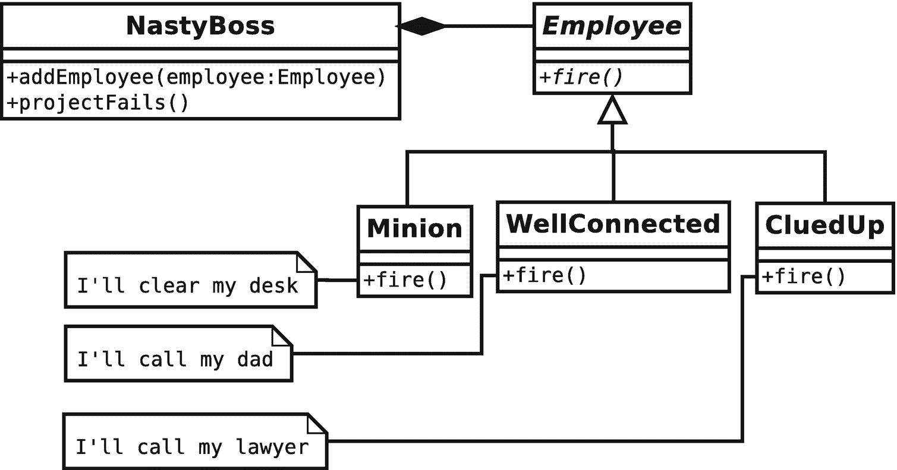
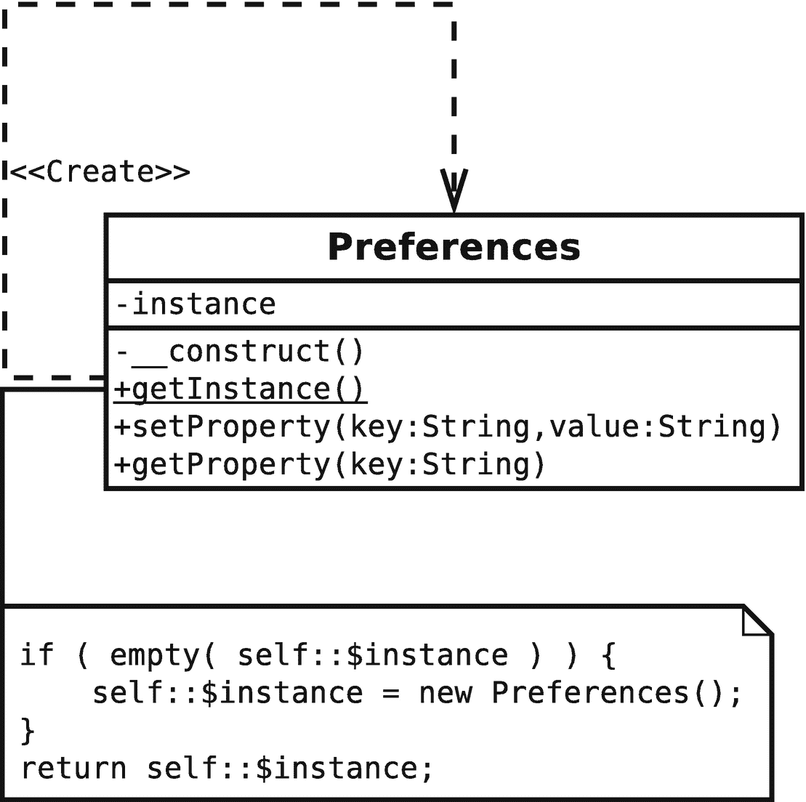
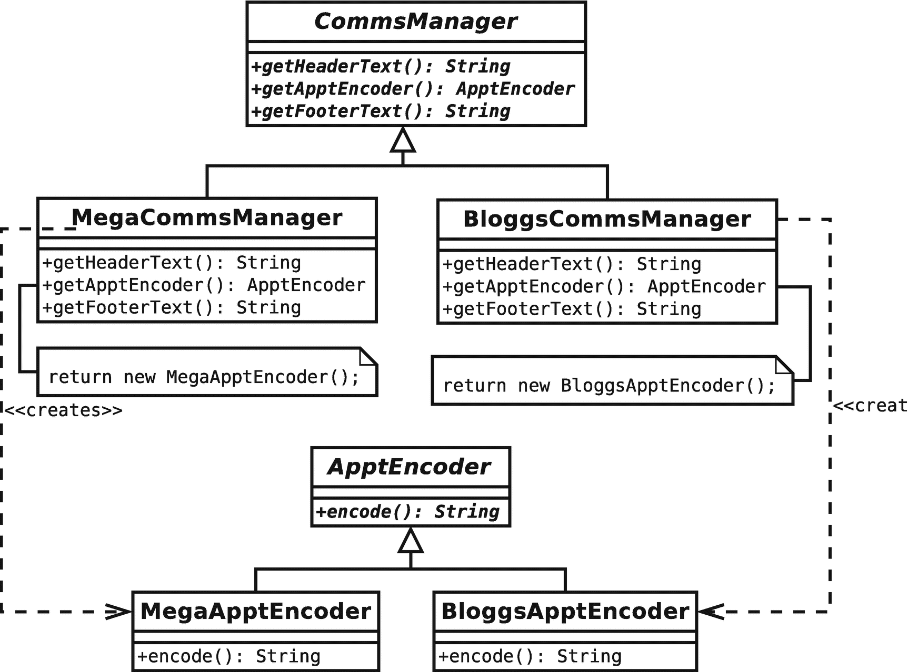
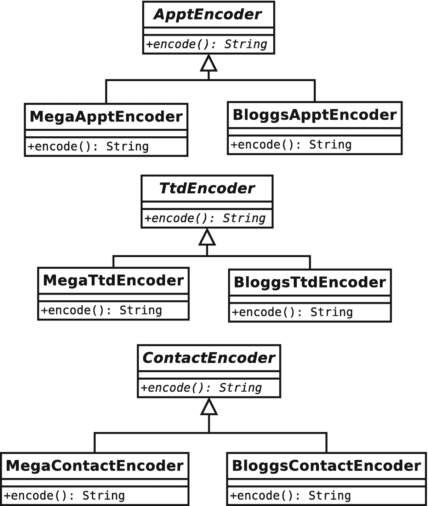
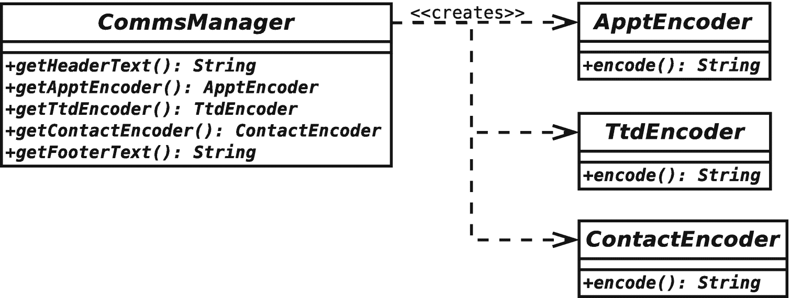
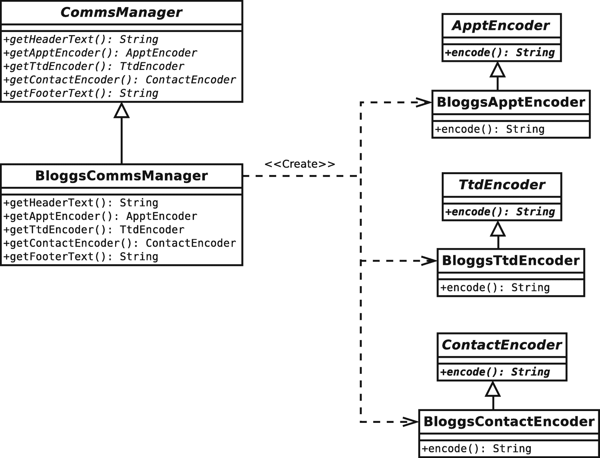
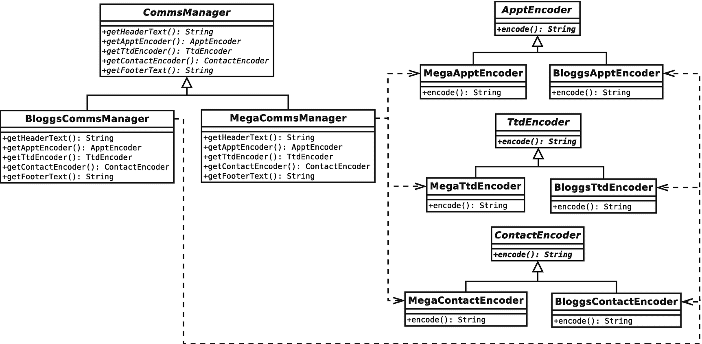

# 9.生成对象

创建对象是一件麻烦的事情。因此，许多面向对象的设计处理漂亮、干净的抽象类，利用多态提供的令人印象深刻的灵活性(运行时具体实现的切换)。但是，为了实现这种灵活性，我必须为对象生成设计策略。这是我将在本章探讨的主题。

本章将涵盖以下模式:

*   单例模式(Singleton pattern):一个特殊的类，它生成一个——且只有一个——对象实例

*   工厂方法模式:构建创建者类的继承层次

*   *抽象工厂模式*:对功能相关产品的创建进行分组

*   *原型模式*:使用`clone`生成对象

*   *服务定位器模式*:向系统请求对象

*   依赖注入模式:让你的系统给你对象

## 生成对象中的问题及解决方案

对象创建可能是面向对象设计中的一个弱点。在前一章中，你看到了这样一个原则，“编码到一个接口，而不是一个实现。”为此，鼓励你在类中使用抽象超类型。这使得代码更加灵活，允许您在运行时使用从不同具体子类实例化的对象。这带来了延迟对象实例化的副作用。

下面是一个抽象类，它接受一个名称字符串并实例化一个特定的对象:

```php
// listing 09.01
abstract class Employee
{

    public function __construct(protected string $name)
    {
    }

    abstract public function fire(): void;
}

```

这是一个具体的类，它扩展了`Employee`:

```php
// listing 09.02
class Minion extends Employee
{
    public function fire(): void
    {
        print "{$this->name}: I'll clear my desk\n";
    }
}

```

现在，这里有一个处理`Minion`对象的客户端类:

```php
// listing 09.03
class NastyBoss
{
    private array $employees = [];
    public function addEmployee(string $employeeName): void
    {
        $this->employees[] = new Minion($employeeName);
    }

    public function projectFails(): void
    {
        if (count($this->employees) > 0) {
            $emp = array_pop($this->employees);
            $emp->fire();
        }
    }
}

```

是时候测试代码了:

```php
// listing 09.04
$boss = new NastyBoss();
$boss->addEmployee("harry");
$boss->addEmployee("bob");
$boss->addEmployee("mary");
$boss->projectFails();

```

下面是输出:`mary: I'll clear my desk`

如您所见，我定义了一个抽象基类`Employee`，以及一个被践踏的实现`Minion`。给定一个名称字符串，`NastyBoss::addEmployee()`方法实例化一个新的`Minion`对象。每当一个`NastyBoss`对象遇到麻烦时(通过`NastyBoss::projectFails()`方法)，它会寻找一个`Minion`来触发。

通过在`NastyBoss`类中直接实例化一个`Minion`对象，我们限制了灵活性。如果一个`NastyBoss`对象可以和`Employee`类型的*任何*实例一起工作，我们可以让我们的代码在运行时随着我们添加更多的`Employee`专门化而服从变化。你应该会发现图 [9-1](#Fig1) 中的多态性很熟悉。



图 9-1

使用抽象类型可以实现多态性

如果`NastyBoss`类没有实例化一个`Minion`对象，那么它从何而来？作者经常通过在方法声明中约束参数类型来回避这个问题，然后除了测试上下文之外，方便地忽略显示实例化:

```php
// listing 09.05
class NastyBoss
{
    private array $employees = [];

    public function addEmployee(Employee $employee): void
    {
        $this->employees[] = $employee;
    }

    public function projectFails(): void
    {
        if (count($this->employees)) {
            $emp = array_pop($this->employees);
            $emp->fire();
        }
    }
}

```

```php
// listing 09.06
class CluedUp extends Employee
{
    public function fire(): void
    {
        print "{$this->name}: I'll call my lawyer\n";
    }
}

```

```php
// listing 09.07
$boss = new NastyBoss();
$boss->addEmployee(new Minion("harry"));
$boss->addEmployee(new CluedUp("bob"));
$boss->addEmployee(new Minion("mary"));
$boss->projectFails();
$boss->projectFails();
$boss->projectFails();

mary: I'll clear my desk
bob: I'll call my lawyer
harry: I'll clear my desk

```

虽然这个版本的`NastyBoss`类与`Employee`类型一起工作，因此受益于多态，但是我仍然没有定义对象创建的策略。实例化对象是一件肮脏的事情，但是必须要做。这一章是关于使用具体类的类和对象，所以你的其他类就不必这样做了。

如果在这里可以找到一个原则，那就是“委托对象实例化”在前一个例子中，我通过要求将一个`Employee`对象传递给`NastyBoss::addEmployee()`方法来隐式地做到这一点。然而，我同样可以委托给一个单独的类或方法，负责生成`Employee`对象。在这里，我向`Employee`类添加了一个静态方法，该方法实现了一个对象创建策略:

```php
// listing 09.08
abstract class Employee
{

    private static $types = ['Minion', 'CluedUp', 'WellConnected'];

    public static function recruit(string $name): Employee
    {
        $num = rand(1, count(self::$types)) - 1;
        $class = __NAMESPACE __ . "\\" . self::$types[$num];
        return new $class($name);
    }

    public function __construct(protected string $name)
    {
    }

    abstract public function fire(): void;
}

```

```php
// listing 09.09
class WellConnected extends Employee
{
    public function fire(): void
    {
        print "{$this->name}: I'll call my dad\n";
    }
}

```

如您所见，这采用了一个名称字符串，并使用它随机实例化一个特定的`Employee`子类型。我现在可以将实例化的细节委托给`Employee`类的`recruit()`方法:

```php
// listing 09.10
$boss = new NastyBoss();
$boss->addEmployee(Employee::recruit("harry"));
$boss->addEmployee(Employee::recruit("bob"));
$boss->addEmployee(Employee::recruit("mary"));

```

你在第 4 章[中看到了这样一个类的简单例子。我在名为`getInstance()`的`ShopProduct`类中放置了一个静态方法。](04.html)

Note

在这一章中，我经常使用“工厂”这个术语。工厂是负责生成对象的类或方法。

`getInstance()`负责根据数据库查询生成正确的`ShopProduct`子类。因此，`ShopProduct`级有着双重角色。它定义了`ShopProduct`类型，但也充当了具体`ShopProduct`对象的工厂:

```php
// listing 09.11
public static function getInstance(int $id, \PDO $pdo): ShopProduct
{
    $stmt = $pdo->prepare("select * from products where id=?");
    $result = $stmt->execute([$id]);
    $row = $stmt->fetch();
    if (empty($row)) {
        return null;
    }
    if ($row['type'] == "book") {
        // instantiate a BookProduct object
    } elseif ($row['type'] == "cd") {
        // instantiate a CdProduct object
    } else {
        // instantiate a ShopProduct object
    }
    $product->setId((int) $row['id']);
    $product->setDiscount((int) $row['discount']);
    return $product;
}

```

`getInstance()`方法使用一个大的`if/else`语句来决定实例化哪个子类。像这样的条件在工厂代码中很常见。虽然您应该尝试从项目中删除大量的条件语句，但是这样做通常会将条件语句推回到对象生成的时刻。这通常不是一个严重的问题，因为在将决策推回到这一点时，您从代码中删除了并行条件。

然后，在这一章中，我将研究一些生成对象的关键的四人组模式。

## 单一模式

全局变量是面向对象程序员最大的烦恼之一。原因你现在应该很熟悉了。全局变量将类绑定到它们的上下文中，破坏了封装(参见第 [6](06.html) 章和第 [8](08.html) 章了解更多)。如果不首先确保新应用程序本身定义了相同的全局变量，那么依赖于全局变量的类就不可能从一个应用程序中取出并在另一个应用程序中使用。

虽然这是不可取的，但全局变量不受保护的特性可能是一个更大的问题。一旦你开始依赖全局变量，你的一个库声明一个全局变量与另一个在别处声明的相冲突可能只是时间问题。您已经看到，如果不使用名称空间，PHP 很容易发生类名冲突。但这更糟糕。当全局冲突时 PHP 不会警告你。当您的脚本开始表现异常时，您首先会知道这一点。更糟糕的是，您可能根本没有注意到开发环境中的任何问题。但是，通过使用全局变量，当用户试图将您的库和其他库一起部署时，您可能会将他们暴露在新的有趣的冲突中。

然而，全球化仍然是一种诱惑。这是因为有时候为了让所有的类都可以访问一个对象，全局访问中固有的罪恶似乎是值得付出的代价。

正如我所暗示的，名称空间提供了一些保护。您至少可以将变量限定在一个包中，这意味着第三方库不太可能与您自己的系统冲突。即便如此，名称空间本身也存在冲突的风险。

Note

除了变量，常量和函数也在命名空间范围内。当一个变量、常量或函数在没有显式名称空间的情况下被调用时，PHP 首先在本地查找，然后在全局名称空间中查找。

### 问题

设计良好的系统通常通过方法调用传递对象实例。每个类都保持独立于更广泛的上下文，通过清晰的通信线路与系统的其他部分协作。但是，有时您会发现这迫使您使用一些类作为与它们无关的对象的管道，以良好设计的名义引入了依赖性。

想象一个保存应用程序级信息的`Preferences`类。我们可以使用一个`Preferences`对象来存储数据，比如 DSN 字符串(数据源名称是保存连接到数据库所需信息的字符串)、URL 根、文件路径等等。这是一种因安装而异的信息。该对象还可以用作公告板，即系统中不相关的对象可以设置或检索的消息的中心位置。

从一个对象到另一个对象传递一个`Preferences`对象可能并不总是一个好主意。许多不使用该对象的类可能被迫接受它，这样它们就可以将它传递给它们所处理的对象。这只是另一种耦合。

你还需要确保你系统中的所有对象都与*同一个* `Preferences`对象一起工作。您不希望对象在一个对象上设置值，而其他对象从完全不同的对象上读取值。

让我们提取这个问题中的力量:

*   一个`Preferences`对象应该对你系统中的任何对象都可用。

*   一个`Preferences`对象不应该存储在一个全局变量中，因为它可能会被覆盖。

*   系统中不能有超过一个`Preferences`物体在游戏中。这意味着*对象 Y* 可以在`Preferences`对象中设置一个属性，而*对象 Z* 可以检索相同的属性，而不需要任何一方直接与另一方对话(假设双方都可以访问`Preferences`对象)。

### 履行

为了解决这个问题，我可以从断言对对象实例化的控制开始。这里，我创建了一个不能从自身外部实例化的类。这听起来可能很难，但这只是定义一个私有构造函数的问题:

```php
// listing 09.12
class Preferences
{
    private array $props = [];

    private function __construct()
    {
    }

    public function setProperty(string $key, string $val): void
    {
        $this->props[$key] = $val;
    }

    public function getProperty(string $key): string
    {
        return $this->props[$key];
    }
}

```

当然，在这一点上，`Preferences`类是完全不可用的。我已经把访问限制提高到了荒谬的程度。因为构造函数被声明为`private`，所以没有客户端代码可以从中实例化一个对象。因此，`setProperty()`和`getProperty()`方法是多余的。

这里，我使用一个静态方法和一个静态属性来协调对象实例化:

```php
// listing 09.13
class Preferences
{
    private array $props = [];
    private static Preferences $instance;
    private function __construct()
    {
    }

    public static function getInstance(): Preferences
    {
        if (empty(self::$instance)) {
            self::$instance = new Preferences();
        }
        return self::$instance;
    }

    public function setProperty(string $key, string $val): void
    {
        $this->props[$key] = $val;
    }

    public function getProperty(string $key): string
    {
        return $this->props[$key];
    }
}

```

属性是私有的和静态的，所以它不能从类外部访问。然而,`getInstance()`方法可以访问。因为`getInstance()`是公共的和静态的，它可以在脚本中的任何地方通过类被调用:

```php
// listing 09.14
$pref = Preferences::getInstance();
$pref->setProperty("name", "matt");

unset($pref); // remove the reference

$pref2 = Preferences::getInstance();
print $pref2->getProperty("name") . "\n"; // demonstrate value is not lost

```

输出是我们最初添加到`Preferences`对象的单个值，可通过单独的访问获得:

```php
matt

```

静态方法不能访问对象属性，因为根据定义，它是在类而不是对象上下文中调用的。但是，它可以访问静态属性。当调用`getInstance()`时，我检查`Preferences::$instance`属性。如果它是空的，那么我创建一个`Preferences`类的实例，并将其存储在属性中。然后我将实例返回给调用代码。因为静态的`getInstance()`方法是`Preferences`类的一部分，我对实例化一个`Preferences`对象没有问题，即使构造函数是私有的。

图 9-2 显示了单例模式。



图 9-2

单一模式的一个例子

### 结果

那么，单例方法与使用全局变量相比如何呢？首先，坏消息。单例变量和全局变量都容易被误用。因为可以从系统中的任何地方访问单例，所以它们会产生难以调试的依赖关系。更改单例，使用它的类可能会受到影响。依赖本身不是问题。毕竟，每当我们声明一个方法需要一个特定类型的参数时，我们就创建了一个依赖。问题是单例的全局性质让程序员绕过了由类接口定义的通信线路。当使用 Singleton 时，依赖关系隐藏在方法内部，不在其签名中声明。这使得追踪系统内部的关系变得更加困难。因此，应该谨慎小心地部署单例类。

尽管如此，我认为适度使用单例模式可以改进系统的设计，避免在系统中传递不必要的对象时出现可怕的扭曲。

在面向对象的上下文中，单例表示对全局变量的改进。不能用错误类型的数据覆盖单例。此外，您可以将操作和数据束组合在一个单独的类中，这比关联数组或一组标量变量更好。

## 工厂方法模式

面向对象的设计强调抽象类而不是实现。也就是说，它的工作原理是一般化，而不是特殊化。工厂方法模式解决了当您的代码关注抽象类型时如何创建对象实例的问题。答案？让专家类来处理实例化。

### 问题

想象一个管理`Appointment`对象以及其他对象类型的个人管理器项目。您的业务组与另一家公司建立了关系，您必须使用一种称为 BloggsCal 的格式与它交流约会数据。不过，商业团体提醒你，随着时间的推移，你可能会面临更多的格式。

单停留在接口层面，你马上就能识别出两个参与者。您需要一个数据编码器，将您的`Appointment`对象转换成专有格式。让我们称那个类为`ApptEncoder`。您需要一个管理器类来检索编码器，并可能使用它与第三方进行通信。你可以称之为`CommsManager`。用模式的术语来说，`CommsManager`是创造者，`ApptEncoder`是产品。你可以在图 [9-3](#Fig3) 中看到这个结构。


图 9-3

抽象创建者和产品类

但是，你如何得到真正的混凝土呢？

您可以要求将一个`ApptEncoder`传递给`CommsManager`，但这只是推迟了您的问题，并且您希望推卸到此为止。这里，我直接在`CommsManager`类中实例化了一个`BloggsApptEncoder`对象:

```php
// listing 09.15
abstract class ApptEncoder
{
    abstract public function encode(): string;
}

```

```php
// listing 09.16
class BloggsApptEncoder extends ApptEncoder
{
    public function encode(): string
    {
        return "Appointment data encoded in BloggsCal format\n";
    }
}

```

```php
// listing 09.17
class CommsManager
{
    public function getApptEncoder(): ApptEncoder
    {
        return new BloggsApptEncoder();
    }
}

```

`CommsManager`类负责生成`BloggsApptEncoder`对象。当企业忠诚度不可避免地发生变化时，我们被要求转换我们的系统，以使用一种叫做 MegaCal 的新格式，我们可以简单地在`CommsManager::getApptEncoder()`方法中添加一个条件。毕竟，这是我们过去用过的策略。让我们构建一个处理 BloggsCal 和 MegaCal 格式的`CommsManager`的新实现:

```php
// listing 09.18
class CommsManager
{
    public const BLOGGS = 1;
    public const MEGA = 2;
    public function __construct(private int $mode)
    {
    }

    public function getApptEncoder(): ApptEncoder
    {
        switch ($this->mode) {
            case (self::MEGA):
                return new MegaApptEncoder();
            default:
                return  new  BloggsApptEncoder();
        }
    }

}

```

```php
// listing 09.19
class MegaApptEncoder extends ApptEncoder
{
    public function encode(): string
    {
        return "Appointment data encoded in MegaCal format\n";
    }
}

```

```php
// listing 09.20
$man = new CommsManager(CommsManager::MEGA);
print (get_class($man->getApptEncoder())) . "\n";
$man = new CommsManager(CommsManager::BLOGGS);
print (get_class($man->getApptEncoder())) . "\n";

```

我使用常量标志来定义脚本可能运行的两种模式:`MEGA`和`BLOGGS`。我在`getApptEncoder()`方法中使用一个`switch`语句来测试`$mode`属性，并实例化`ApptEncoder`的适当实现。

这种方法没什么问题。条件有时被认为是不好的“代码味道”的例子，但是对象创建在某些时候经常需要条件。如果你看到重复的条件悄悄进入你的代码，你不应该那么乐观。`CommsManager`类提供了传递日历数据的功能。假设您使用的协议要求您提供页眉和页脚数据来描述每个约会。我可以扩展前面的例子来支持一个`getHeaderText()`方法:

```php
// listing 09.21
class CommsManager
{
    public const BLOGGS = 1;
    public const MEGA = 2;

    public function __construct(private int $mode)
    {
    }

    public function getApptEncoder(): ApptEncoder
    {
        switch ($this->mode) {
            case (self::MEGA):
                return new MegaApptEncoder();
            default:
                return new BloggsApptEncoder();
        }
    }

    public function getHeaderText(): string
    {
        switch ($this->mode) {
            case (self::MEGA):
                return "MegaCal header\n";
            default:
                return "BloggsCal header\n";
        }
    }
}

```

如您所见，支持头输出的需求迫使我重复协议条件测试。随着我添加新的协议，这将变得难以处理，特别是如果我还添加了一个`getFooterText()`方法。

所以，我们总结一下目前为止的问题:

*   直到运行时我才知道我需要生成哪种对象(`BloggsApptEncoder`或`MegaApptEncoder`)。

*   我需要能够相对容易地添加新产品类型(SyncML 支持只是一项新的业务交易！).

*   每个产品类型都与需要其他定制操作的上下文相关联(例如，`getHeaderText()`、`getFooterText()`)。

此外，我使用了条件语句，您已经看到这些语句可以被多态自然地替换。工厂方法模式使您能够使用继承和多态来封装具体产品的创建。换句话说，您为每个协议创建一个`CommsManager`子类，每个子类实现`getApptEncoder()`方法。

### 履行

工厂方法模式将创建者类从它们被设计来生成的产品中分离出来。creator 是一个工厂类，它定义了生成产品对象的方法。如果没有提供默认的实现，那么就由创建者子类来执行实例化。通常，每个 creator 子类实例化一个并行的 product 子类。

我可以将`CommsManager`重新指定为一个抽象类。这样，我就保留了一个灵活的超类，并将所有特定于协议的代码放在具体的子类中。你可以在图 [9-4](#Fig4) 中看到这种变化。


图 9-4

具体的创建者和产品类

下面是一些简化的代码:

```php
// listing 09.22
abstract class ApptEncoder
{
    abstract public function encode(): string;
}

```

```php
// listing 09.23
class BloggsApptEncoder extends ApptEncoder
{
    public function encode(): string
    {
        return "Appointment data encoded in BloggsCal format\n";
    }
}

```

```php
// listing 09.24
abstract class CommsManager
{
    abstract public function getHeaderText(): string;
    abstract public function getApptEncoder(): ApptEncoder;
    abstract public function getFooterText(): string;
}

```

```php
// listing 09.25
class BloggsCommsManager extends CommsManager
{
    public function getHeaderText(): string
    {
        return "BloggsCal header\n";
    }

    public function getApptEncoder(): ApptEncoder
    {
        return new BloggsApptEncoder();
    }

    public function getFooterText(): string
    {
        return "BloggsCal footer\n";
    }
}

```

```php
// listing 09.26
$mgr = new BloggsCommsManager();
print $mgr->getHeaderText();
print $mgr->getApptEncoder()->encode();
print $mgr->getFooterText();

```

下面是输出:`BloggsCal header` `Appointment data encoded in BloggsCal format` `BloggsCal footer`

因此，当我需要实现 MegaCal 时，支持它只是为我的抽象类编写一个新的实现。图 [9-5](#Fig5) 显示了兆卡等级。



图 9-5

扩展设计以支持新协议

### 结果

请注意，creator 类反映了产品层次结构。这是工厂方法模式的常见结果，有些人不喜欢这种特殊的代码重复。另一个问题是这种模式可能会鼓励不必要的子类化。如果子类化 creator 的唯一原因是部署工厂方法模式，那么您可能需要重新考虑(这就是为什么我在这里的例子中引入了 header 和 footer 约束)。

在我的例子中，我只关注了约会。如果我将它稍微扩展到包括待办事项和联系人，我将面临一个新的问题。我需要一个结构，将处理一次相关的实现集。

工厂方法模式通常与抽象工厂模式一起使用，您将在下一节看到这一点。

## 抽象工厂模式

在大型应用程序中，您可能需要产生相关类集的工厂。抽象工厂模式解决了这个问题。

### 问题

让我们再次看看组织者的例子。我管理两种格式的编码，BloggsCal 和 MegaCal。我可以通过添加更多的编码格式在水平方向上扩展这个结构，但是我如何在垂直方向上扩展，为不同类型的 PIM 对象添加编码器呢？事实上，我已经朝着这个模式努力了。

在图 [9-6](#Fig6) 中，你可以看到我想与之合作的平行家庭。这些是约会(`Appt`)、要做的事情(`Ttd`)和联系人(`Contact`)。



图 9-6

三个产品系列

BloggsCal 类通过继承彼此无关(尽管它们可以实现一个公共接口)，但是它们在功能上是并行的。如果系统当前正在与`BloggsTtdEncoder`一起工作，它也应该与`BloggsContactEncoder`一起工作。

为了了解我是如何实施的，你可以从接口开始，就像我对工厂方法模式所做的那样(见图 [9-7](#Fig7) )。



图 9-7

抽象创造者及其抽象产品

### 履行

抽象的`CommsManager`类定义了生成三个产品(`ApptEncoder`、`TtdEncoder`和`ContactEncoder`)的接口。您需要实现一个具体的创建器，以便为特定的系列实际生成具体的产品。我在图 [9-8](#Fig8) 中举例说明了 BloggsCal 格式。



图 9-8

添加混凝土创建器和一些混凝土产品

下面是`CommsManager`和`BloggsCommsManager`的代码版本:

```php
// listing 09.27
abstract class CommsManager
{
    abstract public function getHeaderText(): string;
    abstract public function getApptEncoder(): ApptEncoder;
    abstract public function getTtdEncoder(): TtdEncoder;
    abstract public function getContactEncoder(): ContactEncoder;
    abstract public function getFooterText(): string;
}

```

```php
// listing 09.28
class BloggsCommsManager extends CommsManager
{
    public function getHeaderText(): string
    {
        return "BloggsCal header\n";
    }

    public function getApptEncoder(): ApptEncoder
    {
        return new BloggsApptEncoder();
    }
    public function getTtdEncoder(): TtdEncoder
    {

        return new BloggsTtdEncoder();
    }

    public function getContactEncoder(): ContactEncoder
    {
        return new BloggsContactEncoder();
    }

    public function getFooterText(): string
    {
        return "BloggsCal footer\n";
    }
}

```

注意，我在这个例子中使用了工厂方法模式。`getContactEncoder()`在`CommsManager`中是抽象的，在`BloggsCommsManager`中实现。设计模式往往以这种方式协同工作，一种模式创建适合另一种模式的上下文。在图 [9-9](#Fig9) 中，我添加了对兆卡格式的支持。



图 9-9

添加具体的创作者和一些具体的产品

### 结果

那么，让我们看看这种模式买了什么:

*   首先，我将我的系统从实现的细节中分离出来。在我的例子中，我可以添加或删除任意数量的编码格式，而不会引起连锁反应。

*   我对系统中功能相关的元素进行分组。因此，通过使用`BloggsCommsManager`，我保证我将只处理与 BloggsCal 相关的类。

*   添加新产品可能是一件痛苦的事情。我不仅要创建新产品的具体实现，还要修改抽象的创建者和每一个具体的实现者来支持它。

抽象工厂模式的许多实现都使用工厂方法模式。这可能是因为大多数例子都是用 Java 或 C++编写的。然而，PHP 不必强制方法的返回类型(尽管现在可以了)，这为我们提供了一些可以利用的灵活性。

与其为每个工厂方法创建单独的方法，不如创建一个单独的`make()`方法，它使用一个标志参数来确定返回哪个对象:

```php
// listing 09.29
interface Encoder
{
    public function encode(): string;
}

```

```php
// listing 09.30
abstract class CommsManager
{
    public const APPT    = 1;
    public const TTD     = 2;
    public const CONTACT = 3;
    abstract public function getHeaderText(): string;
    abstract public function make(int $flag_int): Encoder;
    abstract public function getFooterText(): string;
}

```

```php
// listing 09.31
class BloggsCommsManager extends CommsManager
{
    public function getHeaderText(): string
    {
        return "BloggsCal header\n";
    }

    public function make(int $flag_int): Encoder
    {
        switch ($flag_int) {
            case self::APPT:
                return  new  BloggsApptEncoder();
            case self::CONTACT:
                return new BloggsContactEncoder();
            case self::TTD:
                return new BloggsTtdEncoder();
        }
    }

    public function getFooterText(): string
    {
        return "BloggsCal footer\n";
    }
}

```

正如你所看到的，我已经把类接口做得更紧凑了。不过，我为此付出了相当大的代价。在使用工厂方法时，我定义了一个清晰的接口，并强制所有具体的工厂对象遵守它。在使用单个`make()`方法时，我必须记住支持所有具体创建者中的所有产品对象。我还介绍了并行条件，因为每个具体的创建者必须实现相同的标志测试。客户类不能确定具体的创建者生成所有的产品，因为在每种情况下`make()`的内部是一个选择的问题。

另一方面，我可以建立更灵活的创作者。基本 creator 类可以提供一个`make()`方法，保证每个产品系列的默认实现。具体的孩子可以有选择地修改这种行为。在提供自己的实现后，由实现 creator 类来调用默认的`make()`方法。

在下一节中，您将看到抽象工厂模式的另一种变体。

## 原型

并行继承层次的出现可能是工厂方法模式的一个问题。这是一种让一些程序员不舒服的耦合。每当您添加一个产品系列时，您都必须创建一个相关的具体创建者(例如，BloggsCal 编码器由`BloggsCommsManager`匹配)。在一个发展速度足够快的系统中，维持这种关系很快就会变得令人厌倦。

避免这种依赖性的一种方法是使用 PHP 的`clone`关键字来复制现有的具体产品。具体的产品类本身成为它们自己生成的基础。这是原型模式。它使您能够用合成代替继承。这反过来提高了运行时的灵活性，减少了必须创建的类的数量。

### 问题

想象一个文明风格的网页游戏，游戏中的单位在一个格子上操作。每块瓷砖可以代表海洋、平原或森林。地形类型限制了占据该区域的单位的移动和战斗能力。您可能有一个为`Sea`、`Forest`和`Plains`对象提供服务的`TerrainFactory`对象。您决定允许用户在完全不同的环境中进行选择，因此`Sea`对象是由`MarsSea`和`EarthSea`实现的抽象超类。`Forest`和`Plains`对象的实现方式类似。这里的力量适合抽象的工厂模式。您有不同的产品层次结构(`Sea`、`Plains`、`Forests`)，有跨越继承的强大家族关系(`Earth`、`Mars`)。图 [9-10](#Fig10) 展示了一个类图，展示了如何部署抽象工厂和工厂方法模式来处理这些产品。


图 9-10

用抽象工厂方法处理地形

如您所见，我依靠继承来为工厂将生成的产品分组 terrain 族。这是一个可行的解决方案，但是它需要一个大的继承层次，并且相对不灵活。当您不想要并行继承层次结构，并且需要最大化运行时灵活性时，可以在抽象工厂模式的强大变体中使用原型模式。

### 履行

当您使用抽象工厂/工厂方法模式时，您必须在某个时候决定您希望使用哪个具体的创建者，可能是通过检查某种偏好标志。既然您无论如何都必须这样做，为什么不简单地创建一个存储具体产品的工厂类，然后在初始化时填充它呢？你可以通过这种方式减少一些课程，并且，正如你将看到的，利用其他的好处。下面是一些在工厂中使用原型模式的简单代码:

```php
// listing 09.32
class Plains
{
}

```

```php
// listing 09.33
class Forest
{
}

```

```php
// listing 09.34
class Sea
{
}

```

```php
// listing 09.35
class EarthPlains extends Plains
{
}

```

```php
// listing 09.36
class EarthSea extends Sea
{
}

```

```php
// listing 09.37
class EarthForest extends Forest
{
}

```

```php
// listing 09.38
class MarsSea extends Sea
{
}

```

```php
// listing 09.39
class MarsForest extends Forest
{
}

```

```php
// listing 09.40
class MarsPlains extends Plains
{
}

```

```php
// listing 09.41
class TerrainFactory
{
    public function __construct(private Sea $sea, private Plains $plains, private Forest $forest)
    {
    }

    public function getSea(): Sea
    {
        return clone $this->sea;
    }

    public function getPlains(): Plains
    {
        return clone $this->plains;
    }

    public function getForest(): Forest
    {
        return clone $this->forest;
    }
}

```

```php
// listing 09.42
$factory = new TerrainFactory(
    new EarthSea(),
    new EarthPlains(),
    new EarthForest()
);
print_r($factory->getSea());
print_r($factory->getPlains());
print_r($factory->getForest());

```

以下是输出:

```php
popp\ch09\batch11\EarthSea Object
(
)

popp\ch09\batch11\EarthPlains Object
(
)

popp\ch09\batch11\EarthForest Object
(
)

```

如您所见，我用产品对象的实例加载了一个具体的`TerrainFactory`。当客户端调用`getSea()`时，我返回一个在初始化时缓存的`Sea`对象的克隆。这种结构给我带来了额外的灵活性。想在一个新的星球上玩游戏，那里有像地球一样的海洋和森林，但有像火星一样的平原吗？无需编写新的 creator 类——您可以简单地更改添加到`TerrainFactory`中的类的组合:

```php
// listing 09.43
$factory = new TerrainFactory(
    new EarthSea(),
    new MarsPlains(),
    new EarthForest()
);

```

因此原型模式允许您利用组合提供的灵活性。不过，我们得到的不止这些。因为您在运行时存储和克隆对象，所以当您生成新产品时，您会复制对象状态。假设`Sea`对象有一个`$navigability`属性。该属性影响海瓷砖从船上吸取的移动能量的数量，并且可以设置来调整游戏的难度等级:

```php
// listing 09.44
class Sea
{
    public function __construct(private int $navigability)
    {
    }
}

```

现在，当我初始化`TerrainFactory`对象时，我可以添加一个带有可导航性修饰符的`Sea`对象。这将适用于由`TerrainFactory`服务的所有`Sea`对象:

```php
// listing 09.45
$factory = new TerrainFactory(
    new EarthSea(-1),
    new EarthPlains(),
    new EarthForest()
);

```

当您希望生成的对象由其他对象组成时，这种灵活性也很明显。

Note

我在第 4 章中讲述了对象克隆。关键字`clone`生成应用它的任何对象的浅层副本。这意味着产品对象将具有与源相同的属性。如果源的任何属性是对象，则这些属性不会被复制到产品中。相反，产品将引用与*相同的*对象属性。您可以通过实现一个`__clone()`方法来改变这个缺省值并以任何其他方式定制对象复制。当使用`clone`关键字时，这个函数被自动调用。

也许所有的`Sea`对象都可以包含`Resource`对象(`FishResource`、`OilResource`等)。).根据偏好标志，我们可能会默认给所有的`Sea`对象一个`FishResource`。请记住，如果您的产品引用了其他对象，您应该实现一个`__clone()`方法来确保您制作了一个深层副本:

```php
// listing 09.46
class Contained
{
}

```

```php
// listing 09.47
class Container
{
    public Contained $contained;

    public function __construct()
    {
        $this->contained = new Contained();
    }

    public function __clone()
    {
        // Ensure that cloned object holds a
        // clone of self::$contained and not
        // a reference to it

        $this->contained = clone $this->contained;
    }
}

```

## 推到边缘:服务定位器

我保证这一章将处理对象创建的逻辑，消除许多面向对象例子中偷偷摸摸的推诿责任。然而，这里的一些模式狡猾地避开了对象创建的决策部分，如果不是创建本身的话。

单例模式无罪。对象创建的逻辑是内置的，没有歧义。抽象工厂模式将产品系列的创建分组到不同的具体创建者中。但是，我们如何决定使用哪个具体的创建者呢？原型模式向我们提出了一个类似的问题。这两种模式都处理对象的创建，但是它们推迟了应该创建哪个对象或对象组的决定。

系统选择的特定具体创建者通常是根据某种配置开关的值决定的。这可以位于数据库、配置文件或服务器文件中(比如 Apache 的目录级配置文件，通常称为`.htaccess`)，或者甚至可以硬编码为 PHP 变量或属性。因为 PHP 应用程序必须为每个请求或 CLI 调用重新配置，所以您需要脚本初始化尽可能地简单。出于这个原因，我经常选择在 PHP 代码中硬编码配置标志。这可以手工完成，也可以通过编写自动生成类文件的脚本来完成。下面是一个包含日历协议类型标志的简单类:

```php
// listing 09.48
class Settings
{
    public static string $COMMSTYPE = 'Mega';
}

```

现在我有了一个标志(不管多么不雅)，我可以创建一个类，用它来决定根据请求服务哪个`CommsManager`。将单例模式与抽象工厂模式结合使用是很常见的，所以让我们这样做:

```php
// listing 09.49
class AppConfig
{
    private static ?AppConfig $instance = null;
    private CommsManager $commsManager;

    private function __construct()
    {
        // will run once only
        $this->init();
    }

    private function init(): void
    {
        switch (Settings::$COMMSTYPE) {
            case 'Mega':
                $this->commsManager = new MegaCommsManager();
                break;
            default:
                $this->commsManager = new BloggsCommsManager();
        }
    }

    public static function getInstance(): AppConfig
    {
        if (is_null(self::$instance)) {
            self::$instance = new self();
        }
        return self::$instance;
    }

    public function getCommsManager(): CommsManager
    {
        return $this->commsManager;
    }
}

```

`AppConfig`类是一个标准的单例。出于这个原因，我可以在系统的任何地方获得一个`AppConfig`实例，并且我将总是获得同一个实例。`init()`方法由类的构造函数调用，因此在一个进程中只运行一次。它测试`Settings::$COMMSTYPE`属性，根据它的值实例化一个具体的`CommsManager`对象。现在，我的脚本可以获得一个`CommsManager`对象并使用它，而无需知道它的具体实现或它生成的具体类:

```php
$commsMgr = AppConfig::getInstance()->getCommsManager();
$commsMgr->getApptEncoder()->encode();

```

因为`AppConfig`为我们管理查找和创建组件的工作，所以它是服务定位器模式的一个实例。这很简洁，但它确实引入了比直接实例化更良性的依赖关系。任何使用其服务的类都必须显式调用这个整体，将它们绑定到更广泛的系统。出于这个原因，有些人更喜欢另一种方法。

## 出色的隔离:依赖注入

在上一节中，我在工厂中使用了一个标志和一个条件语句来决定提供两个`CommsManager`类中的哪一个。这个解决方案没有想象中的那么灵活。提供的类被硬编码在一个定位器中，有两个组件内置在一个条件中。不过，这种不灵活性是我的演示代码的一个方面，而不是服务定位器本身的问题。我可以使用任意数量的策略来代表客户端代码定位、实例化和返回对象。然而，服务定位器经常受到怀疑的真正原因是组件必须显式调用定位器。这感觉有点，嗯，全球化。面向对象的开发人员有理由怀疑所有的全局事物。

### 问题

每当您使用`new`操作符时，您就关闭了该范围内多态性的可能性。想象一个部署硬编码的`BloggsApptEncoder`对象的方法，例如:

```php
// listing 09.50
class AppointmentMaker
{
    public function makeAppointment(): string
    {
        $encoder = new BloggsApptEncoder();
        return $encoder->encode();
    }
}

```

这可能满足我们最初的需求，但是它不允许在运行时切换任何其他的`ApptEncoder`实现。这限制了该类的使用方式，并且使得该类更难测试。

Note

单元测试通常被设计成关注与更广泛的系统隔离的特定类和方法。如果被测试的类包含一个直接实例化的对象，那么所有与测试无关的代码都可能被执行——这可能会导致错误和意想不到的副作用。另一方面，如果一个被测试的类以某种方式而不是直接实例化的方式获得了它所使用的对象，那么为了测试的目的，可以向它提供 fake— *mock* 或*stub*—对象。我在第 18 章[中讲述了测试细节。](18.html)

直接实例化使得代码难以测试。这一章的大部分内容正是针对这种不灵活性。但是，正如我在上一节中指出的，我忽略了一个事实，即使我们使用原型或抽象工厂模式，实例化也必须在某个地方发生。下面是创建原型对象的一段代码:

```php
// listing 09.51
$factory = new TerrainFactory(
    new EarthSea(),
    new EarthPlains(),
    new EarthForest()
);

```

这里调用的原型`TerrainFactory`类是朝着正确方向迈出的一步——它需要泛型类型:`Sea`、`Plains`和`Forest`。该类让客户端代码来决定应该提供哪些实现。但是这是怎么做到的呢？

### 履行

我们的大部分代码调用工厂。正如我们已经看到的，这个模型被称为服务定位器模式。方法将责任委托给它信任的提供者，让其找到并提供所需类型的实例。原型例子颠倒了这一点；它只是希望实例化代码在调用时提供实现。这里没有魔法——只是需要在构造函数的签名中包含类型，而不是直接在方法中创建它们。这方面的一个变化是提供 setter 方法，这样客户端可以在调用使用对象的方法之前传入对象。

因此，让我们以这种方式解决`AppointmentMaker`:

```php
// listing 09.52
class AppointmentMaker2
{
    public function __construct(private ApptEncoder $encoder)
    {
    }

    public function makeAppointment(): string
    {
        return $this->encoder->encode();
    }
}

```

`AppointmentMaker2`已经放弃了控制——它不再创造`BloggsApptEncoder`,我们获得了灵活性。然而，实际创建`ApptEncoder`对象的逻辑呢？可怕的`new`语句存在于何处？我们需要一个装配组件来承担这项工作。这里的一个常见策略是使用配置文件来确定应该实例化哪些实现。有工具可以帮助我们做到这一点，但这本书都是关于我们自己做，所以让我们建立一个非常幼稚的实现。我将从一个简单的 XML 格式开始，它描述了抽象类和它们的首选实现之间的关系。

```php
// listing 09.53
<objects>

    <class name="popp\ch09\batch06\ApptEncoder">
    <instance inst="popp\ch09\batch06\BloggsApptEncoder" />
    </class>

</objects>

```

这表明当我们请求一个`ApptEncoder`时，我们的工具应该生成一个`BloggsApptEncoder`。当然，我们必须创建汇编程序。

```php
// listing 09.54
class ObjectAssembler
{
    private array $components = [];

    public function __construct(string $conf)
    {
        $this->configure($conf);
    }
    private function configure(string $conf): void
    {
        $data = simplexml_load_file($conf);
        foreach ($data->class as $class) {
            $name = (string)$class['name'];
            $resolvedname = $name;
            if (isset($class->instance)) {
                if (isset($class->instance[0]['inst'])) {
                    $resolvedname = (string)$class->instance[0]['inst'];
                }
            }
            $this->components[$name] = function () use ($resolvedname) {
                $rclass = new \ReflectionClass($resolvedname);
                return $rclass->newInstance();
            };
        }
    }

    public function getComponent(string $class): object
    {
        if (isset($this->components[$class])) {
            $inst = $this->components[$class]();
        } else {
            $rclass = new \ReflectionClass($class);
            $inst = $rclass->newInstance();
        }
        return $inst;
    }
}

```

乍一看这有点晦涩，所以让我们简单地看一下。大多数真实的行动发生在`configure()`。方法接受从构造函数传递的路径。它使用`simplexml`扩展来解析配置 XML。当然，在一个真实的项目中，我们会在这里和各处添加更多的错误处理。目前，我非常信任我正在解析的 XML。

对于每个`<class>`元素，我提取完全限定的类名，并将其存储在`$name`变量中。我还创建了一个`$resolvedname`变量，它将保存我们将要生成的具体类的名称。假设找到了一个`<instance>`元素(在后面的例子中，您会看到它并不总是存在)，我将正确的值赋给了`$resolvedname`。

除非需要，否则我不想创建一个对象，所以我创建了一个匿名函数，当被调用时它会创建对象并将其添加到`$components`属性中。

`getComponent()`方法接受一个给定的类名，并将其解析为一个实例。它以两种方式之一做到这一点。如果提供的类名是`$components`数组中的一个键，那么我提取并运行相应的匿名函数。另一方面，如果我找不到所提供的类的记录，我仍然可以勇敢地尝试创建一个实例。最后，我返回结果。

让我们测试一下这段代码:

```php
// listing 09.55
$assembler = new ObjectAssembler("src/ch09/batch14_1/objects.xml");
$encoder = $assembler->getComponent(ApptEncoder::class);
$apptmaker = new AppointmentMaker2($encoder);
$out = $apptmaker->makeAppointment();
print $out;

```

因为`ApptEncoder` `::class`解析为`popp\ch09\batch06\ApptEncoder`——`objects.xml`文件中建立的键——`BloggsApptEncoder`对象被实例化并返回。您可以从这个片段的输出中看到这一点:

```php
Appointment data encoded in BloggsCal format

```

正如您所看到的，代码足够聪明，可以创建一个具体的对象，即使它不在配置文件中。

```php
// listing 09.56
$assembler = new ObjectAssembler("src/ch09/batch14_1/objects.xml");
$encoder = $assembler->getComponent(MegaApptEncoder::class);
$apptmaker = new AppointmentMaker2($encoder);
$out = $apptmaker->makeAppointment();
print $out;

```

配置文件中没有`MegaApptEncoder`键，但是，因为`MegaApptEncoder`类存在并且是可实例化的，所以`ObjectAssembler`类能够创建并返回一个实例。

但是带有需要参数的构造函数的对象呢？我们不需要做太多的工作就能做到。还记得最近的`TerrainFactory`课吗？它需要一个`Sea`、一个`Plains`和一个`Forest`对象。在这里，我修改了我的 XML 格式以适应这个需求。

```php
// listing 09.57
<objects>

    <class name="popp\ch09\batch11\TerrainFactory">
        <arg num="0" inst="popp\ch09\batch11\EarthSea" />
        <arg num="1" inst="popp\ch09\batch11\MarsPlains" />
        <arg num="2" inst="popp\ch09\batch11\Forest" />
    </class>

    <class name="popp\ch09\batch11\Forest">
        <instance inst="popp\ch09\batch11\EarthForest" />
    </class>

    <class name="popp\ch09\batch14\AppointmentMaker2">
        <arg num="0" inst="popp\ch09\batch06\BloggsApptEncoder" />
    </class>

</objects>

```

本章中我描述了两个类:`TerrainFactory`和`AppointmentMaker2`。我希望用一个`EarthSea`对象、一个`MarsPlains`对象和一个`EarthForest`对象实例化`TerrainFactory`。我也希望给`AppointmentMaker2`传递一个`BloggsApptEncoder`对象。因为`TerrainFactory`和`AppointmentMaker2`已经是具体的类，所以在这两种情况下我都不需要提供`<instance>`元素。

虽然`EarthSea`和`MarsPlains`是具体的类，但是请注意`Forest`是抽象的。这是一个简洁的逻辑递归。虽然`Forest`本身不能被实例化，但是有一个对应的`<class>`元素定义了一个具体的实例。你认为新版本的`ObjectAssembler`能够满足这些要求吗？

```php
// listing 09.58
class ObjectAssembler
{
    private array $components = [];

    public function __construct(string $conf)
    {
        $this->configure($conf);
    }

    private function configure(string $conf): void
    {
        $data = simplexml_load_file($conf);
        foreach ($data->class as $class) {
            $args = [];
            $name = (string)$class['name'];
            $resolvedname = $name;
            foreach ($class->arg as $arg) {
                $argclass = (string)$arg['inst'];
                $args[(int)$arg['num']] = $argclass;
            }
            if (isset($class->instance)) {

                if (isset($class->instance[0]['inst'])) {
                    $resolvedname = (string)$class->instance[0]['inst'];
                }
            }
            ksort($args);
            $this->components[$name] = function () use ($resolvedname, $args) {
                $expandedargs = [];
                foreach ($args as $arg) {
                    $expandedargs[] = $this->getComponent($arg);
                }
                $rclass = new \ReflectionClass($resolvedname);
                return $rclass->newInstanceArgs($expandedargs);
            };
        }
    }

    public function getComponent(string $class): object
    {
        if (isset($this->components[$class])) {
            $inst = $this->components[$class]();
        } else {
            $rclass = new \ReflectionClass($class);
            $inst = $rclass->newInstance();
        }
        return $inst;
    }
}

```

让我们仔细看看这里有什么新内容。

首先，在`configure()`方法中，我现在遍历每个`<class>`元素中的任何`<arg>`元素，并构建一个类名列表。

```php
// listing 09.59
foreach ($class->arg as $arg) {
    $argclass = (string)$arg['inst'];
    $args[(int)$arg['num']] = $argclass;
}

```

然后，在匿名构建器函数中，我真的不需要做太多的工作来将这些元素扩展成对象实例，以便传递给我的类的构造函数。毕竟，我已经为此创建了`getComponent()`方法。

```php
// listing 09.60
ksort($args);
$this->components[$name] = function () use ($resolvedname, $args) {
    $expandedargs = [];
    foreach ($args as $arg) {
        $expandedargs[] = $this->getComponent($arg);
    }
    $rclass = new \ReflectionClass($resolvedname);
    return $rclass->newInstanceArgs($expandedargs);
};

```

Note

如果你正在考虑构建一个依赖注入组装器/容器，你应该考虑几个选项:Pimple(尽管它的名字不好听)和 Symfony DI。你可以在 [`http://pimple.sensiolabs.org/`找到更多关于青春痘的信息；](http://pimple.sensiolabs.org/%253B)您可以在 [`http://symfony.com/doc/current/components/dependency_injection/introduction.html`](http://symfony.com/doc/current/components/dependency_injection/introduction.html) 了解更多关于 Symfony DI 组件的信息。

因此，我们现在可以保持组件的灵活性，并动态处理实例化。让我们试试`ObjectAssembler`类:

```php
// listing 09.61
$assembler = new ObjectAssembler("src/ch09/batch14/objects.xml");
$apptmaker = $assembler->getComponent(AppointmentMaker2::class);
$out = $apptmaker->makeAppointment();
print $out;

```

一旦我们有了一个`ObjectAssembler`，对象获取就占用了一条语句。`AppointmentMaker2`类摆脱了之前对`ApptEncoder`实例的硬编码依赖。开发人员现在可以使用配置文件来控制在运行时使用什么类，以及从更广泛的系统中独立测试`AppointmentMaker2`。

#### 具有属性的依赖注入

我们还可以使用 PHP 8 引入的属性特性将一些逻辑从配置文件转移到类本身，我们可以在不牺牲已经定义的功能的情况下做到这一点。

Note

我在第 5 章中讨论了属性。

这是另一个 XML 文件。我在这里不介绍任何新功能。事实上，配置文件负责*少于*的逻辑。

```php
// listing 09.62
<objects>

    <class name="popp\ch09\batch06\ApptEncoder">
        <instance inst="popp\ch09\batch06\BloggsApptEncoder" />
    </class>

    <class name="popp\ch09\batch11\Sea">
        <instance inst="popp\ch09\batch11\EarthSea" />
    </class>

    <class name="popp\ch09\batch11\Plains">
        <instance inst="popp\ch09\batch11\MarsPlains" />
    </class>

    <class name="popp\ch09\batch11\Forest">
        <instance inst="popp\ch09\batch11\EarthForest" />
    </class>
</objects>

```

我想生成新版本的`TerrainFactory`。如果这个定义在配置文件中不明显，那么在哪里可以找到它呢？答案就在`TerrainFactory`类本身:

```php
// listing 09.63
class TerrainFactory
{
    #[InjectConstructor(Sea::class, Plains::class, Forest::class)]
    public function __construct(private Sea $sea, private Plains $plains, private Forest $forest)
    {
    }

    public function getSea(): Sea
    {
        return clone $this->sea;
    }

    public function getPlains(): Plains
    {
        return clone $this->plains;
    }

    public function getForest(): Forest
    {
        return clone $this->forest;
    }
}

```

这只是你已经看到的原型`TerrainConstructor`类，但是增加了重要的`InjectConstructor`属性。这需要一个样板类定义:

```php
// listing 09.64
use Attribute;

#[Attribute]

public class InjectConstructor
{
    function __construct()
    {
    }
}

```

因此，`InjectConstructor`属性定义了我需要的行为。我希望我的依赖注入示例提供抽象类`Sea`、`Plains`和`Forest`的具体实例。又到了勤劳的`ObjectAssembler`阶层挺身而出的时候了。

```php
// listing 09.65
class ObjectAssembler
{
    private array $components = [];

    public function __construct(string $conf)
    {
        $this->configure($conf);
    }

    private function configure(string $conf): void
    {
        $data = simplexml_load_file($conf);
        foreach ($data->class as $class) {
            $args = [];
            $name = (string)$class['name'];
            $resolvedname = $name;
            foreach ($class->arg as $arg) {
                $argclass = (string)$arg['inst'];
                $args[(int)$arg['num']] = $argclass;
            }
            if (isset($class->instance)) {
                if (isset($class->instance[0]['inst'])) {
                    $resolvedname = (string)$class->instance[0]['inst'];
                }
            }
            ksort($args);
            $this->components[$name] = function () use ($resolvedname, $args) {
                $expandedargs = [];
                foreach ($args as $arg) {
                    $expandedargs[] = $this->getComponent($arg);
                }
                $rclass = new \ReflectionClass($resolvedname);
                return $rclass->newInstanceArgs($expandedargs);
            };
        }
    }

    public function getComponent(string $class): object

    {
        // create $inst -- our object instance
        // and a list of \ReflectionMethod objects

        if (isset($this->components[$class])) {
            // instance found in config
            $inst = $this->components[$class]();
            $rclass = new \ReflectionClass($inst::class);
            $methods = $rclass->getMethods();
        } else {

            $rclass = new \ReflectionClass($class);
            $methods = $rclass->getMethods();
            $injectconstructor = null;
            foreach ($methods as $method) {
                foreach ($method->getAttributes(InjectConstructor::class) as $attribute) {
                    $injectconstructor = $attribute;
                    break;
                }
            }
            if (is_null($injectconstructor)) {
                $inst = $rclass->newInstance();
            } else {
                $constructorargs = [];
                foreach ($injectconstructor->getArguments() as $arg) {
                    $constructorargs[] = $this->getComponent($arg);
                }
                $inst = $rclass->newInstanceArgs($constructorargs);
            }
        }

        return $inst;
    }

}

```

也许现在这看起来更加令人生畏。不过，我还是没有加那么多。让我们把它分解。新增内容均可在`getComponent()`中找到。如果我在`$components`数组属性中找到了提供的类键——`$class`参数变量，我只需依靠相应的匿名函数来处理实例化。如果不是，那么逻辑可以在属性中找到。为了检查这一点，我遍历目标类中的所有方法，寻找一个`InjectConstructor`属性。如果我找到一个，那么我就把相关的方法当作一个构造函数。我将每个属性参数展开成一个对象实例，然后将完成的列表传递给`ReflectionClass::newInstanceArgs()`。另一方面，如果我没有找到`InjectConstructor`属性，我只是使用`ReflectionClass::newInstance()`不带参数地实例化。

请注意，在整个示例中，我创建了一个名为`$methods`的数组，其中包含该类的`ReflectionMethod`对象。这个数组在这里是多余的，但是我们很快就会找到它的用处！

这是从`ObjectAssembler::getComponent()`方法中提取的逻辑:

```php
// listing 09.66

$rclass = new \ReflectionClass($class);
$methods = $rclass->getMethods();
$injectconstructor = null;
foreach ($methods as $method) {
    foreach ($method->getAttributes(InjectConstructor::class) as $attribute) {
        $injectconstructor = $attribute;
        break;
    }
}
if (is_null($injectconstructor)) {
    $inst = $rclass->newInstance();
} else {
    $constructorargs = [];
    foreach ($injectconstructor->getArguments() as $arg) {
        $constructorargs[] = $this->getComponent($arg);
    }
    $inst = $rclass->newInstanceArgs($constructorargs);
}

```

注意这里递归的使用。为了将属性参数扩展到一个对象，我将类名传递回`getComponent()`。

现在，理论上，我可以生成一个神奇填充的`TerrainFactory`对象。

```php
// listing 09.67
$assembler = new ObjectAssembler("src/ch09/batch15/objects.xml");
$terrainfactory = $assembler->getComponent(TerrainFactory::class);
$plains = $terrainfactory->getPlains(); // MarsPlains

```

当用`TerrainFactory`名称调用`ObjectAssembler`对象时，方法`ObjectAssembler::getcomponent()`首先在它的`$components`数组中寻找匹配的配置元素。在这种情况下，它没有找到。然后它遍历`TerrainFactory`中的方法，并打开`InjectConstructor`属性。这有三个论点。对于其中的每一个，它递归地调用`getComponent()`。在每一种情况下，it *确实*找到了一个配置元素，该元素提供了一个类，从该类中可以实例化一个参数。

Note

此示例代码不检查循环递归。至少，这样的产品版本应该可以防止对`getComponent()`的递归调用运行到过多的级别。

最后，让我们用一个新的属性来完善一下。`Inject`与`InjectConstructor`相似，除了它应该应用于标准方法。这些将在目标对象实例化后调用。下面是正在使用的属性:

```php
// listing 09.68
class AppointmentMaker
{
    private ApptEncoder $encoder;

    #[Inject(ApptEncoder::class)]
    public function setApptEncoder(ApptEncoder $encoder)
    {
        $this->encoder = $encoder;
    }

    public function makeAppointment(): string
    {
        return $this->encoder->encode();
    }
}

```

这里的指令是在实例化后应该为`AppointmentMaker`类提供一个`ApptEncoder`对象。

下面是对应于属性的样板文件`Inject`类:

```php
// listing 09.69
use Attribute;
#[Attribute]
class Inject

{
    public function __construct()
    {
    }
}

```

与`InjectConstructor`一样，除了填充名称空间，它实际上没有做任何有用的事情。是时候给`ObjectAssembler`添加对`Inject`的支持了:

```php
// listing 09.70
public function getComponent(string $class): object
{
    // create $inst -- our object instance
    // and a list of \ReflectionMethod objects

    $this->injectMethods($inst, $methods);
    return $inst;
}

public function injectMethods(object $inst, array $methods)
{
    foreach ($methods as $method) {
        foreach ($method->getAttributes(Inject::class) as $attribute) {
            $args = [];
            foreach ($attribute->getArguments() as $argstring) {
                $args[] = $this->getComponent($argstring);
            }
            $method->invokeArgs($inst, $args);
        }
    }
}

```

我省略了大部分的`getComponent()`,因为它在这里没有变化。唯一增加的是对一个新方法的调用:`injectMethods()`。它接受新实例化的对象和一个`ReflectionMethod`对象数组。然后，它执行一个熟悉的舞蹈，遍历所有具有`Inject`属性的方法，获取属性参数，并将每个参数传递回`getComponent()`。一旦编译了参数列表，就在实例上调用该方法。

下面是一些客户端代码:

```php
// listing 09.71
$assembler = new ObjectAssembler("src/ch09/batch15/objects.xml");
$apptmaker = $assembler->getComponent(AppointmentMaker::class);
$output = $apptmaker->makeAppointment();
print $output;

```

所以，当我调用`getComponent()`时，它会根据我们已经探索过的流程创建一个`AppointmentMaker`实例。然后它调用`injectMethods()`,后者在`AppointmentMaker`类中找到一个带有`Inject`属性的方法。属性的参数指定了`ApptEncoder`。这个类密钥在递归调用中被传递给`getComponent()`。因为我们的配置文件指定`BloggsApptEncoder`作为`ApptEncoder`的解析，所以这个对象被实例化并传递给 setter 方法。

输出再次证明了这一点

```php
Appointment data encoded in BloggsCal format

```

这里是`ObjectAssembler`的全部。它包含了一个有限的概念证明依赖注入类，不超过 80 行！

```php
// listing 09.72
class ObjectAssembler
{
    private array $components = [];

    public function __construct(string $conf)
    {
        $this->configure($conf);
    }

    private function configure(string $conf): void
    {
        $data = simplexml_load_file($conf);
        foreach ($data->class as $class) {
            $args = [];
            $name = (string)$class['name'];
            $resolvedname = $name;
            foreach ($class->arg as $arg) {
                $argclass = (string)$arg['inst'];
                $args[(int)$arg['num']] = $argclass;
            }
            if (isset($class->instance)) {
                if (isset($class->instance[0]['inst'])) {
                    $resolvedname = (string)$class->instance[0]['inst'];
                }
            }
            ksort($args);
            $this->components[$name] = function () use ($resolvedname, $args) {
                $expandedargs = [];
                foreach ($args as $arg) {
                    $expandedargs[] = $this->getComponent($arg);
                }
                $rclass = new \ReflectionClass($resolvedname);
                return $rclass->newInstanceArgs($expandedargs);
            };

        }
    }

    public function getComponent(string $class): object
    {
        // create $inst -- our object instance
        // and a list of \ReflectionMethod objects

        if (isset($this->components[$class])) {
            // instance found in config
           $inst = $this->components[$class]();
           $rclass = new \ReflectionClass($inst::class);
           $methods = $rclass->getMethods();
        } else {

            $rclass = new \ReflectionClass($class);
            $methods = $rclass->getMethods();
            $injectconstructor = null;
            foreach ($methods as $method) {
                foreach ($method->getAttributes(InjectConstructor::class) as $attribute) {
                    $injectconstructor = $attribute;
                    break;

                }

            }
            if (is_null($injectconstructor)) {
                $inst = $rclass->newInstance();
            } else {
                $constructorargs = [];
                foreach ($injectconstructor->getArguments() as $arg) {
                    $constructorargs[] = $this->getComponent($arg);
                }

                $inst = $rclass->newInstanceArgs($constructorargs);
            }
        }

        $this->injectMethods($inst, $methods);
        return $inst;
    }

    public function injectMethods(object $inst, array $methods)
    {
        foreach ($methods as $method) {
            foreach ($method->getAttributes(Inject::class) as $attribute) {
                $args = [];
                foreach ($attribute->getArguments() as $argstring) {
                    $args[] = $this->getComponent($argstring);
                }
                $method->invokeArgs($inst, $args);
            }
        }
    }
}

```

### 结果

现在，我们已经看到了创建对象的两个选项。`AppConfig`类是服务定位器的一个实例(也就是说，一个能够代表其客户找到组件或服务的类)。使用依赖注入当然会产生更优雅的客户端代码。`AppointmentMaker2`类幸运地不知道对象创建的策略。它只是做它的工作。这当然是一个班级的理想状态。我们希望设计的类能够专注于它们的职责，尽可能远离更广泛的系统。然而，这种纯粹是有代价的。对象组装器组件隐藏了许多魔力。我们必须把它当作一个黑匣子，相信它能代表我们召唤出物体。这很好，只要魔法有效。意外的行为很难调试。

另一方面，服务定位器模式更简单，尽管它将您的组件嵌入到一个更大的系统中。如果使用得当，服务定位器并不会使测试变得更加困难。它也不会使系统变得不灵活。服务定位器可以被配置为提供任意组件用于测试或根据配置。但是对服务定位器的硬编码调用会使组件依赖于它。因为调用是在方法体内进行的，所以客户端和目标组件(由服务定位器提供)之间的关系也有些模糊。这种关系在依赖注入示例中是显式的，因为它是在构造函数方法的签名中声明的。

那么，我们应该选择哪种方法呢？在某种程度上，这是一个偏好的问题。就我自己而言，我倾向于从最简单的解决方案开始，然后根据需要重构到更复杂的程度。因此，我通常选择服务定位器。我可以用几行代码创建一个注册表类，并根据需求增加它的灵活性。我的组件知道的比我希望的多一点，但是因为我很少将类从一个系统转移到另一个系统，所以我没有受到嵌入效应的太大影响。当我将一个基于系统的类转移到一个独立的库中时，我并没有发现重构服务定位器依赖性有多难。

依赖注入提供了纯度，但是它需要另一种嵌入。你必须相信汇编程序的魔力。如果您已经在一个提供这种功能的框架中工作，那么没有理由不利用它。例如，Symfony 依赖注入组件提供了服务定位器(称为“服务容器”)和依赖注入的混合解决方案。服务容器根据配置(或者代码，如果您愿意的话)管理对象的实例化，并为客户端提供一个简单的接口来获取这些对象。服务容器甚至允许使用工厂来创建对象。另一方面，如果您正在开发自己的组件，或者使用来自各种框架的组件，您可能希望以牺牲一些优雅为代价来保持简单。

## 摘要

本章讲述了一些可以用来生成对象的技巧。我首先研究了 Singleton 模式，它提供了对单个实例的全局访问。接下来，我看了工厂方法模式，它将多态原理应用于对象生成。我将工厂方法与抽象工厂模式结合起来，生成实例化相关对象集的 creator 类。我还查看了原型模式，了解了对象克隆如何允许组合用于对象生成。最后，我研究了对象创建的两种策略:服务定位器和依赖注入。