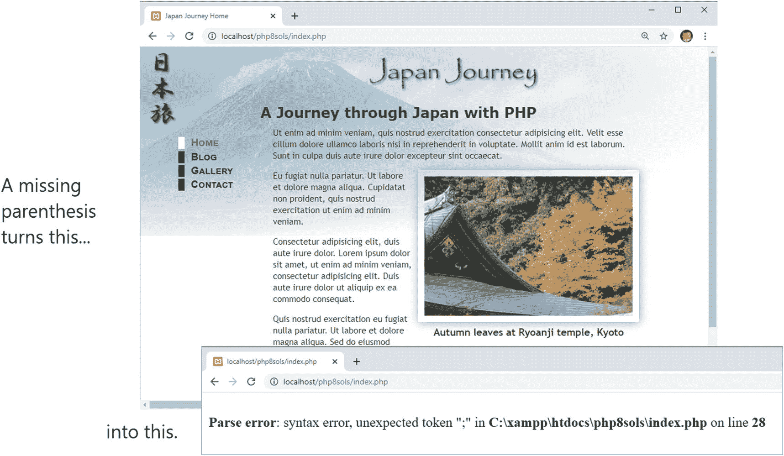

# 一、PHP 8 是什么？

2020 年 11 月下旬发布的 PHP 8 是最流行的编程语言之一的重大更新。根据网络技术调查( [`https://w3techs.com/technologies/details/pl-php/all/all`](https://w3techs.com/technologies/details/pl-php/all/all) )，使用服务器端语言的网站中，超过五分之四部署了 PHP。尽管 PHP 很受欢迎，但也有很多批评者，主要是因为这种语言在早期的发展方式。这导致相关函数的名称和参数的顺序有时不一致。而且它的一些特性对没有经验的人来说会带来安全风险。自 2012 年以来，为改善语言所做的共同努力已经消除了大部分问题。

PHP 现在是一种成熟、强大的语言，已经成为创建动态网站最广泛使用的技术。它被大型企业使用，包括 Wikipedia、Mailchimp 和 Tumblr，也支持流行的 WordPress、Drupal 和 Joomla 内容管理系统。PHP 通过以下方式赋予网站生命:

*   将您网站的反馈直接发送到您的邮箱

*   通过网页上传文件

*   从较大的图像生成缩略图

*   读取和写入文件

*   动态显示和更新信息

*   使用数据库来显示和存储信息

*   使网站可搜索

*   还有更多…

通过阅读这本书，你将能够做到这一切。PHP 不仅简单易学；它是平台中立的，所以相同的代码可以在 Windows、macOS 和 Linux 上运行。你需要用 PHP 开发的所有软件都是开源免费的。

在本章中，您将了解以下内容:

*   PHP 是如何发展成为动态网站最广泛使用的技术的

*   PHP 如何使网页动态化

*   学习 PHP 有多难或多容易

*   PHP 是否安全

*   PHP 8 的新特性

*   写 PHP 需要什么软件

## PHP 是如何发展的

PHP 始于 1995 年，当时的野心并不大。最初叫个人主页工具(PHP Tools)。其主要目标之一是通过从在线表格中收集信息并将其显示在网页上来创建一个留言簿。不到三年，它就决定从名字中去掉个人主页，因为它听起来像是为业余爱好者准备的，而且与后来添加的一系列复杂功能不相称。这就留下了首字母 PHP 应该代表什么的问题。最终决定称之为 PHP 超文本预处理器；但是大多数人都简单的叫它 PHP。

这些年来，PHP 一直在发展，不断增加新的特性。这种语言最吸引人的地方之一是它忠实于自己的根源。尽管它支持复杂的面向对象编程，但您可以在不深入复杂理论的情况下开始使用它。PHP 的创始人拉斯马斯·勒德尔夫曾将其描述为“一种对程序员非常友好的脚本语言，适合没有编程经验的人以及需要快速完成工作的经验丰富的 web 开发人员。”您可以立即开始编写有用的脚本，同时确信您正在使用一种能够开发工业级应用的技术。

Note

本书中的大部分代码都使用了 PHP 8 的新特性。它不能保证在旧版本的 PHP 上工作。

## PHP 如何使页面动态化

PHP 最初被设计成嵌入在网页的 HTML 中，这也是它经常被使用的方式。例如，要在版权声明中显示当前年份，您可以将其放在页脚中:

```php
<p>&copy; <?php echo date('Y'); ?> PHP 8 Solutions</p>

```

在支持 PHP 的 web 服务器上，`<?php`和`?>`标记之间的代码被自动处理，并显示年份，如下所示:

这只是一个小例子，但它说明了使用 PHP 的一些优点:

*   新年午夜钟声敲响时，年份会自动更新。

*   日期是由 web 服务器计算的，因此如果用户电脑中的时钟设置不正确，也不会受到影响。然而，正如您稍后将了解到的，PHP 遵循服务器的时区；但是这可以通过编程来调整。

虽然像这样在 HTML 中嵌入 PHP 代码很方便，但是这是重复的，而且会导致错误。它还会使您的网页难以维护，尤其是当您开始使用更复杂的 PHP 代码时。因此，通常的做法是将大量动态代码存储在单独的文件中，然后使用 PHP 从不同的组件构建页面。单独的文件——或通常所说的*包含文件*——可以只包含 PHP、HTML 或两者的混合。

举个简单的例子，你可以把网站的导航菜单放在一个包含文件中，用 PHP 把它包含在每个页面中。每当需要更改菜单时，只需编辑包含文件，更改会自动反映在包含菜单的每个页面中。想象一下，对于一个有几十个页面的网站来说，这能节省多少时间！

对于普通的 HTML 页面，内容是由 web 开发人员在设计时确定的，并上传到 web 服务器。当有人访问页面时，web 服务器只需发送 HTML 和其他资产，如图像和样式表。这是一个简单的事务—请求来自浏览器，固定内容由服务器发回。当你用 PHP 创建网页时，更多的事情会发生。图 [1-1](#Fig1) 显示了发生的情况。


图 1-1

web 服务器动态构建每个 PHP 页面来响应请求

当一个 PHP 驱动的网站被访问时，它会启动以下事件序列:

1.  浏览器向 web 服务器发送请求。

2.  web 服务器将请求传递给嵌入在服务器中的 PHP 引擎。

3.  PHP 引擎处理请求页面中的代码。在许多情况下，它还可能在构建页面之前查询数据库。

4.  服务器将完成的页面发送回浏览器。

这个过程通常只需要几分之一秒，所以 PHP 网站的访问者不太可能注意到任何延迟。因为每个页面都是单独构建的，所以 PHP 站点可以响应用户输入，在用户登录时显示不同的内容，或者显示数据库搜索的结果。

### 创建独立思考的页面

PHP 是一种服务器端语言。PHP 代码保留在 web 服务器上。经过处理后，服务器只发送脚本的输出。通常情况下，这是 HTML，但 PHP 也可以用于生成其他 web 语言，如 JSON (JavaScript 对象表示法)或 XML(可扩展标记语言)。

PHP 允许你在你的网页中引入基于选择的逻辑。有些决策是使用 PHP 从服务器收集的信息做出的:日期、时间、星期几、页面 URL 中的信息等等。如果是星期三，它会显示星期三的电视时间表。在其他时候，决策是基于用户输入的，这是 PHP 从在线表单中提取的。如果你注册了一个网站，它会显示个性化信息——诸如此类。

## PHP 使用和学习有多难？

PHP 不是火箭科学，但是不要期望在 5 分钟内成为专家。也许对新来者来说最大的震惊是 PHP 对错误的容忍度远远低于浏览器对 HTML 的容忍度。如果在 HTML 中省略了结束标记，大多数浏览器仍然会呈现页面。如果您在 PHP 中省略了右引号、分号或大括号，您将得到如图 [1-2](#Fig2) 所示的错误信息。这影响了所有的编程语言，比如 JavaScript 和 C#，而不仅仅是 PHP。



图 1-2

像 PHP 这样的服务器端语言不能容忍大多数编码错误

如果你使用可视化设计工具，却从来不看底层代码，那么是时候重新考虑你的方法了。将 PHP 与结构不良的 HTML 混合在一起很可能会导致问题。PHP 使用循环来执行重复的任务，比如显示数据库搜索的结果。一个循环重复相同的代码段——通常是 PHP 和 HTML 的混合——直到所有结果都显示出来。如果你把循环放在错误的地方，或者你的 HTML 结构不良，你的页面很可能会像纸牌搭的房子一样倒塌。

如果你还没有这样做的习惯，使用万维网联盟(W3C)的 Nu HTML 检查器( [`https://validator.w3.org/nu/`](https://validator.w3.org/nu/) )来检查你的页面是个好主意。

Note

W3C 是开发 HTML 和 CSS 等标准以确保网络长期发展的国际组织。它是由万维网的发明者蒂姆·伯纳斯·李领导的。要了解 W3C，请参见 [`www.w3.org/Consortium/mission`](http://www.w3.org/Consortium/mission) 。

### 我可以复制并粘贴代码吗？

抄这本书里的代码没有错。这就是它存在的目的。我已经把这本书组织成了一系列实践项目。我解释了代码的用途以及它为什么会在那里。即使您不完全理解它是如何工作的，这也应该给了您足够的信心，让您知道代码的哪些部分适合您自己的需要，哪些部分最好不要去管。但是要想从这本书中获得最大收益，你需要开始尝试，然后想出自己的解决方案。

PHP 有数以千计的内置函数，可以执行各种任务，比如将文本转换为大写，从全尺寸图像生成缩略图，或者连接到数据库。真正的力量来自于以不同的方式组合这些函数，并添加您自己的条件逻辑。

### PHP 有多安全？

PHP 就像你家里的电或菜刀:处理得当，非常安全；不负责任的处理，会造成很大的伤害。这本书第一版的灵感之一是大量攻击，这些攻击利用了电子邮件脚本中的漏洞，将网站变成了垃圾邮件中继站。解决方案很简单，你将在第 6 章中了解到，但即使多年后，我仍然看到有人使用同样不安全的技术，将他们的网站暴露在攻击之下。

PHP 并非不安全，也不需要每个人都成为安全专家才能使用。重要的是理解 PHP 安全的基本原理:*在处理用户输入之前总是检查它*。你会发现这是本书的永恒主题。大多数安全风险都可以不费吹灰之力消除。

保护自己的最好方法是理解你正在使用的代码。

## PHP 8 有什么新特性？

PHP 8 中的新特性和变化非常广泛；但最重要的是采用了实时(JIT)编译器。这改变了 PHP 代码转换成服务器可以理解的机器码的方式。顾名思义，JIT 旨在提高性能。JIT 提案的作者之一 Zeev Surasky 制作了一个短片( [`https://youtu.be/dWH65pmnsrI`](https://youtu.be/dWH65pmnsrI) )来展示 JIT 能够带来的巨大改进。然而，这样的速度提升只会影响处理器密集型计算——至少目前是这样。WordPress 在 PHP 8 上的运行速度并不比在 PHP 7 上快，这也是它在速度上超越之前版本的地方。

PHP 8 中的许多新特性旨在使代码更加简洁高效。例如，如果您只想更改一个函数的多个参数中的一个，那么使用命名参数就不需要重复这些参数的默认值。构造函数属性提升极大地简化了类定义中的属性声明，通常会将行数减少三分之一。新的 nullsafe 操作符同样减少了调用方法或获取非 null 表达式结果的属性所需的代码量。这些和其他新特性的细节在第 [3](03.html) 和 [4](04.html) 章中介绍。

将现有代码迁移到新版本 PHP 的一个重要考虑是，不兼容的更改是否会破坏您的应用。如果你一直遵循推荐的最佳实践，你不太可能有问题。但是，您应该了解一些重要的变化，如下所示:

*   错误控制操作符(`@`)将不再沉默致命错误。

*   使用两个等号(`==`)的数字和非数字字符串之间的非严格比较现在将数字转换为字符串并比较字符串。这意味着以前等同于`true`的一些比较现在是`false`。

*   与类同名的方法不再被解释为构造函数。你必须用`__construct()`来代替。

*   您不能再定义不区分大小写的常量。

*   `match`现在是保留关键字。

*   `#[`不再被认为是注释的开始，因为这个语法被用于一个叫做属性的新特性。这只影响`#`后的左方括号。

Note

参见 [`www.php.net/manual/en/migration80.incompatible.php`](http://www.php.net/manual/en/migration80.incompatible.php) 获得 PHP 8 中向后不兼容的变化的完整列表。

## 写 PHP 需要什么软件？

严格来说，你不需要任何特殊的软件来编写 PHP 脚本。PHP 代码是纯文本，可以在任何文本编辑器中创建，例如 Windows 上的记事本或 macOS 上的 TextEdit。话虽如此，如果你使用一个具有加速开发过程的特性的程序，你的生活会变得容易得多。有很多可用的——既有免费的，也有付费的。

### 选择 PHP 编辑器时要注意什么

如果你的代码中有一个错误，你的页面可能永远不会到达浏览器，你只会看到一个错误信息。您应该选择具有以下功能的脚本编辑器:

*   PHP 语法检查:这曾经只能在昂贵的专用程序中找到，但是现在它是几个免费程序的一个特性。语法检查器会在您键入代码时监控代码并突出显示错误，从而节省大量时间并减少挫败感。

*   **PHP 语法着色**:代码根据所扮演的角色用不同的颜色突出显示。如果你的代码是一种意想不到的颜色，这肯定是你犯了一个错误。

*   PHP 代码提示:PHP 有如此多的内置函数，以至于即使对于一个有经验的用户来说，也很难记住如何使用它们。许多脚本编辑器会自动显示工具提示，提醒您某段代码是如何工作的。

*   **线路编号**:快速找到特定线路，使故障排除变得更加简单。

*   **一个“平衡大括号”特征**:圆括号(`()`)、方括号(`[]`)和花括号(`{}`)必须总是成对出现。很容易忘记关闭一对。所有好的脚本编辑器都有助于找到匹配的圆括号、方括号或大括号。

您正在使用的构建网页的程序可能已经具备了这些功能中的部分或全部。即使您不打算进行大量的 PHP 开发，如果您的 web 开发程序不支持语法检查，您也应该考虑使用专用的脚本编辑器。下面的专用脚本编辑器拥有所有的基本特性，比如语法检查和代码提示。这不是一个详尽的列表，而是基于个人经验的列表:

*   **PhpStorm** ( [`www.jetbrains.com/phpstorm/`](http://www.jetbrains.com/phpstorm/) ):虽然这是一个专用的 PHP 编辑程序，但它对 HTML、CSS、JavaScript 都有极好的支持。这是我最喜欢的用 PHP 开发的程序。它是按年订阅出售的。如果您在至少 12 个月后取消，您将获得旧版本的永久许可证。

*   **Visual Studio Code**([`https://code.visualstudio.com/`](https://code.visualstudio.com/)):微软的一款优秀的代码编辑器，不仅可以在 Windows 上运行，也可以在 macOS 和 Linux 上运行。它是免费的，并且内置了对 PHP 的支持。

*   **Sublime Text** ( [`www.sublimetext.com/`](http://www.sublimetext.com/) ):如果你是 Sublime Text 的粉丝，这里有 PHP 语法着色、语法检查和文档化的插件。免费评估，但你应该购买相对便宜的许可证继续使用。

*   Zend Studio ( [`www.zend.com/products/zend-studio`](http://www.zend.com/products/zend-studio) ):由 Zend 创建的强大的专用 PHP 编辑器，该公司由 PHP 开发的主要贡献者运营。它可以在 Windows、macOS 和 Linux 上运行。不同的价格适用于个人和商业用途。

*   **Eclipse PHP 开发工具(PDT)** ( [`https://projects.eclipse.org/projects/tools.pdt`](https://projects.eclipse.org/projects/tools.pdt) ):类似 Zend Studio 但优势是免费。它运行在 Eclipse 上，Eclipse 是支持多种计算机语言的开源 IDE。如果您已经将 Eclipse 用于其他语言，您应该会发现它相对容易使用。PDT 在 Windows、macOS 和 Linux 上运行。

## 所以让我们继续吧…

这一章仅仅提供了一个 PHP 可以做些什么来给你的网站添加动态特性的简要概述，以及你需要什么样的软件来这样做。使用 PHP 的第一步是建立一个测试环境。下一章将介绍你在 Windows 和 macOS 上需要的东西。