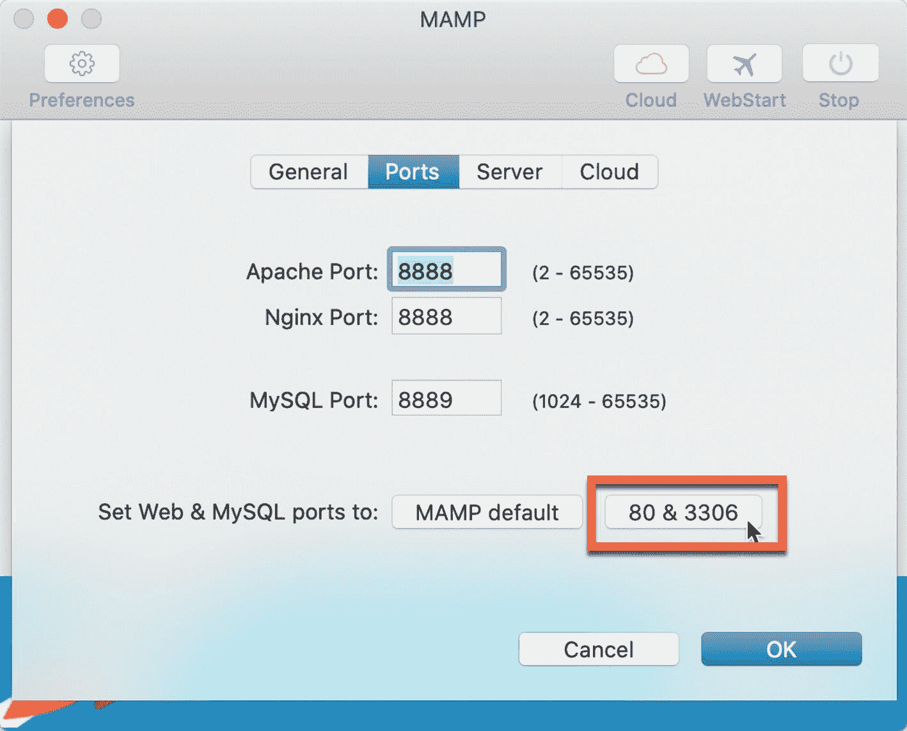
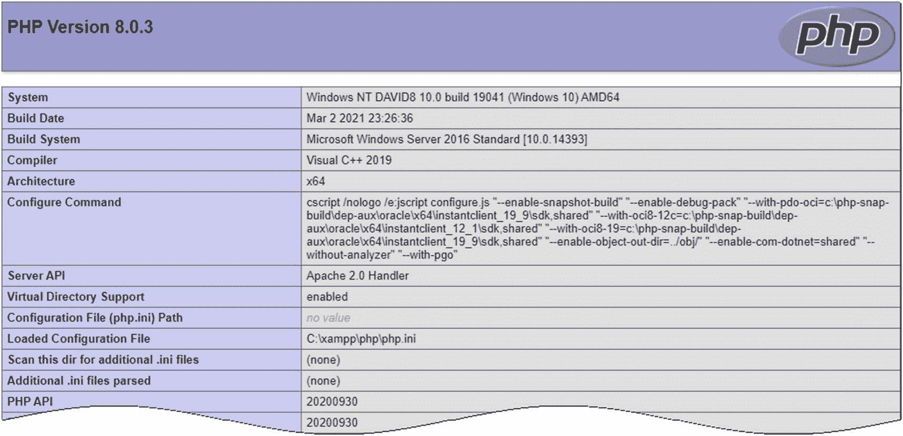

# 2.准备使用 PHP

既然您已经决定使用 PHP 来丰富您的网页，那么您需要确保您已经拥有了继续阅读本书其余部分所需的一切。虽然您可以在远程服务器上测试所有内容，但是在本地计算机上测试 PHP 页面通常更方便。你需要安装的一切都是免费的。在这一章中，我将解释 Windows 和 macOS 的各种选项。必要的组件通常默认安装在 Linux 上。

本章涵盖

*   检查你的网站是否支持 PHP

*   在 Windows 和 macOS 中使用现成的包创建本地测试设置

*   决定存储 PHP 文件的位置

*   检查本地和远程服务器上的 PHP 配置

## 检查你的网站是否支持 PHP

要想知道你的网站是否支持 PHP，最简单的方法就是询问你的托管公司。另一种方法是上传一个 PHP 页面到你的网站，看看它是否有效。即使您知道您的站点支持 PHP，也要做以下测试来确认运行的是哪个版本:

1.  打开脚本编辑器，在空白页中键入以下代码:

1.  将文件另存为`phpversion.php`。确保你的操作系统没有在`.php`后面添加`.txt`文件扩展名是很重要的。如果您在 Mac 上使用“文本编辑”，请确定它没有以 RTF 格式存储文件。如果你完全不确定，使用本书随附文件中的`ch02`文件夹中的`phpversion.php`。

2.  像上传 HTML 页面一样上传`phpversion.php`到你的网站，然后在浏览器中输入 URL。假设您将文件上传到站点的顶层，URL 将类似于 [`www.example.com/phpversion.php`](http://www.example.com/phpversion.php) 。

```php
<?php echo phpversion();

```

如果您看到屏幕上显示一个由三部分组成的数字，如 8.0.3，那么您就成功了:PHP 已启用。这个数字告诉你你的服务器上运行的是哪个版本的 PHP。

1.  如果您收到类似“解析错误”的消息，这意味着 PHP 是受支持的，但您在文件中键入代码时出错了。请使用`ch02`文件夹中的版本。

2.  如果只是看到原代码，说明不支持 PHP。

Caution

本书中的代码使用了 PHP 8 的新特性。如果您的 web 服务器运行的是旧版本的 PHP，本书中描述的许多技术将无法工作。

### 决定在哪里测试你的页面

与普通网页不同，你不能在 Mac 上的 Windows 文件资源管理器或 Finder 中双击 PHP 页面，然后在浏览器中查看它们。它们需要通过支持 PHP 的网络服务器进行解析或处理。如果你的托管公司支持 PHP，你可以上传你的文件到你的网站并在那里测试。但是，每次进行更改时，您都需要上传文件。在早期，您会发现由于代码中的一个小错误，您不得不经常这样做。随着你越来越有经验，你仍然需要经常上传文件，因为你会想尝试不同的想法。

使用本地测试环境是用 PHP 开发的最有效的方式。本章的其余部分将向你展示如何做到这一点，包括对 Windows 和 macOS 的说明。

## 本地测试环境需要什么

要在本地计算机上测试 PHP 页面，您需要安装以下软件:

*   网络服务器，它是一个显示网页的软件，而不是一台独立的计算机

*   服务器端编程语言（Professional Hypertext Preprocessor 的缩写）

*   一个 MySQL 或 MariaDB 数据库和 phpMyAdmin，一个用于管理数据库的基于 web 的前端

Tip

MariaDB ( [`https://mariadb.org/`](https://mariadb.org/) )是一个由社区开发的替代 MySQL 的插件。本书中的代码完全兼容 MySQL 和 MariaDB。

你需要的所有软件都是免费的。对你来说，唯一的代价是下载必要的文件所花费的时间，当然，还有确保一切设置正确的时间。在大多数情况下，您应该在不到一个小时的时间内启动并运行，可能更短。只要你有至少 1 GB 的空闲磁盘空间，你应该能够在你的计算机上安装所有的软件——即使是一个普通的软件。

Tip

如果您的本地计算机上已经有了 PHP 8 测试环境，就没有必要重新安装。只需查看本章末尾的“检查 PHP 设置”一节。

设置测试环境最简单的方法是使用一个包，在一个操作中安装 Apache、PHP、MySQL(或 MariaDB)和 phpMyAdmin。在我的电脑上，我用 XAMPP 操作系统( [`www.apachefriends.org/index.html`](http://www.apachefriends.org/index.html) )和 MAMP 操作系统( [`www.mamp.info/en/`](http://www.mamp.info/en/) )。还提供其他软件包；你选择哪一个都没关系。

## 在 Windows 上设置

在继续之前，请确保您以管理员身份登录。

### 让窗口显示文件扩展名

默认情况下，大多数 Windows 计算机隐藏常见的三或四个字母的文件扩展名，如`.doc`或`.html`，所以你在对话框和 Windows 文件资源管理器中看到的都是`thisfile`，而不是`thisfile.doc`或`thisfile.html`。

使用以下说明在 Windows 10 中启用文件扩展名显示:

1.  打开文件资源管理器(Windows 键+ E)。

2.  选择“查看”以展开文件资源管理器窗口顶部的功能区。

3.  选择“文件扩展名”复选框。

显示文件扩展名更加安全——您可以判断病毒作者是否在看似无害的文档中附加了`.exe`或`.scr`可执行文件。

### 选择 Web 服务器

大多数 PHP 安装运行在 Apache web 服务器上。两者都是开源的，可以很好地协同工作。但是，Windows 有自己的 web 服务器，Internet 信息服务(IIS)，它也支持 PHP。微软与 PHP 开发团队密切合作，将 PHP 在 IIS 上的性能提高到与 Apache 大致相同的水平。那么应该选择哪个呢？

除非您需要 ASP 或 ASP.NET 的 IIS，否则我建议您使用 XAMPP 或其他一体化软件包安装 Apache，如下一节所述。如果需要使用 IIS，可以从 [`https://php.iis.net/`](https://php.iis.net/) 安装 PHP。

### 在 Windows 上安装一体化软件包

有两个流行的 Windows 软件包可以在一次操作中在你的电脑上安装 Apache、PHP、MySQL 或 MariaDB、phpMyAdmin 和其他几个工具:XAMPP ( [`www.apachefriends.org/index.html`](http://www.apachefriends.org/index.html) )和 EasyPHP ( [`www.easyphp.org`](http://www.easyphp.org) )。安装过程通常只需几分钟。安装完软件包后，您可能需要更改一些设置，这将在本章后面解释。

在印刷书籍的生命周期中，版本很容易改变，所以我不会描述安装过程。每个包装的网站上都有说明。

## 在 macOS 上设置

Apache web 服务器和 PHP 预装在 macOS 上，但默认情况下它们是不启用的。我建议您不要使用预装的版本，而是使用 MAMP，它可以在一次操作中安装 Apache、PHP、MySQL、phpMyAdmin 和其他几个工具。

为了避免与预装的 Apache 和 PHP 版本冲突，MAMP 将所有应用程序放在硬盘上的专用文件夹中。如果您决定不再需要电脑上的 MAMP，只需将 MAMP 文件夹拖到废纸篓，就可以轻松卸载所有内容。

### 安装 MAMP

开始之前，请确定您已使用管理权限登录到电脑:

1.  前往 [`www.mamp.info/en/downloads/`](http://www.mamp.info/en/downloads/) ，选择 MAMP & MAMP PRO 的链接。这会下载一个磁盘映像，其中包含免费和付费版本的 MAMP。

2.  下载完成后，启动磁盘映像。您将看到一份许可协议。您必须点按“同意”以继续装载磁盘映像。

3.  按照屏幕上的说明进行操作。

4.  验证 MAMP 已安装在您的应用程序文件夹中。

Note

MAMP 自动将免费版和付费版安装在分别名为`MAMP`和`MAMP PRO`的文件夹中。付费版本使得配置 PHP 和使用虚拟主机更加容易，但是免费版本已经足够了，尤其是对于初学者。如果你想删除`MAMP PRO`文件夹，不要把它拖到垃圾桶里。打开文件夹，双击`MAMP PRO`卸载图标。付费版本需要这两个文件夹。

### 测试和配置 MAMP

默认情况下，MAMP 为 Apache 和 MySQL 使用非标准端口。除非您使用 Apache 和 MySQL 的多个安装，否则请按照以下步骤更改端口设置:


图 2-1

在 MAMP 控制面板中选择 PHP 版本

1.  双击应用程序/MAMP 中的 MAMP 图标。如果您看到一个面板，邀请您了解有关标准视图的更多信息，这是仅在付费版本中新增的功能。要防止每次启动 MAMP 时都显示该面板，请取消选择面板左下角的复选框。然后单击左上角的关闭按钮关闭面板。

2.  在 MAMP 控制面板中，将 PHP 版本下拉菜单设置为 8.0.2 或更高版本(参见图 [2-1](#Fig1) )。如果你得到一个警告，说你的站点在 PHP 8 中可能没有预期的行为，点击 OK。通过选中复选框，可以防止此警告再次出现。



图 2-2

更改 Apache 和 MySQL 端口

1.  单击 MAMP 控制面板右上角的开始图标。您的默认浏览器最终会启动并向您显示 MAMP 欢迎页面。

2.  如果您的浏览器没有自动启动，请单击 MAMP 控制面板顶部的 WebStart 图标。

3.  检查浏览器地址栏中的 URL。从`localhost:8888`开始。`:8888`表示 Apache 正在监听非标准端口 8888 上的请求。

4.  最小化浏览器，然后单击 MAMP 控制面板左上角的首选项图标。

5.  在打开的面板顶部选择端口。显示 Apache 和 MySQL 运行在端口 8888 和 8889 上(见图 [2-2](#Fig2) )。

1.  如图 [2-2](#Fig2) 所示，点击 80 & 3306 按钮，将 web 和 MySQL 端口更改为标准值:Apache 为 80，MySQL 为 3306。

2.  当提示重新启动服务器时，点按“好”并输入您的 Mac 密码。

    提示如果任何其他程序正在使用端口 80，Apache 将不会重新启动。如果您找不到阻止 Apache 使用端口 80 的原因，请打开 MAMP 偏好设置面板，然后单击 MAMP 默认按钮。然后再次单击确定。

3.  当服务器再次启动时，单击 MAMP 控制面板中的 WebStart 按钮，将欢迎页面加载到浏览器中。这一次，URL 不应该有一个冒号，后跟一个出现在`localhost`后面的数字，因为 Apache 现在正在监听默认端口。

## 在哪里可以找到你的 PHP 文件(Windows 和 Mac)

您需要在 web 服务器可以处理文件的位置创建文件。通常，这意味着文件应该位于服务器的文档根目录或文档根目录的子文件夹中。对于最常见的设置，文档根目录的默认位置如下:

*   **XAMPP** : `C:\xampp\htdocs`

*   **EasyPHP** : `C:\EasyPHP\www`

*   **IIS** ： `C:\inetpub\wwwroot`

*   **MAMP** : `/Applications/MAMP/htdocs`

要查看 PHP 页面，您需要使用 URL 将其加载到浏览器中。在您的本地测试环境中，web 服务器的文档根的 URL 是`http://localhost/`。

Caution

如果您需要将 MAMP 重置回其默认端口，您将需要使用`http://localhost:8888`而不是`http://localhost`。

如果您将这本书的文件存储在名为`php8sols`的文档根目录的子文件夹中，URL 是`http://localhost/php8sols/`，后跟文件夹(如果有)和文件的名称。

Tip

如果您对`http://localhost/`有疑问，请使用`http://127.0.0.1/`。`127.0.0.1`是所有计算机用来指代本地机器的环回 IP 地址。

## 检查你的 PHP 设置

安装 PHP 后，最好检查一下它的配置设置。除了核心特性，PHP 还有大量可选的扩展。一体化软件包安装了这本书所需的所有扩展。但是，一些基本配置设置可能会略有不同。为避免意外问题，请调整您的配置，以匹配以下页面中推荐的设置。

### 用 phpinfo()显示服务器配置

PHP 有一个内置命令`phpinfo()`，显示 PHP 在服务器上如何配置的细节。由`phpinfo()`产生的大量细节可能让人感觉像是大量信息过载，但是它对于确定为什么某些东西在您的本地计算机上完美地工作而在您的实时网站上却不工作是无价的。问题通常在于远程服务器禁用了某个功能或者没有安装可选的扩展。

一体式软件包使运行`phpinfo()`变得简单:

*   **XAMPP** :点击 XAMPP 控制面板中的 Apache 管理按钮，在浏览器中启动 XAMPP 欢迎页面。然后点击页面顶部的 PHPInfo 按钮。

*   MAMP:向下滚动到 MAMP 欢迎页面的 PHP 部分，点击 phpinfo 链接。

或者，创建一个简单的测试文件，并按照以下说明将其加载到您的浏览器中:

1.  确保 Apache 或 IIS 正在本地计算机上运行。

2.  在脚本编辑器中键入以下内容:

```php
<?php phpinfo();

```

文件里应该没别的了。



图 2-3

运行`phpinfo()`命令显示 PHP 配置的全部细节。

1.  将文件保存为服务器文档根目录中的`phpinfo.php`(参见本章前面的“在哪里定位您的 PHP 文件(Windows 和 Mac)”。

    **小心**确保你的编辑器没有在`.php`后添加`.txt`或`.rtf`扩展名。

2.  在浏览器地址栏中键入`http://localhost/phpinfo.php`，然后按回车键。

3.  您应该会看到一个类似于图 [2-3](#Fig3) 的页面，显示 PHP 的版本，后面是您的 PHP 配置的详细信息。

1.  记下加载的配置文件项目的值。这告诉你在哪里可以找到`php.ini`，你需要编辑这个文本文件来改变 PHP 中的大多数设置。

2.  向下滚动到标记为 Core 的部分，将设置与表 [2-1](#Tab1) 中推荐的设置进行比较。记下任何差异，以便您可以按照本章后面的描述进行更改。

    表 2-1

    推荐的 PHP 配置设置

    <colgroup><col class="tcol1 align-left"> <col class="tcol2 align-left"> <col class="tcol3 align-left"></colgroup> 
    | 

    管理的

     | 

    本地值

     | 

    评论

     |
    | --- | --- | --- |
    | `display_errors` | 在 | 对于调试脚本中的错误至关重要。如果设置为 Off，错误会导致完全空白的屏幕，让您对可能的原因一无所知。 |
    | `error_reporting` | Thirty-two thousand seven hundred and sixty-seven | 这将错误报告设置为最高级别。 |
    | `file_uploads` | 在 | 允许您使用 PHP 将文件上传到网站。 |
    | `log_errors` | 离开 | 当`display_errors`设置为 On 时，您不需要用错误日志来填充硬盘。 |

3.  配置页面的其余部分显示了启用了哪些 PHP 扩展。虽然页面看起来会一直延续下去，但是扩展都是按字母顺序排列的。要使用这本书，请确保启用了以下扩展:

    *   **gd** :使 PHP 能够生成和修改图像和字体。

        **注意**如果您的测试环境运行在 Windows 上，并且没有列出`gd`扩展，您可以按照下一节中的说明轻松打开它。

    *   **MySQL**:连接到 MySQL/MariaDB。(请注意“I”，它代表“改进的”。从 PHP 7 开始，不再支持旧的`mysql`版本。)

    *   PDO:为数据库提供软件中立的支持(可选)。

    *   **pdo_mysql** :连接 MySQL/MariaDB 的替代方法(可选)。

    *   **会话**:会话维护与用户相关的信息，并用于用户认证等。

您还应该在远程服务器上运行`phpinfo()`来检查哪些特性被启用了。如果不支持列出的扩展名，当您将文件上传到网站时，本书中的某些代码将无法工作。如果`PDO`和`pdo_mysql`没有列出，可以用`mysqli`代替。

Caution

phpinfo()显示的输出揭示了大量信息，恶意黑客可以利用这些信息来攻击您的网站。检查配置后，请务必从远程服务器上删除该文件。

如果您的设置中有任何设置与这些建议不同，您将需要编辑 PHP 配置文件`php.ini`，如下一节所述。

### 编辑 php.ini

PHP 配置文件`php.ini`是一个非常长的文件，这往往会让编程新手感到紧张，但没什么好担心的。它是用纯文本编写的，其长度的一个原因是它包含大量解释各种选项的注释。也就是说，在编辑`php.ini`之前做个备份是个好主意，以防你出错。

如何打开`php.ini`取决于您的操作系统和 PHP 的安装方式:

*   如果您在 Windows 上使用了一体化软件包，例如 XAMPP，请在 Windows 文件资源管理器中双击`php.ini`。该文件将在记事本中自动打开。

*   如果您在 IIS 上安装了 PHP，`php.ini`通常位于 Program Files 的子文件夹中。虽然您可以通过双击打开`php.ini`，但是您将无法保存您所做的任何更改。相反，右键单击记事本并选择以管理员身份运行。在记事本中，选择文件➤打开，并设置选项显示所有文件(*。*).导航到`php.ini`所在的文件夹，选择文件，点击打开。

*   在 macOS 上，使用纯文本编辑器打开`php.ini`。如果您使用“文本编辑”，请确定它将文件存储为纯文本格式，而不是多信息文本格式。

以分号(`;`)开头的行是注释。除了在 Windows 上打开`gd`扩展名，需要编辑的行不用分号开头。

使用您的文本编辑器的查找功能找到您需要更改的指令，以匹配表 [2-1](#Tab1) 中的建议。大多数指令前面都有一个或多个应该如何设置的示例。确保你没有错误地编辑其中一个被评论的例子。

对于使用`On`或`Off`的指令，只需将值更改为推荐值。例如，如果需要打开错误消息的显示，请编辑这一行

```php
display_errors = Off

```

通过将其更改为:

```php
display_errors = On

```

要设置错误报告的级别，您需要使用 PHP 常量，这些常量以大写形式编写，并且区分大小写。该指令应该如下所示:

```php
error_reporting = E_ALL

```

如果您的测试环境运行在 Windows 上，并且在运行`phpinfo()`时没有列出`gd`扩展，那么在`php.ini`中找到下面一行:

```php
;extension=gd

```

删除该行开头的分号。

Note

在 macOS 和 Linux 上，PHP 通常需要在启用 gd 扩展的情况下进行编译，所以这个简单的修复不起作用。查看您下载 PHP 安装的网站，了解任何可用的选项。

编辑`php.ini`后，保存文件，然后重启 Apache 或 IIS，使更改生效。如果 web 服务器无法启动，请检查服务器的错误日志文件。可以在以下位置找到它:

*   **XAMPP** :在 XAMPP 控制面板，点击 Apache 旁边的日志按钮，然后选择 Apache (error.log)。

*   **MAMP** :在/Applications/MAMP/logs 中，双击 apache_error.log 在控制台中打开。

*   **EasyPHP** :右击系统托盘中的 EasyPHP 图标，选择日志文件➤ Apache。

*   **IIS** :日志文件的默认位置是 C:\inetpub\logs。

错误日志中的最新条目应该会告诉您是什么阻止了服务器重新启动。使用该信息来更正您对`php.ini`所做的更改。如果这不起作用，感谢你在编辑之前备份了`php.ini`。重新开始，仔细检查你的编辑。

## 下一步是什么？

现在，您已经有了一个 PHP 测试平台，毫无疑问，您已经迫不及待了。我最不想做的事情就是挫伤任何热情，但是在实际的网站中使用 PHP 之前，您应该对这门语言的规则有一个基本的了解。所以，在开始做这些有趣的事情之前，请阅读下一章，它解释了如何编写 PHP 脚本。即使你有丰富的 PHP 经验，也一定要查看 PHP 8 中的变化部分。