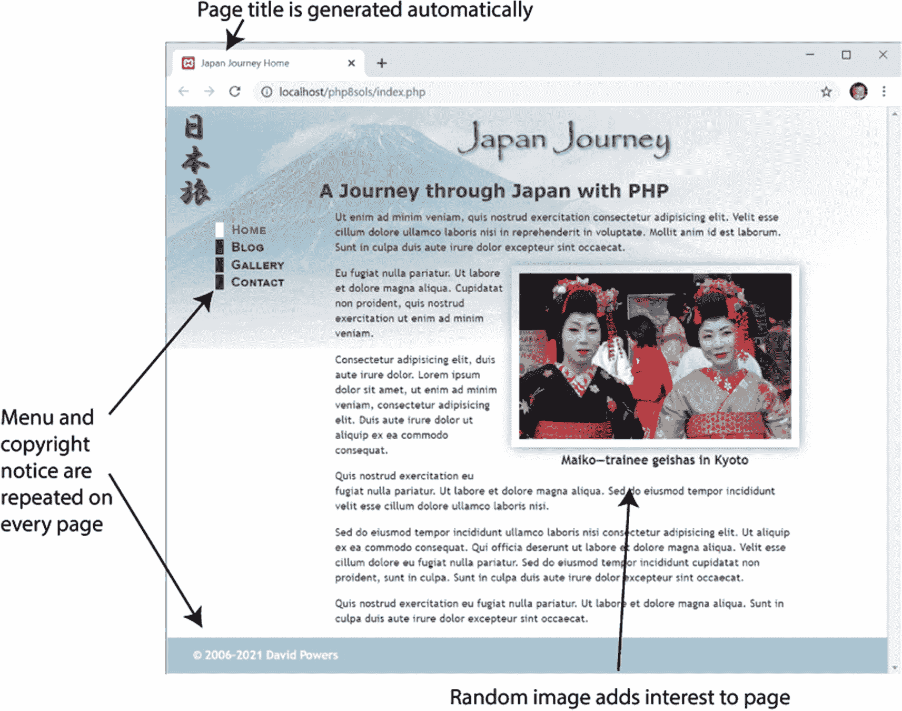
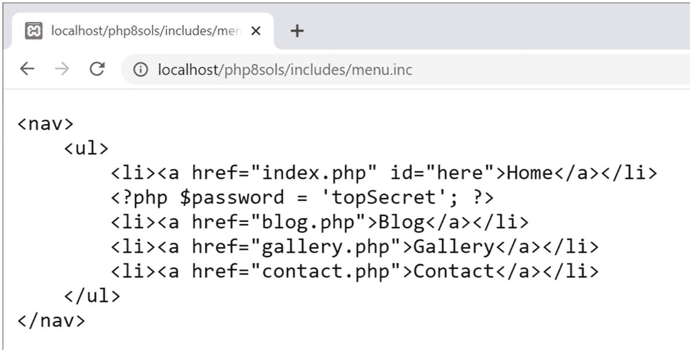
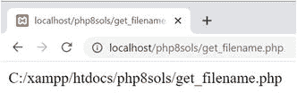
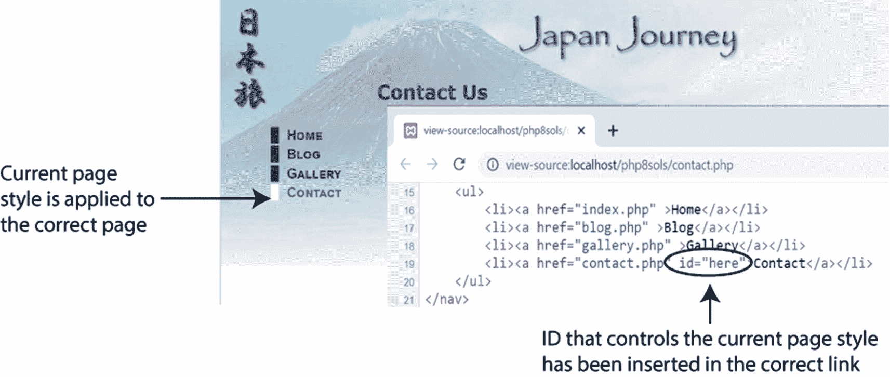
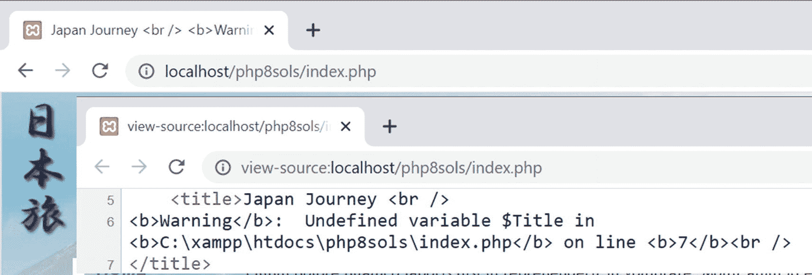
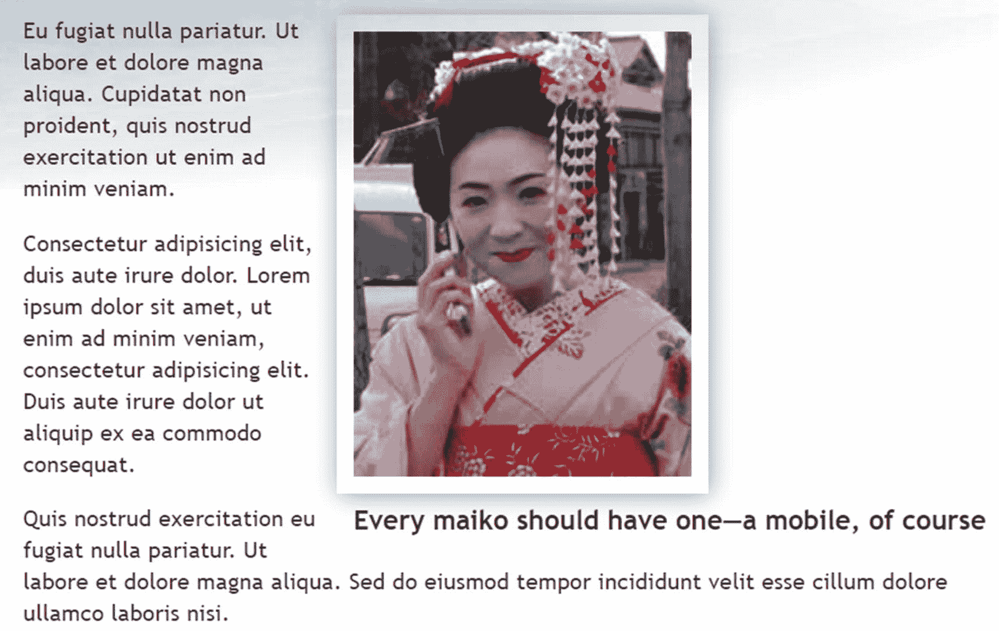
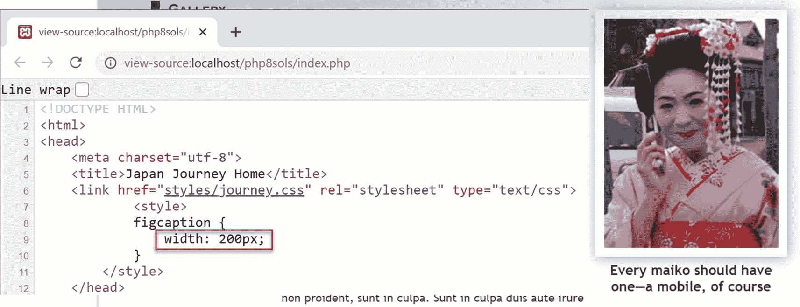

# 5.通过以下内容减轻您的工作量

将一个文件的内容包含在另一个文件中的能力是 PHP 最强大的特性之一。这也是最容易实现的方法之一。这意味着代码可以合并到多个页面中——例如，公共元素，如页眉、页脚或导航菜单。PHP 将内容合并到服务器上的每个页面，允许您通过编辑和上传单个文件来更新菜单或其他公共元素——节省了大量时间。

在学习本章的过程中，您将了解 PHP includes 是如何工作的，PHP 在哪里寻找包含文件，以及当找不到包含文件时如何防止出现错误消息。您还将学习用 PHP 做一些很酷的事情，比如创建一个随机图像生成器。

本章涵盖以下主题:

*   了解不同的包含命令

*   告诉 PHP 在哪里可以找到你的包含文件

*   对公共页面元素使用 PHP 包含

*   保护包含文件中的敏感信息

*   自动化“你在这里”菜单链接

*   从文件名生成页面标题

*   自动更新版权声明

*   显示带有标题的随机图像

*   处理包含文件的错误

*   更改您的 web 服务器的`include_path`

## 包括来自外部文件的代码

包含其他文件代码的能力是 PHP 的核心部分。所有需要做的就是使用 PHP 的 include 命令，并告诉服务器在哪里可以找到该文件。

### PHP 包含命令简介

PHP 有四个命令可以用来包含来自外部文件的代码，即:

*   `include`

*   `include_once`

*   `require`

*   `require_once`

都做基本相同的事情，为什么有四个？根本的区别在于,`include`试图继续处理您的脚本，即使它找不到指定的文件，而`require`在强制意义上使用:如果文件丢失，PHP 引擎停止处理并抛出致命错误。实际上，这意味着如果你的页面在没有外部文件的情况下仍然可用，你应该使用`include`。如果页面依赖于外部文件，使用`require`。

另外两个命令`include_once`和`require_once`防止同一个文件在一个页面中被多次包含。试图在脚本中多次定义函数或类会触发致命错误。因此`include_once`或`require_once`确保函数和类只定义一次，即使脚本试图多次包含外部文件，如果命令在条件语句中就可能发生这种情况。

Tip

如果有疑问，总是使用`require`，除了定义函数和类的文件，这时你应该使用`require_once`。即使找不到外部文件，依赖于您的脚本仍然可以工作也会使您面临安全风险。

### PHP 在哪里寻找包含文件

要包含一个外部文件，请使用四个 include 命令中的一个，后跟用引号括起来的文件路径(单引号或双引号，无所谓)。文件路径可以是绝对路径，也可以是相对于当前文档的路径。例如，只要目标文件存在，以下任何一项都将有效:

```php
require 'includes/menu.php';
require 'C:/xampp/htdocs/php8sols/includes/menu.php';
require '/Applications/MAMP/htdocs/php8sols/includes/menu.php';

```

Note

PHP 接受包含命令的 Windows 文件路径中的正斜杠。

您可以选择在 include 命令中使用圆括号，这样下面的命令也可以使用:

```php
require('includes/menu.php');
require('C:/xampp/htdocs/php8sols/includes/menu.php');
require('/Applications/MAMP/htdocs/php8sols/includes/menu.php');

```

当使用相对文件路径时，建议使用`./`表示路径从当前文件夹开始。因此，像这样重写第一个例子更有效:

```php
require './includes/menu.php'; // path begins in current folder

```

*不起作用的是使用相对于站点根目录的文件路径，如下所示:*

```php
require '/includes/menu.php'; // THIS WILL NOT WORK

```

这是行不通的，因为 PHP include 命令将前导正斜杠解释为硬盘的根目录。换句话说，PHP 将其视为绝对路径，而不是相对于站点根目录的路径。PHP 还查看 PHP 配置中定义的`include_path`。我将在这一章的后面回到这个主题。在此之前，让我们把 PHP 包含实际使用。

#### PHP 解决方案 5-1:移动菜单和页脚以包含文件

图 [5-1](#Fig1) 展示了一个页面的四个元素是如何从包含文件的 PHP 小魔术中获益的。



图 5-1

识别静态网页中可以用 PHP 改进的元素

菜单和页脚出现在 Japan Journey 网站的每个页面上，所以它们是包含文件的主要候选对象。清单 [5-1](#PC5) 显示了页面主体的代码，菜单和页脚以粗体突出显示。(导航菜单中的第二个链接故意不同于图 [5-1](#Fig1) 。你以后会改的。)

1.  将`ch05`文件夹中的`index_01.php`复制到`php8sols`站点根目录，并重命名为`index.php`。如果你正在使用一个提供更新页面链接的程序，不要更新它们。下载文件中的相关链接是正确的。通过将`index.php`加载到浏览器中，检查 CSS 和图像是否正常显示。它看起来应该和图 [5-1](#Fig1) 一样。

2.  将`blog.php`、`gallery.php`和`contact.php`从`ch05`文件夹复制到您的站点根文件夹。这些页面还不能在浏览器中正确显示，因为还没有创建必要的包含文件。这很快就会改变。

3.  在`index.php`中，高亮显示清单 [5-1](#PC5) 中粗体显示的`<nav>`元素，然后剪切(Ctrl+X/Cmd+X)到你的电脑剪贴板。

4.  在站点根目录下创建一个名为`includes`的新文件夹。然后在刚刚创建的文件夹中创建一个名为`menu.php`的文件。删除编辑程序插入的任何代码；该文件必须完全为空。

5.  将剪贴板中的代码粘贴(Ctrl+V/Cmd+V)到`menu.php`并保存文件。`menu.php`的内容应该是这样的:

```php
<header>
    <h1>Japan Journey</h1>
</header>
<div id="wrapper">
    <nav>
        <ul>
            <li><a href="index.php" id="here">Home</a></li>
            <li><a href="blog.php">Journal</a></li>
            <li><a href="gallery.php">Gallery</a></li>
            <li><a href="contact.php">Contact</a></li>
        </ul>
    </nav>
    <main>
        <h2>A journey through Japan with PHP</h2>
        <p>One of the benefits of using PHP . . .</p>
        <figure>
            
            <figcaption>Maiko&​mdash;trainee geishas in Kyoto</figcaption>
        </figure>
        <p>Ut enim ad minim veniam, quis nostrud . . .</p>
        <p>Eu fugiat nulla pariatur. Ut labore et dolore . . .</p>
        <p>Sed do eiusmod tempor incididunt ullamco . . .</p>
    </main>
    <footer>
        <p>&​copy; 2006&​ndash;2021 David Powers</p>
    </footer>
</div>

Listing 5-1The static version of index.php

```

```php
<nav>
    <ul>
        <li><a href="index.php" id="here">Home</a></li>
        <li><a href="blog.php">Journal</a></li>
        <li><a href="gallery.php">Gallery</a></li>
        <li><a href="contact.php">Contact</a></li>
    </ul>
</nav>

```

不要担心你的新文件没有`DOCTYPE`声明或者任何`<html>`、`<head>`或者`<body>`标签。包含该文件内容的其他页面将提供这些元素。

1.  打开`index.php`并在`nav`无序列表留下的空间插入以下内容:

```php
<?php require './includes/menu.php'; ?>

```

这使用了一个到`menu.php`的文档相对路径。在路径的开头使用`./`会更有效，因为它明确指出路径从当前文件夹开始。

Tip

我使用`require`命令，因为导航菜单是关键任务。没有它，就无法浏览网站。

1.  保存`index.php`并将页面加载到浏览器中。看起来应该和以前一模一样。尽管菜单和页面的其余部分来自不同的文件，但 PHP 在将任何输出发送到浏览器之前会将它们合并。

    **注意**不要忘记 PHP 代码需要由 web 服务器处理。如果您已经将文件存储在服务器文档根目录下名为`php8sols`的子文件夹中，您应该使用 URL `http://localhost/php8sols/index.php`来访问`index.php`。如果你需要找到服务器文件根的帮助，请参见第 [2](02.html) 章中的“在哪里定位你的 PHP 文件(Windows 和 Mac)”。

2.  对`footer`做同样的操作。剪切清单 [5-1](#PC5) 中粗体突出显示的行，粘贴到`includes`文件夹中一个名为`footer.php`的空白文件中。然后插入命令，将新文件包含在`<footer>`留下的间隙中:

```php
<?php include './includes/footer.php'; ?>

```

这一次，我使用了`include`而不是`require`。`<footer>`是页面的重要组成部分，但是如果找不到包含文件，站点仍然可用。

Caution

如果包含文件丢失，例如，如果您不小心删除了它，您应该总是替换它或删除 include 命令。不要相信`include`即使找不到外部文件也会尝试处理页面的其余部分。总是在你意识到问题的时候马上解决它们。

1.  保存所有页面并在浏览器中重新加载`index.php`。同样，它应该看起来与原始页面相同。如果您导航到站点中的其他页面，菜单和页脚应该出现在每个页面上。包含文件中的代码现在服务于所有页面。

2.  为了证明菜单是从单个文件中提取的，更改`menu.php`中日志链接的文本，如下所示:

1.  保存`menu.php`并重新加载站点。这种变化反映在所有页面上。你可以对照`ch05`文件夹中的`index_02.php`、`menu_01.php`和`footer_01.php`来检查你的代码。

```php
<li><a href="blog.php">Blog</a></li>

```

如图 [5-2](#Fig2) 所示，有问题。指示您所在页面的样式不会改变(它由`<a>`标签中的`here` ID 控制)。


图 5-2

当前页面指示器仍然指向主页

用 PHP 条件逻辑很容易解决这个问题。在此之前，让我们检查一下 web 服务器和 PHP 引擎是如何处理包含文件的。

### 为 Includes 选择正确的文件扩展名

当 PHP 引擎遇到 include 命令时，它会在外部文件的开头停止处理 PHP，并在结尾继续处理。这就是包含文件只包含原始 HTML 的原因。如果您希望外部文件使用 PHP 代码，那么代码必须包含在 PHP 标签中。因为外部文件是作为包含它的 PHP 文件的一部分来处理的，所以包含文件可以有任何文件扩展名。

一些开发人员使用`.inc`作为文件扩展名，以表明该文件将被包含在另一个文件中。然而，大多数服务器将`.inc`文件视为纯文本。如果文件包含敏感信息，如数据库的用户名和密码，这会带来安全风险。如果该文件存储在您网站的根文件夹中，任何发现该文件名称的人只需在浏览器地址栏中键入 URL，浏览器就会欣然显示您所有的秘密细节！

另一方面，任何带有`.php`扩展名的文件在发送到浏览器之前都会自动发送到 PHP 引擎进行解析。只要你的秘密信息在 PHP 代码块中，在扩展名为`.php`的文件中，它就不会被暴露。这就是为什么一些开发者使用`.inc.php`作为 PHP 包含的双重扩展。`.inc`部分提醒您这是一个包含文件，但是服务器只对末尾的`.php`感兴趣，它确保所有 PHP 代码都被正确解析。

在很长一段时间里，我遵循对包含文件使用`.inc.php`的惯例。但是由于我将所有包含文件存储在一个名为`includes`的单独文件夹中，我认为双扩展名是多余的。我现在用的只是`.php`。

您选择哪种命名约定取决于您，但是单独使用`.inc`是最不安全的。

#### PHP 解决方案 5-2:测试包含的安全性

这个解决方案演示了使用`.inc`和`.php`(或`.inc.php`)作为包含文件的文件扩展名之间的区别。使用上一节中的`index.php`和`menu.php`。或者，使用`ch05`文件夹中的`index_02.php`和`menu_01.php`。如果您使用下载文件，请在使用前删除文件名中的`_02`和`_01`。

1.  将`menu.php`重命名为`menu.inc`，并相应地编辑`index.php`以包含它:

1.  将`index.php`载入浏览器。你应该看不出有什么不同。

2.  修改`menu.inc`中的代码，将密码存储在 PHP 变量中，如下所示:

```php
<?php require './includes/menu.inc'; ?>

```


图 5-3

PHP 代码没有输出，所以只有 HTML 被发送到浏览器

1.  重新加载页面。如图 [5-3](#Fig3) 所示，密码仍然隐藏在源代码中。虽然 include 文件没有`.php`文件扩展名，但是它的内容已经与`index.php`合并，所以 PHP 代码被处理。

```php
<ul>
    <li><a href="index.php" id="here">Home</a></li>
    <?php $password = 'topSecret'; ?>
    <li><a href="blog.php">Blog</a></li>
    <li><a href="gallery.php">Gallery</a></li>
    <li><a href="contact.php">Contact</a></li>
</ul>

```



图 5-4

在浏览器中直接加载`menu.inc`会暴露 PHP 代码

1.  现在直接在浏览器中加载`menu.inc`。图 [5-4](#Fig4) 显示了发生的情况。

服务器和浏览器都不知道如何处理一个`.inc`文件，所以所有的内容都显示在屏幕上:原始 HTML，你的密码，所有的一切。

1.  将包含文件的名称更改为`menu.inc.php`，并通过在上一步中使用的 URL 末尾添加`.php`将其直接加载到您的浏览器中。这一次，您应该会看到一个无序的链接列表。检查浏览器的源代码视图。PHP 没有公开。

2.  将名称改回`menu.php`,通过直接在浏览器中加载并再次查看源代码来测试包含文件。

3.  删除您在步骤 3 中添加到`menu.php`的密码 PHP 代码，并将`index.php`中的 include 命令改回其原始设置，如下所示:

```php
<?php require './includes/menu.php'; ?>

```

#### PHP 解决方案 5-3:自动显示当前页面

让我们解决菜单不显示当前页面的问题。解决方案包括使用 PHP 找出当前页面的文件名，然后使用条件语句在相应的`<a>`标签中插入一个 ID。

继续使用相同的文件。或者，使用`ch05`文件夹中的`index_02.php`、`contact.php`、`gallery.php`、`blog.php`、`menu_01.php`和`footer_01.php`，确保删除任何文件名中的`_01`和`_02`。

1.  打开`menu.php`。代码目前如下所示:

```php
<nav>
    <ul>
        <li><a href="index.php" id="here">Home</a></li>
        <li><a href="blog.php">Blog</a></li>
        <li><a href="gallery.php">Gallery</a></li>
        <li><a href="contact.php">Contact</a></li>
    </ul>
</nav>

```

指示当前页面的样式由第 3 行突出显示的`id="here"`控制。如果当前页面是`blog.php`，你需要 PHP 将`id="here"`插入到`blog.php <a>`标签中，如果页面是`gallery.php`，插入到`gallery.php <a>`标签中，如果页面是`contact.php`，插入到`contact.php <a>`标签中。

希望你现在已经得到了提示——你需要在每个`<a>`标签中有一个`if`语句(参见第 [3](03.html) 章中的“做决定”)。第 3 行需要看起来像这样:

```php
<li><a href="index.php" <?php if ($currentPage == 'index.php') {
    echo 'id="here"'; } ?>>Home</a></li>

```

其他链接应该以类似的方式进行修改。但是`$currentPage`是怎么得到它的值的呢？你需要找出当前页面的文件名。

1.  暂时把`menu.php`放在一边，创建一个名为`get_filename.php`的新 PHP 页面。插入以下代码(或者，使用`ch05`文件夹中的`get_filename.php`):

1.  保存`get_filename.php`并在浏览器中查看。在 Windows 系统上，您应该会看到类似下面的屏幕截图:(在`ch05`文件夹中的版本包含这一步和下一步的代码，以及指示哪个是哪个的文本。)

```php
<? php echo $_SERVER['SCRIPT_FILENAME'];

```



在 macOS 上，您应该会看到类似这样的内容:


来自 PHP 的一个内置超全局数组，它总是给你当前页面的绝对文件路径。您现在需要的是提取文件名的方法。

1.  像这样修改上一步中的代码:

1.  保存`get_filename.php`并点击浏览器中的重新加载按钮。您现在应该只看到文件名:`get_filename.php`。

```php
<?php echo basename($_SERVER['SCRIPT_FILENAME']);

```

内置的 PHP 函数`basename()`将文件路径作为参数，并提取文件名。这就是找到当前页面文件名的方法。

1.  像这样修改`menu.php`中的代码(更改以粗体突出显示):

```php
<?php $currentPage = basename($_SERVER['SCRIPT_FILENAME']); ?>
<nav>
    <ul>
        <li><a href="index.php" <?php if ($currentPage == 'index.php') {
            echo 'id="here"';} ?>>Home</a></li>
        <li><a href="blog.php" <?php if ($currentPage == 'blog.php') {
            echo 'id="here"';} ?>>Blog</a></li>
        <li><a href="gallery.php" <?php if ($currentPage == 'gallery.php') {
            echo 'id="here"';} ?>>Gallery</a></li>
        <li><a href="contact.php" <?php if ($currentPage == 'contact.php') {
            echo 'id="here"';} ?>>Contact</a></li>
    </ul>
</nav>

```

Tip

我用双引号将`here`括起来，所以我用单引号将字符串`'id="here"'`括起来。它比`"id=\"here\""`更容易阅读。



图 5-5

包含文件中的条件代码为每个页面生成不同的输出

1.  保存`menu.php`并将`index.php`加载到浏览器中。菜单看起来应该和以前没有什么不同。使用菜单导航到其他页面。这一次，如图 [5-5](#Fig5) 所示，当前页面旁边的边框应该是白色的，表示你在站点中的位置。如果您在浏览器中检查页面的源代码视图，您会看到`here` ID 已经被自动插入到正确的链接中。

1.  如有必要，将您的代码与`ch05`文件夹中的`menu_02.php`进行比较。

#### PHP 解决方案 5-4:根据文件名自动生成页面标题

这个解决方案使用`basename()`来提取文件名，然后使用 PHP 字符串函数来格式化名称，以便插入到`<title>`标签中。它只对告诉你一些关于页面内容的文件名有效，但无论如何这是一个好的实践。

1.  创建一个名为`title.php`的新 PHP 文件，并将其保存在`includes`文件夹中。

2.  去掉脚本编辑器插入的任何代码，并键入以下代码:

    ```php
    <?php $title = basename($_SERVER['SCRIPT_FILENAME'], '.php');

    ```

    **提示**不要在结尾添加结束 PHP 标签。当在同一个文件中 PHP 代码后面没有任何东西时，它是可选的。省略结束标记有助于避免包含文件的一个常见错误，即“标题已发送”你将在 PHP 解决方案 5-9 中了解更多关于这个错误的信息。

PHP 解决方案 5-3 中使用的`basename()`函数有一个可选的第二个参数:一个包含文件扩展名的字符串，前面有一个前导句点。添加第二个参数会删除文件名的扩展名。所以这段代码提取文件名，去掉扩展名`.php`，并将结果赋给一个名为`$title`的变量。

1.  通过在`DOCTYPE`上方键入以下内容，打开`contact.php`并包含`title.php`:

```php
<?php include './includes/title.php'; ?>

```

Note

通常情况下，在网页中的`DOCTYPE`声明之前不应该有任何内容。然而，如果 PHP 代码不向浏览器发送任何输出，这就不适用于 PHP 代码。`title.php`中的代码只给`$title`赋值，所以`DOCTYPE`声明仍然是浏览器看到的第一个输出。

1.  像这样修改`<title>`标签:

```php
<title>Japan Journey <?= $title ?></title>

```

注意在开始的简写 PHP 标签前有一个空格。没有它，`$title`的值将与“Journey”相冲突。


图 5-6

提取文件名后，您可以动态生成页面标题

1.  保存两个页面并将`contact.php`加载到浏览器中。没有扩展名`.php`的文件名被添加到浏览器标签中，如图 [5-6](#Fig6) 所示。

1.  如果你喜欢用首字母大写来表示从文件名中派生出来的那部分标题呢？PHP 有一个名为`ucfirst()`的简洁的小函数，它就是这样做的(`uc`代表“大写”)。向步骤 2 中的代码添加另一行，如下所示:

```php
<?php
$title = basename($_SERVER['SCRIPT_FILENAME'], '.php');
$title = ucfirst($title);

```

如果您是编程新手，这可能看起来令人困惑，所以让我们来看看这里发生了什么。PHP 标签后的第一行代码获取文件名，去掉末尾的`.php`，并将其存储为`$title`。下一行将`$title`的值传递给`ucfirst()`以大写第一个字母，并将结果存储回`$title`。所以，如果文件名是`contact.php`，那么`$title`开始是`contact`，但是到了下一行的末尾，就变成了`Contact`。

Tip

您可以通过将两行合并成一行来缩短代码，如下所示:

`$title = ucfirst(basename($_SERVER['SCRIPT_FILENAME'], '.php'));`

当您像这样嵌套函数时，PHP 首先处理最内层的函数，并将结果传递给外层的函数。它使你的代码更短，但是不容易阅读。

1.  这种技术的一个缺点是文件名只由一个单词组成——至少应该是这样。URL 中不允许有空格，这也是为什么有些网页设计软件或者浏览器会用`%20`代替空格，在一个 URL 中显得很难看，很不专业。您可以通过使用下划线来解决这个问题。

    将`contact.php`的文件名改为`contact_us.php`。

2.  像这样修改`title.php`中的代码:

```php
<?php
$title = basename($_SERVER['SCRIPT_FILENAME'], '.php');
$title = str_replace('_', ' ', $title);
$title = ucwords($title);

```

中间一行使用一个名为`str_replace()`的函数来查找每一个下划线并用一个空格替换它。该函数有三个参数:要替换的字符、替换字符和要更改的字符串。

Tip

您也可以使用`str_replace()`删除字符，方法是使用一个空字符串(一对中间没有任何内容的引号)作为第二个参数。这将第一个参数中的字符串替换为空，实际上是删除了它。

最后一行代码没有使用`ucfirst()`，而是使用了相关的函数`ucwords()`，它给每个单词一个初始的大写字母。


图 5-7

下划线被去掉了，两个单词的首字母都被大写

1.  保存`title.php`并将重命名的`contact_us.php`加载到浏览器中。图 [5-7](#Fig7) 显示了结果。


图 5-8

从 index.php 生成页面标题产生了不令人满意的结果

1.  将文件名改回`contact.php`，并将文件重新加载到浏览器中。`title.php`中的脚本仍然有效。没有下划线可以替换，所以`str_replace()`保持`$title`的值不变，而`ucwords()`将第一个字母转换成大写，即使只有一个单词。

2.  用`index.php`、`blog.php`和`gallery.php`重复步骤 3 和 4。

3.  日本之旅网站的主页名为`index.php`。如图 [5-8](#Fig8) 所示，将当前的解决方案应用到这个页面似乎不太合适。

有两种解决方案:要么不要对这样的页面应用这种技术，要么使用条件语句(一个`if`语句)来处理特殊情况。例如，要显示 Home 而不是 Index，修改`title.php`中的代码如下:

```php
<?php
$title = basename($_SERVER['SCRIPT_FILENAME'], '.php');
$title = str_replace('_', ' ', $title);
if ($title == 'index') {
    $title = 'home';
}
$title = ucwords($title);

```

条件语句的第一行使用两个等号来检查`$title`的值。下面一行使用一个等号将新值赋给`$title`。如果页面被称为除了`index.php`之外的任何东西，花括号内的行被忽略，`$title`保持其原始值。

Tip

PHP 是区分大小写的，所以这个解决方案只有在“index”全小写的情况下才有效。要进行不区分大小写的比较，请将前面代码的第四行更改如下:

`if (strtolower($title) == 'index') {`

函数`strtolower()`将一个**字符串** ing **转换成小写**——因此得名——并且经常用于进行不区分大小写的比较。到小写的转换不是永久的，因为`strtolower($title)`没有赋给变量；它只是用来做比较的。为了使更改永久，您需要将结果赋回一个变量，就像在最后一行，当`ucwords($title)`被赋回`$title`时。

要将字符串转换为大写，请使用`strtoupper()`。


图 5-9

条件语句将 index.php 上的标题更改为 Home

1.  保存`title.php`并将`index.php`重新加载到浏览器中。页面标题现在看起来更加自然，如图 [5-9](#Fig9) 所示。

1.  导航回`contact.php`，您将看到页面标题仍然是从页面名称中正确派生出来的。

    您可以对照`title.php`和`ch05`文件夹中`index_03.php`、`blog_02.php`、`gallery_02.php`和`contact_02.php`中其他文件的更新版本来检查您的代码。

Caution

绝大多数 PHP 网站都托管在 Linux 服务器上，这些服务器将文件名和目录(文件夹)名区分大小写。但是，在 Windows 或 macOS 上进行本地开发时，文件名和文件夹名是以不区分大小写的方式处理的。为了避免在实时服务器上部署文件时路径被破坏，我建议在命名文件和文件夹时只使用小写字母。如果要混合使用大写和小写，请确保拼写一致。

#### PHP 解决方案 5-5:处理缺失变量

在许多情况下，预期值会丢失。例如，您可能拼错了变量名，表单中可能没有提交值，或者缺少包含文件。因此，在尝试使用外部来源的值之前，最好先检查它是否存在。在这个解决方案中，您将使用两种不同的方法来解决这个问题。



图 5-10

拼写错误的变量会在浏览器选项卡中生成警告

1.  继续使用与上一个解决方案中相同的文件。或者，将`index_03.php`、`blog_02.php`、`gallery_02.php`和`contact_02.php`从`ch05`文件夹复制到您的站点根目录。还要确保`title.php`、`menu_02.php`和`footer_01.php`在`includes`文件夹中。如果使用`ch05`文件夹中的文件，删除每个文件名中的下划线和数字。

2.  在`index.php`中，将`<title>`标签中变量的第一个字母大写，将其从`$title`改为`$Title`。PHP 变量是区分大小写的，所以这不再是指由`title.php`生成的值。

3.  保存文件，并将`index.php`加载到浏览器中。右键单击查看源代码。如果您将`error_reporting`设置为第 [2](02.html) 章中推荐的水平，您应该会看到如图 [5-10](#Fig10) 所示的结果。browser 选项卡包含来自 PHP 关于未定义变量的警告的原始 HTML。

Note

PHP 8 通过生成警告而不是通知，将未定义的变量视为比以前版本更严重的错误，这是最低的错误级别。

1.  零合并操作符(参见第 [4](04.html) 章中的“用零合并操作符设置默认值”)无缝处理这种情况。像这样更改`<title>`标签中的 PHP 块:

1.  保存并重新加载页面。浏览器选项卡现在应该如下所示:

```php
<?= $Title ?? 'default' ?>

```


忽略未定义的变量，显示 null 合并运算符后的值，而不生成错误通知。

1.  删除引号之间的文本，留下空字符串，如下所示:

1.  保存并重新加载页面。这一次，浏览器选项卡只显示 HTML 中的文本。空字符串只是隐藏错误提示。

2.  通过将第一个字母小写来更正变量名，并再次测试页面。它现在看起来和之前的 PHP 解决方案的结尾一样(见图 [5-9](#Fig9) )。

3.  当变量不存在时，零合并操作符可以很好地设置默认值；但是如果你想修改一个变量，你就不能使用它。在这种情况下，您需要使用`isset()`函数来测试变量的存在。

```php
<?= $Title ?? " ?>

```

打开`blog.php`并像这样更改`<title>`标签:

```php
<title>Japan Journey<?php if (isset($title)) {echo "&​mdash;{$title}";}
    ?></title>

```

请注意，HTML 文本和开始的 PHP 标记之间的空格已经被删除。此外，开始的 PHP 标签不再是简写的，因为 PHP 块包含一个条件语句；它不仅仅是显示一个值。

如果变量存在，`isset()`函数返回`true`。因此，如果已经定义了`$title`，那么`echo`会显示一个双引号字符串，其中包含一个长破折号(`& mdash;`是 HTML 字符实体)，后跟`$title`的值。我用花括号将变量括起来，因为实体和`$title`之间没有空格。这是可选的，但是它使代码更容易阅读。

Tip

如果值是一个空字符串(一对中间没有空格的引号),`isset()`函数返回`true`。它检查一个变量已经被定义并且不是`null`。使用`empty()`检查空字符串或零值。下一章的 PHP 解决方案 6–2 解释了如何检查一个字符串不仅仅由空格字符组成。

1.  保存`blog.php`并在浏览器中测试。浏览器选项卡应如下所示:


因为`$title`有一个值，`isset()`返回`true`并显示前面有一个长破折号的值。

1.  尝试一个未定义的变量，比如`$Title`。条件语句中的代码将被忽略，而不会触发错误通知。

2.  使用`isset()`或零合并操作符来保护`gallery.php`和`contact.php`避免在`<title>`标签中使用未定义的变量。

    您可以对照`ch05`文件夹中的`index_04.php`、`blog_03.php`、`gallery_03.php`和`contact_03.php`来检查您的代码。

### 创建内容不断变化的页面

到目前为止，您已经使用 PHP 根据页面的文件名生成了不同的输出。接下来的两个解决方案生成独立于文件名变化的内容:一个在 1 月 1 日自动更新年份的版权声明和一个随机图像生成器。

#### PHP 解决方案 5-6:自动更新版权声明

`footer.php`中的版权声明只包含静态 HTML。这个 PHP 解决方案展示了如何使用`date()`函数自动生成当前年份。该代码还指定了版权的第一年，并使用条件语句来确定当前年份是否不同。如果是，则显示两个年份。

继续使用 PHP 解决方案 5-5 中的文件。或者，使用`ch05`文件夹中的`index_04.php`和`footer_01.php`，并删除文件名中的数字。如果使用`ch05`文件夹中的文件，确保在`includes`文件夹中有`title.php`和`menu.php`的副本。

1.  打开`footer.php`。它包含以下 HTML:

```php
<footer>
    <p>&​copy; 2006&​ndash;2021 David Powers</p>
</footer>

```

使用包含文件的好处是，您可以通过更改这一个文件来更新整个站点的版权声明。但是，自动增加年份会更有效。

1.  PHP `date()`函数巧妙地解决了这个问题。像这样更改段落中的代码:

```php
<p>&​copy; 2006&​ndash;<?php echo date('Y'); ?> David Powers</p>

```

这将替换第二个日期，并使用四位数显示当前年份。确保将大写的 *Y* 作为参数传递给`date()`。

Note

第 [16](16.html) 章中的表 [16-4](16.html#Tab4) 列出了可以传递给`date()`函数来显示日期部分的最常用字符，如月、星期几等等。

1.  保存`footer.php`并将`index.php`加载到浏览器中。页面底部的版权声明看起来应该和以前一样——当然，除非你在 2022 年或更晚的时候阅读这篇文章，在这种情况下，将显示当前年份。

2.  像大多数版权声明一样，这涵盖了一系列的年份，表明了一个网站首次推出的时间。因为第一次约会已经过去了，所以可以硬编码。但是，如果你正在创建一个新的网站，你只需要今年。直到 1 月 1 日才需要年份范围。

    要显示一系列年份，您需要知道起始年份和当前年份。如果两个年份相同，则只显示当前年份；如果它们不一样，用中间的破折号显示它们。这是一个简单的情况。像这样更改`footer.php`中段落的代码:

```php
<?php
$startYear = 2006;
$thisYear = date('Y');
if ($startYear == $thisYear) {
    $output = $startYear;
} else {
    $output = "{$startYear}&ndash;{$thisYear}";
}
?> <p>&​copy; <?= $​output ?> David Powers</p>

```

就像在 PHP 解决方案 5-5 中一样，我在`else`子句中的变量周围使用了花括号，因为它们在不包含空格的双引号字符串中。

1.  保存`footer.php`并在浏览器中重新加载`index.php`。版权声明看起来应该和以前一样。

2.  将传递给`date()`函数的参数改为小写的 *y* ，如下所示:

1.  保存`footer.php`并点击浏览器中的重新加载按钮。第二年仅使用最后两位数字显示，如下面的屏幕截图所示:

```php
$thisYear = date('y');

```


Tip

这应该提醒我们 PHP 中区分大小写的重要性。大写的 *Y* 和小写的 *y* 用`date()`函数产生不同的结果。忘记区分大小写是 PHP 中最常见的错误原因之一。

1.  将传递给`date()`的参数改回大写的 *Y* 。将`$startYear`的值设置为当前年份，并重新加载页面。这一次，您应该只看到当前显示的年份。

你现在有一个完全自动化的版权声明。完成的代码在`ch05`文件夹的`footer_02.php`中。

#### PHP 解决方案 5-7:显示随机图像

显示一个随机图像所需要的只是一个可用图像的列表，存储在一个索引数组中(参见第 [4](04.html) 章中的“创建数组”)。因为索引数组从 0 开始编号，所以您可以通过生成一个介于 0 和小于数组长度的 1 之间的随机数来选择其中一个图像。所有这些都是通过几行代码完成的…

继续使用相同的文件。或者，使用`ch05`文件夹中的`index_04.php`，并将其重命名为`index.php`。由于`index_04.php`使用了`title.php`、`menu.php`和`footer.php`，请确保这三个文件都在您的`includes`文件夹中。图像已经在`images`文件夹中。

1.  在`includes`文件夹中创建一个空白的 PHP 页面，并将其命名为`random_image.php`。插入以下代码(也在`ch05`文件夹的`random_image_01.php`中):

```php
<?php
$images = ['kinkakuji', 'maiko', 'maiko_phone', 'monk', 'fountains',
    'ryoanji', 'menu', 'basin'];
$i = random_int(0, count($images)-1);
$selectedImage = "img/{$images[$i]}.jpg";

```

这是完整的脚本:一个图像名称数组减去`.jpg`文件扩展名(没有必要重复共享信息——它们都是 JPEG ),一个随机数生成器，以及一个为所选文件构建正确路径名的字符串。

要生成一个范围内的随机数，将最小和最大数作为参数传递给`random_int()`函数。因为数组中有八个图像，所以需要一个介于 0 和 7 之间的数字。简单的方法是使用`random_int(0, 7)`——简单，但效率低。每次更改`$images`数组时，都需要计算它包含多少个元素，并更改传递给`random_int()`的最大数量。

用`count()`函数让 PHP 为您做这件事要容易得多，它计算数组中元素的数量。您需要一个比数组中元素数少一的数字，所以传递给`random_int()`的第二个参数变成了`count($images)-1`，结果存储在`$i`中。

随机数用在最后一行，为选定的文件建立正确的路径名。变量`$images[$i]`嵌入在一个双引号字符串中，没有空格将其与周围的字符分开，所以它被括在花括号中。数组从 0 开始，所以如果随机数是 1，`$selectedImage`就是`img/maiko.jpg`。

如果您是 PHP 新手，您可能会发现很难理解这样的代码:

```php
$i = random_int(0, count($images)-1);

```

所发生的是传递给`random_int()`的第二个参数是一个表达式而不是一个数字。如果这样能让你更容易理解，就像这样重写代码:

1.  打开`index.php`并将`random_image.php`包含在与`title.php`相同的代码块中，如下所示:

```php
$numImages = count($images); // $numImages is 8
$max = $numImages – 1;       // $max is 7
$i = random_int(0, $max);    // $i = random_int(0, 7)

```

```php
<?php include './includes/title.php';
include './includes/random_image.php'; ?>

```

因为`random_image.php`没有向浏览器发送任何直接输出，所以把它放在`DOCTYPE`上面是安全的。

1.  在`index.php`中向下滚动，找到在 figure 元素中显示图像的代码。看起来是这样的:

1.  不使用`img/maiko.jpg`作为固定图像，而是用`$selectedImage`代替。所有的图像都有不同的尺寸，所以删除`width`和`height`属性，使用一个通用的`alt`属性。同时删除`figcaption`元素中的文本。步骤 3 中的代码现在应该如下所示:

```php
<figure>
    
    <figcaption>Maiko&​mdash;trainee geishas in Kyoto</figcaption>
</figure>

```

```php
<figure>
    " alt="Random image" class="picBorder">
    <figcaption></figcaption>
</figure>

```

Note

PHP 块只显示一个值，所以您可以使用短的`echo`标记`<?=`。


图 5-11

将图像文件名存储在索引数组中可以很容易地显示随机图像

1.  保存`random_image.php`和`index.php`，然后将`index.php`加载到浏览器中。现在应该随机选择图像。单击浏览器中的重新加载按钮；你应该会看到各种各样的图像，如图 [5-11](#Fig11) 所示。

你可以对照`ch05`文件夹中的`index_05.php`和`random_image_01.php`来检查你的代码。

这是显示随机图像的一种简单而有效的方式，但是如果能够动态地设置不同大小图像的宽度和高度，并添加一个标题来描述图像，效果会更好。

#### PHP 解决方案 5-8:给随机图像添加标题

这个解决方案使用一个多维数组——或数组的数组——来存储每个图像的文件名和标题。如果你觉得多维数组的概念很难用抽象的术语来理解，那就把它想象成一个大盒子，里面有很多信封，每个信封里面都有一张照片和它的标题。盒子是顶层数组，里面的封套是子数组。

这些图像大小不同，但是 PHP 方便地提供了一个名为`getimagesize()`的函数。猜猜它是做什么的。

这个 PHP 解决方案建立在前一个的基础上，所以继续使用相同的文件。

1.  打开`random_image.php`，按如下方式更改代码:

```php
<?php
$images = [
    ['file'    => 'kinkakuji',
     'caption' => 'The Golden Pavilion in Kyoto'],
    ['file'    => 'maiko',
     'caption' => 'Maiko&​mdash;trainee geishas in Kyoto'],
    ['file'    => 'maiko_phone',
     'caption' => 'Every maiko should have one&​mdash;a mobile, of course'],
    ['file'    => 'monk',
     'caption' => 'Monk begging for alms in Kyoto'],
    ['file'    => 'fountains',
     'caption' => 'Fountains in central Tokyo'],
    ['file'    => 'ryoanji',
     'caption' => 'Autumn leaves at Ryoanji temple, Kyoto'],
    ['file'    => 'menu',
     'caption' => 'Menu outside restaurant in Pontocho, Kyoto'],
    ['file'    => 'basin',
     'caption' => 'Water basin at Ryoanji temple, Kyoto']
];
$i = random_int(0, count($images)-1);
$selectedImage = "img/{$images[$i]['file']}.jpg";
$caption = $images[$i]['caption'];

```

Caution

你需要小心代码。每个子数组都用一对方括号括起来，后跟一个逗号，用于将它与下一个子数组隔开。如果您按如下所示对齐数组键和值，您会发现构建和维护多维数组会更容易。

尽管代码看起来很复杂，但它是一个普通的索引数组，包含八个条目，每个条目都是一个关联数组，包含对`'file'`和`'caption'`的定义。多维数组的定义形成了一个语句，所以在第 19 行之前没有分号。该行的右括号与第 2 行的左括号相匹配。

用于选择图像的变量也需要改变，因为`$images[$i]`不再包含字符串，而是一个数组。要获得图像的正确文件名，您需要使用`$images[$i]['file']`。所选图像的标题包含在`$images[$i]['caption']`中，并存储在一个较短的变量中。

1.  您现在需要修改`index.php`中的代码来显示标题，如下所示:



图 5-12

长标题突出于图像之外，并使其向左移动过远

1.  保存`index.php`和`random_image.php`并将`index.php`载入浏览器。大多数图像看起来都不错，但是在拿着手机的见习艺妓图像的右边有一个难看的缺口，如图 [5-12](#Fig12) 所示。

```php
<figure>
    " alt="Random image" class="picBorder">
    <figcaption><?= $caption ?></figcaption>
</figure>

```

1.  在`random_image.php`的末尾添加以下代码:

```php
if (file_exists($selectedImage) && is_readable($selectedImage)) {
    $imageSize = getimagesize($selectedImage);
}

```

`if`语句使用了两个函数，`file_exists()`和`is_readable()`，以确保`$selectedImage`不仅存在，而且可以访问(它可能被破坏或具有错误的权限)。这些函数返回布尔值(`true`或`false`)，所以它们可以直接用作条件语句的一部分。

`if`语句中的一行代码使用了函数`getimagesize()`,该函数返回一组关于图像的信息，这些信息存储为`$imageSize`。你将在第 10 章中了解更多关于`getimagesize()`的内容。目前，您对以下两条信息感兴趣:

1.  首先，我们来修复一下``标签中的代码。像这样改变它:

*   `$imageSize[0]`:图像的宽度，以像素为单位

*   `$imageSize[3]`:一个包含图像高度和宽度的字符串，被格式化以包含在``标签中

```php
" alt="Random image" class="picBorder"
    <?= $imageSize[3] ?>>

```

这将在``标签中插入正确的`width`和`height`属性。

1.  虽然这设置了图像的尺寸，但是您仍然需要控制标题的宽度。您不能在外部样式表中使用 PHP，但是没有什么可以阻止您在`index.php`的`<head>`中创建一个`<style>`块。在结束的`</head>`标签之前插入以下代码。

```php
<?php if (isset($imageSize)) { ?>
<style>
figcaption {
     width: <?= $imageSize[0] ?>px;
}
</style>
<?php } ?>

```

这段代码只有短短的七行，但是它是 PHP 和 HTML 的奇怪组合。让我们从第一行和最后一行开始。如果去掉 PHP 标签，用一个注释替换 HTML `<style>`块，结果是:

```php
if (isset($imageSize)) {
  // do something if $imageSize has been set
}

```

换句话说，如果变量`$imageSize`没有被设置(定义), PHP 引擎会忽略花括号之间的所有内容。大括号之间的代码大部分是 HTML 和 CSS，这没关系。如果没有设置【the PHP 引擎会跳到右括号，中间的代码不会发送到浏览器。

Tip

许多没有经验的 PHP 程序员错误地认为他们需要使用`echo`或`print`在条件语句中创建 HTML 输出。只要左大括号和右大括号匹配，就可以使用 PHP 像这样隐藏或显示 HTML 的各个部分。这比一直使用`echo`要整洁得多，涉及的输入也少得多。

如果已经设置了`$imageSize`，则创建`<style>`块，并使用`$imageSize[0]`为包含标题的段落设置正确的宽度。



图 5-13

通过创建与图像大小直接相关的样式规则来消除难看的间隙

1.  保存`random_image.php`和`index.php`，然后将`index.php`重新加载到浏览器中。点击重新加载按钮，直到出现拿着手机的见习艺妓的图像。这一次，它应该看起来像图 [5-13](#Fig13) 。如果您查看浏览器的源代码，样式规则将使用正确的图像宽度。

Note

如果标题仍然突出，确保结束 PHP 标签和`<style>`块中的`px`之间没有间隙。CSS 不允许值和度量单位之间有空格。


图 5-14

包含文件中的错误会破坏页面的外观

1.  `random_image.php`中的代码和您刚刚插入的代码可以防止所选图像找不到时出现错误，但是显示图像的代码没有类似的检查。暂时更改其中一幅图像的名称，可以是在`random_image.php`文件夹中，也可以是在`images`文件夹中。多次重装`index.php`。最终，你应该会看到两个如图 [5-14](#Fig14) 所示的警告。不仅$imageSize 未定义(因此为空)；您正试图访问空对象上的数组偏移量(索引)。看起来非常不专业。

1.  只有当选定的图像既存在又可读时，`random_image.php`底部的条件语句才会设置`$imageSize`,所以如果已经设置了`$imageSize`,您就知道所有系统都运行了。在`index.php`中显示图像的图形元素周围添加条件语句的开始和结束块，如下所示:

```php
<?php if (isset($imageSize)) { ?>
<figure>
     " alt="Random image" class="picBorder"
         <?= $imageSize[3] ?>>
     <figcaption><?= $caption ?></figcaption>
</figure>
<?php } ?>

```

现有的图像将正常显示，但您可以避免在文件丢失或损坏的情况下出现任何令人尴尬的错误消息，这看起来更专业。不要忘记恢复您在上一步中更改的图像的名称。

你可以对照`ch05`文件夹中的`index_06.php`和`random_image_02.php`来检查你的代码。

### 防止包含文件出错

使用服务器端技术(如 PHP)的页面会处理大量的未知情况，因此明智的做法是编写防御性代码，在使用它们之前检查值。本节描述了您可以采取的措施，以防止和解决包含文件的错误。

#### 检查变量的存在

从 PHP 解决方案 5-5 和 5-8 中可以吸取的教训是，你应该总是使用空合并操作符来设置默认值，或者使用`isset()`来验证来自包含文件的变量的存在，并将任何依赖代码包装在条件语句中。您也可以使用带有逻辑`Not`运算符的`isset()`(参见第 [4](04.html) 章中的表 [4-7](04.html#Tab7) )来指定默认值，如下所示:

```php
if (!isset($someVariable)) {
    $someVariable = default value;
}

```

您可能会在许多脚本中遇到这种设置默认值的结构，因为空合并操作符从 PHP 7 开始才可用。没有一个比另一个更好；但是零合并操作符使得代码更短。

#### 检查函数或类是否已经定义

包含文件经常用于定义自定义函数或类。试图使用尚未定义的函数或类会触发致命错误。要检查函数是否已经定义，将函数名作为字符串传递给`function_exists()`。将函数名传递给`function_exists()`时，省略函数名末尾的括号。例如，您检查一个名为`doubleIt()`的函数是否被定义成这样:

```php
if (function_exists('doubleIt')) {
    // use doubleIt()
}

```

要检查一个类是否已经被定义，以同样的方式使用`class_exists()`，传递一个包含类名的字符串作为参数:

```php
if (class_exists('MyClass')) {
    // use MyClass
}

```

假设您想要使用函数或类，如果函数或类尚未定义，更实用的方法是使用条件语句来包含定义文件。例如，`doubleIt()`的定义在一个名为`utilities.php`的文件中:

```php
if (!function_exists('doubleIt')) {
    require_once './includes/utilities.php';
}

```

### 抑制实时网站上的错误消息

假设您的包含文件在远程服务器上正常工作，前面几节中概述的措施可能就是您需要的所有错误检查。但是，如果您的远程服务器显示错误消息，您应该采取措施抑制它们。以下技术隐藏所有错误信息，而不仅仅是那些与包含文件相关的错误信息。

#### 使用错误控制运算符

一种相当粗糙的技术是使用 PHP **错误控制操作符** ( `@`)，它抑制与使用它的行相关的错误消息。您可以将`@`放在行首，或者直接放在您认为可能会产生错误的函数或命令的前面，如下所示:

```php
@ include './includes/random_image.php';

```

Caution

这不适用于`require`或`require_once`，因为试图用这些命令加载丢失或损坏的文件会产生致命错误。在 PHP 8 中，错误控制操作符不再抑制致命的错误消息。

错误控制操作符的问题在于它隐藏了错误，而不是解决它们。它只有一个字符，所以很容易忘记你用过它。因此，您可能会浪费大量时间在脚本的错误部分查找错误。如果您使用错误控制操作符，那么在对问题进行故障诊断时，您应该首先删除`@`标记。

另一个缺点是，您需要在可能生成错误消息的每一行使用错误控制操作符，因为它只影响当前行。

#### 关闭 PHP 配置中的显示错误

在实时网站中抑制错误消息的一个更好的方法是在 web 服务器的配置中关闭`display_errors`指令。最有效的方法是编辑`php.ini`,如果你的主机公司让你控制它的设置。找到`display_errors`指令，将`On`改为`Off`。

如果你不能控制`php.ini`，许多主机公司允许你使用一个叫做`.htaccess`或`.user.ini`的文件来改变有限范围的配置设置。文件的选择取决于 PHP 在服务器上的安装方式，所以请咨询您的托管公司以确定使用哪一种。

如果您的服务器支持`.htaccess`文件，将以下命令添加到服务器根文件夹中的`.htaccess`文件:

```php
php_flag display_errors Off

```

在一个`.user.ini`文件中，命令很简单:

```php
display_errors Off

```

`.htaccess`和`.user.ini`都是纯文本文件。像`php.ini`一样，每个命令应该在一个单独的行上。如果该文件在您的远程服务器上不存在，您可以简单地在文本编辑器中创建它。确保您的编辑器不会自动在文件名末尾添加`.txt`。然后将文件上传到您网站的服务器根文件夹。

Tip

默认情况下，macOS 会隐藏名称以点开头的文件。在 macOS Sierra 和更高版本中，使用键盘快捷键 Cmd+Shift+。(点)来打开和关闭隐藏文件的显示。

#### 关闭单个文件中的 display_errors

如果您无法控制服务器配置，可以通过在任何脚本的顶部添加以下行来防止显示错误消息:

```php
<?php ini_set('display_errors', '0'); ?>

```

#### PHP 解决方案 5-9:找不到包含文件时重定向

到目前为止，所有建议的技术都只是在找不到包含文件的情况下抑制错误消息。如果一个页面没有包含文件就没有意义，那么当包含文件丢失时，您应该将用户重定向到一个错误页面。

一种方法是抛出异常，如下所示:

```php
$file = './includes/menu.php';
if (file_exists($file) && is_readable($file)) {
    include $file;
} else {
    throw new Exception("$file can't be found");
}

```

当使用可能抛出异常的代码时，您需要将其包装在一个`try`块中，并创建一个`catch`块来处理异常(参见第 [4](04.html) 章中的“处理错误和异常”)。这个 PHP 解决方案展示了如何做到这一点，如果找不到包含文件，使用`catch`块将用户重定向到不同的页面。

如果你已经彻底地设计和测试了你的站点，这种技术在大多数使用包含文件的页面上是不必要的。然而，下面的 PHP 解决方案绝不是毫无意义的练习。它演示了 PHP 的几个重要特性:如何抛出和捕捉异常，以及如何重定向到另一个页面。正如您将从下面的说明中看到的，重定向并不总是简单明了的。这个 PHP 解决方案展示了如何克服最常见的问题。

继续使用 PHP 解决方案 5-8 中的`index.php`。或者，使用`ch05`文件夹中的`index_06.php`。


图 5-15

如果输出已经发送到浏览器，则`header()`功能不起作用

1.  将`error.php`从`ch05`文件夹复制到站点根目录。如果您的编辑程序提示您更新页面中的链接，请不要这样做。这是一个静态页面，包含一个一般性错误消息，并链接回其他页面。

2.  在编辑程序中打开`index.php`。导航菜单是最不可缺少的包含文件，所以像这样编辑`index.php`中的`require`命令:

    ```php
    $file = './includes/menu.php';
    if (file_exists($file) && is_readable($file)) {
        require $file;
    } else {
        throw new Exception("$file can't be found");
    }

    ```

    **提示**像这样将包含文件的路径存储在一个变量中，可以避免重新键入四次，减少了拼写错误的可能性。

3.  要将用户重定向到另一个页面，请使用`header()`功能。除非有语法错误，否则 PHP 引擎通常从顶部开始处理页面，输出 HTML，直到出现问题。这意味着当 PHP 引擎得到这段代码时，输出已经开始了。为了防止这种情况发生，在产生任何输出之前启动`try`模块。(这在一些设置中不起作用，但是请耐心等待，因为它演示了一个重要的观点。)

    滚动到页面顶部，编辑开始的 PHP 代码块，如下所示:

    ```php
    <?php try {
        include './includes/title.php';
        include './includes/random_image.php'; ?>

    ```

    这将打开`try`块。

4.  向下滚动到页面底部，在结束的`</html>`标记后添加以下代码:

    ```php
    <?php } catch (Exception $e) {
        header('Location: http://localhost/php8sols/error.php');
    } ?>

    ```

    这将关闭`try`块并创建一个`catch`块来处理异常。`catch`块中的代码使用`header()`将用户重定向到`error.php`。

    `header()`函数向浏览器发送一个 HTTP 头。它接受一个字符串作为参数，该字符串包含由冒号分隔的头和值。在这种情况下，它使用`Location`头将浏览器重定向到冒号后面的 URL 所指定的页面。如有必要，调整 URL 以匹配您自己的设置。

5.  保存`index.php`并在浏览器中测试页面。它应该正常显示。

6.  将您在步骤 2 中创建的变量`$file`的值改为指向一个不存在的包含文件，比如`men.php`。

7.  保存`index.php`并在浏览器中重新加载。如果您在测试环境中使用 XAMPP 或最新版本的 MAMP，您可能会被正确地重定向到`error.php`。不过，在一些设置中，你可能会看到图 [5-15](#Fig15) 中的信息。

图 [5-15](#Fig15) 中的错误信息可能是导致更多头部撞到键盘的原因。(我也带着伤疤。)如前所述，如果输出已经发送到浏览器，则不能使用`header()`功能。发生了什么事？

答案就在错误消息中，但并不明显。它说错误发生在第 55 行，这是调用`header()`函数的地方。您真正需要知道的是输出是在哪里生成的。这些信息埋藏在这里:

```php
(output started at C:\xampp\htdocs\php8sols\index.php:5)

```

冒号后的数字 5 是行号。那么`index.php`的第 5 行是什么？从下面的截图可以看出，第 5 行输出了 HTML DOCTYPE 声明。


因为到目前为止代码中没有错误，PHP 引擎已经输出了 HTML。一旦发生这种情况，`header()`就不能重定向页面，除非输出存储在一个缓冲区(web 服务器的内存)中。

Note

在许多设置中不会出现此错误消息的原因是，输出缓冲通常设置为 4096，这意味着在 HTTP 头发送到浏览器之前，有 4 KB 的输出存储在缓冲区中。尽管这很有用，但它给了您一种错误的安全感，因为您的远程服务器上可能没有启用输出缓冲。所以，即使你被正确地重定向，也要继续读下去。


图 5-16

缓冲输出使浏览器能够重定向到错误页面

1.  编辑`index.php`顶部的代码块，如下所示:

    ```php
    <?php ob_start();
    try {
        include './includes/title.php';
        include './includes/random_image.php'; ?>

    ```

    `ob_start()`函数打开输出缓冲，防止任何输出在`header()`函数被调用之前被发送到浏览器。

2.  PHP 引擎会在脚本结束时自动刷新缓冲区，但最好是显式地这样做。编辑页面底部的 PHP 代码块，如下所示:

    ```php
    <?php } catch (Exception $e) {
        ob_end_clean();
        header('Location: http://localhost/php8sols/error.php');
    }
    ob_end_flush();
    ?>

    ```

    这里增加了两个不同的功能。当重定向到另一个页面时，您不希望 HTML 存储在缓冲区中。因此，在`catch`块中，调用`ob_end_clean()`，关闭缓冲区并丢弃其内容。

    然而，如果没有抛出异常，您希望显示缓冲区的内容，所以在页面的末尾在`try`和`catch`块之后调用`ob_end_flush()`。这将刷新缓冲区的内容，并将其发送到浏览器。

3.  保存`index.php`并在浏览器中重新加载。这一次，您应该被重定向到错误页面，如图 [5-16](#Fig16) 所示，不管您的服务器配置中是否启用了缓冲。

1.  将`$file`的值改回`./includes/menu.php`并保存`index.php`。当您点击错误页面上的主页链接时，`index.php`应正常显示。

    您可以将您的代码与`ch05`文件夹中的`index_07.php`进行比较。

### 为什么我不能使用 PHP 包含的站点根目录相对链接？

你可以也可以不可以。为了清楚起见，我将首先解释相对于文档的链接和相对于站点根的链接之间的区别。

#### 文档相关链接

大多数 web 创作工具都指定了其他文件的路径，例如相对于当前文档的样式表、图像和其他网页。如果目标页面在同一个文件夹中，则只使用文件名。如果它比当前页面高一级，文件名前面会加上`../`。这就是所谓的**文档相对路径**或链接。如果你的网站有很多层次的文件夹，这种类型的链接可能很难理解——至少对人来说是这样。

#### 相对于网站根目录的链接

网页中使用的另一种链接总是以正斜杠开头，这是站点根目录的简写。一个**站点根目录相对路径**的优点是当前页面在站点层次结构中有多深并不重要。开头的斜杠保证浏览器将从站点的顶层开始查看。虽然站点根目录相对链接更容易阅读，但是 PHP 包含命令不能正确解释它们。您必须使用文档相对路径或绝对路径，或者在您的`include_path`指令中指定`includes`文件夹(请参阅本章后面的“调整您的 include_path”)。

Note

只有当前导斜杠代表站点根时，PHP include 命令才能定位外部文件。Linux 和 macOS 上的绝对路径也以正斜杠开头。绝对路径是明确的，所以它们没有问题。

通过将超全局变量`$_SERVER['DOCUMENT_ROOT']`连接到路径的开头，可以将站点根目录相对路径转换为绝对路径，如下所示:

```php
require $_SERVER['DOCUMENT_ROOT'] . '/includes/filename.php';

```

大多数服务器都支持`$_SERVER['DOCUMENT_ROOT']`，但是请检查远程服务器上`phpinfo()`显示的配置细节底部的 PHP 变量部分以确保这一点。

#### 包含文件中的链接

这是容易让很多人困惑的一点。PHP 和浏览器对以正斜杠开头的路径有不同的解释。因此，尽管你不能使用相对于站点根目录的链接来包含一个文件，但是包含文件中的链接*通常应该是相对于站点根目录的。这是因为包含文件可以包含在站点层次结构的任何级别，所以当文件包含在不同级别时，文档相关链接会断开。*

Note

`menu.php`中的导航菜单使用相对于文档的链接，而不是相对于站点根目录的链接。它们被故意保留成那样，因为除非你创建了一个虚拟主机，否则站点根目录是`localhost`，而不是`php8sols`。这是在 web 服务器文档根目录的子文件夹中测试站点的一个缺点。本书通篇使用的 Japan Journey 站点只有一个级别，因此文档相关的链接是有效的。当开发一个使用多层文件夹的站点时，在包含文件中使用站点根目录相对链接，并考虑设置一个虚拟主机进行测试。

### 选择包含文件的位置

PHP 包含文件的一个有用特性是它们可以位于任何地方，只要带有包含命令的页面知道在哪里可以找到它们。包含文件甚至不需要在您的 web 服务器根目录中。这意味着您可以保护包含敏感信息(如密码)的 include 文件，这些文件位于无法通过浏览器访问的私有目录(文件夹)中。

Tip

如果你的托管公司在你的服务器根目录之外提供了一个存储区域，你应该认真考虑在那里放置一些(如果不是全部)你的包含文件。

### 安全注意事项包括

包含文件是 PHP 的一个非常强大的特性。随之而来的是安全风险。只要外部文件是可访问的，PHP 就会包含它并将任何代码合并到主脚本中。从技术上讲，包含文件甚至可以在不同的服务器上。然而，这被认为是一种安全风险，配置指令`allow_url_include`在默认情况下是禁用的，因此不可能包含来自不同服务器的文件，除非您完全控制您服务器的配置。与`include_path`不同的是，`allow_url_include`指令不能被覆盖，除非是服务器管理员。

即使您自己控制两台服务器，也不应该包含来自不同服务器的文件。攻击者有可能伪造地址并试图在您的站点上执行恶意脚本。

永远不要包含可以被公众上传或覆盖的文件。

Note

本章的其余部分相当专业。它们主要作为参考提供。请随意跳过它们。

### 调整您的包含路径

include 命令需要相对路径或绝对路径。如果两者都没有给出，PHP 会自动查找 PHP 配置中指定的`include_path`。将包含文件放在 web 服务器的`include_path`中指定的文件夹中的好处是，您不需要担心获得正确的相对或绝对路径。你只需要文件名。如果你使用了大量的 includes 或者你有一个几层的站点层次结构，这是非常有用的。有三种方法可以改变`include_path`:

*   **编辑** `php.ini`中的值:如果你的托管公司允许你访问`php.ini`，这是添加自定义包含文件夹的最佳方式。

*   **使用** `.htaccess`或`.user.ini`:如果你的托管公司允许用`.htaccess`或`.user.ini`文件修改配置，这是一个不错的选择。

*   **使用** `set_include_path()`:仅在前面的选项不可用时使用，因为它只影响当前文件的`include_path`。

当您运行`phpinfo()`时，web 服务器的`include_path`值在配置细节的核心部分列出。它通常以句点开始，表示当前文件夹，后跟要搜索的每个文件夹的绝对路径。在 Linux 和 macOS 上，每个路径由冒号分隔。在 Windows 上，分隔符是分号。在 Linux 或 Mac 服务器上，您现有的`include_path`指令可能如下所示:

```php
.:/php/PEAR

```

在 Windows 服务器上，对等用法如下所示:

```php
.;C:\php\PEAR

```

#### 在 php.ini 或. user.ini 中编辑 include_path

在`php.ini`中，找到`include_path`指令。要在您自己的站点中添加一个名为`includes`的文件夹，请在现有值的末尾添加一个冒号或分号，后跟`includes`文件夹的绝对路径。

在 Linux 或 Mac 服务器上，使用如下冒号:

```php
include_path=".:/php/PEAR:/home/mysite/includes"

```

在 Windows 服务器上，使用分号:

```php
include_path=".;C:\php\PEAR;C:\sites\mysite\includes"

```

对于`.user.ini`文件，命令是相同的。`.` `user.ini`中的值覆盖了默认值，所以确保从`phpinfo()`中复制了现有的值，并向其中添加了新的路径。

#### 使用。htaccess 来更改包含路径

在一个`.htaccess`文件中的值覆盖了缺省值，所以从`phpinfo()`复制现有的值并添加新的路径。在 Linux 或 Mac 服务器上，该值应该如下所示:

```php
php_value include_path ".:/php/PEAR:/home/mysite/includes"

```

除了用分号分隔路径之外，该命令在 Windows 上是相同的:

```php
php_value include_path ".;C:\php\PEAR;C:\sites\mysite\includes"

```

Caution

在`.htaccess`中，不要在`include_path`和路径名列表之间插入等号。

#### 使用 set_include_path()

虽然`set_include_path()`只影响当前页面，但是您可以轻松地创建一个代码片段，并将其粘贴到您想要使用它的页面中。PHP 还使得获取现有的`include_path`并以平台中立的方式将其与新的结合起来变得容易。

将新路径存储在变量中，然后将其与现有值合并，如下所示:

```php
$includes_folder = '/home/mysite/includes';
set_include_path(get_include_path() . PATH_SEPARATOR . $includes_folder);

```

看起来好像有三个参数被传递给了`set_include_path()`，但实际上只有一个；这三个元素由串联运算符(句点)连接，而不是逗号:

*   `get_include_path()`获取已有的`include_path`。

*   `PATH_SEPARATOR`是一个 PHP 常量，根据操作系统自动插入冒号或分号。

*   `$includes_folder`添加新路径。

这种方法的问题是，新的`includes`文件夹的路径在您的远程和本地测试服务器上并不相同。您可以使用条件语句来解决这个问题。超全局变量`$_SERVER['HTTP_HOST']`包含网站的域名。如果您的域是 [`www.example.com`](http://www.example.com) ，您可以为每个服务器设置正确的路径，如下所示:

```php
if ($_SERVER['HTTP_HOST'] == 'www.example.com') {
    $includes_folder = '/home/example/includes';
} else {
    $includes_folder = 'C:/xampp/htdocs/php8sols/includes';
}
set_include_path(get_include_path() . PATH_SEPARATOR . $includes_folder);

```

对于不使用很多包含文件的小型网站来说，使用`set_include_path()`可能不值得。但是，您可能会发现它在更复杂的项目中很有用。

#### 嵌套包含文件

一旦一个文件包含在另一个文件中，相对路径就从父文件开始计算，而不是从包含的文件开始计算。这给需要包含另一个外部文件的外部文件中的函数或类定义带来了问题。

如果两个外部文件在同一个文件夹中，您可以包含一个只有文件名的嵌套文件，如下所示:

```php
require_once 'Thumbnail.php';

```

在这种情况下，相对路径应该是*而不是*以`./`开始，因为`./`意味着“从这个文件夹开始”对于包含文件，“此文件夹”是指父文件的文件夹，而不是包含文件的文件夹，从而导致嵌套文件的路径不正确。

当包含文件在不同的文件夹中时，您可以使用 PHP 常量`__DIR__`构建目标文件的绝对路径。该常量返回包含文件目录(文件夹)的绝对路径，不带尾随斜杠。连接`__DIR__`、正斜杠和文档相对路径将相对路径转换为绝对路径。例如，假设这是从一个包含文件到另一个包含文件的相对路径:

```php
'../File/Upload.php'

```

你把它转换成这样的绝对路径:

```php
__DIR__ . '/../File/Upload.php'

```

在文档相对路径的开头添加正斜杠的效果是查找包含文件的父文件夹，然后向上一级查找正确的路径。

在第 [10 章](10.html)中你会看到一个这样的例子，一个包含文件需要包含另一个在不同文件夹中的文件。

## 第三章回顾

本章让你一头扎进了 PHP 的世界，使用了包含、数组和多维数组。它向您展示了如何提取当前页面的名称，显示随机图像，以及获取图像的尺寸。您还学习了如何抛出和捕获异常，以及如何重定向到不同的页面。有很多东西需要吸收，所以如果第一次没有全部吸收也不用担心。你使用 PHP 越多，你对基本技术就越熟悉。在下一章中，您将学习 PHP 如何处理来自在线表单的输入，并将使用这些知识将来自网站的反馈发送到您的电子邮件收件箱。