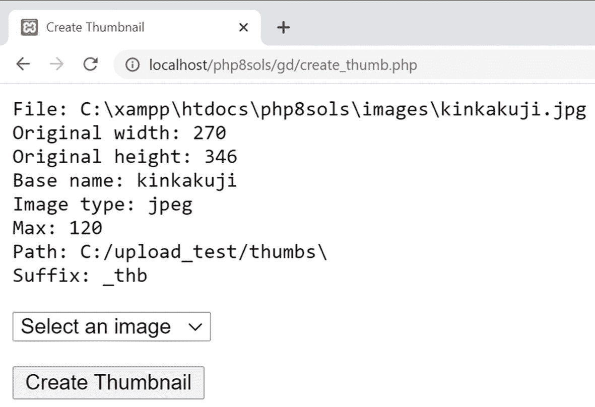
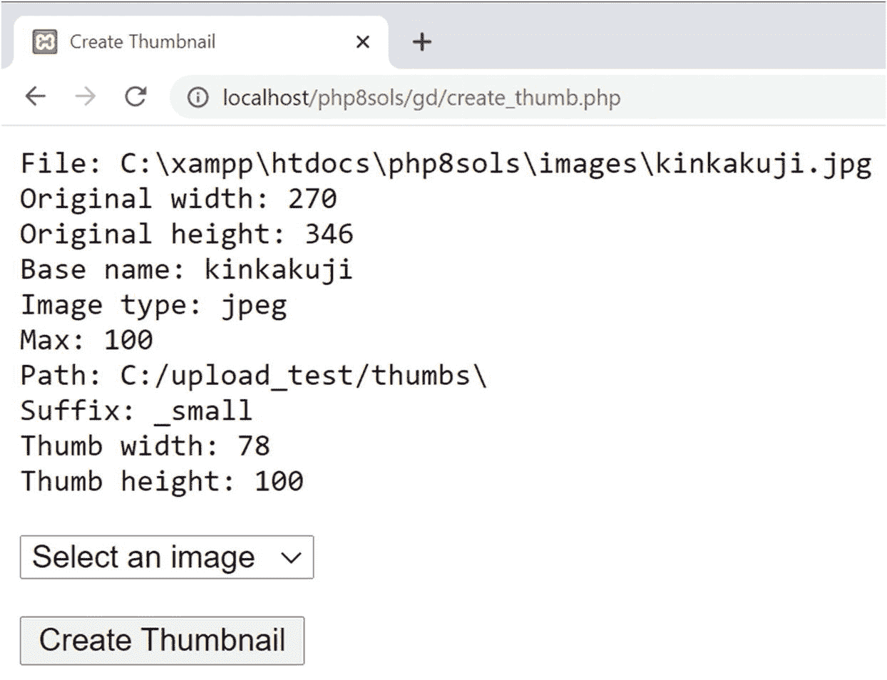

# 十、生成缩略图图像

PHP 有一系列广泛的用于处理图像的函数。你已经在第五章中见过其中之一`getimagesize()`。除了提供关于图像尺寸的有用信息，PHP 还可以通过调整图像大小或旋转图像来操作图像。它还可以在不影响原始文本的情况下动态添加文本，甚至可以动态创建图像。

为了让你对 PHP 图像操作有所了解，我将向你展示如何生成一个上传图像的较小副本。大多数情况下，你会希望使用一个专门的图形程序，如 Adobe Photoshop，来生成缩略图，因为它会给你更好的质量控制。然而，如果您希望允许注册用户上传图像，同时确保它们符合最大尺寸，使用 PHP 自动生成缩略图会非常有用。您可以只保存调整大小后的副本，也可以将副本与原件一起保存。

在前一章中，您构建了一个 PHP 类来处理文件上传。在这一章中，你将创建两个类:一个用于生成缩略图，另一个用于在一次操作中上传和调整图像大小。你可以基于第九章的`Upload`类来构建第二个类，而不是从零开始。使用类的一个很大的优点是它们是**可扩展的**——基于另一个类的类可以继承其父类的功能。构建上传图像并从中生成缩略图的类需要大量代码。但是一旦定义了类，使用它们只需要几行脚本。如果你很急，或者写了很多代码让你出了一身冷汗，你可以只使用完成的类。稍后回来学习代码是如何工作的。它使用了许多基本的 PHP 函数，您会发现这些函数在其他情况下也很有用。

在本章中，您将了解以下内容:

*   缩放图像

*   保存重新缩放的图像

*   自动调整上传图像的大小和重命名

*   通过扩展现有子类来创建子类

## 检查服务器的功能

在 PHP 中处理图像依赖于 gd 扩展。第二章中推荐的一体化 PHP 包默认支持 gd，但是你需要确保 gd 扩展也已经在你的远程 web 服务器上启用。和前面的章节一样，在您的网站上运行`phpinfo()`来检查服务器的配置。向下滚动，直到看到下面截图中显示的部分(应该在页面的中间位置):


如果你找不到这个部分，说明 gd 扩展没有启用，所以你不能在你的网站上使用本章的任何脚本。请求将其启用或移动到不同的主机。

不要忘记删除运行`phpinfo()`的文件，除非它在有密码保护的目录中。

## 动态处理图像

gd 扩展允许您完全从头开始生成图像或使用现有图像。无论哪种方式，基本流程总是遵循四个基本步骤:

1.  在处理过程中，在服务器内存中为图像创建一个资源。

2.  处理图像。

3.  显示和/或保存图像。

4.  从服务器内存中删除图像资源。

这个过程意味着你总是只处理内存中的图像，而不是原始图像。除非在脚本终止前将图像保存到磁盘，否则任何更改都将被丢弃。处理图像通常需要大量内存，因此一旦不再需要图像资源，就将其销毁是至关重要的。如果脚本运行缓慢或崩溃，这可能表明原始图像太大。

### 制作图像的较小副本

本章的目的是告诉你如何在上传时自动调整图片的大小。这涉及到从第九章扩展`Upload`类。然而，为了更容易理解如何使用 PHP 的图像操作函数，我建议从使用服务器上已经存在的图像开始，然后创建一个单独的类来生成缩略图。

#### 准备好

起点是下面这个简单的表单，它使用 PHP Solution 7-3 创建了一个`images`文件夹中图片的下拉菜单。你可以在`ch10`文件夹的`create_thumb_01.php`中找到代码。将其复制到`php8sols`站点根目录下名为`gd`的新文件夹中，并将其重命名为`create_thumb.php`。

页面正文中的表单如下所示:

```php
<form method="post" action="create_thumb.php">
    <p>
        <select name="pix" id="pix">
            <option value="">Select an image</option>
            <?php
            $files = new FilesystemIterator('../images');
            $images = new RegexIterator($files, '/\.(?:jpg|png|gif|webp)$/i');
            foreach ($images as $image) { ?>
                <option value="<?= $image->getRealPath() ?>">
                    <?= $image->getFilename() ?></option>
            <?php } ?>
        </select>
    </p>
    <p>
        <input type="submit" name="create" value="Create Thumbnail">
    </p>
</form>

```

当加载到浏览器中时，下拉菜单应该显示`images`文件夹中图片的名称。这使得快速挑选图像进行测试变得更加容易。通过调用`SplFileInfo getRealPath()`方法，每个图像的完全限定路径被插入到`<option>`标签的`value`属性中。

在你在第九章创建的`upload_test`文件夹中，创建一个名为`thumbs`的新文件夹，确保它有 PHP 写入的必要权限。如果您需要刷新记忆，请参考上一章中的“建立上传目录”。

#### 构建缩略图类

要生成缩略图，该类需要执行以下步骤:

1.  获取原始图像的尺寸。

2.  获取图像的 MIME 类型。

3.  计算缩放比例。

4.  为原始图像创建正确 MIME 类型的图像资源。

5.  为缩略图创建图像资源。

6.  创建调整大小的副本。

7.  使用正确的 MIME 类型将调整后的副本保存到目标文件夹。

8.  销毁图像资源以释放内存。

除了生成缩略图之外，该类还自动在文件扩展名前插入`_thb`,但是构造函数方法的一个可选参数允许您更改该值。另一个可选参数设置缩略图的最大大小。为了简化计算，最大尺寸仅控制缩略图的较大尺寸。

为了避免命名冲突，`Thumbnail`类将使用一个名称空间。因为它专门用于图像，我们将在`Php8Solutions`文件夹中创建一个名为`Image`的新文件夹，并使用`Php8Solutions\Image`作为名称空间。

有很多事情要做，所以我将代码分成几个部分。它们都是同一个类定义的一部分，但是以这种方式表示脚本应该更容易理解，特别是如果您想在不同的上下文中使用一些代码。

#### PHP 解决方案 10-1:获取图像细节

这个 PHP 解决方案描述了如何获取原始图像的尺寸和 MIME 类型。

1.  在`Php8Solutions`文件夹中新建一个名为`Image`的文件夹。然后在文件夹中创建一个名为`Thumbnail.php`的页面。该文件将只包含 PHP，所以去掉编辑程序插入的任何 HTML 代码。

2.  在新文件的顶部声明命名空间:

1.  该类需要跟踪相当多的属性。通过列出它们来开始类定义，如下所示:

    ```php
    class Thumbnail {
        protected $original;
        protected $originalWidth;
        protected $originalHeight;
        protected $basename;
        protected $imageType;
        protected $messages = [];
    }

    ```

```php
namespace Php8Solutions\Image;

```

与在`Upload`类中一样，所有的属性都被声明为 protected，这意味着它们不能在类定义之外被意外地更改。这些名字是描述性的，所以不需要解释。

1.  构造函数有四个参数，其中两个是可选的。前两个必需的参数是图像的路径和创建缩略图的文件夹的路径。两个可选参数设置缩略图较长维度的最大大小和要添加到文件名的后缀。最后三个参数使用 PHP 8 的构造函数属性提升将它们设置为受保护的属性。将构造函数定义添加到上一步定义的属性列表之后，但在右花括号内:

    ```php
    public function __construct(
        string $image,
        protected string $path,
        protected int $max = 120,
        protected string $suffix = '_thb'
     ) {
       if (is_file($image) && is_readable($image)) {
           $dimensions = getimagesize($image);
       } else {
           throw new \Exception("Cannot open $image.");
       }
       if (!is_array($dimensions)) {
           throw new \Exception("$image doesn't appear to be an image.");
       } else {
           if ($dimensions[0] == 0) {
               throw new \Exception("Cannot determine size of $image.");
           }
           // check the MIME type
           if (!$this->checkType($dimensions['mime'])) {
               throw new \Exception('Cannot process that type of file.');
           }
       }
       if (is_dir($path) && is_writable($path)) {
           $this->path = rtrim($path, '/\\') . DIRECTORY_SEPARATOR;
       } else {
           throw new \Exception("Cannot write to $path.");
       }
       $this->original = $image;
       $this->originalWidth = $dimensions[0];
       $this->originalHeight = $dimensions[1];
       $this->basename = pathinfo($image, PATHINFO_FILENAME);
       $this->max = abs($max);
       if ($suffix != '_thb') {
           $this->suffix = $this->setSuffix($suffix) ?? '_thb';
       }
    }

    ```

    构造函数以一个条件语句开始，该语句检查`$image`是一个文件并且是可读的。如果是，则传递给`getimagesize()`，结果存储在`$dimensions`中。否则，将引发异常。如前一章所述，`Exception`前面有一个反斜杠，表示我们希望使用核心的`Exception`类，而不是为这个命名空间类定制一个类。

    当您将图像传递给`getimagesize()`时，它会返回一个包含以下元素的数组:

    *   `0`:宽度(以像素为单位)

    *   `1`:高度

    *   `2`:表示图像类型的整数

    *   `3`:包含正确宽度和高度属性的字符串，准备插入到``标签中

    *   `mime`:图像的 MIME 类型

    *   `channels` : `3`用于 RGB，`4`用于 CMYK 图像

    *   `bits`:每种颜色的位数

如果作为参数传递给`getimagesize()`的值不是图像，它返回`false`。因此，如果`$dimensions`不是一个数组，就会抛出一个异常，报告该文件看起来不是一个图像。但是如果`$dimensions`是一个数组，看起来我们好像在处理一个图像。但是`else`块在继续之前做了两个进一步的检查。

如果`$dimensions`数组中第一个元素的值为 0，则图像有问题，因此会抛出一个异常，报告图像的大小无法确定。下一个检查将报告的 MIME 类型传递给一个名为`checkType()`的内部方法，该方法将在下一步中定义。如果`checkType()`返回`false`，则抛出另一个异常。

下一个条件语句使用与 PHP 解决方案 9–2 中相同的技术来检查将在其中创建缩略图的文件夹是否存在以及是否可写，删除任何尾随斜线并连接操作系统的适当目录分隔符。

如果图像或文件夹有问题，这一系列异常会阻止任何进一步的处理。假设脚本到此为止，图像的路径存储在`$original`属性中，其宽度和高度分别存储在`$originalWidth`和`$originalHeight`中。

使用带有`PATHINFO_FILENAME`常量的`pathinfo()`提取不带文件扩展名的文件名，与 PHP 解决方案 9-5 中的方式相同。这存储在`$basename`属性中，将用于构建带有后缀的缩略图名称。

`$max`的值在分配给`$max`属性之前被传递给`abs()`函数。构造函数签名中的类型声明确保只接受整数，但是将值传递给`abs()`会在它为负数的情况下将其转换为正数。

最后的条件语句检查作为`$suffix`提供的参数是否不同于默认值。如果是，它将被传递给我们稍后将定义的`setSuffix()`方法。这会返回一个字符串或`null`。如果返回值是一个字符串，它被赋给`$suffix`属性。但是如果是`null`，空合并操作符(参见第四章中的“使用空合并操作符设置默认值”)会将默认值重新分配给属性。

1.  `checkType()`方法将 MIME 类型与一组可接受的图像类型进行比较。如果找到匹配，它将类型存储在`$imageType`属性中并返回`true`。否则返回`false`。该方法在内部使用，因此需要声明为 protected。将以下代码添加到类定义中:

    ```php
    protected function checkType($mime) {
        $mimetypes = ['image/jpeg', 'image/png', 'image/gif', 'image/webp'];
        if (in_array($mime, $mimetypes)) {
            // extract the characters after '/'
            $this->imageType = substr($mime, strpos($mime, '/')+1);
            return true;
        }
        return false;
    }

    ```

浏览器普遍支持 JPEG、PNG、GIF 我还包括了 WebP，因为它现在得到了广泛的支持。所有图像 MIME 类型都以`image/`开头。为了让这个值以后更容易使用，`substr()`函数提取斜杠后的字符，并将它们存储在`$imageType`属性中。当与两个参数一起使用时，`substr()`从第二个参数中指定的位置(从 0 开始计数)开始，并返回字符串的其余部分。我没有使用一个固定的数字作为第二个参数，而是使用了`strpos()`函数来找到斜线的位置并加 1。这使得代码更加通用，因为一些专有的图像格式以`application/`而不是`image/`开头。`strpos()`的第一个参数是要搜索的整个字符串，第二个参数是要搜索的字符串。

1.  `setSuffix()`方法需要确保该值不包含任何特殊字符。代码如下所示:

    ```php
    protected function setSuffix($suffix) {
        if (preg_match('/^\w+$/', $suffix)) {
            if (!str_starts_with($suffix, '_')) {
                return '_' . $suffix;
            } else {
                return $suffix;
            }
        }
    }

    ```

这使用了`preg_match()`，它将一个正则表达式作为第一个参数，并在作为第二个参数传递的值中搜索匹配项。正则表达式需要包含在一对匹配的分隔符中——通常是正斜杠，就像这里使用的一样。去掉分隔符后，正则表达式如下所示:

```php
^\w+$

```

在这个上下文中，插入符号(`^`)告诉正则表达式从字符串的开头开始。`\w`是匹配任何字母数字字符或下划线的正则表达式标记。`+`表示匹配前面的符号或字符一次或多次，`$`表示匹配字符串的末尾。换句话说，正则表达式匹配只包含字母数字字符和下划线的字符串。如果字符串包含空格或特殊字符，它将不会匹配。

如果匹配失败，默认的$suffix 属性保持不变。否则，将执行以下条件语句:

```php
if (!str_starts_with($suffix, '_') ) {

```

如果`$suffix`的第一个字符是*而不是*下划线，则该条件等同于`true`。它使用了 PHP 8 新增的`str_starts_with()`函数。顾名思义，它检查字符串的第一个字符。因此，如果后缀不是以下划线开头，就会添加一个下划线。否则，将保留原始值。在任一情况下，都会传回值。

但是，如果提供给构造函数的参数包含除字母数字字符和下划线之外的任何字符，条件语句将失败，并且该方法将不返回任何内容—换句话说，`null`。

1.  在构建类时测试代码是一个好主意。及早发现错误比在长脚本中寻找问题要容易得多。为了测试代码，在类定义中创建一个名为`test()`的新公共方法。

方法在类定义中出现的顺序并不重要，但通常的做法是将所有公共方法放在构造函数之后，并将受保护的方法放在文件的底部。这使得代码更容易维护。

在构造函数和`checkType()`定义之间插入以下定义:

```php
public function test() {
    $values = <<<END
    <pre>
    File: $this->original
    Original width: $this->originalWidth
    Original height: $this->originalHeight
    Base name: $this->basename
    Image type: $this->imageType
    Max: $this->max
    Path: $this->path
    Suffix: $this->suffix
    </pre>
    END;
    echo $values;
    if ($this->messages) {
        print_r($this->messages);
    }
}

```

这使用带有 heredoc 语法的`echo`(参见第四章中的“避免使用 Heredoc 语法转义引号的需要”)和`print_r()`来显示属性的值。虽然输出中没有引号，但是使用 heredoc 语法和

1.  为了测试到目前为止的类定义，保存`Thumbnail.php`并将以下代码添加到`create_thumb.php`中`DOCTYPE`声明上方的 PHP 块中(代码可以在`ch10`文件夹的`create_thumb_02.php`中找到):

    ```php
    use Php8Solutions\Image\Thumbnail;
        if (isset($_POST['create'])) {
            require_once('../Php8Solutions/Image/Thumbnail.php');
            try {
                $thumb = new Thumbnail($_POST['pix'] ,
                    'C:/upload_test/thumbs', suffix: '$%^');
                $thumb->test();
            } catch (Throwable $t) {
                echo $t->getMessage();
            }
    }

    ```

```php
 tags makes both the code and the output easier to read.
```

这将从`Php8Solutions\Image`名称空间导入`Thumbnail`类，然后添加提交表单时要执行的代码。

`create_thumb.php`中提交按钮的`name`属性是`create`，所以这段代码只在表单提交后运行。它包括`Thumbnail`类定义；创建类的一个实例，将窗体中的选定值和路径传递到 thumbs 文件夹(根据需要进行调整以匹配您自己的设置)，并为有意使用非字母数字字符的后缀传递一个命名参数。然后调用`test()`方法。

`catch`块使用`Throwable`作为类型声明，因此它将处理内部 PHP 错误和由`Thumbnail`类抛出的异常。



图 10-1

显示所选图像的细节确认代码正在工作

1.  保存`create_thumb.php`并将其加载到浏览器中。选择一个图像，然后单击“创建缩略图”。这产生类似于图 10-1 的输出。

Note

图 10–1 是在 Windows 上拍摄的，所以`DIRECTORY_SEPARATOR`常量在路径后面附加了一个反斜杠。这没什么区别，因为 PHP 接受 Windows 路径中的正斜杠和反斜杠。

请注意，默认后缀已经替换了包含非字母数字字符的后缀。

1.  使用不同的后缀值再次测试脚本，仅使用字母数字字符，以下划线开头或不加下划线。另外，尝试为`$max`属性设置不同的大小。

如有必要，对照`ch10/Php8Solutions/Images`文件夹中的`Thumbnail_01.php`检查您的代码。

Caution

`$_POST['pix']`的值被直接传递给`test()`方法，因为它直接来自我们自己的表单。在生产环境中，您应该总是检查从表单接收的值。例如，使用`basename()`只提取文件名并指定允许的目录。

尽管有些属性有默认值，但您需要提供选项来更改缩略图的最大尺寸和应用于文件名基础的后缀。您还需要告诉全班在哪里创建缩略图。

#### PHP 解决方案 10-2:计算缩略图的尺寸

这个 PHP 解决方案向`Thumbnail`类添加了一个受保护的方法，该方法将计算缩略图的尺寸。在`$maxSize`属性中设置的值决定了宽度或高度，这取决于哪个更大。为了避免扭曲缩略图，您需要计算较短尺寸的缩放比例。该比率是通过将最大缩略图尺寸除以原始图像的较大尺寸来计算的。

比如金阁(`kinkakuji.jpg`)原图是 270 × 346 像素。如果最大大小设置为 120，用 120 除以 346 得到的缩放比例为 0.3468。将原始图像的宽度乘以该比率会将缩略图的宽度固定为 94 像素(向上舍入为最接近的整数)，从而保持正确的比例。图 10-2 显示了缩放比例是如何工作的。


图 10-2

计算缩略图的缩放比例

继续使用现有的类定义。或者，使用`ch10/Php8Solutions/Image`文件夹中的`Thumbnail_01.php`。

1.  计算缩略图尺寸不需要任何进一步的用户输入，因此可以通过受保护的方法来处理。将以下代码添加到类定义中。

    ```php
    protected function calculateRatio() {
        if ($this->originalWidth <= $this->max &&
            $this->originalHeight <= $this->max) {
            return 1;
        } elseif ($this->originalWidth > $this->originalHeight) {
            return $this->max/$this->originalWidth;
        } else {
           return $this->max/$this->originalHeight;
        }
    }

    ```

条件语句首先检查原始图像的宽度和高度是否小于或等于最大尺寸。如果是，则不需要调整图像的大小，因此该方法返回的缩放比例为 1。

`elseif`块检查宽度是否大于高度。如果是，宽度用于计算缩放比例。如果高度大于或两边相等，则调用`else`块。在任一情况下，高度都用于计算缩放比例。

1.  为了测试新方法，修改`test()`方法如下:

    ```php
    public function test() {
        $ratio = $this->calculateRatio();
        $thumbWidth = round($this->originalWidth * $ratio);
        $thumbHeight = round($this->originalHeight * $ratio);
        $values = <<<END
        <pre>
        File: $this->original
        Original width: $this->originalWidth
        Original height: $this->originalHeight
        Base name: $this->basename
        Image type: $this->imageType
        Destination: $this->path
        Max size: $this->maxSize
        Suffix: $this->suffix
        Thumb width: $thumbWidth
        Thumb height: $thumbHeight
        </pre>
        END;
        // Remove the indentation of the preceding line in < PHP 7.3
        echo $values;
        if ($this->messages) {
            print_r($this->messages);
        }
    }

    ```

这将调用新方法。得到的缩放比例然后用于计算缩略图的宽度和高度。计算结果传递给`round()`函数，将结果转换为最接近的整数。计算需要从`test()`方法中移除，但是首先检查我们是否得到了预期的结果是很重要的。



图 10-3

该类现在正在生成创建缩略图所需的所有值

1.  通过选择`create_thumb.php`中的图像并点击`Create Thumbnail`来测试更新的类。你应该看到屏幕上显示的数值，如图 10-3 所示。尝试缩略图最大尺寸的不同值。

如有必要，对照`ch10`文件夹中的`Thumbnail_02.php`检查您的代码。

#### 使用 gd 函数创建图像的缩放副本

收集了所有必要的信息后，您可以从较大的图像生成缩略图。这包括为原始图像和缩略图创建图像资源。对于原始图像，您需要使用与图像的 MIME 类型相匹配的函数。以下每个函数都有一个参数，即文件的路径:

*   `imagecreatefromjpeg()`

*   `imagecreatefrompng()`

*   `imagecreatefromgif()`

*   `imagecreatefromwebp()`

因为缩略图还不存在，所以使用不同的函数`imagecreatetruecolor()`，它有两个参数——宽度和高度(以像素为单位)。

还有一个函数创建一个图像的大小调整副本:`imagecopyresampled()`。这至少需要十个参数——所有参数都是必需的。这些参数分为五对，如下所示:

*   对两个图像资源的引用—首先是副本，其次是原件

*   复制图像左上角位置的`x`和`y`坐标

*   原稿左上角的`x`和`y`坐标

*   副本的宽度和高度

*   要从原件复制的区域的宽度和高度

图 10-4 显示了最后四对参数如何用于提取特定区域，使用以下参数到`imagecopyresampled()`:


图 10-4

imagecopyresampled()函数允许你复制图像的一部分

```php
imagecopyresampled($thumb, $source, 0, 0, 170, 20, $thbwidth,$thbheight, 170, 102);

```

要复制的区域的`x`和`y`坐标以像素为单位，从图像的左上角开始测量。x 轴和 y 轴从左上角的 0 开始，向右下方增加。通过将要复制的区域的宽度和高度分别设置为 170 和 102，PHP 提取出白色轮廓的区域。

现在你知道网站是如何处理上传的图片的了。他们使用 JavaScript 或其他技术动态计算坐标。对于`Thumbnail`类，您将使用整个原始图像来生成缩略图。

使用`imagecopyresampled()`创建副本后，您需要保存它，再次使用特定于 MIME 类型的函数，即:

*   `imagejpeg()`

*   `imagepng()`

*   `imagegif()`

*   `imagewebp()`

每个函数的前两个参数是图像资源和保存它的路径。

`imagejpeg()`、`imagepng()`和`imagewebp()`函数采用可选的第三个参数来设置图像质量。对于`imagejpeg()`和`imagewebp()`，您可以在 0(最差)到 100(最好)的范围内指定一个数字来设置质量。如果省略该参数，默认情况下`imagejpeg()`为 75，`imagewebp()`为 80。对于`imagepng()`，范围是 0–9。令人困惑的是，0 产生最佳质量(无压缩)。

最后，一旦保存了缩略图，就需要通过将它们传递给`imagedestroy()`来销毁图像资源。尽管其名称具有破坏性，但该功能对原始图像或缩略图没有任何影响。它只是通过销毁处理过程中所需的图像资源来释放服务器内存。

#### PHP 解决方案 10-3:生成缩略图

这个 PHP 解决方案通过创建图像资源、复制缩略图并将其保存在目标文件夹中来完成`Thumbnail`类。

继续使用现有的类定义。或者，使用`ch10/Php8Solutions/Image`文件夹中的`Thumbnail_02.php`。

1.  现在我们已经验证了该类正在计算正确的值来生成缩略图，我们可以重命名`test()`方法并删除显示结果的代码。将该方法的名称改为`create()`，并删除除前三行之外的所有内容。你应该留下这个:

    ```php
    public function create() {
        $ratio = $this->calculateRatio();
        $thumbWidth = round($this->originalWidth * $ratio);
        $thumbHeight = round($this->originalHeight * $ratio);
    }

    ```

2.  原始图像的图像资源需要特定于它的 MIME 类型，因此创建一个内部方法来选择正确的类型。将以下代码添加到类定义中:

    ```php
    protected function createImageResource() {
        switch ($this->imageType) {
            case 'jpeg':
                return imagecreatefromjpeg($this->original);
            case 'png':
                return imagecreatefrompng($this->original);
            case 'gif':
                return imagecreatefromgif($this->original);
            case 'webp':
                return imagecreatefromwebp($this->original);
        }
    }

    ```

您在 PHP 解决方案 10-1 中创建的`checkType()`方法将 MIME 类型存储为`jpeg`、`png`、`gif`或`webp`。因此，`switch`语句检查 MIME 类型，将其与适当的函数匹配，并将原始图像作为参数传递。然后，该方法返回结果图像资源。

1.  `create()`方法需要两个图像资源:一个用于原始图像，另一个用于缩略图。像这样更新`create()`方法:

    ```php
    public function create() {
        $ratio = $this->calculateRatio();
        $thumbWidth = round($this->originalWidth * $ratio);
        $thumbHeight = round($this->originalHeight * $ratio);
        $resource = $this->createImageResource();
        $thumb = imagecreatetruecolor($thumbWidth, $thumbHeight);
    }

    ```

这将调用您在步骤 2 中创建的`createImageResource()`方法，然后为缩略图创建一个图像资源，将缩略图的宽度和高度传递给`imagecreatetruecolor()`。

1.  创建缩略图的下一个阶段包括将两个图像资源传递给`imagecopyresampled()`并设置坐标和尺寸。将下面一行代码添加到`create()`方法中:

```php
imagecopyresampled($thumb, $resource, 0, 0, 0, 0, $thumbWidth, $thumbHeight,
$this->originalWidth, $this->originalHeight);

```

前两个参数是您刚刚为缩略图和原始图像创建的图像资源。接下来的四个参数将副本和原件的`x`和`y`坐标设置为左上角。接下来是为缩略图计算的宽度和高度，接着是原始图像的宽度和高度。将参数 3–6 设置为左上角，并将两组尺寸设置为最大值，会将整个原始图像复制到整个缩略图。换句话说，它创建了原始文件的一个较小的副本。

你不需要把`imagecopyresampled()`的结果赋给一个变量。缩小后的图像现在存储在`$thumb`中，但是您仍然需要保存它。

1.  像这样完成`create()`的定义:

    ```php
    public function create() {
        $ratio = $this->calculateRatio();
        $thumbWidth = round($this->originalWidth * $ratio);
        $thumbHeight = round($this->originalHeight * $ratio);
        $resource = $this->createImageResource();
        $thumb = imagecreatetruecolor($thumbWidth, $thumbHeight);
        imagecopyresampled($thumb, $resource, 0, 0, 0, 0, $thumbWidth,
            $thumbHeight, $this->originalWidth, $this->originalHeight);
        $newname = $this->basename . $this->suffix;
        switch ($this->imageType) {
            case 'jpeg':
                $newname .= '.jpg';
                $success = imagejpeg($thumb, $this->path . $newname);
                break;
            case 'png':
                $newname .= '.png';
                $success = imagepng($thumb, $this->path . $newname);
                break;
            case 'gif':
                $newname .= '.gif';
                $success = imagegif($thumb, $this->path . $newname);
                break;
            case 'webp':
                $newname .= '.webp';
                $success = imagewebp($thumb, $this->path . $newname);
                break;
        }
        if ($success) {
            $this->messages[] = "$newname created successfully.";
        } else {
            $this->messages[] = "Couldn't create a thumbnail for " .
                basename($this->original);
        }
        imagedestroy($resource);
        imagedestroy($thumb);
    }

    ```

新代码的第一行将后缀连接到去掉了文件扩展名的文件名。所以，如果原始文件被称为`menu.jpg`，并且使用默认的`_thb`后缀，`$newname`就变成了`menu_thb`。

`switch`语句检查图像的 MIME 类型并附加适当的文件扩展名。在`menu.jpg`的情况下，`$newname`变成了`menu_thb.jpg`。缩小的图像然后被传递到适当的函数来保存它，使用目标文件夹和`$newname`作为保存它的路径。我省略了 JPEG、PNG 和 WebP 图像的可选质量参数。默认质量对于缩略图应该足够了。

保存操作的结果存储在`$success`中。根据结果，`$success`或者是`true`或者是`false`，一个适当的消息被添加到`$messages`属性中。消息是使用`basename()`函数而不是`$basename`属性创建的，因为文件扩展名已经从属性中去除，而函数保留了它。

最后，`imagedestroy()`通过销毁用于创建缩略图的资源来释放服务器内存。

1.  到目前为止，您已经使用了`test()`方法来显示错误消息。创建一个公共方法来获取消息:

    ```php
    public function getMessages() {
        return $this->messages;
    }

    ```

2.  保存`Thumbnail.php`。在`create_thumb.php`中，用对`create()`的调用替换对`test()`方法的调用。也调用`getMessages()`并将结果赋给一个变量，就像这样:

    ```php
    $thumb->create();
        $messages = $thumb->getMessages();

    ```

3.  在开始的`<body>`标签后添加一个 PHP 代码块来显示任何消息:

    ```php
    <?php
    if (!empty($messages)) {
        echo '<ul>';
        foreach ($messages as $message) {
            echo "<li>$message</li>";
        }
        echo '</ul>';
    }
    ?>

    ```

您已经在前面的章节中看到了这段代码，所以它不需要解释。

保存`create_thumb.php`，将其加载到浏览器中，并通过从列表中选择图像并单击创建缩略图来进行测试。如果一切顺利，你应该会看到一条消息报告缩略图的创建，你可以确认它存在于`upload_test`的`thumbs`子文件夹中，如图 10-5 所示。


图 10-5

缩略图已在目标文件夹中成功创建

1.  如果缩略图没有创建，那么由`Thumbnail`类生成的错误消息应该可以帮助您检测问题的根源。同样，对照`ch10/Php8Solutions/Image`文件夹中的`Thumbnail_03.php`仔细检查你的代码。如果之前的 PHP 解决方案中的测试有效，那么错误很可能出现在`create()`、`createImageResource()`或`createThumbnail()`方法定义中。当然，另一个需要检查的地方是您的 PHP 配置。该类依赖于正在启用的 gd 扩展。虽然 gd 得到了广泛的支持，但它并不总是默认开启。

## 上传时自动调整图像大小

现在你已经有了一个从更大的图像创建缩略图的类，修改第九章中的`Upload`类来从上传的图像生成缩略图就相对简单了——事实上，不仅从单幅图像，也从多幅图像。

与其更改`Upload`类中的代码，不如扩展该类并创建一个子类更有效。然后，您可以选择使用原始类来上传任何类型的文件，或者使用子类来在上传时创建缩略图。子类还需要提供在缩略图创建后保存或丢弃大图的选项。

在深入研究代码之前，让我们快速看一下如何创建一个子类。

### 扩展一个类

在“PHP 解决方案 8-8:自动构建嵌套列表”中，我们看到了一个扩展内置类`RecursiveIteratorIterator`的例子扩展一个类的好处是，新的**子类**或**子类**继承了其父类的所有特性，包括属性和方法，但可以修改(或**覆盖**)其中一些特性并获得自己的新特性。这简化了创建一个类来执行更专门化的任务的过程。你在第九章创建的`Upload`类执行基本的文件上传。在这一章中，你将扩展它来创建一个名为`ThumbnailUpload`的子类，它使用其父类的基本上传功能，但是增加了创建缩略图的特殊功能。子类将被创建在`Php8Solutions/Image`文件夹中，所以它将使用`Php8Solutions\Image`作为它的名称空间。

像所有的子类一样，子类通常需要向父类借用。当您在子类中重写一个方法但又需要使用原始版本时，这种情况经常发生。要引用父版本，您可以在它前面加上关键字`parent`，后跟两个冒号，如下所示:

```php
parent::originalMethod();

```

你将在 PHP 解决方案 10-4 中看到这是如何工作的，因为子类定义了自己的构造函数来添加额外的参数，但也需要使用父构造函数。

让我们创建一个能够同时上传图像和生成缩略图的类。

#### PHP 解决方案 10-4:创建缩略图上传类

这个 PHP 解决方案扩展了第九章中的`Upload`类，并将其与`Thumbnail`类结合使用来上传和调整图像大小。它演示如何创建子类并重写父方法。要创建子类，你需要第九章的和本章的`Thumbnail.php`。在`ch09/Php8Solutions/File`和`ch10/Php8Solutions/Image`文件夹中分别有这些文件的副本。

1.  在`Php8Solutions/Image`文件夹中新建一个名为`ThumbnailUpload` `.php`的文件。它将只包含 PHP 代码，所以去掉脚本编辑器插入的任何 HTML，并添加以下代码:

    ```php
    <?php
    namespace Php8Solutions\Image;
    use Php8Solutions\File\Upload;
    require_once __DIR__ . '/../File/Upload.php';
    require_once 'Thumbnail.php';
    class ThumbnailUpload extends Upload {
    }

    ```

这将声明`Php8Solutions\Image`名称空间，并在包含`Upload`和`Thumbnail`类的定义之前，从`Php8Solutions\File`名称空间导入`Upload`类。

Note

在包含文件中使用时，`__DIR__`返回包含文件的目录，不带尾随斜杠。在`Upload.php`的相对路径的开头添加斜杠，允许 PHP 构建一个完整的路径，向上移动一级，在`Php8Solutions/File`文件夹中找到它。`Thumbnail.php`与`ThumbnailUpload.php`在同一个文件夹中，所以只使用文件名来包含它。参见第五章中的“嵌套包含文件”。

然后，`ThumbnailUpload`类声明它扩展了`Upload`。虽然`Upload`在不同的名称空间中，但是您可以简单地将其称为`Upload`，因为它已经被导入。所有后续代码都需要插入到类定义的花括号之间。

1.  当您扩展一个类时，您唯一需要定义构造函数方法的时候就是您想要改变构造函数的工作方式的时候。`ThumbnailUpload`类总共有七个参数，其中大部分是可选的。在本地测试时，一个`Thumbnail`对象可以访问你自己硬盘上的原始映像。然而，生成缩略图是一项服务器端操作，因此如果不先将原始图像上传到服务器，它就不能在网站上工作。因此，构造函数的前三个参数与`Upload`类的相同:图像输入字段(`$field`)、图像上传位置的路径(`$path`)和上传图像的最大文件大小(`$max`)。其余参数设置与缩略图相关的值。所有参数前面都有一个可见性声明，使用 PHP 8 的构造函数属性提升来自动使它们成为受保护的类属性。构造函数如下所示:

    ```php
    public function __construct(
        protected string $field,
        protected string $path,
        protected int $max = 51200,
        protected int $maxDimension = 120,
        protected string $suffix = '_thb',
        protected ?string $thumbPath = null,
        protected bool $deleteOriginal = false,
    ) {
        $this->thumbPath = $thumbPath ?? $path;
        if (is_dir($this->thumbPath) && is_writable($this->thumbPath)) {
            $this->thumbPath = rtrim($this->thumbPath, '/\\') .
                DIRECTORY_SEPARATOR;
        } else {
            throw new \Exception("$this->thumbPath must be a valid,
                writable directory.");
       }
       parent::__construct(
           $this->field,
           $this->path,
           $this->max
       );
    }

    ```

最后五个参数都有默认值，所以它们是可选参数。`$maxDimension`的值设置缩略图较大尺寸的最大尺寸。这个值也在`Thumbnail`类中设置。这里重复了一遍，这样你可以在上传图片和生成缩略图的时候覆盖它。`$suffix`参数也是如此。

`$thumbPath`参数前面是可空类型声明，这意味着该值必须是字符串或`null`。构造函数体中的第一行使用零合并运算符(？？)将值赋给`$thumbPath`属性。如果传递给构造函数的值是`null`，则使用`$path`的值，在与上传图像相同的目录中创建缩略图。

最后一个参数`$deleteOriginal`是一个布尔值，它确定在创建缩略图后是否应该删除全尺寸图像。默认情况下，它被设置为`false`，保留图像。

构造函数体中的条件语句使用与 PHP 解决方案 9–2 中相同的技术来检查将在其中创建缩略图的文件夹是否存在以及是否可写，删除任何尾随斜线并为操作系统连接适当的目录分隔符。

最后，构造函数使用`parent`关键字调用`Upload`构造函数，向其传递文件输入字段的名称、上传文件夹的路径和最大上传大小。实际上，在调用父构造函数上传全尺寸版本之前，扩展类的构造函数初始化上传全尺寸图像和生成缩略图所需的所有类属性。

1.  在父类中，`moveFile()`方法将上传的文件保存到它的目标位置。缩略图需要从原始图像中生成，因此您需要覆盖父方法的`moveFile()`并使用它来调用一个新的受保护的方法`createThumbnail()`，稍后您将定义这个方法。从`Upload.php`复制`moveFile()`方法，并通过添加粗体突出显示的代码进行修改:

    ```php
    protected function moveFile($file) {
        $filename = $this->newName ?? $file['name'];
        $success = move_uploaded_file($file['tmp_name'],
            $this->path . $filename);
        if ($success) {
            // add a message only if the original image is not deleted
            if (!$this->deleteOriginal) {
                $result = $file['name'] . ' was uploaded successfully';
                if (!is_null($this->newName)) {
                    $result .= ', and was renamed ' . $this->newName;
                }
                $this->messages[] = $result;
            }
            // create a thumbnail from the uploaded image
            $this->createThumbnail($this->path . $filename);
            // delete the uploaded image if required
            if ($this->deleteOriginal) {
                unlink($this->path . $filename);
            }
        } else {
            $this->messages[] = 'Could not upload ' . $file['name'];
        }
    }

    ```

如果原始图像已经成功上传，新代码将添加一个条件语句，以便仅在`$deleteOriginal`为`false`时生成消息。然后它调用`createThumbnail()`方法，将上传的图像作为参数传递给它。最后，如果`$deleteOriginal`已经被设置为`true`，它使用`unlink()`删除上传的图像，只留下缩略图。

1.  生成缩略图的受保护方法如下所示:

    ```php
    protected function createThumbnail($image) {
        $thumb = new Thumbnail($image, $this->thumbPath,
            $this->maxDimension, $this->suffix);
        $thumb->create();
        $messages = $thumb->getMessages();
        $this->messages = array_merge($this->messages, $messages);
    }

    ```

它接受一个参数，即图像的路径，并创建一个`Thumbnail`对象，将所有四个参数传递给`Thumbnail`构造函数:图像的路径、创建缩略图的路径、较大维度的最大大小以及附加到文件名的后缀。然后，它调用`Thumbnail`对象上的`create()`和`getMessages()`方法来生成新图像，并获取作为结果创建的任何消息。

最后一行使用`array_merge()`将由`Thumbnail`对象生成的消息与`ThumbnailUpload`类的`$message`属性合并。虽然`ThumbnailUpload`类没有定义自己的`$messages`属性，但是子类自动从其父类继承它。

1.  保存`ThumbnailUpload.php`。为了测试它，将`create_thumb_upload_01.php`从`ch10`文件夹复制到`gd`文件夹，并保存为`create_thumb_upload.php`。该文件包含一个简单的表单，带有一个文件字段和一个显示消息的 PHP 块。在`DOCTYPE`声明上方添加以下 PHP 代码块:

    ```php
    <?php
    use Php8Solutions\Image\ThumbnailUpload;
    if (isset($_POST['upload'])) {
        require_once('../Php8Solutions/Image/ThumbnailUpload.php');
        try {
            $loader = new ThumbnailUpload('image', 'C:/upload_test/',
                thumbPath: 'C:/upload_test/thumbs');
            $messages = $loader->getMessages();
        } catch (Throwable $t) {
            echo $t->getMessage();
        }
    }
    ?>

    ```

这个例子向`ThumbnailUpload`构造函数提供了三个参数。前两个是必需的:文件输入字段名称和要上传全尺寸图像的文件夹的路径。最后一个参数是 PHP 8 命名的参数，它指定缩略图文件的文件夹路径，跳过中间的参数并使用默认设置。如有必要，调整构造函数中的路径。


图 10-6

缩略图是在上传图像的同时创建的

1.  保存`create_thumb_upload.php`并将其载入浏览器。单击浏览或选择文件按钮并选择多个图像。当您单击上传按钮时，您应该会看到消息，通知您成功上传并创建了缩略图。检查目标文件夹，如图 10-6 所示。

1.  通过再次上传相同的图像来测试`ThumbnailUpload`类。这一次，原始图像和缩略图应该按照第九章中的相同方式进行重命名，即在文件扩展名前添加一个数字。

2.  尝试不同的测试，更改插入缩略图名称的后缀，或者在创建缩略图后删除原始图像。如果你遇到问题，对照`ch10/Php8Solutions/Image`文件夹中的`ThumbnailUpload.php`检查你的代码。

### 使用 ThumbnailUpload 类

`ThumbnailUpload`类很容易使用。因为它使用命名空间，所以在文件的顶层导入该类，如下所示:

```php
use Php8Solutions\Image\ThumbnailUpload;

```

然后包含类定义，并将输入字段的名称和上传文件夹的路径传递给类构造函数方法:

```php
$loader = new ThumbnailUpload('image', 'C:/upload_test/');

```

默认情况下，缩略图创建在与全尺寸图像相同的文件夹中；但是，您可以使用五个可选参数来更改各种默认值，或者按正确的顺序传递它们，或者使用命名参数。下列选项可用作命名参数:

*   `max`:以字节为单位设置全尺寸图像的最大尺寸。默认值为 51200，相当于 50 KB。

*   `maxDimension`:以像素为单位指定缩略图较大尺寸的最大尺寸。默认值为 120。

*   `suffix:`追加到缩略图的文件名。它只能包含字母数字字符和下划线。如果它不是以下划线开头，就会自动添加一个下划线。默认为`'_thb'`。

*   `thumbPath:`指定要创建缩略图的文件夹路径。默认设置是`null`，它会在与全尺寸图像相同的文件夹中创建缩略图。

*   `deleteOriginal:`确定创建缩略图后是否删除全尺寸图像。默认为`false`，因此保留原始图像。

该类还从父类`Upload`继承了以下方法:

*   `getMessages()`:检索上传生成的消息和缩略图。

*   `getMaxSize()`:获取单个图像的最大上传大小。默认值为 50 KB。

因为`ThumbnailUpload`类依赖于`Upload`和`Thumbnail`类，所以当在一个实时网站上使用这个类时，您需要将所有三个类定义文件上传到您的远程 web 服务器。

## 第三章回顾

这是另一个紧张的章节，不仅展示了如何从较大的图像生成缩略图，还向您介绍了扩展现有的类和重写继承的方法。设计和扩展类一开始可能会令人困惑，但是如果你把注意力集中在每个方法正在做的事情上，它会变得不那么可怕。类设计的一个关键原则是将大任务分解成小的、可管理的单元。理想情况下，一个方法应该执行一个任务，比如为原始图像创建图像资源。

使用类的真正好处是一旦你定义了它们，它们就能节省时间和精力。每次要向网站添加文件或缩略图上载功能时，不必键入几十行代码，调用该类只需要几行简单的代码。此外，不要认为本章中的代码专门用于创建和上传缩略图。类文件中的许多子程序可以在其他情况下使用。

在下一章中，您将了解 PHP 会话的所有内容，它保存与特定用户相关的信息，并在密码保护网页中发挥重要作用。