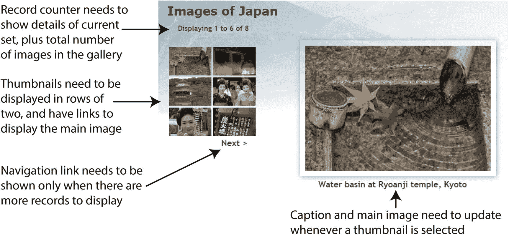
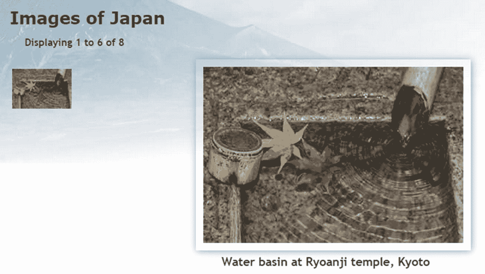
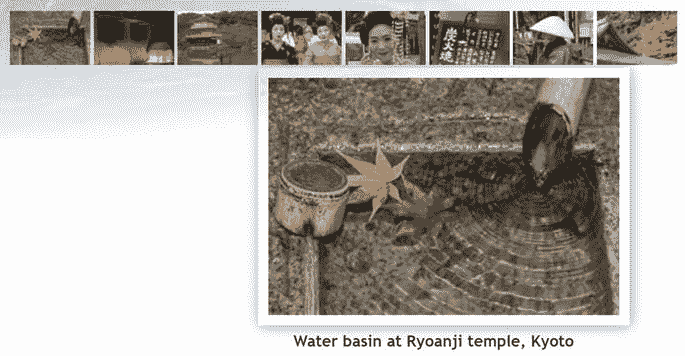
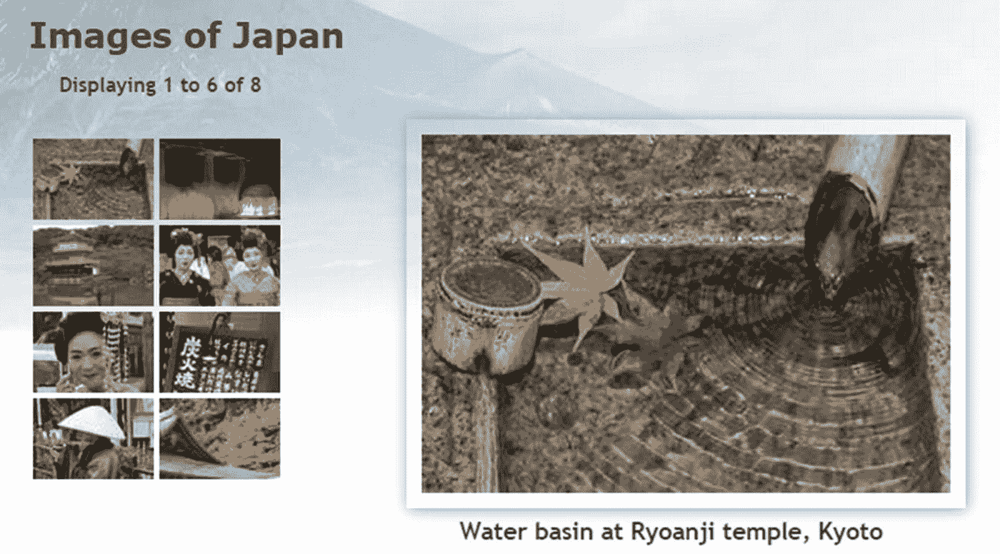
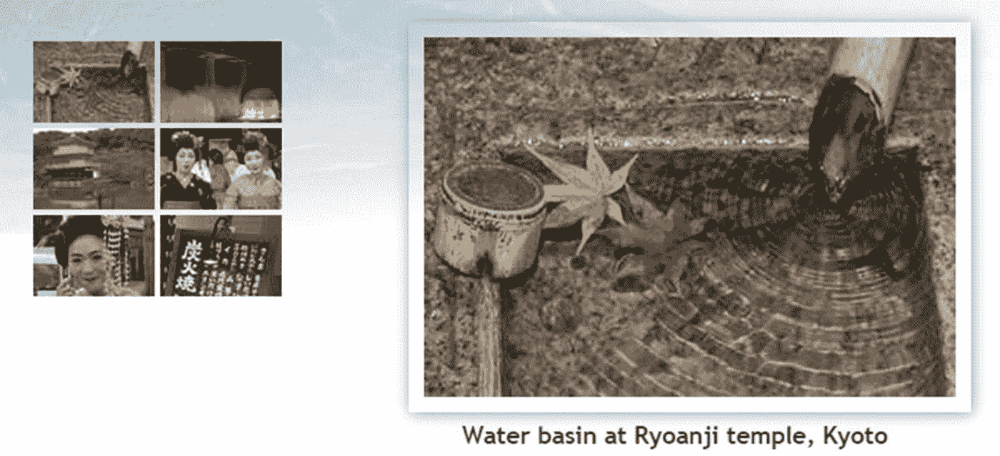

# 十四、创建动态图片库

前一章主要集中在将`images`表的内容提取为文本。本章基于这些技术来开发如图 [14-1](#Fig1) 所示的迷你图片库。


图 14-1

这个迷你图片库是通过从数据库中提取信息来驱动的

该图库还展示了一些您希望整合到文本驱动页面中的酷功能。例如，左侧的缩略图网格每行显示两个图像。只需更改两个数字，您就可以根据自己的喜好，让网格有多宽多行。单击其中一个缩略图会替换主图像和标题。这是重新加载的同一个页面，但完全相同的技术用于创建在线目录，将您带到另一个页面，其中包含有关产品的更多详细信息。缩略图网格底部的下一个链接显示了下一组图片，使用的技术与浏览一长串搜索结果完全相同。这个画廊不仅仅是一两张漂亮的脸…本章涵盖

*   理解为什么在数据库中存储图像是一个坏主意，以及你应该怎么做

*   规划动态画廊的布局

*   在表格行中显示固定数量的结果

*   限制一次检索的记录数量

*   翻阅一长串结果

## 为什么不将图像存储在数据库中？

`images`表格包含文件名和标题，但不包含图像本身。尽管您可以在数据库中存储二进制对象，比如图像，但我不打算这么做，原因很简单，这通常会带来更多麻烦，不值得这么做。主要问题如下:

*   如果不单独存储文本信息，就不能对图像进行索引或搜索。

*   图像通常很大，增大了表格的大小。如果数据库中的存储量有限制，就有耗尽空间的风险。

*   如果频繁删除图像，表碎片会影响性能。

*   从数据库中检索图像需要将图像传递给一个单独的脚本，这会降低网页的显示速度。

将图像存储在网站上的普通文件夹中并使用数据库来获取图像信息会更有效。您只需要两条信息——文件名和标题，标题也可以用作`alt`文本。一些开发人员将图像的完整路径存储在数据库中，但是我认为只存储文件名会给你带来更大的灵活性。到`images`文件夹的路径将被嵌入到 HTML 中。没有必要存储图像的高度和宽度。正如您在第 [5](05.html) 和 [10](10.html) 章中看到的，您可以使用 PHP 的`getimagesize()`函数动态生成这些信息。

## 规划画廊

我发现设计数据库驱动网站的最好方法是从静态页面开始，用占位符文本和图像填充它。然后我创建我的 CSS 样式规则来得到我想要的页面外观，最后我用 PHP 代码替换每个占位符元素。每次我更换东西时，我都会在浏览器中检查页面，以确保所有东西都还在一起。

图 [14-2](#Fig2) 显示了我制作的图库的静态模型，并指出了需要转换成动态代码的元素。这些图像与第 [5 章](05.html)中用于随机图像发生器的图像相同，并且大小不同。我尝试通过缩放图像来创建缩略图，但认为结果看起来太不整洁，所以我将缩略图设为标准大小(80 × 54 像素)。此外，为了方便起见，我给每个缩略图取了与大图相同的名字，并将它们存储在`images`文件夹中一个名为`thumbs`的独立子文件夹中。



图 14-2

找出将静态画廊转变为动态画廊需要做的事情

在前一章中，显示`images`表的内容很容易。您创建了单个表格行，每个字段的内容位于单独的表格单元格中。通过遍历结果集，每条记录都显示在自己的一行上，模拟了数据库表的列结构。这一次，缩略图网格的两列结构不再与数据库结构匹配。在创建下一行之前，您需要计算一行中插入了多少个缩略图。

一旦我确定了需要做什么，我就去掉了缩略图 2-6 和导航链接的代码。下面的清单显示了`gallery.php`的`<main>`元素中剩下的内容，需要转换成 PHP 代码的元素以粗体突出显示(您可以在`ch14`文件夹的`gallery_01.php`中找到代码):

```php
<main>
    <h2>Images of Japan</h2>
    <p id="picCount">Displaying 1 to 6 of 8</p>
    <div id="gallery">
        <table id="thumbs">
            <tr>
                <!-- This row needs to be repeated -->
                <td><a href="gallery.php"></a></td>
            </tr>
             <!-- Navigation link needs to go here -->
        </table>
        <figure id="main_image">
            
            <figcaption>Water basin at Ryoanji temple, Kyoto</figcaption>
        </figure>
  </div>
</main>

```

## 将图库元素转换为 PHP

在显示图库的内容之前，您需要连接到`phpsols`数据库并检索存储在`images`表中的所有记录。这样做的过程与上一章相同，使用以下简单的 SQL 查询:

```php
SELECT filename, caption FROM images

```

然后，您可以使用第一条记录来显示第一幅图像及其关联的标题和缩略图。不需要`image_id`。

### PHP 解决方案 14-1:显示第一张图片

如果您在第 [5](05.html) 章建立了日本之旅网站，您可以直接使用原始的`gallery.php`进行工作。或者，从`ch14`文件夹中复制`gallery_01.php`，并将其作为`gallery.php`保存在`php8sols`站点根目录下。您还需要将`title.php`、`menu.php`和`footer.php`复制到`php8sols`站点的`includes`文件夹中。如果编辑程序询问您是否要更新文件中的链接，请选择不更新选项。



图 14-3

准备转换的静态图库的精简版本

1.  将`gallery.php`加载到浏览器中，确保其正确显示。页面的主要部分应该如图 [14-3](#Fig3) 所示，有一个缩略图和同一图像的放大版本。

1.  图库依赖于到数据库的连接，因此包含`connection.php`，创建到`phpsols`数据库的只读连接，并定义 SQL 查询。在`gallery.php`中的`DOCTYPE`声明上方的结束 PHP 标签之前添加以下代码(新代码以粗体突出显示):

```php
include './includes/title.php';
require_once './includes/connection.php';
require_once './includes/utility_funcs.php';
$conn = dbConnect('read');
$sql = 'SELECT filename, caption FROM images';

```

如果使用 PDO，将`'pdo'`作为第二个参数添加到`dbConnect()`中。

1.  提交查询和从结果中提取第一条记录的代码取决于您使用的连接方法。对于 MySQLi，使用这个:

```php
// submit the query
$result = $conn->query($sql);
if (!$result) {
    $error = $conn->error;
} else {
    // extract the first record as an array
    $row = $result->fetch_assoc();
}

```

对于 PDO，使用这个:

```php
// submit the query
$result = $conn->query($sql);
// get any error messages
$error = $conn->errorInfo()[2];
if (!$error) {
    // extract the first record as an array
    $row = $result->fetch();
}

```

要在页面加载时显示第一个图像，您需要在创建最终显示缩略图网格的循环之前检索第一个结果。MySQLi 和 PDO 的代码提交查询，提取第一条记录，并将其存储在`$row`中。

1.  您现在已经将第一个记录图像的细节存储为`$row['filename']`和`$row['caption']`。除了文件名和标题，您还需要大版本的尺寸，这样您就可以在页面的主体中显示它。在获取第一个结果的代码之后，立即在`else`块中添加以下代码:

```php
// get the name and caption for the main image
$mainImage = safe($row['filename']);
$caption = safe($row['caption']);
// get the dimensions of the main image
$imageSize = getimagesize('img/'.$mainImage)[3];

```

使用上一章定义的`safe()`函数对数据库中的文本值进行清理。

正如第 [10](10.html) 章所解释的，`getimagesize()`返回一个数组，数组的第四个元素包含一个字符串，该字符串具有准备插入到``标签中的图像的宽度和高度。我们只对第四个元素感兴趣，所以我们可以使用在第 [7](07.html) 章中介绍的数组解引用技术。在`getimagesize()`的右括号后添加`[3]`只会返回数组的第四个元素，该元素被赋值给`$imageSize`。

1.  现在，您可以使用这些信息来动态显示缩略图、主图像和标题。主图像和缩略图具有相同的名称，但是您最终希望通过循环整个结果集来显示所有缩略图。因此，表格单元格中的动态代码需要引用当前记录——换句话说，引用`$row['filename']`和`$row['caption']`，而不是`$mainImage`和`$caption`。它们还需要通过传递给`safe()`函数来净化。稍后您会看到为什么我将第一条记录中的值分配给不同的变量。如下修改表中的代码:

    ```php
                   <td><a href="gallery.php">
    "
                           alt="<?= safe($row['caption']); ?>" width="80" height="54"></a></td>

    ```

2.  如果查询有问题，您需要检查`$error`是否等于`true`，并阻止图库显示。在日本的`<h2>`图片标题后添加一个包含以下条件语句的 PHP 块:

    ```php
    <?php if (isset($error)) {
        echo "<p>$error</p>";
        } else {
    ?>

    ```

    Tip

    尽管 PDO 版本的脚本在第 3 步中给`$error`赋值，但是您可以在这里使用`isset($error)`,因为如果查询成功执行，这个值就是`null`。通过`null`到`isset()`返回`false`。

3.  在结束的`</main>`标签之前插入一个新行(在第 55 行周围),并添加一个带有`else`块的结束花括号的 PHP 块:

1.  保存`gallery.php`并在浏览器中查看。它看起来应该和图 [14-3](#Fig3) 一样。唯一的区别是缩略图和它的`alt`文本是动态生成的。您可以通过查看源代码来验证这一点。最初的静态版本有一个空的`alt`属性，但是如下图所示，它现在包含了第一条记录的标题:

```php
<?php } ?>

```


如果出现问题，确保图像的`src`属性中静态和动态生成的文本之间没有间隙。还要检查您是否使用了与您创建的数据库连接类型相对应的正确代码。你可以对照`ch14`文件夹中的`gallery_mysqli_02.php`或`gallery_pdo_02.php`来检查你的代码。

1.  一旦确认从数据库中获取了细节，就可以转换主图像的代码了。修改如下(新代码以粗体显示):

```php
<figure id="main_image">
    " alt="<?= $caption ?>"
        <?= $imageSize ?>></p>
    <figcaption><?= $caption ?></figcaption>
</figure>

```

`$mainImage`和`$caption`不需要传递给`safe()`函数，因为它们已经在步骤 4 中被清理了。

`$imageSize`为主图像插入一个包含正确的`width`和`height`属性的字符串。

1.  再次测试页面。它看起来应该和图 [14-3](#Fig3) 中的一样，但是图像和标题是从数据库中动态绘制的，`getimagesize()`正在计算主图像的正确尺寸。你可以对照`ch14`文件夹中的`gallery_mysqli_03.php`或`gallery_pdo_03.php`来检查你的代码。

## 构建动态元素

转换静态页面后的第一个任务是显示所有缩略图，然后构建动态链接，使您能够显示任何被单击的缩略图的大版本。显示所有的缩略图很容易——只需遍历它们(我们稍后将研究如何以两行显示它们)。激活每个缩略图的链接需要更多的思考。您需要一种方式来告诉页面显示哪个大图像。

### 通过查询字符串传递信息

在上一节中，您使用了`$mainImage`来标识大图像，因此您需要一种每当单击缩略图时更改其值的方法。解决方案是将图像的文件名添加到链接中 URL 末尾的查询字符串中，如下所示:

```php
<a href="gallery.php?image=filename">

```

然后可以检查`$_GET`数组是否包含一个名为`image`的元素。如果是，改变`$mainImage`的值。如果没有，将结果集中第一条记录的文件名保留为`$mainImage`。

#### PHP 解决方案 14-2:激活缩略图

继续使用与上一节相同的文件。或者，将`gallery_mysqli_03.php`或`gallery_pdo_03.php`复制到`php8sols`站点根目录，并保存为`gallery.php`

1.  找到缩略图周围链接的开始`<a>`标签。看起来是这样的:

```php
<a href="gallery.php">

```

改成这样:

```php
<a href="gallery.php?image=<?= safe($row['filename']) ?>">

```

这会在`href`属性的末尾添加一个查询字符串，将当前文件名赋给一个名为`image`的变量。重要的是`?image=`周围没有空格。

1.  保存页面并将其加载到浏览器中。将鼠标指针悬停在缩略图上，检查状态栏中显示的 URL。应该是这样的:

```php
http://localhost/php8sols/gallery.php?image=basin.jpg

```

如果状态栏中没有显示任何内容，请单击缩略图。页面不应该改变，但是地址栏中的 URL 现在应该包含查询字符串。检查 URL 或查询字符串中是否有空白。

1.  要显示所有缩略图，您需要将表格单元格环绕成一个循环。在关于重复该行的 HTML 注释后插入一个新行，并创建一个像这样的`do... while`循环的前半部分(参见第 [4 章](04.html)了解不同类型循环的详细信息):

    ```php
    <!-- This row needs to be repeated -->
    <?php do { ?>

    ```

2.  您已经有了结果集中第一条记录的详细信息，所以获取后续记录的代码需要放在结束的`</td>`标记之后。在结束标签`</td>`和`</tr>`之间留出一些空间，并插入以下代码。每种数据库连接方法都略有不同。

对于 MySQLi，使用这个:

```php
</td>
    <?php } while ($row = $result->fetch_assoc()); ?>
</tr>

```

对于 PDO，使用这个:

```php
</td>
    <?php } while ($row = $result->fetch()); ?>
</tr>

```

这将获取结果集中的下一行，并将循环发送回顶部。因为`$row['filename']`和`$row['caption']`具有不同的值，所以下一个缩略图及其关联的`alt`文本被插入到新的表格单元格中。查询字符串也用新文件名更新。

1.  保存页面并在浏览器中测试。现在，您应该可以在画廊顶部的一行中看到所有八个缩略图，如下面的屏幕截图所示:



将鼠标指针悬停在每个缩略图上，您应该会看到显示文件名的查询字符串。您可以对照`gallery_mysqli_04.php`或`gallery_pdo_04.php`检查您的代码。

1.  单击缩略图仍然没有任何作用，因此您需要创建逻辑来更改主图像及其相关标题。在`DOCTYPE`声明上方的块中找到这段代码:

```php
// get the name and caption for the main image
$mainImage = safe($row['filename']);
$caption = safe($row['caption']);

```

突出显示定义`$caption`的行，并将其剪切到剪贴板。在条件语句中换行，如下所示:

```php
// get the name for the main image
if (isset($_GET['image'])) {
    $mainImage = safe($_GET['image']);
} else {
    $mainImage = safe($row['filename']);
}

```

`$_GET`数组包含通过查询字符串传递的值，因此如果已经设置(定义)了`$_GET['image']`，它将从查询字符串中获取文件名，并将其存储为`$mainImage`。如果`$_GET['image']`不存在，则像以前一样，从结果集中的第一条记录中获取值。

1.  最后，您需要获取主图像的标题。它不再每次都是相同的，所以您需要将它移动到在`thumbs`表中显示缩略图的循环中。它就在循环的左花括号后面(第 48 行周围)。将光标放在大括号后，插入几行，然后粘贴在上一步中剪切的标题定义。您希望标题与主图像匹配，所以如果当前记录的文件名与`$mainImage`相同，那就是您要找的那个。将刚刚粘贴的代码包装在条件语句中，如下所示:

    ```php
    <?php
    do {
        // set caption if thumbnail is same as main image
        if ($row['filename'] == $mainImage) {
            $caption = safe($row['caption']); // this is the line you pasted
        }
    ?>

    ```

2.  保存页面并在浏览器中重新加载。这一次，当您单击缩略图时，主图像和标题将会改变。不要担心一些图片和标题被页脚隐藏。当缩略图移到主图像的左边时，它会自动修正。

    Note

    通过这样的查询字符串传递信息是处理 PHP 和数据库结果的一个重要方面。虽然表单信息通常通过`$_POST`数组传递，但是`$_GET`数组经常用于传递您想要显示、更新或删除的记录的详细信息。它也常用于搜索，因为查询字符串可以很容易地加入书签。

3.  在这种情况下没有 SQL 注入的危险。但是如果有人更改了通过查询字符串传递的文件名的值，如果图像找不到并且`display_errors`打开，您将得到难看的错误消息。在调用`getimagesize()`之前，我们先了解一下镜像是否存在。用这样的条件语句包装它:

1.  尝试将查询字符串中的值`image`更改为除现有文件值之外的任何值。当您加载页面时，您应该会看到`Image not found`。

```php
if (file_exists('img/'.$mainImage)) {
    // get the dimensions of the main image
    $imageSize = getimagesize('img/'.$mainImage)[3];
} else {
    $error = 'Image not found.';
}

```

如有必要，对照`gallery_mysqli_05.php`或`gallery_pdo_05.php`检查您的代码。

### 创建多列表格

只有八个图像，画廊顶部的单排缩略图看起来还不错。但是，如果能够通过使用循环动态地构建表格，这是很有用的，该循环在移动到下一行之前在一行中插入特定数量的表格单元格。这是通过记录插入了多少个单元格来实现的。当达到该行的限制时，代码需要为当前行插入一个结束标记，如果还有缩略图，还需要为下一行插入一个开始标记。使它易于实现的是模数运算符`%`，它返回除法的余数。

这就是它的工作原理。假设您希望每行有两个单元格。插入第一个单元后，计数器被设置为`1`。如果用模数运算符(`1 % 2`)将`1`除以`2`，结果是`1`。当插入下一个单元格时，计数器增加到`2`。`2 % 2`的结果是`0`。下一个单元格产生这个计算:`3 % 2`，结果是`1`。但是第四个细胞产生`4 % 2`，又是`0`。因此，每次计算结果为`0`时，您知道——或者更确切地说，PHP 知道——您在一行的末尾。

那么，您如何知道是否还有剩余的行呢？通过将插入结束和开始`<tr>`标签的代码放在循环的顶部，必须始终至少有一个图像。然而，第一次循环运行时，剩余的也是`0`，所以问题是您需要防止标签被插入，直到至少一个图像被显示。唷…让我们试试吧。

#### PHP 解决方案 14-3:水平和垂直循环

这个 PHP 解决方案展示了如何控制一个循环，以便在一个表格中显示特定数量的列。列数通过设置一个常数来控制。继续使用上一节中的文件。或者，使用`gallery_mysqli_05.php`或`gallery_pdo_05.php`。

1.  您可能会在稍后阶段决定要更改表中的列数，因此在脚本的顶部创建一个容易找到的常数是一个好主意，而不是将数字隐藏在代码中。在创建数据库连接之前插入以下代码:

    ```php
    // define number of columns in table
    define('COLS', 2);

    ```

常量类似于变量，除了它的值不能被脚本的另一部分改变。使用`define()`函数创建一个常量，该函数有两个参数:常量的名称和值。按照惯例，常数总是大写并且区分大小写。与变量不同，它们不以美元符号开头。

1.  您需要在循环之外初始化单元计数器。还要创建一个变量来指示它是否是第一行。在刚刚定义的常数后立即添加以下代码:

1.  记录列数的代码放在显示缩略图的循环开始处的 PHP 块中。像这样修改代码:

    ```php
    <?php do {
      // set caption if thumbnail is same as main image
      if ($row['filename'] == $mainImage) {
          $caption = safe($row['caption']);
      }
      // if remainder is 0 and not first row, close row and start new one
      if ($pos++ % COLS === 0 && !$firstRow) {
          echo '</tr><tr>';
      }
      // once loop begins, this is no longer true
      $firstRow = false;
    ?>

    ```

```php
define('COLS', 2);
// initialize variables for the horizontal looper
$pos = 0;
$firstRow = true;

```

因为增量运算符(`++`)被放在`$pos`之后，所以它的值在被`1`递增之前被除以列数。循环第一次运行，余数是`0`，但是`$firstRow`是`true`，所以条件语句失败。但是，`$firstRow`在条件语句后被重置为`false`。在以后的循环迭代中，条件语句会关闭当前表行，并在每次余数为 0 时开始一个新行。

1.  如果没有更多的记录，您需要检查是否在表的底部有一个不完整的行。在现有的`do. . . while`回路后增加一个`while`回路。在 MySQLi 版本中，它看起来像这样:

```php
<?php } while ($row = $result->fetch_assoc());
  while ($pos++ % COLS) {
      echo '<td>&nbsp;</td>';
  }
?>

```

新代码与 PDO 版本完全相同。唯一不同的是前面一行使用了`$result->fetch()`而不是`$result->fetch_assoc()`。

第二个循环继续递增`$pos`，而`$pos++ % COLS`产生一个余数(被解释为`true`)并插入一个空单元格。

Caution

第二个循环没有嵌套在第一个循环中。它仅在第一个循环结束后运行。



图 14-4

缩略图现在排列整齐

1.  保存页面并在浏览器中重新加载。画廊顶部的单行缩略图现在应该两个两个整齐排列，如图 [14-4](#Fig4) 所示。

尝试更改`COLS`的值并重新加载页面。主图像将被替换，因为页面只设计了两列，但是您可以看到，只需更改一个数字，就可以轻松控制每行的单元格数量。你可以对照`gallery_mysqli_06.php`或`gallery_pdo_06.php`来检查你的代码。

### 翻阅一长串记录

八个缩略图的网格非常适合画廊，但是如果你有 28 个或 48 个呢？答案是限制每个页面上显示的结果数量，然后构建一个导航系统，让您可以在结果中来回翻页。在使用搜索引擎时，你已经无数次地见过这种技术；现在你要学习如何自己建造它。这项任务可以分为以下两个阶段:

1.  选择要显示的记录子集

2.  创建浏览子集的导航链接

这两个阶段都相对容易实现，尽管它们涉及到应用一点条件逻辑。保持冷静，你会轻松度过难关的。

#### 选择记录的子集

限制页面上的结果数量很简单——只需向 SQL 查询添加关键字`LIMIT`,如下所示:

```php
SELECT filename, caption FROM images LIMIT startPosition, maximum

```

`LIMIT`关键字后面可以跟一个或两个数字。如果只使用一个数字，它将设置要检索的最大记录数。这很有用，但不适合寻呼系统。为此，您需要使用两个数字:第一个指示从哪个记录开始，第二个规定要检索的最大记录数。MySQL 从 0 开始计数记录，因此要显示前六张图像，您需要以下 SQL:

```php
SELECT filename, caption FROM images LIMIT 0, 6

```

要显示下一个集合，SQL 需要改为:

```php
SELECT filename, caption FROM images LIMIT 6, 6

```

在`images`表中只有八条记录，但是第二个数字只是一个最大值，所以它检索记录 7 和 8。

要构建导航系统，您需要一种生成这些数字的方法。第二个数字永远不变，所以我们定义一个常数叫做`SHOWMAX`。生成第一个数字(称之为`$startRecord`)也很容易。从 0 开始对页码进行编号，并将第二个数字乘以当前页码。所以，如果你调用当前页面`$curPage`，公式看起来是这样的:

```php
$startRecord = $curPage * SHOWMAX;

```

对于 SQL，它变成这样:

```php
SELECT filename, caption FROM images LIMIT $startRecord, SHOWMAX

```

如果`$curPage`为 0，`$startRecord`也为 0 (0 × 6)，但当`$curPage`增加到 1 时，`$startRecord`变为 6 (1 × 6)，以此类推。

因为在`images`表中只有八条记录，所以您需要一种方法来找出记录的总数，以防止导航系统检索空的结果集。在上一章中，您使用了 MySQLi `num_rows`属性和 PDO 的`rowCount()`。但是，这一次不行，因为您想知道记录的总数，而不是在*当前的*结果集中有多少。答案是像这样使用 SQL `COUNT()`函数:

```php
SELECT COUNT(*) FROM images

```

当像这样与星号结合使用时，`COUNT()`获取表中记录的总数。因此，要构建一个导航系统，您需要运行两个 SQL 查询:一个用于查找记录总数，另一个用于检索所需的子集。这些是简单的查询，所以结果几乎是即时的。

稍后我将处理导航链接。让我们从限制第一页上缩略图的数量开始。

#### PHP 解决方案 14-4:显示记录的子集

这个 PHP 解决方案展示了如何选择一个记录子集，为创建一个浏览更长记录集的导航系统做准备。它还演示了如何显示当前选择的数字以及记录的总数。

像以前一样继续处理同一个文件。或者，使用`gallery_mysqli_06.php`或`gallery_pdo_06.php`。

1.  定义`SHOWMAX`和 SQL 查询来查找表中的记录总数。修改页面顶部的代码，如下所示(新代码以粗体显示):

1.  您现在需要运行新的 SQL 查询。该代码紧跟在前面步骤中的代码之后，但根据 MySQL 连接的类型而有所不同。对于 MySQLi，使用这个:

    ```php
    // submit query and store result as $totalPix
    $total = $conn->query($getTotal);
    $totalPix = $total->fetch_row()[0];

    ```

```php
// initialize variables for the horizontal looper
$pos = 0;
$firstRow = true;
// set maximum number of records
define('SHOWMAX', 6);
$conn = dbConnect('read');
// prepare SQL to get total records
$getTotal = 'SELECT COUNT(*) FROM images';

```

它提交查询，然后使用`fetch_row()`方法，该方法从`MySQLi_Result`对象中获取一行作为索引数组。结果中只有一列，所以我们可以通过在对`fetch_row()`的调用后添加方括号中的`0`来使用数组解引用获得`images`表中记录的总数。

对于 PDO，使用这个:

```php
// submit query and store result as $totalPix
$total = $conn->query($getTotal);
$totalPix = $total->fetchColumn();

```

它提交查询，然后使用`fetchColumn()`获得一个结果，这个结果存储在`$totalPix`中。

1.  接下来，设置`$curPage`的值。您稍后将创建的导航链接将通过查询字符串传递所需页面的值，因此您需要检查`curPage`是否在`$_GET`数组中。如果是，就使用那个值，但是要确保它是一个整数，在它前面加上`(int)`转换操作符。否则，将当前页面设置为 0。在上一步中的代码后立即插入以下代码:

    ```php
    // set the current page
    $curPage = (isset($_GET['curPage'])) ? (int) $_GET['curPage'] : 0;

    ```

2.  现在，您已经获得了计算起始行和构建 SQL 查询以检索记录子集所需的所有信息。在前面步骤中的代码后立即添加以下代码:

    ```php
    // calculate the start row of the subset
    $startRow = $curPage * SHOWMAX;

    ```

3.  但是有一个问题。`$curPage`的值来自查询字符串。如果有人在浏览器地址栏中手动更改数字，`$startRow`可能会大于数据库中的记录数。如果`$startRow`的值超过`$totalPix`，则需要将`$startRow`和`$curPage`都重置为`0`。将此条件语句添加到上一步中的代码之后:

    ```php
    if ($startRow > $totalPix) {
        $startRow = 0;
        $curPage = 0;
    }

    ```

4.  原始的 SQL 查询现在应该在下一行。修改成这样:

    ```php
    // prepare SQL to retrieve subset of image details
    $sql = "SELECT filename, caption FROM images LIMIT $startRow," . SHOWMAX;

    ```

这次我使用了双引号，因为我希望 PHP 处理`$startRow`。与变量不同，常量不会在双引号字符串中处理。所以用串联操作符(句号)将`SHOWMAX`添加到 SQL 查询的末尾。右引号中的逗号是 SQL 的一部分，用于分隔`LIMIT`子句的两个参数。



图 14-5

缩略图的数量受 SHOWMAX 常量的限制

1.  保存页面并将其重新加载到浏览器中。你应该只看到六个缩略图，而不是八个，如图 [14-5](#Fig5) 所示。

更改`SHOWMAX`的值以查看不同数量的缩略图。

1.  缩略图网格上方的文本不会更新，因为它仍然是硬编码的，所以让我们来解决这个问题。在页面正文中找到以下代码行:

```php
<p id="picCount">Displaying 1 to 6 of 8</p>

```

替换为以下内容:

```php
<p id="picCount">Displaying <?php echo $startRow+1;
if ($startRow+1 < $totalPix) {
    echo ' to ';
    if ($startRow+SHOWMAX < $totalPix) {
        echo $startRow+SHOWMAX;
    } else {
        echo $totalPix;
    }
}
echo " of $totalPix";
?></p>

```

让我们一行一行来。`$startRow`的值是从零开始的，所以需要加 1 才能得到一个更加用户友好的数字。所以`$startRow+1`在第一页显示 1，在第二页显示 7。

在第二行中，`$startRow+1`与记录总数进行比较。如果小于这个值，则意味着当前页面显示的是一系列记录，因此第三行显示文本“to ”,两边各有一个空格。

然后，您需要计算出该范围的最大值，因此嵌套的`if ... else`条件语句将开始行的值添加到页面上显示的最大记录数中。如果结果小于记录总数，`$startRow+SHOWMAX`给出页面上最后一条记录的编号。但是，如果它等于或大于总数，则显示`$totalPix`。

最后，您退出两个条件语句并显示“of ”,后跟记录总数。

1.  保存页面并在浏览器中重新加载。您仍然只能得到缩略图的第一个子集，但是无论何时您改变`SHOWMAX`的值，您都会看到第二个数字动态变化。如有必要，对照`gallery_mysqli_07.php`或`gallery_pdo_07.php`检查你的代码。

#### 浏览记录子集

正如我在上一节的步骤 3 中提到的，所需页面的值通过一个查询字符串传递给 PHP 脚本。当页面第一次加载时，没有查询字符串，所以`$curPage`的值被设置为`0`。虽然当您点按缩略图以显示不同图像时会生成查询字符串，但它仅包括主图像的文件名，因此缩略图的原始子集保持不变。为了显示下一个子集，您需要创建一个将`$curPage`的值增加`1`的链接。因此，要返回到前面的子集，您需要另一个将`$curPage`的值减少`1`的链接。

这很简单，但是您还需要确保这些链接只在有有效的子集可供导航时才显示。例如，在第一页显示一个返回链接是没有意义的，因为没有之前的子集。同样，你不应该在显示最后一个子集的页面上显示一个前向链接，因为没有什么可以导航的。

使用条件语句可以很容易地解决这两个问题。还有最后一件事你需要处理。您还必须在单击缩略图时生成的查询字符串中包含当前页面的值。如果您没有这样做，`$curPage`会自动设置回`0`，并显示第一组缩略图，而不是当前子集。

#### PHP 解决方案 14-5:创建导航链接

这个 PHP 解决方案展示了如何创建导航链接，以便在每个记录子集之间来回翻页。像以前一样继续处理同一个文件。或者，使用`gallery_mysqli_07.php`或`gallery_pdo_07.php`。

1.  我已经将导航链接放置在缩略图表格底部的额外一行中。在占位符注释和结束`</table>`标记之间插入以下代码:

```php
<!-- Navigation link needs to go here -->
<tr><td>
<?php

// create a back link if current page greater than 0
if ($curPage > 0) {
    echo '<a href="gallery.php?curPage=' . ($curPage-1) . '"> < Prev</a>';
} else {
    // otherwise leave the cell empty
    echo '&nbsp;';
}
?>
</td>
<?php
// pad the final row with empty cells if more than 2 columns
if (COLS-2 > 0) {
    for ($i = 0; $i < COLS-2; $i++) {
        echo '<td>&nbsp;</td>';
    }
}
?>
<td>
<?php
// create a forward link if more records exist
if ($startRow+SHOWMAX < $totalPix) {
    echo '<a href="gallery.php?curPage=' . ($curPage+1) . '"> Next ></a>';
} else {
    // otherwise leave the cell empty
    echo '&nbsp;';
}
?>
</td></tr>
</table>

```

看起来很多，但是代码分成三部分:第一部分在`$curPage`大于`0`时创建一个反向链接；如果有两列以上，第二个用空单元格填充最后一个表格行；第三个使用与前面相同的公式(`$startRow+SHOWMAX < $totalPix`)来决定是否显示一个前向链接。

确保链接中的引号组合正确。另一点需要注意的是，`$curPage-1`和`$curPage+1`的计算用括号括起来，以避免数字后面的句点被误解为小数点。它在这里用作连接操作符，连接查询字符串的各个部分。

1.  现在，您需要将当前页面的值添加到缩略图周围链接中的查询字符串中。找到这段代码(在第 96 行周围):

```php
<a href="gallery.php?image=<?= safe($row['filename']) ?>">

```

像这样改变它:

```php
<a href="gallery.php?image=<?= safe($row['filename']) ?>&amp;curPage=<?= $curPage ?>">

```

您希望在单击缩略图时显示相同的子集，所以只需通过查询字符串传递当前的值`$curPage`。

Caution

所有代码*必须*在同一行，结束 PHP 标签和`&amp;`之间没有空格。这段代码创建 URL 和查询字符串，其中不能有空格。


图 14-6

页面导航系统现在已经完成

1.  保存页面并测试它。点击下一个链接，你应该会看到剩下的缩略图子集，如图 [14-6](#Fig6) 所示。没有更多的图像显示，所以下一个链接消失了，但在缩略图网格的左下方有一个上一个链接。画廊顶部的记录计数器现在反映了正在显示的缩略图的范围，如果您单击右边的缩略图，相同的子集将保留在屏幕上，同时显示适当的大图像。你完蛋了！

您可以对照`gallery_mysqli_08.php`或`gallery_pdo_08.php`检查您的代码。

## 章节回顾

在短短的几页中，你已经把一个枯燥的文件名列表变成了一个动态的在线图库，并配有一个页面导航系统。所有需要做的就是为每个主要图像创建一个缩略图，将两个图像上传到适当的文件夹，并将文件名和标题添加到数据库中的`images`表中。只要数据库不断更新`images`和`thumbs`文件夹的内容，你就拥有了一个动态图库。不仅如此，您还学习了如何选择记录子集、通过查询字符串链接到相关信息，以及构建页面导航系统。

你使用 PHP 越多，你越会意识到技巧不在于记住如何使用许多晦涩的函数，而在于找出让 PHP 做你想做的事情所需的逻辑。这是一个如果这个，做那个的问题；如果是别的，做点不一样的。一旦您可以预见到某个情况可能发生的情况，您通常就可以构建代码来处理它。

到目前为止，您已经专注于从一个简单的数据库表中提取记录。在下一章，我将向您展示如何插入、更新和删除材料。