# 一、创建并测试数据库和表

本章介绍了数据库的概念和测试数据库的实用方法。使用这些示例，您将创建一个 MariaDB 或 MySQL 数据库和一个表。通过学习这些示例，您将会熟悉数据库管理界面。

完成本章后，学生将能够

*   定义和设计数据库和表

*   安装和使用 WAMP 软件包

*   使用 phpMyAdmin 创建一个数据库和表

*   使用用户 ID 和密码保护 phpMyAdmin 和数据库

*   删除数据库和/或表

数据库可以用来存储产品、客户的详细信息、社团或俱乐部成员的记录等等。它们可以存储姓名、密码、地址、电子邮件地址、注册日期、博客条目和电话号码。数据库可以被看作是包含数据表的文件夹。数据表有*列*和*行*；数据库表中的行被称为*记录*。表 [1-1](#Tab1) 显示了一个典型的数据库表。

表 1-1

典型的数据库

<colgroup><col class="tcol1 align-left"> <col class="tcol2 align-left"> <col class="tcol3 align-left"> <col class="tcol4 align-left"> <col class="tcol5 align-left"> <col class="tcol6 align-left"></colgroup> 
| 

用户 id

 | 

名字

 | 

姓氏

 | 

电子邮件

 | 

密码

 | 

电话

 |
| --- | --- | --- | --- | --- | --- |
| one | 凯文 | 烧水用水壶 | kev@kettle.com | K3ttl3fur | 305 111 1111 |
| Two | 苏珊(女子名) | 炖锅 | sue@kitchen.org.uk | n @您的 5 | 01111 222 1111 |
| three | 奥利弗 | 烤箱 | oliver@cokker.co.uk | H0tst0v3 | 03333 111 4444 |

## 定义开发人员、管理员和用户

在本书中，术语*开发者*(又名*站长*)指的是设计和制作数据库的人；他们将把数据库整合到一个网站上。有时可能会用到术语*网站管理员*或*网页设计师*。用的时候一般和*开发者*是一个意思。在本书的一些教程中，*管理员*和*会员秘书*这两个词的意思相同，这些教程都是基于为一个俱乐部建立数据库。单词*管理员*表示负责监控和维护数据库表内容的人员。显然，一个人可以既是开发人员又是管理员。然而，大多数开发人员会维护数据库的结构，但不想要修改和删除记录的麻烦；这应该是管理者的角色(比如俱乐部或社团的会员秘书)。

*用户*是查看网站数据库并可能与之交互的任何普通公众成员。出于安全原因，用户对数据库的访问极其有限；然而，他们将被允许注册会员，登录到一个特殊的部分，或改变他们的密码。

### 警告

委托开发数据库的组织必须遵守数据库开发所在国的法规和法律。在英国，必须遵守数据库开发地区的数据保护法。如果这些数据将被用于盈利，这一点尤为重要。这可能需要获得许可证。此外，开发人员和管理员通常必须签署一份文件，确认他们永远不会披露数据库中记录的个人详细信息。英国信息专员办公室(ICO)要求根据拥有该数据库的组织的收入支付年度许可费。美国没有相应的法律，但是各州的隐私法可能有所不同。您必须了解并遵守客户所在地区的数据保护法。

可供多个国家访问的数据库将需要满足每个国家的要求。有时这需要创建不同版本的数据库和/或网站，否则就不需要。许多法律法规落后于提供尽可能安全的数据库环境的总体需求。在设计和使用数据库时，开发人员应该总是选择“最安全”的方法。仅用于教育目的的数据库(如本书中所示的数据库)不必满足要求和法规(如许可)。

### 定义交互式网站

交互式网站通常被称为*动态*网站；然而，这本书使用了*互动*这个词，因为*动态*可以表示很多事情。例如，它可能意味着感人的，强大的，引人注目的，浮华的，令人兴奋的。对于初学者来说，这些含义都不能定义与用户交互的网页。

动态(Dynamic)通常用来表示令人兴奋，但在交互式注册表单中几乎看不到兴奋。*动态*也是一个音乐术语，意思是响度或速度的改变或变化。如果*动态*可以指变化，为什么动态模板被设计成从一个网页到另一个网页提供一致性？术语*交互*有一个明确的含义，从现在开始将在本书中使用。

MariaDB 和 MySQL(使用 PHP)允许用户和管理员使用网站页面与数据库进行交互。例如，用户可以通过网站上的注册页面注册成为某个组织的成员。用户将能够为成员资格表提供他们的个人数据。数据库管理系统然后自动将用户的输入输入到管理员的表格中；这减轻了管理员的工作量。网站的注册页面可以被编程来过滤用户的数据输入并进行验证。在交互式页面上，用户甚至可以更新自己在数据库中的记录。

交互性意味着管理员的工作量大大减少，但不是完全减少。例如，如果数据库用于书店，管理员仍然需要输入任何新的书名和价格。另一方面，当某本书的库存需要补充时，交互式数据库可以被编程来提醒管理员。

在第 [2](02.html) 章，你将学习开发一个简单的交互式网站。

#### 仅对交互式数据库表使用 MariaDB 或 MySQL

非交互式数据表意味着只有管理员才能输入或修改表中的信息。使用电子表格(如 Microsoft Excel)更容易创建和管理非交互式数据表。然而，网站用户不能与这样的数据表进行交互。使用 MariaDB 或 MySQL 数据库管理系统(DBMS)来创建数据表的非交互式(静态)版本就像用大锤砸坚果一样。网站用户没有输入，也不能搜索或更新数据。

对非交互式版本使用 MariaDB 或 MySQL DBMS 不会减少管理员的工作量；他们必须输入所有成员的数据，并验证这些数据是真实的。

### 注意

一些交互式网页不需要数据库就能运行。例如,“联系我们”表单可以被认为是交互式的，因为它接受用户的输入，并通过电子邮件经由 PHP 表单处理程序将其传输给网站所有者；这可以在没有数据库的情况下轻松实现。在本书中，术语*交互*总是指用户可以与数据库交互。

#### 开发和维护数据库的方法

管理数据库的四种方法如下(最简单的方法在前，最难的在后):

*   phpMyAdmin(或其他管理工具)

*   服务器端编程语言（Professional Hypertext Preprocessor 的缩写）

*   SQL 脚本

*   命令行

在本书中，我们将主要使用前两种方法(phpMyAdmin 和 PHP)。我们将使用 SQL 脚本和命令行来简要演示如何创建、更新和分发您的数据库。对于交互式数据库，您将需要一些 PHP 文件。在创建交互式数据库之前，您不需要掌握大量的 PHP 知识。我们将在每个项目的适当位置介绍您需要的 PHP 语法——也就是说，在上下文中。一步一步，充分工作的例子将向您展示 MariaDB 和 MySQL 可以做什么以及如何做。

由于图形用户界面(GUI)的普及，已经开发出图形用户界面来促进开发和维护数据库的任务。这些管理工具是开发包的一部分，开发包包括 web 服务器(Apache)、数据库(MariaDB 或 MySQL)和编程语言(PHP)。在本书中，我们将介绍两个最流行的软件包:XAMPP 和 EasyPHP。

##### 简要了解 Web 服务器通信

数据库需要一个服务器、一个 DBMS 和一个 PHP 处理器，如图 [1-1](#Fig1) 所示。这些可以作为一个已经配置好的一体化软件包下载。本书中项目的测试和开发基于免费的 XAMPP 和 EasyPHP 包。

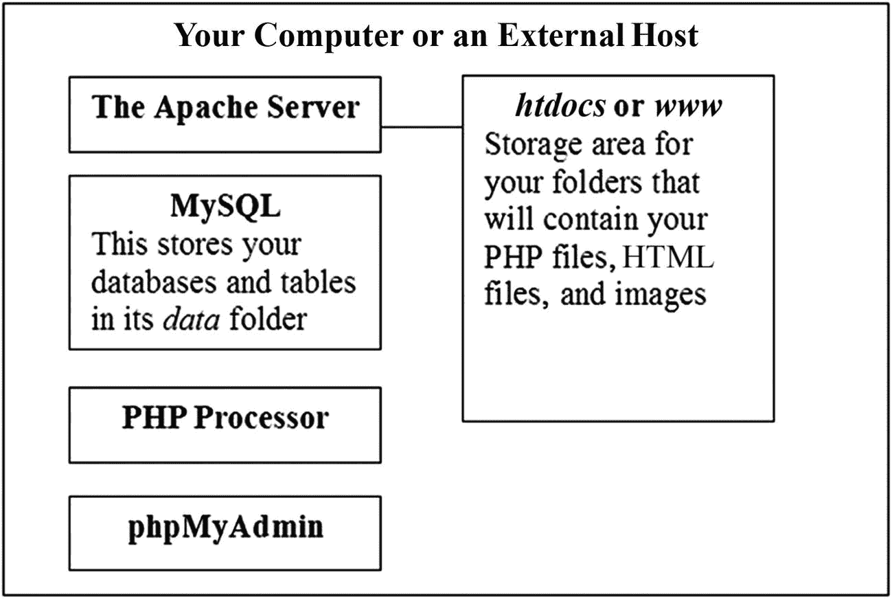

图 1-1

Web 服务器通信

图 [1-1](#Fig1) 显示了 XAMPP 和 EasyPHP 开发平台内置的主要组件。它们如下:

*   Apache 是大多数主机使用的网页服务器，用于本地主机(用户计算机)上的 web 开发。Web 服务器通过查看文件结尾(*)来确定网页是否包含 PHP 代码。php* 。如果 PHP 代码存在，代码被传递给 PHP 解释器执行。如果 PHP 解释器确定 PHP 程序中存在与数据库相关的代码或 SQL，这些信息将被传递给 MySQL 或 MariaDB 数据库管理系统。数据库管理系统执行 SQL 语句并将结果返回给 PHP 解释器。PHP 解释器完成 PHP 代码的执行，并将结果返回给 Apache 服务器。Apache 服务器收集 PHP 代码的结果，以及任何 HTML、CSS 和/或 JavaScript，并将这些信息发送到用户机器上的 web 浏览器。网络浏览器然后执行 HTML、CSS 和/或 JavaScript 代码。

*   MySQL 和 MariaDB 不仅仅是数据库；它们也是数据库管理系统。这些包包括创建、管理和保护数据库的工具。

*   PHP 处理器解释并执行任何 PHP 代码。如果有语法(编码错误)、逻辑错误或系统错误(内存不足)，它将抛出错误或异常。

*   phpMyAdmin 是一个基于 GUI 的管理工具，用于创建和维护数据库及其表。

一个单一的一体化软件包，如 XAMPP 或 EasyPHP，包含图 [1-1](#Fig1) 中提到的四个程序，被称为 WAMP (Windows、Apache、MySQL/MariaDB 和 PHP)。在 WAMPs 中，主要组件是预先配置好的，这样它们就可以相互通信。在苹果操作系统上相当于 MAMP，在 Linux 电脑上相当于 LAMP。

文件夹 *htdocs* (或 *eds-www* )是你的网页的默认存储和可执行区域。默认情况下，Apache 会在 *htdocs* (或 *eds-www* )中查找你的网页。这些页面可以被设计成允许用户与数据库交互。其他页面将在用户看不见的情况下运行，在浏览器和数据库之间来回传输信息。页面通常是 HTML 和 PHP 文件或者两者的组合。

### 警告

图 [1-1](#Fig1) 中的所有东西可能都已经安装在远程主机上，但是在学习的过程中，千万不要使用远程主机来创建数据库。出于安全原因，在熟练掌握之前，不要使用远程主机。我们建议您在自己的计算机上使用 all-in-one 软件包学习和开发数据库。注意，安装在自己电脑上的一体机包纯粹是开发工具。该数据库在开发和彻底测试后，最终可以上传到主机，供用户使用。

#### 用于测试的免费开发平台

您将无法以正常的方式测试您的工作——也就是说，通过使用浏览器来查看位于您硬盘上的数据库和 PHP 代码。当浏览器请求包含 PHP 的网页时，PHP 代码在 web 服务器中执行。代码的执行结果将显示在浏览器中。如果您查看浏览器代码(右键单击网页并选择 View Source)，您将看不到 PHP 代码。您将看到代码执行产生的结果。这让那些习惯于在浏览器中看到自己创建的任何 HTML、CSS 或标准 JavaScript 代码的初级开发人员感到困惑。记住，HTML、CSS 和标准 JavaScript 都是在浏览器中执行的。PHP 代码在 web 服务器中执行，即使该服务器在您自己的 PC 上。

在您的计算机上使用 all-in-one 软件包将允许您查看您创建的所有代码以及在您的 PC 上执行这些代码的结果。这本书假设你在学习的时候会在你自己的电脑上使用一个软件包，并用于开发未来的数据库驱动的网站。

### 注意

在当前黑客试图破坏或收集个人、公司和政府数据的世界中，互联网托管网站上的所有网页必须得到保护。本书中最早的项目必然是简单的，并且有一些安全的特性。但是，不建议您将这些页面上传到互联网主机。当你获得了经验和信心，并且你确信你了解如何保护网站和数据库的安全，你可以改编这本书的后期项目用于你自己的网站，然后将它们上传到远程主机。

#### 在自己的电脑上使用 XAMPP

XAMPP 软件包是免费的，并且已经过预配置，因此组件可以相互通信。这消除了通常下载几个单独的组件，然后配置它们一起工作的麻烦。XAMPP 包括 Windows (WAMP)、Linux (LAMP)和苹果(Mac)操作系统(MAMP)的软件包。本书中的示例是使用 WAMP 环境开发的。然而，这些例子也应该在灯或 MAMP 环境中工作。

在撰写本文时，XAMPP 的最新版本是 7.2.4。整本书都使用这个版本。它的组件版本如下:Apache 2.4.33、MariaDB 10.1.25、PHP 7.2.4 和 phpMyAdmin 4.8.0，以及其他工具。本书中的例子并不完全兼容 7.0 之前的 PHP 版本。

### 注意

如果您安装的版本比本书中演示的版本新，安装步骤可能会略有不同。您应该参考 XAMPP 网站( [`www.apachefriends.org`](http://www.apachefriends.org) )或在互联网上搜索安装说明(尝试 [`youtube.com`](http://youtube.com) )以获得本书中未演示的任何版本。如果新版本包含重大升级(例如 PHP 8)，可能需要对一些代码进行更改。查看 Apress 网站，了解与主要版本发布相关的代码变更。

在我们给你下载 XAMPP 的指导之前，我们需要解决一个困扰每个初学者的问题，这个问题是关于将一个开发的数据库从 XAMPP 或 EasyPHP 转移到远程主机。如果您在自己的计算机上使用这些软件包中的一个，将会出现一个问题，如下一节的标题所述:

##### 我能把数据库从 XAMPP 或 EasyPHP 转移到远程主机吗？

困扰初学者的主要问题是:“如果我在本地 WAMP 上开发一个数据库，我能轻松地将它迁移到远程主机上吗？”初学者完全有理由担心，因为大多数手册很少给出关于这个主题的提示。然而，答案是这样的:“是的，您将能够移动数据库。”你会在本书后面找到完整的说明。

现在我们将提供下载和安装 XAMPP 的信息。

### 警告

如果你想安装多个免费的 WAP，可以在同一台电脑上安装 EASYPHP 和 XAMPP。但是，在打开另一个之前，请确保其中一个已关闭；否则，它们将争夺相同的端口，并导致令人讨厌的问题。

#### 下载并安装 XAMPP

XAMPP 需要最少的配置。要下载该软件包，请前往 [`www.apachefriends.org/`](http://www.apachefriends.org/) 。

点击主页面顶部菜单中的下载，如图 [1-2](#Fig2) 所示。下载页面将显示当前可用的版本。如果可以的话，选择 XAMPP 的 7.2.4 版本，以确保你在本书中使用的所有例子都是兼容的。如果有版本 7 的次要版本(比如 7.3.0)，它可能仍然是兼容的。如果版本 7 不可用，请下载最新版本。然后查看 Apress 网站，看看本书中的例子是否需要修改代码。下载页面会不时变化，因此您可能需要浏览页面以找到显示的版本。

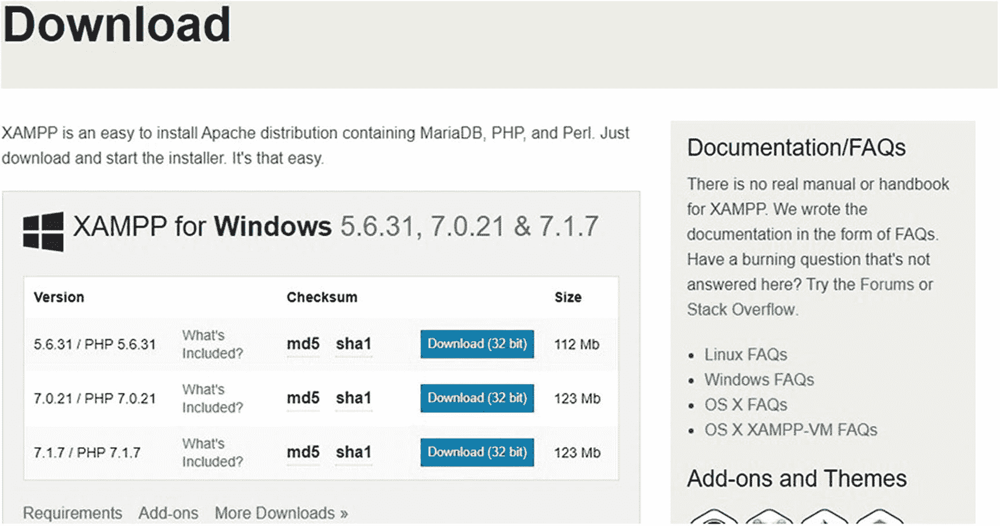

图 1-2

安装 XAMPP

### 注意

下载页面将说明您必须安装 C++运行时库。XAMPP 及其相关工具是使用 C++创建的。如果您使用的是当前版本的 Windows，那么您可能已经有了正确版本的 C++。但是，如果您收到一条错误消息，指出它已丢失，请按照错误消息提供的链接下载正确的版本。

单击最新版本旁边的下载按钮。这将开始下载过程。该文件将自动下载到您电脑上的下载文件夹中。根据您使用的浏览器，可能会询问您是否要运行或保存该程序。有些浏览器会自动保存程序，并要求你点击文件来运行它。如果您不知道如何在您使用的浏览器中找到下载的文件，请在互联网上搜索相关信息。文件下载完成后，双击该文件(或根据提示单击运行选项)开始安装过程。

环境将提示您请求安装程序的权限。单击“是”继续该过程。安装程序将决定您机器上的安全设置。它可能会警告您，您的安全性可能会限制某些可用的 XAMPP 选项。您可以选择继续安装或停止当前安装并暂时关闭您的安全程序。如果关闭安全保护，请确保你的电脑不再连接到互联网。安装程序还会查看您的用户帐户控制(UAC)设置。这些设置根据您登录系统时使用的用户 ID 来限制对文件夹和文件的访问。如果您使用的是没有管理权限的计算机，安装例程将提供一条警告消息，提示您将程序安装在不同于默认位置(程序文件)的位置。按照提示进行操作，并在提示到不同位置时更改默认设置，例如 *c:/XAMPP* 。

将出现欢迎使用 XAMPP 安装向导屏幕。单击“下一步”继续安装。下一个屏幕将显示所有可供安装的选项。如果您是初学者，只需通过单击“下一步”按钮接受已经检查的项目。中级和高级用户可能会考虑删除您确定不会使用的项目。如果需要，您可以随时安装它们。下一个屏幕将显示安装位置。使用 *c:/XAMPP* 来避免任何可能的安全访问问题。单击下一步。下一个屏幕将试图说服你也看看安装 CMS 程序(如 WordPress)。现在，取消选中“了解更多”框。有兴趣可以以后再装。单击“下一步”按钮。下一个屏幕将显示设置就绪。单击下一步。安装将开始。默认情况下，启动控制面板复选框将被选中。保持选中状态。单击完成按钮。在控制面板显示之前，您可能会收到语言选择提示。

如果在安装过程中出现错误，复制错误信息并粘贴到搜索引擎(如 Google)中。查看建议解决方案的列表。转到一个受信任的网站，并按照指示来纠正您的错误。

XAMPP 控制面板上标有运行的项目通常会自动出现，然后您就可以停止各种模块。如果它们没有自动启动，请单击 Apache 和 MySQL 的 XAMPP 控制面板上的开始按钮。如果一个按钮显示“停止”，则该模块已经在运行。接下来呢？如果你被要求将模块作为服务运行，选择将 Apache 和 MySQL 作为服务运行，然后当你双击 XAMPP 桌面图标时，这些模块将自动启动(图 [1-3](#Fig3) )。


图 1-3

XAMPP 的标志

在桌面上为 XAMPP 的 *htdocs* 文件夹创建一个快捷方式，放在 XAMPP 图标旁边，如图 [1-4](#Fig4) 所示。使用这个快捷方式将你的 PHP 文件加载到 *C:\xampp\htdocs* 文件夹中。


图 1-4

节省时间的快捷方式

如果在安装过程中没有创建桌面图标，我们建议您转到 *C:\xampp* 文件夹，然后为【xampp-control.exe】文件*创建一个桌面快捷方式。*

为了方便起见，将两个桌面物品并排放置，如图 [1-4](#Fig4) 所示。一个图标启动和停止 XAMPP，另一个允许你直接在 XAMPP *htdocs* 文件夹中创建和修改页面。

一个常见的问题是 Skype 和其他应用也使用端口 80，这是 Apache 的默认端口。如果另一个应用正在使用这个端口，Apache 将不会启动。日志(图 [1-5](#Fig5) )将显示 Apache 是否因为端口被占用而无法启动。如果出现这种情况，请转到 XAMPP 控制面板，然后单击 Netstat 按钮。此窗口将列出您的 PC 上运行的所有应用以及它们使用的端口。确定一个未使用的端口(如 8080)并关闭 Netstat 窗口。然后单击 Apache 旁边的 Config 按钮。选择 *httpd.conf* 。配置文件将在记事本(或您的默认文本编辑器)中打开。点击编辑，点击搜索，输入 **80** 。单击查找下一行，直到找到以下行:

```php
Listen 80

```

将该行更改为:

```php
Listen 8080

```

或者，将其更改为您决定使用的任何端口。

现在返回到搜索并单击查找下一行，直到找到以下行:

```php
ServerName: localhost: 80

```

将该行更改为:

```php
ServerName: localhost: 8080

```

或者将其更改为您决定使用的端口。

保存文件，并关闭记事本(或您的文本编辑器)。转到 XAMPP 控制面板，点击页面右上角的配置按钮。单击服务和端口设置按钮。单击 Apache 选项卡。输入 Apache 的新端口(8080 或您决定使用的任何端口)。单击保存。关闭配置窗口。现在点击控制面板中 Apache 旁边的开始按钮(图 [1-5](#Fig5) )。几秒钟后，Apache 应该会启动。这将由 Apache 后面的绿色背景表示。您还需要启动 MySQL，因为没有 Apache 的运行，它无法启动。

##### 从 XAMPP 开始

从现在开始，要在 XAMPP 测试您的页面，双击桌面图标并检查 Apache 和 MySQL/MariaDB 是否已经启动。如果它们尚未启动，请单击 Apache 的启动按钮。启动后，点击 MySQL/MariaDB 的开始按钮，然后最小化控制面板。

图 [1-5](#Fig5) 为 XAMPP 控制面板。

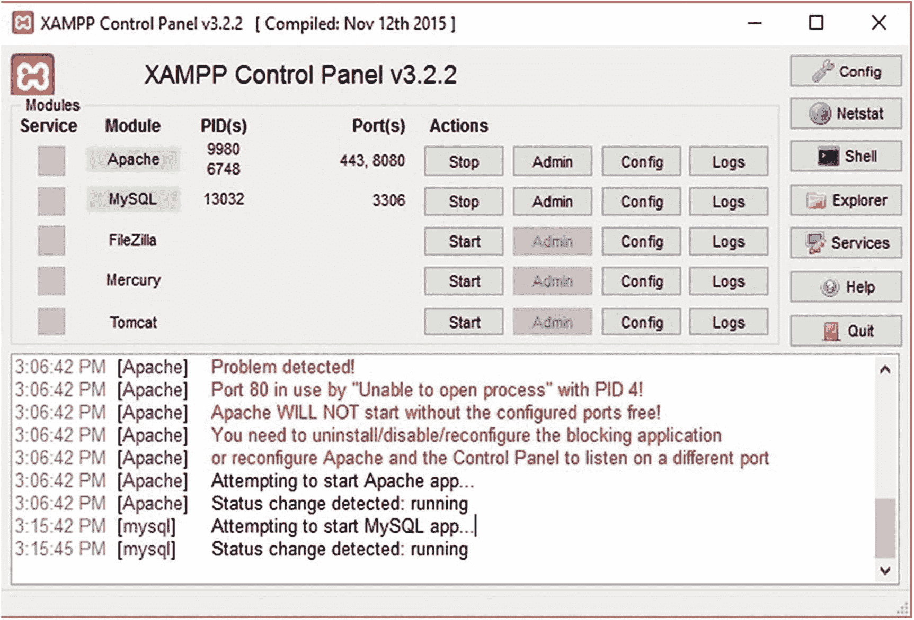

图 1-5

XAMPP 控制面板

我们建议您总是最小化控制面板，以便您有一个清晰的桌面来开始您的数据库工作。

启动 Apache 和 MySQL/MariaDB 后，您可以测试您的安装并检查所有的 XAMPP 示例和工具；为此，请在浏览器中输入以下地址之一:

```php
http://localhost/
http://127.0.0.1/

```

如果您添加了端口号，请确保以如下示例之一的格式包含相同的端口号:

```php
http://127.0.0.1:8080/
http://localhost:8080/

```

#### 关闭 XAMPP

测试完数据库和 PHP 文件后，关闭 XAMPP。这将为数据库开发以外的任务释放内存。要关闭，单击任务栏上的最大化 XAMPP 控制面板，然后单击控制面板上的退出按钮，如图 [1-6](#Fig6) 所示。或者，您可以右键单击通知区域中的图标，然后单击退出。

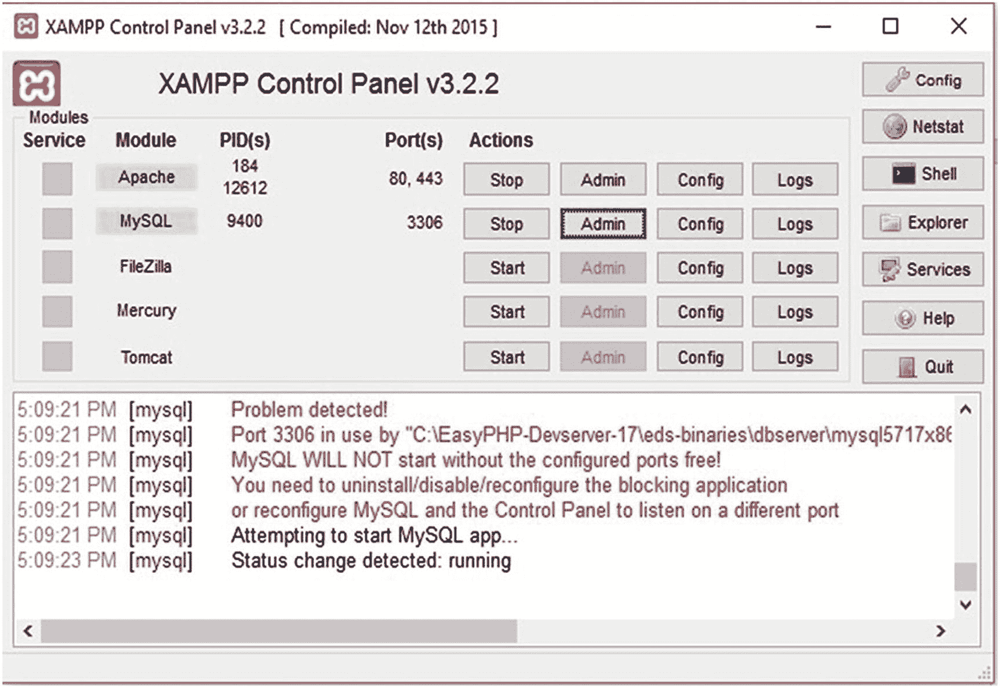

图 1-6

结束 XAMPP 计划

数据库及其数据的安全性极其重要。XAMPP 提供了一种使计算机上的数据库和表免受有害干扰的方法，这将在本章后面介绍。

##### MariaDB 和 MySQL 8 在哪里？

此时，您可能会对 XAMPP 和 MariaDB 数据库的位置感到困惑。XAMPP 的创造者确实从使用 MySQL 数据库转向使用 MariaDB 数据库；然而，我们刚才解释的一切似乎表明 MySQL 仍然是 XAMPP 的一部分。然而，事实并非如此。当创建者决定切换数据库系统时，他们只需对配置进行微小的修改就可以使用 MariaDB。由于 MariaDB 的操作与 MySQL 的免费版本没有任何不同，所以创建者决定保留 MySQL 名称。由于您可能不熟悉这个环境，这可能会令人困惑。然而，对于 XAMPP 的当前用户来说，这允许在数据库环境之间进行简单的转换。请记住，无论你在 XAMPP 哪里看到 MySQL，它都是 MariaDB。

这本书的书名包括 *MySQL 8* 。MySQL 8 是一个完整的专业版本，拥有最新的功能，包括商业分析工具。但是，MySQL 8 没有提供 XAMPP 或 EasyPHP，完整版也不是免费的。如果你正在为公司或政府机构开发网站，你应该考虑使用 MySQL 8(或最新版本)。任何版本的 MySQL 都可以附加到 XAMPP。您确实需要阅读 MySQL 文档，以确保您附加的版本与您安装的 Apache 和 PHP 版本兼容。添加新版本的 MySQL 属于中级技能。我们在上一章提供了指导，以帮助您做好转换的准备。

#### 在自己的电脑上使用 EasyPHP

如果你更喜欢使用 EasyPHP，或者你是一个初学者，并且你的设计师同事已经说服你必须使用 MySQL 的早期版本(即 MariaDB 不能使用)，你可以安装 EasyPHP，这是一个 WAMP 包，包括免费版本的 MySQL。它还包括 MongoDB 数据库系统，这是一个非 SQL 数据库。MongoDB 不在本书讨论范围之内。

没有理由需要安装这两个软件包。但是，如果您选择这样做，您可能需要一次运行一个，或者调整端口以便两个端口可以同时运行。一旦安装完毕，您将会看到这两个包以相似的方式工作。所有示例都已经在两种环境下进行了测试。

##### 下载并安装 EasyPHP

要下载最新版本的 EasyPHP，请访问以下站点:

```php
www.easyphp.org

```

单击主页中间的 Download 按钮，下载 easyPHP 开发服务器的非 beta 版本。本书中用于测试和运行示例的版本是 17.0，包括 PHP 7.2、Apache 2.4 和 MySQL 5.7(最新的免费版本)。如果您注意到一个新的主要版本(如 18.0)，请查看本书的 Apress 网站，以了解在所示的示例中是否有任何代码更改的要求。

安装程序应该会自动启动。Windows 环境将要求您通过单击“是”按钮来允许安装。单击该按钮后，设置程序将询问您的语言偏好。接下来，它将允许您更改已安装文件的位置。如果您对自己的电脑(如公司拥有的电脑)没有管理权限，您可能无法在*程序文件*下安装 EasyPHP。我们建议将安装文件的位置更改为以下位置:

*C:\ easy PHP-DevServer-xx*(*xx*是你正在安装的版本比如 17)

单击下一步。安装过程将询问您是否想要创建一个桌面图标。我们建议您创建一个以方便访问。单击下一步。当前屏幕将验证您的安装位置。单击安装。安装完成后，最后一个屏幕将询问您是否要启动开发服务器。单击“完成”启动它。如果在安装过程中出现错误，将错误复制到搜索引擎(如 Google)中寻找解决方案。在提供的列表中，转到一个众所周知的网站，并尝试按照指示来修复您的错误。

##### 启动 EasyPHP

转到系统托盘中的 EasyPHP 图标，右键单击并启动仪表板。如果仪表板无法启动，请关闭开发服务器(右键单击图标并选择 Exit)，并尝试从桌面快捷方式启动它。仪表板使用端口 1111。如果您仍然不能启动仪表板，右键单击开发服务器图标，选择工具，然后打开端口控制器。验证另一个进程没有使用同一个端口。如果另一个进程正在使用该端口，请停止该进程并重复前面的步骤。

在仪表板内(图 [1-7](#Fig7) ，点击 HTTP SERVER 下方的开始按钮。点击这个按钮应该可以启动 Apache 和 MySQL。如果服务器正常启动,“开始”按钮将变为“停止”按钮。此时，HTTP 服务器和数据库服务器都应该在标题下面显示停止按钮。如果遇到错误，尝试停止开发服务器(右键单击系统托盘图标并选择 Quit)并重新启动它(单击桌面上的图标)。如果您仍然有错误，请将错误复制并粘贴到搜索引擎(如 Google)中，以查看可能的解决方案列表。从一个已知的站点选择一个建议的解决方案，并尝试按照指示去做。

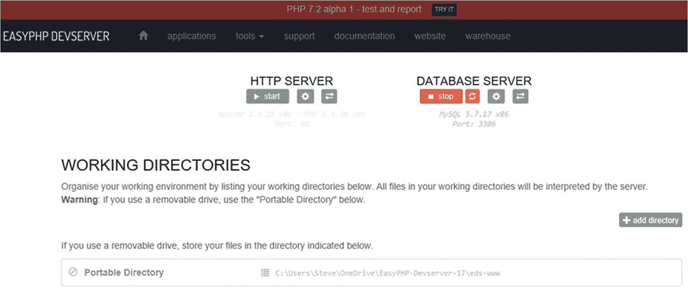

图 1-7

EasyPHP 开发服务器

##### 关闭 EasyPHP

每当您需要关闭 EasyPHP 时，只需通过进入系统托盘，右键单击图标并选择 Quit 来关闭开发服务器。这将关闭所有与 EasyPHP 相关的进程。

##### phpMyAdmin 安全性

phpMyAdmin 在 XAMPP 和 EasyPHP 中的初始安装有用户名 *root* ，没有密码。如果您在自己的计算机上使用这些设置，则在连接到互联网时会有安全风险。如果您创建数据库不仅仅是为了个人使用或自己的教育，那么您应该创建一个 phpMyAdmin 密码。如果您与其他人在同一个房间工作，如果密码不泄露给其他人，密码将提供安全性。作为最佳实践，您应该用密码保护您的开发环境。

如果你还没有进入 phpMyAdmin，请进入 XAMPP 控制面板或 easyPHP DevServer 页面。在 XAMPP，点击 MySQL 右边的管理。在 EasyPHP 中，点击页面上显示的 phpMyAdmin 版本右边的打开按钮(图 [1-8](#Fig8) )。

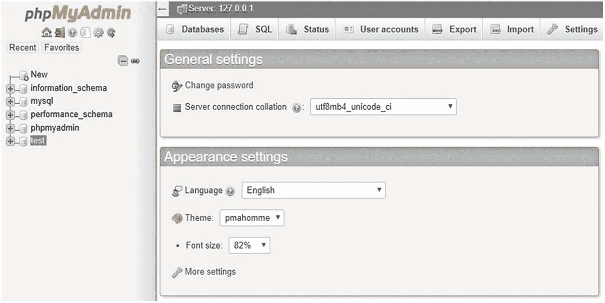

图 1-8

phpMyAdmin 页面

请注意，如果您已经更改了默认端口，您可能需要在启动 phpMyAdmin 时添加端口号。例如，如果您将端口更改为 8080，phpMyAdmin 的地址现在如下所示:

```php
http://localhost:8080/phpMyAdmin/

```

点击 phpMyAdmin 中的用户账户选项卡(图 [1-9](#Fig9) )。


图 1-9

phpMyAdmin 用户帐户选项卡

单击最后一个条目 root localhost 右侧的编辑权限链接。将显示编辑权限页面(图 [1-10](#Fig10) )。单击页面顶部的更改密码链接。


图 1-10

phpMyAdmin 编辑权限页面

在两个框中输入您的密码。单击页面底部附近的“确定”按钮。如果密码更改，您将收到密码已更改的通知。您现在需要告诉 phpMyAdmin 使用新密码。

在 XAMPP，进入你电脑上的 XAMPP 文件夹。打开文件夹 phpMyAdmin。现在在微软记事本(或其他文本编辑器)中打开文件*config.inc.php*。

在 easyPHP 中，进入 *EasyPHP-DevServer-xx* 文件夹，进入 *eds-modules* ，打开 *phyMyAdmin* 文件夹。现在在微软记事本(或其他文本编辑器)中打开文件*config.inc.php*。

搜索以下内容:

```php
['auth_type'] = 'config';

```

将该行更改为:

```php
['auth_type'] = 'cookie';

```

保存文件。

如果您使用的是 XAMPP，请返回控制面板。停止并重启 MySQL。返回 phpMyAdmin 页面(`http://localhost/phpMyAdmin/`或`http://localhost:8080/phpMyAdmin/`)。该页面现在应该要求您输入用户 ID (root)和密码(您刚刚创建的那个)。

如果您使用的是 EasyPHP，请尝试返回 DevServer 页面并重启服务器。然后单击 phpMyAdmin 的 open 按钮。输入用户 ID (root)和密码(您刚刚创建的那个)。如果在输入用户 ID 和密码后出现错误消息，指出 mysql_native_password 丢失，请按照下面的说明操作。

进入 *EasyPHP-DevServer-xx* 文件夹，进入 *eds-binaries* ，然后进入 *dbserver* ，进入 *MySQL* 文件夹，最后进入 *bin* 文件夹。该文件夹包含几个可用于运行和管理 MySQL 和 phpMyAdmin 的应用。但是，这些应用只能在命令行界面中运行。为了更容易地找到和使用它们，我们将把这个位置放在 PC 的 Path 变量中。这允许您只执行您需要的程序，而无需输入完整的路径名。转到浏览器中的 URL 行，双击该地址。现在应该突出显示完整的地址。右键单击突出显示的地址，然后选择复制。

转到搜索图标(系统托盘的右下角)，点击它，并输入**系统变量**。单击编辑系统环境变量结果。将出现“系统属性”窗口。单击环境变量按钮。在提供的框中(顶部框代表机器的所有用户，底部框代表您登录时使用的用户 ID)，选择路径代码。然后单击编辑按钮。现在单击“新建”按钮。现在将在框中提供一个空间来输入您复制的路径。在框中单击，右键单击，然后选择粘贴(或按 Ctrl+V)。您复制的路径现在应该在框中。确保它是到媒体夹位置的完整路径。正确后，单击“确定”按钮。您的 bin 现在被添加到 PATH 变量中。单击每个窗口的“确定”,关闭窗口并提交变更。现在，您需要关闭所有进程并重启您的机器。这将导致 Windows 使用新路径。

重新启动机器后，重启 EasyPHP DevServer 并确保 HTTP 服务器和 mySQL 服务器都已启动。转到窗口的搜索图标，输入 **cmd** 。然后按回车键。这将打开命令行窗口。现在，您终于可以将缺少的模块添加到 phpMyAdmin 中了。

输入 **mysql -u root** 并点击回车键。你现在应该会看到一个 mysql 提示(mysql >)。输入**使用 MySQL**；(不要忘记分号)并点击回车键。这告诉服务器使用 MySQL 数据库。输入下面一行来添加缺少的插件:

```php
update user set plugin="mysql_native_password" where user="root";

```

您应该会看到一条消息“Query OK”现在，还可以在命令行中使用以下行来更改密码:

```php
update user set Password=PASSWORD('12345') where user="root";

```

12345 应该替换为您之前设置的密码。您还应该看到一条消息“Query OK”您的所有更改应该都已完成。通过输入 **exit** 关闭 mysql 提示符。按 X 键关闭命令窗口。返回 phpMyAdmin 并单击用户帐户。您现在应该看到 Yes 标志已经设置，表明 root 现在有了密码。注意，即使设置了密码，EasyPHP 仍然可能自动让您进入 phpMyAdmin。

这种密码情况发生在免费 MySQL edition 的当前版本(截至本书出版之日)上。正如您之前注意到的，这在 XAMPP 不会发生，因为 XAMPP 使用的是 MariaDB。

如果你对这些步骤有任何问题，并想退出，最简单的方法是使用主软件包文件夹下的卸载程序卸载软件包，然后重新安装 XAMPP 或 EasyPHP。如前所述，如果你收到错误信息，将它们复制到网络搜索引擎(Google)中，寻找建议的解决方案。

#### 直接访问 phpMyAdmin

如果您已经安装了 XAMPP 并且服务器已经启动，那么您可以通过在任何浏览器中输入以下 URL 来直接访问 phpMyAdmin:

`http://localhost/phpMyAdmin/`或`http://127.0.0.1/phpMyAdmin/`

(如果您更改了默认端口 80，请记住包括最后的正斜杠和端口号。)

如果您已经安装了 easyPHP 并且服务器已经启动，您可以通过在任何浏览器中输入以下 URL 之一来直接访问 phpMyAdmin:

```php
http://localhost:8080/eds-modules/phpmyadmin470x170718155219/
http://127.0.0.1:8080/eds-modules/phpmyadmin470x170718155219/

```

(您的实际 phpmyadmin 版本/构建可能不同，这将创建一个不同的 *phyMyAdmin* 文件夹。)

一定要包括`http://`；否则，浏览器将在互联网上而不是在您的 PC 上查找该位置。

### 注意

描述 phpMyAdmin 使用的部分适用于任何开发平台:XAMPP、WAMPServer 或 easyPHP。

您可能已经在 XAMPP 或 EasyPHP 中设置了密码，所以无论何时访问 phpMyAdmin，您可能都需要使用该密码登录。这样可以防止互联网机器人和人类干扰你的数据库。如果你和别人一起在办公室工作，后一种情况很重要——你工作的地方可能会有间谍或爱管闲事的人。如果为 phpMyAdmin 创建了密码，会出现一个对话框，如图 [1-11](#Fig11) 所示。

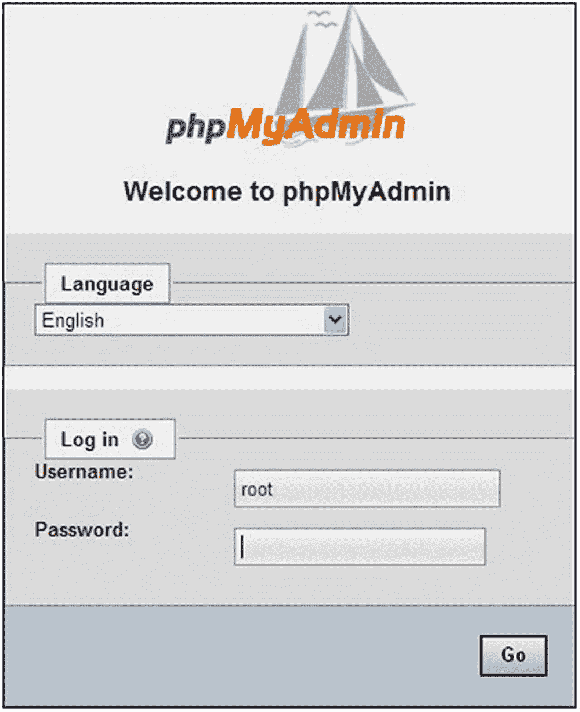

图 1-11

在对话框中输入密码以访问 phpMyAdmin

输入您的用户名(root)和密码，然后单击 Go 按钮。phpMyAdmin 加载相当慢，但它最终会出现。

请注意，开源程序在不断改进和升级，您可能会发现您的 XAMPP 或 EasyPHP 包中有比本书中使用的版本更新的 phpMyAdmin 版本。您可能还会在 phpMyAdmin 主窗口中看到升级消息，提醒您有新版本。就个人数据而言，安全性是最重要的，所以这些增量更新对你来说是一件好事，尽管它们确实意味着书中的一些截图可能不再准确反映你在屏幕上看到的内容。如果一个界面看起来与本书中显示的有些不同，不要担心；用法通常是相似的。

phpMyAdmin 接口起初看起来可能有点令人畏惧，但是当我们需要使用它们时，我们将介绍它的相关部分。现在，您可以关闭 phpMyAdmin 窗口。

您现在已经知道了如何安装和保护 XAMPP 和 easyPHP，还学习了如何启动和停止服务器。你刚刚读到的大部分内容可能非常新，但有一些部分你会认识，因为它们遵循正常的 Microsoft Windows 文件和文件夹组织。

#### 熟悉的片段

在 XAMPP 软件包中，文件夹和文件的结构将为 Windows 用户所熟悉，尽管它们的名称可能无法识别。

图 [1-12](#Fig12) 显示了 XAMPP 文件夹。


图 1-12

XAMPP 包中的文件夹；您的列表可能略有不同

在图 [1-12](#Fig12) 中，注意 *htdocs* 文件夹。这是你放置你的网站和数据库的所有 PHP 文件和 HTML 页面的地方。

在 XAMPP 文件夹中，你会发现一个名为 *MySQL* 的文件夹。这个文件夹包含一个名为*数据*的文件夹，数据库和表格将存放在这里。数据库必须有唯一的名称。数据文件夹中的一个文件包含关于数据库的所有信息，其文件类型为 **。选择*。

表格是文件；当你创建了任何表格后，这些表格也将存在于名为 *data* 的文件夹中，它们的文件类型为 **。frm* 。

在 easyPHP 中，一旦你打开 *EasyPHP - Devserver-xx* 文件夹，你会发现一个 *eds-www* 文件夹。这是放置所有 PHP 文件和 HTML 页面的地方。以下文件路径是数据库文件的位置:

*C:\ easy PHP-Devserver-17 \ eds-binaries \ dbserver \ MySQL 5717 x86x 170717151041 \ data*

中级或高级开发人员应该考虑创建虚拟目录，这是可执行文件的其他位置。虽然本书没有涉及这个主题，但是你可以通过搜索 *XAMPP 虚拟目录*或 *easyPHP 虚拟目录*在互联网上找到更多信息。

现在，您已经熟悉了将要使用的工具的外观和感觉，您已经准备好继续前进了。下一节将带您接近创建您的第一个数据库和表。

#### 规划数据库:重要的第一步

第一步也是最重要的一步是规划数据库，这样你就有实际的东西可以用了。让我们假设我们需要为一个组织的成员计划一个数据库。

首先，决定数据库的名称。我们将这个数据库命名为 *simpledb* 。请记住，数据库就像一个空文件夹，最终将包含一个或多个表。

然后，将数据项组合成一个表。我们将该表命名为*用户*。

接下来，决定你想要表格中的什么信息；您的决定没有约束力，因为您可以在开发过程中更改数据库的任何部分。假设我们需要关于用户的五条信息。我们在本章前面的表 [1-1](#Tab1) 和表 [1-2](#Tab2) 中列出了一些典型数据。

表 1-2

simpledb 数据库中用户表的计划草案

<colgroup><col class="tcol1 align-left"> <col class="tcol2 align-left"> <col class="tcol3 align-left"> <col class="tcol4 align-left"> <col class="tcol5 align-left"> <col class="tcol6 align-left"></colgroup> 
| 

用户 id

 | 

名字

 | 

姓氏

 | 

电子邮件

 | 

密码

 | 

注册日期

 |
| --- | --- | --- | --- | --- | --- |
|   | 凯文 | *水壶* | kev@kettle.co.uk | k3 TTL 2fur |   |
|   | 苏珊 | *炖锅* | sue@kitchen.org.uk | *n @ its*5 |   |
|   | 奥利弗 | *烤箱* | oliver@cooker.co.uk | *H*0*tsts*0*v*3 |   |

表格中的每一行称为一条*记录*，每一个单元格称为一个*字段*。一个数据库可以包含多个表。我们使用了一些虚构的名字来帮助设计这张桌子。第一列标记为 user_id，这一列是对五列数据的补充。稍后将解释列 user _ id 暂时接受它，并确保它是空的。此外，将注册日期留空，因为这是自动输入；它不需要输入值，也不需要分配空间。

现在我们必须为数据分配一些空间。表 [1-3](#Tab3) 显示了我们为每个项目分配的字符数。

表 1-3

用户表中列允许的字符数

<colgroup><col class="tcol1 align-left"> <col class="tcol2 align-left"> <col class="tcol3 align-left"> <col class="tcol4 align-left"> <col class="tcol5 align-left"> <col class="tcol6 align-left"></colgroup> 
| 

用户 id

 | 

名字

 | 

姓氏

 | 

电子邮件

 | 

密码

 | 

注册日期

 |
| --- | --- | --- | --- | --- | --- |
| six | Thirty | Forty | Fifty | Sixty |   |

写下或打印这两个表格，并把它们放在手边，因为在接下来的阶段你会用到它们。

现在，决定数据库的用户名和密码，并将该信息输入到您的笔记本中。需要四条信息:数据库名称、主机、密码和用户名。在本项目中，这些因素如下:

*   *名称* : simpledb

*   *主机*:本地主机

*   *密码* : Hmsv1ct0ry1(这来自 hmsvictory，但是第一个字母大写，并且将 *I* 替换为 1，将 *o* 替换为 0，作为强密码)

*   用户 : horatio

为了生成更安全的密码，phpMyAdmin 包含了一个密码生成器。

接下来，我们将使用 phpMyAdmin 创建我们的第一个数据库。

#### 使用 phpMyAdmin 创建数据库

直接打开 phpMyAdmin，如本节开头所述，或者通过 XAMPP 管理页面或 easyPHP 仪表板。请记住，数据库服务器必须正在运行才能使用 phpMyAdmin。

单击顶部菜单中的数据库选项卡。然后你会看到如图 [1-13](#Fig13) 所示的界面。


图 1-13

用于创建数据库的 phpMyAdmin 接口

键入数据库的名称。对于本例，它将是 simpledb，全部小写。您应该将排序规则更改为 utf8-general-ci；latin1_swedish_ci 的默认值会引起混淆。

### 注意

排序规则确定字符类型、排序能力、性能和数据的其他特征。排序规则 utf8-general-ci 是一个较旧的标准，可以满足本书中数据示例的需要。您的数据要求可能需要不同的排序规则。

然后单击 Create 按钮(将 Collation 字段设置为 utf8-general-ci)。单击“创建”按钮后，页面将切换到“创建表”页面。然而，首先我们想改变数据库的属性。检查页面顶部(左侧)的左箭头。这将返回到主页。再次单击数据库选项卡。现在，上一页看起来类似于图 [1-14](#Fig14) 。

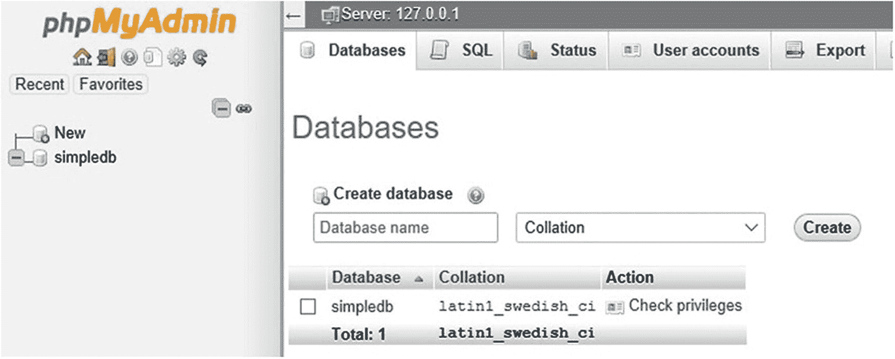

图 1-14

在页面的下半部分，选择数据库名称旁边的框

如图 [1-14](#Fig14) 所示，当您选择新数据库旁边的框时，单击 Check Privileges，您将被带到一个屏幕，在那里您将看到有权访问该数据库的用户列表。为了保证数据库的安全，您必须添加用户名和密码。点击添加用户账号，如图 [1-15](#Fig15) 所示。

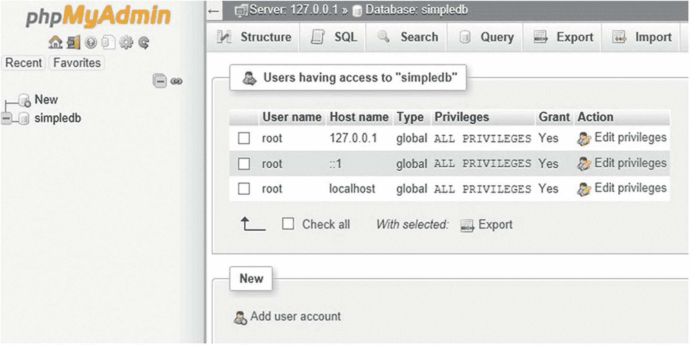

图 1-15

添加用户帐户图标位于该图的底部

点击添加用户帐户将加载添加用户帐户屏幕，如图 [1-16](#Fig16) 所示。

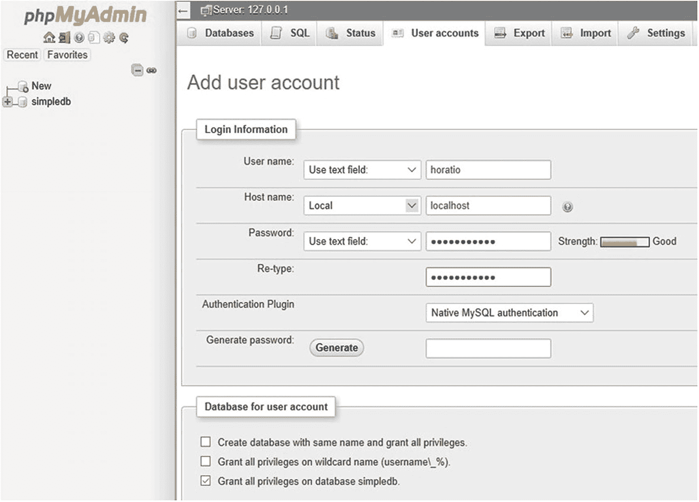

图 1-16

此屏幕允许您添加用户和密码

### 警告

添加用户名和密码是必不可少的；否则，您的数据库将是不安全的，容易受到不道德的个人或他们的机器人的攻击。这是最需要培养的习惯。请务必在笔记本上记录用户和密码的详细信息。请确保创建一个包含大小写字母、数字和特殊字符的强密码。做一个详细的记录会让你以后少受几个小时的挫折。

使用下拉菜单，接受第一个字段中的默认使用文本字段，并在它右侧的字段中输入用户名。在标记为主机的第二个字段中，选择本地。单词 *localhost* 将出现在右边的字段中。Localhost 是您计算机上服务器的默认名称。在第三个字段中输入密码，并在下方的字段中再次输入密码进行确认。如果你想要一些独特和更安全的东西，生成密码按钮将创建一个随机的强密码。

向下滚动到用户帐户的数据库，然后单击授予数据库的所有权限。因为你是站长，你需要能够处理数据库的方方面面；因此，你需要所有的特权。如果添加其他用户，您需要通过取消选择 Drop、Delete 和 Shutdown 等框来限制他们的权限。

向下滚动到表单的底部，然后单击“确定”或“执行”按钮。现在，您已经创建了数据库并保护它免受攻击。数据库可以被视为一个空文件夹，最终将包含一个或多个表。

### 注意

如果你在使用 phpMyAdmin 的时候迷路了，看不到下一步该做什么，总是点击左边面板顶部的小房子。将鼠标悬停在图标上，以确保它是主屏幕按钮。

现在我们将创建我们的第一个表。

##### 使用 phpMyAdmin 创建一个表

现在让我们使用 phpMyAdmin web 页面将一个或多个数据表插入到数据库中。此页面将使您能够完全控制您的表，包括故障排除和备份。

单击新数据库的名称；你会在左边的面板找到它。然后你会看到如图 [1-17](#Fig17) 所示的屏幕。

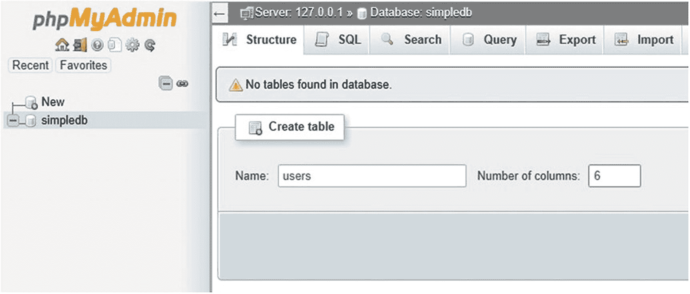

图 1-17

单击页面底部的“Go”按钮创建表格

输入表格的名称，并指定列数。然后单击页面底部的“Go”按钮。你将被带到一个屏幕，显示列翻转 90 度，使列看起来像行；如图 [1-18](#Fig18) 所示。字段为空，等待您定义表格。

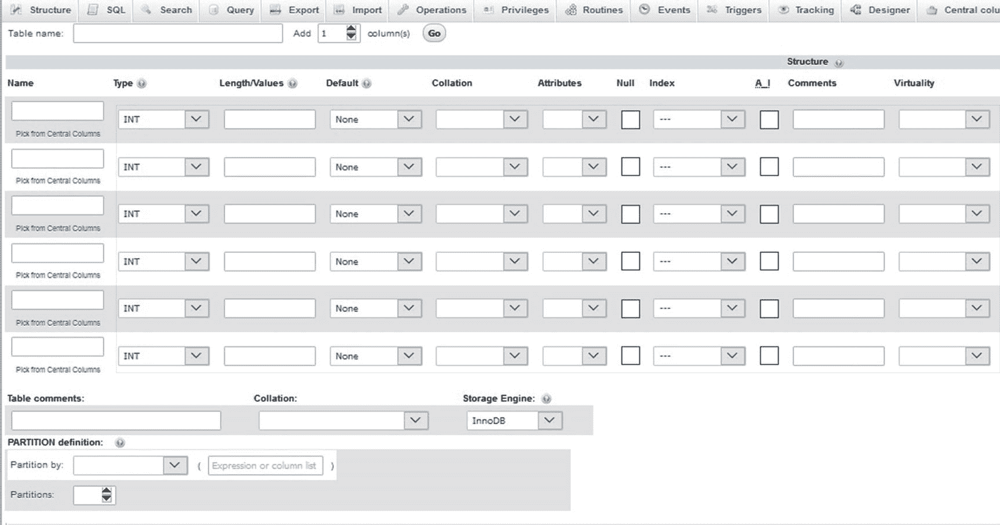

图 1-18

六行代表六列。列标题将输入左侧的字段中。

使用我们之前计划的表 [1-2](#Tab2) 和 [1-3](#Tab3) 中的数据，并输入列名、数据类型和字符数。创建用户表的细节在表 [1-4](#Tab4) 中给出。

表 1-4

用户表的属性

<colgroup><col class="tcol1 align-left"> <col class="tcol2 align-left"> <col class="tcol3 align-left"> <col class="tcol4 align-left"> <col class="tcol5 align-left"> <col class="tcol6 align-left"> <col class="tcol7 align-left"> <col class="tcol8 align-left"></colgroup> 
| 

列名

 | 

类型

 | 

长度/值

 | 

默认

 | 

属性

 | 

空

 | 

索引

 | 

A_I

 |
| --- | --- | --- | --- | --- | --- | --- | --- |
| 用户 id | *介质* | six | 没有人 | *无符号* | -是吗 | 主要的 | ·······················。 |
| 名字 | 可变长字符串 | Thirty | 没有人 |   | -是吗 |   | -是吗 |
| 姓氏 | 可变长字符串 | Forty | 没有人 |   | -是吗 |   | -是吗 |
| 电子邮件 | 可变长字符串 | Fifty | 没有人 |   | -是吗 |   | -是吗 |
| 密码 | 茶 | Sixty | 没有人 |   | -是吗 |   | -是吗 |
| 注册日期 | DATETIME |   |   |   | -是吗 |   | -是吗 |

除了 user_id 之外，接受每个项目的所有默认设置。在这里，您需要选择 UNSIGNED、PRIMARY 和 type 同时选择 A_I(自动增量)框。如果您发现输入值 6、UNSIGNED 和 PRIMARY 会导致您的 phpMyAdmin 版本产生错误(或警告)，那么您可以保留这些项的默认值。如后文所述，当您单击 A_I 时，系统会要求您选择 PRIMARY。MEDIUMINT 将默认为 6 号。

标题类型下的各种类别将在后面解释；标题长度/值指的是最大字符数。registration_date 的长度/值留空，因为长度是预先确定的。不要在标题 Default 和 NULL 下输入任何内容。属性 UNSIGNED 意味着 user_id 整数不能是负数。user_id 的索引是主索引，A_I 表示 id 号的自动递增；当每个用户注册到数据库中时，他们被赋予一个唯一的号码。每增加一个新用户，该数字就增加一。当选择 A_I 复选框时，一个弹出窗口可能会要求您验证它是否是主索引，并再次请求大小。*不要*在弹出窗口中输入尺寸。如果你这样做，你会得到一个错误。图 [1-19](#Fig19) 显示了指定属性的屏幕。


图 1-19

此屏幕允许您指定列标题和内容类型

行代表列，它们非常宽；您可能需要水平滚动来输入一些信息。当你向右滚动时，你会发现更多的选项，但是在本教程中我们不需要它们。

你如何填写字段？在标题名称下左侧的字段中输入六个列标题。在标题类型下的第二列字段中选择列的类型。从下拉菜单中选择它们。此表中使用的类型如下:

*   MEDIUMINT 可以存储从负 8，388，608 到正 8，388，607 的整数。如果用户数量永远不会超过 65，535，您可以选择下一个最小的类别 SMALLINT。

*   VARCHAR 指定长度从 0 到 255 的可变字符串。

*   CHAR 是传统上用于密码的字符串。确保这个长度为 60 个字符，以便您的 PHP 代码可以散列密码。当前的 PHP 哈希算法会将密码转换为 60 个字符的哈希字符串。比如说，用户的密码可以是 6 到 12 个字符长，但是它仍然会作为一个散列的 60 个字符的字符串存储在数据库中。这将在第 [2](02.html) 章中进一步讨论。

    **注意**在 PHP 的新版本中，散列密码的长度可能会增加。在设置表中该字段的长度之前，请确保研究当前的哈希大小。

*   DATETIME 以 YYYY-MM-DD-HH:MM:SS 格式存储日期和时间。

在标题长度/值下的第三列字段中输入字符数。这些数字请参考表 [1-4](#Tab4) 。

在标题 Default 下，接受缺省值 None。如果需要，此字段允许您输入默认值。

您可能需要向右滚动以完成字段的填写。在标题“属性”下，使用下拉菜单为 user_id 选择“无符号”。这确保了整数范围从 0 到 16，777，215。负数量不适用于 user_id。

接下来的两个条目只涉及 user_id(图 [1-20](#Fig20) )。


图 1-20

user_id 列的两个额外条目

对于 user_id，在标题 Index 下，单击下拉菜单选择 PRIMARY。user_id 应该始终是主索引。

在标题 A_I 下，选择最上面的复选框，这样当每个新记录添加到数据库中时，user_id 号会自动递增。如前所述，您可能会看到一个弹出窗口，要求您验证它是主要的和大小。*不要*在弹出窗口中输入尺寸。验证和/或添加任何缺失的信息，然后单击确定。

输入表格和图 [1-20](#Fig20) 中显示的附加信息。完成信息输入后，滚动到底部并单击保存按钮。

### 警告

如果您忘记为 user_id 选择 A_I 框，当您稍后尝试输入第二条记录时，您将收到一条错误消息。该消息将说明您正在尝试为 user_id 创建一个重复值 0。

有些人喜欢混合使用 GUI 和命令行来对表格进行编程；phpMyAdmin 允许您通过使用 SQL 语言来做到这一点。然而，这本书将主要使用 phpMyAdmin GUI。接下来描述 SQL 替代方法。如果您愿意，可以跳过这一节，但是我们建议您以后再来看这一节，因为您肯定会在其他更高级的书籍和教程中遇到 SQL。

#### SQL 替代方案

下一节描述了使用 phpMyAdmin 创建数据库和表的一种稍微快捷的方法。SQL 代表结构化查询语言；它是 MySQL、MariaDB 和许多其他数据库的官方语言。你会很高兴看到它使用简单的英语命令。唯一的问题是，在 SQL 窗口中比在图 [1-19](#Fig19) 中显示的 phpMyAdmin 接口中更容易产生打字错误或拼写错误。

使用 SQL，可以创建一个带有密码和用户名的数据库。这样就省了好几个步骤。

我们假设您已经创建了数据库 simpledb，所以我们不能再使用这个名称。假设管理员(Adrian)想要使用以下信息创建一个名为 *members* 的数据库:

*   *数据库名称*:成员

*   *特权*:全部

*   *用户名*:阿德里安

*   *密码*:订书机 12

图 [1-21](#Fig21) 显示了在 SQL 窗口中创建数据库的代码。

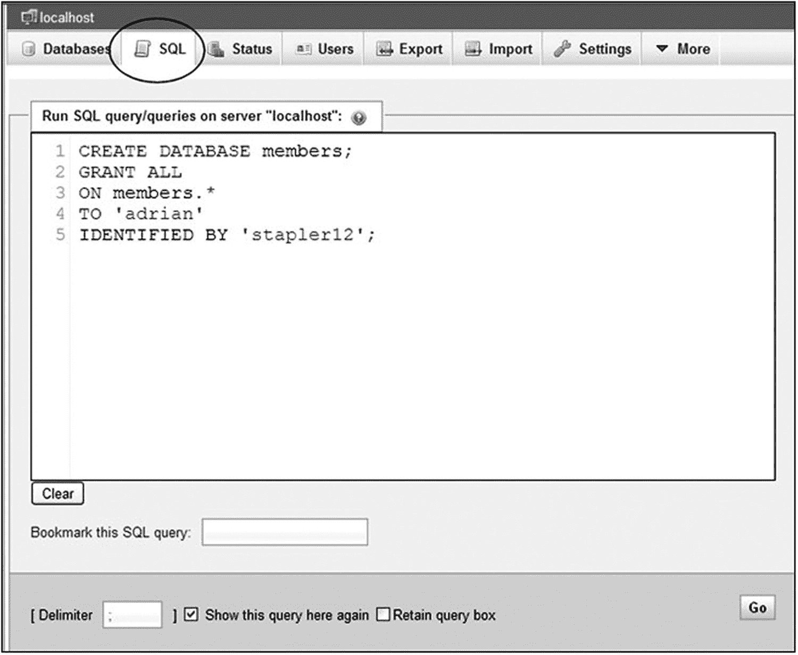

图 1-21

SQL 窗口

在 phpMyAdmin 中，在窗口左侧面板的数据库“树”上单击 New，通知 phpMyAdmin 您不再使用 simpleDB 数据库。单击 SQL 选项卡(显示为圆圈)以显示 SQL 窗口。

图 [1-21](#Fig21) 中显示的细节必须按以下格式输入:

```php
CREATE DATABASE members;
GRANT ALL
ON members.*
TO 'adrian'
IDENTIFIED BY 'stapler12';

```

通过在每行末尾按 Enter 键，可以在单独的行上输入每一项。SQL 关键字(如 CREATE DATABASE)传统上是大写的。其他项目通常以小写字母输入。注意分号和单引号——它们很重要。当您对条目感到满意时，单击 Go 按钮。

如果输入的代码正确，将显示两条查询语句，表明数据库已创建，adrian 作为用户被附加。它们将指示空的结果集。这是可以的，因为数据库中不存在任何东西。

现在，我们将使用 SQL 窗口在成员数据库中创建一个名为 *users* 的表。

单击 phpMyAdmin 左侧面板上的数据库“树”中的成员数据库。如果成员数据库没有出现，请刷新页面使其出现。打开 SQL 窗口，输入以下内容:

```php
CREATE TABLE users (
user_id MEDIUMINT (6) UNSIGNED
AUTO_INCREMENT,
first_name VARCHAR(30) NOT NULL,
last_name VARCHAR(40) NOT NULL,
email VARCHAR(50) NOT NULL,
password CHAR(60) NOT NULL,
registration_date DATETIME,
PRIMARY KEY (user_id)
);

```

前面代码中显示的 NOT NULL 将要求在字段中输入数据。这是必填字段。在本例中，所有字段实际上都是必需的，因为 registration_date 是自动填充的。

图 [1-22](#Fig22) 显示了 SQL 窗口中的详细信息。


图 1-22

在 phpMyAdmin 的 SQL 窗口中创建一个表

注意括号都是普通括号，不是花括号。在每一行之后按 Enter 键，并且记住在最后一行的末尾加上右括号和分号。每一项都用逗号分隔(第 3 行到第 8 行)；如果你的表格有六列，你应该有六个逗号。单击 Go 按钮，表将被创建。

### 小费

我们鼓励您探索刚刚描述的 SQL 主题。在未来的某个时候，使用 SQL 的能力将是一个有用的选择。你可以通过搜索互联网找到许多免费教程。

#### 删除数据库和表

在学习时，初学者通常需要在创建数据库或表后重新开始，并可能希望删除以前的尝试。当您第一次使用 phpMyAdmin 时，您可能会忘乎所以，创建几个数据库和表。然后你可能会决定清理这些乱七八糟的东西，删除一些。

让我们看看如何删除数据库。如果 phpMyAdmin 尚未打开，请使用前面显示的方法之一启动它。选择数据库选项卡(如图 [1-23](#Fig23) 所示)，然后选择要删除的数据库旁边的框。

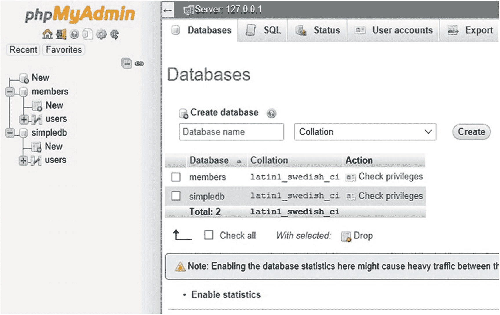

图 1-23

删除数据库

选择要删除的数据库后，单击 Drop 图标(在右下角)。将询问您是否确实要删除该数据库；继续并完成删除。与该数据库相关的所有内容都将被删除，包括它的表。如果成功，会有一条消息告诉您一个数据库已被删除。

您可能希望保留一个数据库，但删除它的全部或一个表。在 phpMyAdmin 中，在左侧面板的“树”中选择数据库。在下一个屏幕中，您将看到表格；选择要删除的表旁边的框。图 [1-24](#Fig24) 显示了 simpledb 数据库的用户表。

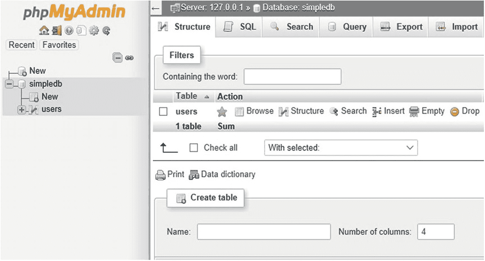

图 1-24

在 phpMyAdmin 中删除表

选择要删除的表后，单击拖放图标(位于表名右侧)。系统会询问您是否真的要删除这些表。您可以在删除和取消之间进行选择。

## 摘要

在这一章中，我们定义了一个数据库，然后看了两个用于开发和测试数据库和 PHP 文件的免费平台。我们希望你成功下载并安装了 XAMPP 或 easyPHP。然后，我们研究了 phpMyAdmin，并学习了如何使用它来创建数据库和表。SQL 被研究作为创建数据库和表的替代方法。我们学习了如何使用用户 ID 和密码来保护 phpMyAdmin 和数据库。我们发现了如何使用 phpMyAdmin 删除数据库和表。在下一章，我们将创建并测试简单的交互式网页。