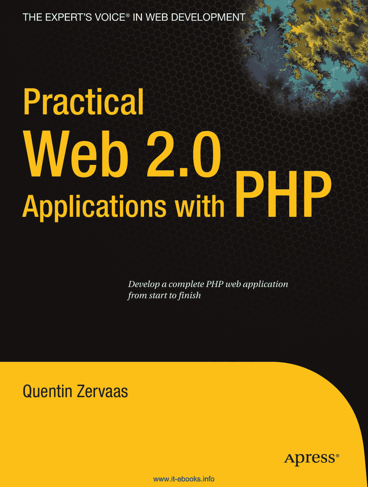
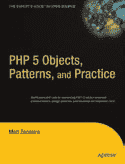
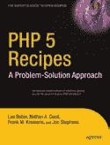
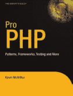

`cyan`

`yelloW`

`maGenTa`

`Black`

`panTone 123 c`

专业人士的书籍 来自专业人士®

Web 开发的专家之声®

**配套资源**

**使用 PHP 进行实用 Web 2.0 开发**

**提供电子书**

亲爱的读者，

`PrWactical`

当今市场上的许多编程书籍专门关注特定的方法或软件包，虽然您会从这些书中获得对主题的扎实理解，但您并不总是知道如何在现实世界中运用 `eb 2.0` 所学到的知识。本书旨在 `Practical` 向您展示如何通过从零开始并逐步构建代码库，使其演变成一个完整的 Web 应用程序，从而将许多不同的想法和功能整合在一起。

我们在本书中构建的应用程序的基础是它是一个“Web 2.0”应用程序。这意味着（除其他外）我们的应用程序生成可访问且符合标准的代码，同时大量使用 `Web 2.0` `Ajax`。我们通过使用 `Smarty™ 模板引擎` 和层叠样式表，以及 `Prototype JavaScript 库` 来实现这一点。此外，我们使用 `Script.aculo.us JavaScript 库` 在各个页面上应用简单的视觉效果，从而创建一个有趣且直观的界面。

`Applications with`

为了帮助开发本书中大量的 PHP 代码，我们使用了 `Zend Framework`。这是一个开源的 `PHP 5` 库，包含许多不同的组件，您可以在日常的 `使用 PHP 进行应用开发` 中轻松使用这些组件。我们在本书中使用了 `Zend Framework` 的许多组件，例如数据库抽象（重点放在 `MySQL®` 和 `PostgreSQL` 上）、日志记录、身份验证和搜索。

我们在本书中构建的“Web 2.0”应用程序是一个协作博客工具。它将允许用户注册并创建个人博客。在创建博客文章时，用户将能够上传图片、应用标签和分配位置（使用 `Google Maps`）。我们还将研究如何在显示用户博客文章时使用微格式。

昆汀·泽瓦斯

*从头到尾开发一个完整的 PHP Web 应用程序*

配套电子书

相关标题

`PHP`

有关 `$10 电子书版本` 的详细信息，请参见最后一页

**源代码在线**

ISBN-13: `978-1-59059-906-8`

ISBN-10: `1-59059-906-3`

昆汀·泽瓦斯

`www.apress.com`

`5 4 4 9 9`

`Zervaas`

**美国 $44.99**

放置于 `PHP` 类别

用户级别：`9 781590 599068` 中级–高级

[www.it-ebooks.info](http://www.it-ebooks.info/)

**此印刷仅用于内容——尺寸和颜色不准确**

**书脊 = 1.1163 英寸 592 页**

[www.it-ebooks.info](http://www.it-ebooks.info/)

`9063CH00CMP3 11/19/07 8:39 PM Page i`

使用 PHP 进行实用 Web 2.0 开发

昆汀·泽瓦斯

[www.it-ebooks.info](http://www.it-ebooks.info/)

`9063CH00CMP3 11/19/07 8:39 PM Page ii`

**使用 PHP 进行实用 Web 2.0 开发**

**版权 © 2008 归昆汀·泽瓦斯所有**

保留所有权利。未经版权所有者及出版人事先书面许可，不得以任何形式或任何方式（电子或机械，包括影印、录制或任何信息存储或检索系统）复制或传播本作品中的任何部分。

ISBN-13 (平装): `978-1-59059-906-8`

ISBN-10 (平装): `1-59059-906-3`

ISBN-13 (电子版): `978-1-4302-0474-9`

ISBN-10 (电子版): `1-4302-0474-5`

在美国印刷并装订 `9 8 7 6 5 4 3 2 1`

本书中可能提及商标名称。我们不会在每次出现商标名称时都使用商标符号，而仅以编辑方式使用这些名称，以利于商标所有者，并无意侵犯商标权。

首席编辑：Ben Renow-Clarke

技术审阅者：Jeff Sambells

编辑委员会：Steve Anglin, Ewan Buckingham, Tony Campbell, Gary Cornell, Jonathan Gennick, Jason Gilmore, Kevin Goff, Jonathan Hassell, Matthew Moodie, Joseph Ottinger, Jeffrey Pepper, Ben Renow-Clarke, Dominic Shakeshaft, Matt Wade, Tom Welsh

项目经理：Richard Dal Porto

文字编辑：Andy Carroll, Kim Wimpsett

助理制作总监：Kari Brooks-Copony

制作编辑：Liz Berry

排版员：Diana Van Winkle

校对员：Lisa Hamilton

索引员：Broccoli Information Management

美工：Diana Van Winkle

封面设计师：Kurt Krames

制造总监：Tom Debolski

通过 Springer-Verlag New York, Inc. 在全球图书贸易中发行，地址：233 Spring Street, 6th Floor, New York, NY 10013。电话 `1-800-SPRINGER`，传真 `201-348-4505`，电子邮件 `orders-ny@springer-sbm.com`，或访问 `http://www.springeronline.com`。

如需翻译信息，请直接联系 Apress，地址：`2855 Telegraph Avenue`, Suite 600, Berkeley, CA 94705。电话 `510-549-5930`，传真 `510-549-5939`，电子邮件 `info@apress.com`，或访问 `http://www.apress.com`。

本书中的信息按“原样”分发，不提供任何保证。尽管在准备本作品时已采取了一切预防措施，但作者和 Apress 均不对因本书所含信息直接或间接引起的任何损失或损害对任何个人或实体承担任何责任。

本书的源代码可在 `http://www.apress.com` 向读者提供。

[www.it-ebooks.info](http://www.it-ebooks.info/)

`9063CH00CMP3 11/19/07 8:39 PM Page iii`

## 内容概览

关于作者 `xv`

关于技术审阅者 `. . . . xvi`

引言 `. xvii`

**第 1 章** 应用程序规划与设计 `. . 1`

**第 2 章** 设置应用程序框架 `. . . . 9`

**第 3 章** 用户认证、授权与管理 `. . 45`

**第 4 章** 用户注册、登录与注销 `. . . 73`

**第 5 章** Prototype 和 Scriptaculous 简介 `. 123`

**第 6 章** 为 Web 应用程序设计样式 `. . 171`

**第 7 章** 构建博客系统 `. . . . 219`

**第 8 章** 扩展博客管理器 `. 265`

**第 9 章** 个性化用户区域 `. . . . 297`

**第 10 章** 实现 Web 2.0 特性 `. . 335`

**第 11 章** 动态图片库 `. . . . 371`

**第 12 章** 实现站点搜索 `. . . 427`

**第 13 章** 集成 Google 地图 `. . . . 469`

**第 14 章** 部署与维护 `. 519`

**索引** `. . . . 547`

[www.it-ebooks.info](http://www.it-ebooks.info/)

`9063CH00CMP3 11/19/07 8:39 PM Page iv`

[www.it-ebooks.info](http://www.it-ebooks.info/)

`9063CH00CMP3 11/19/07 8:39 PM Page v`

## 目录

关于作者 `xv`

关于技术审阅者 `. . . . xvi`

引言 `. xvii`

**第 1 章**

**应用程序规划与设计** `. . . 1`

什么是 Web 2.0？ `. . 2`

数据库连接 `2`

网站模板 `. . . 3`

网站特性 `. . . 3`

主首页和用户首页 `. . 3`

用户注册 `. . . . 4`

账户登录与管理 `. . 4`

用户博客 `. . . . 4`

网站搜索 `. . . . 4`

应用程序管理 `. . . . 5`

开发的其他方面 `. . 5`

搜索引擎优化 `5`

PHPDoc 风格注释 `. 5`

安全性 `. . 7`

应用程序日志记录 `. 7`

可维护性和可扩展性 `. . . 7`

版本控制和单元测试 `. . 8`

总结 `8`

**第 2 章**

**设置应用程序框架** `. . . . 9`

Web 服务器设置 `. . . 9`

操作系统 `10`

安装 Apache HTTP 服务器 `10`

安装 MySQL 5 `11`

安装 PHP 5.2.3 `. . . . 11`

应用程序文件系统结构 `12`

Web 根目录 `. . . 12`

数据存储目录 `. 12`

PHP 类目录 `. . . 13`

模板目录 `. . . . 13`

完整目录结构 `13`

安装 Zend Framework `. . . 14`

配置 Web 服务器 `. . . . 15`

在 Linux 中创建虚拟主机 `. 15`

在 Windows 中创建虚拟主机 `17`

重启 Web 服务器 `. . . . 17`

设置数据库 `. . . 17`

使用模型-视图-控制器模式 `. . . . 18`

将应用程序逻辑与表示逻辑分离 `. 19`

将所有请求定向到 `index.php` `. . . . 21`

`Zend_Controller` 类简介 `. . . 22`

请求如何与 `Zend_Controller` 协同工作 `. 23`

创建 `IndexController` `. . . . 25`

定义应用程序设置 `. . . 27`

连接到数据库 `. 29`

测试数据库连接 `. . . . 30`

Smarty 模板引擎 `. . . . 30`

为什么不使用不同的模板引擎？ `. . . . 33`

下载并安装 Smarty `. . . . 34`

使用 `Zend_Controller` 自动渲染视图 `. . 36`

将 Smarty 与网站控制器集成 `. 39`

添加日志记录功能 `. . . 41`

写入日志文件 `. . . . 43`

总结 `44`

**第 3 章**

**用户认证、授权与管理** `. 45`

创建用户数据库表 `. . 45`

时间戳 `. . . 47`

用户个人资料 `. . . 48`

`Zend_Auth` 简介 `49`

实例化 `Zend_Auth` `. . . . 50`

使用 `Zend_Auth` 进行认证 `. . . 52`

`Zend_Acl` 简介 `. . . 54`

一个 `Zend_Acl` 示例 `55`

结合 `Zend_Auth`、`Zend_Acl` 和 `Zend_Controller_Front` `. . . 57`

使用 `DatabaseObject` 管理用户记录 `. . 61`

`DatabaseObject_User` 类 `. . . . 62`

使用 `DatabaseObject_User` `. . . . 64`

管理用户个人资料 `. . . . 66`

使用 `Profile_User` `. 67`

将 `Profile_User` 与 `DatabaseObject_User` 集成 `. . 69`

总结 `72`

**第 4 章**

**用户注册、登录与注销** `. . 73`

向应用程序添加用户注册 `. . 73`

为用户注册创建表单处理器 `. . 74`

显示注册表单并处理注册 `81`

在用户注册表单中添加 CAPTCHA `. . . . 88`

添加电子邮件功能 `. . . . 95`

实现账户登录与注销 `. 100`

创建登录模板 `. . . . 101`

添加账户控制器的登录动作 `. . 102`

记录成功和失败的登录尝试 `. . 105`

将用户登出其账户 `. 107`

处理忘记密码的情况 `108`

重置用户密码 `. . . . 109`

重置密码的函数 `. . . 112`

实现账户管理 `. . 116`

创建账户首页 `. . . . 116`

更新网站导航 `. . . . 118`

允许用户更新其详细信息 `120`

总结 `. . . . 121`

**第 5 章**

**Prototype 和 Scriptaculous 简介** `. . . . 123`

下载并安装 Prototype `123`

Prototype 文档 `. . . . 124`

在文档对象模型中选择对象 `. 124`

`$()` 函数 `. . . . 124`

`getElementsByClassName()` 函数 `. . . . 125`

`$$()` 函数 `. . . 128`

`getElementsBySelector()` 函数 `. 129`

Prototype 的哈希对象 `. 129`

其他元素扩展 `. . . . 130`

显示和隐藏元素 `. . . . 131`

获取元素的尺寸 `. . . . 131`

管理元素的类 `. . . . 131`

使用 Prototype 操作字符串 `. . . . 133`

Prototype 中的 Ajax 操作 `. . 134`

Ajax 请求选项 `134`

Ajax 回调函数 `. . . .

